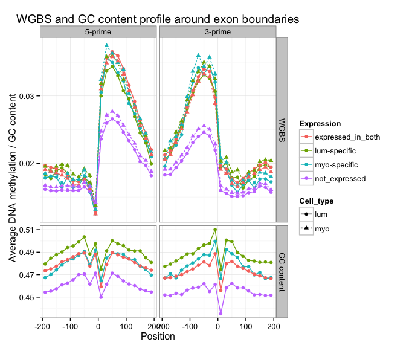
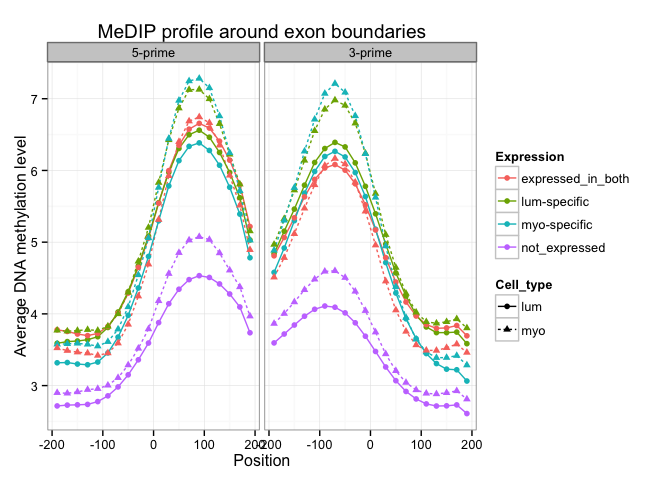
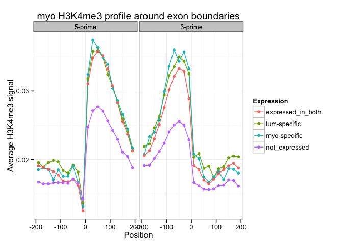
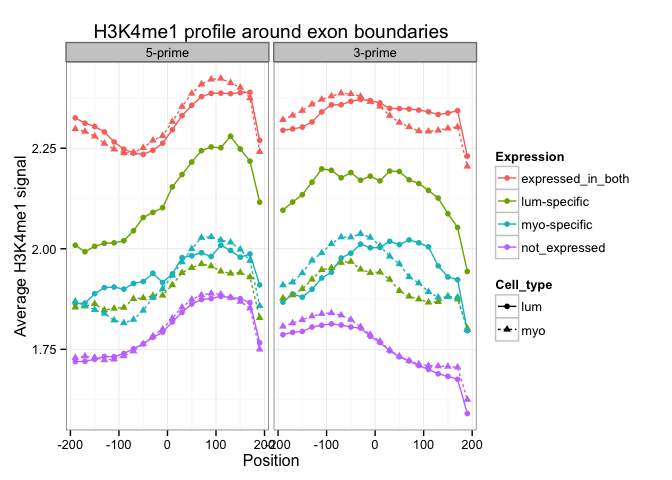
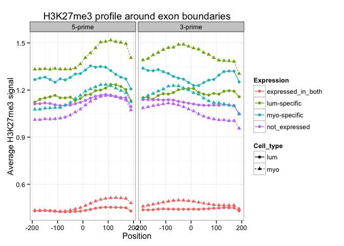
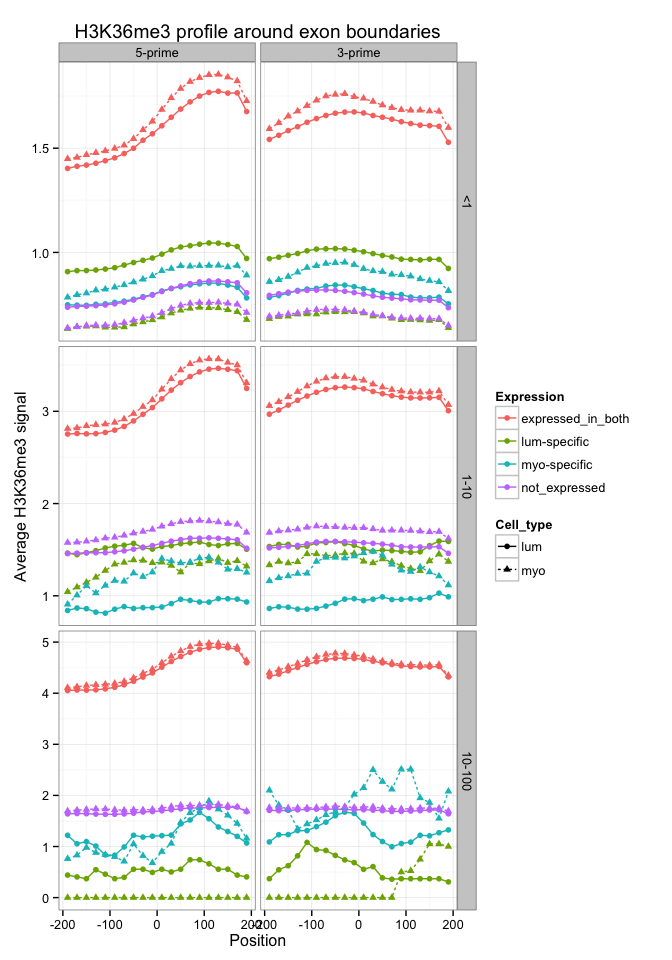
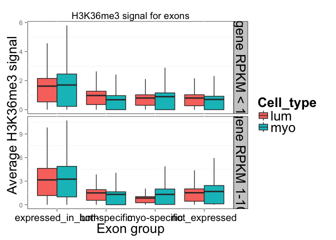

Epigenetic profile around exon boundaries   
==============================================
Gloria Li         
Wed Jul  2 17:43:28 2014             

<!-- re-knit after modify exonProfile.R script -->

1. Profile epigenetic signals (DNA methylation, H3K4me3, H3K4me1, H3K9me3, H3K27me3, H3K36me3) around exon boundaries, i.e. exon 3-prime/5-prime +/- 200bp.            
  * WGBS: lumRM066 and myoRM045 bismark fractional methylation calls.            
  * MeDIP: lumRM035 and myoRM035 signals from wig files.   
  * H3K4me3: myoRM080 wig file, no libraries for lum available.   
  * H3K4me1, H3K9me3, H3K27me3, H3K36me3: lumRM080 and myoRM080 wig files.      

2. Use exon expression and isoform analysis in RM084 lum and Rm084 myo to divide exons into four categories:    
  * exons expressed in both cell types: positive control      
  * lum-specific exons: only expressed in lum cells          
  * myo-specific exons: only expressed in myo cells     
  * exons not expressed in either cell types: negative control    
  
3. If the epigenetic mark is associated with the isoform event, we would expect in lum cells, its signal profile for lum-specific exons is similar to expressed in both exons, and myo-specific exons similar to not expressed exons, and a reversed pattern in myo cells.       

### DNA methylation profile with WGBS at exon boundaries
* Exons expressed in both cell types and exons not expressed in either cell type have distinct DNA methylation profiles.       
* Profiles for isoform exons are close to exons expressed in both, without obvious distinction between two cell types.        

 

### DNA methylation profile with MeDIP at exon boundaries 
* MeDIP signals are normalized between lum and myo libraries based on the sum of signals of all profiled regions.         
* DNA methylation profiles are similar to results from WGBS, but the dip at exon 5-prime end is not as clear.        
* Again no distinction between cell types for isoform exons.            

 

### H3K4me3 profile at exon boundaries  
* No H3K4me3 libraries available for lum cells.     
* H3K4me3 profiles match DNA methylation profile well.       
* For myo H3K4me3 signals, expressed in both and not expressed in either exons have different profiles, but no obvious differences are observed between lum-specific and myo-specific exons.       

 

### H3K4me1 profile at exon boundaries  
* H3K4me1 signals are normalized between lum and myo libraries based on the sum of signals of all profiled regions.          
* Expressed in both exons and not expressed exons have distinct signal levels.                      
* In myo cells, profiles for the two types of isoform exons are similar.    
* In lum cells, we do see expected pattern, i.e. myo-specific exons closer to not expressed exons and lum-specific exons closer to expressed in both exons.            

 

### H3K9me3 profile at exon boundaries  
* H3K9me3 signals are normalized between lum and myo libraries based on the sum of signals of all profiled regions.         
* Expressed in both exons and not expressed exons have distinct signal levels.                                 
* In lum cells, profiles for the two types of isoform exons are similar.    
* In myo cells, we do see expected pattern, i.e. lum-specific exons closer to not expressed exons and myo-specific exons closer to expressed in both exons. This pattern is the opposite of H3K4me1.                     

 

### H3K27me3 profile at exon boundaries  
* H3K27me3 signals are normalized between lum and myo libraries based on the sum of signals of all profiled regions.         
* In both cell types, isoform exons have signal levels close to not expressed exons.             

 

### H3K36me3 profile at exon boundaries  
* H3K36me3 signals are normalized between lum and myo libraries based on the sum of signals of all profiled regions.         
* Exons expressed in both cell types have a distinct profile than the rest of exons. 
* Isoform exons have similar profile as not expressed exons, similar to H3K27me3.                  

 

### H3K36me3 signals for exon bodies   
* H3K36me3 signals are normalized between lum and myo libraries based on the sum of signals of all exons.         
* Isoform exons have similar signal level as not expressed exons, significantly lower than signals in exons expressed in both cell types.      
* In gene RPKM = 1-10 group, lum-specific exons have higher signal level in lum and myo-specific exons are higher in myo, however, this observation was not reproduced in gene RPKM < 1 group, probably due to the extremely low expression level.       
* There are only 2 lum-specific exons with gene RPKM > 10, therefore, discard this group from plotting.        

 

