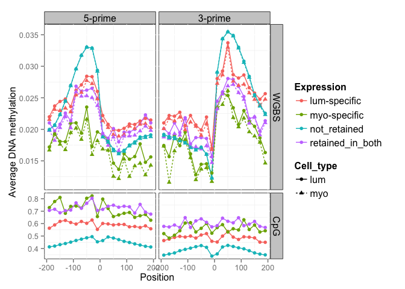

Epigenetic profile for intron retention   
==============================================
Gloria Li         
Wed Jul  2 17:42:41 2014             

<!-- re-knit after modify intronProfile.R & intronProfile.v2.R script -->

1. Profile epigenetic signals (DNA methylation, H3K4me3, H3K4me1, H3K9me3, H3K27me3, H3K36me3) around exon boundaries, i.e. exon 3-prime/5-prime +/- 200bp.            
  * WGBS: lumRM066 and myoRM045 bismark fractional methylation calls.            
  * MeDIP: lumRM035 and myoRM035 signals from wig files.   
  * H3K4me3: myoRM080 wig file, no libraries for lum available.   
  * H3K4me1, H3K9me3, H3K27me3, H3K36me3: lumRM080 and myoRM080 wig files.      

2. Method 1. Use IR events in RM084 lum and myo to divide introns into four categories:    
  * introns retained in both cell types: retained in both lum084 and myo084      
  * lum-specific IR: only retained in lum084 cells          
  * myo-specific IR: only retained in myo084 cells     
  * introns not retained in either cell types: all other introns         
  
3. Method 2. Treat lum and myo independently:   
  * lum cells:   
    + IR: IR in lum084  
    + non-IR: all other introns    
  * myo cells:  
    + IR: IR in myo084  
    + non-IR: all other introns      
    
### DNA methylation profile with WGBS at intron boundaries
* DNA methylation in IR seem to be more flat at intron boundaries than non-IR.   
* There is no evident distinction between lum and myo in lum-specific and myo-specific retained introns.     
* Retained introns seem to have higher No. of CpGs than not retained introns.      

  

### DNA methylation profile with MeDIP at intron boundaries
* MeDIP results are similar to WGBS.     

  

### H3K36me3 signals for intron bodies   
* Cell type specific retained introns in the 1st figure shows an increase in H3K36me3 signal, but not statistically significant. Also not retained introns do not show decrease in H3K36me3 when gene RPKM > 1.     
* In the 2nd figure, we see opposite patterns in different gene RPKM group: 
  + gene RPKM < 1: increase in H3K36me3 in retained introns, statistically significant (p-value: 4.6331 &times; 10-9 in lum, 0.0039 in myo)   
  + gene RPKM = 1-10: no significant difference between IR and non-IR (p-value: 0.0666 in lum, 0.1712 in myo)
  + gene RPKM = 10-100: decrease in H3K36me3 in retained introns, statistically significant (p-value: 1.6822 &times; 10-24 in lum, 7.137 &times; 10-15 in myo)

  

### H3K4me1 profile at intron boundaries  
* H3K4me1 signal increases for retained introns. 
* There is a slight difference for lum-specific and myo-specific IR between lum and myo cells.       

  

### H3K4me3 profile at intron boundaries  
* No H3K4me3 libraries available for lum cells.    
* H3K4me3 signal increases for retained introns.     

  

### H3K9me3 profile at intron boundaries  
* It seems lum and myo cells show opposite trend in terms of H3K9me3 signal in IR vs non-IR.     

  

### H3K27me3 profile at intron boundaries  
* H3K27me3 signal decreases for retained introns.     
* H3K27me3 signal levels are different for lum-specific and myo-specific IR between lum and myo cells, but there is too much fluctuation, eps. in myo-specific IRs, probably due to small sample size.       

  

