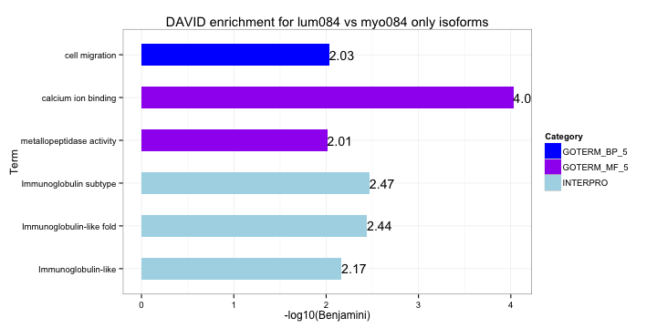
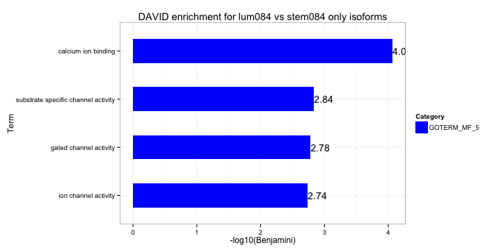
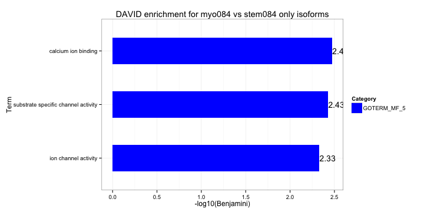

REMC isoform analysis - junctions
========================================================

Gloria Li         
Wed Mar 12 18:00:27 2014 
<!-- re-knit after modify junction.R script -->

## Junction coverage and RPKM distribution

## Validate previously identified isoform genes with junctions

* Approach: For each AS gene in the previous pairwise comparison
  * Junction coverage cutoff: sum of junction coverage of two samples > 3
  * Find junctions associated with this gene with enough coverage
  * Calculate junction RPKM fold change between the 2 samples
  * The highest junction fold change > 2 
  
* Results:  

  * About __60%__ persent of the genes have junctions with enough coverage for validation. Among them, __> 90%__ have junctions with more than 2-fold change in RPKM.             
  
<!-- html table generated in R 3.0.2 by xtable 1.7-1 package -->
<!-- Wed Mar 12 18:00:28 2014 -->
<TABLE border=1>
<TR> <TH>  </TH> <TH> No.isoforms </TH> <TH> with.junction.cov </TH> <TH> with.junction.support </TH>  </TR>
  <TR> <TD> lum084_myo084 </TD> <TD align="center"> 2381 </TD> <TD align="center"> 1479 </TD> <TD align="center"> 1365 </TD> </TR>
  <TR> <TD> lum084_stem084 </TD> <TD align="center"> 2429 </TD> <TD align="center"> 1632 </TD> <TD align="center"> 1551 </TD> </TR>
  <TR> <TD> myo084_stem084 </TD> <TD align="center"> 2427 </TD> <TD align="center"> 1504 </TD> <TD align="center"> 1422 </TD> </TR>
   </TABLE>

  
  * Enrichment of validated genes       
  
   

  
  * Some screenshot examples.       
    * ENSG00000170312: CDK1 (Cyclin-Dependent Kinase 1) play important regulatory roles in cell cycle control, is essential for G1/S and G2/M phase transitions of eukaryotic cell cycle.            
    
    * ENSG00000196208: GREB1 (Growth Regulation By Estrogen In Breast Cancer 1) an estrogen-responsive gene, that is an early response gene in the estrogen receptor-regulated pathway. It is thought to play an important role in hormone-responsive tissues and cancer. 
    
    
## Identify isoforms with junctions
Results from all below approaches __do not correlate well__ with previously identified isoforms from exon analysis. Problem with junction alignment resulting in no coverage for many junctions? 
### Fold change + junction RPKM cutoff
* Approach: 
  * junction RPKM fold change > 4 
  * one sample junction RPKM > 0.5, the other < 0.5 
  * exclude DE genes identified by DEfine (FRD = 0.015)
* Results: too many __false positive__ resulting from differential expression of the entire gene.         

<!-- html table generated in R 3.0.2 by xtable 1.7-1 package -->
<!-- Wed Mar 12 18:00:31 2014 -->
<TABLE border=1>
<TR> <TH>  </TH> <TH> No.junctions.2-fold </TH> <TH> No.junctions.RPKM.5 </TH> <TH> exclude.DE.genes </TH> <TH> No.AS.genes </TH> <TH> previous.genes </TH> <TH> intersect </TH>  </TR>
  <TR> <TD> lum084_myo084 </TD> <TD align="center"> 219339 </TD> <TD align="center"> 29392 </TD> <TD align="center"> 22762 </TD> <TD align="center"> 8387 </TD> <TD align="center"> 2381 </TD> <TD align="center"> 814 </TD> </TR>
  <TR> <TD> lum084_stem084 </TD> <TD align="center"> 237922 </TD> <TD align="center"> 38434 </TD> <TD align="center"> 28825 </TD> <TD align="center"> 9114 </TD> <TD align="center"> 2429 </TD> <TD align="center"> 1023 </TD> </TR>
  <TR> <TD> myo084_stem084 </TD> <TD align="center"> 217178 </TD> <TD align="center"> 28540 </TD> <TD align="center"> 21609 </TD> <TD align="center"> 8009 </TD> <TD align="center"> 2427 </TD> <TD align="center"> 790 </TD> </TR>
   </TABLE>

### DEfine + junction RPKM cutoff
* Approach: 
  * DEfine on junction RPKM (FDR = 0.015)
  * one sample junction RPKM > 0.5, the other < 0.5 
  * exclude DE genes identified by DEfine (FRD = 0.015)
* Results: seems too __stringent__  

<!-- html table generated in R 3.0.2 by xtable 1.7-1 package -->
<!-- Wed Mar 12 18:00:31 2014 -->
<TABLE border=1>
<TR> <TH>  </TH> <TH> No.junctions.DEfine </TH> <TH> No.junctions.RPKM.5 </TH> <TH> exclude.DE.genes </TH> <TH> No.AS.genes </TH> <TH> previous.genes </TH> <TH> intersect </TH>  </TR>
  <TR> <TD> lum084_myo084 </TD> <TD align="center"> 10919 </TD> <TD align="center"> 4903 </TD> <TD align="center"> 1172 </TD> <TD align="center"> 570 </TD> <TD align="center"> 2381 </TD> <TD align="center">  81 </TD> </TR>
  <TR> <TD> lum084_stem084 </TD> <TD align="center"> 14627 </TD> <TD align="center"> 6984 </TD> <TD align="center"> 1248 </TD> <TD align="center"> 514 </TD> <TD align="center"> 2429 </TD> <TD align="center"> 105 </TD> </TR>
  <TR> <TD> myo084_stem084 </TD> <TD align="center"> 12546 </TD> <TD align="center"> 5099 </TD> <TD align="center"> 933 </TD> <TD align="center"> 486 </TD> <TD align="center"> 2427 </TD> <TD align="center"> 103 </TD> </TR>
   </TABLE>

### Relative junction expression
* Approach: 
  * calculate relative junction expression levels: junction RPKM / gene RPKM
  * fold change in relative junction expression > 4
  * relative junction expression > 0.5 in at least one sample 
  * gene RPKM > 0.1 in both samples
  * exclude DE genes identified by DEfine (FRD = 0.015)             
  
* Results: in general __better__ than other approaches, but very sensitive to __genes with small RPKM__.    

<!-- html table generated in R 3.0.2 by xtable 1.7-1 package -->
<!-- Wed Mar 12 18:00:31 2014 -->
<TABLE border=1>
<TR> <TH>  </TH> <TH> relative.4-fold </TH> <TH> junctions.relative.5 </TH> <TH> geneRPKM.1 </TH> <TH> exclude.DE.genes </TH> <TH> No.AS.genes </TH> <TH> previous.genes </TH> <TH> intersect </TH>  </TR>
  <TR> <TD> lum084_myo084 </TD> <TD align="center"> 82346 </TD> <TD align="center"> 33171 </TD> <TD align="center"> 6516 </TD> <TD align="center"> 6034 </TD> <TD align="center"> 1835 </TD> <TD align="center"> 2381 </TD> <TD align="center"> 417 </TD> </TR>
  <TR> <TD> lum084_stem084 </TD> <TD align="center"> 94920 </TD> <TD align="center"> 37375 </TD> <TD align="center"> 6678 </TD> <TD align="center"> 6075 </TD> <TD align="center"> 1886 </TD> <TD align="center"> 2429 </TD> <TD align="center"> 402 </TD> </TR>
  <TR> <TD> myo084_stem084 </TD> <TD align="center"> 78794 </TD> <TD align="center"> 32372 </TD> <TD align="center"> 5968 </TD> <TD align="center"> 5570 </TD> <TD align="center"> 1645 </TD> <TD align="center"> 2427 </TD> <TD align="center"> 426 </TD> </TR>
   </TABLE>

### Combine exons and juntions
* Approach: 
  * exon DE identified by DEfine (FDR = 0.015)
  * exon with at least one junction identified by DEfine (FDR = 0.03)
  * the exon and the junction change in the same direction
  * exclude DE genes identified by DEfine (FRD = 0.015)
* Results: still too __stringent__ even with a more relaxed FDR cutoff 

<!-- html table generated in R 3.0.2 by xtable 1.7-1 package -->
<!-- Wed Mar 12 18:00:31 2014 -->
<TABLE border=1>
<TR> <TH>  </TH> <TH> DEfine.exons </TH> <TH> exclude.DE.genes </TH> <TH> with.annotated.junction </TH> <TH> with.junction.support </TH>  </TR>
  <TR> <TD> lum084_myo084 </TD> <TD align="center"> 43427 </TD> <TD align="center"> 29561 </TD> <TD align="center"> 27987 </TD> <TD align="center"> 622 </TD> </TR>
  <TR> <TD> lum084_stem084 </TD> <TD align="center"> 51457 </TD> <TD align="center"> 34521 </TD> <TD align="center"> 32660 </TD> <TD align="center"> 1131 </TD> </TR>
  <TR> <TD> myo084_stem084 </TD> <TD align="center"> 45615 </TD> <TD align="center"> 30066 </TD> <TD align="center"> 28248 </TD> <TD align="center"> 537 </TD> </TR>
   </TABLE>

