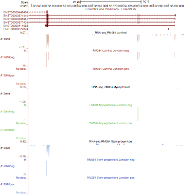

REMC isoform analysis - junctions
========================================================

Gloria Li         
`r date()` 

<!-- re-knit after modify junction_valid_new.R or junction_other.R script -->
```{r include = FALSE}
library(knitr)
opts_chunk$set(message=FALSE, echo = FALSE, warning = FALSE)
```

```{r data}
setwd("~/快盘/REMC/junction/all/")
load("junction_valid.Rdata")
library(ggplot2)
library(VennDiagram)
library(xtable)
```

## Validate previously identified isoforms with junction RPKM
  * Previous isoform identification with DE exons
    * DE exons by DEfine FDR = 0.015
    * Exon RPKM $\ge$ 10% gene RPKM in one sample & $\le$ 1% in the other
    * Gene RPKM of both samples > 0.005 
    * Exclude DE genes by DEfine FDR = 0.015

  * Validation: For each isoform exon in the previous pairwise comparison
    * Find junctions associated with this exon with enough coverage, i.e. sum of junction coverage of two samples $\ge$ 1
    * Identify junctions that RPKM change in the same direction as the exon
    * Junction RPKM > 0.1 in one sample and < 0.1 in the other      
  
## Results:  

### Compare strand specific and non-strand specific libraries

  * Non-strand specific libraries (RM080 and RM035) have __much lower__ junction coverage than strand specific libraries (RM084).    
  * Junction RPKM between strand specific and non-strand specific libraries are much more comparable.       

```{r strand-specifc}
coverage <- data.frame(Coverage = c(junction$lum084N, junction$myo084N, junction$stem084N, junction$lum080N, junction$myo080N, junction$stem080N, junction$lum035N, junction$myo035N), 
                       Sample = factor(rep(c("lum084", "myo084", "stem084", "lum080", "myo080", "stem080", "lum035", "myo035"), each = nrow(junction)), levels = c("lum035", "myo035", "lum080", "myo080", "stem080", "lum084", "myo084", "stem084")), 
                       Donor = c(rep(c("RM084", "RM080"), each = 3*nrow(junction)), rep("RM035", 2*nrow(junction))))
(coverage_box <- ggplot(coverage, aes(x = Sample, y = Coverage, fill = Donor)) + 
   geom_boxplot() + 
   theme_bw() + 
   ggtitle("Boxplot of junction coverage") + 
   coord_cartesian(ylim = c(0, 200)))
rpkm <- data.frame(RPKM = c(junction$lum084rpkm, junction$myo084rpkm, junction$stem084rpkm, junction$lum080rpkm, junction$myo080rpkm, junction$stem080rpkm, junction$lum035rpkm, junction$myo035rpkm), 
                       Sample = factor(rep(c("lum084", "myo084", "stem084", "lum080", "myo080", "stem080", "lum035", "myo035"), each = nrow(junction)), levels = c("lum035", "myo035", "lum080", "myo080", "stem080", "lum084", "myo084", "stem084")), 
                       Donor = c(rep(c("RM084", "RM080"), each = 3*nrow(junction)), rep("RM035", 2*nrow(junction))))
(rpkm_box <- ggplot(rpkm, aes(x = Sample, y = RPKM, fill = Donor)) + 
   geom_boxplot() + 
   theme_bw() + 
   ggtitle("Boxplot of junction RPKM") + 
   coord_cartesian(ylim = c(0, 20)))
```

### Junction RPKM clustering

  * Sample clustering on junction RPKM with spearman correlation shows clustering on cell types as well.         
  
```{r cluster}
c <- read.delim("~/快盘/REMC/junction/all/junction_cor.txt", as.is = T)
d <- as.dist(1 - c)
hc <- as.dendrogram(hclust(d, method = "complete"))
plot(hc, main = "Junction RPKM clustering", horiz = TRUE)
```

### Isoform junction validation

  * For strand specific libraries, about __40%__ of previously identified exons (__50%__ genes) have junctions with enough coverage for validation. However, __more than 99%__ of them have junction support.          
  * For non-strand specific libraries, only about __20-30%__ isoform genes have enough junction coverage for validation, and among them __75-80%__ genes have support from junction reads.  
  * Venn diagram of isoforms in RM080 is similar to RM084, with the common isoforms shared by different cell types having less ratio of being validated.    
  * Venn diagram of isoforms between same cell types in different individuals show similar patterns. The __majority__ of isoforms are __shared__ among different individual. However, isoforms in strand specific libraries (RM084) have __much higher__ ratio of being validated.       
  
```{r validate, results='asis'}
junction_valid <- xtable(junction_valid)
align(junction_valid) <- "lcccccc"
print(junction_valid, type = "html", include.rownames = T)

# RM084
isoform_RM084_all <- list(lum084_myo084 = lum084_myo084_isoform_all_gene$id, lum084_stem084 = lum084_stem084_isoform_all_gene$id, myo084_stem084 = myo084_stem084_isoform_all_gene$id)
plot.new()
venn_RM084_all <- venn.diagram(isoform_RM084_all, filename = NULL, fill = c("red", "blue", "green"), main = "Venn diagram of all RM084 isoforms")
grid.draw(venn_RM084_all)
isoform_RM084_valid <- list(lum084_myo084 = as.character(lum084_myo084_isoform_valid_gene$gene), lum084_stem084 = as.character(lum084_stem084_isoform_valid_gene$gene), myo084_stem084 = as.character(myo084_stem084_isoform_valid_gene$gene))
plot.new()
venn_RM084_valid <- venn.diagram(isoform_RM084_valid, filename = NULL, fill = c("red", "blue", "green"), main = "Venn diagram of validated RM084 isoforms")
grid.draw(venn_RM084_valid)
# RM080
isoform_RM080_all <- list(lum080_myo080 = lum080_myo080_isoform_all_gene$id, lum080_stem080 = lum080_stem080_isoform_all_gene$id, myo080_stem080 = myo080_stem080_isoform_all_gene$id)
plot.new()
venn_RM080_all <- venn.diagram(isoform_RM080_all, filename = NULL, fill = c("red", "blue", "green"), main = "Venn diagram of all RM080 isoforms")
grid.draw(venn_RM080_all)
isoform_RM080_valid <- list(lum080_myo080 = as.character(lum080_myo080_isoform_valid_gene$gene), lum080_stem080 = as.character(lum080_stem080_isoform_valid_gene$gene), myo080_stem080 = as.character(myo080_stem080_isoform_valid_gene$gene))
plot.new()
venn_RM080_valid <- venn.diagram(isoform_RM080_valid, filename = NULL, fill = c("red", "blue", "green"), main = "Venn diagram of validated RM080 isoforms")
grid.draw(venn_RM080_valid)
# lum vs myo 
isoform_lum_myo_all <- list(RM084 = lum084_myo084_isoform_all_gene$id, RM080 = lum080_myo080_isoform_all_gene$id, RM035 = lum035_myo035_isoform_all_gene$id)
plot.new()
venn_lum_myo_all <- venn.diagram(isoform_lum_myo_all, filename = NULL, fill = c("red", "blue", "green"), main = "Venn diagram of all lum vs myo isoforms")
grid.draw(venn_lum_myo_all)
isoform_lum_myo_valid <- list(RM084 = lum084_myo084_isoform_valid_gene$gene, RM080 = lum080_myo080_isoform_valid_gene$gene, RM035 = lum035_myo035_isoform_valid_gene$gene)
plot.new()
venn_lum_myo_valid <- venn.diagram(isoform_lum_myo_valid, filename = NULL, fill = c("red", "blue", "green"), main = "Venn diagram of valid lum vs myo isoforms")
grid.draw(venn_lum_myo_valid)
# lum vs stem 
isoform_lum_stem_all <- list(RM084 = lum084_stem084_isoform_all_gene$id, RM080 = lum080_stem080_isoform_all_gene$id)
plot.new()
venn_lum_stem_all <- venn.diagram(isoform_lum_stem_all, filename = NULL, fill = c("red", "blue"), main = "Venn diagram of all lum vs stem isoforms")
grid.draw(venn_lum_stem_all)
isoform_lum_stem_valid <- list(RM084 = lum084_stem084_isoform_valid_gene$gene, RM080 = lum080_stem080_isoform_valid_gene$gene)
plot.new()
venn_lum_stem_valid <- venn.diagram(isoform_lum_stem_valid, filename = NULL, fill = c("red", "blue"), main = "Venn diagram of valid lum vs stem isoforms")
grid.draw(venn_lum_stem_valid)
# myo vs stem 
isoform_myo_stem_all <- list(RM084 = myo084_stem084_isoform_all_gene$id, RM080 = myo080_stem080_isoform_all_gene$id)
plot.new()
venn_myo_stem_all <- venn.diagram(isoform_myo_stem_all, filename = NULL, fill = c("red", "blue"), main = "Venn diagram of all myo vs stem isoforms")
grid.draw(venn_myo_stem_all)
isoform_myo_stem_valid <- list(RM084 = myo084_stem084_isoform_valid_gene$gene, RM080 = myo080_stem080_isoform_valid_gene$gene)
plot.new()
venn_myo_stem_valid <- venn.diagram(isoform_myo_stem_valid, filename = NULL, fill = c("red", "blue"), main = "Venn diagram of valid myo vs stem isoforms")
grid.draw(venn_myo_stem_valid)
```
  
### No. of exons for DE genes / isoform genes    
  * DE genes have roughly the same No. of exons as all expressed genes.             
  * Identified isoforms have slightly more No. of exons than DE genes and all expressed genes. 
  
```{r Nexon}
load("~/快盘/REMC/junction/all/junction_valid_RM084.Rdata")
plot(c(0, 50), c(0, 0.08), type = "n", main = "No. of exons in DE genes and isoforms", xlab = "No. of exons", ylab = "density")
lines(density(na.omit(Nexon[Nexon$id %in% RM084gene[(RM084gene$lum084 + RM084gene$myo084 + RM084gene$stem084) > 0.005,]$id,]$Nexon)), col = 1, lty = 1, lwd = 5)
lines(density(na.omit(lum084_myo084_DE$Nexon)), col = 2, lty = 1, lwd = 3)
lines(density(na.omit(lum084_stem084_DE$Nexon)), col = 3, lty = 1, lwd = 3)
lines(density(na.omit(myo084_stem084_DE$Nexon)), col = 4, lty = 1, lwd = 3)
lines(density(na.omit(lum084_myo084_isoform_all_gene$Nexon)), col = 2, lty = 3, lwd = 3)
lines(density(na.omit(lum084_stem084_isoform_all_gene$Nexon)), col = 3, lty = 3, lwd = 3)
lines(density(na.omit(myo084_stem084_isoform_all_gene$Nexon)), col = 4, lty = 3, lwd = 3)
legend("topleft", c("all expressed genes", "DE genes", "isoforms"), col = 1, lty = c(1, 1, 3), lwd = 5, cex = 0.8)
legend("topright", c("all expressed genes", "lum084 vs myo084", "lum084 vs stem084", "myo084 vs stem084"), col = 1:4, lty = 1, lwd = 5, cex = 0.8)
```
  
### Isoform genes in DE genes with small No. of exons

  If a gene has only a few exons ($\le$ 5 exons), and one exon is absent in one sample, i.e. isoform, the absence can bias the overall gene RPKM and this gene may be identified as a DE gene. Check if there are such cases.               
  For DE gene with small No. of exons:           
  * If it is in fact an isoform, not DE gene, only one / few exons in this gene should be differentially expressed.         
  * If it is a truly DE gene, all exons should be differentially expressed.       
                  
  Proportion of DE exons for DE genes with $\le$ 5 exons: (DE exons: fold change $\ge$ 2)      
  * Proportion of DE exons < 1 for the few genes are due to exons not expressed in either samples.         
  * __There is no evidence for isoforms genes identified as DE genes.__                   

```{r DE_isoform}
plot(c(0, 1), c(0, 30), type = "n", main = "DE exons in DE genes", xlab = "Proportion of DE exons in DE genes", ylab = "density")
lines(density(lum084_myo084_DE5$DEexons / lum084_myo084_DE5$Nexon), col = 2, lty = 1, lwd = 3)
lines(density(lum084_stem084_DE5$DEexons / lum084_stem084_DE5$Nexon), col = 3, lty = 1, lwd = 3)
lines(density(myo084_stem084_DE5$DEexons / myo084_stem084_DE5$Nexon), col = 4, lty = 1, lwd = 3)
legend("topleft", c("lum084 vs myo084", "lum084 vs stem084", "myo084 vs stem084"), col = 2:4, lty = 1, lwd = 5, cex = 0.8)
```
  
### Position of isoform exons on the gene   
  * In general, there are more alternative spliced exons at the __two ends__ of genes.    
  
```{r exon_pos}
# pdf("~/快盘/REMC/figures/exon_position.pdf")
plot(c(0, 100), c(0, 0.015), type = "n", xlab = "position along the gene", ylab = "density")
lines(density(na.omit(lum084_myo084_isoform_all$exon_pos)), col = rgb(200,50,0, maxColorValue = 255), lty = 1, lwd = 3)
lines(density(na.omit(lum084_stem084_isoform_all$exon_pos)), col = rgb(0,100,200, maxColorValue = 255), lty = 1, lwd = 3)
lines(density(na.omit(myo084_stem084_isoform_all$exon_pos)), col = rgb(50,200,50, maxColorValue = 255), lty = 1, lwd = 3)
legend("bottomright", c("lum084 vs myo084", "lum084 vs stem-like084", "myo084 vs stem-like084"), col = c(rgb(200,50,0, maxColorValue = 255), rgb(0,100,200, maxColorValue = 255), rgb(50,200,50, maxColorValue = 255)), lty = 1, lwd = 5)
# dev.off()
# # frequency of exon usage in all transcripts for multi-transcript genes
# library(plyr)
# exons <- read.delim("~/快盘/hg19/hg19v65_exons", head = F, as.is = T)
# exons$id <- paste0("chr", exons$V3, ":", exons$V4, "-", exons$V5, "<", exons$V6, "_", exons$V1)
# Ntranscript <- ddply(exons, ~ V1, summarize, Ntranscript = length(unique(V2)))
# rownames(Ntranscript) <- Ntranscript$V1
# exon <- ddply(exons, ~ id, summarize, transcript = length(unique(V2)))
# exons <- exons[!duplicated(exons$id),]
# rownames(exons) <- exons$id
# exon[, c("gene", "start", "end", "strand")] <- exons[exon$id, c("V1", "V4", "V5", "V6")]
# exon$pos <- (as.numeric(exon$start) + as.numeric(exon$end))/2
# exon$Ntranscript <- Ntranscript[exon$gene, "Ntranscript"]
# exon$geneStart <- ensembl[exon$gene, "start"]
# exon$geneEnd <- ensembl[exon$gene, "end"]
# exon$exon_pos <- NA
# exon[exon$strand == 1, ]$exon_pos <- (exon[exon$strand == 1, ]$pos - exon[exon$strand == 1, ]$geneStart) / (exon[exon$strand == 1, ]$geneEnd - exon[exon$strand == 1, ]$geneStart) * 100
# exon[exon$strand == -1, ]$exon_pos <- 100 - (exon[exon$strand == -1, ]$pos - exon[exon$strand == -1, ]$geneStart) / (exon[exon$strand == -1, ]$geneEnd - exon[exon$strand == -1, ]$geneStart) * 100
# exon$percentTrans <- exon$transcript / exon$Ntranscript
# exon$pos_bin <- with(exon, cut(exon_pos, breaks = seq(0, 100, by = 5)))
# pdf("exonUsage.pdf")
# # smoothScatter(exon[exon$Ntranscript != 1, ]$exon_pos, exon[exon$Ntranscript != 1, ]$percentTrans, main = "Exon usage along the gene for multi-transcript genes", xlab = "Exon position along the gene", ylab = "Frequency of exon usage in transcripts")
# boxplot(exon[exon$Ntranscript != 1, ]$percentTrans ~ exon[exon$Ntranscript != 1, ]$pos_bin, main = "Exon usage along the gene for multi-transcript genes", xlab = "Exon position along the gene", ylab = "Frequency of exon usage in transcripts")
# dev.off()
```
  * Exon usage along the gene for all multi-transcript genes            

  
### Venn Diagram with average expression level, average No. of exons and average exon length  
  * Common isoforms shared among different comparisons have __much lower ratio of being validated__.        
  * Isoforms have __much lower__ expression level than all expressed genes.          
  * On average, common isoforms between different comparisons have __lower expression level__ than comparison-specific isoforms.                 
  * In general, compared to all isoforms identified, validated isoforms do __not__ have lower expression levels. Our validation approach is not biased towards highly expressed genes.        
  * Average No. of exons are very __similar__ in different sections of the Venn diagram, between all, validated isoforms and all expressed genes.        
  * Average length of isoform exons are __shorter__ than all expressed genes, and validated isoform exons are __sligtly shorter__ than all isoforms in general but the difference is not statistically significant (p = 0.39).         
  
```{r venn, fig.height = 6, fig.width = 6}
x <- c(0.2, 0.85, 0.5, 0.5, 0.7, 0.3, 0.5, 0.1)
y <- c(0.75, 0.75, 0.2, 0.85, 0.45, 0.45, 0.55, 0.1)
venn_all <- venn.diagram(isoform_all, filename = NULL, fill = rep("white", 3), cex = 0, alpha = 0, col = c(rgb(200,50,0, maxColorValue = 255), rgb(0,100,200, maxColorValue = 255), rgb(50,200,50, maxColorValue = 255)), margin = 0.06, cat.cex = 1.8, category.names = c("lum_myo", "lum_stem-like", "myo_stem-like"), cat.dist = c(-0.01, -0.01, 0.01))
venn_valid <- venn.diagram(isoform_valid, filename = NULL, fill = rep("white", 3), cex = 0, alpha = 0, col = c(rgb(200,50,0, maxColorValue = 255), rgb(0,100,200, maxColorValue = 255), rgb(50,200,50, maxColorValue = 255)), margin = 0.06, cat.cex = 1.8, category.names = c("lum_myo", "lum_stem-like", "myo_stem-like"), cat.dist = c(-0.01, -0.01, 0.01))
venn_theme <- theme(plot.background = element_rect(fill = "transparent"), panel.background = element_rect(color = "black", fill = "transparent"), panel.border = element_blank(), panel.grid.major = element_blank(), panel.grid.minor = element_blank(), panel.margin = unit(0, "lines"), 
                    strip.text = element_text(color = "black", size = 20, hjust = 0.5, vjust = 0.5), strip.background = element_rect(color = "black"), axis.title = element_blank(), axis.text = element_blank(), axis.ticks = element_blank(), 
                    legend.position = c(0.85, 0.2), legend.text = element_text(size = 20), legend.background = element_blank(), legend.title=element_blank(), legend.key = element_blank())

isoform_all_N <- data.frame(data = "No. of isoform genes", x= x[1:7], y = y[1:7], N = c(nrow(all_lm_only), nrow(all_ls_only), nrow(all_ms_only), nrow(all_lm_ls_not_ms), nrow(all_ls_ms_not_lm), nrow(all_lm_ms_not_ls), nrow(all_lm_ls_ms))) 
isoform_valid_N <- data.frame(data = "No. of isoform genes", x= x[1:7], y = y[1:7], N = c(nrow(valid_lm_only), nrow(valid_ls_only), nrow(valid_ms_only), nrow(valid_lm_ls_not_ms), nrow(valid_ls_ms_not_lm), nrow(valid_lm_ms_not_ls), nrow(valid_lm_ls_ms))) 
isoform_all_N <- data.frame(data = "No. of isoform genes", x= x[1:7], y = y[1:7], N = c(nrow(all_lm_only), nrow(all_ls_only), nrow(all_ms_only), nrow(all_lm_ls_not_ms), nrow(all_ls_ms_not_lm), nrow(all_lm_ms_not_ls), nrow(all_lm_ls_ms))) 
isoform_valid_N <- data.frame(data = "No. of isoform genes", x= x[1:7], y = y[1:7], N = c(nrow(valid_lm_only), nrow(valid_ls_only), nrow(valid_ms_only), nrow(valid_lm_ls_not_ms), nrow(valid_ls_ms_not_lm), nrow(valid_lm_ms_not_ls), nrow(valid_lm_ls_ms))) 
(bubble_all_N <- ggplot(isoform_all_N) + 
   geom_point(aes(x, y, size = N), color = "red") + 
   scale_x_continuous(limits = c(0, 1)) + 
   scale_y_continuous(limits = c(0, 1)) + 
   scale_size(limits = c(200, 1500), range = c(5, 20)) + 
   facet_wrap(~ data) + 
   venn_theme)
grid.draw(venn_all)
(bubble_valid_N <- ggplot(isoform_valid_N) + 
   geom_point(aes(x, y, size = N), color = "red") + 
   scale_x_continuous(limits = c(0, 1)) + 
   scale_y_continuous(limits = c(0, 1)) + 
   scale_size(limits = c(200, 1500), range = c(5, 20)) + 
   facet_wrap(~ data) + 
   venn_theme)
grid.draw(venn_valid)

# Venn diagram with average gene rpkm
isoform_all_rpkm <- data.frame(data = "Average gene RPKM", x= x, y = y, RPKM = c(mean(c(all_lm_only$lum084, all_lm_only$myo084)), mean(c(all_ls_only$lum084, all_ls_only$stem084)), mean(c(all_ms_only$myo084, all_ms_only$stem084)), mean(c(all_lm_ls_not_ms$lum084, all_lm_ls_not_ms$myo084, all_lm_ls_not_ms$stem084)), mean(c(all_ls_ms_not_lm$lum084, all_ls_ms_not_lm$myo084, all_ls_ms_not_lm$stem084)), mean(c(all_lm_ms_not_ls$lum084, all_lm_ms_not_ls$myo084, all_lm_ms_not_ls$stem084)), mean(c(all_lm_ls_ms$lum084, all_lm_ls_ms$myo084, all_lm_ls_ms$stem084)), with(RM084gene, mean(c(lum084[lum084 > 0.1], myo084[myo084 > 0.1], stem084[stem084 > 0.1]))))) 
isoform_valid_rpkm <- data.frame(data = "Average gene RPKM", x= x, y = y, RPKM = c(mean(c(valid_lm_only$lum084, valid_lm_only$myo084)), mean(c(valid_ls_only$lum084, valid_ls_only$stem084)), mean(c(valid_ms_only$myo084, valid_ms_only$stem084)), mean(c(valid_lm_ls_not_ms$lum084, valid_lm_ls_not_ms$myo084, valid_lm_ls_not_ms$stem084)), mean(c(valid_ls_ms_not_lm$lum084, valid_ls_ms_not_lm$myo084, valid_ls_ms_not_lm$stem084)), mean(c(valid_lm_ms_not_ls$lum084, valid_lm_ms_not_ls$myo084, valid_lm_ms_not_ls$stem084)), mean(c(valid_lm_ls_ms$lum084, valid_lm_ls_ms$myo084, valid_lm_ls_ms$stem084)), with(RM084gene, mean(c(lum084[lum084 > 0.1], myo084[myo084 > 0.1], stem084[stem084 > 0.1]))))) 
(bubble_all_rpkm <- ggplot(isoform_all_rpkm) + 
   geom_point(aes(x, y, size = RPKM), color = "red") + 
   scale_x_continuous(limits = c(0, 1)) + 
   scale_y_continuous(limits = c(0, 1)) + 
   scale_size_area(max_size = 30, breaks = c(0.2, 2, 20)) + 
   annotate("text", x = 0.13, y = 0.18, label = "all expressed genes", size = 6) + 
   facet_wrap(~ data) + 
   venn_theme)
grid.draw(venn_all)
(bubble_valid_rpkm <- ggplot(isoform_valid_rpkm) + 
   geom_point(aes(x, y, size = RPKM), color = "red") + 
   scale_x_continuous(limits = c(0, 1)) + 
   scale_y_continuous(limits = c(0, 1)) + 
   scale_size_area(max_size = 30, breaks = c(0.2, 2, 20)) + 
   annotate("text", x = 0.13, y = 0.18, label = "all expressed genes", size = 6) + 
   facet_wrap(~ data) + 
   venn_theme)
grid.draw(venn_valid)

# Venn diagram with average No. of exons
isoform_all_Nexon <- data.frame(data = "Average No. of exons per gene", x= x, y = y, No.exon = c(mean(all_lm_only$Nexon), mean(all_ls_only$Nexon), mean(all_ms_only$Nexon), mean(all_lm_ls_not_ms$Nexon), mean(all_ls_ms_not_lm$Nexon), mean(all_lm_ms_not_ls$Nexon), mean(all_lm_ls_ms$Nexon), mean(Nexon[RM084gene[(RM084gene$lum084 + RM084gene$myo084 + RM084gene$stem084) > 0.3, "id"], "Nexon"]))) 
isoform_valid_Nexon <- data.frame(data = "Average No. of exons per gene", x= x, y = y, No.exon = c(mean(valid_lm_only$Nexon), mean(valid_ls_only$Nexon), mean(valid_ms_only$Nexon), mean(valid_lm_ls_not_ms$Nexon), mean(valid_ls_ms_not_lm$Nexon), mean(valid_lm_ms_not_ls$Nexon), mean(valid_lm_ls_ms$Nexon), mean(Nexon[RM084gene[(RM084gene$lum084 + RM084gene$myo084 + RM084gene$stem084) > 0.3, "id"], "Nexon"]))) 
(bubble_all_Nexon <- ggplot(isoform_all_Nexon) + 
   geom_point(aes(x, y, size = No.exon), color = "red") + 
   scale_x_continuous(limits = c(0, 1)) + 
   scale_y_continuous(limits = c(0, 1)) + 
   scale_size(limits = c(9, 15), range = c(5, 25), breaks = c(10, 12)) + 
   annotate("text", x = 0.13, y = 0.18, label = "all expressed genes", size = 6) + 
   facet_wrap(~ data) + 
   venn_theme)
grid.draw(venn_all)
(bubble_valid_Nexon <- ggplot(isoform_valid_Nexon) + 
   geom_point(aes(x, y, size = No.exon), color = "red") + 
   scale_x_continuous(limits = c(0, 1)) + 
   scale_y_continuous(limits = c(0, 1)) + 
   scale_size(limits = c(9, 15), range = c(5, 25), breaks = c(10, 12)) + 
   annotate("text", x = 0.13, y = 0.18, label = "all expressed genes", size = 6) + 
   facet_wrap(~ data) + 
   venn_theme)
grid.draw(venn_valid)

# Venn diagram with average isoform exon length
exon_length <- read.delim("~/hg19/hg19v65_exons_for_genes.length", head = F, as.is = T)
exon_length$gene <- gsub("chr[0-9XY:-]+<[-]*1_", "", exon_length$V1)
isoform_all_exon_length <- data.frame(data = "Average exon length", x= x, y = y, exon_length = c(mean(all_lm_only$exon_length), mean(all_ls_only$exon_length), mean(all_ms_only$exon_length), mean(all_lm_ls_not_ms$exon_length), mean(all_ls_ms_not_lm$exon_length), mean(all_lm_ms_not_ls$exon_length), mean(all_lm_ls_ms$exon_length), mean(exon_length[exon_length$gene %in% RM084gene[(RM084gene$lum084 + RM084gene$myo084 + RM084gene$stem084) > 0.3, "id"], "V2"]))) 
isoform_valid_exon_length <- data.frame(data = "Average exon length", x= x, y = y, exon_length = c(mean(valid_lm_only$exon_length), mean(valid_ls_only$exon_length), mean(valid_ms_only$exon_length), mean(valid_lm_ls_not_ms$exon_length), mean(valid_ls_ms_not_lm$exon_length), mean(valid_lm_ms_not_ls$exon_length), mean(valid_lm_ls_ms$exon_length), mean(exon_length[exon_length$gene %in% RM084gene[(RM084gene$lum084 + RM084gene$myo084 + RM084gene$stem084) > 0.3, "id"], "V2"]))) 
(bubble_all_exon_length <- ggplot(isoform_all_exon_length) + 
   geom_point(aes(x, y, size = exon_length), color = "red") + 
   scale_x_continuous(limits = c(0, 1)) + 
   scale_y_continuous(limits = c(0, 1)) + 
   scale_size(limits = c(100, 400), range = c(5, 25), breaks = c(200, 300, 400)) + 
   annotate("text", x = 0.13, y = 0.18, label = "all expressed genes", size = 6) + 
   facet_wrap(~ data) + 
   venn_theme)
grid.draw(venn_all)
(bubble_valid_exon_length <- ggplot(isoform_valid_exon_length) + 
   geom_point(aes(x, y, size = exon_length), color = "red") + 
   scale_x_continuous(limits = c(0, 1)) + 
   scale_y_continuous(limits = c(0, 1)) + 
   scale_size(limits = c(100, 400), range = c(5, 25), breaks = c(200, 300, 400)) + 
   annotate("text", x = 0.13, y = 0.18, label = "all expressed genes", size = 6) + 
   facet_wrap(~ data) + 
   venn_theme)
grid.draw(venn_valid)

#pdf("~/快盘/REMC/figures/venn_all.pdf", width = 15, height = 15)
#vp1 <- viewport(x=0.25, y=0.75, width=0.5, height=0.5)
#pushViewport(vp1)
#print(bubble_all_N, newpage = F)
#grid.draw(venn_all)
#upViewport()
#vp2 <- viewport(x=0.75, y=0.75, width=0.5, height=0.5)
#pushViewport(vp2)
#print(bubble_all_rpkm, newpage = F)
#grid.draw(venn_all)
#upViewport()
#vp3 <- viewport(x=0.25, y=0.25, width=0.5, height=0.5)
#pushViewport(vp3)
#print(bubble_all_Nexon, newpage = F)
#grid.draw(venn_all)
#upViewport()
#vp4 <- viewport(x=0.75, y=0.25, width=0.5, height=0.5)
#pushViewport(vp4)
#print(bubble_all_exon_length, newpage = F)
#grid.draw(venn_all)
#upViewport()
#dev.off()
```

### Enrichment of all isoform genes and validated isoform genes for each section on the Venn diagram   
  * Multifunctional correction by ermineJ eliminates general terms and brings more specific terms. Use ermineJ for all GO analysis instead of DAVID.           

<!--
  * The enriched terms for validated isoforms are subsets of terms for all isoforms.              
  * Isoforms identified in lum084 vs myo084 only are enriched in glucuronidation related processes. Isoforms in lum084 vs stem084 only, and myo084 vs stem084 only isoforms do not have significantly enriched terms.         
  * Common isoforms identified in all three comparisons have more enriched terms than comparison-specific isoforms, while isoforms identified in only two comparisons have no significantly enriched terms at all.           
-->
#### summary

```{r enrich, fig.width=10, fig.height = 8}
lum084_myo084_isoform_all_GO <- read.delim("~/快盘/REMC/junction/all/Venn/lum084_myo084_isoform_all_gene_DAVID_GO.txt", as.is=T)
lum084_stem084_isoform_all_GO <- read.delim("~/快盘/REMC/junction/all/Venn/lum084_stem084_isoform_all_gene_DAVID_GO.txt", as.is=T)
myo084_stem084_isoform_all_GO <- read.delim("~/快盘/REMC/junction/all/Venn/myo084_stem084_isoform_all_gene_DAVID_GO.txt", as.is=T)
isoform_all_GO <- data.frame(Term = c(lum084_myo084_isoform_all_GO$Term, lum084_stem084_isoform_all_GO$Term, myo084_stem084_isoform_all_GO$Term), Benjamini = c(lum084_myo084_isoform_all_GO$Benjamini, lum084_stem084_isoform_all_GO$Benjamini, myo084_stem084_isoform_all_GO$Benjamini), CellType = c(rep("lum vs myo", nrow(lum084_myo084_isoform_all_GO)), rep("lum vs stem-like", nrow(lum084_stem084_isoform_all_GO)), rep("myo vs stem-like", nrow(myo084_stem084_isoform_all_GO))))
terms <- intersect(as.character(myo084_stem084_isoform_all_GO[myo084_stem084_isoform_all_GO$Benjamini <= 0.01, ]$Term), intersect(as.character(lum084_myo084_isoform_all_GO[lum084_myo084_isoform_all_GO$Benjamini <= 0.01, ]$Term), as.character(lum084_stem084_isoform_all_GO[lum084_stem084_isoform_all_GO$Benjamini <= 0.01, ]$Term))) 
isoform_all_GO <- isoform_all_GO[isoform_all_GO$Term %in% terms, ]
isoform_all_GO$Term <- gsub("GO:[0-9]+~", "", isoform_all_GO$Term)
isoform_all_GO$Term <- factor(isoform_all_GO$Term, levels = unique(isoform_all_GO[order(isoform_all_GO$Benjamini, decreasing = T),]$Term))
(Enrich_isoform_all_GO <- ggplot(data = isoform_all_GO, aes(Term, -log10(Benjamini))) +
   geom_bar(aes(fill = CellType), width = .5, position="dodge") + 
   ylab("-log10(Benjamini P-value)") + 
   coord_flip() + 
   scale_fill_manual(values = c("lum vs myo" = rgb(200,50,0, maxColorValue = 255), "lum vs stem-like" = rgb(0,100,200, maxColorValue = 255), "myo vs stem-like" = rgb(50,200,50, maxColorValue = 255))) + 
   theme(axis.title.y = element_text(size = 0), axis.title.x = element_text(size = 15), axis.text = element_text(size = 15, color = "black"), legend.text = element_text(size = 20), legend.title = element_text(size = 20), panel.background = element_rect(fill = "transparent", color = "black"), plot.background = element_rect(fill = "transparent")))
ggsave(Enrich_isoform_all_GO, file = "~/快盘/REMC/figures/Enrich_isoform_all_GO.pdf", width = 12)

```

#### lum084 vs myo084

```{r enrich_lum084_myo084, fig.width=10, fig.height = 8}
lum084_myo084_isoform_all_DAVID <- read.delim("~/快盘/REMC/junction/all/Venn/lum084_myo084_isoform_all_gene_DAVID.txt", as.is=T)
lum084_myo084_isoform_all_erminej_BP <- read.delim("~/快盘/REMC/junction/all/Venn/lum084_myo084_isoform_all_gene_erminej_BP.txt", as.is=T, skip = 34, head = F)
lum084_myo084_isoform_all_erminej_MF <- read.delim("~/快盘/REMC/junction/all/Venn/lum084_myo084_isoform_all_gene_erminej_MF.txt", as.is=T, skip = 34, head = F)
lum084_myo084_isoform_all_enrich <- na.omit(rbind(data.frame(Category = "GOBP", Term = lum084_myo084_isoform_all_erminej_BP$V2, FDR = lum084_myo084_isoform_all_erminej_BP$V8), data.frame(Category = "GOMF", Term = lum084_myo084_isoform_all_erminej_MF$V2, FDR = lum084_myo084_isoform_all_erminej_MF$V8), data.frame(Category = lum084_myo084_isoform_all_DAVID$Category, Term = lum084_myo084_isoform_all_DAVID$Term, FDR = lum084_myo084_isoform_all_DAVID$FDR)))
lum084_myo084_isoform_all_enrich <- data.frame(Category = lum084_myo084_isoform_all_DAVID$Category, Term = lum084_myo084_isoform_all_DAVID$Term, FDR = lum084_myo084_isoform_all_DAVID$FDR)
lum084_myo084_isoform_all_enrich <- lum084_myo084_isoform_all_enrich[lum084_myo084_isoform_all_enrich$FDR <= 0.01, ]
lum084_myo084_isoform_all_enrich$Category <- gsub("GOTERM_MF_5", "GOMF", lum084_myo084_isoform_all_enrich$Category)
lum084_myo084_isoform_all_enrich$Category <- gsub("GOTERM_BP_5", "GOBP", lum084_myo084_isoform_all_enrich$Category)
lum084_myo084_isoform_all_enrich$Category <- as.factor(lum084_myo084_isoform_all_enrich$Category)
lum084_myo084_isoform_all_enrich$Term <- gsub("GO:[0-9]+~", "", lum084_myo084_isoform_all_enrich$Term)
lum084_myo084_isoform_all_enrich$Term <- gsub("IPR[0-9]+:", "", lum084_myo084_isoform_all_enrich$Term)
lum084_myo084_isoform_all_enrich$Term <- gsub("hsa[0-9]+:", "", lum084_myo084_isoform_all_enrich$Term)
lum084_myo084_isoform_all_enrich$Term <- gsub("P[0-9]+:", "", lum084_myo084_isoform_all_enrich$Term)
lum084_myo084_isoform_all_enrich$Term <- gsub("REACT_[0-9]+:", "", lum084_myo084_isoform_all_enrich$Term)
lum084_myo084_isoform_all_enrich$Term <- strtrim(lum084_myo084_isoform_all_enrich$Term, 60)
lum084_myo084_isoform_all_enrich$Term <- factor(lum084_myo084_isoform_all_enrich$Term, levels = lum084_myo084_isoform_all_enrich[order(lum084_myo084_isoform_all_enrich$Category, lum084_myo084_isoform_all_enrich$FDR, decreasing = T),]$Term)
(Enrich_lum084_myo084_isoform_all <- ggplot(data = lum084_myo084_isoform_all_enrich, aes(Term, -log10(FDR))) +
   geom_bar(aes(fill = Category), width = .5) + 
   coord_flip() + 
   geom_text(aes(label = round(-log10(FDR), 2), hjust = 0)) + 
   theme_bw() +
   ggtitle("Functional enrichment for isoforms between lum084 and myo084") + 
   scale_fill_manual(values = c("GOBP" = "blue", "GOMF" = "purple", "KEGG_PATHWAY" = "darkgreen", "PANTHER_PATHWAY" = "darkblue", "REACTOME_PATHWAY" = "steelblue", "INTERPRO" = "lightblue")))
ggsave(Enrich_lum084_myo084_isoform_all, file = "~/快盘/REMC/junction/all/Venn/Enrich_lum084_myo084_isoform_all.pdf")

lum084_myo084_isoform_valid_DAVID <- read.delim("~/快盘/REMC/junction/all/Venn/lum084_myo084_isoform_valid_gene_DAVID.txt", as.is=T)
lum084_myo084_isoform_valid_erminej_BP <- read.delim("~/快盘/REMC/junction/all/Venn/lum084_myo084_isoform_valid_gene_erminej_BP.txt", as.is=T, skip = 34, head = F)
lum084_myo084_isoform_valid_erminej_MF <- read.delim("~/快盘/REMC/junction/all/Venn/lum084_myo084_isoform_valid_gene_erminej_MF.txt", as.is=T, skip = 34, head = F)
lum084_myo084_isoform_valid_enrich <- na.omit(rbind(data.frame(Category = "GOBP", Term = lum084_myo084_isoform_valid_erminej_BP$V2, FDR = lum084_myo084_isoform_valid_erminej_BP$V10), data.frame(Category = "GOMF", Term = lum084_myo084_isoform_valid_erminej_MF$V2, FDR = lum084_myo084_isoform_valid_erminej_MF$V10), data.frame(Category = lum084_myo084_isoform_valid_DAVID$Category, Term = lum084_myo084_isoform_valid_DAVID$Term, FDR = lum084_myo084_isoform_valid_DAVID$FDR)))
lum084_myo084_isoform_valid_enrich <- lum084_myo084_isoform_valid_enrich[lum084_myo084_isoform_valid_enrich$FDR <= 0.01, ]
lum084_myo084_isoform_valid_enrich$Term <- gsub("IPR[0-9]+:", "", lum084_myo084_isoform_valid_enrich$Term)
lum084_myo084_isoform_valid_enrich$Term <- gsub("hsa[0-9]+:", "", lum084_myo084_isoform_valid_enrich$Term)
lum084_myo084_isoform_valid_enrich$Term <- gsub("P[0-9]+:", "", lum084_myo084_isoform_valid_enrich$Term)
lum084_myo084_isoform_valid_enrich$Term <- gsub("REACT_[0-9]+:", "", lum084_myo084_isoform_valid_enrich$Term)
lum084_myo084_isoform_valid_enrich$Term <- strtrim(lum084_myo084_isoform_valid_enrich$Term, 60)
lum084_myo084_isoform_valid_enrich$Term <- factor(lum084_myo084_isoform_valid_enrich$Term, levels = lum084_myo084_isoform_valid_enrich[order(lum084_myo084_isoform_valid_enrich$Category, lum084_myo084_isoform_valid_enrich$FDR, decreasing = T),]$Term)
(Enrich_lum084_myo084_isoform_valid <- ggplot(data = lum084_myo084_isoform_valid_enrich, aes(Term, -log10(FDR))) +
   geom_bar(aes(fill = Category), width = .5) + 
   coord_flip() + 
   geom_text(aes(label = round(-log10(FDR), 2), hjust = 0)) + 
   theme_bw() +
   ggtitle("Functional enrichment for validated isoforms between lum084 and myo084") + 
   scale_fill_manual(values = c("GOBP" = "blue", "GOMF" = "purple", "KEGG_PATHWAY" = "darkgreen", "PANTHER_PATHWAY" = "darkblue", "REACTOME_PATHWAY" = "steelblue", "INTERPRO" = "lightblue")))
ggsave(Enrich_lum084_myo084_isoform_valid, file = "~/快盘/REMC/junction/all/Venn/Enrich_lum084_myo084_isoform_valid.pdf")
```

#### lum084 vs stem084

```{r enrich_lum084_stem084, fig.width=10, fig.height = 8}
lum084_stem084_isoform_all_DAVID <- read.delim("~/快盘/REMC/junction/all/Venn/lum084_stem084_isoform_all_gene_DAVID.txt", as.is=T)
lum084_stem084_isoform_all_erminej_BP <- read.delim("~/快盘/REMC/junction/all/Venn/lum084_stem084_isoform_all_gene_erminej_BP.txt", as.is=T, skip = 34, head = F)
lum084_stem084_isoform_all_erminej_MF <- read.delim("~/快盘/REMC/junction/all/Venn/lum084_stem084_isoform_all_gene_erminej_MF.txt", as.is=T, skip = 34, head = F)
lum084_stem084_isoform_all_enrich <- na.omit(rbind(data.frame(Category = "GOBP", Term = lum084_stem084_isoform_all_erminej_BP$V2, FDR = lum084_stem084_isoform_all_erminej_BP$V8), data.frame(Category = "GOMF", Term = lum084_stem084_isoform_all_erminej_MF$V2, FDR = lum084_stem084_isoform_all_erminej_MF$V8), data.frame(Category = lum084_stem084_isoform_all_DAVID$Category, Term = lum084_stem084_isoform_all_DAVID$Term, FDR = lum084_stem084_isoform_all_DAVID$FDR)))
lum084_stem084_isoform_all_enrich <- lum084_stem084_isoform_all_enrich[lum084_stem084_isoform_all_enrich$FDR <= 0.01, ]
lum084_stem084_isoform_all_enrich$Term <- gsub("IPR[0-9]+:", "", lum084_stem084_isoform_all_enrich$Term)
lum084_stem084_isoform_all_enrich$Term <- gsub("hsa[0-9]+:", "", lum084_stem084_isoform_all_enrich$Term)
lum084_stem084_isoform_all_enrich$Term <- gsub("P[0-9]+:", "", lum084_stem084_isoform_all_enrich$Term)
lum084_stem084_isoform_all_enrich$Term <- gsub("REACT_[0-9]+:", "", lum084_stem084_isoform_all_enrich$Term)
lum084_stem084_isoform_all_enrich$Term <- strtrim(lum084_stem084_isoform_all_enrich$Term, 60)
lum084_stem084_isoform_all_enrich$Term <- factor(lum084_stem084_isoform_all_enrich$Term, levels = lum084_stem084_isoform_all_enrich[order(lum084_stem084_isoform_all_enrich$Category, lum084_stem084_isoform_all_enrich$FDR, decreasing = T),]$Term)
(Enrich_lum084_stem084_isoform_all <- ggplot(data = lum084_stem084_isoform_all_enrich, aes(Term, -log10(FDR))) +
   geom_bar(aes(fill = Category), width = .5) + 
   coord_flip() + 
   geom_text(aes(label = round(-log10(FDR), 2), hjust = 0)) + 
   theme_bw() +
   ggtitle("Functional enrichment for isoforms between lum084 and stem084") + 
   scale_fill_manual(values = c("GOBP" = "blue", "GOMF" = "purple", "KEGG_PATHWAY" = "darkgreen", "PANTHER_PATHWAY" = "darkblue", "REACTOME_PATHWAY" = "steelblue", "INTERPRO" = "lightblue")))
ggsave(Enrich_lum084_stem084_isoform_all, file = "~/快盘/REMC/junction/all/Venn/Enrich_lum084_stem084_isoform_all.pdf")

lum084_stem084_isoform_valid_DAVID <- read.delim("~/快盘/REMC/junction/all/Venn/lum084_stem084_isoform_valid_gene_DAVID.txt", as.is=T)
lum084_stem084_isoform_valid_erminej_BP <- read.delim("~/快盘/REMC/junction/all/Venn/lum084_stem084_isoform_valid_gene_erminej_BP.txt", as.is=T, skip = 34, head = F)
lum084_stem084_isoform_valid_erminej_MF <- read.delim("~/快盘/REMC/junction/all/Venn/lum084_stem084_isoform_valid_gene_erminej_MF.txt", as.is=T, skip = 34, head = F)
lum084_stem084_isoform_valid_enrich <- na.omit(rbind(data.frame(Category = "GOBP", Term = lum084_stem084_isoform_valid_erminej_BP$V2, FDR = lum084_stem084_isoform_valid_erminej_BP$V8), data.frame(Category = "GOMF", Term = lum084_stem084_isoform_valid_erminej_MF$V2, FDR = lum084_stem084_isoform_valid_erminej_MF$V10), data.frame(Category = lum084_stem084_isoform_valid_DAVID$Category, Term = lum084_stem084_isoform_valid_DAVID$Term, FDR = lum084_stem084_isoform_valid_DAVID$FDR)))
lum084_stem084_isoform_valid_enrich <- lum084_stem084_isoform_valid_enrich[lum084_stem084_isoform_valid_enrich$FDR <= 0.01, ]
lum084_stem084_isoform_valid_enrich$Term <- gsub("IPR[0-9]+:", "", lum084_stem084_isoform_valid_enrich$Term)
lum084_stem084_isoform_valid_enrich$Term <- gsub("hsa[0-9]+:", "", lum084_stem084_isoform_valid_enrich$Term)
lum084_stem084_isoform_valid_enrich$Term <- gsub("P[0-9]+:", "", lum084_stem084_isoform_valid_enrich$Term)
lum084_stem084_isoform_valid_enrich$Term <- gsub("REACT_[0-9]+:", "", lum084_stem084_isoform_valid_enrich$Term)
lum084_stem084_isoform_valid_enrich$Term <- strtrim(lum084_stem084_isoform_valid_enrich$Term, 60)
lum084_stem084_isoform_valid_enrich$Term <- factor(lum084_stem084_isoform_valid_enrich$Term, levels = lum084_stem084_isoform_valid_enrich[order(lum084_stem084_isoform_valid_enrich$Category, lum084_stem084_isoform_valid_enrich$FDR, decreasing = T),]$Term)
(Enrich_lum084_stem084_isoform_valid <- ggplot(data = lum084_stem084_isoform_valid_enrich, aes(Term, -log10(FDR))) +
   geom_bar(aes(fill = Category), width = .5) + 
   coord_flip() + 
   geom_text(aes(label = round(-log10(FDR), 2), hjust = 0)) + 
   theme_bw() +
   ggtitle("Functional enrichment for validated isoforms between lum084 and stem084") + 
   scale_fill_manual(values = c("GOBP" = "blue", "GOMF" = "purple", "KEGG_PATHWAY" = "darkgreen", "PANTHER_PATHWAY" = "darkblue", "REACTOME_PATHWAY" = "steelblue", "INTERPRO" = "lightblue")))
ggsave(Enrich_lum084_stem084_isoform_valid, file = "~/快盘/REMC/junction/all/Venn/Enrich_lum084_stem084_isoform_valid.pdf")
```

#### myo084 vs stem084

```{r enrich_myo084_stem084, fig.width=10, fig.height = 8}
myo084_stem084_isoform_all_DAVID <- read.delim("~/快盘/REMC/junction/all/Venn/myo084_stem084_isoform_all_gene_DAVID.txt", as.is=T)
myo084_stem084_isoform_all_erminej_BP <- read.delim("~/快盘/REMC/junction/all/Venn/myo084_stem084_isoform_all_gene_erminej_BP.txt", as.is=T, skip = 34, head = F)
myo084_stem084_isoform_all_erminej_MF <- read.delim("~/快盘/REMC/junction/all/Venn/myo084_stem084_isoform_all_gene_erminej_MF.txt", as.is=T, skip = 34, head = F)
myo084_stem084_isoform_all_enrich <- na.omit(rbind(data.frame(Category = "GOBP", Term = myo084_stem084_isoform_all_erminej_BP$V2, FDR = myo084_stem084_isoform_all_erminej_BP$V8), data.frame(Category = "GOMF", Term = myo084_stem084_isoform_all_erminej_MF$V2, FDR = myo084_stem084_isoform_all_erminej_MF$V8), data.frame(Category = myo084_stem084_isoform_all_DAVID$Category, Term = myo084_stem084_isoform_all_DAVID$Term, FDR = myo084_stem084_isoform_all_DAVID$FDR)))
myo084_stem084_isoform_all_enrich <- myo084_stem084_isoform_all_enrich[myo084_stem084_isoform_all_enrich$FDR <= 0.01, ]
myo084_stem084_isoform_all_enrich$Term <- gsub("IPR[0-9]+:", "", myo084_stem084_isoform_all_enrich$Term)
myo084_stem084_isoform_all_enrich$Term <- gsub("hsa[0-9]+:", "", myo084_stem084_isoform_all_enrich$Term)
myo084_stem084_isoform_all_enrich$Term <- gsub("P[0-9]+:", "", myo084_stem084_isoform_all_enrich$Term)
myo084_stem084_isoform_all_enrich$Term <- gsub("REACT_[0-9]+:", "", myo084_stem084_isoform_all_enrich$Term)
myo084_stem084_isoform_all_enrich$Term <- strtrim(myo084_stem084_isoform_all_enrich$Term, 60)
myo084_stem084_isoform_all_enrich$Term <- factor(myo084_stem084_isoform_all_enrich$Term, levels = myo084_stem084_isoform_all_enrich[order(myo084_stem084_isoform_all_enrich$Category, myo084_stem084_isoform_all_enrich$FDR, decreasing = T),]$Term)
(Enrich_myo084_stem084_isoform_all <- ggplot(data = myo084_stem084_isoform_all_enrich, aes(Term, -log10(FDR))) +
   geom_bar(aes(fill = Category), width = .5) + 
   coord_flip() + 
   geom_text(aes(label = round(-log10(FDR), 2), hjust = 0)) + 
   theme_bw() +
   ggtitle("Functional enrichment for isoforms between myo084 and stem084") + 
   scale_fill_manual(values = c("GOBP" = "blue", "GOMF" = "purple", "KEGG_PATHWAY" = "darkgreen", "PANTHER_PATHWAY" = "darkblue", "REACTOME_PATHWAY" = "steelblue", "INTERPRO" = "lightblue")))
ggsave(Enrich_myo084_stem084_isoform_all, file = "~/快盘/REMC/junction/all/Venn/Enrich_myo084_stem084_isoform_all.pdf")

myo084_stem084_isoform_valid_DAVID <- read.delim("~/快盘/REMC/junction/all/Venn/myo084_stem084_isoform_valid_gene_DAVID.txt", as.is=T)
myo084_stem084_isoform_valid_erminej_BP <- read.delim("~/快盘/REMC/junction/all/Venn/myo084_stem084_isoform_valid_gene_erminej_BP.txt", as.is=T, skip = 34, head = F)
myo084_stem084_isoform_valid_erminej_MF <- read.delim("~/快盘/REMC/junction/all/Venn/myo084_stem084_isoform_valid_gene_erminej_MF.txt", as.is=T, skip = 34, head = F)
myo084_stem084_isoform_valid_enrich <- na.omit(rbind(data.frame(Category = "GOBP", Term = myo084_stem084_isoform_valid_erminej_BP$V2, FDR = myo084_stem084_isoform_valid_erminej_BP$V10), data.frame(Category = "GOMF", Term = myo084_stem084_isoform_valid_erminej_MF$V2, FDR = myo084_stem084_isoform_valid_erminej_MF$V10), data.frame(Category = myo084_stem084_isoform_valid_DAVID$Category, Term = myo084_stem084_isoform_valid_DAVID$Term, FDR = myo084_stem084_isoform_valid_DAVID$FDR)))
myo084_stem084_isoform_valid_enrich <- myo084_stem084_isoform_valid_enrich[myo084_stem084_isoform_valid_enrich$FDR <= 0.01, ]
myo084_stem084_isoform_valid_enrich$Term <- gsub("IPR[0-9]+:", "", myo084_stem084_isoform_valid_enrich$Term)
myo084_stem084_isoform_valid_enrich$Term <- gsub("hsa[0-9]+:", "", myo084_stem084_isoform_valid_enrich$Term)
myo084_stem084_isoform_valid_enrich$Term <- gsub("P[0-9]+:", "", myo084_stem084_isoform_valid_enrich$Term)
myo084_stem084_isoform_valid_enrich$Term <- gsub("REACT_[0-9]+:", "", myo084_stem084_isoform_valid_enrich$Term)
myo084_stem084_isoform_valid_enrich$Term <- strtrim(myo084_stem084_isoform_valid_enrich$Term, 60)
myo084_stem084_isoform_valid_enrich$Term <- factor(myo084_stem084_isoform_valid_enrich$Term, levels = myo084_stem084_isoform_valid_enrich[order(myo084_stem084_isoform_valid_enrich$Category, myo084_stem084_isoform_valid_enrich$FDR, decreasing = T),]$Term)
(Enrich_myo084_stem084_isoform_valid <- ggplot(data = myo084_stem084_isoform_valid_enrich, aes(Term, -log10(FDR))) +
   geom_bar(aes(fill = Category), width = .5) + 
   coord_flip() + 
   geom_text(aes(label = round(-log10(FDR), 2), hjust = 0)) + 
   theme_bw() +
   ggtitle("Functional enrichment for validated isoforms between myo084 and stem084") + 
   scale_fill_manual(values = c("GOBP" = "blue", "GOMF" = "purple", "KEGG_PATHWAY" = "darkgreen", "PANTHER_PATHWAY" = "darkblue", "REACTOME_PATHWAY" = "steelblue", "INTERPRO" = "lightblue")))
ggsave(Enrich_myo084_stem084_isoform_valid, file = "~/快盘/REMC/junction/all/Venn/Enrich_myo084_stem084_isoform_valid.pdf")
```

#### Common isoforms shared by lum084 vs myo084, lum084 vs stem084, and myo084 vs stem084           

```{r erminej_lm_ls_ms, fig.width=10, fig.height = 4}
all_lm_ls_ms_DAVID <- read.delim("~/快盘/REMC/junction/all/Venn/all_lm_ls_ms_DAVID.txt", as.is=T)
all_lm_ls_ms_erminej_BP <- read.delim("~/快盘/REMC/junction/all/Venn/all_lm_ls_ms_erminej_BP.txt", as.is=T, skip = 34, head = F)
all_lm_ls_ms_erminej_MF <- read.delim("~/快盘/REMC/junction/all/Venn/all_lm_ls_ms_erminej_MF.txt", as.is=T, skip = 34, head = F)
all_lm_ls_ms_enrich <- na.omit(rbind(data.frame(Category = "GOBP", Term = all_lm_ls_ms_erminej_BP$V2, FDR = all_lm_ls_ms_erminej_BP$V10), data.frame(Category = "GOMF", Term = all_lm_ls_ms_erminej_MF$V2, FDR = all_lm_ls_ms_erminej_MF$V10), data.frame(Category = all_lm_ls_ms_DAVID$Category, Term = all_lm_ls_ms_DAVID$Term, FDR = all_lm_ls_ms_DAVID$FDR)))
all_lm_ls_ms_enrich <- all_lm_ls_ms_enrich[all_lm_ls_ms_enrich$FDR <= 0.01, ]
all_lm_ls_ms_enrich$Term <- gsub("IPR[0-9]+:", "", all_lm_ls_ms_enrich$Term)
all_lm_ls_ms_enrich$Term <- factor(all_lm_ls_ms_enrich$Term, levels = all_lm_ls_ms_enrich[order(all_lm_ls_ms_enrich$Category, all_lm_ls_ms_enrich$FDR, decreasing = T),]$Term)
(Enrich_all_lm_ls_ms <- ggplot(data = all_lm_ls_ms_enrich, aes(Term, -log10(FDR))) +
   geom_bar(aes(fill = factor(Category)), width = .5) + 
   coord_flip() + 
   geom_text(aes(label = round(-log10(FDR), 2), hjust = 0)) + 
   theme_bw() +
   ggtitle("Functional enrichment for lum_myo, lum_stem and myo_stem isoforms") + 
   scale_fill_manual(values = c("GOBP" = "blue", "GOMF" = "purple", "KEGG_PATHWAY" = "darkgreen", "PANTHER_PATHWAY" = "darkblue", "REACTOME_PATHWAY" = "steelblue", "INTERPRO" = "lightblue")))
ggsave(Enrich_all_lm_ls_ms, file = "~/快盘/REMC/junction/all/Venn/Enrich_all_lm_ls_ms.pdf")

valid_lm_ls_ms_DAVID <- read.delim("~/快盘/REMC/junction/all/Venn/valid_lm_ls_ms_DAVID.txt", as.is=T)
valid_lm_ls_ms_erminej_BP <- read.delim("~/快盘/REMC/junction/all/Venn/valid_lm_ls_ms_erminej_BP.txt", as.is=T, skip = 34, head = F)
valid_lm_ls_ms_erminej_MF <- read.delim("~/快盘/REMC/junction/all/Venn/valid_lm_ls_ms_erminej_MF.txt", as.is=T, skip = 34, head = F)
valid_lm_ls_ms_enrich <- na.omit(rbind(data.frame(Category = "GOBP", Term = valid_lm_ls_ms_erminej_BP$V2, FDR = valid_lm_ls_ms_erminej_BP$V8), data.frame(Category = "GOMF", Term = valid_lm_ls_ms_erminej_MF$V2, FDR = valid_lm_ls_ms_erminej_MF$V10), data.frame(Category = valid_lm_ls_ms_DAVID$Category, Term = valid_lm_ls_ms_DAVID$Term, FDR = valid_lm_ls_ms_DAVID$FDR)))
valid_lm_ls_ms_enrich <- valid_lm_ls_ms_enrich[valid_lm_ls_ms_enrich$FDR <= 0.01, ]
valid_lm_ls_ms_enrich$Term <- gsub("IPR[0-9]+:", "", valid_lm_ls_ms_enrich$Term)
valid_lm_ls_ms_enrich$Term <- factor(valid_lm_ls_ms_enrich$Term, levels = valid_lm_ls_ms_enrich[order(valid_lm_ls_ms_enrich$Category, valid_lm_ls_ms_enrich$FDR, decreasing = T),]$Term)
(Enrich_valid_lm_ls_ms <- ggplot(data = valid_lm_ls_ms_enrich, aes(Term, -log10(FDR))) +
   geom_bar(aes(fill = factor(Category)), width = .5) + 
   coord_flip() + 
   geom_text(aes(label = round(-log10(FDR), 2), hjust = 0)) + 
   theme_bw() +
   ggtitle("Functional enrichment for validated lum_myo, lum_stem and myo_stem isoforms") + 
   scale_fill_manual(values = c("GOBP" = "blue", "GOMF" = "purple", "KEGG_PATHWAY" = "darkgreen", "PANTHER_PATHWAY" = "darkblue", "REACTOME_PATHWAY" = "steelblue", "INTERPRO" = "lightblue")))
ggsave(Enrich_valid_lm_ls_ms, file = "~/快盘/REMC/junction/all/Venn/Enrich_valid_lm_ls_ms.pdf", height = 4)
```


### Examples for wet lab validation   

#### RM084 lum vs myo    
  * ENSG00000196208: GREB1, growth regulation by estrogen in breast cancer 1          

  * ENSG00000008853: RHOBTB2, Rho-related BTB domain containing 2          

  * ENSG00000108821: COL1A1, collagen, type I, alpha 1            

  * ENSG00000110195: FOLR1, folate receptor 1 (adult)           

  * ENSG00000138795: LEF1, lymphoid enhancer-binding factor 1             

  * ENSG00000170312: CDK1, cyclin-dependent kinase 1               

		
#### RM084 lum vs stem		
  * ENSG00000064787: BCAS1, breast carcinoma amplified sequence 1               

  * ENSG00000127084: FGD3, FYVE RhoGEF and PH domain containing 3             

  * ENSG00000162894: FAIM3, Fas apoptotic inhibitory molecule 3                

  * ENSG00000126217: MCF2L, MCF.2 cell line derived transforming sequence-like             

