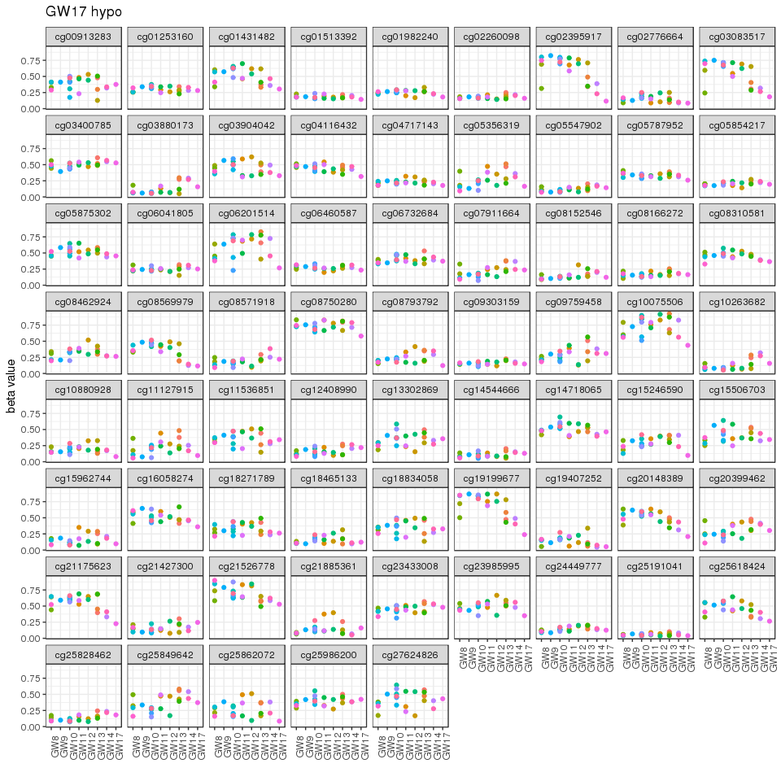
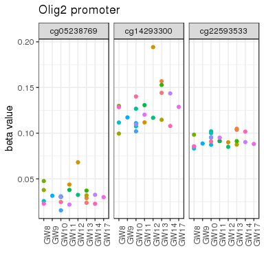
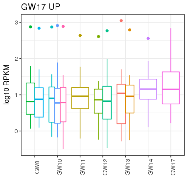

# Fetal Brain - data from Claudia
Gloria Li  
Feb 18, 2018  

Updated: Mon Mar 19 06:01:02 2018

## Figure 4 DMRs between GW13 and GW17

<!-- --><!-- -->

## Figure 5 Olig2 promoter hypo and UP in GW17

<!-- --><!-- -->

## Figure 6 DE between GW

<!-- -->
<!-- -->

### BrainSpan

<!-- --><!-- -->

