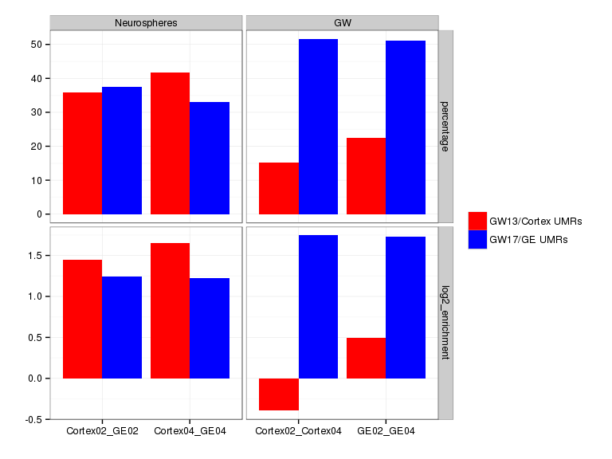
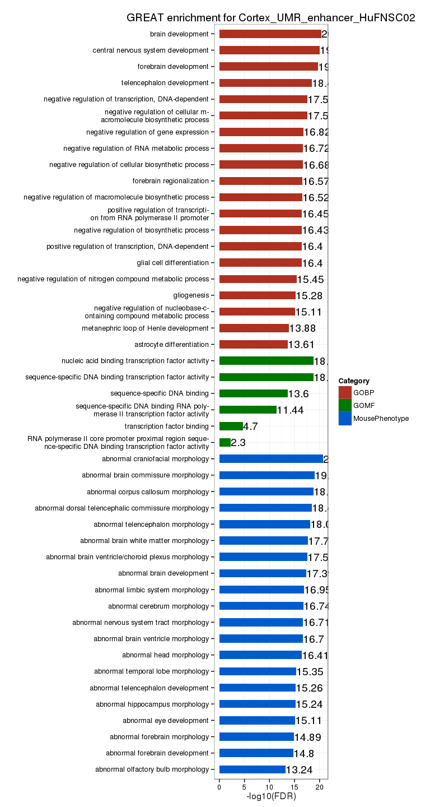
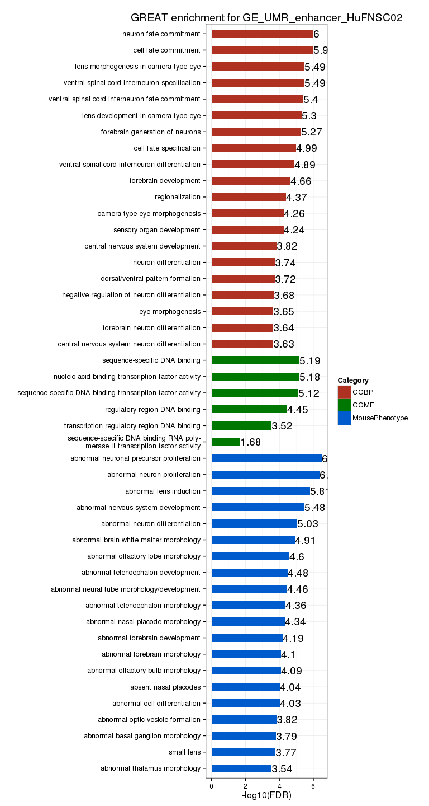
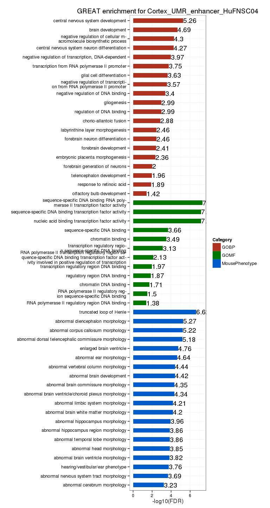
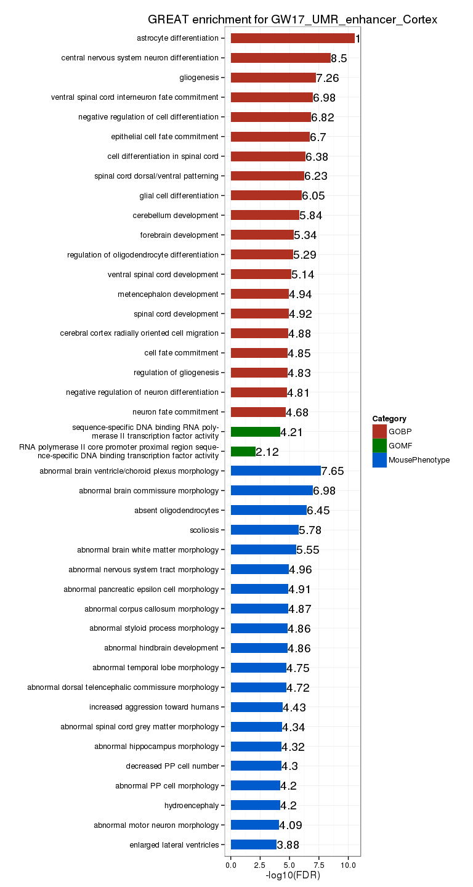
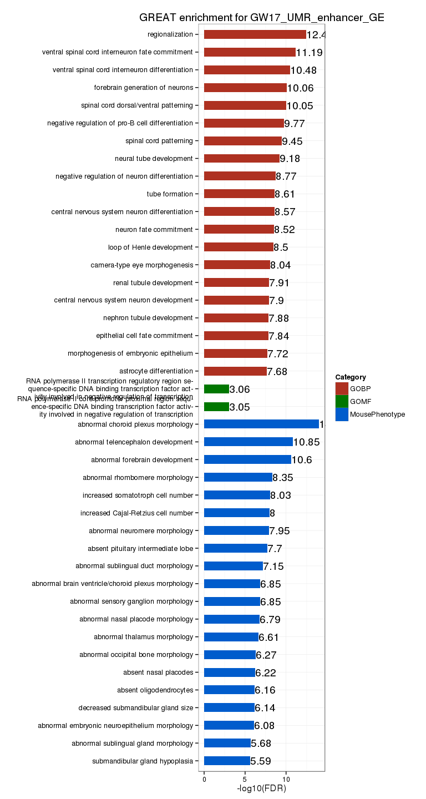

# Fetal Brain - Histone modifications
Gloria Li  
January 27, 2014  

Update Sun Apr 26 23:00:33 2015

## Sanity check   

* No. of peaks, No. of enriched bases, and average peak length seem reasonable except for the unusual high No. of peaks in GE HuFNSC04 input library.              

 

## Correlation with protein-coding gene RPKM 

* Overlapping H3K4me3 and H3K27me3 FindER peaks with protein-coding gene promoters (TSS +/- 1500bp), and overlapping H3K36me3 with genebody.    
* Overall correlations are as expected, with H3K4m3 and H3K36me3 marked genes showing higher RPKM, and H3K27me3 and bivalent promoter marked showing lower RPKM.   

 

## Differentially marked genes

* Calculate H3K4me3 and H3K27me3 signal from wig at protein-coding gene promoters (TSS +/- 2000bp) and normalize against total No. of reads in wig.    
* No. of differentially marked genes flucture a lot between samples, maybe need a better way to normalize signal?    
* A significant fraction of DE genes are differentially marked by either H3K4me3 or H3K27me3 in their promoters, more than DMRs.      

  

## Unique enhancers 

* Overall, there are about 20-40% enhancers that are unique within each pairwise comparisons.      
* Between MZ twins, HuFNSC01 has more unique enhancers than HuFNSC02 in all three cell types. The asymmetry between two progenitor cell types and between GWs is not supported by both samples.   
* The intersect of two samples between both progenitors and GWs are statistically significant.    

<table>
 <thead>
  <tr>
   <th style="text-align:left;"> Comparison </th>
   <th style="text-align:left;"> Samples </th>
   <th style="text-align:center;"> Sample1 </th>
   <th style="text-align:center;"> Sample2 </th>
   <th style="text-align:center;"> Sample1_unique </th>
   <th style="text-align:center;"> Sample2_unique </th>
  </tr>
 </thead>
<tbody>
  <tr>
   <td style="text-align:left;"> MZ </td>
   <td style="text-align:left;"> Brain01_Brain02 </td>
   <td style="text-align:center;"> 69300 </td>
   <td style="text-align:center;"> 58831 </td>
   <td style="text-align:center;"> 30038 </td>
   <td style="text-align:center;"> 18240 </td>
  </tr>
  <tr>
   <td style="text-align:left;"> MZ </td>
   <td style="text-align:left;"> Cortex01_Cortex02 </td>
   <td style="text-align:center;"> 125995 </td>
   <td style="text-align:center;"> 105033 </td>
   <td style="text-align:center;"> 35489 </td>
   <td style="text-align:center;"> 5466 </td>
  </tr>
  <tr>
   <td style="text-align:left;"> MZ </td>
   <td style="text-align:left;"> GE01_GE02 </td>
   <td style="text-align:center;"> 135489 </td>
   <td style="text-align:center;"> 102950 </td>
   <td style="text-align:center;"> 47186 </td>
   <td style="text-align:center;"> 3765 </td>
  </tr>
  <tr>
   <td style="text-align:left;"> Neurospheres </td>
   <td style="text-align:left;"> Cortex01_GE01 </td>
   <td style="text-align:center;"> 125995 </td>
   <td style="text-align:center;"> 135489 </td>
   <td style="text-align:center;"> 14961 </td>
   <td style="text-align:center;"> 24022 </td>
  </tr>
  <tr>
   <td style="text-align:left;"> Neurospheres </td>
   <td style="text-align:left;"> Cortex02_GE02 </td>
   <td style="text-align:center;"> 105033 </td>
   <td style="text-align:center;"> 102950 </td>
   <td style="text-align:center;"> 23099 </td>
   <td style="text-align:center;"> 18732 </td>
  </tr>
  <tr>
   <td style="text-align:left;"> GW </td>
   <td style="text-align:left;"> GE01_GE04 </td>
   <td style="text-align:center;"> 135489 </td>
   <td style="text-align:center;"> 102477 </td>
   <td style="text-align:center;"> 49603 </td>
   <td style="text-align:center;"> 6361 </td>
  </tr>
  <tr>
   <td style="text-align:left;"> GW </td>
   <td style="text-align:left;"> GE02_GE04 </td>
   <td style="text-align:center;"> 102950 </td>
   <td style="text-align:center;"> 102477 </td>
   <td style="text-align:center;"> 22826 </td>
   <td style="text-align:center;"> 22889 </td>
  </tr>
</tbody>
</table>

 

### Functional enrichment of unique enhancers

* For MZ twins, no GREAT enriched terms in cortex and GE. In mixed brain, HuFNSC02 unique enhancers show brain organ development terms, WNT pathway, and kidney-related terms.      
* For cortex and GE progenitors, both showed brain-related terms, more so in cortex.     
* For GWs, both GW13 and GW17 unique enhancers showed enrichment for brain organ development terms. GW17 also showed WNT pathway terms.      

 
 
 
   

### GWAS in unique enhancers 

* All sets of unique enhancers showed brain or brain disease related GWAS sites including gliomas, Alzheimer's disease, Autism, Schizophrenia, attention deficit hyperactivity disorder, cognitive performance and intellegence. Below shows statistically significant (hypergeometric test) GWAS traits found in at least two samples.          

<table>
 <thead>
  <tr>
   <th style="text-align:left;"> comparison </th>
   <th style="text-align:left;"> Sample </th>
   <th style="text-align:left;"> No.traits </th>
  </tr>
 </thead>
<tbody>
  <tr>
   <td style="text-align:left;"> GW </td>
   <td style="text-align:left;"> GW13 </td>
   <td style="text-align:left;"> 30 </td>
  </tr>
  <tr>
   <td style="text-align:left;"> GW </td>
   <td style="text-align:left;"> GW17 </td>
   <td style="text-align:left;"> 14 </td>
  </tr>
  <tr>
   <td style="text-align:left;"> MZ </td>
   <td style="text-align:left;"> Brain01 </td>
   <td style="text-align:left;"> 18 </td>
  </tr>
  <tr>
   <td style="text-align:left;"> MZ </td>
   <td style="text-align:left;"> Brain02 </td>
   <td style="text-align:left;"> 19 </td>
  </tr>
  <tr>
   <td style="text-align:left;"> MZ </td>
   <td style="text-align:left;"> Cortex01 </td>
   <td style="text-align:left;"> 6 </td>
  </tr>
  <tr>
   <td style="text-align:left;"> MZ </td>
   <td style="text-align:left;"> Cortex02 </td>
   <td style="text-align:left;"> 23 </td>
  </tr>
  <tr>
   <td style="text-align:left;"> MZ </td>
   <td style="text-align:left;"> GE01 </td>
   <td style="text-align:left;"> 4 </td>
  </tr>
  <tr>
   <td style="text-align:left;"> MZ </td>
   <td style="text-align:left;"> GE02 </td>
   <td style="text-align:left;"> 22 </td>
  </tr>
  <tr>
   <td style="text-align:left;"> Neurospheres </td>
   <td style="text-align:left;"> Cortex </td>
   <td style="text-align:left;"> 16 </td>
  </tr>
  <tr>
   <td style="text-align:left;"> Neurospheres </td>
   <td style="text-align:left;"> GE </td>
   <td style="text-align:left;"> 37 </td>
  </tr>
</tbody>
</table>

* statistically significant GWAS traits found in at least two samples:   

 [1] "Alzheimer's disease (cognitive decline)"                         
 [2] "Lentiform nucleus volume"                                        
 [3] "Lipid metabolism phenotypes"                                     
 [4] "Nephrotic syndrome (acquired)"                                   
 [5] "Obesity"                                                         
 [6] "Systolic blood pressure"                                         
 [7] "Diastolic blood pressure"                                        
 [8] "Schizophrenia or bipolar disorder"                               
 [9] "Cholesterol"                                                     
[10] "End-stage renal disease (non-diabetic)"                          
[11] "Response to antipsychotic therapy (extrapyramidal side effects)" 
[12] "Restless legs syndrome"                                          
[13] "Renal sinus fat"                                                 
[14] "Cognitive test performance"                                      
[15] "Conduct disorder (symptom count)"                                
[16] "Economic and political preferences (feminism/equality)"          
[17] "Immune reponse to smallpox (secreted IL-10)"                     
[18] "Central corneal thickness"                                       
[19] "Homeostasis model assessment of beta-cell function (interaction)"

## Overlapping enhancers with WGBS UMRs

* UMRs between neurospheres (cortex vs GE) are enriched in enhancers (H3K4me1 enriched regions).      
* Between gestational weeks, GW13 UMRs are enriched in enhancers, but GW17 UMRs are not.      
* UMRs overlaped with enhancers are highly enriched for brain development terms. For comparing between neurospheres, GE enhancer UMRs in HuFNSC04 have no significant enrichment. And for comparing between gestational weeks, GW13 enhancer UMRs in Cortex also have no enriched terms.       

 
      

