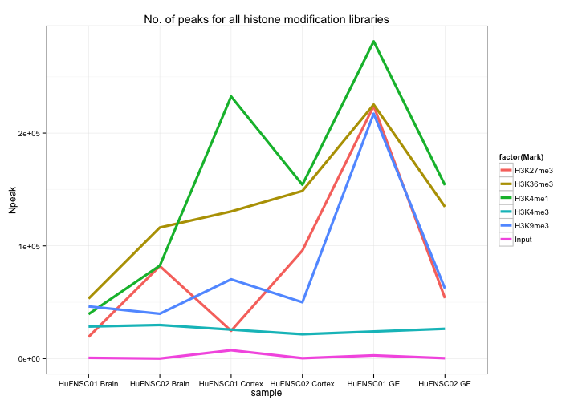
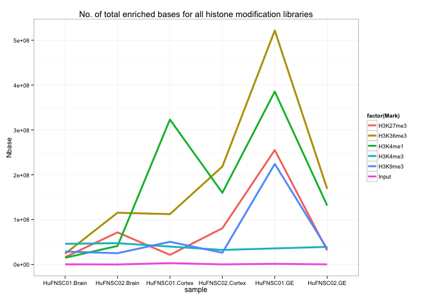
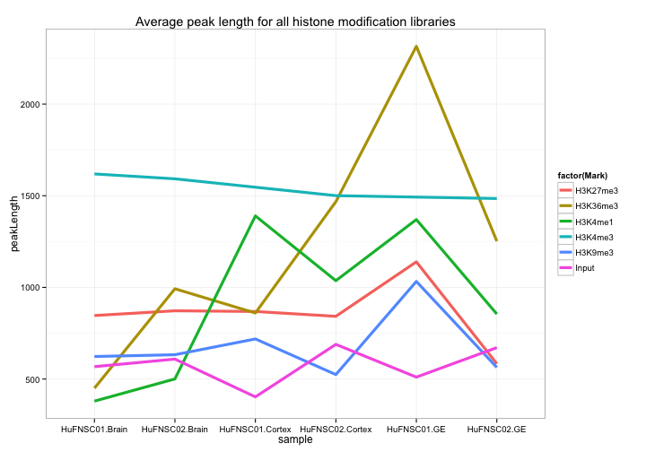

Fetal Brain - Histone Modification
========================================================
Gloria Li          
Tue Jun  3 11:53:25 2014

## FindER results on histone modification libraries
### Sanity check: No. of peaks, No. of enriched bases, and average peak length identified by FindER in each library   

All summary statistics seem fine except No. of peaks found in input libraries for cortex-HuFNSC01 and GE-HuFNSC01 are much higher than expected. Also, all whole brain tissue libraries, esp. HuFNSC01, have low No. of peaks. May benefit from the new version of FindER.              

<!-- html table generated in R 3.0.2 by xtable 1.7-1 package -->
<!-- Tue Jun  3 11:53:25 2014 -->
<TABLE border=1>
<TR> <TH> Npeak </TH> <TH> Nbase </TH> <TH> peakLength </TH> <TH> Library </TH> <TH> Mark </TH> <TH> Tissue </TH> <TH> Donor </TH>  </TR>
  <TR> <TD align="right"> 19245 </TD> <TD align="right"> 16288600 </TD> <TD align="right"> 846.38 </TD> <TD align="center"> A03488 </TD> <TD align="center"> H3K27me3 </TD> <TD align="center"> Brain </TD> <TD align="center"> HuFNSC01 </TD> </TR>
  <TR> <TD align="right"> 82093 </TD> <TD align="right"> 71608000 </TD> <TD align="right"> 872.28 </TD> <TD align="center"> A03496 </TD> <TD align="center"> H3K27me3 </TD> <TD align="center"> Brain </TD> <TD align="center"> HuFNSC02 </TD> </TR>
  <TR> <TD align="right"> 24642 </TD> <TD align="right"> 21400000 </TD> <TD align="right"> 868.44 </TD> <TD align="center"> A03272 </TD> <TD align="center"> H3K27me3 </TD> <TD align="center"> Cortex </TD> <TD align="center"> HuFNSC01 </TD> </TR>
  <TR> <TD align="right"> 95909 </TD> <TD align="right"> 80761400 </TD> <TD align="right"> 842.06 </TD> <TD align="center"> A03284 </TD> <TD align="center"> H3K27me3 </TD> <TD align="center"> Cortex </TD> <TD align="center"> HuFNSC02 </TD> </TR>
  <TR> <TD align="right"> 223979 </TD> <TD align="right"> 255165200 </TD> <TD align="right"> 1139.24 </TD> <TD align="center"> A03278 </TD> <TD align="center"> H3K27me3 </TD> <TD align="center"> GE </TD> <TD align="center"> HuFNSC01 </TD> </TR>
  <TR> <TD align="right"> 53681 </TD> <TD align="right"> 31333400 </TD> <TD align="right"> 583.70 </TD> <TD align="center"> A03480 </TD> <TD align="center"> H3K27me3 </TD> <TD align="center"> GE </TD> <TD align="center"> HuFNSC02 </TD> </TR>
  <TR> <TD align="right"> 53229 </TD> <TD align="right"> 23953800 </TD> <TD align="right"> 450.01 </TD> <TD align="center"> A03489 </TD> <TD align="center"> H3K36me3 </TD> <TD align="center"> Brain </TD> <TD align="center"> HuFNSC01 </TD> </TR>
  <TR> <TD align="right"> 116270 </TD> <TD align="right"> 115386800 </TD> <TD align="right"> 992.40 </TD> <TD align="center"> A03497 </TD> <TD align="center"> H3K36me3 </TD> <TD align="center"> Brain </TD> <TD align="center"> HuFNSC02 </TD> </TR>
  <TR> <TD align="right"> 130534 </TD> <TD align="right"> 112280600 </TD> <TD align="right"> 860.16 </TD> <TD align="center"> A03273 </TD> <TD align="center"> H3K36me3 </TD> <TD align="center"> Cortex </TD> <TD align="center"> HuFNSC01 </TD> </TR>
  <TR> <TD align="right"> 148741 </TD> <TD align="right"> 218301600 </TD> <TD align="right"> 1467.66 </TD> <TD align="center"> A03285 </TD> <TD align="center"> H3K36me3 </TD> <TD align="center"> Cortex </TD> <TD align="center"> HuFNSC02 </TD> </TR>
  <TR> <TD align="right"> 225298 </TD> <TD align="right"> 521558400 </TD> <TD align="right"> 2314.97 </TD> <TD align="center"> A03279 </TD> <TD align="center"> H3K36me3 </TD> <TD align="center"> GE </TD> <TD align="center"> HuFNSC01 </TD> </TR>
  <TR> <TD align="right"> 134685 </TD> <TD align="right"> 168654600 </TD> <TD align="right"> 1252.22 </TD> <TD align="center"> A03481 </TD> <TD align="center"> H3K36me3 </TD> <TD align="center"> GE </TD> <TD align="center"> HuFNSC02 </TD> </TR>
  <TR> <TD align="right"> 39463 </TD> <TD align="right"> 14971400 </TD> <TD align="right"> 379.38 </TD> <TD align="center"> A03485 </TD> <TD align="center"> H3K4me1 </TD> <TD align="center"> Brain </TD> <TD align="center"> HuFNSC01 </TD> </TR>
  <TR> <TD align="right"> 82517 </TD> <TD align="right"> 41298400 </TD> <TD align="right"> 500.48 </TD> <TD align="center"> A03493 </TD> <TD align="center"> H3K4me1 </TD> <TD align="center"> Brain </TD> <TD align="center"> HuFNSC02 </TD> </TR>
  <TR> <TD align="right"> 232488 </TD> <TD align="right"> 323141800 </TD> <TD align="right"> 1389.93 </TD> <TD align="center"> A03269 </TD> <TD align="center"> H3K4me1 </TD> <TD align="center"> Cortex </TD> <TD align="center"> HuFNSC01 </TD> </TR>
  <TR> <TD align="right"> 154238 </TD> <TD align="right"> 159865000 </TD> <TD align="right"> 1036.48 </TD> <TD align="center"> A03281 </TD> <TD align="center"> H3K4me1 </TD> <TD align="center"> Cortex </TD> <TD align="center"> HuFNSC02 </TD> </TR>
  <TR> <TD align="right"> 281314 </TD> <TD align="right"> 385409000 </TD> <TD align="right"> 1370.03 </TD> <TD align="center"> A03275 </TD> <TD align="center"> H3K4me1 </TD> <TD align="center"> GE </TD> <TD align="center"> HuFNSC01 </TD> </TR>
  <TR> <TD align="right"> 153891 </TD> <TD align="right"> 131521200 </TD> <TD align="right"> 854.64 </TD> <TD align="center"> A03477 </TD> <TD align="center"> H3K4me1 </TD> <TD align="center"> GE </TD> <TD align="center"> HuFNSC02 </TD> </TR>
  <TR> <TD align="right"> 28456 </TD> <TD align="right"> 46068400 </TD> <TD align="right"> 1618.93 </TD> <TD align="center"> A03486 </TD> <TD align="center"> H3K4me3 </TD> <TD align="center"> Brain </TD> <TD align="center"> HuFNSC01 </TD> </TR>
  <TR> <TD align="right"> 29815 </TD> <TD align="right"> 47473800 </TD> <TD align="right"> 1592.28 </TD> <TD align="center"> A03494 </TD> <TD align="center"> H3K4me3 </TD> <TD align="center"> Brain </TD> <TD align="center"> HuFNSC02 </TD> </TR>
  <TR> <TD align="right"> 21624 </TD> <TD align="right"> 32447200 </TD> <TD align="right"> 1500.52 </TD> <TD align="center"> A03282 </TD> <TD align="center"> H3K4me3 </TD> <TD align="center"> Cortex </TD> <TD align="center"> HuFNSC02 </TD> </TR>
  <TR> <TD align="right"> 26448 </TD> <TD align="right"> 39269200 </TD> <TD align="right"> 1484.77 </TD> <TD align="center"> A03478 </TD> <TD align="center"> H3K4me3 </TD> <TD align="center"> GE </TD> <TD align="center"> HuFNSC02 </TD> </TR>
  <TR> <TD align="right"> 46328 </TD> <TD align="right"> 28855000 </TD> <TD align="right"> 622.84 </TD> <TD align="center"> A03487 </TD> <TD align="center"> H3K9me3 </TD> <TD align="center"> Brain </TD> <TD align="center"> HuFNSC01 </TD> </TR>
  <TR> <TD align="right"> 39793 </TD> <TD align="right"> 25170000 </TD> <TD align="right"> 632.52 </TD> <TD align="center"> A03495 </TD> <TD align="center"> H3K9me3 </TD> <TD align="center"> Brain </TD> <TD align="center"> HuFNSC02 </TD> </TR>
  <TR> <TD align="right"> 70390 </TD> <TD align="right"> 50586200 </TD> <TD align="right"> 718.66 </TD> <TD align="center"> A03271 </TD> <TD align="center"> H3K9me3 </TD> <TD align="center"> Cortex </TD> <TD align="center"> HuFNSC01 </TD> </TR>
  <TR> <TD align="right"> 50006 </TD> <TD align="right"> 26212200 </TD> <TD align="right"> 524.18 </TD> <TD align="center"> A03283 </TD> <TD align="center"> H3K9me3 </TD> <TD align="center"> Cortex </TD> <TD align="center"> HuFNSC02 </TD> </TR>
  <TR> <TD align="right"> 217188 </TD> <TD align="right"> 224213400 </TD> <TD align="right"> 1032.35 </TD> <TD align="center"> A03277 </TD> <TD align="center"> H3K9me3 </TD> <TD align="center"> GE </TD> <TD align="center"> HuFNSC01 </TD> </TR>
  <TR> <TD align="right"> 62229 </TD> <TD align="right"> 35061800 </TD> <TD align="right"> 563.43 </TD> <TD align="center"> A03479 </TD> <TD align="center"> H3K9me3 </TD> <TD align="center"> GE </TD> <TD align="center"> HuFNSC02 </TD> </TR>
  <TR> <TD align="right"> 698 </TD> <TD align="right"> 396000 </TD> <TD align="right"> 567.34 </TD> <TD align="center"> A03491 </TD> <TD align="center"> Input </TD> <TD align="center"> Brain </TD> <TD align="center"> HuFNSC01 </TD> </TR>
  <TR> <TD align="right">  92 </TD> <TD align="right"> 56000 </TD> <TD align="right"> 608.70 </TD> <TD align="center"> A03499 </TD> <TD align="center"> Input </TD> <TD align="center"> Brain </TD> <TD align="center"> HuFNSC02 </TD> </TR>
  <TR> <TD align="right"> 7414 </TD> <TD align="right"> 2983800 </TD> <TD align="right"> 402.45 </TD> <TD align="center"> A03287 </TD> <TD align="center"> Input </TD> <TD align="center"> Cortex </TD> <TD align="center"> HuFNSC01 </TD> </TR>
  <TR> <TD align="right"> 382 </TD> <TD align="right"> 263200 </TD> <TD align="right"> 689.00 </TD> <TD align="center"> A03289 </TD> <TD align="center"> Input </TD> <TD align="center"> Cortex </TD> <TD align="center"> HuFNSC02 </TD> </TR>
  <TR> <TD align="right"> 2842 </TD> <TD align="right"> 1450400 </TD> <TD align="right"> 510.35 </TD> <TD align="center"> A03288 </TD> <TD align="center"> Input </TD> <TD align="center"> GE </TD> <TD align="center"> HuFNSC01 </TD> </TR>
  <TR> <TD align="right"> 381 </TD> <TD align="right"> 255800 </TD> <TD align="right"> 671.39 </TD> <TD align="center"> A03483 </TD> <TD align="center"> Input </TD> <TD align="center"> GE </TD> <TD align="center"> HuFNSC02 </TD> </TR>
   </TABLE>
   

### Sample clustering on histone modification signals  

* Primary tissue samples (whole brain) and primary cell culture samples (cortex and GE) always form different clusters.    
* Clustring on input libraries do not have obvious patterns, and present the greatest dissimilarity among all marks.          
* Clutering within primary cell culture samples are quite different in different marks.     
* Clustering in protein-coding genes and non-coding genes are generally similar, except in H3K36me3.       

          

