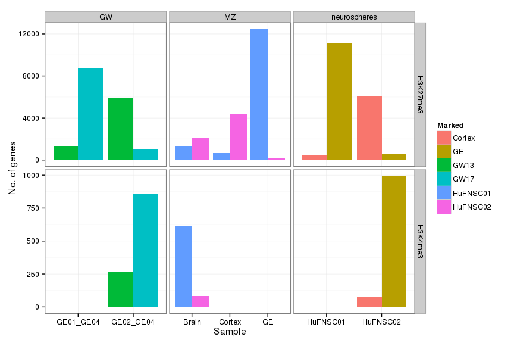
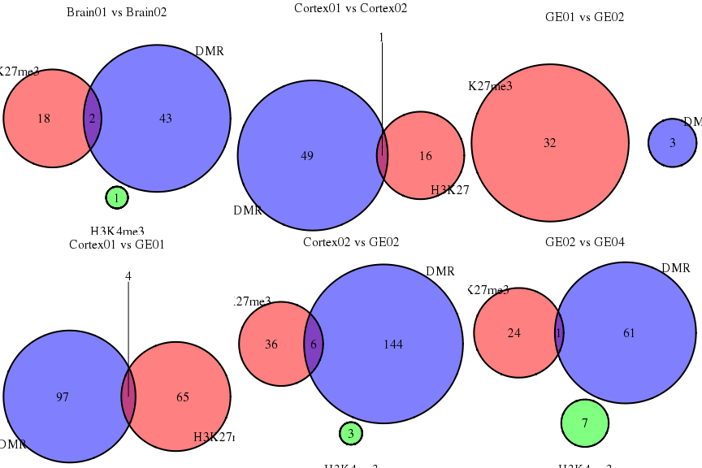
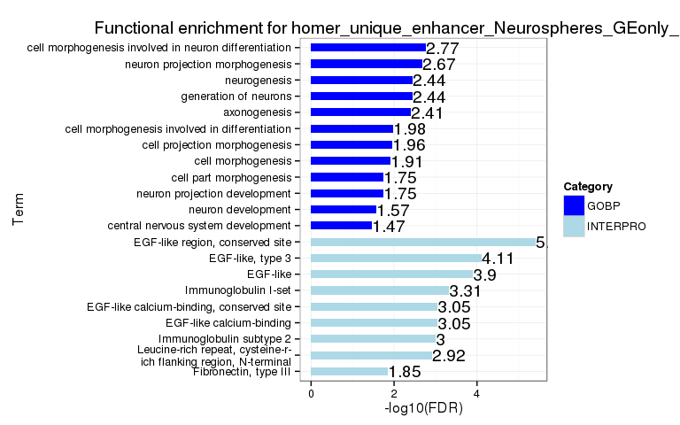

# Fetal Brain - Histone modifications
Gloria Li  
January 27, 2014  

Update Mon Jul 13 14:23:08 2015

## Sanity check   

* No. of peaks, No. of enriched bases, and average peak length seem reasonable except for the unusual high No. of peaks in GE HuFNSC04 input library.              

 

## Correlation with protein-coding gene RPKM 

* Overlapping H3K4me3 and H3K27me3 FindER peaks with protein-coding gene promoters (TSS +/- 1500bp), and overlapping H3K36me3 with genebody.    
* Overall correlations are as expected, with H3K4m3 and H3K36me3 marked genes showing higher RPKM, and H3K27me3 and bivalent promoter marked showing lower RPKM.   

 

## Differentially marked genes

* Calculate H3K4me3 and H3K27me3 signal from wig at protein-coding gene promoters (TSS +/- 2000bp) and normalize against total No. of reads in wig.    
* No. of differentially marked genes flucture a lot between samples, maybe need a better way to normalize signal?    
* A significant fraction of DE genes are differentially marked by either H3K4me3 or H3K27me3 in their promoters, more than DMRs.      

  

## Core enhancers 

* Overlapping all NPC enhancers (Cortex01, Cortex02, GE01, GE02, GE04), in total 79033 regions, average length 2904.36bp.     

### GWAS in core enhancers  

* 1460 enhancers overlap with GWAS, involved in 546 traits.     
* Several traits are related to brain development and function: Cortical structure, Glaucoma (exfoliation), Glioblastoma, Neuranatomic and neurocognitive phenotypes, Neuroblastoma (high-risk), Odorant perception (isobutyraldehyde), Schizophrenia (cytomegalovirus infection interaction), Alzheimer's disease biomarkers.        

### Homer TFBSs

* There are 13 TFs significantly (Benjamini q value < 0.01) enriched in core enhancers and present in > 20% of the core enhancers.    
* Ptf1a: plays an important role in cerebellar and pancreatic development.       
* Isl1: central to the development of pancreatic cell lineages and may also be required for motor neuron generation.        
* Lhx3: involved in the development of interneurons and motor neurons.    
* NF1: negative regulator of the ras signal transduction pathway, associated with neurofibromatosis type 1.     
* Sox3: function as a switch in neuronal development. Keeps neural cells undifferentiated by counteracting the activity of proneural proteins and suppresses neuronal differentiation.       
* Olig2: oligodendrocyte specific marker.      

 

### Overlapping with WGBS UMRs

* UMRs between neurospheres (cortex vs GE) are enriched in enhancers (H3K4me1 enriched regions).      
* Between gestational weeks, GW13 UMRs are enriched in enhancers, but GW17 UMRs are not.      
* UMRs overlaped with enhancers are highly enriched for brain development terms. For comparing between neurospheres, GE enhancer UMRs in HuFNSC04 have no significant enrichment. And for comparing between gestational weeks, GW13 enhancer UMRs in Cortex also have no enriched terms.       

 
      

## Unique enhancers 

* Overall, there are about 20-40% enhancers that are unique within each pairwise comparisons.      
* Between MZ twins, HuFNSC01 has more unique enhancers than HuFNSC02 in all three cell types. The asymmetry between two progenitor cell types and between GWs is not supported by both samples.   
* The intersect of two samples between both progenitors and GWs are statistically significant.    

<table>
 <thead>
  <tr>
   <th style="text-align:left;"> Comparison </th>
   <th style="text-align:left;"> Samples </th>
   <th style="text-align:center;"> Sample1 </th>
   <th style="text-align:center;"> Sample2 </th>
   <th style="text-align:center;"> Sample1_unique </th>
   <th style="text-align:center;"> Sample2_unique </th>
  </tr>
 </thead>
<tbody>
  <tr>
   <td style="text-align:left;"> MZ </td>
   <td style="text-align:left;"> Brain01_Brain02 </td>
   <td style="text-align:center;"> 69300 </td>
   <td style="text-align:center;"> 58831 </td>
   <td style="text-align:center;"> 30038 </td>
   <td style="text-align:center;"> 18240 </td>
  </tr>
  <tr>
   <td style="text-align:left;"> MZ </td>
   <td style="text-align:left;"> Cortex01_Cortex02 </td>
   <td style="text-align:center;"> 125995 </td>
   <td style="text-align:center;"> 105033 </td>
   <td style="text-align:center;"> 35489 </td>
   <td style="text-align:center;"> 5466 </td>
  </tr>
  <tr>
   <td style="text-align:left;"> MZ </td>
   <td style="text-align:left;"> GE01_GE02 </td>
   <td style="text-align:center;"> 135489 </td>
   <td style="text-align:center;"> 102950 </td>
   <td style="text-align:center;"> 47186 </td>
   <td style="text-align:center;"> 3765 </td>
  </tr>
  <tr>
   <td style="text-align:left;"> Neurospheres </td>
   <td style="text-align:left;"> Cortex01_GE01 </td>
   <td style="text-align:center;"> 125995 </td>
   <td style="text-align:center;"> 135489 </td>
   <td style="text-align:center;"> 14961 </td>
   <td style="text-align:center;"> 24022 </td>
  </tr>
  <tr>
   <td style="text-align:left;"> Neurospheres </td>
   <td style="text-align:left;"> Cortex02_GE02 </td>
   <td style="text-align:center;"> 105033 </td>
   <td style="text-align:center;"> 102950 </td>
   <td style="text-align:center;"> 23099 </td>
   <td style="text-align:center;"> 18732 </td>
  </tr>
  <tr>
   <td style="text-align:left;"> GW </td>
   <td style="text-align:left;"> GE01_GE04 </td>
   <td style="text-align:center;"> 135489 </td>
   <td style="text-align:center;"> 102477 </td>
   <td style="text-align:center;"> 49603 </td>
   <td style="text-align:center;"> 6361 </td>
  </tr>
  <tr>
   <td style="text-align:left;"> GW </td>
   <td style="text-align:left;"> GE02_GE04 </td>
   <td style="text-align:center;"> 102950 </td>
   <td style="text-align:center;"> 102477 </td>
   <td style="text-align:center;"> 22826 </td>
   <td style="text-align:center;"> 22889 </td>
  </tr>
</tbody>
</table>

 

### Functional enrichment of unique enhancers

* For MZ twins, no GREAT enriched terms in cortex and GE. In mixed brain, HuFNSC02 unique enhancers show brain organ development terms, WNT pathway, and kidney-related terms.      
* For cortex and GE progenitors, both showed brain-related terms, more so in cortex.     
* For GWs, both GW13 and GW17 unique enhancers showed enrichment for brain organ development terms. GW17 also showed WNT pathway terms.      

 
 
 
   

### GWAS in unique enhancers 

* All sets of unique enhancers showed brain or brain disease related GWAS sites, such as Gliomas, Alzheimer's disease, Autism, Schizophrenia or bipolar disorder, Cognitive performance, Neuroblastoma (high-risk), Normalized brain volume, Intelligence.               

### Homer TFBSs
#### Unique enhancers between GW13 and GW17 

* Intersect of unique enhancers between GE01 vs GE04 and GE02 vs GE04. There are 5840 GW13-specific enhancers, and 17909 GW17-specific enhancers.          
* There are 52 TFs significantly (Benjamini q-value < 0.01) enriched in GW13-specific enhancers, and 117 in GW17-specific enhancers. Among them, 42 TFs are in common.        
* In the common TFs, 9 are present in > 20% enhancers in either GW13 or GW17. Their percent occupancy in GW13 and GW17 specific enhancers are similar, and downstream target genes are significantly overlapped (for example, Sox3 hypergeometric test p-value = 0).      
* There are only 10 GW13-specific TFs, and they all present in < 5% of the enhancers.    
* There are 75 GW17-specific TFs, and 5 of them are present in > 20% of the enhancers, including Olig2.      
* GW17-specific enhancers overlapped with Olig2 binding sites are associated with 92 GW-specific DE genes in cortex, and 200 in GE. Both gene lists are enriched for neuron development terms.              

       

* Olig2 downstream DE genes in cortex (distance to TSS < 10kb)    
  + EMX2: Empty Spiracles Homeobox 2. acts to generate the boundary between the roof and archipallium in the developing brain. May function in combinations with OTX1/2 to specify cell fates in the developing central nervous system.       
  + RGS10: Regulator Of G-Protein Signaling 10. associated with schizophrenia.     
  + LGI1: Leucine-Rich, Glioma Inactivated 1. This gene is predominantly expressed in neural tissues and its expression is reduced in low grade brain tumors and significantly reduced or absent in malignant gliomas. Mutations in this gene result in autosomal dominant lateral temporal epilepsy. May play a role in the control of neuroblastoma cell survival.     
  
          

* Olig2 downstream DE genes in GE (distance to TSS < 10kb)      
  + PAX6: Paired Box 6. expressed in the developing nervous system, and in developing eyes. Mutations in this gene are known to cause ocular disorders such as aniridia and Peter's anomaly.     
  + HIVEP2: Human Immunodeficiency Virus Type I Enhancer Binding Protein 2. zinc finger-containing transcription factors. The encoded protein regulates transcription by binding to regulatory regions of various cellular and viral genes that maybe involved in growth, development and metastasis.    
  
       

#### Unique enhancers between cortex and GE

* Intersect of unique enhancers between cortex01 vs GE01 and cortex02 vs GE02. There are 3279 cortex-specific enhancers, and 5731 GE-specific enhancers.     
* There are 42 TFs significantly (Benjamini q-value < 0.01) enriched in cortex-specific enhancers, and 78 in GE-specific enhancers. Among them, 32 TFs are in common.        
* In the common TFs, 11 are present in > 20% enhancers in either cortex or GE. Their percent occupancy in cortex and GE specific enhancers are similar, and downstream target genes are significantly overlapped (for example, Lhx3 hypergeometric test p-value = 0).      
* There are only 10 cortex-specific TFs, and they all present in < 20% of the enhancers.    
* There are 46 GW17-specific TFs, and 4 of them are present in > 20% of the enhancers, including Olig2.      
* 252 GE-specific enhancers overlapped with Olig2 binding sites are associated with NPC-specific DE genes, and the DE genes are enriched for neuron development terms.              

      

