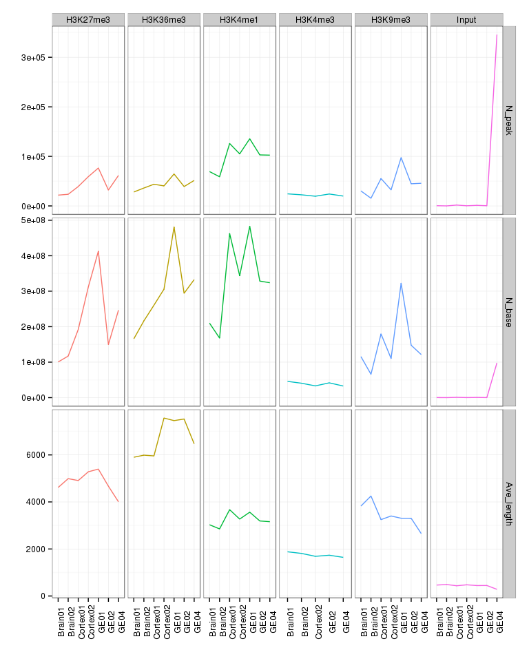

# Fetal Brain - Histone modifications
Gloria Li  
January 27, 2014  

Update Wed Mar 11 21:13:44 2015

## Sanity check   

* No. of peaks, No. of enriched bases, and average peak length seem reasonable except for the unusual high No. of peaks in GE HuFNSC04 input library.              

 

## Correlation with protein-coding gene RPKM 

* Overlapping H3K4me3 and H3K27me3 FindER peaks with protein-coding gene promoters (TSS +/- 1500bp), and overlapping H3K36me3 with genebody.    
* Overall correlations are as expected, with H3K4m3 and H3K36me3 marked genes showing higher RPKM, and H3K27me3 and bivalent promoter marked showing lower RPKM.   

 

## Differentially marked genes

* Overlapping H3K4me3 and H3K27me3 FindER peaks with protein-coding gene promoters (TSS +/- 1500bp).    
* No. of differentially marked genes flucture a lot between samples, maybe use normalized signal level than binarized marking?    
* Only a small fraction of DE genes are differentially marked by either H3K4me3 or H3K27me3 in their promoters.      

  

## Overlapping enhancers with WGBS UMRs

* UMRs between neurospheres (cortex vs GE) are enriched in enhancers (H3K4me1 enriched regions).      
* Between gestational weeks, GW13 UMRs are enriched in enhancers, but GW17 UMRs are not.      
* UMRs overlaped with enhancers are highly enriched for brain development terms. For comparing between neurospheres, GE enhancer UMRs in HuFNSC04 have no significant enrichment. And for comparing between gestational weeks, GW13 enhancer UMRs in Cortex also have no enriched terms.       

 
      

