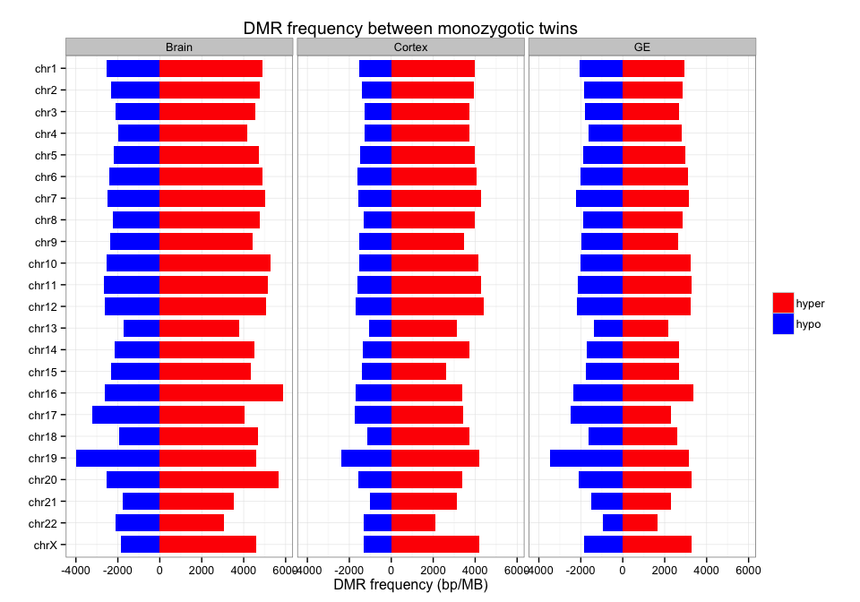
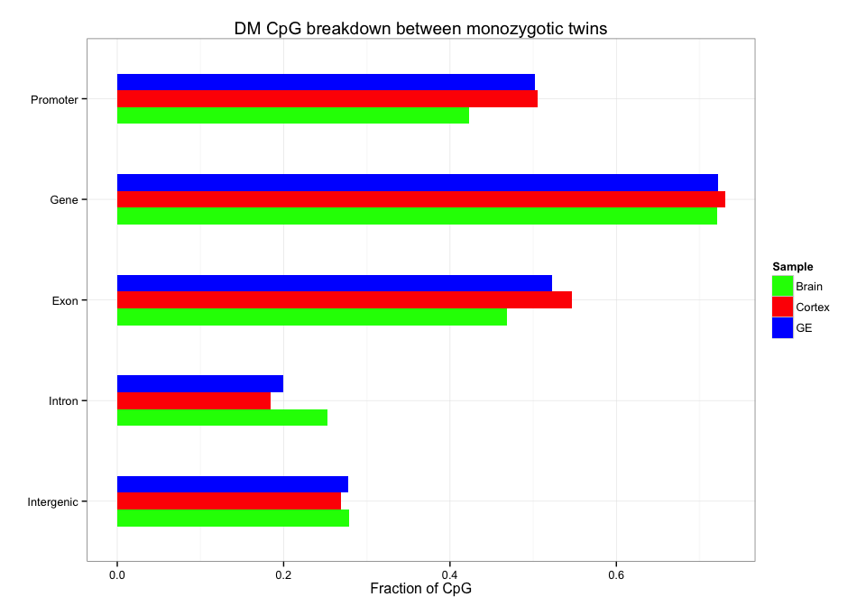

Fetal Brain MeDIP Analysis Summary
========================================================

Gloria Li         
Wed Sep 10 18:05:06 2014 

## DMR analysis from MeDIP fractional calls

  * DM CpG identification: $\Delta$mC < -0.4: hypomethylated; $\Delta$mC > 0.4: hypermethylated.       
  * Collapse DM CpGs into DMRs:   
    + adjacent CpGs have the same DM status;    
    + distance between adjacent CpGs $\le$ 200bp;   
    + No. of CpGs within each DMR $\ge$ 3.   
    
## DMRs between monozygptic twins
### Summary and sanity check

  * On average, there are __160150__ DMR regions identified across three cell types, with __103839__ hypermethylated, and __56311__ hypomethylated.      
  * Average length of all DMRs is __108bp__. __Smaller__ than observed in breast. _Bad script or biology?_      
  * Average No. of CpGs per DMR is __5__. __Same__ as in breast.        
  * Average distance between adjacent DMRs is approximately __18Kb__.         
  * DMRs are scattered along the genome, no obvious chunks of hyper/hypo regions.         

<!-- html table generated in R 3.1.1 by xtable 1.7-3 package -->
<!-- Wed Sep 10 18:05:10 2014 -->
<TABLE border=1>
<TR> <TH>  </TH> <TH> Total </TH> <TH> Hyper </TH> <TH> Hypo </TH>  </TR>
  <TR> <TD> Brain </TD> <TD align="center"> 192955 </TD> <TD align="center"> 126452 </TD> <TD align="center"> 66503 </TD> </TR>
  <TR> <TD> Cortex </TD> <TD align="center"> 147188 </TD> <TD align="center"> 102896 </TD> <TD align="center"> 44292 </TD> </TR>
  <TR> <TD> GE </TD> <TD align="center"> 140309 </TD> <TD align="center"> 82169 </TD> <TD align="center"> 58140 </TD> </TR>
   </TABLE>
    

### MZ DMR analysis

  + There is an __asymmetry__ between hyper/hypo DMRs across all three cell types, most significant in cortex neurosphere, and least so in GE neurosphere. Fold change in total DMR length hyper/hypo in Brain is __2.002__, in Cortex is __2.619__, and in GE is __1.497__.      
  + Majority of DM CpGs overlap with genes, on average __72.46%__. And DM CpGs are __4-fold__ enriched in promoter regions, with on average __47.7%__ DM CpGs are in promoter regions.
<!-- For the entire genome, 3727169 out of 28217448 CpGs overlap with TSS +/- 1500bp promoter regions -->

  

