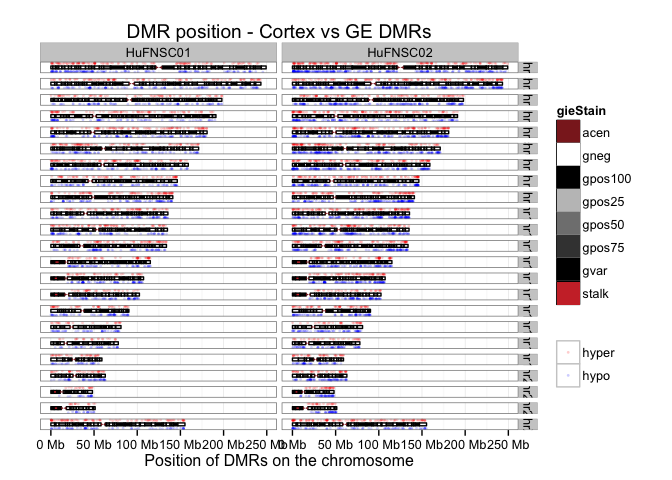

Fetal Brain MeDIP Analysis Summary
========================================================

Gloria Li         
Updated: Mon Dec  1 16:47:02 2014 

## DMR analysis from MeDIP fractional calls

  * DM CpG identification: 
    + delta fractional methylation $\ge$ 0.6  
    + fractional methylation of one sample $\ge$ 0.75   
  * Collapse DM CpGs into DMRs:   
    + adjacent CpGs have the same DM status;    
    + distance between adjacent CpGs $\le$ 300bp;   
    + No. of CpGs within each DMR $\ge$ 4.   

## DMRs between neurospheres Cortex and GE derived
### Summary and sanity check  

  * On average, there are __2451__ Cortex UMRs, and __1686__ GE UMRs. There seems to be an asymmetry between Cortex UMRs and GE UMRs.    
  * Median DMR length is __105__, _much smaller than WGBS_. It's similar in all chromosomes.   
  * Median No. of CpGs per DMR is __6__, _larger than WGBS_. Also doesn't fluctuate across chromosomes.  

<!-- html table generated in R 3.1.1 by xtable 1.7-4 package -->
<!-- Mon Dec  1 16:47:15 2014 -->
<table border=1>
<tr> <th> Sample </th> <th> Total.DMR </th> <th> Hyper.DMR </th> <th> Hypo.DMR </th>  </tr>
  <tr> <td align="center"> Cortex-HuFNSC01_GE-HuFNSC01 </td> <td align="center"> 3228 </td> <td align="center"> 1474 </td> <td align="center"> 1754 </td> </tr>
  <tr> <td align="center"> Cortex-HuFNSC02_GE-HuFNSC02 </td> <td align="center"> 5047 </td> <td align="center"> 1899 </td> <td align="center"> 3148 </td> </tr>
   </table>
  

### Asymmetry between Cortex UMRs and GE UMRs  

  * On average, there are , __NaN__-fold enrichment in total UMR length in Cortex compared to GE, __NaN__ in HuFNSC01, and __NaN__ in HuFNSC02.  
  * The asymmetry appears to be global, in all chromosomes __except for chrX__, and is reproduced in the two individuals.  

  

### GREAT analysis on Cortex UMRs and GE UMRs  

  * UMRs in both Cortex and GE in both individuals show enrichment in  __neuron fate commitment__ biological process, __transcriptional regulation__ activities, __Homeobox__ protein domain, and __abnormal brain development__ mouse phenotype.  
  * Cortex UMRs are also enriched in __forebrain regionalization__ and __pattern specification__ processes.   

 
 
 
 

### UMR genomic break down  

  + UMRs are __2.44-fold__ enriched in promoters, _higher than WGBS_, and __6.23-fold__ enriched in CGIs, _slightly higher than WGBS_.        

<!-- For the entire genome, 3727169 out of 28217448 CpGs overlap with TSS +/- 1500bp promoter regions -->
<!-- For the entire genome, 2089538 out of 28217448 CpGs overlap with CGIs -->

 

### Proximal UMRs and DE genes

  + On average, there are __490__ UMRs proximally (TSS +/- 1500bp) associated with protein-coding genes, __11.85%__ of all UMRs, _higher than WGBS_.         
  + On average, there are __68__ proximal UMRs associated with DE genes, __13.91%__ of all proximal UMRs, _slightly lower than WGBS_. Among them, there are __57.59%__ unique DE genes change in the same direction as the UMRs, _higher than WGBS_.         
  + The intersect between two individuals are __significant__.  

<!-- html table generated in R 3.1.1 by xtable 1.7-4 package -->
<!-- Mon Dec  1 16:47:23 2014 -->
<table border=1>
<tr> <th>  </th> <th> DMRs </th> <th> unique.genes </th> <th> DE.DMRs </th> <th> unique.DE.genes </th> <th> same.direction </th>  </tr>
  <tr> <td align="center"> GE01.UMRs </td> <td align="center"> 419 </td> <td align="center"> 466 </td> <td align="center">  35 </td> <td align="center">  35 </td> <td align="center">  20 </td> </tr>
  <tr> <td align="center"> Cortex01.UMRs </td> <td align="center"> 393 </td> <td align="center"> 400 </td> <td align="center">  70 </td> <td align="center">  67 </td> <td align="center">  37 </td> </tr>
  <tr> <td align="center"> GE02.UMRs </td> <td align="center"> 461 </td> <td align="center"> 501 </td> <td align="center">  60 </td> <td align="center">  58 </td> <td align="center">  31 </td> </tr>
  <tr> <td align="center"> Cortex02.UMRs </td> <td align="center"> 689 </td> <td align="center"> 723 </td> <td align="center"> 108 </td> <td align="center">  97 </td> <td align="center">  60 </td> </tr>
   </table>
  

#### Cortex UMRs proximal associated DE genes 

<!-- html table generated in R 3.1.1 by xtable 1.7-4 package -->
<!-- Mon Dec  1 16:47:24 2014 -->
<table border=1>
<tr> <th> name </th> <th> description </th> <th> DM </th> <th> DE </th>  </tr>
  <tr> <td align="right"> BMP8B </td> <td align="right"> bone_morphogenetic_protein_8b </td> <td align="center"> hypo </td> <td align="center"> DN </td> </tr>
  <tr> <td align="right"> NOS1AP </td> <td align="right"> nitric_oxide_synthase_1_(neuronal)_adaptor_protein </td> <td align="center"> hypo </td> <td align="center"> UP </td> </tr>
  <tr> <td align="right"> SFMBT2 </td> <td align="right"> Scm-like_with_four_mbt_domains_2 </td> <td align="center"> hypo </td> <td align="center"> DN </td> </tr>
  <tr> <td align="right"> VAX1 </td> <td align="right"> ventral_anterior_homeobox_1 </td> <td align="center"> hypo </td> <td align="center"> DN </td> </tr>
  <tr> <td align="right"> RIC3 </td> <td align="right"> resistance_to_inhibitors_of_cholinesterase_3_homolog_(C._elegans) </td> <td align="center"> hypo </td> <td align="center"> DN </td> </tr>
  <tr> <td align="right"> TCIRG1 </td> <td align="right"> T-cell,_immune_regulator_1,_ATPase,_H+_transporting,_lysosomal_V0_subunit_A3 </td> <td align="center"> hypo </td> <td align="center"> UP </td> </tr>
  <tr> <td align="right"> TFCP2 </td> <td align="right"> transcription_factor_CP2 </td> <td align="center"> hypo </td> <td align="center"> UP </td> </tr>
  <tr> <td align="right"> SIAH3 </td> <td align="right"> seven_in_absentia_homolog_3_(Drosophila) </td> <td align="center"> hypo </td> <td align="center"> DN </td> </tr>
  <tr> <td align="right"> NKX2-1 </td> <td align="right"> NK2_homeobox_1 </td> <td align="center"> hypo </td> <td align="center"> DN </td> </tr>
  <tr> <td align="right"> ID2 </td> <td align="right"> inhibitor_of_DNA_binding_2,_dominant_negative_helix-loop-helix_protein </td> <td align="center"> hypo </td> <td align="center"> UP </td> </tr>
  <tr> <td align="right"> OTX1 </td> <td align="right"> orthodenticle_homeobox_1 </td> <td align="center"> hypo </td> <td align="center"> UP </td> </tr>
  <tr> <td align="right"> CYP27A1 </td> <td align="right"> cytochrome_P450,_family_27,_subfamily_A,_polypeptide_1 </td> <td align="center"> hypo </td> <td align="center"> UP </td> </tr>
  <tr> <td align="right"> CXCR7 </td> <td align="right"> chemokine_(C-X-C_motif)_receptor_7 </td> <td align="center"> hypo </td> <td align="center"> DN </td> </tr>
  <tr> <td align="right"> FEZF2 </td> <td align="right"> FEZ_family_zinc_finger_2 </td> <td align="center"> hypo </td> <td align="center"> UP </td> </tr>
  <tr> <td align="right"> CYTL1 </td> <td align="right"> cytokine-like_1 </td> <td align="center"> hypo </td> <td align="center"> DN </td> </tr>
  <tr> <td align="right"> IRX2 </td> <td align="right"> iroquois_homeobox_2 </td> <td align="center"> hypo </td> <td align="center"> DN </td> </tr>
  <tr> <td align="right"> PDGFA </td> <td align="right"> platelet-derived_growth_factor_alpha_polypeptide </td> <td align="center"> hypo </td> <td align="center"> DN </td> </tr>
  <tr> <td align="right"> SH3KBP1 </td> <td align="right"> SH3-domain_kinase_binding_protein_1 </td> <td align="center"> hypo </td> <td align="center"> UP </td> </tr>
   </table>

#### GE UMRs proximal associated DE genes 

<!-- html table generated in R 3.1.1 by xtable 1.7-4 package -->
<!-- Mon Dec  1 16:47:24 2014 -->
<table border=1>
<tr> <th> name </th> <th> description </th> <th> DM </th> <th> DE </th>  </tr>
  <tr> <td align="right"> C10orf90 </td> <td align="right"> chromosome_10_open_reading_frame_90 </td> <td align="center"> hyper </td> <td align="center"> DN </td> </tr>
  <tr> <td align="right"> TMEM132B </td> <td align="right"> transmembrane_protein_132B </td> <td align="center"> hyper </td> <td align="center"> UP </td> </tr>
  <tr> <td align="right"> PRDM1 </td> <td align="right"> PR_domain_containing_1,_with_ZNF_domain </td> <td align="center"> hyper </td> <td align="center"> DN </td> </tr>
   </table>

### Overlap UMRs with TFBSs 

* Overlap UMRs with transcription factor binding sites and count No. of overlapping TFBSs for each TF showed different asymmetry in Cortex and GE.  
* HuFNSC02 show similar trend as WGBS, with TFBSs enriched in Cortex UMRs for most TFs, and top TFs with highest fold cahnge in No. of TFBS between Cortex and GE have overlaps with WGBS, such as GATA2, FOXA1, ZNF217.   
* However, HuFNSC01 showed the opposite trend, with most TFs enriched in GE. _Why?_ In general, the correlation of TFBS Cortex UMR vs GE UMR fold change between the two individual is quite low, 0.21, _similar to WGBS_. Maybe TFBSs trend is individual-specific.   
* With 1.5-fold change cutoff, there are 6 TFs enriched in Cortex UMRs in both individuals, and 4 in GE UMRs.   

 <!-- html table generated in R 3.1.1 by xtable 1.7-4 package -->
<!-- Mon Dec  1 16:47:24 2014 -->
<table border=1>
<tr> <th> TF </th> <th> Cortex01UMR </th> <th> GE01UMR </th> <th> Ratio01 </th> <th> Cortex02UMR </th> <th> GE02UMR </th> <th> Ratio02 </th>  </tr>
  <tr> <td align="center"> SUZ12 </td> <td align="center"> 173 </td> <td align="center">  98 </td> <td align="center"> 1.77 </td> <td align="center"> 256 </td> <td align="center"> 160 </td> <td align="center"> 1.60 </td> </tr>
  <tr> <td align="center"> EZH2 </td> <td align="center"> 546 </td> <td align="center"> 309 </td> <td align="center"> 1.77 </td> <td align="center"> 764 </td> <td align="center"> 424 </td> <td align="center"> 1.80 </td> </tr>
  <tr> <td align="center"> ZNF217 </td> <td align="center">  13 </td> <td align="center">   7 </td> <td align="center"> 1.86 </td> <td align="center">  22 </td> <td align="center">   8 </td> <td align="center"> 2.75 </td> </tr>
  <tr> <td align="center"> ESR1 </td> <td align="center">  47 </td> <td align="center">  24 </td> <td align="center"> 1.96 </td> <td align="center">  91 </td> <td align="center">  40 </td> <td align="center"> 2.27 </td> </tr>
  <tr> <td align="center"> NANOG </td> <td align="center">  16 </td> <td align="center">   7 </td> <td align="center"> 2.29 </td> <td align="center">  23 </td> <td align="center">  12 </td> <td align="center"> 1.92 </td> </tr>
  <tr> <td align="center"> ESRRA </td> <td align="center">   5 </td> <td align="center">   2 </td> <td align="center"> 2.50 </td> <td align="center">   7 </td> <td align="center">   4 </td> <td align="center"> 1.75 </td> </tr>
   </table>
<!-- html table generated in R 3.1.1 by xtable 1.7-4 package -->
<!-- Mon Dec  1 16:47:24 2014 -->
<table border=1>
<tr> <th> TF </th> <th> Cortex01UMR </th> <th> GE01UMR </th> <th> Ratio01 </th> <th> Cortex02UMR </th> <th> GE02UMR </th> <th> Ratio02 </th>  </tr>
  <tr> <td align="center"> SIRT6 </td> <td align="center">   2 </td> <td align="center">   9 </td> <td align="center"> 0.22 </td> <td align="center">   3 </td> <td align="center">  12 </td> <td align="center"> 0.25 </td> </tr>
  <tr> <td align="center"> KDM5A </td> <td align="center">   4 </td> <td align="center">  15 </td> <td align="center"> 0.27 </td> <td align="center">   6 </td> <td align="center">  13 </td> <td align="center"> 0.46 </td> </tr>
  <tr> <td align="center"> ATF1 </td> <td align="center">  16 </td> <td align="center">  33 </td> <td align="center"> 0.48 </td> <td align="center">  22 </td> <td align="center">  34 </td> <td align="center"> 0.65 </td> </tr>
  <tr> <td align="center"> SP2 </td> <td align="center">  11 </td> <td align="center">  22 </td> <td align="center"> 0.50 </td> <td align="center">  18 </td> <td align="center">  28 </td> <td align="center"> 0.64 </td> </tr>
   </table>

## DMRs between monozygptic twins
### Summary and sanity check

  * On average, there are __3449__ DMR regions identified across three cell types, with __1881__ hypermethylated, and __1568__ hypomethylated.      
  * Median length of all DMRs is __bp__, _smaller_ than WGBS.    
  * Median No. of CpGs per DMR is ____, _larger_ than WGBS.        

<!-- html table generated in R 3.1.1 by xtable 1.7-4 package -->
<!-- Mon Dec  1 16:47:24 2014 -->
<table border=1>
<tr> <th> Sample </th> <th> Total.DMR </th> <th> Hyper.DMR </th> <th> Hypo.DMR </th>  </tr>
  <tr> <td> Brain-HuFNSC01_Brain-HuFNSC02 </td> <td align="center"> 4472 </td> <td align="center"> 2750 </td> <td align="center"> 1722 </td> </tr>
  <tr> <td> Cortex-HuFNSC01_Cortex-HuFNSC02 </td> <td align="center"> 3161 </td> <td align="center"> 1758 </td> <td align="center"> 1403 </td> </tr>
  <tr> <td> GE-HuFNSC01_GE-HuFNSC02 </td> <td align="center"> 2716 </td> <td align="center"> 1136 </td> <td align="center"> 1580 </td> </tr>
   </table>
  

### Asymmetry between MZ twins 

  + There is an __asymmetry__ between UMRs in HuFNSC01 and HuFNSC02 in the Brain and Cortex neurosphere, but __not__ in GE neurosphere. Fold change in total UMR length HuFNSC02/HuFNSC01 in Brain is __NaN__, in Cortex is __NaN__, and in GE is __NaN__.    
  
  

### GREAT analysis on MZ UMRs

* __Homeobox__ protein domain is enriched in all UMR lists.   
* __Brain development related__ biological processes are enriched in most lists.   

   
   

### MZ UMR breakdown

  + UMR CpGs are __2.6-fold__ enriched in promoter regions, and __5.34-fold__ enriched in CGIs. 
  + Brain seems to have less CGI/promoter UMRs.   
  
<!-- For the entire genome, 3727169 out of 28217448 CpGs overlap with TSS +/- 1500bp promoter regions -->  
<!-- For the entire genome, 2089538 out of 28217448 CpGs overlap with CGIs -->

 

### Proximal UMRs and DE genes  

  + On average, there are __405__ UMRs proximally (TSS +/- 1500bp) associated with protein-coding genes, __11.75%__ of all UMRs, _similar to UMRs between Cortex and GE_.         
  + On average, there are __17__ proximal UMRs associated with DE genes, __4.24%__ of all proximal DMRs, _much less than UMRs between Cortex and GE (less functional?)_. Among them, there are __52.53%__ unique DE genes change in the same direction as the UMRs, _similar to UMRs between Cortex and GE_.         
  + Proximal UMR genes are mostly __cell type specific__, but the overlap is still statistically significant.  
  + No overlap between Brain and Cortex for proximal HuFNSC01 UMR DE genes, only one for HuFNSC02, __neuropeptide_Y__.   

<!-- html table generated in R 3.1.1 by xtable 1.7-4 package -->
<!-- Mon Dec  1 16:47:35 2014 -->
<table border=1>
<tr> <th>  </th> <th> DMRs </th> <th> unique.genes </th> <th> DE.DMRs </th> <th> unique.DE.genes </th> <th> same.direction </th>  </tr>
  <tr> <td> Brain01_Brain02_hyper </td> <td align="center"> 432 </td> <td align="center"> 473 </td> <td align="center">  26 </td> <td align="center">  26 </td> <td align="center">  10 </td> </tr>
  <tr> <td> Brain01_Brain02_hypo </td> <td align="center"> 367 </td> <td align="center"> 409 </td> <td align="center">  20 </td> <td align="center">  20 </td> <td align="center">  13 </td> </tr>
  <tr> <td> Cortex01_Cortex02_hyper </td> <td align="center"> 587 </td> <td align="center"> 659 </td> <td align="center">  30 </td> <td align="center">  28 </td> <td align="center">  17 </td> </tr>
  <tr> <td> Cortex01_Cortex02_hypo </td> <td align="center"> 316 </td> <td align="center"> 342 </td> <td align="center">  24 </td> <td align="center">  22 </td> <td align="center">  11 </td> </tr>
  <tr> <td> GE01_GE02_hyper </td> <td align="center"> 369 </td> <td align="center"> 402 </td> <td align="center">   1 </td> <td align="center">   1 </td> <td align="center">   1 </td> </tr>
  <tr> <td> GE01_GE02_hypo </td> <td align="center"> 361 </td> <td align="center"> 398 </td> <td align="center">   2 </td> <td align="center">   2 </td> <td align="center">   0 </td> </tr>
   </table>
  

#### HuFNSC01 UMRs proximal associated DE genes

<!-- html table generated in R 3.1.1 by xtable 1.7-4 package -->
<!-- Mon Dec  1 16:47:35 2014 -->
<table border=1>
<tr> <th> CellType </th> <th> name </th> <th> description </th> <th> DM </th> <th> DE </th>  </tr>
  <tr> <td align="center"> Brain </td> <td align="right"> SAMD11 </td> <td align="right"> sterile_alpha_motif_domain_containing_11 </td> <td align="center"> hypo </td> <td align="center"> UP </td> </tr>
  <tr> <td align="center"> Brain </td> <td align="right"> ITGA8 </td> <td align="right"> integrin,_alpha_8 </td> <td align="center"> hypo </td> <td align="center"> UP </td> </tr>
  <tr> <td align="center"> Brain </td> <td align="right"> EMX2 </td> <td align="right"> empty_spiracles_homeobox_2 </td> <td align="center"> hypo </td> <td align="center"> DN </td> </tr>
  <tr> <td align="center"> Brain </td> <td align="right"> ARNTL2 </td> <td align="right"> aryl_hydrocarbon_receptor_nuclear_translocator-like_2 </td> <td align="center"> hypo </td> <td align="center"> UP </td> </tr>
  <tr> <td align="center"> Brain </td> <td align="right"> CPNE8 </td> <td align="right"> copine_VIII </td> <td align="center"> hypo </td> <td align="center"> DN </td> </tr>
  <tr> <td align="center"> Brain </td> <td align="right"> PCDH17 </td> <td align="right"> protocadherin_17 </td> <td align="center"> hypo </td> <td align="center"> DN </td> </tr>
  <tr> <td align="center"> Brain </td> <td align="right">  </td> <td align="right"> Putative_3-phosphoinositide-dependent_protein_kinase_2 </td> <td align="center"> hypo </td> <td align="center"> UP </td> </tr>
  <tr> <td align="center"> Brain </td> <td align="right"> CPNE7 </td> <td align="right"> copine_VII </td> <td align="center"> hypo </td> <td align="center"> UP </td> </tr>
  <tr> <td align="center"> Brain </td> <td align="right"> PKDREJ </td> <td align="right"> polycystic_kidney_disease_(polycystin)_and_REJ_homolog_(sperm_receptor_for_egg_jelly_homolog,_sea_urchin) </td> <td align="center"> hypo </td> <td align="center"> UP </td> </tr>
  <tr> <td align="center"> Brain </td> <td align="right"> THRB </td> <td align="right"> thyroid_hormone_receptor,_beta </td> <td align="center"> hypo </td> <td align="center"> UP </td> </tr>
  <tr> <td align="center"> Brain </td> <td align="right"> SFRP2 </td> <td align="right"> secreted_frizzled-related_protein_2 </td> <td align="center"> hypo </td> <td align="center"> DN </td> </tr>
  <tr> <td align="center"> Brain </td> <td align="right"> IER3 </td> <td align="right"> immediate_early_response_3 </td> <td align="center"> hypo </td> <td align="center"> UP </td> </tr>
  <tr> <td align="center"> Brain </td> <td align="right"> ZBTB12 </td> <td align="right"> zinc_finger_and_BTB_domain_containing_12 </td> <td align="center"> hypo </td> <td align="center"> UP </td> </tr>
  <tr> <td align="center"> Brain </td> <td align="right"> MDGA1 </td> <td align="right"> MAM_domain_containing_glycosylphosphatidylinositol_anchor_1 </td> <td align="center"> hypo </td> <td align="center"> DN </td> </tr>
  <tr> <td align="center"> Brain </td> <td align="right"> EPHA1 </td> <td align="right"> EPH_receptor_A1 </td> <td align="center"> hypo </td> <td align="center"> UP </td> </tr>
  <tr> <td align="center"> Brain </td> <td align="right">  </td> <td align="right"> Protein_kinase-like_protein_SgK196 </td> <td align="center"> hypo </td> <td align="center"> UP </td> </tr>
  <tr> <td align="center"> Brain </td> <td align="right"> TOX </td> <td align="right"> thymocyte_selection-associated_high_mobility_group_box </td> <td align="center"> hypo </td> <td align="center"> DN </td> </tr>
  <tr> <td align="center"> Brain </td> <td align="right"> NCOA2 </td> <td align="right"> nuclear_receptor_coactivator_2 </td> <td align="center"> hypo </td> <td align="center"> UP </td> </tr>
  <tr> <td align="center"> Brain </td> <td align="right"> GPR64 </td> <td align="right"> G_protein-coupled_receptor_64 </td> <td align="center"> hypo </td> <td align="center"> UP </td> </tr>
  <tr> <td align="center"> Brain </td> <td align="right"> TRPC5 </td> <td align="right"> transient_receptor_potential_cation_channel,_subfamily_C,_member_5 </td> <td align="center"> hypo </td> <td align="center"> DN </td> </tr>
  <tr> <td align="center"> Cortex </td> <td align="right"> ELTD1 </td> <td align="right"> EGF,_latrophilin_and_seven_transmembrane_domain_containing_1 </td> <td align="center"> hypo </td> <td align="center"> UP </td> </tr>
  <tr> <td align="center"> Cortex </td> <td align="right"> CRABP2 </td> <td align="right"> cellular_retinoic_acid_binding_protein_2 </td> <td align="center"> hypo </td> <td align="center"> DN </td> </tr>
  <tr> <td align="center"> Cortex </td> <td align="right"> SPOCK2 </td> <td align="right"> sparc/osteonectin,_cwcv_and_kazal-like_domains_proteoglycan_(testican)_2 </td> <td align="center"> hypo </td> <td align="center"> DN </td> </tr>
  <tr> <td align="center"> Cortex </td> <td align="right"> VAX1 </td> <td align="right"> ventral_anterior_homeobox_1 </td> <td align="center"> hypo </td> <td align="center"> UP </td> </tr>
  <tr> <td align="center"> Cortex </td> <td align="right"> LRRC10B </td> <td align="right"> leucine_rich_repeat_containing_10B </td> <td align="center"> hypo </td> <td align="center"> DN </td> </tr>
  <tr> <td align="center"> Cortex </td> <td align="right"> NDUFA4L2 </td> <td align="right"> NADH_dehydrogenase_(ubiquinone)_1_alpha_subcomplex,_4-like_2 </td> <td align="center"> hypo </td> <td align="center"> DN </td> </tr>
  <tr> <td align="center"> Cortex </td> <td align="right"> FOXO1 </td> <td align="right"> forkhead_box_O1 </td> <td align="center"> hypo </td> <td align="center"> UP </td> </tr>
  <tr> <td align="center"> Cortex </td> <td align="right"> C16orf74 </td> <td align="right"> chromosome_16_open_reading_frame_74 </td> <td align="center"> hypo </td> <td align="center"> DN </td> </tr>
  <tr> <td align="center"> Cortex </td> <td align="right"> WNT3 </td> <td align="right"> wingless-type_MMTV_integration_site_family,_member_3 </td> <td align="center"> hypo </td> <td align="center"> DN </td> </tr>
  <tr> <td align="center"> Cortex </td> <td align="right"> CHST9 </td> <td align="right"> carbohydrate_(N-acetylgalactosamine_4-0)_sulfotransferase_9 </td> <td align="center"> hypo </td> <td align="center"> UP </td> </tr>
  <tr> <td align="center"> Cortex </td> <td align="right"> CD97 </td> <td align="right"> CD97_molecule </td> <td align="center"> hypo </td> <td align="center"> DN </td> </tr>
  <tr> <td align="center"> Cortex </td> <td align="right"> RNF144A </td> <td align="right"> ring_finger_protein_144A </td> <td align="center"> hypo </td> <td align="center"> UP </td> </tr>
  <tr> <td align="center"> Cortex </td> <td align="right"> DLX1 </td> <td align="right"> distal-less_homeobox_1 </td> <td align="center"> hypo </td> <td align="center"> UP </td> </tr>
  <tr> <td align="center"> Cortex </td> <td align="right"> OLIG1 </td> <td align="right"> oligodendrocyte_transcription_factor_1 </td> <td align="center"> hypo </td> <td align="center"> UP </td> </tr>
  <tr> <td align="center"> Cortex </td> <td align="right"> SCUBE1 </td> <td align="right"> signal_peptide,_CUB_domain,_EGF-like_1 </td> <td align="center"> hypo </td> <td align="center"> DN </td> </tr>
  <tr> <td align="center"> Cortex </td> <td align="right"> GRIA1 </td> <td align="right"> glutamate_receptor,_ionotropic,_AMPA_1 </td> <td align="center"> hypo </td> <td align="center"> DN </td> </tr>
  <tr> <td align="center"> Cortex </td> <td align="right"> MMD2 </td> <td align="right"> monocyte_to_macrophage_differentiation-associated_2 </td> <td align="center"> hypo </td> <td align="center"> UP </td> </tr>
  <tr> <td align="center"> Cortex </td> <td align="right"> SEMA3E </td> <td align="right"> sema_domain,_immunoglobulin_domain_(Ig),_short_basic_domain,_secreted,_(semaphorin)_3E </td> <td align="center"> hypo </td> <td align="center"> DN </td> </tr>
  <tr> <td align="center"> Cortex </td> <td align="right"> VIPR2 </td> <td align="right"> vasoactive_intestinal_peptide_receptor_2 </td> <td align="center"> hypo </td> <td align="center"> DN </td> </tr>
  <tr> <td align="center"> Cortex </td> <td align="right"> AP1S2 </td> <td align="right"> adaptor-related_protein_complex_1,_sigma_2_subunit </td> <td align="center"> hypo </td> <td align="center"> DN </td> </tr>
  <tr> <td align="center"> Cortex </td> <td align="right"> SH3KBP1 </td> <td align="right"> SH3-domain_kinase_binding_protein_1 </td> <td align="center"> hypo </td> <td align="center"> UP </td> </tr>
  <tr> <td align="center"> GE </td> <td align="right"> FAM5B </td> <td align="right"> family_with_sequence_similarity_5,_member_B </td> <td align="center"> hypo </td> <td align="center"> DN </td> </tr>
  <tr> <td align="center"> GE </td> <td align="right"> DLL1 </td> <td align="right"> delta-like_1_(Drosophila) </td> <td align="center"> hypo </td> <td align="center"> DN </td> </tr>
   </table>

#### HuFNSC02 UMRs proximal associated DE genes

<!-- html table generated in R 3.1.1 by xtable 1.7-4 package -->
<!-- Mon Dec  1 16:47:35 2014 -->
<table border=1>
<tr> <th> CellType </th> <th> name </th> <th> description </th> <th> DM </th> <th> DE </th>  </tr>
  <tr> <td align="center"> Brain </td> <td align="right"> EPHA8 </td> <td align="right"> EPH_receptor_A8 </td> <td align="center"> hyper </td> <td align="center"> UP </td> </tr>
  <tr> <td align="center"> Brain </td> <td align="right"> IFI6 </td> <td align="right"> interferon,_alpha-inducible_protein_6 </td> <td align="center"> hyper </td> <td align="center"> DN </td> </tr>
  <tr> <td align="center"> Brain </td> <td align="right"> BMP8A </td> <td align="right"> bone_morphogenetic_protein_8a </td> <td align="center"> hyper </td> <td align="center"> UP </td> </tr>
  <tr> <td align="center"> Brain </td> <td align="right"> ALX3 </td> <td align="right"> ALX_homeobox_3 </td> <td align="center"> hyper </td> <td align="center"> UP </td> </tr>
  <tr> <td align="center"> Brain </td> <td align="right"> NRGN </td> <td align="right"> neurogranin_(protein_kinase_C_substrate,_RC3) </td> <td align="center"> hyper </td> <td align="center"> UP </td> </tr>
  <tr> <td align="center"> Brain </td> <td align="right"> C1QL4 </td> <td align="right"> complement_component_1,_q_subcomponent-like_4 </td> <td align="center"> hyper </td> <td align="center"> UP </td> </tr>
  <tr> <td align="center"> Brain </td> <td align="right"> CSRP2 </td> <td align="right"> cysteine_and_glycine-rich_protein_2 </td> <td align="center"> hyper </td> <td align="center"> DN </td> </tr>
  <tr> <td align="center"> Brain </td> <td align="right"> TTYH2 </td> <td align="right"> tweety_homolog_2_(Drosophila) </td> <td align="center"> hyper </td> <td align="center"> DN </td> </tr>
  <tr> <td align="center"> Brain </td> <td align="right"> DTNB </td> <td align="right"> dystrobrevin,_beta </td> <td align="center"> hyper </td> <td align="center"> UP </td> </tr>
  <tr> <td align="center"> Brain </td> <td align="right"> CXCR7 </td> <td align="right"> chemokine_(C-X-C_motif)_receptor_7 </td> <td align="center"> hyper </td> <td align="center"> UP </td> </tr>
  <tr> <td align="center"> Brain </td> <td align="right"> VHL </td> <td align="right"> von_Hippel-Lindau_tumor_suppressor </td> <td align="center"> hyper </td> <td align="center"> UP </td> </tr>
  <tr> <td align="center"> Brain </td> <td align="right"> EPHA6 </td> <td align="right"> EPH_receptor_A6 </td> <td align="center"> hyper </td> <td align="center"> UP </td> </tr>
  <tr> <td align="center"> Brain </td> <td align="right"> CAMK2N2 </td> <td align="right"> calcium/calmodulin-dependent_protein_kinase_II_inhibitor_2 </td> <td align="center"> hyper </td> <td align="center"> UP </td> </tr>
  <tr> <td align="center"> Brain </td> <td align="right"> TBC1D1 </td> <td align="right"> TBC1_(tre-2/USP6,_BUB2,_cdc16)_domain_family,_member_1 </td> <td align="center"> hyper </td> <td align="center"> DN </td> </tr>
  <tr> <td align="center"> Brain </td> <td align="right"> NMU </td> <td align="right"> neuromedin_U </td> <td align="center"> hyper </td> <td align="center"> DN </td> </tr>
  <tr> <td align="center"> Brain </td> <td align="right"> FSTL5 </td> <td align="right"> follistatin-like_5 </td> <td align="center"> hyper </td> <td align="center"> DN </td> </tr>
  <tr> <td align="center"> Brain </td> <td align="right"> CARTPT </td> <td align="right"> CART_prepropeptide </td> <td align="center"> hyper </td> <td align="center"> DN </td> </tr>
  <tr> <td align="center"> Brain </td> <td align="right"> EDIL3 </td> <td align="right"> EGF-like_repeats_and_discoidin_I-like_domains_3 </td> <td align="center"> hyper </td> <td align="center"> UP </td> </tr>
  <tr> <td align="center"> Brain </td> <td align="right"> CCDC90A </td> <td align="right"> coiled-coil_domain_containing_90A </td> <td align="center"> hyper </td> <td align="center"> UP </td> </tr>
  <tr> <td align="center"> Brain </td> <td align="right">  </td> <td align="right"> LOC401296_proteinUncharacterized_protein </td> <td align="center"> hyper </td> <td align="center"> UP </td> </tr>
  <tr> <td align="center"> Brain </td> <td align="right"> NPY </td> <td align="right"> neuropeptide_Y </td> <td align="center"> hyper </td> <td align="center"> UP </td> </tr>
  <tr> <td align="center"> Brain </td> <td align="right"> SFRP1 </td> <td align="right"> secreted_frizzled-related_protein_1 </td> <td align="center"> hyper </td> <td align="center"> DN </td> </tr>
  <tr> <td align="center"> Brain </td> <td align="right"> TOX </td> <td align="right"> thymocyte_selection-associated_high_mobility_group_box </td> <td align="center"> hyper </td> <td align="center"> DN </td> </tr>
  <tr> <td align="center"> Brain </td> <td align="right"> ENTPD2 </td> <td align="right"> ectonucleoside_triphosphate_diphosphohydrolase_2 </td> <td align="center"> hyper </td> <td align="center"> UP </td> </tr>
  <tr> <td align="center"> Brain </td> <td align="right"> KLHL4 </td> <td align="right"> kelch-like_4_(Drosophila) </td> <td align="center"> hyper </td> <td align="center"> UP </td> </tr>
  <tr> <td align="center"> Brain </td> <td align="right"> SOX3 </td> <td align="right"> SRY_(sex_determining_region_Y)-box_3 </td> <td align="center"> hyper </td> <td align="center"> DN </td> </tr>
  <tr> <td align="center"> Cortex </td> <td align="right"> DMRTA2 </td> <td align="right"> DMRT-like_family_A2 </td> <td align="center"> hyper </td> <td align="center"> DN </td> </tr>
  <tr> <td align="center"> Cortex </td> <td align="right"> NPR1 </td> <td align="right"> natriuretic_peptide_receptor_A/guanylate_cyclase_A_(atrionatriuretic_peptide_receptor_A) </td> <td align="center"> hyper </td> <td align="center"> UP </td> </tr>
  <tr> <td align="center"> Cortex </td> <td align="right"> PTPRE </td> <td align="right"> protein_tyrosine_phosphatase,_receptor_type,_E </td> <td align="center"> hyper </td> <td align="center"> DN </td> </tr>
  <tr> <td align="center"> Cortex </td> <td align="right"> PDE3B </td> <td align="right"> phosphodiesterase_3B,_cGMP-inhibited </td> <td align="center"> hyper </td> <td align="center"> UP </td> </tr>
  <tr> <td align="center"> Cortex </td> <td align="right"> LDHA </td> <td align="right"> lactate_dehydrogenase_A </td> <td align="center"> hyper </td> <td align="center"> DN </td> </tr>
  <tr> <td align="center"> Cortex </td> <td align="right"> GNG3 </td> <td align="right"> guanine_nucleotide_binding_protein_(G_protein),_gamma_3 </td> <td align="center"> hyper </td> <td align="center"> DN </td> </tr>
  <tr> <td align="center"> Cortex </td> <td align="right"> METTL7B </td> <td align="right"> methyltransferase_like_7B </td> <td align="center"> hyper </td> <td align="center"> DN </td> </tr>
  <tr> <td align="center"> Cortex </td> <td align="right"> NME3 </td> <td align="right"> non-metastatic_cells_3,_protein_expressed_in </td> <td align="center"> hyper </td> <td align="center"> DN </td> </tr>
  <tr> <td align="center"> Cortex </td> <td align="right"> GRIN2A </td> <td align="right"> glutamate_receptor,_ionotropic,_N-methyl_D-aspartate_2A </td> <td align="center"> hyper </td> <td align="center"> UP </td> </tr>
  <tr> <td align="center"> Cortex </td> <td align="right"> NOL3 </td> <td align="right"> nucleolar_protein_3_(apoptosis_repressor_with_CARD_domain) </td> <td align="center"> hyper </td> <td align="center"> DN </td> </tr>
  <tr> <td align="center"> Cortex </td> <td align="right"> NR1D1 </td> <td align="right"> nuclear_receptor_subfamily_1,_group_D,_member_1 </td> <td align="center"> hyper </td> <td align="center"> DN </td> </tr>
  <tr> <td align="center"> Cortex </td> <td align="right"> IGFBP4 </td> <td align="right"> insulin-like_growth_factor_binding_protein_4 </td> <td align="center"> hyper </td> <td align="center"> UP </td> </tr>
  <tr> <td align="center"> Cortex </td> <td align="right"> TBX2 </td> <td align="right"> T-box_2 </td> <td align="center"> hyper </td> <td align="center"> UP </td> </tr>
  <tr> <td align="center"> Cortex </td> <td align="right"> LBH </td> <td align="right"> limb_bud_and_heart_development_homolog_(mouse) </td> <td align="center"> hyper </td> <td align="center"> DN </td> </tr>
  <tr> <td align="center"> Cortex </td> <td align="right"> INSIG2 </td> <td align="right"> insulin_induced_gene_2 </td> <td align="center"> hyper </td> <td align="center"> DN </td> </tr>
  <tr> <td align="center"> Cortex </td> <td align="right"> WNT7A </td> <td align="right"> wingless-type_MMTV_integration_site_family,_member_7A </td> <td align="center"> hyper </td> <td align="center"> DN </td> </tr>
  <tr> <td align="center"> Cortex </td> <td align="right"> SNCA </td> <td align="right"> synuclein,_alpha_(non_A4_component_of_amyloid_precursor) </td> <td align="center"> hyper </td> <td align="center"> UP </td> </tr>
  <tr> <td align="center"> Cortex </td> <td align="right"> NPNT </td> <td align="right"> nephronectin </td> <td align="center"> hyper </td> <td align="center"> DN </td> </tr>
  <tr> <td align="center"> Cortex </td> <td align="right"> SFRP2 </td> <td align="right"> secreted_frizzled-related_protein_2 </td> <td align="center"> hyper </td> <td align="center"> UP </td> </tr>
  <tr> <td align="center"> Cortex </td> <td align="right"> PRR16 </td> <td align="right"> proline_rich_16 </td> <td align="center"> hyper </td> <td align="center"> UP </td> </tr>
  <tr> <td align="center"> Cortex </td> <td align="right"> STC2 </td> <td align="right"> stanniocalcin_2 </td> <td align="center"> hyper </td> <td align="center"> DN </td> </tr>
  <tr> <td align="center"> Cortex </td> <td align="right"> SNCB </td> <td align="right"> synuclein,_beta </td> <td align="center"> hyper </td> <td align="center"> DN </td> </tr>
  <tr> <td align="center"> Cortex </td> <td align="right"> ITPR3 </td> <td align="right"> inositol_1,4,5-trisphosphate_receptor,_type_3 </td> <td align="center"> hyper </td> <td align="center"> UP </td> </tr>
  <tr> <td align="center"> Cortex </td> <td align="right"> NPY </td> <td align="right"> neuropeptide_Y </td> <td align="center"> hyper </td> <td align="center"> DN </td> </tr>
  <tr> <td align="center"> Cortex </td> <td align="right"> SEMA3D </td> <td align="right"> sema_domain,_immunoglobulin_domain_(Ig),_short_basic_domain,_secreted,_(semaphorin)_3D </td> <td align="center"> hyper </td> <td align="center"> UP </td> </tr>
  <tr> <td align="center"> Cortex </td> <td align="right"> VGF </td> <td align="right"> VGF_nerve_growth_factor_inducible </td> <td align="center"> hyper </td> <td align="center"> UP </td> </tr>
  <tr> <td align="center"> Cortex </td> <td align="right"> CAV1 </td> <td align="right"> caveolin_1,_caveolae_protein,_22kDa </td> <td align="center"> hyper </td> <td align="center"> UP </td> </tr>
  <tr> <td align="center"> Cortex </td> <td align="right"> SHROOM2 </td> <td align="right"> shroom_family_member_2 </td> <td align="center"> hyper </td> <td align="center"> UP </td> </tr>
  <tr> <td align="center"> GE </td> <td align="right"> DBC1 </td> <td align="right"> deleted_in_bladder_cancer_1 </td> <td align="center"> hyper </td> <td align="center"> DN </td> </tr>
   </table>

### Overlap UMRs with TFBSs 

* Overlap UMRs with transcription factor binding sites and count No. of overlapping TFBSs for each TF showed similar asymmetry in Brain and Cortex, but is symmetric in GE. The correlation between Brain and Cortex is also very low, __0.15__.    
* With 2-fold change cutoff, there are 18 TFs enriched in HuFNSC02 in both Brain and Cortex.   

 <!-- html table generated in R 3.1.1 by xtable 1.7-4 package -->
<!-- Mon Dec  1 16:47:35 2014 -->
<table border=1>
<tr> <th> TF </th> <th> Brain.hypo </th> <th> Brain.hyper </th> <th> Ratio.Brain </th> <th> Cortex.hypo </th> <th> Cortex.hyper </th> <th> Ratio.Cortex </th>  </tr>
  <tr> <td align="center"> ESRRA </td> <td align="center">   1 </td> <td align="center">   7 </td> <td align="center"> 0.14 </td> <td align="center">   1 </td> <td align="center">   5 </td> <td align="center"> 0.20 </td> </tr>
  <tr> <td align="center"> TAL1 </td> <td align="center">  10 </td> <td align="center">  42 </td> <td align="center"> 0.24 </td> <td align="center">   9 </td> <td align="center">  34 </td> <td align="center"> 0.26 </td> </tr>
  <tr> <td align="center"> HNF4A </td> <td align="center">  15 </td> <td align="center">  49 </td> <td align="center"> 0.31 </td> <td align="center">  11 </td> <td align="center">  27 </td> <td align="center"> 0.41 </td> </tr>
  <tr> <td align="center"> HNF4G </td> <td align="center">  13 </td> <td align="center">  41 </td> <td align="center"> 0.32 </td> <td align="center">  10 </td> <td align="center">  29 </td> <td align="center"> 0.34 </td> </tr>
  <tr> <td align="center"> ZNF217 </td> <td align="center">   6 </td> <td align="center">  17 </td> <td align="center"> 0.35 </td> <td align="center">   6 </td> <td align="center">  14 </td> <td align="center"> 0.43 </td> </tr>
  <tr> <td align="center"> EBF1 </td> <td align="center">  49 </td> <td align="center"> 130 </td> <td align="center"> 0.38 </td> <td align="center">  48 </td> <td align="center">  98 </td> <td align="center"> 0.49 </td> </tr>
  <tr> <td align="center"> FOS </td> <td align="center">  47 </td> <td align="center"> 123 </td> <td align="center"> 0.38 </td> <td align="center">  43 </td> <td align="center"> 118 </td> <td align="center"> 0.36 </td> </tr>
  <tr> <td align="center"> GATA1 </td> <td align="center">  31 </td> <td align="center">  73 </td> <td align="center"> 0.42 </td> <td align="center">  32 </td> <td align="center">  80 </td> <td align="center"> 0.40 </td> </tr>
  <tr> <td align="center"> HSF1 </td> <td align="center">   3 </td> <td align="center">   7 </td> <td align="center"> 0.43 </td> <td align="center">   2 </td> <td align="center">   6 </td> <td align="center"> 0.33 </td> </tr>
  <tr> <td align="center"> FOXA2 </td> <td align="center">  26 </td> <td align="center">  60 </td> <td align="center"> 0.43 </td> <td align="center">  14 </td> <td align="center">  36 </td> <td align="center"> 0.39 </td> </tr>
  <tr> <td align="center"> GATA3 </td> <td align="center">  35 </td> <td align="center">  80 </td> <td align="center"> 0.44 </td> <td align="center">  22 </td> <td align="center">  52 </td> <td align="center"> 0.42 </td> </tr>
  <tr> <td align="center"> GATA2 </td> <td align="center">  58 </td> <td align="center"> 130 </td> <td align="center"> 0.45 </td> <td align="center">  39 </td> <td align="center">  96 </td> <td align="center"> 0.41 </td> </tr>
  <tr> <td align="center"> STAT3 </td> <td align="center">  41 </td> <td align="center">  91 </td> <td align="center"> 0.45 </td> <td align="center">  26 </td> <td align="center">  87 </td> <td align="center"> 0.30 </td> </tr>
  <tr> <td align="center"> CEBPD </td> <td align="center">  22 </td> <td align="center">  48 </td> <td align="center"> 0.46 </td> <td align="center">  23 </td> <td align="center">  64 </td> <td align="center"> 0.36 </td> </tr>
  <tr> <td align="center"> SMC3 </td> <td align="center">  71 </td> <td align="center"> 150 </td> <td align="center"> 0.47 </td> <td align="center">  62 </td> <td align="center"> 144 </td> <td align="center"> 0.43 </td> </tr>
  <tr> <td align="center"> NR3C1 </td> <td align="center">  46 </td> <td align="center">  95 </td> <td align="center"> 0.48 </td> <td align="center">  39 </td> <td align="center">  90 </td> <td align="center"> 0.43 </td> </tr>
  <tr> <td align="center"> RXRA </td> <td align="center">  23 </td> <td align="center">  47 </td> <td align="center"> 0.49 </td> <td align="center">  16 </td> <td align="center">  35 </td> <td align="center"> 0.46 </td> </tr>
  <tr> <td align="center"> HDAC6 </td> <td align="center">   1 </td> <td align="center">   2 </td> <td align="center"> 0.50 </td> <td align="center">   2 </td> <td align="center">  11 </td> <td align="center"> 0.18 </td> </tr>
   </table>

