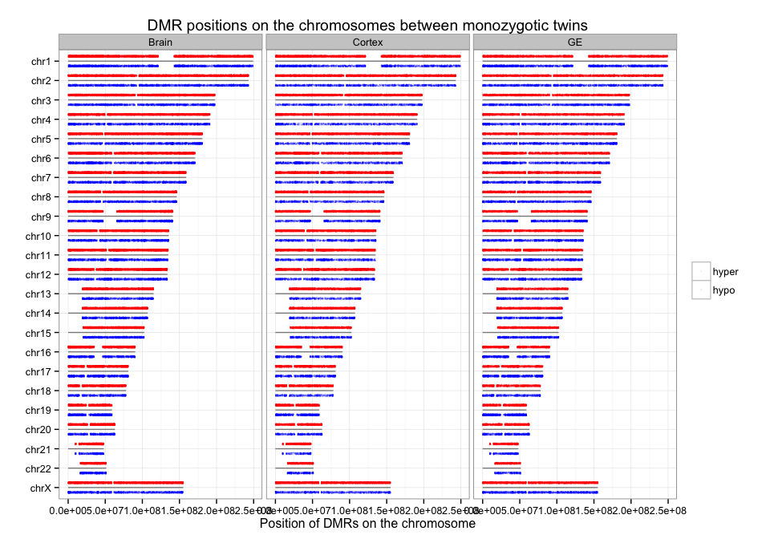

Fetal Brain MeDIP Analysis Summary
========================================================

Gloria Li         
Thu Sep 11 12:33:33 2014 

## DMR analysis from MeDIP fractional calls

  * DM CpG identification: $\Delta$mC < -0.4: hypomethylated; $\Delta$mC > 0.4: hypermethylated.       
  * Collapse DM CpGs into DMRs:   
    + adjacent CpGs have the same DM status;    
    + distance between adjacent CpGs $\le$ 200bp;   
    + No. of CpGs within each DMR $\ge$ 3.   
    
## DMRs between monozygptic twins
### Summary and sanity check

  * On average, there are __160150__ DMR regions identified across three cell types, with __103839__ hypermethylated, and __56311__ hypomethylated.      
  * Average length of all DMRs is __108bp__. __Smaller__ than observed in breast. _Bad script or biology?_      
  * Average No. of CpGs per DMR is __5__. __Same__ as in breast.        
  * Average distance between adjacent DMRs is approximately __18Kb__.         
  * DMRs are scattered along the genome, no obvious chunks of hyper/hypo regions.         

<!-- html table generated in R 3.1.1 by xtable 1.7-3 package -->
<!-- Thu Sep 11 12:33:38 2014 -->
<TABLE border=1>
<TR> <TH>  </TH> <TH> Total </TH> <TH> Hyper </TH> <TH> Hypo </TH>  </TR>
  <TR> <TD> Brain </TD> <TD align="center"> 192955 </TD> <TD align="center"> 126452 </TD> <TD align="center"> 66503 </TD> </TR>
  <TR> <TD> Cortex </TD> <TD align="center"> 147188 </TD> <TD align="center"> 102896 </TD> <TD align="center"> 44292 </TD> </TR>
  <TR> <TD> GE </TD> <TD align="center"> 140309 </TD> <TD align="center"> 82169 </TD> <TD align="center"> 58140 </TD> </TR>
   </TABLE>
    

### MZ DMR asymmetry

  + There is an __asymmetry__ between hyper/hypo DMRs across all three cell types, most significant in cortex neurosphere, and least so in GE neurosphere. Fold change in total DMR length hyper/hypo in Brain is __2.002__, in Cortex is __2.619__, and in GE is __1.497__.    
  
 

### MZ DMR breakdown

  + Majority of DM CpGs overlap with genes, on average __72.46%__. And DM CpGs are __4-fold__ enriched in promoter regions, with on average __47.7%__ DM CpGs are in promoter regions.         
<!-- For the entire genome, 3727169 out of 28217448 CpGs overlap with TSS +/- 1500bp promoter regions -->    
 

### MZ DMR intersect with protein-coding promoters

  + On average, there are __30665__ DMRs associated with promoters of protein-coding genes, __19.15%__ of all DMRs, corresponds to __13347__ protein-coding genes.         
  + These genes are __mostly shared__ by all three cell types.       
  + DAVID enrichment (FDR = 10^-6) shows these genes are enriched in __transcription regulation and neuron development__. 
  
<!-- html table generated in R 3.1.1 by xtable 1.7-3 package -->
<!-- Thu Sep 11 12:34:01 2014 -->
<TABLE border=1>
<TR> <TH>  </TH> <TH> pc.Genes </TH> <TH> unique.Genes </TH> <TH> pc.Promoters </TH> <TH> unique.Promoters </TH> <TH> proximal.DE.Genes </TH> <TH> same.direction </TH> <TH> unique.DE.Genes </TH>  </TR>
  <TR> <TD> Brain </TD> <TD align="center"> 97583 </TD> <TD align="center"> 16273 </TD> <TD align="center"> 31680 </TD> <TD align="center"> 13621 </TD> <TD align="center"> 1286 </TD> <TD align="center"> 641 </TD> <TD align="center"> 440 </TD> </TR>
  <TR> <TD> Cortex </TD> <TD align="center"> 73379 </TD> <TD align="center"> 15714 </TD> <TD align="center"> 30488 </TD> <TD align="center"> 13224 </TD> <TD align="center"> 1441 </TD> <TD align="center"> 726 </TD> <TD align="center"> 479 </TD> </TR>
  <TR> <TD> GE </TD> <TD align="center"> 69709 </TD> <TD align="center"> 15641 </TD> <TD align="center"> 29827 </TD> <TD align="center"> 13196 </TD> <TD align="center"> 362 </TD> <TD align="center"> 172 </TD> <TD align="center"> 124 </TD> </TR>
   </TABLE>
    

### MZ DMR in promoters intersect with DE genes

  + On average, there are __1029__ promoter DMRs associated with DE genes, __3.36%__ of all promoter DMRs. Among them, there are __347__ unique DE genes associated with promoter DMRs across three cell types.         
  + Most of the DE genes are __cell type specific__.       
  + These DE genes are enriched in __neurogenesis and migration__ in both Brain and Cortex, but no enriched terms were found for GE.             

   

