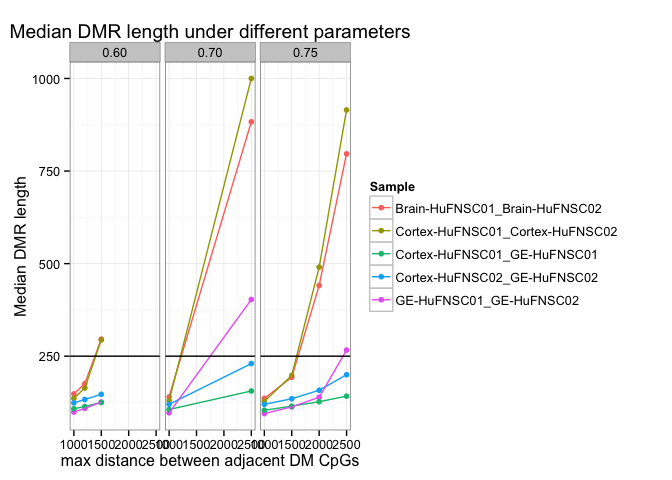
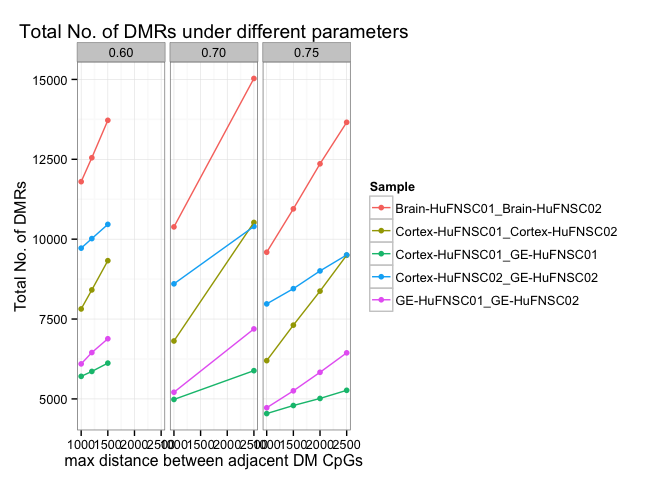
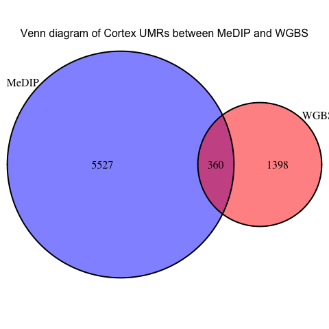
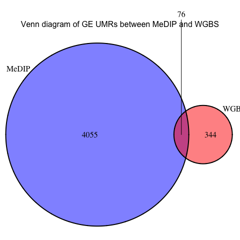
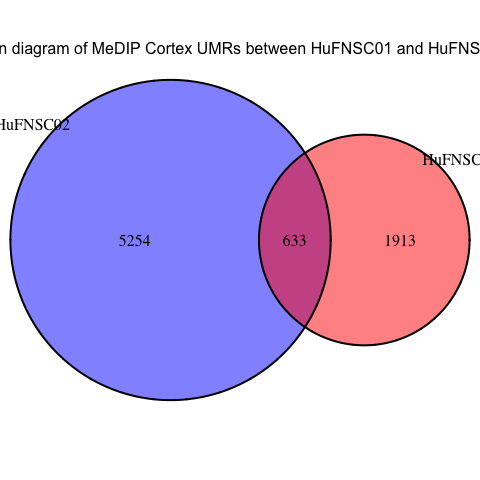
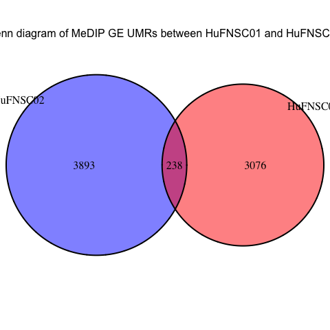

Fetal Brain MeDIP Test Parameters
========================================================

Gloria Li         
Thu Sep 25 12:04:09 2014 

## DMR stats with different parameters  

  * Parameters for MeDIP DMRs: 
    + `m`: fractional methylation of one sample > m. `m = 0.75`
    + `delta`: difference of fractional methylation > delta. `delta = 0.6, 0.7, 0.75`   
    + `size`: max distance between adjacent DM CpGs. `size = 1kB, 1.2kB, 1.5kB, 2kB, 2.5kB`
    + `c`: min No. of CpGs per DMR. `c = 3`  
  * The median DMR length stays ~ 100bp until size increase to 1kB, but if size further increases, median DMR length varies a lot for different samples. 
  
  

## Intersecting MeDIP DMRs between individuals and with WGBS

  + Parameters:
    * MeDIP DMRs: `m = 0.75, delta = 0.6, size = 1.2kB, c = 3`  
    * WGBS DMRs: `m = 0.75, delta = 0.5, p=0.005, size = 300, c = 3` 
  + On average, there are __5.62 times__ DMRs identified with MeDIP compared to WGBS. __19.29%__ of WGBS UMRs overlap with MeDIP UMRs.     
  + On average, __12.14%__ of MeDIP UMRs overlap between the two individuals.  
  + The asymmetry between Cortex and GE is supported in MeDIP HuFNSC02, but __not__ in HuFNSC01. 

<!-- html table generated in R 3.1.1 by xtable 1.7-3 package -->
<!-- Thu Sep 25 12:04:12 2014 -->
<TABLE border=1>
<TR> <TH> Assay </TH> <TH> Donor </TH> <TH> Cortex_UMR </TH> <TH> GE_UMR </TH>  </TR>
  <TR> <TD align="center"> WGBS </TD> <TD align="center"> HuFNSC02 </TD> <TD align="center"> 1758.00 </TD> <TD align="center"> 420.00 </TD> </TR>
  <TR> <TD align="center"> MeDIP </TD> <TD align="center"> HuFNSC02 </TD> <TD align="center"> 5887.00 </TD> <TD align="center"> 4131.00 </TD> </TR>
  <TR> <TD align="center"> MeDIP </TD> <TD align="center"> HuFNSC01 </TD> <TD align="center"> 2546.00 </TD> <TD align="center"> 3314.00 </TD> </TR>
   </TABLE>
    

