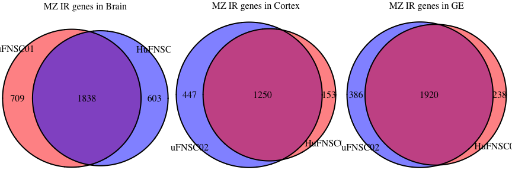

# Fetal Brain - Intron retention summary
Gloria Li  
December 17, 2014  

Update Wed Dec 17 20:38:51 2014

## Summary 
  * There are on average __3261__ retained introns in each sample. The average Intron/Exon ratio is __0.24__.       
  
<table>
 <thead>
  <tr>
   <th style="text-align:center;"> Sample </th>
   <th style="text-align:center;"> IR </th>
   <th style="text-align:center;"> Intron_Exon </th>
  </tr>
 </thead>
<tbody>
  <tr>
   <td style="text-align:center;"> Brain01 </td>
   <td style="text-align:center;"> 4212 </td>
   <td style="text-align:center;"> 0.315206 </td>
  </tr>
  <tr>
   <td style="text-align:center;"> Brain02 </td>
   <td style="text-align:center;"> 3908 </td>
   <td style="text-align:center;"> 0.257299 </td>
  </tr>
  <tr>
   <td style="text-align:center;"> Cortex01 </td>
   <td style="text-align:center;"> 2026 </td>
   <td style="text-align:center;"> 0.177340 </td>
  </tr>
  <tr>
   <td style="text-align:center;"> Cortex02 </td>
   <td style="text-align:center;"> 2666 </td>
   <td style="text-align:center;"> 0.233707 </td>
  </tr>
  <tr>
   <td style="text-align:center;"> Cortex03 </td>
   <td style="text-align:center;"> 2978 </td>
   <td style="text-align:center;"> 0.206882 </td>
  </tr>
  <tr>
   <td style="text-align:center;"> Cortex04 </td>
   <td style="text-align:center;"> 3780 </td>
   <td style="text-align:center;"> 0.237196 </td>
  </tr>
  <tr>
   <td style="text-align:center;"> GE01 </td>
   <td style="text-align:center;"> 3549 </td>
   <td style="text-align:center;"> 0.306185 </td>
  </tr>
  <tr>
   <td style="text-align:center;"> GE02 </td>
   <td style="text-align:center;"> 3767 </td>
   <td style="text-align:center;"> 0.283982 </td>
  </tr>
  <tr>
   <td style="text-align:center;"> GE03 </td>
   <td style="text-align:center;"> 3819 </td>
   <td style="text-align:center;"> 0.266194 </td>
  </tr>
  <tr>
   <td style="text-align:center;"> GE04 </td>
   <td style="text-align:center;"> 1902 </td>
   <td style="text-align:center;"> 0.124020 </td>
  </tr>
</tbody>
</table>
 

## Between MZ twins  
* Majority of IR genes are shared by the MZ twins.     

 

## Between Cortex and GE  
* Most of IR genes are shared by Cortex and GE.     

 

## Between GW 
* Majority of IR genes are also shared by different gestational weeks.   

 

