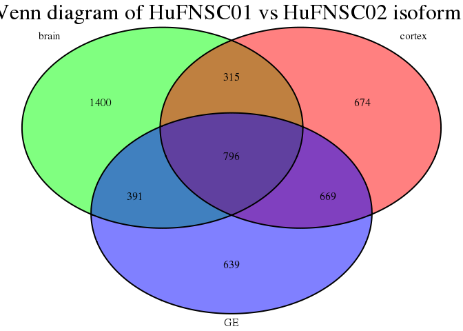
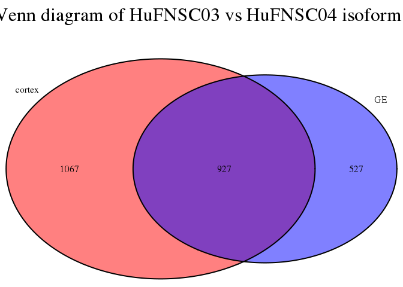
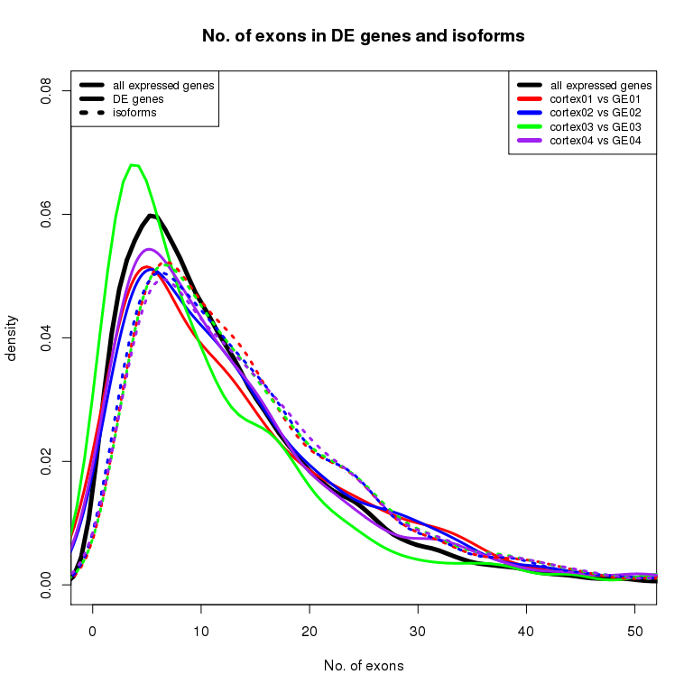
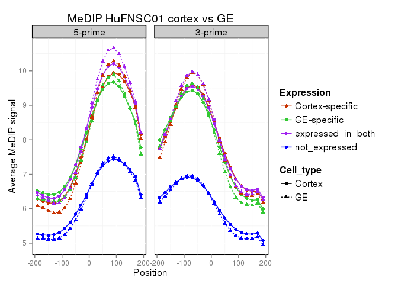
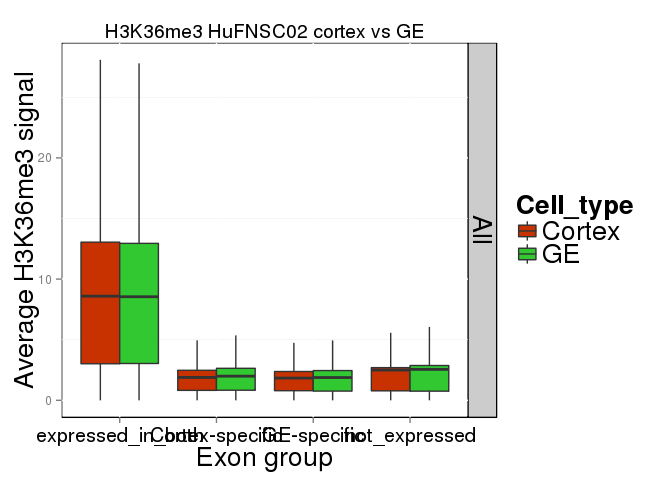

Fetal Brain RNA-seq Analysis Summary
========================================================

Gloria Li         
Updated: Wed Nov  4 12:31:26 2015 

## No. of expressed genes

* No. of expressed pc genes   

 

* No. of expressed nc genes   

 

## Expression of epigenetic regulators

 

## Differential gene expression 
### DEfine

  * FDR = 0.01    
  * Minimum sum of RPKM (rmin) = 0.005    
  * Minimum sum of coverage (Nmin) = 25    
  
### Between cortex and GE neurospheres

  * On average, there are __860__ genes differentially expressed between cortex and GE, among them, __454__ are upregulated in cortex, and __406__ are downregulated.    
  * __382__ Cortex up-regulated genes, and __456__ GE up-regulated genes are shared by at least two individuals.    
  * DAVID enrichment analysis show significant enrichment in __neuronal development__ and __cell migration__ terms, GE up-regulated genes are enriched in __EGF-related__ protein domains as well. 
  * There are __22__ Cortex up-regulated genes, and __26__ GE up-regulated genes shared by all four individuals.    

<!-- html table generated in R 3.1.2 by xtable 1.8-0 package -->
<!-- Wed Nov  4 12:32:20 2015 -->
<table border=1>
<tr> <th>  </th> <th> UP </th> <th> DN </th> <th> DE </th>  </tr>
  <tr> <td> HuFNSC01 </td> <td align="center"> 403 </td> <td align="center"> 508 </td> <td align="center"> 911 </td> </tr>
  <tr> <td> HuFNSC02 </td> <td align="center"> 588 </td> <td align="center"> 640 </td> <td align="center"> 1228 </td> </tr>
  <tr> <td> HuFNSC03 </td> <td align="center"> 447 </td> <td align="center"> 227 </td> <td align="center"> 674 </td> </tr>
  <tr> <td> HuFNSC04 </td> <td align="center"> 378 </td> <td align="center"> 249 </td> <td align="center"> 627 </td> </tr>
   </table>
  

  

<!-- html table generated in R 3.1.2 by xtable 1.8-0 package -->
<!-- Wed Nov  4 12:32:22 2015 -->
<table border=1>
<tr> <th> DE </th> <th> name </th> <th> description </th>  </tr>
  <tr> <td align="center"> UP </td> <td align="right"> SLC1A6 </td> <td align="right"> solute_carrier_family_1_(high_affinity_aspartate/glutamate_transporter),_member_6 </td> </tr>
  <tr> <td align="center"> UP </td> <td align="right"> PCDH20 </td> <td align="right"> protocadherin_20 </td> </tr>
  <tr> <td align="center"> UP </td> <td align="right"> C9orf64 </td> <td align="right"> chromosome_9_open_reading_frame_64 </td> </tr>
  <tr> <td align="center"> UP </td> <td align="right"> GFAP </td> <td align="right"> glial_fibrillary_acidic_protein </td> </tr>
  <tr> <td align="center"> UP </td> <td align="right"> ZIC5 </td> <td align="right"> Zic_family_member_5 </td> </tr>
  <tr> <td align="center"> UP </td> <td align="right"> NEFM </td> <td align="right"> neurofilament,_medium_polypeptide </td> </tr>
  <tr> <td align="center"> UP </td> <td align="right"> QPCT </td> <td align="right"> glutaminyl-peptide_cyclotransferase </td> </tr>
  <tr> <td align="center"> UP </td> <td align="right"> UNC5C </td> <td align="right"> unc-5_homolog_C_(C._elegans) </td> </tr>
  <tr> <td align="center"> UP </td> <td align="right"> ZIC2 </td> <td align="right"> Zic_family_member_2 </td> </tr>
  <tr> <td align="center"> UP </td> <td align="right"> XKR8 </td> <td align="right"> XK,_Kell_blood_group_complex_subunit-related_family,_member_8 </td> </tr>
  <tr> <td align="center"> UP </td> <td align="right"> PYGL </td> <td align="right"> phosphorylase,_glycogen,_liver </td> </tr>
  <tr> <td align="center"> UP </td> <td align="right"> SERINC2 </td> <td align="right"> serine_incorporator_2 </td> </tr>
  <tr> <td align="center"> UP </td> <td align="right"> KIAA1239 </td> <td align="right"> KIAA1239 </td> </tr>
  <tr> <td align="center"> UP </td> <td align="right"> B3GALT1 </td> <td align="right"> UDP-Gal:betaGlcNAc_beta_1,3-galactosyltransferase,_polypeptide_1 </td> </tr>
  <tr> <td align="center"> UP </td> <td align="right"> CCDC48 </td> <td align="right"> coiled-coil_domain_containing_48 </td> </tr>
  <tr> <td align="center"> UP </td> <td align="right"> NOS1AP </td> <td align="right"> nitric_oxide_synthase_1_(neuronal)_adaptor_protein </td> </tr>
  <tr> <td align="center"> UP </td> <td align="right"> ADAM19 </td> <td align="right"> ADAM_metallopeptidase_domain_19 </td> </tr>
  <tr> <td align="center"> UP </td> <td align="right"> H1F0 </td> <td align="right"> H1_histone_family,_member_0 </td> </tr>
  <tr> <td align="center"> UP </td> <td align="right"> ZIC3 </td> <td align="right"> Zic_family_member_3 </td> </tr>
  <tr> <td align="center"> UP </td> <td align="right"> NT5E </td> <td align="right"> 5'-nucleotidase,_ecto_(CD73) </td> </tr>
  <tr> <td align="center"> UP </td> <td align="right"> SYNM </td> <td align="right"> synemin,_intermediate_filament_protein </td> </tr>
  <tr> <td align="center"> UP </td> <td align="right"> C1orf226 </td> <td align="right"> chromosome_1_open_reading_frame_226 </td> </tr>
   </table>
<!-- html table generated in R 3.1.2 by xtable 1.8-0 package -->
<!-- Wed Nov  4 12:32:22 2015 -->
<table border=1>
<tr> <th> DE </th> <th> name </th> <th> description </th>  </tr>
  <tr> <td align="center"> DN </td> <td align="right"> DPPA4 </td> <td align="right"> developmental_pluripotency_associated_4 </td> </tr>
  <tr> <td align="center"> DN </td> <td align="right"> VAX1 </td> <td align="right"> ventral_anterior_homeobox_1 </td> </tr>
  <tr> <td align="center"> DN </td> <td align="right"> SHISA6 </td> <td align="right"> shisa_homolog_6_(Xenopus_laevis) </td> </tr>
  <tr> <td align="center"> DN </td> <td align="right"> NRXN3 </td> <td align="right"> neurexin_3 </td> </tr>
  <tr> <td align="center"> DN </td> <td align="right"> FGFR2 </td> <td align="right"> fibroblast_growth_factor_receptor_2 </td> </tr>
  <tr> <td align="center"> DN </td> <td align="right"> ST8SIA2 </td> <td align="right"> ST8_alpha-N-acetyl-neuraminide_alpha-2,8-sialyltransferase_2 </td> </tr>
  <tr> <td align="center"> DN </td> <td align="right"> SLC32A1 </td> <td align="right"> solute_carrier_family_32_(GABA_vesicular_transporter),_member_1 </td> </tr>
  <tr> <td align="center"> DN </td> <td align="right"> FEZF1 </td> <td align="right"> FEZ_family_zinc_finger_1 </td> </tr>
  <tr> <td align="center"> DN </td> <td align="right"> AJAP1 </td> <td align="right"> adherens_junctions_associated_protein_1 </td> </tr>
  <tr> <td align="center"> DN </td> <td align="right"> ZNF703 </td> <td align="right"> zinc_finger_protein_703 </td> </tr>
  <tr> <td align="center"> DN </td> <td align="right"> VSIG10L </td> <td align="right"> V-set_and_immunoglobulin_domain_containing_10_like </td> </tr>
  <tr> <td align="center"> DN </td> <td align="right"> SIX3 </td> <td align="right"> SIX_homeobox_3 </td> </tr>
  <tr> <td align="center"> DN </td> <td align="right"> SORL1 </td> <td align="right"> sortilin-related_receptor,_L(DLR_class)_A_repeats_containing </td> </tr>
  <tr> <td align="center"> DN </td> <td align="right"> LMO1 </td> <td align="right"> LIM_domain_only_1_(rhombotin_1) </td> </tr>
  <tr> <td align="center"> DN </td> <td align="right"> ODZ1 </td> <td align="right"> odz,_odd_Oz/ten-m_homolog_1_(Drosophila) </td> </tr>
  <tr> <td align="center"> DN </td> <td align="right"> EPHA3 </td> <td align="right"> EPH_receptor_A3 </td> </tr>
  <tr> <td align="center"> DN </td> <td align="right"> TIMP3 </td> <td align="right"> TIMP_metallopeptidase_inhibitor_3 </td> </tr>
  <tr> <td align="center"> DN </td> <td align="right"> CAMK2N1 </td> <td align="right"> calcium/calmodulin-dependent_protein_kinase_II_inhibitor_1 </td> </tr>
  <tr> <td align="center"> DN </td> <td align="right"> EEF1A2 </td> <td align="right"> eukaryotic_translation_elongation_factor_1_alpha_2 </td> </tr>
  <tr> <td align="center"> DN </td> <td align="right"> OTX2 </td> <td align="right"> orthodenticle_homeobox_2 </td> </tr>
  <tr> <td align="center"> DN </td> <td align="right"> CHL1 </td> <td align="right"> cell_adhesion_molecule_with_homology_to_L1CAM_(close_homolog_of_L1) </td> </tr>
  <tr> <td align="center"> DN </td> <td align="right"> PCSK1N </td> <td align="right"> proprotein_convertase_subtilisin/kexin_type_1_inhibitor </td> </tr>
  <tr> <td align="center"> DN </td> <td align="right"> LMO2 </td> <td align="right"> LIM_domain_only_2_(rhombotin-like_1) </td> </tr>
  <tr> <td align="center"> DN </td> <td align="right"> ASTN1 </td> <td align="right"> astrotactin_1 </td> </tr>
  <tr> <td align="center"> DN </td> <td align="right"> BASP1 </td> <td align="right"> brain_abundant,_membrane_attached_signal_protein_1 </td> </tr>
  <tr> <td align="center"> DN </td> <td align="right"> ADCYAP1R1 </td> <td align="right"> adenylate_cyclase_activating_polypeptide_1_(pituitary)_receptor_type_I </td> </tr>
   </table>

### Between MZ twins - HuFNSC01 vs HuFNSC02

  * On average, there are __470__ DE genes across three cells types.   
  * Majority of DE genes are cell type specific, only __98__ are shared between any two cell types.   
  * DE genes in Brain is asymmetric, _maybe due to cell heterogenity?_   
  * There are much fewer DE genes in GE.    
  * DAVID enrichment analysis between MZ twins in brain and cortex show similar GO term in __brain development__, but there is no significantly enriched terms in GE.    

<!-- html table generated in R 3.1.2 by xtable 1.8-0 package -->
<!-- Wed Nov  4 12:32:22 2015 -->
<table border=1>
<tr> <th>  </th> <th> UP </th> <th> DN </th> <th> DE </th>  </tr>
  <tr> <td> brain01_brain02 </td> <td align="center"> 461 </td> <td align="center"> 181 </td> <td align="center"> 642 </td> </tr>
  <tr> <td> cortex01_cortex02 </td> <td align="center"> 248 </td> <td align="center"> 348 </td> <td align="center"> 596 </td> </tr>
  <tr> <td> GE01_GE02 </td> <td align="center">  99 </td> <td align="center">  74 </td> <td align="center"> 173 </td> </tr>
   </table>
 

  

<!-- html table generated in R 3.1.2 by xtable 1.8-0 package -->
<!-- Wed Nov  4 12:32:23 2015 -->
<table border=1>
<tr> <th> name </th> <th> description </th> <th> Brain </th> <th> Cortex </th> <th> GE </th>  </tr>
  <tr> <td align="right"> LMO1 </td> <td align="right"> LIM_domain_only_1_(rhombotin_1) </td> <td align="center"> UP </td> <td align="center"> DN </td> <td align="center"> DN </td> </tr>
  <tr> <td align="right"> CXCR7 </td> <td align="right"> chemokine_(C-X-C_motif)_receptor_7 </td> <td align="center"> UP </td> <td align="center"> UP </td> <td align="center"> DN </td> </tr>
  <tr> <td align="right"> SPP1 </td> <td align="right"> secreted_phosphoprotein_1 </td> <td align="center"> UP </td> <td align="center"> DN </td> <td align="center"> DN </td> </tr>
  <tr> <td align="right"> NPY </td> <td align="right"> neuropeptide_Y </td> <td align="center"> UP </td> <td align="center"> DN </td> <td align="center"> DN </td> </tr>
  <tr> <td align="right"> COL2A1 </td> <td align="right"> collagen,_type_II,_alpha_1 </td> <td align="center"> DN </td> <td align="center"> UP </td> <td align="center"> UP </td> </tr>
  <tr> <td align="right"> BCL6 </td> <td align="right"> B-cell_CLL/lymphoma_6 </td> <td align="center"> DN </td> <td align="center"> DN </td> <td align="center"> DN </td> </tr>
   </table>

## Isoform analysis
### Isoform identification and junction validation  
  * DEfine on exons: FDR = 0.01     
  * Exon expressed in one sample ($\ge$ 10% gene RPKM) and not expressed in the other ($\le$ 1% gene RPKM)   
  * Gene is not DE: DEfine FDR = 0.01
  * Gene is expressed in both samples: gene RPKM > 0.01         
  * Validation: For each isoform exon in the previous pairwise comparison
    + Find junctions associated with this exon with enough coverage, i.e. sum of junction coverage of two samples $\ge$ 1
    + Identify junctions that RPKM change in the same direction as the exon
    + Junction RPKM > 0.1 in one sample and < 0.1 in the other      

#### Between cortex and GE neurospheres

  * On average, __2054__ genes are identified as isoforms between cortex and GE in each individual. __2352__ genes are shared in at least two individuals.       
  * There are more individual-specific isoforms than found in breast cells, although the overlap across individuals are still significant.     
  * Individual specific isoforms between cortex and GE have __no__ significantly enriched terms, suggesting they are more likely random events without biological functions.          
  * Isoforms shared by at least two individuals are enriched in terms related to __cellular signaling__. InterPro protein domain enrichment show enriched terms similar to those observed in breast isoforms.         

<!-- html table generated in R 3.1.2 by xtable 1.8-0 package -->
<!-- Wed Nov  4 12:32:23 2015 -->
<table border=1>
<tr> <th>  </th> <th> DE_genes </th> <th> DE_exons </th> <th> with_expressed_genes </th> <th> isoform_exons </th> <th> exclude_DE_genes </th> <th> isoform_genes </th>  </tr>
  <tr> <td> cortex01_GE01_summary </td> <td align="center"> 911 </td> <td align="center"> 32372 </td> <td align="center"> 18968 </td> <td align="center"> 8440 </td> <td align="center"> 7962 </td> <td align="center"> 2447 </td> </tr>
  <tr> <td> cortex02_GE02_summary </td> <td align="center"> 1228 </td> <td align="center"> 35196 </td> <td align="center"> 21880 </td> <td align="center"> 8163 </td> <td align="center"> 7374 </td> <td align="center"> 2298 </td> </tr>
  <tr> <td> cortex03_GE03_summary </td> <td align="center"> 674 </td> <td align="center"> 29617 </td> <td align="center"> 13746 </td> <td align="center"> 6401 </td> <td align="center"> 6022 </td> <td align="center"> 2086 </td> </tr>
  <tr> <td> cortex04_GE04_summary </td> <td align="center"> 627 </td> <td align="center"> 22386 </td> <td align="center"> 11253 </td> <td align="center"> 4323 </td> <td align="center"> 4259 </td> <td align="center"> 1386 </td> </tr>
   </table>
 

 

#### Between MZ twins - HuFNSC01 vs HuFNSC02

  * On average, __2617__ genes are identified as isoforms between HuFNSC01 and HuFNSC02 in each cell type. __796__ genes are shared by all three cell types.              
  * On average, __1724__ genes are identified as isoforms between HuFNSC03 and HuFNSC04 in each cell type. __927__ genes are shared between two cell types.            
  * Different regions on the Venn diagram have __no__ significantly enriched terms.     
  * Isoforms between HuFNSC01 and HuFNSC02 in neurospheres show similar terms, related to __cell signaling__, and __blood cell development__ in brain.     

<!-- html table generated in R 3.1.2 by xtable 1.8-0 package -->
<!-- Wed Nov  4 12:32:24 2015 -->
<table border=1>
<tr> <th>  </th> <th> DE_genes </th> <th> DE_exons </th> <th> with_expressed_genes </th> <th> isoform_exons </th> <th> exclude_DE_genes </th> <th> isoform_genes </th>  </tr>
  <tr> <td> brain01_brain02_summary </td> <td align="center"> 642 </td> <td align="center"> 32138 </td> <td align="center"> 16302 </td> <td align="center"> 8980 </td> <td align="center"> 8542 </td> <td align="center"> 2902 </td> </tr>
  <tr> <td> cortex01_cortex02_summary </td> <td align="center"> 596 </td> <td align="center"> 26983 </td> <td align="center"> 15554 </td> <td align="center"> 7618 </td> <td align="center"> 7445 </td> <td align="center"> 2454 </td> </tr>
  <tr> <td> GE01_GE02_summary </td> <td align="center"> 173 </td> <td align="center"> 23810 </td> <td align="center"> 12862 </td> <td align="center"> 7402 </td> <td align="center"> 7351 </td> <td align="center"> 2495 </td> </tr>
  <tr> <td> cortex03_cortex04_summary </td> <td align="center"> 642 </td> <td align="center"> 26826 </td> <td align="center"> 12185 </td> <td align="center"> 5818 </td> <td align="center"> 5479 </td> <td align="center"> 1994 </td> </tr>
  <tr> <td> GE03_GE04_summary </td> <td align="center"> 545 </td> <td align="center"> 24752 </td> <td align="center"> 12223 </td> <td align="center"> 4582 </td> <td align="center"> 4422 </td> <td align="center"> 1454 </td> </tr>
   </table>
  

   

#### Junction validation
  + For cortex vs GE, on average, __36.4%__ isoform genes have enough junction coverage. Among them, __89.8%__ have support from junction reads.    
  + For comparisons between individuals, on average, __34.4%__ isoform genes have enough junction coverage. Among them, __87.7%__ have support from junction reads.     
  + Between strand specific and non-strand specific libraries, the percentage of isoforms with enough junction coverage are __similar__, however, strand specific libraries have __higher__ percentage of having junction support (> 98% compared to ~ 80%).   

<!-- html table generated in R 3.1.2 by xtable 1.8-0 package -->
<!-- Wed Nov  4 12:32:25 2015 -->
<table border=1>
<tr> <th>  </th> <th> isoform exons </th> <th> isoform genes </th> <th> exons with junction coverage </th> <th> genes with junction coverage </th> <th> exons with junction support </th> <th> genes with junction support </th>  </tr>
  <tr> <td> cortex01_GE01_summary </td> <td align="center"> 7962 </td> <td align="center"> 2447 </td> <td align="center"> 1900 </td> <td align="center"> 832 </td> <td align="center"> 1543 </td> <td align="center"> 697 </td> </tr>
  <tr> <td> cortex02_GE02_summary </td> <td align="center"> 7374 </td> <td align="center"> 2298 </td> <td align="center"> 1962 </td> <td align="center"> 801 </td> <td align="center"> 1554 </td> <td align="center"> 656 </td> </tr>
  <tr> <td> cortex03_GE03_summary </td> <td align="center"> 6022 </td> <td align="center"> 2086 </td> <td align="center"> 1972 </td> <td align="center"> 872 </td> <td align="center"> 1836 </td> <td align="center"> 824 </td> </tr>
  <tr> <td> cortex04_GE04_summary </td> <td align="center"> 4259 </td> <td align="center"> 1386 </td> <td align="center"> 941 </td> <td align="center"> 483 </td> <td align="center"> 935 </td> <td align="center"> 478 </td> </tr>
   </table>
<!-- html table generated in R 3.1.2 by xtable 1.8-0 package -->
<!-- Wed Nov  4 12:32:25 2015 -->
<table border=1>
<tr> <th>  </th> <th> isoform exons </th> <th> isoform genes </th> <th> exons with junction coverage </th> <th> genes with junction coverage </th> <th> exons with junction support </th> <th> genes with junction support </th>  </tr>
  <tr> <td> brain01_brain02_summary </td> <td align="center"> 8542 </td> <td align="center"> 2902 </td> <td align="center"> 1791 </td> <td align="center"> 921 </td> <td align="center"> 1520 </td> <td align="center"> 808 </td> </tr>
  <tr> <td> cortex01_cortex02_summary </td> <td align="center"> 7445 </td> <td align="center"> 2454 </td> <td align="center"> 1634 </td> <td align="center"> 765 </td> <td align="center"> 1221 </td> <td align="center"> 623 </td> </tr>
  <tr> <td> GE01_GE02_summary </td> <td align="center"> 7351 </td> <td align="center"> 2495 </td> <td align="center"> 1469 </td> <td align="center"> 737 </td> <td align="center"> 1030 </td> <td align="center"> 561 </td> </tr>
  <tr> <td> cortex03_cortex04_summary </td> <td align="center"> 5479 </td> <td align="center"> 1994 </td> <td align="center"> 1949 </td> <td align="center"> 883 </td> <td align="center"> 1825 </td> <td align="center"> 830 </td> </tr>
  <tr> <td> GE03_GE04_summary </td> <td align="center"> 4422 </td> <td align="center"> 1454 </td> <td align="center"> 1045 </td> <td align="center"> 515 </td> <td align="center"> 1038 </td> <td align="center"> 511 </td> </tr>
   </table>

### No. of exons for DE genes / isoform genes    
  * DE genes have roughly the same No. of exons as all expressed genes.             
  * Identified isoforms have slightly more No. of exons than DE genes and all expressed genes.  
  * Compared to DE genes, the distribution in No. of exons for isoforms are __much similar__ between different individuals, _not observed in breast libraries_.    
  
 

### Position of isoform exons on the gene   
  * In general, there are more alternative spliced exons at the __two ends__ of genes, _similar to observed in breast libraries_.         
  
 

### Venn Diagram with average expression level, average No. of exons and average exon length   
  * Isoforms have __much lower__ expression level than all expressed genes.          
  * On average, common isoforms between different comparisons have __lower expression level__ than comparison-specific isoforms.                 
  * In general, compared to all isoforms identified, validated isoforms have __lower__ expression levels, _not observed in breast libraries_.     
  * Average No. of exons are very __similar__ in different sections of the Venn diagram, between all, validated isoforms and all expressed genes.        
  * Average length of isoform exons are __shorter__ than all expressed genes. Validated isoform exons are also __shorter__ than all isoforms in general, _not observed in breast libraries_.         
  
    

## Epigenetic signature marking 
### Between cortex and GE neurospheres
#### DNA methylation at exon boundaries 
* 5mC at cassette exon boundaries has similar pattern to expressed in both exons.   
* 5mC for cassette exons between cortex and GE neurospheres shows no significant differences.   
* Results from both WGBS (HuFNSC02 & HuFNSC04) and MeDIP (HuFNSC01 & HuFNSC02) support the assumption that 5mC is a stable mark for exon transcription during development.   
* 5mC exon marking is established between neurospheres. _Needs further validation against H1_.   

    

#### H3K36me3 in exon bodies
* H3K36me3 in expressed in both / not expressed exons shows no significant differences between HuFNSC01 and HuFNSC02.    
* H3K36me3 in cassette exons in HuFNSC01 are enriched in GE compared to cortex. However, it is not reproduced in HuFNSC02, where there is no significant differences between cortex and GE. _Not sure what to make of this. Are there any potential bias?_    

  

### Between MZ twins - HuFNSC01 vs HuFNSC02
#### DNA methylation at exon boundaries 
* 5mC for cassette exons between HuFNSC01 and HuFNSC02 shows no significant differences.   
* There are significant differences in 5mC between HuFNSC01 and HuFNSC02 specific exons in all three cell types.   
* In brain, 5mC in HuFNSC02 specific exons are closer to expressed in both, and HuFNSC01 specific exons are closer to not expressed exons. However, we observe the opposite trend in cortex and GE. _Is this a reflection of developmental stages differences between MZ twins? Are the opposite trends between brain and cortex/GE because of cell culture? Or could all these differences be technical bias / noise?_    

   

#### H3K36me3 in exon bodies
* There are some differences between HuFNSC01 and HuFNSC02 in expressed in both and not expressed exons, less so in GE.   
* For cassette exons, HuFNSC02 have enriched H3K36me3 compared to HuFNSC01 in both brain and cortex, but __not__ in GE. _Could this be related to the asymmetry we observed in DNA methylation in brain and cortex?_   

   

