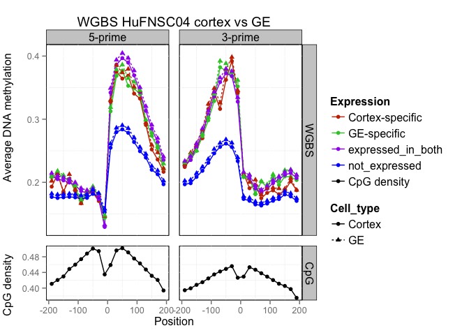
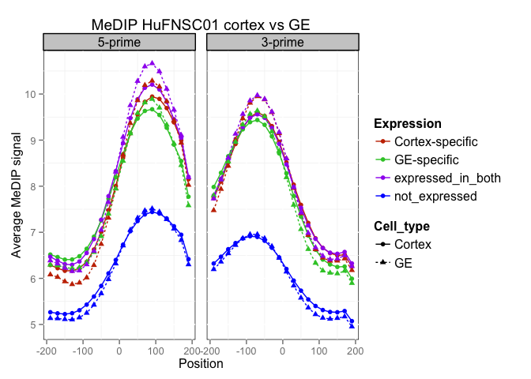
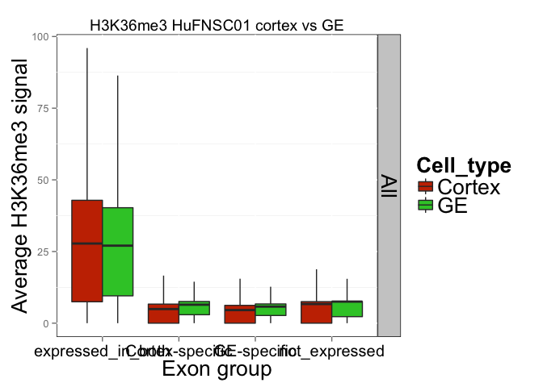
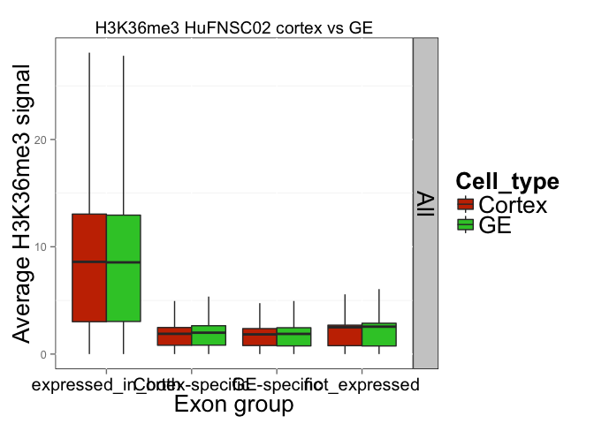
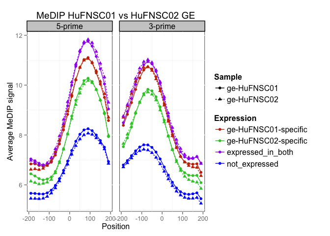
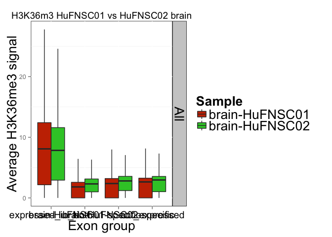
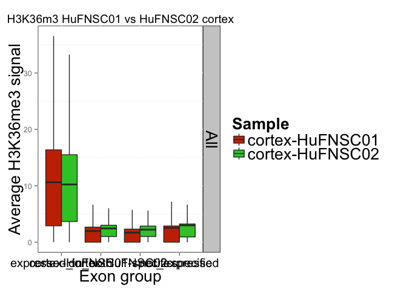
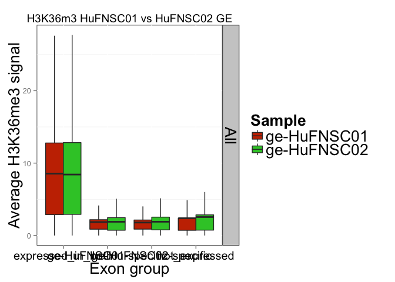

Fetal Brain isoform analysis - epiProfile
========================================================

Gloria Li         
Sun Sep  7 11:16:56 2014 

<!-- re-knit after modify epiProfile.R script -->

## Between cortex and GE neurospheres
### DNA methylation at exon boundaries 
* 5mC at cassette exon boundaries has similar pattern to expressed in both exons.   
* 5mC for cassette exons between cortex and GE neurospheres shows no significant differences.   
* Results from both WGBS (HuFNSC02 & HuFNSC04) and MeDIP (HuFNSC01 & HuFNSC02) support the assumption that 5mC is a stable mark for exon transcription during development.   
* 5mC exon marking is established between neurospheres. _Needs further validation against H1_.   

    

### H3K36me3 in exon bodies
* H3K36me3 in expressed in both / not expressed exons shows no significant differences between HuFNSC01 and HuFNSC02.    
* H3K36me3 in cassette exons in HuFNSC01 are enriched in GE compared to cortex. However, it is not reproduced in HuFNSC02, where there is no significant differences between cortex and GE. _Not sure what to make of this. Are there any potential bias?_    

  

## Between monozygotic twins 
### DNA methylation at exon boundaries 
* 5mC for cassette exons between HuFNSC01 and HuFNSC02 shows no significant differences.   
* There are significant differences in 5mC between HuFNSC01 and HuFNSC02 specific exons in all three cell types.   
* In brain, 5mC in HuFNSC02 specific exons are closer to expressed in both, and HuFNSC01 specific exons are closer to not expressed exons. However, we observe the opposite trend in cortex and GE. _Is this a reflection of developmental stages differences between MZ twins? Are the opposite trends between brain and cortex/GE because of cell culture? Or could all these differences be technical bias / noise?_    

   

### H3K36me3 in exon bodies
* There are some differences between HuFNSC01 and HuFNSC02 in expressed in both and not expressed exons, less so in GE.   
* For cassette exons, HuFNSC02 have enriched H3K36me3 compared to HuFNSC01 in both brain and cortex, but __not__ in GE. _Could this be related to the asymmetry we observed in DNA methylation in brain and cortex?_   

   

