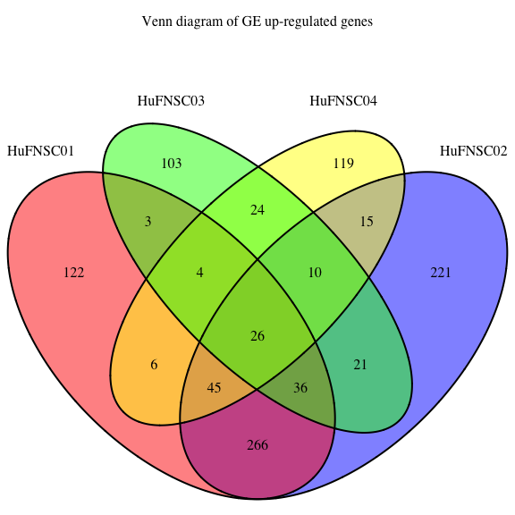
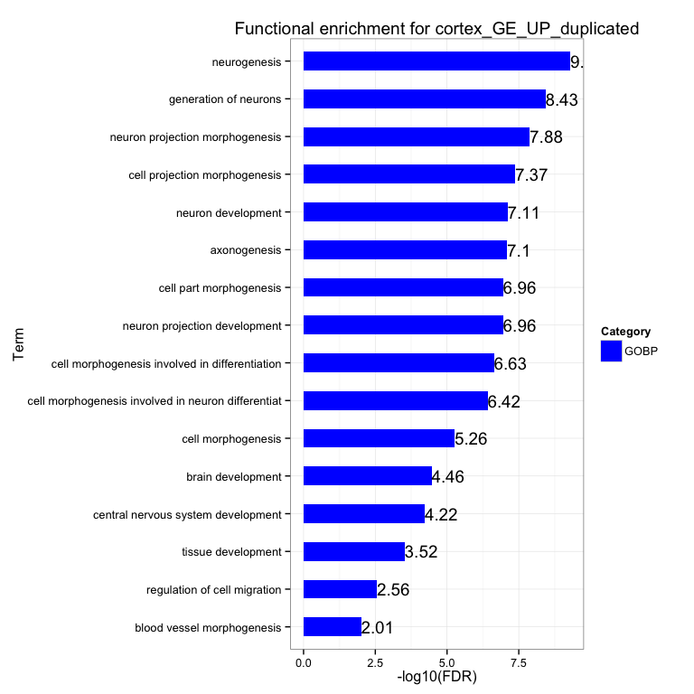
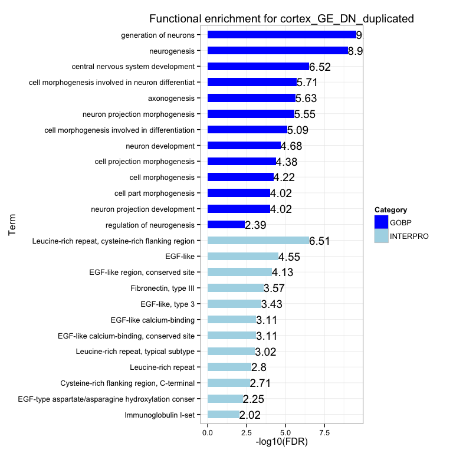
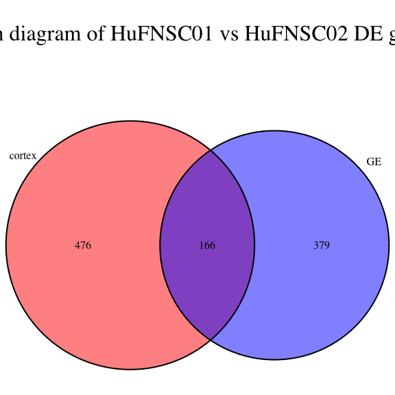

Fetal Brain RNA-seq - DE genes 
========================================================

Gloria Li         
Sat Sep 27 15:20:00 2014 


## Differentially expressed genes
### DEfine

  * FDR = 0.01    
  * Minimum sum of RPKM (rmin) = 0.005    
  * Minimum sum of coverage (Nmin) = 25    
  
### Between cortex and GE neurospheres

  * On average, there are __860__ genes differentially expressed between cortex and GE, among them, __454__ are upregulated in cortex, and __406__ are downregulated.    
  * __382__ Cortex up-regulated genes, and __456__ GE up-regulated genes are shared by at least two individuals.    
  * DAVID enrichment analysis show significant enrichment in __neuronal development__ and __cell migration__ terms, as well as __EGF-related__ protein domains. 

<!-- html table generated in R 3.1.1 by xtable 1.7-3 package -->
<!-- Sat Sep 27 15:20:02 2014 -->
<TABLE border=1>
<TR> <TH>  </TH> <TH> UP </TH> <TH> DN </TH> <TH> DE </TH>  </TR>
  <TR> <TD> HuFNSC01 </TD> <TD align="center"> 403 </TD> <TD align="center"> 508 </TD> <TD align="center"> 911 </TD> </TR>
  <TR> <TD> HuFNSC02 </TD> <TD align="center"> 588 </TD> <TD align="center"> 640 </TD> <TD align="center"> 1228 </TD> </TR>
  <TR> <TD> HuFNSC03 </TD> <TD align="center"> 447 </TD> <TD align="center"> 227 </TD> <TD align="center"> 674 </TD> </TR>
  <TR> <TD> HuFNSC04 </TD> <TD align="center"> 378 </TD> <TD align="center"> 249 </TD> <TD align="center"> 627 </TD> </TR>
   </TABLE>
  

  

### Between MZ twins - HuFNSC01 vs HuFNSC02

  * On average, there are __470__ DE genes across three cells types.   
  * Majority of DE genes are cell type specific, only __98__ are shared between any two cell types.   
  * DAVID enrichment analysis between MZ twins in brain and cortex show similar GO term in __brain development__, but there is no significantly enriched terms in GE.    

<!-- html table generated in R 3.1.1 by xtable 1.7-3 package -->
<!-- Sat Sep 27 15:20:04 2014 -->
<TABLE border=1>
<TR> <TH>  </TH> <TH> UP </TH> <TH> DN </TH> <TH> DE </TH>  </TR>
  <TR> <TD> brain01_brain02 </TD> <TD align="center"> 461 </TD> <TD align="center"> 181 </TD> <TD align="center"> 642 </TD> </TR>
  <TR> <TD> cortex01_cortex02 </TD> <TD align="center"> 248 </TD> <TD align="center"> 348 </TD> <TD align="center"> 596 </TD> </TR>
  <TR> <TD> GE01_GE02 </TD> <TD align="center">  99 </TD> <TD align="center">  74 </TD> <TD align="center"> 173 </TD> </TR>
  <TR> <TD> cortex03_GE03 </TD> <TD align="center"> 459 </TD> <TD align="center"> 183 </TD> <TD align="center"> 642 </TD> </TR>
  <TR> <TD> cortex04_GE04 </TD> <TD align="center"> 313 </TD> <TD align="center"> 232 </TD> <TD align="center"> 545 </TD> </TR>
   </TABLE>
  

  

```
## [1] "No enrichment for GE01_GE02DE"
```


