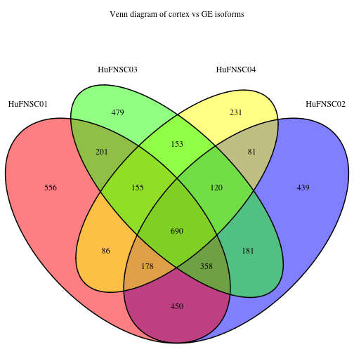
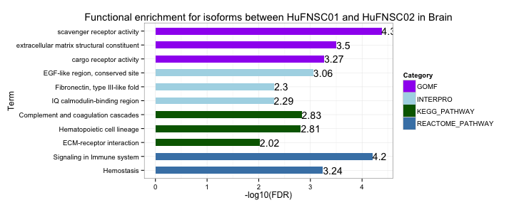
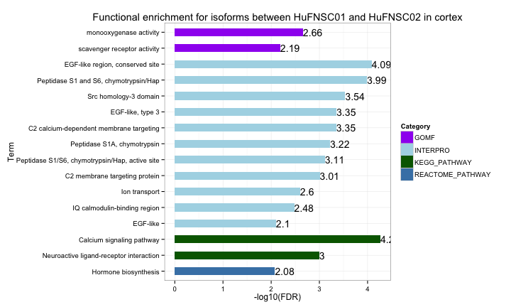
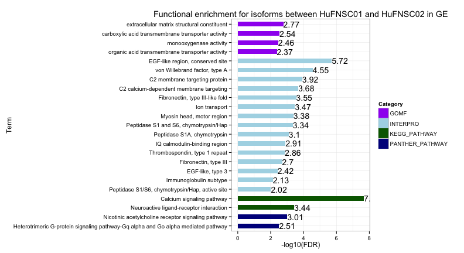
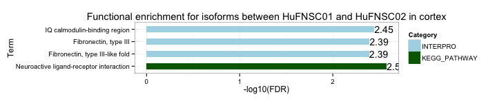
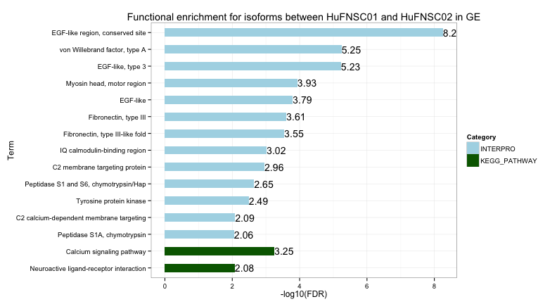

Fetal Brain isoform analysis 
========================================================

Gloria Li         
Wed Apr 23 15:31:14 2014 

<!-- re-knit after modify isoform2.R script -->

## Isoform identification
  * DEfine on exons: FDR = 0.01     
  * Exon expressed in one sample ($\ge$ 10% gene RPKM) and not expressed in the other ($\le$ 1% gene RPKM)   
  * Gene is not DE: DEfine FDR = 0.01
  * Gene is expressed in both samples: gene RPKM > 0.005         

## Isoform genes between cortex and GE

  * On average, __2300__ genes are identified as isoforms between cortex and GE in each individual. __2653__ genes are shared in at least two individuals.              

<!-- html table generated in R 3.0.2 by xtable 1.7-1 package -->
<!-- Wed Apr 23 15:31:16 2014 -->
<TABLE border=1>
<TR> <TH>  </TH> <TH> DE_exons </TH> <TH> pc_DE_exons </TH> <TH> gene_expressed </TH> <TH> gene_not_DE </TH> <TH> isoform_exons </TH> <TH> isoform_genes </TH>  </TR>
  <TR> <TD> HuFNSC01 </TD> <TD align="center"> 32372 </TD> <TD align="center"> 22644 </TD> <TD align="center"> 20095 </TD> <TD align="center"> 13853 </TD> <TD align="center"> 8862 </TD> <TD align="center"> 2674 </TD> </TR>
  <TR> <TD> HuFNSC02 </TD> <TD align="center"> 35196 </TD> <TD align="center"> 25838 </TD> <TD align="center"> 22862 </TD> <TD align="center"> 13286 </TD> <TD align="center"> 8064 </TD> <TD align="center"> 2497 </TD> </TR>
  <TR> <TD> HuFNSC03 </TD> <TD align="center"> 29617 </TD> <TD align="center"> 18357 </TD> <TD align="center"> 14924 </TD> <TD align="center"> 11918 </TD> <TD align="center"> 6959 </TD> <TD align="center"> 2337 </TD> </TR>
  <TR> <TD> HuFNSC04 </TD> <TD align="center"> 22386 </TD> <TD align="center"> 15349 </TD> <TD align="center"> 12581 </TD> <TD align="center"> 9393 </TD> <TD align="center"> 5526 </TD> <TD align="center"> 1694 </TD> </TR>
   </TABLE>
 

### Functional enrichment analysis 
  * Individual specific isoforms between cortex and GE have __no__ significantly enriched terms, suggesting they are more likely random events without biological functions.          
  * Isoforms shared by at least two individuals are enriched in terms related to __neuronal signaling__. InterPro protein domain enrichment show enriched terms similar to those observed in breast isoforms.         

 

## Isoform genes between monozygotic twins

  * On average, __2807__ genes are identified as isoforms between HuFNSC01 and HuFNSC02 in each cell type. __934__ genes are shared by all three cell types.              
  * On average, __2147__ genes are identified as isoforms between HuFNSC03 and HuFNSC04 in each cell type. __1091__ genes are shared between two cell types.              

<!-- html table generated in R 3.0.2 by xtable 1.7-1 package -->
<!-- Wed Apr 23 15:31:19 2014 -->
<TABLE border=1>
<TR> <TH>  </TH> <TH> DE_exons </TH> <TH> pc_DE_exons </TH> <TH> gene_expressed </TH> <TH> gene_not_DE </TH> <TH> isoform_exons </TH> <TH> isoform_genes </TH>  </TR>
  <TR> <TD> brain01_02 </TD> <TD align="center"> 32138 </TD> <TD align="center"> 19582 </TD> <TD align="center"> 17052 </TD> <TD align="center"> 14415 </TD> <TD align="center"> 9146 </TD> <TD align="center"> 3069 </TD> </TR>
  <TR> <TD> cortex01_02 </TD> <TD align="center"> 26983 </TD> <TD align="center"> 18374 </TD> <TD align="center"> 16357 </TD> <TD align="center"> 13312 </TD> <TD align="center"> 8233 </TD> <TD align="center"> 2659 </TD> </TR>
  <TR> <TD> GE01_02 </TD> <TD align="center"> 23810 </TD> <TD align="center"> 15338 </TD> <TD align="center"> 13540 </TD> <TD align="center"> 12929 </TD> <TD align="center"> 8023 </TD> <TD align="center"> 2692 </TD> </TR>
  <TR> <TD> cortex03_04 </TD> <TD align="center"> 26826 </TD> <TD align="center"> 16315 </TD> <TD align="center"> 13807 </TD> <TD align="center"> 10652 </TD> <TD align="center"> 6422 </TD> <TD align="center"> 2380 </TD> </TR>
  <TR> <TD> GE03_04 </TD> <TD align="center"> 24752 </TD> <TD align="center"> 16900 </TD> <TD align="center"> 14428 </TD> <TD align="center"> 11100 </TD> <TD align="center"> 5781 </TD> <TD align="center"> 1914 </TD> </TR>
   </TABLE>
  

### Functional enrichment analysis 
#### HuFNSC01 vs HuFNSC02
  * Different regions on the Venn diagram have __no__ significantly enriched terms.     
  * Isoforms between HuFNSC01 and HuFNSC02 in different cell types show similar terms.    

 

 

 

#### HuFNSC03 vs HuFNSC04
  * Isoforms shared in cortex and GE are enriched in EGF and Fibronectin domain.     
  * Isoforms found only in cortex and only in GE both show enrichment in neuroactive ligand-receptor interaction pathway.       
  * Isoforms between HuFNSC03 and HuFNSC04 in both cortex and GE show enrichment in neuroactive ligand-receptor interaction pathway and Fibronectin. Isoforms in GE are also enriched for EGF protein domain.       

 

 

