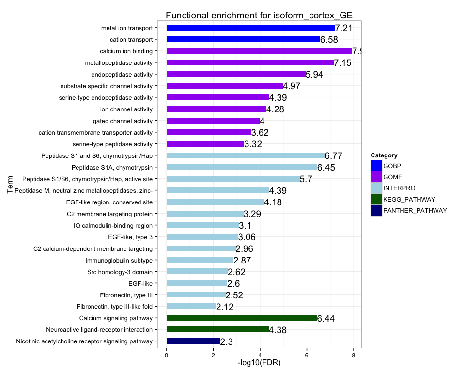
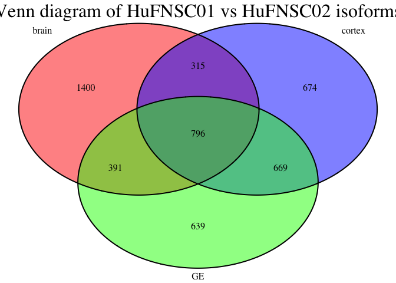
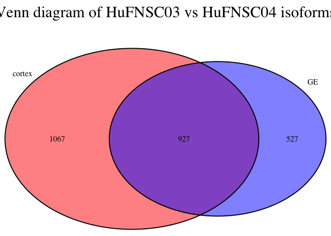
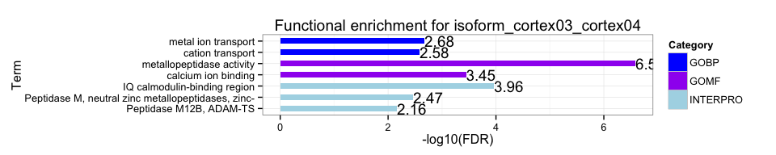
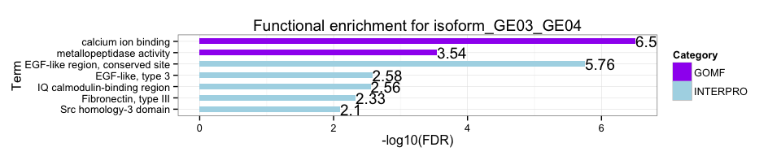

Fetal Brain isoform analysis 
========================================================

Gloria Li         
Thu Aug 21 15:55:00 2014 

<!-- re-knit after modify isoform.std.R script -->

## Isoform identification
  * DEfine on exons: FDR = 0.01     
  * Exon expressed in one sample ($\ge$ 10% gene RPKM) and not expressed in the other ($\le$ 1% gene RPKM)   
  * Gene is not DE: DEfine FDR = 0.01
  * Gene is expressed in both samples: gene RPKM > 0.01         

## Isoform genes between cortex and GE

  * On average, __2054__ genes are identified as isoforms between cortex and GE in each individual. __4213__ genes are shared in at least two individuals.       
  * There are more individual-specific isoforms than found in breast cells, although the overlap across individuals are still significant.     

<!-- html table generated in R 3.0.2 by xtable 1.7-1 package -->
<!-- Thu Aug 21 15:55:01 2014 -->
<TABLE border=1>
<TR> <TH>  </TH> <TH> DE_genes </TH> <TH> DE_exons </TH> <TH> with_expressed_genes </TH> <TH> isoform_exons </TH> <TH> exclude_DE_genes </TH> <TH> isoform_genes </TH>  </TR>
  <TR> <TD> cortex01_GE01_summary </TD> <TD align="center"> 911 </TD> <TD align="center"> 32372 </TD> <TD align="center"> 18968 </TD> <TD align="center"> 8440 </TD> <TD align="center"> 7962 </TD> <TD align="center"> 2447 </TD> </TR>
  <TR> <TD> cortex02_GE02_summary </TD> <TD align="center"> 1228 </TD> <TD align="center"> 35196 </TD> <TD align="center"> 21880 </TD> <TD align="center"> 8163 </TD> <TD align="center"> 7374 </TD> <TD align="center"> 2298 </TD> </TR>
  <TR> <TD> cortex03_GE03_summary </TD> <TD align="center"> 674 </TD> <TD align="center"> 29617 </TD> <TD align="center"> 13746 </TD> <TD align="center"> 6401 </TD> <TD align="center"> 6022 </TD> <TD align="center"> 2086 </TD> </TR>
  <TR> <TD> cortex04_GE04_summary </TD> <TD align="center"> 627 </TD> <TD align="center"> 22386 </TD> <TD align="center"> 11253 </TD> <TD align="center"> 4323 </TD> <TD align="center"> 4259 </TD> <TD align="center"> 1386 </TD> </TR>
   </TABLE>
 

### Functional enrichment analysis 
  * Individual specific isoforms between cortex and GE have __no__ significantly enriched terms, suggesting they are more likely random events without biological functions.          
  * Isoforms shared by at least two individuals are enriched in terms related to __cellular signaling__. InterPro protein domain enrichment show enriched terms similar to those observed in breast isoforms.         

 

## Isoform genes between individuals

  * On average, __2617__ genes are identified as isoforms between HuFNSC01 and HuFNSC02 in each cell type. __796__ genes are shared by all three cell types.              
  * On average, __1724__ genes are identified as isoforms between HuFNSC03 and HuFNSC04 in each cell type. __927__ genes are shared between two cell types.            

<!-- html table generated in R 3.0.2 by xtable 1.7-1 package -->
<!-- Thu Aug 21 15:55:03 2014 -->
<TABLE border=1>
<TR> <TH>  </TH> <TH> DE_genes </TH> <TH> DE_exons </TH> <TH> with_expressed_genes </TH> <TH> isoform_exons </TH> <TH> exclude_DE_genes </TH> <TH> isoform_genes </TH>  </TR>
  <TR> <TD> brain01_brain02_summary </TD> <TD align="center"> 642 </TD> <TD align="center"> 32138 </TD> <TD align="center"> 16302 </TD> <TD align="center"> 8980 </TD> <TD align="center"> 8542 </TD> <TD align="center"> 2902 </TD> </TR>
  <TR> <TD> cortex01_cortex02_summary </TD> <TD align="center"> 596 </TD> <TD align="center"> 26983 </TD> <TD align="center"> 15554 </TD> <TD align="center"> 7618 </TD> <TD align="center"> 7445 </TD> <TD align="center"> 2454 </TD> </TR>
  <TR> <TD> GE01_GE02_summary </TD> <TD align="center"> 173 </TD> <TD align="center"> 23810 </TD> <TD align="center"> 12862 </TD> <TD align="center"> 7402 </TD> <TD align="center"> 7351 </TD> <TD align="center"> 2495 </TD> </TR>
  <TR> <TD> cortex03_cortex04_summary </TD> <TD align="center"> 642 </TD> <TD align="center"> 26826 </TD> <TD align="center"> 12185 </TD> <TD align="center"> 5818 </TD> <TD align="center"> 5479 </TD> <TD align="center"> 1994 </TD> </TR>
  <TR> <TD> GE03_GE04_summary </TD> <TD align="center"> 545 </TD> <TD align="center"> 24752 </TD> <TD align="center"> 12223 </TD> <TD align="center"> 4582 </TD> <TD align="center"> 4422 </TD> <TD align="center"> 1454 </TD> </TR>
   </TABLE>
  

### Functional enrichment analysis 
#### HuFNSC01 vs HuFNSC02
  * Different regions on the Venn diagram have __no__ significantly enriched terms.     
  * Isoforms between HuFNSC01 and HuFNSC02 in different cell types show similar terms, related to signaling.     

   

#### HuFNSC03 vs HuFNSC04
  
  

