Fetal Brain isoform analysis - junctions
========================================================

Gloria Li         
Thu Aug 21 17:12:33 2014 

<!-- re-knit after modify junction.std.R script -->

## Validate previously identified isoforms with junction RPKM
  * Previous isoform identification with DE exons
    * DE exons by DEfine FDR = 0.01
    * Exon RPKM $\ge$ 10% gene RPKM in one sample & $\le$ 1% in the other
    * Gene RPKM of both samples > 0.005 
    * Exclude DE genes by DEfine FDR = 0.01

  * Validation: For each isoform exon in the previous pairwise comparison
    * Find junctions associated with this exon with enough coverage, i.e. sum of junction coverage of two samples $\ge$ 1
    * Identify junctions that RPKM change in the same direction as the exon
    * Junction RPKM > 0.1 in one sample and < 0.1 in the other      
  
## Results: 
### No. of exons for DE genes / isoform genes    
  * DE genes have roughly the same No. of exons as all expressed genes.             
  * Identified isoforms have slightly more No. of exons than DE genes and all expressed genes.  
  * Compared to DE genes, the distribution in No. of exons for isoforms are __much similar__ between different individuals, _not observed in breast libraries_.    
  
 

### Position of isoform exons on the gene   
  * In general, there are more alternative spliced exons at the __two ends__ of genes, _similar to observed in breast libraries_.         
  
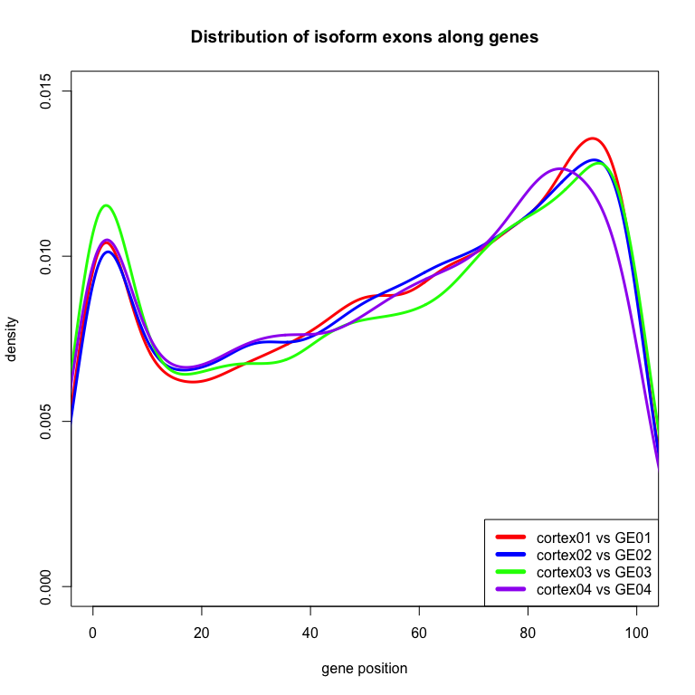 

### Junction validation     
  + For cortex vs GE, on average, __36.4%__ isoform genes have enough junction coverage. Among them, __89.8%__ have support from junction reads.    
  + For comparisons between individuals, on average, __34.4%__ isoform genes have enough junction coverage. Among them, __87.7%__ have support from junction reads.     
  + Between strand specific and non-strand specific libraries, the percentage of isoforms with enough junction coverage are __similar__, however, strand specific libraries have __higher__ percentage of having junction support(> 98% compared to ~ 80%).   
  + From the Venn diagrams, similar to observed in breast libraries, the overlapping isoforms between different comparisons have __much lower__ ratio of being validated compared to comparison specific isoforms.    

<!-- html table generated in R 3.0.2 by xtable 1.7-1 package -->
<!-- Thu Aug 21 17:12:36 2014 -->
<TABLE border=1>
<TR> <TH>  </TH> <TH> isoform exons </TH> <TH> isoform genes </TH> <TH> exons with junction coverage </TH> <TH> genes with junction coverage </TH> <TH> exons with junction support </TH> <TH> genes with junction support </TH>  </TR>
  <TR> <TD> cortex01_GE01_summary </TD> <TD align="center"> 7962 </TD> <TD align="center"> 2447 </TD> <TD align="center"> 1900 </TD> <TD align="center"> 832 </TD> <TD align="center"> 1543 </TD> <TD align="center"> 697 </TD> </TR>
  <TR> <TD> cortex02_GE02_summary </TD> <TD align="center"> 7374 </TD> <TD align="center"> 2298 </TD> <TD align="center"> 1962 </TD> <TD align="center"> 801 </TD> <TD align="center"> 1554 </TD> <TD align="center"> 656 </TD> </TR>
  <TR> <TD> cortex03_GE03_summary </TD> <TD align="center"> 6022 </TD> <TD align="center"> 2086 </TD> <TD align="center"> 1972 </TD> <TD align="center"> 872 </TD> <TD align="center"> 1836 </TD> <TD align="center"> 824 </TD> </TR>
  <TR> <TD> cortex04_GE04_summary </TD> <TD align="center"> 4259 </TD> <TD align="center"> 1386 </TD> <TD align="center"> 941 </TD> <TD align="center"> 483 </TD> <TD align="center"> 935 </TD> <TD align="center"> 478 </TD> </TR>
   </TABLE>
<!-- html table generated in R 3.0.2 by xtable 1.7-1 package -->
<!-- Thu Aug 21 17:12:36 2014 -->
<TABLE border=1>
<TR> <TH>  </TH> <TH> isoform exons </TH> <TH> isoform genes </TH> <TH> exons with junction coverage </TH> <TH> genes with junction coverage </TH> <TH> exons with junction support </TH> <TH> genes with junction support </TH>  </TR>
  <TR> <TD> brain01_brain02_summary </TD> <TD align="center"> 8542 </TD> <TD align="center"> 2902 </TD> <TD align="center"> 1791 </TD> <TD align="center"> 921 </TD> <TD align="center"> 1520 </TD> <TD align="center"> 808 </TD> </TR>
  <TR> <TD> cortex01_cortex02_summary </TD> <TD align="center"> 7445 </TD> <TD align="center"> 2454 </TD> <TD align="center"> 1634 </TD> <TD align="center"> 765 </TD> <TD align="center"> 1221 </TD> <TD align="center"> 623 </TD> </TR>
  <TR> <TD> GE01_GE02_summary </TD> <TD align="center"> 7351 </TD> <TD align="center"> 2495 </TD> <TD align="center"> 1469 </TD> <TD align="center"> 737 </TD> <TD align="center"> 1030 </TD> <TD align="center"> 561 </TD> </TR>
  <TR> <TD> cortex03_cortex04_summary </TD> <TD align="center"> 5479 </TD> <TD align="center"> 1994 </TD> <TD align="center"> 1949 </TD> <TD align="center"> 883 </TD> <TD align="center"> 1825 </TD> <TD align="center"> 830 </TD> </TR>
  <TR> <TD> GE03_GE04_summary </TD> <TD align="center"> 4422 </TD> <TD align="center"> 1454 </TD> <TD align="center"> 1045 </TD> <TD align="center"> 515 </TD> <TD align="center"> 1038 </TD> <TD align="center"> 511 </TD> </TR>
   </TABLE>
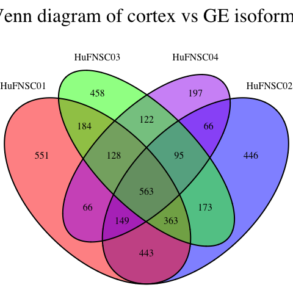  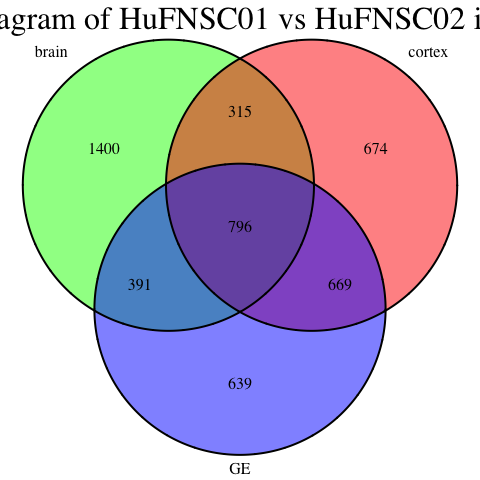 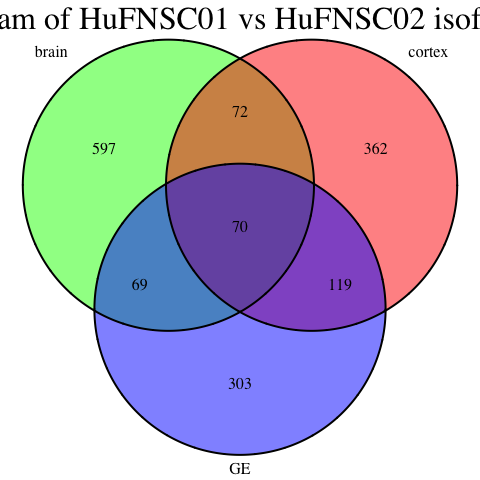 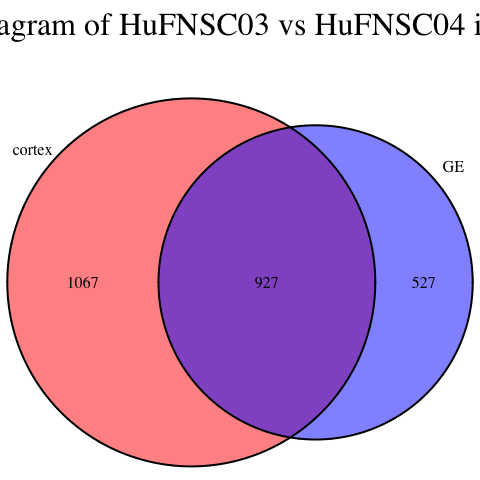 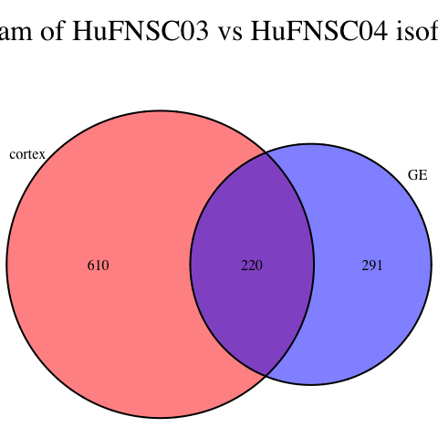 

### Venn Diagram with average expression level, average No. of exons and average exon length   
  * Isoforms have __much lower__ expression level than all expressed genes.          
  * On average, common isoforms between different comparisons have __lower expression level__ than comparison-specific isoforms.                 
  * In general, compared to all isoforms identified, validated isoforms have __lower__ expression levels, _not observed in breast libraries_.     
  * Average No. of exons are very __similar__ in different sections of the Venn diagram, between all, validated isoforms and all expressed genes.        
  * Average length of isoform exons are __shorter__ than all expressed genes. Validated isoform exons are also __shorter__ than all isoforms in general, _not observed in breast libraries_.         
  
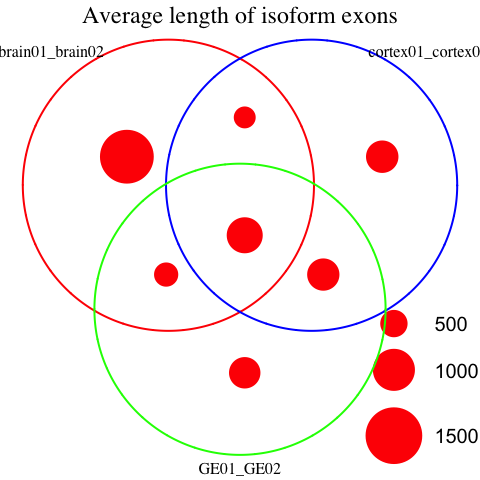 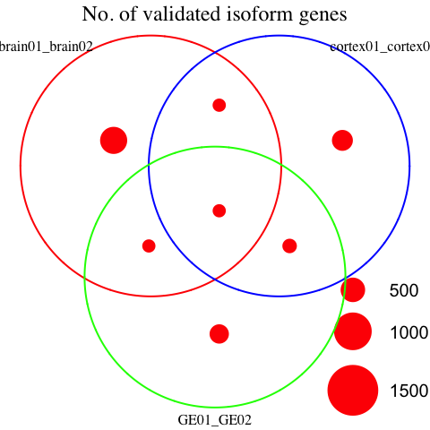 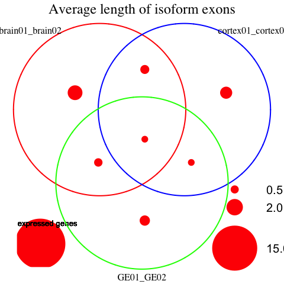 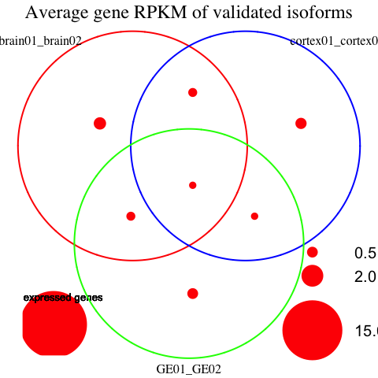 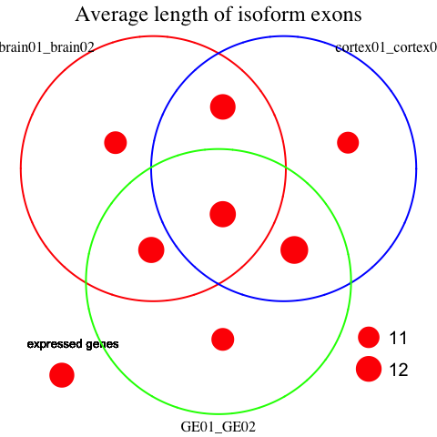 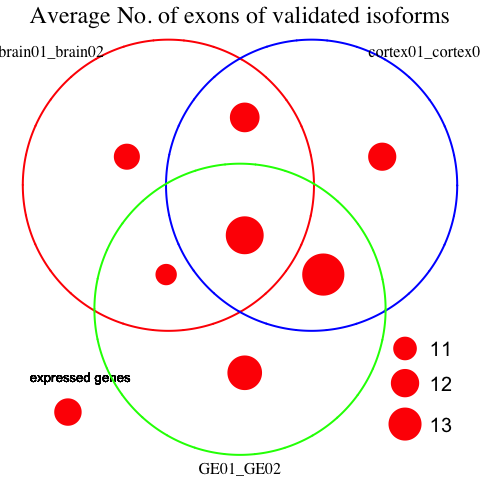 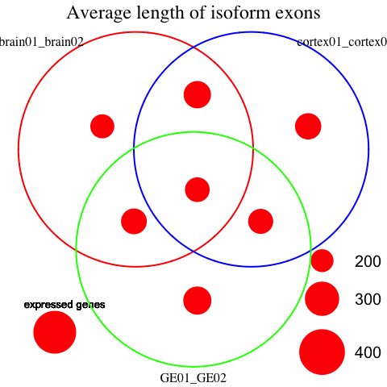  

