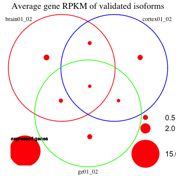
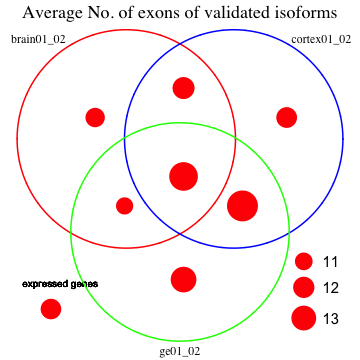
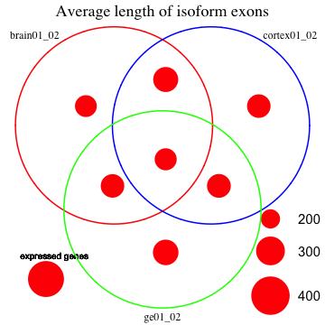
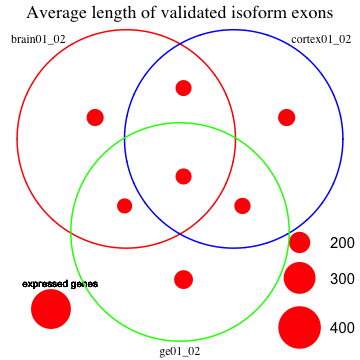

Fetal Brain isoform analysis - junctions
========================================================

Gloria Li         
Wed Jun  4 16:00:14 2014 

<!-- re-knit after modify junction_valid.R or junction.R script -->

## Validate previously identified isoforms with junction RPKM
  * Previous isoform identification with DE exons
    * DE exons by DEfine FDR = 0.01
    * Exon RPKM $\ge$ 10% gene RPKM in one sample & $\le$ 1% in the other
    * Gene RPKM of both samples > 0.005 
    * Exclude DE genes by DEfine FDR = 0.01

  * Validation: For each isoform exon in the previous pairwise comparison
    * Find junctions associated with this exon with enough coverage, i.e. sum of junction coverage of two samples $\ge$ 1
    * Identify junctions that RPKM change in the same direction as the exon
    * Junction RPKM > 0.1 in one sample and < 0.1 in the other      
  
## Results: 
### No. of exons for DE genes / isoform genes    
  * DE genes have roughly the same No. of exons as all expressed genes.             
  * Identified isoforms have slightly more No. of exons than DE genes and all expressed genes.  
  * Compared to DE genes, the distribution in No. of exons for isoforms are __much similar__ between different individuals, _not observed in breast libraries_.    
  
 

### Position of isoform exons on the gene   
  * In general, there are more alternative spliced exons at the __two ends__ of genes, _similar to observed in breast libraries_.         
  
 

### Junction validation     
  + For cortex vs GE, on average, __34.6%__ isoform genes have enough junction coverage. Among them, __90%__ have support from junction reads.    
  + For comparisons between individuals, on average, __31.6%__ isoform genes have enough junction coverage. Among them, __87.7%__ have support from junction reads.     
  + Between strand specific and non-strand specific libraries, the percentage of isoforms with enough junction coverage are __similar__, however, strand specific libraries have __higher__ percentage of having junction support(> 98% compared to ~ 80%).   
  + From the Venn diagrams, similar to observed in breast libraries, the overlapping isoforms between different comparisons have __much lower__ ratio of being validated compared to comparison specific isoforms.    

<!-- html table generated in R 3.0.2 by xtable 1.7-1 package -->
<!-- Wed Jun  4 16:00:18 2014 -->
<TABLE border=1>
<TR> <TH>  </TH> <TH> No.isoform.exons </TH> <TH> No.isoform.genes </TH> <TH> No.exons.with.junction.cov </TH> <TH> No.genes.with.junction.cov </TH> <TH> No.exons.with.junction.support </TH> <TH> No.genes.with.junction.support </TH>  </TR>
  <TR> <TD> HuFNSC01 </TD> <TD align="center"> 8862 </TD> <TD align="center"> 2674 </TD> <TD align="center"> 1996 </TD> <TD align="center"> 866 </TD> <TD align="center"> 1631 </TD> <TD align="center"> 729 </TD> </TR>
  <TR> <TD> HuFNSC02 </TD> <TD align="center"> 8064 </TD> <TD align="center"> 2497 </TD> <TD align="center"> 2029 </TD> <TD align="center"> 832 </TD> <TD align="center"> 1607 </TD> <TD align="center"> 681 </TD> </TR>
  <TR> <TD> HuFNSC03 </TD> <TD align="center"> 6959 </TD> <TD align="center"> 2337 </TD> <TD align="center"> 2111 </TD> <TD align="center"> 922 </TD> <TD align="center"> 1973 </TD> <TD align="center"> 873 </TD> </TR>
  <TR> <TD> HuFNSC04 </TD> <TD align="center"> 5526 </TD> <TD align="center"> 1694 </TD> <TD align="center"> 1107 </TD> <TD align="center"> 562 </TD> <TD align="center"> 1101 </TD> <TD align="center"> 557 </TD> </TR>
   </TABLE>
<!-- html table generated in R 3.0.2 by xtable 1.7-1 package -->
<!-- Wed Jun  4 16:00:18 2014 -->
<TABLE border=1>
<TR> <TH>  </TH> <TH> No.isoform.exons </TH> <TH> No.isoform.genes </TH> <TH> No.exons.with.junction.cov </TH> <TH> No.genes.with.junction.cov </TH> <TH> No.exons.with.junction.support </TH> <TH> No.genes.with.junction.support </TH>  </TR>
  <TR> <TD> brain01_02 </TD> <TD align="center"> 9146 </TD> <TD align="center"> 3069 </TD> <TD align="center"> 1819 </TD> <TD align="center"> 937 </TD> <TD align="center"> 1546 </TD> <TD align="center"> 823 </TD> </TR>
  <TR> <TD> cortex01_02 </TD> <TD align="center"> 8233 </TD> <TD align="center"> 2659 </TD> <TD align="center"> 1679 </TD> <TD align="center"> 788 </TD> <TD align="center"> 1259 </TD> <TD align="center"> 643 </TD> </TR>
  <TR> <TD> ge01_02 </TD> <TD align="center"> 8023 </TD> <TD align="center"> 2692 </TD> <TD align="center"> 1519 </TD> <TD align="center"> 762 </TD> <TD align="center"> 1067 </TD> <TD align="center"> 579 </TD> </TR>
  <TR> <TD> cortex03_04 </TD> <TD align="center"> 6422 </TD> <TD align="center"> 2380 </TD> <TD align="center"> 2014 </TD> <TD align="center"> 919 </TD> <TD align="center"> 1884 </TD> <TD align="center"> 865 </TD> </TR>
  <TR> <TD> ge03_04 </TD> <TD align="center"> 5781 </TD> <TD align="center"> 1914 </TD> <TD align="center"> 1164 </TD> <TD align="center"> 589 </TD> <TD align="center"> 1154 </TD> <TD align="center"> 582 </TD> </TR>
   </TABLE>
    

### Venn Diagram with average expression level, average No. of exons and average exon length   
  * Isoforms have __much lower__ expression level than all expressed genes.          
  * On average, common isoforms between different comparisons have __lower expression level__ than comparison-specific isoforms.                 
  * In general, compared to all isoforms identified, validated isoforms have __lower__ expression levels, _not observed in breast libraries_.     
  * Average No. of exons are very __similar__ in different sections of the Venn diagram, between all, validated isoforms and all expressed genes.        
  * Average length of isoform exons are __shorter__ than all expressed genes. Validated isoform exons are also __shorter__ than all isoforms in general, _not observed in breast libraries_.         
  
      

