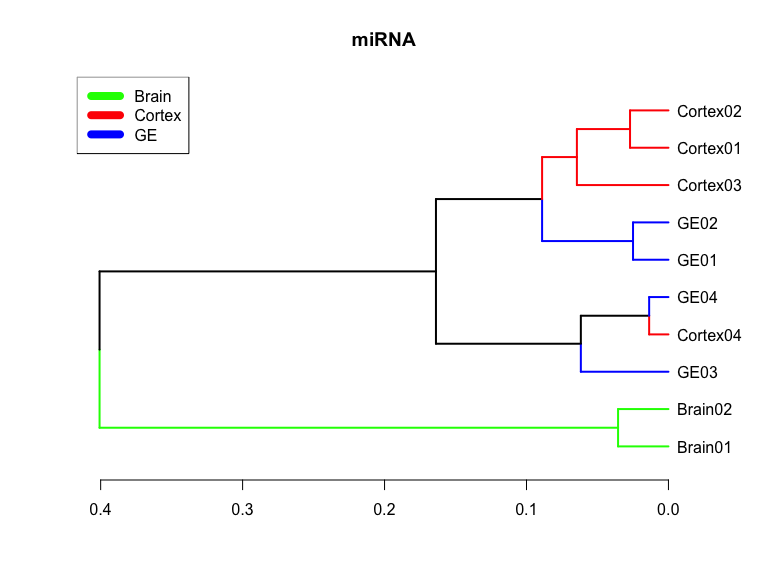
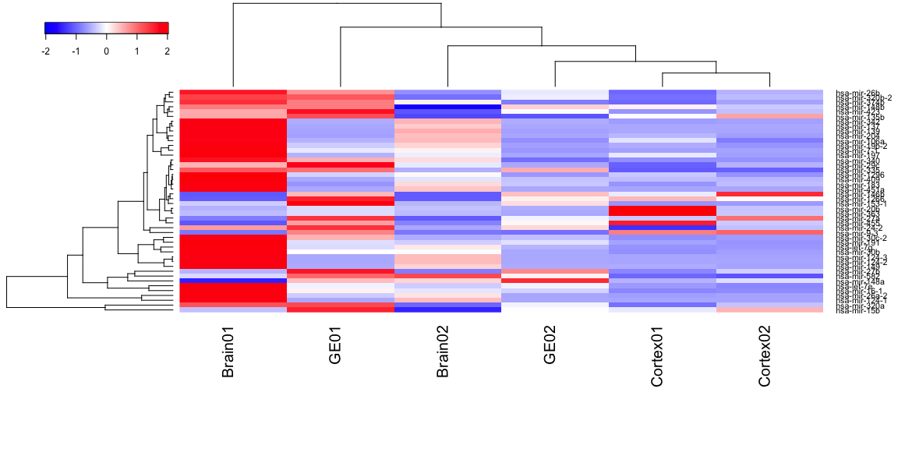
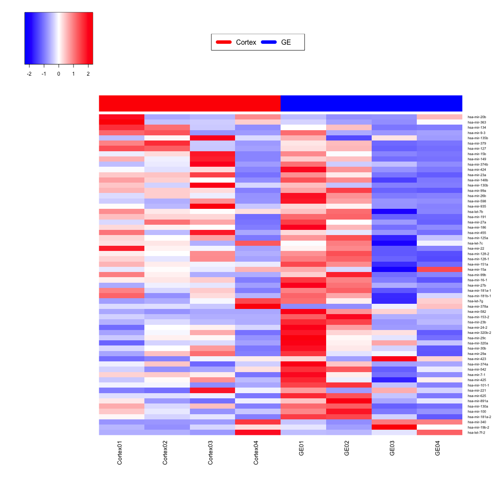
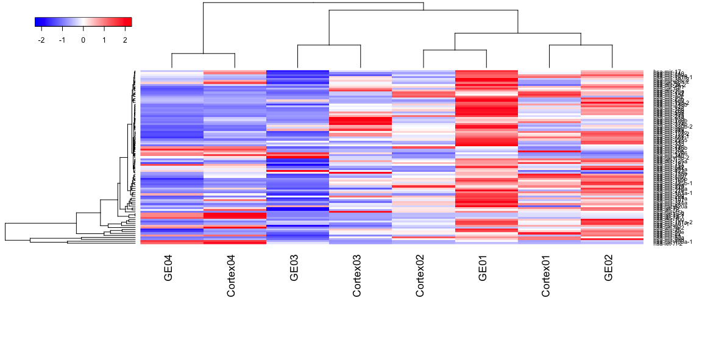

# Fetal Brain - miRNA summary
Gloria Li  
December 15, 2014  

Updated: Mon Dec 15 16:55:17 2014

## Summary and clustering 

* Out of 1523 miRNAs, on average, there are __570__ miRNAs expressed (RPM > 0.1), __105__ highly expressed (RPM > 100). The No. of expressed miRNAs in different samples are similar.       
* Clustering distinguish mixed brain sample from neurospheres, but shows no pattern within neurospheres.    

  

## Differential expression by fold change 

* DE: fold change between two samples $\ge$ 2.     

### Between monozygotic twins  

* On average, there are __138__ miRNAs differentially expressed between monozygotic twins.   
* There are few overlaps between different cell types.      
* Clustering on DE miRNAs does not show particular patterns.        

<table>
 <thead>
  <tr>
   <th style="text-align:center;"> Sample </th>
   <th style="text-align:center;"> UP </th>
   <th style="text-align:center;"> DN </th>
   <th style="text-align:center;"> DE </th>
  </tr>
 </thead>
<tbody>
  <tr>
   <td style="text-align:center;"> Brain01_Brain02 </td>
   <td style="text-align:center;"> 158 </td>
   <td style="text-align:center;"> 30 </td>
   <td style="text-align:center;"> 188 </td>
  </tr>
  <tr>
   <td style="text-align:center;"> Cortex01_Cortex02 </td>
   <td style="text-align:center;"> 78 </td>
   <td style="text-align:center;"> 32 </td>
   <td style="text-align:center;"> 110 </td>
  </tr>
  <tr>
   <td style="text-align:center;"> GE01_GE02 </td>
   <td style="text-align:center;"> 76 </td>
   <td style="text-align:center;"> 41 </td>
   <td style="text-align:center;"> 117 </td>
  </tr>
</tbody>
</table>
  

### Between neurospheres  

* On average, there are __184__ miRNAs differentially expressed between Cortex and GE, slightly more than observed between MZ twins.   
* There are few overlaps between different cell types.      
* Clustering on DE miRNAs does not show particular patterns.        

<table>
 <thead>
  <tr>
   <th style="text-align:center;"> Sample </th>
   <th style="text-align:center;"> UP </th>
   <th style="text-align:center;"> DN </th>
   <th style="text-align:center;"> DE </th>
  </tr>
 </thead>
<tbody>
  <tr>
   <td style="text-align:center;"> Cortex01_GE01 </td>
   <td style="text-align:center;"> 51 </td>
   <td style="text-align:center;"> 98 </td>
   <td style="text-align:center;"> 149 </td>
  </tr>
  <tr>
   <td style="text-align:center;"> Cortex02_GE02 </td>
   <td style="text-align:center;"> 42 </td>
   <td style="text-align:center;"> 109 </td>
   <td style="text-align:center;"> 151 </td>
  </tr>
  <tr>
   <td style="text-align:center;"> Cortex03_GE03 </td>
   <td style="text-align:center;"> 289 </td>
   <td style="text-align:center;"> 19 </td>
   <td style="text-align:center;"> 308 </td>
  </tr>
  <tr>
   <td style="text-align:center;"> Cortex04_GE04 </td>
   <td style="text-align:center;"> 99 </td>
   <td style="text-align:center;"> 31 </td>
   <td style="text-align:center;"> 130 </td>
  </tr>
</tbody>
</table>
  

### Between gestational weeks 

* On average, there are __251__ miRNAs differentially expressed between GW17 and GW15, __250__ between GW15 and GW13, __304__ between GW17 and GW13.   
* There are significant overlaps between the two GW17 vs GW15 sample pairs (01 vs 03, 02 vs 03), much fewer between GW17 vs GW15 and GW15 vs GW13.      
* Clustering on DE miRNAs shows GW17, GW15, and GW13 clusters, although no pattern within GW17 group.        

<table>
 <thead>
  <tr>
   <th style="text-align:center;"> Sample </th>
   <th style="text-align:center;"> UP </th>
   <th style="text-align:center;"> DN </th>
   <th style="text-align:center;"> DE </th>
   <th style="text-align:center;"> GW </th>
  </tr>
 </thead>
<tbody>
  <tr>
   <td style="text-align:center;"> Cortex01_Cortex03 </td>
   <td style="text-align:center;"> 115 </td>
   <td style="text-align:center;"> 56 </td>
   <td style="text-align:center;"> 171 </td>
   <td style="text-align:center;"> 17 vs 15 </td>
  </tr>
  <tr>
   <td style="text-align:center;"> Cortex01_Cortex04 </td>
   <td style="text-align:center;"> 237 </td>
   <td style="text-align:center;"> 34 </td>
   <td style="text-align:center;"> 271 </td>
   <td style="text-align:center;"> 17 vs 13 </td>
  </tr>
  <tr>
   <td style="text-align:center;"> Cortex02_Cortex03 </td>
   <td style="text-align:center;"> 76 </td>
   <td style="text-align:center;"> 85 </td>
   <td style="text-align:center;"> 161 </td>
   <td style="text-align:center;"> 17 vs 15 </td>
  </tr>
  <tr>
   <td style="text-align:center;"> Cortex02_Cortex04 </td>
   <td style="text-align:center;"> 205 </td>
   <td style="text-align:center;"> 57 </td>
   <td style="text-align:center;"> 262 </td>
   <td style="text-align:center;"> 17 vs 13 </td>
  </tr>
  <tr>
   <td style="text-align:center;"> Cortex03_Cortex04 </td>
   <td style="text-align:center;"> 237 </td>
   <td style="text-align:center;"> 52 </td>
   <td style="text-align:center;"> 289 </td>
   <td style="text-align:center;"> 15 vs 13 </td>
  </tr>
  <tr>
   <td style="text-align:center;"> GE01_GE03 </td>
   <td style="text-align:center;"> 335 </td>
   <td style="text-align:center;"> 9 </td>
   <td style="text-align:center;"> 344 </td>
   <td style="text-align:center;"> 17 vs 15 </td>
  </tr>
  <tr>
   <td style="text-align:center;"> GE01_GE04 </td>
   <td style="text-align:center;"> 326 </td>
   <td style="text-align:center;"> 31 </td>
   <td style="text-align:center;"> 357 </td>
   <td style="text-align:center;"> 17 vs 13 </td>
  </tr>
  <tr>
   <td style="text-align:center;"> GE02_GE03 </td>
   <td style="text-align:center;"> 304 </td>
   <td style="text-align:center;"> 23 </td>
   <td style="text-align:center;"> 327 </td>
   <td style="text-align:center;"> 17 vs 15 </td>
  </tr>
  <tr>
   <td style="text-align:center;"> GE02_GE04 </td>
   <td style="text-align:center;"> 292 </td>
   <td style="text-align:center;"> 34 </td>
   <td style="text-align:center;"> 326 </td>
   <td style="text-align:center;"> 17 vs 13 </td>
  </tr>
  <tr>
   <td style="text-align:center;"> GE03_GE04 </td>
   <td style="text-align:center;"> 77 </td>
   <td style="text-align:center;"> 134 </td>
   <td style="text-align:center;"> 211 </td>
   <td style="text-align:center;"> 15 vs 13 </td>
  </tr>
</tbody>
</table>
  

