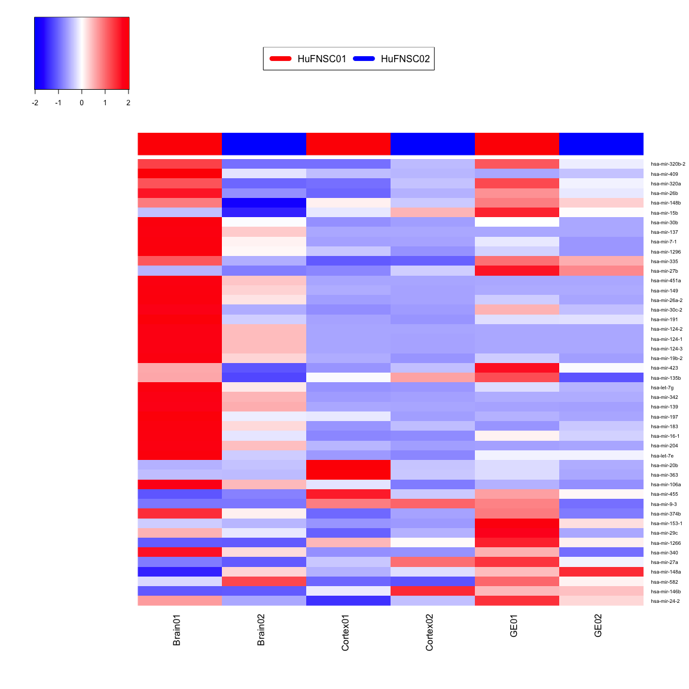

# Fetal Brain - miRNA summary
Gloria Li  
December 15, 2014  

Updated: Mon Jan  5 16:08:38 2015

## Summary and clustering 

* Out of 1523 miRNAs, on average, there are __570__ miRNAs expressed (RPM > 0.1), __105__ highly expressed (RPM > 100). The No. of expressed miRNAs in different samples are similar.       
* Clustering on miRs highly expressed (RPM > 100) in at least one sample revealed same clusters as coding genes and exons.    

  

## Differential expression by fold change 

* DE: fold change between two samples $\ge$ 2.     
* Average RPM of two samples > 100. 

### Between monozygotic twins  

* On average, there are __17__ miRNAs differentially expressed between monozygotic twins.   
* There are few overlaps between different cell types.      
* Clustering on DE miRNAs does not show particular patterns.        

<table>
 <thead>
  <tr>
   <th style="text-align:center;"> Sample </th>
   <th style="text-align:center;"> UP </th>
   <th style="text-align:center;"> DN </th>
   <th style="text-align:center;"> DE </th>
  </tr>
 </thead>
<tbody>
  <tr>
   <td style="text-align:center;"> Brain01_Brain02 </td>
   <td style="text-align:center;"> 31 </td>
   <td style="text-align:center;"> 2 </td>
   <td style="text-align:center;"> 33 </td>
  </tr>
  <tr>
   <td style="text-align:center;"> Cortex01_Cortex02 </td>
   <td style="text-align:center;"> 4 </td>
   <td style="text-align:center;"> 4 </td>
   <td style="text-align:center;"> 8 </td>
  </tr>
  <tr>
   <td style="text-align:center;"> GE01_GE02 </td>
   <td style="text-align:center;"> 10 </td>
   <td style="text-align:center;"> 0 </td>
   <td style="text-align:center;"> 10 </td>
  </tr>
</tbody>
</table>
 

### Between neurospheres  

* On average, there are __20__ miRNAs differentially expressed between Cortex and GE, slightly more than observed between MZ twins.   
* There are few overlaps between different cell types.      
* Clustering on DE miRNAs does not show particular patterns.        

<table>
 <thead>
  <tr>
   <th style="text-align:center;"> Sample </th>
   <th style="text-align:center;"> UP </th>
   <th style="text-align:center;"> DN </th>
   <th style="text-align:center;"> DE </th>
  </tr>
 </thead>
<tbody>
  <tr>
   <td style="text-align:center;"> Cortex01_GE01 </td>
   <td style="text-align:center;"> 3 </td>
   <td style="text-align:center;"> 23 </td>
   <td style="text-align:center;"> 26 </td>
  </tr>
  <tr>
   <td style="text-align:center;"> Cortex02_GE02 </td>
   <td style="text-align:center;"> 2 </td>
   <td style="text-align:center;"> 13 </td>
   <td style="text-align:center;"> 15 </td>
  </tr>
  <tr>
   <td style="text-align:center;"> Cortex03_GE03 </td>
   <td style="text-align:center;"> 31 </td>
   <td style="text-align:center;"> 5 </td>
   <td style="text-align:center;"> 36 </td>
  </tr>
  <tr>
   <td style="text-align:center;"> Cortex04_GE04 </td>
   <td style="text-align:center;"> 3 </td>
   <td style="text-align:center;"> 0 </td>
   <td style="text-align:center;"> 3 </td>
  </tr>
</tbody>
</table>
 

### Between gestational weeks 

* On average, there are __43__ miRNAs differentially expressed between GW17 and GW15, __31__ between GW15 and GW13, __44__ between GW17 and GW13.   
* There are significant overlaps between the two GW17 vs GW15 sample pairs (01 vs 03, 02 vs 03), much fewer between GW17 vs GW15 and GW15 vs GW13.      
* Clustering on DE miRNAs shows GW17, GW15, and GW13 clusters, although no pattern within GW17 group.        

<table>
 <thead>
  <tr>
   <th style="text-align:center;"> Sample </th>
   <th style="text-align:center;"> UP </th>
   <th style="text-align:center;"> DN </th>
   <th style="text-align:center;"> DE </th>
   <th style="text-align:center;"> GW </th>
  </tr>
 </thead>
<tbody>
  <tr>
   <td style="text-align:center;"> Cortex01_Cortex03 </td>
   <td style="text-align:center;"> 16 </td>
   <td style="text-align:center;"> 11 </td>
   <td style="text-align:center;"> 27 </td>
   <td style="text-align:center;"> 17 vs 15 </td>
  </tr>
  <tr>
   <td style="text-align:center;"> Cortex01_Cortex04 </td>
   <td style="text-align:center;"> 26 </td>
   <td style="text-align:center;"> 11 </td>
   <td style="text-align:center;"> 37 </td>
   <td style="text-align:center;"> 17 vs 13 </td>
  </tr>
  <tr>
   <td style="text-align:center;"> Cortex02_Cortex03 </td>
   <td style="text-align:center;"> 8 </td>
   <td style="text-align:center;"> 13 </td>
   <td style="text-align:center;"> 21 </td>
   <td style="text-align:center;"> 17 vs 15 </td>
  </tr>
  <tr>
   <td style="text-align:center;"> Cortex02_Cortex04 </td>
   <td style="text-align:center;"> 20 </td>
   <td style="text-align:center;"> 11 </td>
   <td style="text-align:center;"> 31 </td>
   <td style="text-align:center;"> 17 vs 13 </td>
  </tr>
  <tr>
   <td style="text-align:center;"> Cortex03_Cortex04 </td>
   <td style="text-align:center;"> 23 </td>
   <td style="text-align:center;"> 13 </td>
   <td style="text-align:center;"> 36 </td>
   <td style="text-align:center;"> 15 vs 13 </td>
  </tr>
  <tr>
   <td style="text-align:center;"> GE01_GE03 </td>
   <td style="text-align:center;"> 63 </td>
   <td style="text-align:center;"> 2 </td>
   <td style="text-align:center;"> 65 </td>
   <td style="text-align:center;"> 17 vs 15 </td>
  </tr>
  <tr>
   <td style="text-align:center;"> GE01_GE04 </td>
   <td style="text-align:center;"> 51 </td>
   <td style="text-align:center;"> 8 </td>
   <td style="text-align:center;"> 59 </td>
   <td style="text-align:center;"> 17 vs 13 </td>
  </tr>
  <tr>
   <td style="text-align:center;"> GE02_GE03 </td>
   <td style="text-align:center;"> 54 </td>
   <td style="text-align:center;"> 5 </td>
   <td style="text-align:center;"> 59 </td>
   <td style="text-align:center;"> 17 vs 15 </td>
  </tr>
  <tr>
   <td style="text-align:center;"> GE02_GE04 </td>
   <td style="text-align:center;"> 44 </td>
   <td style="text-align:center;"> 7 </td>
   <td style="text-align:center;"> 51 </td>
   <td style="text-align:center;"> 17 vs 13 </td>
  </tr>
  <tr>
   <td style="text-align:center;"> GE03_GE04 </td>
   <td style="text-align:center;"> 10 </td>
   <td style="text-align:center;"> 16 </td>
   <td style="text-align:center;"> 26 </td>
   <td style="text-align:center;"> 15 vs 13 </td>
  </tr>
</tbody>
</table>
 

