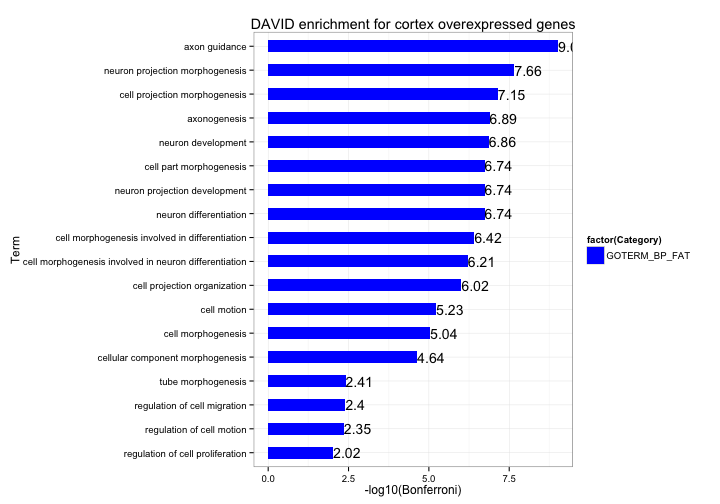
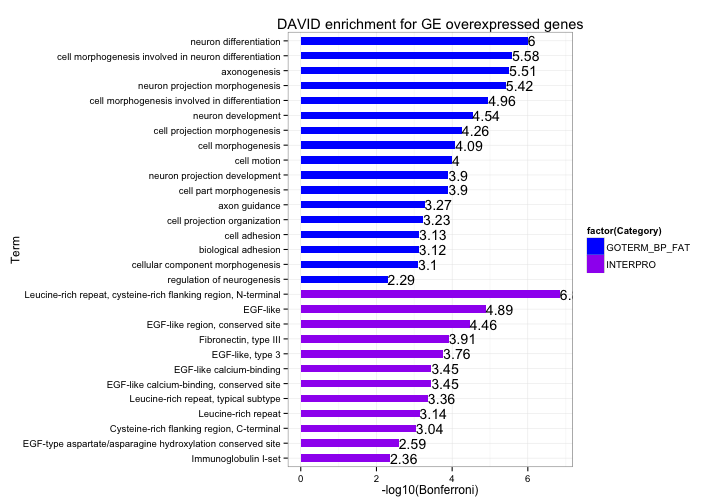
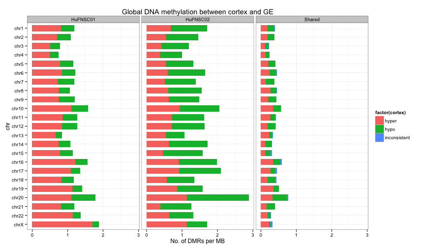
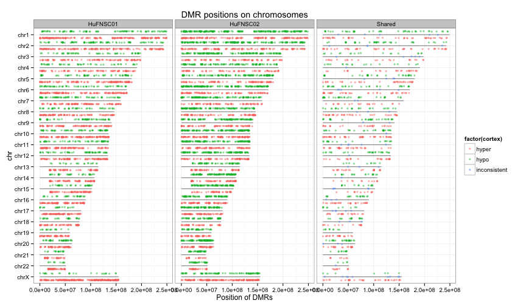
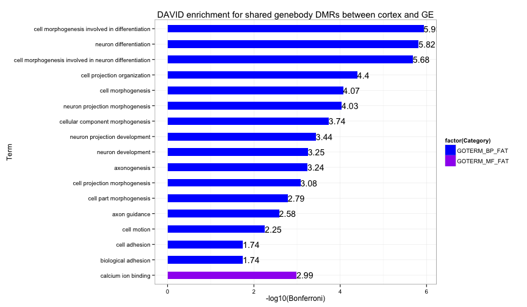
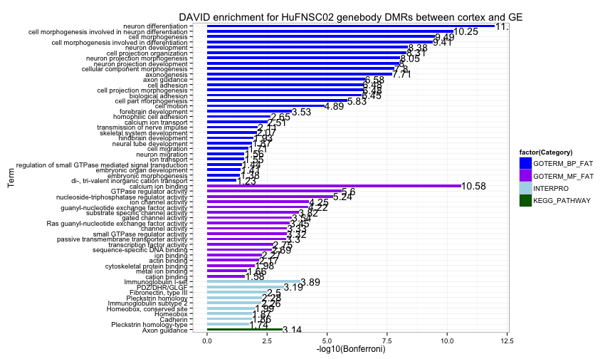
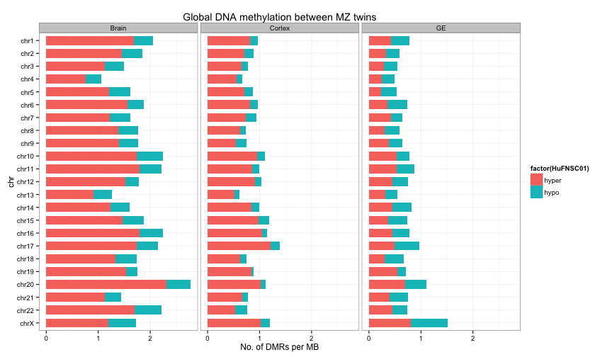
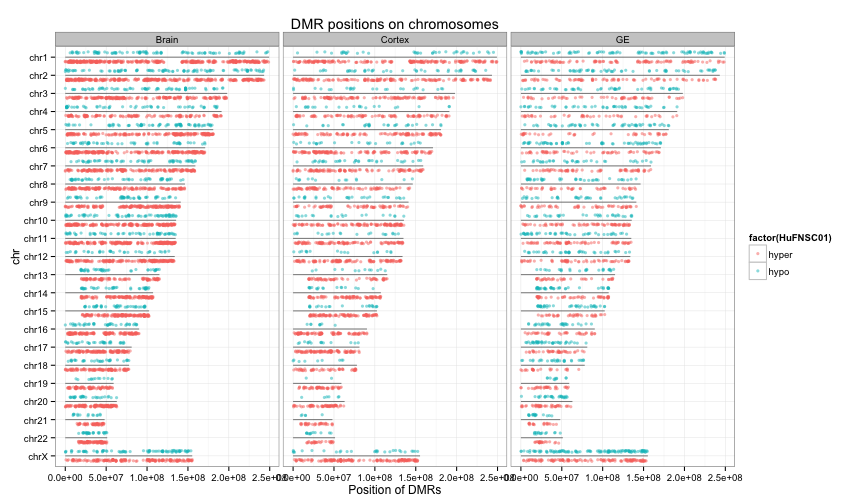
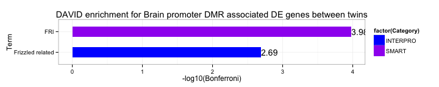
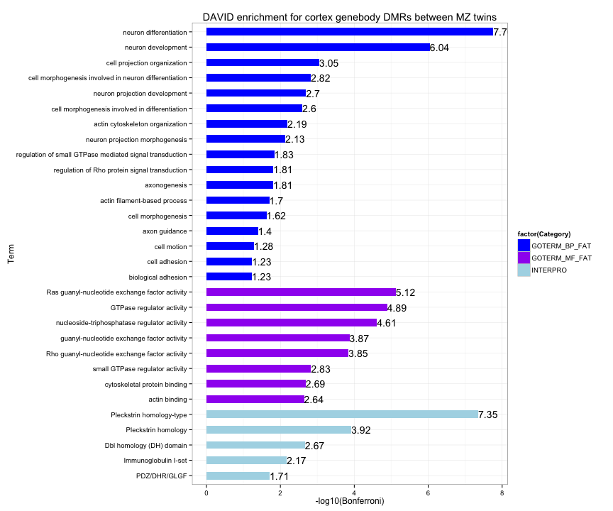

# Epigenetic analysis of fetail brain from human monozygotic twins
Gloria Li    
Tue Mar 11 16:30:17 2014

## Neuroshpere cortex derived VS neuroshpere ganglionic eminence derived 
### Differential expression analysis
RNA-seq of Neuroshpere cortex derived VS neuroshpere ganglionic eminence derived from HuFNSC01, 02, 03, 04.   
Use DEfine (FDR cutoff = 0.01) on normalized RPKMs of each gene to idetify DE genes between cortex and GE.  

**No. of DE genes**    
<!-- html table generated in R 3.0.2 by xtable 1.7-1 package -->
<!-- Tue Mar 11 16:30:18 2014 -->
<TABLE border=1>
<TR> <TH> Sample </TH> <TH> Cortex.Overexpression </TH> <TH> GE.Overexpression </TH>  </TR>
  <TR> <TD> HuFNSC01 </TD> <TD align="right"> 403 </TD> <TD align="right"> 508 </TD> </TR>
  <TR> <TD> HuFNSC02 </TD> <TD align="right"> 588 </TD> <TD align="right"> 640 </TD> </TR>
  <TR> <TD> HuFNSC03 </TD> <TD align="right"> 447 </TD> <TD align="right"> 227 </TD> </TR>
  <TR> <TD> HuFNSC04 </TD> <TD align="right"> 378 </TD> <TD align="right"> 249 </TD> </TR>
  <TR> <TD> 2 or more </TD> <TD align="right"> 382 </TD> <TD align="right"> 456 </TD> </TR>
   </TABLE>

**DAVID enrichment**:     
Both cortex overexpressed and GE overexpressed genes are enriched in brain development related terms.  
GE overexpressed genes are enriched in EGF-like protein domain.  
  

### Isoform analysis
RNA-seq of Neuroshpere cortex derived VS neuroshpere ganglionic eminence derived from HuFNSC01, 02, 03, 04.   
Use DEfine (FDR cut-off = 0.01) on normalized RPKMs of each exon to idetify DE exons between cortex and GE. Expressed exons were defined as those with RPKM ≥ 10% of gene RPKM; unexpressed exons were defined as those with RPKM ≤ 1% of gene RPKM; and the exons in between (1~10% gene RPKM) were discarded to filter out most false positives. Isoforms for each pairwise comparison were identified as genes with DE exons expressed in only one of the two samples.  

<!-- Check if current results used double-cutoff -->

### DNA methylation analysis
MethylCRF of HuFNSC01 and 02.   
DMRs: calculate average methylation level for 1kB bins. Fold change between two samlpes > 2. And methylCRF value of one sample > 0.5. 

**No. of DMRs**:     
<!-- lab book 01 P25, 29 ... -->   
<!-- html table generated in R 3.0.2 by xtable 1.7-1 package -->
<!-- Tue Mar 11 16:30:21 2014 -->
<TABLE border=1>
<TR> <TH> Sample </TH> <TH> DMRs </TH> <TH> Promoter </TH> <TH> Promoter.Enrichment </TH> <TH> PC.Promoter </TH> <TH> DE.pcPromoter </TH> <TH> Genebody </TH> <TH> PC.Genebody </TH> <TH> CGI </TH> <TH> CGI.Enrichment </TH>  </TR>
  <TR> <TD> HuFNSC01 </TD> <TD align="right"> 3638 </TD> <TD align="right"> 620 </TD> <TD align="right"> 2.56 </TD> <TD align="right"> 330 </TD> <TD align="right">  15 </TD> <TD align="right"> 1620 </TD> <TD align="right"> 1215 </TD> <TD align="right">  95 </TD> <TD align="right"> 1.63 </TD> </TR>
  <TR> <TD> HuFNSC02 </TD> <TD align="right"> 4712 </TD> <TD align="right"> 829 </TD> <TD align="right"> 2.65 </TD> <TD align="right"> 418 </TD> <TD align="right">  22 </TD> <TD align="right"> 2160 </TD> <TD align="right"> 1654 </TD> <TD align="right"> 132 </TD> <TD align="right"> 1.75 </TD> </TR>
  <TR> <TD> Shared </TD> <TD align="right"> 1215 </TD> <TD align="right"> 172 </TD> <TD align="right"> 2.13 </TD> <TD align="right">  84 </TD> <TD align="right">   4 </TD> <TD align="right"> 571 </TD> <TD align="right"> 429 </TD> <TD align="right">  60 </TD> <TD align="right"> 3.08 </TD> </TR>
   </TABLE>

**Global differential methylation trend**    
  

**Differential methylated in promoters and differential expressed genes**    
[1] "HuFNSC01"
<!-- html table generated in R 3.0.2 by xtable 1.7-1 package -->
<!-- Tue Mar 11 16:30:26 2014 -->
<TABLE border=1>
<TR> <TH> ID </TH> <TH> Gene.Name </TH>  </TR>
  <TR> <TD> ENSG00000182132 </TD> <TD> Kv channel interacting protein 1 </TD> </TR>
  <TR> <TD> ENSG00000057657 </TD> <TD> PR domain containing 1, with ZNF domain </TD> </TR>
  <TR> <TD> ENSG00000175899 </TD> <TD> alpha-2-macroglobulin </TD> </TR>
  <TR> <TD> ENSG00000091879 </TD> <TD> angiopoietin 2 </TD> </TR>
  <TR> <TD> ENSG00000134115 </TD> <TD> contactin 6 </TD> </TR>
  <TR> <TD> ENSG00000164687 </TD> <TD> fatty acid binding protein 5-like 25 (psoriasis-associated)5-like 85-like 75-like 9 </TD> </TR>
  <TR> <TD> ENSG00000172461 </TD> <TD> fucosyltransferase 9 (alpha (1,3) fucosyltransferase) </TD> </TR>
  <TR> <TD> ENSG00000115738 </TD> <TD> inhibitor of DNA binding 2, dominant negative helix-loop-helix protein </TD> </TR>
  <TR> <TD> ENSG00000125414 </TD> <TD> myosin, heavy chain 2, skeletal muscle, adult </TD> </TR>
  <TR> <TD> ENSG00000179915 </TD> <TD> neurexin 1 </TD> </TR>
  <TR> <TD> ENSG00000198929 </TD> <TD> nitric oxide synthase 1 (neuronal) adaptor protein </TD> </TR>
  <TR> <TD> ENSG00000185551 </TD> <TD> nuclear receptor subfamily 2, group F, member 2 </TD> </TR>
  <TR> <TD> ENSG00000168301 </TD> <TD> potassium channel tetramerisation domain containing 6 </TD> </TR>
  <TR> <TD> ENSG00000005108 </TD> <TD> thrombospondin, type I, domain containing 7A </TD> </TR>
  <TR> <TD> ENSG00000182223 </TD> <TD> zygote arrest 1 </TD> </TR>
   </TABLE>
[1] "HuFNSC02"
<!-- html table generated in R 3.0.2 by xtable 1.7-1 package -->
<!-- Tue Mar 11 16:30:26 2014 -->
<TABLE border=1>
<TR> <TH> ID </TH> <TH> Gene.Name </TH>  </TR>
  <TR> <TD> ENSG00000171476 </TD> <TD> HOP homeobox </TD> </TR>
  <TR> <TD> ENSG00000148926 </TD> <TD> adrenomedullin </TD> </TR>
  <TR> <TD> ENSG00000140945 </TD> <TD> cadherin 13, H-cadherin (heart) </TD> </TR>
  <TR> <TD> ENSG00000107159 </TD> <TD> carbonic anhydrase IX </TD> </TR>
  <TR> <TD> ENSG00000108691 </TD> <TD> chemokine (C-C motif) ligand 2 </TD> </TR>
  <TR> <TD> ENSG00000011465 </TD> <TD> decorin </TD> </TR>
  <TR> <TD> ENSG00000185610 </TD> <TD> developing brain homeobox 2 </TD> </TR>
  <TR> <TD> ENSG00000131095 </TD> <TD> glial fibrillary acidic protein </TD> </TR>
  <TR> <TD> ENSG00000115738 </TD> <TD> inhibitor of DNA binding 2, dominant negative helix-loop-helix protein </TD> </TR>
  <TR> <TD> ENSG00000108231 </TD> <TD> leucine-rich, glioma inactivated 1 </TD> </TR>
  <TR> <TD> ENSG00000198929 </TD> <TD> nitric oxide synthase 1 (neuronal) adaptor protein </TD> </TR>
  <TR> <TD> ENSG00000008441 </TD> <TD> nuclear factor I/X (CCAAT-binding transcription factor) </TD> </TR>
  <TR> <TD> ENSG00000165588 </TD> <TD> orthodenticle homeobox 2 </TD> </TR>
  <TR> <TD> ENSG00000118785 </TD> <TD> secreted phosphoprotein 1 </TD> </TR>
  <TR> <TD> ENSG00000143416 </TD> <TD> selenium binding protein 1 </TD> </TR>
  <TR> <TD> ENSG00000157404 </TD> <TD> similar to Mast/stem cell growth factor receptor precursor (SCFR) (Proto-oncogene tyrosine-protein kinase Kit) (c-kit) (CD117 antigen)-kit Hardy-Zuckerman 4 feline sarcoma viral oncogene homolog </TD> </TR>
  <TR> <TD> ENSG00000203815 </TD> <TD> similar to UPF0627 protein ENSP00000358171388692 </TD> </TR>
  <TR> <TD> ENSG00000005108 </TD> <TD> thrombospondin, type I, domain containing 7A </TD> </TR>
  <TR> <TD> ENSG00000112715 </TD> <TD> vascular endothelial growth factor A </TD> </TR>
  <TR> <TD> ENSG00000171940 </TD> <TD> zinc finger protein 217 </TD> </TR>
  <TR> <TD> ENSG00000165424 </TD> <TD> zinc finger, CCHC domain containing 24 </TD> </TR>
  <TR> <TD> ENSG00000182223 </TD> <TD> zygote arrest 1 </TD> </TR>
   </TABLE>
[1] "Shared"
<!-- html table generated in R 3.0.2 by xtable 1.7-1 package -->
<!-- Tue Mar 11 16:30:26 2014 -->
<TABLE border=1>
<TR> <TH> ID </TH> <TH> Gene.Name </TH>  </TR>
  <TR> <TD> ENSG00000115738 </TD> <TD> inhibitor of DNA binding 2, dominant negative helix-loop-helix protein </TD> </TR>
  <TR> <TD> ENSG00000198929 </TD> <TD> nitric oxide synthase 1 (neuronal) adaptor protein </TD> </TR>
  <TR> <TD> ENSG00000005108 </TD> <TD> thrombospondin, type I, domain containing 7A </TD> </TR>
  <TR> <TD> ENSG00000182223 </TD> <TD> zygote arrest 1 </TD> </TR>
   </TABLE>

**GREAT annotation on all DMRs** 
<!-- lab book 01 P27 ... -->   
* InterPro of both individuals and their shared DMRs are enriched for Homeobox domain.   
* GO molecular functions show enrichment related to transciprtion regulation.    
   
* GO biological processes in both individuals show terms in brain and kidney development, but in shared DMRs, only brain development terms are enriched. 
  * HuFNSC01    
     
  * HuFNSC02    
     
  * Share DMRs    
  

**GREAT annotation on protein-coding promoter DMRs** 
<!-- lab book 01 P30 -->   
Protein-coding promoter DMRs from both individuals show significant enrichment for olfactory/sensory related terms, but there is no enrichment for shared pc promoter DMRs. 
* GO molecular functions      
  * HuFNSC01    
    
  * HuFNSC02    
  
* GO biological processes    
  * HuFNSC01    
    
  * HuFNSC02    
  
* MSigDB pathway    
  * HuFNSC01    
    
  * HuFNSC02     
  
* InterPro    
  * HuFNSC01    
    
  * HuFNSC02    
  

**GREAT annotation on non-coding promoter DMRs** 
<!-- lab book 01 P31 -->   
Non-coding promoter DMRs from both individuals and their shared DMRs are enriched in terms related to kidney development. Both HuFNSC01 and HuFNSC02 have enriched terms in brain development, but their shared DMRs do not. 
* GO biological processes    
  * Shared DMRs    
    
  * HuFNSC01    
  
  * HuFNSC02    
    

**GREAT annotation on CGI DMRs** 
<!-- lab book 01 P36 -->   
Enrichment in CGI DMRs are highly consistent between HuFNSC01 and HuFNSC02 and their shared DMRs. 
* GO molecular function show enrichment in DNA-binding and transcription regulation related terms.   

* GO biological process show enrichment in brain development and expression regulation terms.   

* InterPro show significant enrichment in Homeobox domain.   

**DAVID annotation on protein-coding genebody DMRs**       
   

## Between monozygotic twins
### Differential expression analysis
RNA-seq of brain, neuroshpere cortex derived and neuroshpere ganglionic eminence derived from HuFNSC01, 02, 03, 04.   
Use DEfine (FDR cutoff = 0.01) on normalized RPKMs of each gene to idetify DE genes between cortex and GE.  

**No. of DE genes**    
<!-- html table generated in R 3.0.2 by xtable 1.7-1 package -->
<!-- Tue Mar 11 16:30:29 2014 -->
<TABLE border=1>
<TR> <TH> Sample </TH> <TH> UP </TH> <TH> DN </TH>  </TR>
  <TR> <TD> Brain_01vs02 </TD> <TD align="right"> 461 </TD> <TD align="right"> 181 </TD> </TR>
  <TR> <TD> Cortex_01vs02 </TD> <TD align="right"> 248 </TD> <TD align="right"> 348 </TD> </TR>
  <TR> <TD> GE_01vs02 </TD> <TD align="right">  99 </TD> <TD align="right">  74 </TD> </TR>
  <TR> <TD> Cortex_03vs04 </TD> <TD align="right"> 459 </TD> <TD align="right"> 183 </TD> </TR>
  <TR> <TD> GE_03vs04 </TD> <TD align="right"> 313 </TD> <TD align="right"> 232 </TD> </TR>
   </TABLE>

### Isoform analysis
Use DEfine (FDR cut-off = 0.01) on normalized RPKMs of each exon to idetify DE exons between cortex and GE. Expressed exons were defined as those with RPKM ≥ 10% of gene RPKM; unexpressed exons were defined as those with RPKM ≤ 1% of gene RPKM; and the exons in between (1~10% gene RPKM) were discarded to filter out most false positives. Isoforms for each pairwise comparison were identified as genes with DE exons expressed in only one of the two samples.  

<!-- Check if current results used double-cutoff -->

### DNA methylation analysis
MethylCRF of HuFNSC01 and 02 on brain, cortex and GE.   
DMRs: calculate average methylation level for 1kB bins. Fold change between two samlpes > 2. And methylCRF value of one sample > 0.5. 

**No. of DMRs**:    
<!-- html table generated in R 3.0.2 by xtable 1.7-1 package -->
<!-- Tue Mar 11 16:30:29 2014 -->
<TABLE border=1>
<TR> <TH> Sample </TH> <TH> DMRs </TH> <TH> Promoter </TH> <TH> Promoter.Enrichment </TH> <TH> PC.Promoter </TH> <TH> DE.pcPromoter </TH> <TH> Genebody </TH> <TH> PC.Genebody </TH> <TH> CGI </TH> <TH> CGI.Enrichment </TH>  </TR>
  <TR> <TD> Brain </TD> <TD align="right"> 5442 </TD> <TD align="right"> 864 </TD> <TD align="right"> 2.39 </TD> <TD align="right"> 467 </TD> <TD align="right">  13 </TD> <TD align="right"> 2650 </TD> <TD align="right"> 2165 </TD> <TD align="right">  59 </TD> <TD align="right"> 0.68 </TD> </TR>
  <TR> <TD> Cortex </TD> <TD align="right"> 2809 </TD> <TD align="right"> 649 </TD> <TD align="right"> 3.47 </TD> <TD align="right"> 391 </TD> <TD align="right">   8 </TD> <TD align="right"> 1178 </TD> <TD align="right"> 887 </TD> <TD align="right">  37 </TD> <TD align="right"> 0.82 </TD> </TR>
  <TR> <TD> GE </TD> <TD align="right"> 2225 </TD> <TD align="right"> 572 </TD> <TD align="right"> 3.87 </TD> <TD align="right"> 329 </TD> <TD align="right">   2 </TD> <TD align="right"> 879 </TD> <TD align="right"> 619 </TD> <TD align="right">  28 </TD> <TD align="right"> 0.79 </TD> </TR>
   </TABLE>

**Global differential methylation trend**    
  

**Differential methylated in promoters and differential expressed genes**       
 

**GREAT annotation on all DMRs** 
<!-- lab book 01 P6 ... -->   
* Brain: enrichment in biological processes related to brain development and vision development in particular.   
   
* Cortex: no terms related to brain development, but enriched in limb/kidney development terms.   

* GE: brain development related terms barely reached significance level. Also show enrichment in kidney development.   

**GREAT annotation on protein-coding promoter DMRs** 
<!-- lab book 01 P34 ... -->   
GO molecular function, GO biological process, MSigDB Pathway and InterPro all show significant enrichment in sensory/olfactory related terms in all 3 cell types. 
* Brain   

* Cortex   

* GE   

**GREAT annotation on CGI DMRs** 
<!-- lab book 01 P16 ... -->   
* Brain: enriched in terms related to FGF (fibroblast growth factor) signaling pathway. In brain development, FGF pathway is involved in neurogenesis, axon growth and differentiation and it is a major determinant of neuronal survival.      

* Cortex: enriched in olfactory processes.  

* GE: no enriched terms.     

**DAVID annotation on protein-coding genebody DMRs**        
  

