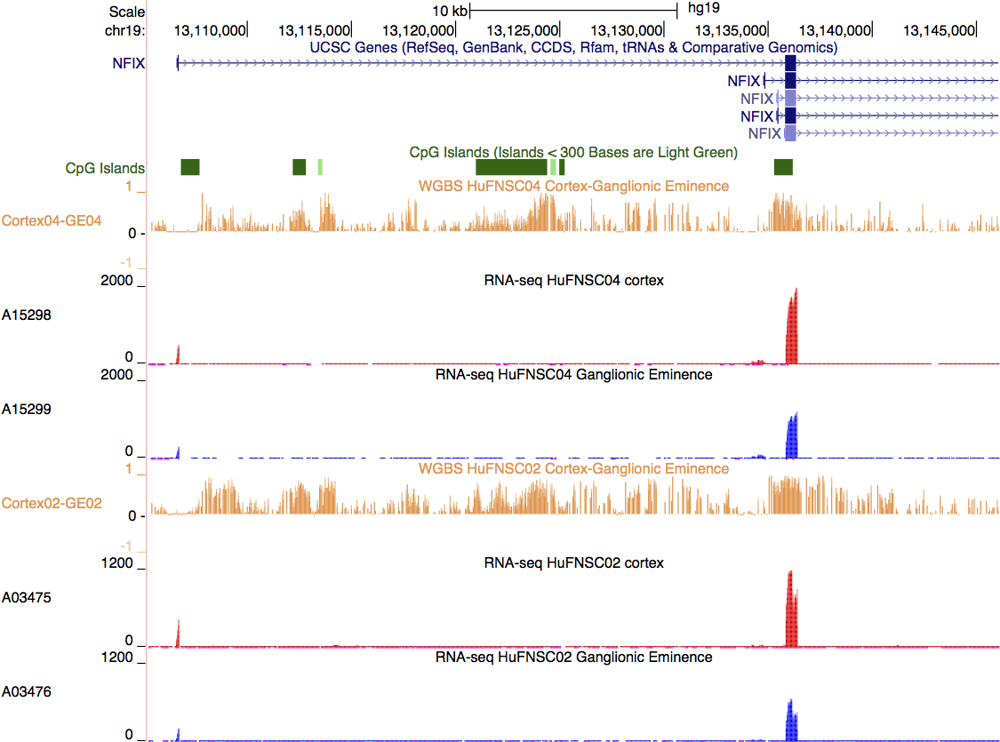

Updated: `r date()`

```{r setup, include = FALSE}
library(ggplot2)
library(plyr)
library(VennDiagram)
library(gridExtra)
library(gplots)
library(dendextend)
library(reshape)
library(wq)
library(dplyr)
setwd("/projects/epigenomics/users/lli/FetalBrain/")
load("./MeDIP/DMR_MZ.Rdata")
load("./MeDIP/DMR_neurospheres.Rdata")
load("./WGBS/WGBS.DMR.Rdata")
load("./GW/GW.Rdata")
load("./ChIPseq/ER/FetalBrain_FindER.Rdata")
load("./miR/FetalBrain_miR.Rdata")
load("./RNAseq/FetalBrain_DEgenes.Rdata")
load("./RNAseq/FetalBrain_isoform.Rdata")
load("./RNAseq/FetalBrain_isoform_valid.Rdata")
load("./RNAseq/exonProfile_Rmd.Rdata")
rownames(geneRPKM) <- geneRPKM$id
knitr::opts_chunk$set(message=FALSE, echo = FALSE, warning = FALSE, results = FALSE, fig.height = 10, fig.width = 10) 
knitr::opts_knit$set(root.dir = "/projects/epigenomics/users/lli/FetalBrain/Figures/")
```

## Figure 1: Overview and comparing MZ twins      
### Figure 1a: Experimental design overview   

     

### Figure 1b: Comparisons setup  

* Summary of sample information and libraries. Histone modifications include H3K4me1, H3K4me3, H3K9me3, H3K27me3, H3K36me3, and input. * marked samples without H3K4me3. Boxes outline the setup for pairwise comparisons, including comparing between MZ twins, between cortex and GE NPCs, and across three gestational weeks.    

     
    
### Figure 1c: Scale of UMRs and DE genes between MZ twins and NPCs 

* MeDIP UMR frequency (top panel, bp/Mb), No. of unique enhancers (second panel), No. of differential expressed genes (third panel), and No. of isoform genes (bottom panel) between MZ twins. HuFNSC01-specific UMRs and genes upregulated in HuFNSC01 are shown in red, and HuFNSC02-specific UMRs and genes upregulated in HuFNSC02 are shown in blue.        
* _Note the opposite direction of UMRs and unique enhancers, why?_      

```{r MZ_scale, fig.height = 10, fig.width = 8}
MZ_scale <- data.frame(Sample = rep(c(DMR_MZ_summary$Sample, DMR_neurospheres_summary$Sample), 7), 
                        Category = rep(c(rep("Individual specific", nrow(DMR_MZ_summary)), rep("Cell type specific", nrow(DMR_neurospheres_summary))), 7), 
                        DM_DE = factor(c(rep(rep(c("HuFNSC01 UMR/UP", "HuFNSC02 UMR/UP"), each = nrow(DMR_MZ_summary) + nrow(DMR_neurospheres_summary)), 3), rep("Isoforms", nrow(DMR_MZ_summary) + nrow(DMR_neurospheres_summary))), levels = c("HuFNSC01 UMR/UP", "HuFNSC02 UMR/UP", "Isoforms")), 
                        Assay = factor(c(rep(c("UMRs", "Unique enhancers", "DE genes"), each = (nrow(DMR_MZ_summary) + nrow(DMR_neurospheres_summary))*2), rep("Isoforms", (nrow(DMR_MZ_summary) + nrow(DMR_neurospheres_summary)))), levels = c("UMRs", "Unique enhancers", "DE genes", "Isoforms")), 
                        value = c(-(filter(DMR_freq_MZ_figure$data, DM == -1) %>% group_by(cell) %>% summarize(m = mean(freq)))$m, -(filter(DMR_freq_neurospheres_figure$data, DM == -1) %>% group_by(donor) %>% summarize(m = mean(freq)))$m, -(filter(DMR_freq_MZ_figure$data, DM == 1) %>% group_by(cell) %>% summarize(m = mean(freq)))$m, -(filter(DMR_freq_neurospheres_figure$data, DM == 1) %>% group_by(donor) %>% summarize(m = mean(freq)))$m, unique_enhancers_summary[1:5, "Sample1_unique"], -unique_enhancers_summary[1:5, "Sample2_unique"], individual_DE_summary$UP[1:3], cortex_GE_DE_summary$UP[1:2], -individual_DE_summary$DN[1:3], -cortex_GE_DE_summary$DN[1:2], individual_summary[1:3, "isoform_genes"], cortex_GE_summary[1:2, "isoform_genes"]))
MZ_scale$Sample <- factor(gsub("-HuFNSC.+", "", MZ_scale$Sample), levels = c("Brain", "Cortex", "GE"))
MZ_scale <- MZ_scale %>% filter(as.character(Category) == "Individual specific", as.character(DM_DE) != "Isoforms")
MZ_scale_figure <- ggplot(MZ_scale, aes(x = Sample, y = value, fill = DM_DE)) + 
   geom_bar(stat="identity", position = "identity", width = 0.5) + 
   geom_hline(yintercept = 0) + 
   facet_grid(Assay ~ ., scales = "free", space = "free_x") + 
   scale_fill_manual(values = c("red", "blue", "black"), name = "") + 
   scale_y_continuous(breaks = c(-30000, -10000, -2000, -500, -50, 50, 500, 2000, 10000, 30000), labels = c(-30000, 10000, 2000, 500, 50, 50, 500, 2000, 10000, 30000)) + 
   xlab("") + 
   ylab("") + 
   theme_bw() + 
   theme(strip.text = element_text(size = 15), axis.title = element_text(size = 15), axis.text = element_text(size = 12), legend.text = element_text(size = 15))
MZ_scale_figure_gt <- ggplot_gtable(ggplot_build(MZ_scale_figure))
grid.newpage()
grid.draw(MZ_scale_figure_gt)
grid.text("UMR frequency\n(bp/Mb)", x = unit(0.03, "npc"), y = unit(0.8, "npc"), rot = 90, gp=gpar(fontsize=15))
grid.text("No. of unique enhancers", x = unit(0.015, "npc"), y = unit(0.53, "npc"), rot = 90, gp=gpar(fontsize=15))
grid.text("No. of DE genes", x = unit(0.015, "npc"), y = unit(0.2, "npc"), rot = 90, gp=gpar(fontsize=15))
pdf("Figure1c.pdf", height = 10, width = 8)
grid.draw(MZ_scale_figure_gt)
grid.text("UMR frequency\n(bp/Mb)", x = unit(0.03, "npc"), y = unit(0.8, "npc"), rot = 90, gp=gpar(fontsize=15))
grid.text("No. of unique enhancers", x = unit(0.015, "npc"), y = unit(0.53, "npc"), rot = 90, gp=gpar(fontsize=15))
grid.text("No. of DE genes", x = unit(0.015, "npc"), y = unit(0.2, "npc"), rot = 90, gp=gpar(fontsize=15))
dev.off()
```

## Figure 2: Comparing cortex and GE NPCs
### Figure 2a: Scale of UMRs and DE genes between NPCs 

* WGBS UMR frequency (top panel, bp/Mb), fold enrichment of UMRs in enhancers (second panel), No. of differential expressed genes (third panel), and No. of isoform genes (bottom panel) between cortex and GE NPCs in GW13 (left panel), and GW17 (right panel). Cortex-specific UMRs and genes upregulated in cortex are shown in red, and GE-specific UMRs and genes upregulated in GE are shown in blue.        

```{r NPCs_scale, fig.height = 10, fig.width = 12}
NPCs_scale <- data.frame(Donor = c(rep(c("HuFNSC02", "HuFNSC04", "HuFNSC02", "HuFNSC04", "HuFNSC01", "HuFNSC02", "HuFNSC03", "HuFNSC04"), 2), "HuFNSC01", "HuFNSC02", "HuFNSC03", "HuFNSC04"), 
                                 GW = c(rep(c("GW17", "GW13", "GW17", "GW13", "GW17", "GW17", "GW13", "GW13"), 2), "GW17", "GW17", "GW13", "GW13"), 
                                 Assay = factor(c(rep(c(rep("UMRs", 2), rep("Enhancer UMRs", 2), rep("DE genes", 4)), 2), rep("Isoforms", 4)), levels = c("UMRs", "Enhancer UMRs", "DE genes", "Isoforms")), 
                                 DM_DE = c(rep(c("Cortex UMR/UP", "GE UMR/UP"), each = 8), rep("Isoform", 4)), 
                                 value = c((filter(DMR_freq_WGBS_figure$data, DM == -1) %>% group_by(donor) %>% summarize(m = -mean(freq)))$m, UMR_enhancer_enrich[c(2,4), "enrich"], cortex_GE_DE_summary$UP, (filter(DMR_freq_WGBS_figure$data, DM == 1) %>% group_by(donor) %>% summarize(m = mean(freq)))$m, UMR_enhancer_enrich[c(1,3), "enrich"], cortex_GE_DE_summary$DN, cortex_GE_summary[, "isoform_genes"]))
NPCs_scale[NPCs_scale$DM_DE == "GE UMR/UP", "value"] <- -NPCs_scale[NPCs_scale$DM_DE == "GE UMR/UP", "value"]
NPCs_scale <- filter(NPCs_scale, Donor %in% c("HuFNSC02", "HuFNSC04"), as.character(Assay) != "Enhancer UMRs")
NPCs_scale_figure <- ggplot(NPCs_scale, aes(x = Donor, y = value, fill = DM_DE)) + 
   geom_bar(stat="identity", position = "identity", width = 0.4) + 
   geom_hline(yintercept = 0) + 
   facet_grid(Assay ~ GW, scales = "free") + 
   scale_fill_manual(values = c("red", "blue", "black"), name = "") + 
   scale_y_continuous(breaks = c(-500, -200, -50, -2, 2, 50, 200, 500, 1000, 2000), labels = abs(c(-500, -200, -50, -2, 2, 50, 200, 500, 1000, 2000))) + 
   xlab("") + 
   ylab("") + 
   theme_bw() + 
   theme(strip.text = element_text(size = 15), axis.title = element_text(size = 15), axis.text = element_text(size = 12), legend.text = element_text(size = 15))
NPCs_scale_figure_gt <- ggplot_gtable(ggplot_build(NPCs_scale_figure))
grid.newpage()
grid.draw(NPCs_scale_figure_gt)
grid.text("UMR frequency\n(bp/Mb)", x = unit(0.03, "npc"), y = unit(0.8, "npc"), rot = 90, gp=gpar(fontsize=15))
grid.text("No. of DE genes", x = unit(0.015, "npc"), y = unit(0.5, "npc"), rot = 90, gp=gpar(fontsize=15))
grid.text("No. of isoform genes", x = unit(0.015, "npc"), y = unit(0.2, "npc"), rot = 90, gp=gpar(fontsize=15))
pdf("Figure2a.pdf", height = 10, width = 12)
grid.draw(NPCs_scale_figure_gt)
grid.text("UMR frequency\n(bp/Mb)", x = unit(0.03, "npc"), y = unit(0.8, "npc"), rot = 90, gp=gpar(fontsize=15))
grid.text("No. of DE genes", x = unit(0.015, "npc"), y = unit(0.5, "npc"), rot = 90, gp=gpar(fontsize=15))
grid.text("No. of isoform genes", x = unit(0.015, "npc"), y = unit(0.2, "npc"), rot = 90, gp=gpar(fontsize=15))
dev.off()
```

### Figure 2b: GREAT enrichment for NPCs UMRs

* GREAT GO biological processes terms statistically enriched (region-based binomial and hypergeometric FDR < 0.05) in cortex UMRs (red), and GE UMRs (blue).     

```{r NPCs_GREAT, fig.height = 10, fig.width = 10}
GOBP_Cortex02.UMR_WGBS <- read.delim("../WGBS/DMR/ALL_GREAT_GOBP_DMR.Cortex-HuFNSC02_GE-HuFNSC02.hypo.tsv", head = F, as.is = T, skip = 4)
GOBP_GE02.UMR_WGBS <- read.delim("../WGBS/DMR/ALL_GREAT_GOBP_DMR.Cortex-HuFNSC02_GE-HuFNSC02.hyper.tsv", head = F, as.is = T, skip = 4)
GOBP_Cortex02_GE02_WGBS <- rbind(select(mutate(filter(GOBP_Cortex02.UMR_WGBS, V8 >= 2 & V7 <= 0.05 & V16 <= 0.05), UMR = "Cortex.UMR", FDR = -log10(V7), Term = V3), UMR, Term, FDR),
                                 select(mutate(filter(GOBP_GE02.UMR_WGBS, V8 >= 2 & V7 <= 0.05 & V16 <= 0.05), UMR = "GE.UMR", FDR = log10(V7), Term = V3), UMR, Term, FDR))
Terms <- unique(c(arrange(filter(GOBP_Cortex02_GE02_WGBS, UMR == "Cortex.UMR"), desc(FDR))[1:20, "Term"], rev(arrange(filter(GOBP_Cortex02_GE02_WGBS, UMR == "GE.UMR"), FDR)[1:20, "Term"])))
GOBP_Cortex02_GE02_WGBS <- mutate(filter(GOBP_Cortex02_GE02_WGBS, Term %in% Terms), Term = factor(Term, levels = rev(Terms)))
(GOBP_Cortex02_GE02_WGBS_figure <- ggplot(data = GOBP_Cortex02_GE02_WGBS, aes(Term, FDR, fill = UMR)) +
  geom_bar(position = "identity", stat = "identity", width = .5) + 
  coord_flip() + 
  xlab("") + 
  ylab("-log10(FDR)") + 
  scale_fill_manual(values = c("red", "blue"), name = "") + 
  theme_bw() + 
  theme(axis.title = element_text(size = 15), axis.text = element_text(size = 15), legend.text = element_text(size = 15)))
ggsave(GOBP_Cortex02_GE02_WGBS_figure, file = "Figure2b.pdf", height = 10, width = 10)
```

### Figure 2c: GFAP and NFIX

* UCSC genome browser shot of examples of cortex UMR activated genes, top panel: Glial Fibrillary Acidic Protein (GFAP), bottom panel: Nuclear Factor I/X (CCAAT-Binding Transcription Factor, NFIX).     

     
     

## Figure 3: Comparing across gestational weeks   
### Figure 3a: UMRs and DE genes between GW 

* WGBS UMR frequency (top panel, bp/Mb), fold enrichment of UMRs in enhancers (second panel), No. of differential expressed genes (third panel), and No. of isoform genes (bottom panel) between GW13 and GW17 in NPCs cortex (left panel), and GE (right panel). GW13-specific UMRs and genes upregulated in GW13 are shown in red, and GW17-specific UMRs and genes upregulated in GW17 are shown in blue.        

```{r GW_scale, fig.height = 10, fig.width = 12}
GW_scale <- data.frame(Cell = rep(c("Cortex", "GE"), 7), 
                       Assay = factor(c(rep(c(rep("UMRs", 2), rep("Enhancer UMRs", 2), rep("DE genes", 2)), 2), rep("Isoforms", 2)), levels = c("UMRs", "Enhancer UMRs", "DE genes", "Isoforms")), 
                       DM_DE = c(rep(c("GW17 UMR/UP", "GW13 UMR/UP"), each = 6), rep("Isoform", 2)), 
                       value = c((filter(DMR_freq_GW_figure$data, DM == -1) %>% group_by(cell) %>% summarize(m = -mean(freq)))$m, UMR_enhancer_enrich[c(6, 8), "enrich"], GW_DE_summary[GW_DE_summary$Sample %in% c("GW17-GW13.2_cortex", "GW17-GW13.2_GE"), ]$UP, (filter(DMR_freq_GW_figure$data, DM == 1) %>% group_by(cell) %>% summarize(m = mean(freq)))$m, UMR_enhancer_enrich[c(5, 7), "enrich"], GW_DE_summary[GW_DE_summary$Sample %in% c("GW17-GW13.2_cortex", "GW17-GW13.2_GE"), ]$DN, as.numeric(as.vector(GW_isoform_summary[GW_isoform_summary$Sample %in% c("Cortex-HuFNSC02_Cortex-HuFNSC04", "GE-HuFNSC02_GE-HuFNSC04"), "isoform_genes"])))) %>%
  filter(as.character(DM_DE) != "Isoform")
GW_scale[GW_scale$DM_DE == "GW13 UMR/UP", "value"] <- -GW_scale[GW_scale$DM_DE == "GW13 UMR/UP", "value"]
GW_scale_figure <- ggplot(GW_scale, aes(x = Cell, y = value, fill = DM_DE)) + 
   geom_bar(stat="identity", position = "identity", width = 0.4) + 
   geom_hline(yintercept = 0) + 
   facet_grid(Assay ~ Cell, scales = "free") + 
   scale_fill_manual(values = c("red", "blue", "black"), name = "") + 
   scale_y_continuous(breaks = c(-100, -1, 1, 100, 250, 500, 2000), labels = abs(c(-100, -1, 1, 100, 250, 500, 2000))) + 
   xlab("") + 
   ylab("") + 
   theme_bw() + 
   theme(strip.text = element_text(size = 15), axis.title = element_text(size = 15), axis.text = element_text(size = 12), legend.text = element_text(size = 15))
GW_scale_figure_gt <- ggplot_gtable(ggplot_build(GW_scale_figure))
grid.newpage()
grid.draw(GW_scale_figure_gt)
grid.text("UMR frequency\n(bp/Mb)", x = unit(0.03, "npc"), y = unit(0.83, "npc"), rot = 90, gp=gpar(fontsize=15))
grid.text("UMR Enrichment\nin Enhancers", x = unit(0.03, "npc"), y = unit(0.5, "npc"), rot = 90, gp=gpar(fontsize=15))
grid.text("No. of DE genes", x = unit(0.015, "npc"), y = unit(0.2, "npc"), rot = 90, gp=gpar(fontsize=15))
pdf("Figure3a.pdf", height = 10, width = 8)
grid.draw(GW_scale_figure_gt)
grid.text("UMR frequency\n(bp/Mb)", x = unit(0.03, "npc"), y = unit(0.83, "npc"), rot = 90, gp=gpar(fontsize=15))
grid.text("UMR Enrichment\nin Enhancers", x = unit(0.03, "npc"), y = unit(0.5, "npc"), rot = 90, gp=gpar(fontsize=15))
grid.text("No. of DE genes", x = unit(0.015, "npc"), y = unit(0.2, "npc"), rot = 90, gp=gpar(fontsize=15))
dev.off()
```

### Figure 3b: GW unique enhancer TFBSs

* Transcription factors exclusively statistically enriched (Benjamini corrected p-value < 0.01, and percent of enhancers with motif > 20%) in GW17 unique enhancers.     

```{r GW_enhancer_TFBS, fig.height=4, fig.width=12}
homer_unique_enhancer_GW_GW17only_figure$data <- homer_unique_enhancer_GW_GW17only_figure$data %>% mutate(Category = "Percent of Enhancers with Motif", EnsemblID = c("ENSG00000169083", "ENSG00000168267", "ENSG00000082175", "ENSG00000150907", "ENSG00000205927"), RPKM_cortex_GW13 = geneRPKM[EnsemblID, "cortex04"], RPKM_cortex_GW17 = (geneRPKM[EnsemblID, ] %>% mutate(GW17_cortex = (cortex01 + cortex02)/2))$GW17_cortex, RPKM_GE_GW13 = geneRPKM[EnsemblID, "ge04"], RPKM_GE_GW17 = (geneRPKM[EnsemblID, ] %>% mutate(GW17_GE = (ge01 + ge02)/2))$GW17_GE) 
homer_unique_enhancer_GW_GW17only_RPKM <- melt(homer_unique_enhancer_GW_GW17only_figure$data[, c("TF", grep("RPKM", colnames(homer_unique_enhancer_GW_GW17only_figure$data), value = T))], id = "TF") %>% mutate(Category = gsub("_GW.+", "", variable), GW = gsub("RPKM_.+_", "", variable), TF = factor(TF, levels = rev(c("AR-halfsite", "Ptf1a", "PR", "Foxo1", "Olig2"))))
homer_unique_enhancer_GW_GW17only_RPKM_figure <- ggplot(data = homer_unique_enhancer_GW_GW17only_RPKM, aes(TF, value, fill = GW)) +
   geom_bar(stat = "identity", width = .5, position = position_dodge()) + 
   coord_flip() + 
   facet_grid(. ~ Category) + 
   scale_fill_manual(values = c("GW13" = "red", "GW17" = "blue"), name = "") + 
   ylab("RPKM") + 
   xlab("") + 
   theme_bw() + 
   theme(axis.text.y = element_text(size = 0), axis.ticks.y = element_line(color = "white"), plot.margin=unit(c(1,1,1,-0.6), "cm"))
grid.newpage()
layOut(list(homer_unique_enhancer_GW_GW17only_figure + facet_grid(. ~ Category) + theme(plot.margin=unit(c(1,0,1,1), "cm")), 1, 1:4),
       list(homer_unique_enhancer_GW_GW17only_RPKM_figure, 1, 5:7)) 
pdf("Figure3b.pdf", height = 4, width = 12)
layOut(list(homer_unique_enhancer_GW_GW17only_figure + facet_grid(. ~ Category) + theme(plot.margin=unit(c(1,0,1,1), "cm")), 1, 1:4),
       list(homer_unique_enhancer_GW_GW17only_RPKM_figure, 1, 5:7)) 
dev.off()
```

### Figure 3c: OLIG2

* UCSC genome browser shot of Oligodendrocyte Lineage Transcription Factor 2 (OLIG2) hypomethylated in promoter region and upregulated in GW17.     

     

### Figure 3d: Heatmap of OLIG2 target genes   

* Heatmap of RPKM of OLIG2 downstream target genes in cortex NPCs (red), and GE NPCs (blue).    

```{r GW_OLIG2_heatmap, fig.height = 8, fig.width = 6}
GW_Olig2_RPKM <- na.omit(geneRPKM[homer_unique_enhancer_GW_GW17only_Olig2[abs(homer_unique_enhancer_GW_GW17only_Olig2$Distance.to.TSS) < 10000, "ID"], ]) 
colnames(GW_Olig2_RPKM) <- gsub("ge", "GE", colnames(GW_Olig2_RPKM))
GW_Olig2_RPKM_scale <- na.omit(data.frame(id = GW_Olig2_RPKM$id, t(scale(t(GW_Olig2_RPKM %>% select(-id, -brain01, -brain02)), center = T, scale = T)))) %>% arrange(cortex04+GE04, cortex01+cortex02+GE01+GE02)
GW_Olig2_RPKM_tall <- melt(GW_Olig2_RPKM_scale, id = "id") %>% mutate(id = factor(id, levels = rev(GW_Olig2_RPKM_scale$id)), Sample = factor(variable, levels = c("cortex04", "cortex03", "cortex02", "cortex01", "GE04", "GE03", "GE02", "GE01")))
GW_Olig2_RPKM_heatmap <- ggplot(GW_Olig2_RPKM_tall, aes(x = Sample, y = id, fill = value)) + 
   geom_tile() + 
   scale_fill_gradient(name = "Z-score") + 
   xlab("") + 
   ylab("") + 
   theme_bw() + 
   theme(axis.text.y = element_text(size = 0), axis.ticks.y = element_line(color = "white"), panel.border = element_rect(color = "white"), axis.text.x = element_text(angle = 90), plot.margin=unit(c(-0.4,1,1,1), "cm"), panel.background = element_rect(fill = "white"), panel.grid = element_line(color = "white"), legend.position = "bottom", axis.text = element_text(size = 12), legend.title = element_text(size = 12), legend.text = element_text(size = 12, angle = 90))
clab <- data.frame(sample = factor(colnames(GW_Olig2_RPKM %>% select(-id, -brain01, -brain02)), levels = c("cortex04", "cortex03", "cortex02", "cortex01", "GE04", "GE03", "GE02", "GE01")), y = 1, 
                   GW = rep(c("GW17", "GW17", "GW15", "GW13"), 2), 
                   Cell = rep(c("Cortex", "GE"), each = 4))
clab_tall <- melt(clab, id = c("sample", "y")) 
clab_figure <- ggplot(clab_tall, aes(sample, y, fill = value)) + 
   geom_tile() + 
   facet_grid(variable ~ .) + 
   scale_fill_manual(values = c("GW13" = rgb(250,192,144,maxColorValue = 255), "GW15" = rgb(247,150,70,maxColorValue = 255), "GW17" = rgb(228,108,10,maxColorValue = 255), "Cortex" = "red", "GE" = "blue"), name = "", guide = guide_legend(nrow = 2, byrow = T)) + 
   xlab("") + 
   ylab("") + 
   theme_bw() + 
   theme(axis.text = element_text(size = 0), axis.ticks = element_line(color = "white"), panel.border = element_rect(color = "white"), plot.margin=unit(c(1,0.8,0,1), "cm"), legend.position = "top", panel.grid = element_line(color = "white"), title = element_text(size = 12), legend.title = element_text(size = 12), legend.text = element_text(size = 12), strip.background = element_blank(), strip.text = element_blank(), legend.key.height = unit(0.3, "cm"), legend.key.width = unit(0.3, "cm"))
grid.arrange(clab_figure, GW_Olig2_RPKM_heatmap, nrow = 2, heights = c(0.22, 0.78))
pdf("Figure3d.pdf", height = 8, width = 6)
grid.arrange(clab_figure, GW_Olig2_RPKM_heatmap, nrow = 2, heights = c(0.22, 0.78))
dev.off()
```

### Figure 3e: Differential expressed OLIG2 target genes   

* Cytoscape network of OLIG2 target genes that are differential expressed.       

     

## Figure 4: Stage-specific differential expression   
### Figure 4a: summary  

* No. of differential expressed genes between different gestational weeks (left panel: GW17 vs GW13, middle panel: GW17 vs GW15, right panel: GW15 vs GW13) in NPCs cortex (red), GE (blue), and shared by two cell types (purple). Bars pointing up shows upregulation in later stages, and bars pointing down shows upregulation in earlier stages.    

```{r GW_DE_summary}
(GW_DE_summary_figure + 
   theme(strip.text = element_text(size = 18), axis.title = element_text(size = 18), axis.text = element_text(size = 15), legend.text = element_text(size = 18), legend.title = element_text(size = 0)))
ggsave(GW_DE_summary_figure, file = "Figure4a.pdf", height = 10, width = 12)
```

### Figure 4b: Shared by cortex and GE NPCs  

* Patterns of expression for genes differentially expressed between gestational weeks shared by cortex and GE NPCs. Genes are divided into eight expression profile groups, represented by eight different colours. The thickness of the line represents relative No. of genes in the category, and dashed line means no genes are in the category.                

```{r GW_DE_trend}
(GW_DE_trend_figure <- GW_DE_trend_figure + 
   ylab("Relative expression level") + 
   theme(strip.text = element_text(size = 18), title = element_text(size = 18), axis.title = element_text(size = 18), axis.text = element_text(size = 15), legend.text = element_text(size = 18)))
ggsave(GW_DE_trend_figure, file = "Figure4b.pdf", height = 10, width = 12)
```

### Figure 4c: Cortex NPCs  

* Patterns of expression for genes differentially expressed between gestational weeks in cortex NPCs.           

```{r GW_DE_trend_cortex}
(GW_DE_trend_cortex_figure <- GW_DE_trend_cortex_figure + 
   ylab("Relative expression level") + 
   scale_size(range = c(1, 10)) + 
   theme(strip.text = element_text(size = 18), title = element_text(size = 18), axis.title = element_text(size = 18), axis.text = element_text(size = 15), legend.text = element_text(size = 18)))
ggsave(GW_DE_trend_cortex_figure, file = "Figure4c.pdf", height = 10, width = 12)
```

### Figure 4d: GE NPCs

* Patterns of expression for genes differentially expressed between gestational weeks in GE NPCs.       

```{r GW_DE_trend_GE}
(GW_DE_trend_GE_figure <- GW_DE_trend_GE_figure + 
   ylab("Relative expression level") + 
   scale_size(range = c(1, 10)) + 
   theme(strip.text = element_text(size = 18), title = element_text(size = 18), axis.title = element_text(size = 18), axis.text = element_text(size = 15), legend.text = element_text(size = 18)))
ggsave(GW_DE_trend_GE_figure, file = "Figure4d.pdf", height = 10, width = 12)
```

### Figure 4e,f: Heatmap of stage specific expressed genes  

* Heatmap for RPKM of stage-specific differential expressed genes in Figure 3c and 3d.         

```{r GW_DE_heatmap, fig.height=20}
clab <- data.frame(sample = factor(colnames(GW_DE_rpkm_cortex), levels = colnames(GW_DE_rpkm_cortex)),
                   y = 1, 
                   GW = c("GW13", "GW15", "GW17", "GW17"))
clab_figure <- ggplot(clab, aes(sample, y, fill = GW)) + 
   geom_tile() + 
   scale_fill_manual(values = c(rgb(250,192,144,maxColorValue = 255), rgb(247,150,70,maxColorValue = 255), rgb(228,108,10,maxColorValue = 255)), name = "", guide = guide_legend(nrow = 1)) + 
   xlab("") + 
   ylab("") + 
   theme_bw() + 
   theme(axis.text = element_text(size = 0), axis.ticks = element_line(color = "white"), panel.border = element_rect(color = "white"), plot.margin=unit(c(1,1,-0.3,1), "cm"), legend.position = "top", panel.grid = element_line(color = "white"), title = element_text(size = 18), legend.title = element_text(size = 18), legend.text = element_text(size = 15))
GW_DE_rpkm_cortex_tall <- melt(t(scale(t(GW_DE_rpkm_cortex), center = T, scale = T))) %>% mutate(miR = factor(X1, levels = rev(rownames(GW_DE_rpkm_cortex))), Sample = factor(X2, levels = colnames(GW_DE_rpkm_cortex)))
GW_DE_heatmap_cortex <- ggplot(GW_DE_rpkm_cortex_tall, aes(x = Sample, y = miR, fill = value)) + 
   geom_tile() + 
   geom_hline(yintercept=as.numeric(factor(c("ENSG00000086570", "ENSG00000164929"), levels = rev(rownames(GW_DE_rpkm_cortex))))) + 
   scale_fill_gradient(name = "Z-score") + 
   xlab("") + 
   ylab("") + 
   theme_bw() + 
   theme(axis.text.y = element_text(size = 0), axis.ticks.y = element_line(color = "white"), panel.border = element_rect(color = "white"), axis.text.x = element_text(angle = 90), plot.margin=unit(c(-0.3,1,1,1), "cm"), panel.background = element_rect(fill = "white"), panel.grid = element_line(color = "white"), legend.position = "bottom", axis.text = element_text(size = 15), legend.title = element_text(size = 18), legend.text = element_text(size = 15, angle = 90))
GW_DE_rpkm_GE_tall <- melt(t(scale(t(GW_DE_rpkm_GE), center = T, scale = T))) %>% mutate(miR = factor(X1, levels = rev(rownames(GW_DE_rpkm_GE))), Sample = factor(X2, levels = colnames(GW_DE_rpkm_GE)))
GW_DE_heatmap_GE <- ggplot(GW_DE_rpkm_GE_tall, aes(x = Sample, y = miR, fill = value)) + 
   geom_tile() + 
   geom_hline(yintercept=as.numeric(factor(c("ENSG00000154736", "ENSG00000182580"), levels = rev(rownames(GW_DE_rpkm_GE))))) + 
   scale_fill_gradient(name = "Z-score") + 
   xlab("") + 
   ylab("") + 
   theme_bw() + 
   theme(axis.text.y = element_text(size = 0), axis.ticks.y = element_line(color = "white"), panel.border = element_rect(color = "white"), axis.text.x = element_text(angle = 90), plot.margin=unit(c(-0.3,1,1,1), "cm"), panel.background = element_rect(fill = "white"), panel.grid = element_line(color = "white"), legend.position = "bottom", axis.text = element_text(size = 15), legend.title = element_text(size = 18), legend.text = element_text(size = 15, angle = 90))
grid.arrange(clab_figure + ggtitle("Cortex"), GW_DE_heatmap_cortex, clab_figure + ggtitle("GE"), GW_DE_heatmap_GE, nrow = 4, heights = c(0.09, 0.41, 0.09, 0.41))
pdf("Figure4e.pdf", height = 20, width = 8)
grid.arrange(clab_figure + ggtitle("Cortex"), GW_DE_heatmap_cortex, clab_figure + ggtitle("GE"), GW_DE_heatmap_GE, nrow = 4, heights = c(0.09, 0.41, 0.09, 0.41))
dev.off()
```

## Supplemental Figures
### Supplemental 1: Asymmetry in UMRs 

* UMRs frequency (bp/MB) for each chromosome for MeDIP UMRs between MZ twins (A), WGBS UMRs between cortex and GE NPCs (B), and WGBS UMRs between GW13 and GW17 (C).     
  
```{r UMR_asymmetry}
grid.newpage()
layOut(list(DMR_freq_MZ_figure + ggtitle("UMRs between MZ twins") + scale_fill_manual(values = c("blue", "red"), label = c("HuFNSC02 UMRs", "HuFNSC01 UMRs"), name = ""), 1, 1:3), 
       list(DMR_freq_WGBS_figure + ggtitle("UMRs between NPCs") + scale_fill_manual(values = c("blue", "red"), label = c("GE UMRs", "Cortex UMRs"), name = ""), 2, 1:2), 
       list(DMR_freq_GW_figure + ggtitle("UMRs between GW") + scale_fill_manual(values = c("red", "blue"), labels = c("GW13 UMRs", "GW17 UMRs"), name = ""), 2, 3:4))
grid.text("A", x = unit(0.015, "npc"), y = unit(0.98, "npc"), gp=gpar(fontsize = 20))
grid.text("B", x = unit(0.015, "npc"), y = unit(0.48, "npc"), gp=gpar(fontsize = 20))
grid.text("C", x = unit(0.515, "npc"), y = unit(0.48, "npc"), gp=gpar(fontsize = 20))
pdf(file = "FigureS1.pdf", height = 12, width = 12)
layOut(list(DMR_freq_MZ_figure + ggtitle("UMRs between MZ twins") + scale_fill_manual(values = c("blue", "red"), label = c("HuFNSC02 UMRs", "HuFNSC01 UMRs"), name = ""), 1, 1:3), 
       list(DMR_freq_WGBS_figure + ggtitle("UMRs between NPCs") + scale_fill_manual(values = c("blue", "red"), label = c("GE UMRs", "Cortex UMRs"), name = ""), 2, 1:2), 
       list(DMR_freq_GW_figure + ggtitle("UMRs between GW") + scale_fill_manual(values = c("red", "blue"), labels = c("GW13 UMRs", "GW17 UMRs"), name = ""), 2, 3:4))
grid.text("A", x = unit(0.015, "npc"), y = unit(0.98, "npc"), gp=gpar(fontsize = 20))
grid.text("B", x = unit(0.015, "npc"), y = unit(0.48, "npc"), gp=gpar(fontsize = 20))
grid.text("C", x = unit(0.515, "npc"), y = unit(0.48, "npc"), gp=gpar(fontsize = 20))
dev.off()
```

### Supplemental 2: Genomic breakdown of UMRs

* Fold enrichment on log2 scale for overlapping genomic regions with MeDIP UMRs between MZ twins (A), WGBS UMRs between cortex and GE NPCs (B), and WGBS UMRs between GW13 and GW17 (C).     

```{r genomicBreak}
genomicBreak_MZ_tall <- genomicBreak_MZ_figure$data %>% mutate(DM = revalue(factor(DM), c("hyper" = "HuFNSC02 UMRs", "hypo" = "HuFNSC01 UMRs")))
genomicBreak_MZ_figure <- ggplot(genomicBreak_MZ_tall, aes(x = Region, y = log2(FC), fill = Sample)) + 
  geom_bar(stat = "identity", position = "dodge", width = 0.5) + 
  xlab("") + 
  ylab("log2 Fold enrichment") + 
  ggtitle("UMRs between MZ twins") + 
  facet_wrap(~ DM) + 
  coord_flip() + 
  scale_fill_manual(values = c("green", "red", "blue"), labels = c("Brain", "Cortex", "GE"), name = "") + 
  theme_bw()
genomicBreak_WGBS_tall <- genomicBreak_WGBS_figure$data %>% mutate(DM = revalue(factor(DM), c("hyper" = "GE UMRs", "hypo" = "Cortex UMRs")))
genomicBreak_WGBS_figure <- ggplot(genomicBreak_WGBS_tall, aes(x = Region, y = log2(FC), fill = Sample)) + 
  geom_bar(stat = "identity", position = "dodge", width = 0.5) + 
  xlab("") + 
  ylab("log2 Fold enrichment") + 
  ggtitle("UMRs between NPCs") + 
  coord_flip() + 
  scale_fill_manual(values = c("blue", "red"), labels = c("HuFNSC02\n(GW17)", "HuFNSC04\n(GW13)"), name = "") + 
  facet_wrap(~ DM) + 
  theme_bw()
genomicBreak_GW_tall <- genomicBreak_GW_figure$data %>% mutate(DM = revalue(factor(DM), c("hyper" = "GW13 UMRs", "hypo" = "GW17 UMRs")))
genomicBreak_GW_figure <- ggplot(genomicBreak_GW_tall, aes(x = Region, y = log2(FC), fill = Sample)) + 
  geom_bar(stat = "identity", position = "dodge", width = 0.5) + 
  xlab("") + 
  ylab("log2 Fold enrichment") + 
  ggtitle("UMRs between GW") + 
  coord_flip() + 
  scale_fill_manual(values = c("red", "blue"), labels = c("Cortex", "GE"), name = "") + 
  facet_wrap(~ DM) + 
  theme_bw()
grid.newpage()
layOut(list(genomicBreak_MZ_figure, 1, 1), 
       list(genomicBreak_WGBS_figure, 1, 2), 
       list(genomicBreak_GW_figure, 2, 1))
grid.text("A", x = unit(0.015, "npc"), y = unit(0.98, "npc"), gp=gpar(fontsize = 20))
grid.text("B", x = unit(0.515, "npc"), y = unit(0.98, "npc"), gp=gpar(fontsize = 20))
grid.text("C", x = unit(0.015, "npc"), y = unit(0.48, "npc"), gp=gpar(fontsize = 20))
pdf("FigureS2.pdf", height = 12, width = 12)
layOut(list(genomicBreak_MZ_figure, 1, 1), 
       list(genomicBreak_WGBS_figure, 1, 2), 
       list(genomicBreak_GW_figure, 2, 1))
grid.text("A", x = unit(0.015, "npc"), y = unit(0.98, "npc"), gp=gpar(fontsize = 20))
grid.text("B", x = unit(0.515, "npc"), y = unit(0.98, "npc"), gp=gpar(fontsize = 20))
grid.text("C", x = unit(0.015, "npc"), y = unit(0.48, "npc"), gp=gpar(fontsize = 20))
dev.off()
```

### Supplemental 3: Fraction of DE genes with proximal UMRs

* Fraction of differential expressed genes proximally (TSS +/- 1500bp) associated with MeDIP UMRs between MZ twins (A), WGBS UMRs between cortex and GE NPCs (B), and WGBS UMRs between GW13 and GW17 (C).     

```{r proximal_DE}
DMR_proximal_DE_MZ_summary <- data.frame(Sample = rownames(DMR_proximal_MZ_summary), Total.UP = rep(c(nrow(filter(brain01_brain02DE, DE == "UP")), nrow(filter(cortex01_cortex02DE, DE == "UP")), nrow(filter(GE01_GE02DE, DE == "UP"))), each = 2), Total.DN = rep(c(nrow(filter(brain01_brain02DE, DE == "DN")), nrow(filter(cortex01_cortex02DE, DE == "DN")), nrow(filter(GE01_GE02DE, DE == "DN"))), each = 2), DMR.DE = DMR_proximal_MZ_summary[, "DE.DMRs"], same.direction = DMR_proximal_MZ_summary[, "same.direction"], DMR.UP = NA, DMR.DN = NA)
DMR_proximal_DE_MZ_summary$DM <- gsub(".*_", "", DMR_proximal_DE_MZ_summary$Sample)
DMR_proximal_DE_MZ_summary$Sample <- gsub("\\d.*", "", DMR_proximal_DE_MZ_summary$Sample)
DMR_proximal_DE_MZ_summary[DMR_proximal_DE_MZ_summary$DM == "hyper", "DMR.UP"] <- (DMR_proximal_DE_MZ_summary[DMR_proximal_DE_MZ_summary$DM == "hyper", "DMR.DE"] - DMR_proximal_DE_MZ_summary[DMR_proximal_DE_MZ_summary$DM == "hyper", "same.direction"]) / DMR_proximal_DE_MZ_summary[DMR_proximal_DE_MZ_summary$DM == "hyper", "Total.UP"]
DMR_proximal_DE_MZ_summary[DMR_proximal_DE_MZ_summary$DM == "hypo", "DMR.UP"] <- DMR_proximal_DE_MZ_summary[DMR_proximal_DE_MZ_summary$DM == "hypo", "same.direction"] / DMR_proximal_DE_MZ_summary[DMR_proximal_DE_MZ_summary$DM == "hypo", "Total.UP"]
DMR_proximal_DE_MZ_summary[DMR_proximal_DE_MZ_summary$DM == "hyper", "DMR.DN"] <- DMR_proximal_DE_MZ_summary[DMR_proximal_DE_MZ_summary$DM == "hyper", "same.direction"] / DMR_proximal_DE_MZ_summary[DMR_proximal_DE_MZ_summary$DM == "hyper", "Total.DN"]
DMR_proximal_DE_MZ_summary[DMR_proximal_DE_MZ_summary$DM == "hypo", "DMR.DN"] <- (DMR_proximal_DE_MZ_summary[DMR_proximal_DE_MZ_summary$DM == "hypo", "DMR.DE"] - DMR_proximal_DE_MZ_summary[DMR_proximal_DE_MZ_summary$DM == "hypo", "same.direction"])  / DMR_proximal_DE_MZ_summary[DMR_proximal_DE_MZ_summary$DM == "hypo", "Total.DN"]
DMR_proximal_DE_MZ_summary_tall <- data.frame(Sample = rep(DMR_proximal_DE_MZ_summary$Sample, 2), DM = rep(DMR_proximal_DE_MZ_summary$DM, 2), DE = rep(c("UP", "DN"), each = nrow(DMR_proximal_DE_MZ_summary)), Percent = c(DMR_proximal_DE_MZ_summary$DMR.UP, DMR_proximal_DE_MZ_summary$DMR.DN))
DMR_proximal_DE_MZ_summary_tall <- DMR_proximal_DE_MZ_summary_tall %>% mutate(DM = revalue(factor(DM), c("hyper" = "HuFNSC02 UMRs", "hypo" = "HuFNSC01 UMRs")))
DMR_proximal_DE_MZ_figure <- ggplot(DMR_proximal_DE_MZ_summary_tall, aes(x = Sample, y = Percent, fill = DE)) + 
   geom_bar(stat = "identity", position = "dodge", width = 0.5) + 
   facet_wrap(~ DM) + 
   coord_flip() + 
   scale_fill_manual(values = c("blue", "red"), labels = c("UP in HuFNSC02", "UP in HuFNSC01"), name = "") + 
   xlab("") + 
   ylab("Fraction of DE genes") + 
   ggtitle("UMRs between MZ twins") + 
   theme_bw()
DMR_proximal_DE_NPCs_summary <- data.frame(Sample = rownames(DMR_WGBS_gene_summary), Total.UP = rep(c(nrow(filter(cortex02_GE02DE, DE == "UP")), nrow(filter(cortex04_GE04DE, DE == "UP"))), each = 2), Total.DN = rep(c(nrow(filter(cortex02_GE02DE, DE == "DN")), nrow(filter(cortex04_GE04DE, DE == "DN"))), each = 2), DMR.DE = DMR_WGBS_gene_summary[, "proximal.DE.Genes"], same.direction = DMR_WGBS_gene_summary[, "same.direction"], DMR.UP = NA, DMR.DN = NA)
DMR_proximal_DE_NPCs_summary$DM <- gsub("-.*", "", DMR_proximal_DE_NPCs_summary$Sample)
DMR_proximal_DE_NPCs_summary$Sample <- gsub(".*-", "", DMR_proximal_DE_NPCs_summary$Sample)
DMR_proximal_DE_NPCs_summary[DMR_proximal_DE_NPCs_summary$DM == "GE_UMRs", "DMR.UP"] <- (DMR_proximal_DE_NPCs_summary[DMR_proximal_DE_NPCs_summary$DM == "GE_UMRs", "DMR.DE"] - DMR_proximal_DE_NPCs_summary[DMR_proximal_DE_NPCs_summary$DM == "GE_UMRs", "same.direction"]) / DMR_proximal_DE_NPCs_summary[DMR_proximal_DE_NPCs_summary$DM == "GE_UMRs", "Total.UP"]
DMR_proximal_DE_NPCs_summary[DMR_proximal_DE_NPCs_summary$DM == "Cortex_UMRs", "DMR.UP"] <- DMR_proximal_DE_NPCs_summary[DMR_proximal_DE_NPCs_summary$DM == "Cortex_UMRs", "same.direction"] / DMR_proximal_DE_NPCs_summary[DMR_proximal_DE_NPCs_summary$DM == "Cortex_UMRs", "Total.UP"]
DMR_proximal_DE_NPCs_summary[DMR_proximal_DE_NPCs_summary$DM == "GE_UMRs", "DMR.DN"] <- DMR_proximal_DE_NPCs_summary[DMR_proximal_DE_NPCs_summary$DM == "GE_UMRs", "same.direction"] / DMR_proximal_DE_NPCs_summary[DMR_proximal_DE_NPCs_summary$DM == "GE_UMRs", "Total.DN"]
DMR_proximal_DE_NPCs_summary[DMR_proximal_DE_NPCs_summary$DM == "Cortex_UMRs", "DMR.DN"] <- (DMR_proximal_DE_NPCs_summary[DMR_proximal_DE_NPCs_summary$DM == "Cortex_UMRs", "DMR.DE"] - DMR_proximal_DE_NPCs_summary[DMR_proximal_DE_NPCs_summary$DM == "Cortex_UMRs", "same.direction"])  / DMR_proximal_DE_NPCs_summary[DMR_proximal_DE_NPCs_summary$DM == "Cortex_UMRs", "Total.DN"]
DMR_proximal_DE_NPCs_summary$DM <- gsub("_", " ", DMR_proximal_DE_NPCs_summary$DM)
DMR_proximal_DE_NPCs_summary_tall <- data.frame(Sample = rep(DMR_proximal_DE_NPCs_summary$Sample, 2), DM = rep(DMR_proximal_DE_NPCs_summary$DM, 2), DE = rep(c("UP", "DN"), each = nrow(DMR_proximal_DE_NPCs_summary)), Percent = c(DMR_proximal_DE_NPCs_summary$DMR.UP, DMR_proximal_DE_NPCs_summary$DMR.DN))
DMR_proximal_DE_NPCs_figure <- ggplot(DMR_proximal_DE_NPCs_summary_tall, aes(x = Sample, y = Percent, fill = DE)) + 
   geom_bar(stat = "identity", position = "dodge", width = 0.5) + 
   facet_wrap(~ DM) + 
   coord_flip() + 
   scale_fill_manual(values = c("blue", "red"), labels = c("UP in GE", "UP in Cortex"), name = "") + 
   scale_y_continuous(breaks = c(0.01, 0.02)) + 
   xlab("") + 
   ylab("Fraction of DE genes") + 
   ggtitle("UMRs between NPCs") + 
   theme_bw()
DMR_proximal_DE_GW_summary <- data.frame(Sample = rownames(DMR_proximal_GW_summary), Total.UP = rep(c(nrow(filter(cortex02_cortex04DE, DE == "UP")), nrow(filter(GE02_GE04DE, DE == "UP"))), each = 2), Total.DN = rep(c(nrow(filter(cortex02_cortex04DE, DE == "DN")), nrow(filter(GE02_GE04DE, DE == "DN"))), each = 2), DMR.DE = DMR_proximal_GW_summary[, "DE.DMRs"], same.direction = DMR_proximal_GW_summary[, "same.direction"], DMR.UP = NA, DMR.DN = NA)
DMR_proximal_DE_GW_summary$DM <- c("hyper", "hypo", "hyper", "hypo")
DMR_proximal_DE_GW_summary$Sample <- gsub("\\d.*", "", DMR_proximal_DE_GW_summary$Sample)
DMR_proximal_DE_GW_summary[DMR_proximal_DE_GW_summary$DM == "hyper", "DMR.UP"] <- (DMR_proximal_DE_GW_summary[DMR_proximal_DE_GW_summary$DM == "hyper", "DMR.DE"] - DMR_proximal_DE_GW_summary[DMR_proximal_DE_GW_summary$DM == "hyper", "same.direction"]) / DMR_proximal_DE_GW_summary[DMR_proximal_DE_GW_summary$DM == "hyper", "Total.UP"]
DMR_proximal_DE_GW_summary[DMR_proximal_DE_GW_summary$DM == "hypo", "DMR.UP"] <- DMR_proximal_DE_GW_summary[DMR_proximal_DE_GW_summary$DM == "hypo", "same.direction"] / DMR_proximal_DE_GW_summary[DMR_proximal_DE_GW_summary$DM == "hypo", "Total.UP"]
DMR_proximal_DE_GW_summary[DMR_proximal_DE_GW_summary$DM == "hyper", "DMR.DN"] <- DMR_proximal_DE_GW_summary[DMR_proximal_DE_GW_summary$DM == "hyper", "same.direction"] / DMR_proximal_DE_GW_summary[DMR_proximal_DE_GW_summary$DM == "hyper", "Total.DN"]
DMR_proximal_DE_GW_summary[DMR_proximal_DE_GW_summary$DM == "hypo", "DMR.DN"] <- (DMR_proximal_DE_GW_summary[DMR_proximal_DE_GW_summary$DM == "hypo", "DMR.DE"] - DMR_proximal_DE_GW_summary[DMR_proximal_DE_GW_summary$DM == "hypo", "same.direction"])  / DMR_proximal_DE_GW_summary[DMR_proximal_DE_GW_summary$DM == "hypo", "Total.DN"]
DMR_proximal_DE_GW_summary_tall <- data.frame(Sample = rep(DMR_proximal_DE_GW_summary$Sample, 2), DM = rep(DMR_proximal_DE_GW_summary$DM, 2), DE = rep(c("UP", "DN"), each = nrow(DMR_proximal_DE_GW_summary)), Percent = c(DMR_proximal_DE_GW_summary$DMR.UP, DMR_proximal_DE_GW_summary$DMR.DN))
DMR_proximal_DE_GW_summary_tall <- DMR_proximal_DE_GW_summary_tall %>% mutate(DM = revalue(factor(DM), c("hyper" = "GW13 UMRs", "hypo" = "GW17 UMRs")))
DMR_proximal_DE_GW_figure <- ggplot(DMR_proximal_DE_GW_summary_tall, aes(x = Sample, y = Percent, fill = DE)) + 
   geom_bar(stat = "identity", position = "dodge", width = 0.5) + 
   facet_wrap(~ DM) + 
   coord_flip() + 
   scale_fill_manual(values = c("red", "blue"), labels = c("UP in GW13", "UP in GW17"), name = "") + 
   xlab("") + 
   ylab("Fraction of DE genes") + 
   ggtitle("UMRs between GW") + 
   theme_bw()
grid.newpage()
layOut(list(DMR_proximal_DE_MZ_figure, 1, 1), 
       list(DMR_proximal_DE_NPCs_figure, 1, 2), 
       list(DMR_proximal_DE_GW_figure, 2, 1))
grid.text("A", x = unit(0.015, "npc"), y = unit(0.98, "npc"), gp=gpar(fontsize = 20))
grid.text("B", x = unit(0.515, "npc"), y = unit(0.98, "npc"), gp=gpar(fontsize = 20))
grid.text("C", x = unit(0.015, "npc"), y = unit(0.48, "npc"), gp=gpar(fontsize = 20))
pdf("FigureS3.pdf", height = 12, width = 12)
layOut(list(DMR_proximal_DE_MZ_figure, 1, 1), 
       list(DMR_proximal_DE_NPCs_figure, 1, 2), 
       list(DMR_proximal_DE_GW_figure, 2, 1))
grid.text("A", x = unit(0.015, "npc"), y = unit(0.98, "npc"), gp=gpar(fontsize = 20))
grid.text("B", x = unit(0.515, "npc"), y = unit(0.98, "npc"), gp=gpar(fontsize = 20))
grid.text("C", x = unit(0.015, "npc"), y = unit(0.48, "npc"), gp=gpar(fontsize = 20))
dev.off()
```

### Supplemental 4: Venn diagram of differential expressed genes between MZ and between GW 

* Venn diagrame of No. of differential expressed genes between MZ twins in different cell types (A), and between different gestational weeks (B).     
  
```{r Venn_DE}
MZ_UP <- list(Brain = as.character(filter(brain01_brain02DE, DE == "UP")[, "V1"]), Cortex = as.character(filter(cortex01_cortex02DE, DE == "UP")[, "V1"]), GE = as.character(filter(GE01_GE02DE, DE == "UP")[, "V1"]))
venn_MZ_UP <- venn.diagram(MZ_UP, filename = NULL, fill = c("green", "red", "blue"), main = "MZ DE UP")
MZ_DN <- list(Brain = as.character(filter(brain01_brain02DE, DE == "DN")[, "V1"]), Cortex = as.character(filter(cortex01_cortex02DE, DE == "DN")[, "V1"]), GE = as.character(filter(GE01_GE02DE, DE == "DN")[, "V1"]))
venn_MZ_DN <- venn.diagram(MZ_DN, filename = NULL, fill = c("green", "red", "blue"), main = "MZ DE DN")
GW_cortex <- list(GW17_GW13 = c(GW_17_13_UP_duplicated_cortex$id, GW_17_13_DN_duplicated_cortex$id), GW17_GW15 = c(GW_17_15_UP_duplicated_cortex$id, GW_17_15_DN_duplicated_cortex$id), GW15_GW13 = cortex03_cortex04DE$ID)
venn_GW_cortex <- venn.diagram(GW_cortex, filename = NULL, fill = c("red", "blue", "green"), main = "GW DE in cortex", category.names = c("17 vs 13", "15 vs 13", "17 vs 15"))
GW_GE <- list(GW17_GW13 = c(GW_17_13_UP_duplicated_GE$id, GW_17_13_DN_duplicated_GE$id), GW17_GW15 = c(GW_17_15_UP_duplicated_GE$id, GW_17_15_DN_duplicated_GE$id), GW15_GW13 = GE03_GE04DE$ID)
venn_GW_GE <- venn.diagram(GW_GE, filename = NULL, fill = c("red", "blue", "green"), main = "GW DE in GE", category.names = c("17 vs 13", "15 vs 13", "17 vs 15"))
grid.arrange(gTree(children = venn_MZ_UP), gTree(children = venn_MZ_DN), gTree(children = venn_GW_cortex), gTree(children = venn_GW_GE), nrow = 2)
grid.text("A", x = unit(0.015, "npc"), y = unit(0.98, "npc"), gp=gpar(fontsize = 20))
grid.text("B", x = unit(0.015, "npc"), y = unit(0.48, "npc"), gp=gpar(fontsize = 20))
pdf("FigureS4.pdf", height = 12, width = 12)
grid.arrange(gTree(children = venn_MZ_UP), gTree(children = venn_MZ_DN), gTree(children = venn_GW_cortex), gTree(children = venn_GW_GE), nrow = 2)
grid.text("A", x = unit(0.015, "npc"), y = unit(0.98, "npc"), gp=gpar(fontsize = 20))
grid.text("B", x = unit(0.015, "npc"), y = unit(0.48, "npc"), gp=gpar(fontsize = 20))
dev.off()
```

### Supplemental 5: DAVID enrichment for DE genes

* DAVID GO biological processes enriched for DE genes between MZ twins (A), between cortex and GE NPCs (B), and between gestational weeks (C).    

```{r DE_DAVID}
DAVID_brain01_brain02DE <- read.delim("../RNAseq/DEfine/gene/enrich/brain01_brain02DE_DAVID.txt", as.is = T) %>% filter(Category == "GOTERM_BP_5")
DAVID_cortex01_cortex02DE <- read.delim("../RNAseq/DEfine/gene/enrich/cortex01_cortex02DE_DAVID.txt", as.is = T) %>% filter(Category == "GOTERM_BP_5")
DAVID_GE01_GE02DE <- read.delim("../RNAseq/DEfine/gene/enrich/GE01_GE02DE_DAVID.txt", as.is = T) %>% filter(Category == "GOTERM_BP_5")
Terms <- unique(c(DAVID_brain01_brain02DE[DAVID_brain01_brain02DE$FDR < 0.01, "Term"], DAVID_cortex01_cortex02DE[DAVID_cortex01_cortex02DE$FDR < 0.01, "Term"], DAVID_GE01_GE02DE[DAVID_GE01_GE02DE$FDR < 0.01, "Term"]))
DAVID_MZ <- rbind(filter(DAVID_brain01_brain02DE, Term %in% Terms) %>% mutate(Cell = "Brain"), filter(DAVID_cortex01_cortex02DE, Term %in% Terms) %>% mutate(Cell = "Cortex"), filter(DAVID_GE01_GE02DE, Term %in% Terms) %>% mutate(Cell = "GE")) %>% mutate(Term = gsub("GO:\\d+~", "", Term), FDR = -log10(FDR) -2) %>% select(Cell, Term, FDR)
DAVID_MZ$Term <- factor(DAVID_MZ$Term, levels = rev(unique(DAVID_MZ[order(DAVID_MZ$FDR, decreasing = T), "Term"])))
DAVID_MZ_figure <- ggplot(DAVID_MZ, aes(x = Term, y = FDR, fill = Cell)) + 
   geom_bar(stat = "identity", position = "dodge", width = 0.5) + 
   coord_flip() + 
   scale_fill_manual(values = c("green", "red", "blue"), labels = c("Brain", "Cortex", "GE"), name = "") + 
   scale_y_continuous(breaks = seq(-4, 6, by = 2), labels = seq(-2, 8, by = 2)) + 
   xlab("") + 
   ylab("-log10(FDR)") + 
   ggtitle("MZ twins") + 
   theme_bw()
DAVID_cortex_GE_UP <- read.delim("../RNAseq/DEfine/gene/enrich/cortex_GE_UP_duplicated_DAVID.txt", as.is = T) %>% filter(Category == "GOTERM_BP_5")
DAVID_cortex_GE_DN <- read.delim("../RNAseq/DEfine/gene/enrich/cortex_GE_DN_duplicated_DAVID.txt", as.is = T) %>% filter(Category == "GOTERM_BP_5")
Terms <- unique(c(DAVID_cortex_GE_UP[DAVID_cortex_GE_UP$FDR < 0.01, "Term"], DAVID_cortex_GE_DN[DAVID_cortex_GE_DN$FDR < 0.01, "Term"]))
DAVID_NPCs <- rbind(filter(DAVID_cortex_GE_UP, Term %in% Terms) %>% mutate(DE = "UP"), filter(DAVID_cortex_GE_DN, Term %in% Terms) %>% mutate(DE = "DN")) %>% mutate(Term = gsub("GO:\\d+~", "", Term), FDR = -log10(FDR) -2) %>% select(DE, Term, FDR)
DAVID_NPCs$Term <- gsub("cell morphogenesis involved in neuron differentiation", "cell morphogenesis involved in\n neuron differentiation", DAVID_NPCs$Term)
DAVID_NPCs$Term <- gsub("cell morphogenesis involved in differentiation", "cell morphogenesis involved in\n differentiation", DAVID_NPCs$Term)
DAVID_NPCs$Term <- factor(DAVID_NPCs$Term, levels = rev(unique(DAVID_NPCs[order(DAVID_NPCs$FDR, decreasing = T), "Term"])))
DAVID_NPCs_figure <- ggplot(DAVID_NPCs, aes(x = Term, y = FDR, fill = DE)) + 
   geom_bar(stat = "identity", position = "dodge", width = 0.5) + 
   coord_flip() + 
   scale_fill_manual(values = c("blue", "red"), labels = c("UP in GE", "UP in Cortex"), name = "") + 
   scale_y_continuous(breaks = seq(-4, 6, by = 2), labels = seq(-2, 8, by = 2)) + 
   xlab("") + 
   ylab("-log10(FDR)") + 
   ggtitle("NPCs") + 
   theme_bw()
# write.table(c(GW_UP_UP_cortex$id, GW_UP_DN_cortex$id, GW_DN_UP_cortex$id, GW_DN_DN_cortex$id, GW_UP_no_cortex$id, GW_no_UP_cortex$id, GW_DN_no_cortex$id, GW_no_DN_cortex$id), file = "~/快盘/FetalBrain/GW/DE/GW_DE_cortex.txt", row.names = F, col.names = F, quote = F)
GW_DE_cortex_DAVID <- read.delim("../GW/DE/enrich/GW_DE_cortex_DAVID.txt", as.is = T) %>% filter(Category == "GOTERM_BP_5")
# write.table(c(GW_UP_UP_GE$id, GW_UP_DN_GE$id, GW_DN_UP_GE$id, GW_DN_DN_GE$id, GW_UP_no_GE$id, GW_no_UP_GE$id, GW_DN_no_GE$id, GW_no_DN_GE$id), file = "~/快盘/FetalBrain/GW/DE/GW_DE_GE.txt", row.names = F, col.names = F, quote = F)
GW_DE_GE_DAVID <- read.delim("../GW/DE/enrich/GW_DE_GE_DAVID.txt", as.is = T) %>% filter(Category == "GOTERM_BP_5")
Terms <- unique(c(GW_DE_cortex_DAVID[GW_DE_cortex_DAVID$FDR < 0.01, "Term"], GW_DE_GE_DAVID[GW_DE_GE_DAVID$FDR < 0.01, "Term"]))
DAVID_GW <- rbind(filter(GW_DE_cortex_DAVID, Term %in% Terms) %>% mutate(Cell = "Cortex"), filter(GW_DE_GE_DAVID, Term %in% Terms) %>% mutate(Cell = "GE")) %>% mutate(Term = gsub("GO:\\d+~", "", Term), FDR = -log10(FDR) -2) %>% select(Cell, Term, FDR)
DAVID_GW$Term <- gsub("cell morphogenesis involved in neuron differentiation", "cell morphogenesis involved in\n neuron differentiation", DAVID_GW$Term)
DAVID_GW$Term <- gsub("cell morphogenesis involved in differentiation", "cell morphogenesis involved in\n differentiation", DAVID_GW$Term)
DAVID_GW$Term <- factor(DAVID_GW$Term, levels = rev(unique(DAVID_GW[order(DAVID_GW$FDR, decreasing = T), "Term"])))
DAVID_GW_figure <- ggplot(DAVID_GW, aes(x = Term, y = FDR, fill = Cell)) + 
   geom_bar(stat = "identity", position = "dodge", width = 0.5) + 
   coord_flip() + 
   scale_fill_manual(values = c("red", "blue"), name = "") + 
   scale_y_continuous(breaks = seq(-4, 6, by = 2), labels = seq(-2, 8, by = 2)) + 
   xlab("") + 
   ylab("-log10(FDR)") + 
   ggtitle("GW") + 
   theme_bw()
grid.newpage()
layOut(list(DAVID_MZ_figure, 1:2, 1), 
       list(DAVID_NPCs_figure, 1:4, 2), 
       list(DAVID_GW_figure, 3:5, 1))
grid.text("A", x = unit(0.015, "npc"), y = unit(0.98, "npc"), gp=gpar(fontsize = 20))
grid.text("B", x = unit(0.515, "npc"), y = unit(0.98, "npc"), gp=gpar(fontsize = 20))
grid.text("C", x = unit(0.015, "npc"), y = unit(0.58, "npc"), gp=gpar(fontsize = 20))
pdf("FigureS5.pdf", height = 12, width = 12)
layOut(list(DAVID_MZ_figure, 1:2, 1), 
       list(DAVID_NPCs_figure, 1:4, 2), 
       list(DAVID_GW_figure, 3:5, 1))
grid.text("A", x = unit(0.015, "npc"), y = unit(0.98, "npc"), gp=gpar(fontsize = 20))
grid.text("B", x = unit(0.515, "npc"), y = unit(0.98, "npc"), gp=gpar(fontsize = 20))
grid.text("C", x = unit(0.015, "npc"), y = unit(0.58, "npc"), gp=gpar(fontsize = 20))
dev.off()
```

### Supplemental 6: Validate WGBS UMRs with MeDIP/MRE

* (A). For each UMR between NPCs identified by WGBS we calculated the normalized MeDIP-seq (methylated, top panel) and MRE-seq (unmethylated, bottom panel) signal. From this we show boxplot of methylation asymmetry between MeDIP-seq and MRE-seq signals in cortex and GE cells defined as (signal(cortex)-signal(GE))/(signal(cortex)+signal(GE)). (B). UMR frequency (bp/MB) across all chromosomes for MeDIP UMRs between cortex and GE NPCs. (C). GREAT GO biological processes terms enriched (region-based binomial and hypergeometric FDR < 0.05) in MeDIP cortex UMRs (red), and GE UMRs (blue). 

```{r WGBS_valid}
GOBP_Cortex02.UMR_MeDIP <- read.delim("../MeDIP/DMR/enrich/ALL_GREAT_GOBP_DMR.Cortex-HuFNSC02_GE-HuFNSC02.hypo.tsv", head = F, as.is = T, skip = 4)
GOBP_GE02.UMR_MeDIP <- read.delim("../MeDIP/DMR/enrich/ALL_GREAT_GOBP_DMR.Cortex-HuFNSC02_GE-HuFNSC02.hyper.tsv", head = F, as.is = T, skip = 4)
GOBP_Cortex02_GE02_MeDIP <- rbind(select(mutate(filter(GOBP_Cortex02.UMR_MeDIP, V8 >= 2 & V7 <= 0.05 & V16 <= 0.05), UMR = "Cortex.UMR", FDR = -log10(V7), Term = V3), UMR, Term, FDR),
                                 select(mutate(filter(GOBP_GE02.UMR_MeDIP, V8 >= 2 & V7 <= 0.05 & V16 <= 0.05), UMR = "GE.UMR", FDR = log10(V7), Term = V3), UMR, Term, FDR))
Terms <- unique(c(arrange(filter(GOBP_Cortex02_GE02_MeDIP, UMR == "Cortex.UMR"), desc(FDR))[1:20, "Term"], rev(arrange(filter(GOBP_Cortex02_GE02_MeDIP, UMR == "GE.UMR"), FDR)[1:20, "Term"])))
GOBP_Cortex02_GE02_MeDIP <- mutate(filter(GOBP_Cortex02_GE02_MeDIP, Term %in% Terms), Term = factor(Term, levels = rev(Terms)))
GOBP_Cortex02_GE02_MeDIP_figure <- ggplot(data = GOBP_Cortex02_GE02_MeDIP, aes(Term, FDR, fill = UMR)) +
  geom_bar(position = "identity", stat = "identity", width = .5) + 
  coord_flip() + 
  xlab("") + 
  ylab("-log10(FDR)") + 
  scale_fill_manual(values = c("blue", "red"), name = "") + 
  theme_bw()
grid.newpage()
layOut(list(valid_boxplot, 1, 1:2), 
       list(DMR_freq_neurospheres_figure + scale_fill_manual(values = c("blue", "red"), labels = c("GE UMRs", "Cortex UMRs"), name = ""), 1, 3:4), 
       list(GOBP_Cortex02_GE02_MeDIP_figure, 2, 1:3))
grid.text("A", x = unit(0.015, "npc"), y = unit(0.98, "npc"), gp=gpar(fontsize = 20))
grid.text("B", x = unit(0.515, "npc"), y = unit(0.98, "npc"), gp=gpar(fontsize = 20))
grid.text("C", x = unit(0.015, "npc"), y = unit(0.48, "npc"), gp=gpar(fontsize = 20))
pdf("FigureS6.pdf", height = 12, width = 12)
layOut(list(valid_boxplot, 1, 1:2), 
       list(DMR_freq_neurospheres_figure + scale_fill_manual(values = c("blue", "red"), labels = c("GE UMRs", "Cortex UMRs"), name = ""), 1, 3:4), 
       list(GOBP_Cortex02_GE02_MeDIP_figure, 2, 1:3))
grid.text("A", x = unit(0.015, "npc"), y = unit(0.98, "npc"), gp=gpar(fontsize = 20))
grid.text("B", x = unit(0.515, "npc"), y = unit(0.98, "npc"), gp=gpar(fontsize = 20))
grid.text("C", x = unit(0.015, "npc"), y = unit(0.48, "npc"), gp=gpar(fontsize = 20))
dev.off()
```

### Supplemental 7: TFBS asymmetry between neurosphere UMRs

* Relative abundance of transcription factor binding sites overlapping UMRs in NPCs cortex and GE cells reveals regulatory asymmetry between cell types. Red represents transcription factor more enriched in cortex, and blue represents transcription factor enriched in GE.    

```{r NPCs_TFBS}
(DMR_TF_figure <- DMR_TF_figure + xlab("Abundance near Cortex UMRs") + ylab("Abundance near GE UMRs")) 
ggsave(DMR_TF_figure, file = "FigureS7.pdf")
```

### Supplemental 8: DAVID enrichment for isoform genes   

* DAVID enriched terms (FDR < 0.01) for isoforms between cortex and GE NPCs (A) and across gestational weeks (B).      

```{r isoform_DAVID}
isoform_NPCs_DAVID <- isoform_cortex_GE_enrich$figure + ggtitle("NPCs") + xlab("") + 
  theme(plot.margin=unit(c(1,1.35,1,1), "cm"))
enrich_GW_isoform_gene_dup <- enrich_GW_isoform_gene_dup + ggtitle("GW") + xlab("") + 
  theme(plot.margin=unit(c(1,1,1,2.5), "cm"))
grid.arrange(isoform_NPCs_DAVID, enrich_GW_isoform_gene_dup, nrow = 2, heights = 9:5)
grid.text("A", x = unit(0.015, "npc"), y = unit(0.98, "npc"), gp=gpar(fontsize = 20))
grid.text("B", x = unit(0.015, "npc"), y = unit(0.42, "npc"), gp=gpar(fontsize = 20))
pdf("FigureS8.pdf", height = 12, width = 12)
grid.arrange(isoform_NPCs_DAVID, enrich_GW_isoform_gene_dup, nrow = 2, heights = 9:5)
grid.text("A", x = unit(0.015, "npc"), y = unit(0.98, "npc"), gp=gpar(fontsize = 20))
grid.text("B", x = unit(0.015, "npc"), y = unit(0.42, "npc"), gp=gpar(fontsize = 20))
dev.off()
```

### Supplemental 9: GREAT enrichment for GW UMRs  

* GREAT GO biological processes enriched terms for UMRs between gestational weeks in cortex (A), GE (B), and shared by two cell types (C). GW13 UMRs are shown in red, and GW17 UMRs in blue.       

```{r GREAT_GW}
GREAT_GW_Cortex <- rbind(GREAT_GW_Cortex02.UMR$data %>% filter(Category == "GOBP") %>% mutate(UMR = "GW17 UMRs", FDR = -log(FDR)), 
                         GREAT_GW_Cortex04.UMR$data %>% filter(Category == "GOBP") %>% mutate(UMR = "GW13 UMRs", FDR = log(FDR))) %>% arrange(-FDR) %>% mutate(Term = factor(Term, levels = rev(Term)))
GREAT_GW_Cortex_figure <- ggplot(data = GREAT_GW_Cortex, aes(Term, FDR, fill = UMR)) +
  geom_bar(position = "identity", stat = "identity", width = .5) + 
  coord_flip() + 
  xlab("") + 
  ylab("-log10(FDR)") + 
  ggtitle("Cortex") + 
  scale_fill_manual(values = c("red", "blue"), name = "", guide = F) + 
  theme_bw()
GREAT_GW_GE <- rbind(GREAT_GW_GE02.UMR$data %>% filter(Category == "GOBP") %>% mutate(UMR = "GW17 UMRs", FDR = -log(FDR)), 
                     GREAT_GW_GE04.UMR$data %>% filter(Category == "GOBP") %>% mutate(UMR = "GW13 UMRs", FDR = log(FDR))) %>% arrange(-FDR) %>% mutate(Term = factor(Term, levels = rev(Term)))
GREAT_GW_GE_figure <- ggplot(data = GREAT_GW_GE, aes(Term, FDR, fill = UMR)) +
  geom_bar(position = "identity", stat = "identity", width = .5) + 
  coord_flip() + 
  xlab("") + 
  ylab("-log10(FDR)") + 
  ggtitle("GE") + 
  scale_fill_manual(values = c("red", "blue"), name = "") + 
  scale_y_continuous(breaks = c(-20, 0, 20), labels = c(20, 0, 20)) + 
  theme_bw()
GREAT_GW_shared <- GREAT_GW_17week.UMR$data %>% filter(Category == "GOBP") %>% mutate(FDR = -log(FDR)) %>% arrange(-FDR) %>% mutate(Term = factor(Term, levels = rev(Term)))
GREAT_GW_shared_figure <- ggplot(data = GREAT_GW_shared, aes(Term, FDR)) +
  geom_bar(position = "identity", stat = "identity", width = .5, fill = "blue") + 
  coord_flip() + 
  xlab("") + 
  ylab("-log10(FDR)") + 
  ggtitle("shared") + 
  theme_bw()
grid.newpage()
layOut(list(GREAT_GW_Cortex_figure, 1:2, 1:4), 
       list(GREAT_GW_GE_figure, 1:3, 5:9), 
       list(GREAT_GW_shared_figure, 3:4, 1:4))
grid.text("A", x = unit(0.015, "npc"), y = unit(0.98, "npc"), gp=gpar(fontsize = 20))
grid.text("B", x = unit(0.515, "npc"), y = unit(0.98, "npc"), gp=gpar(fontsize = 20))
grid.text("C", x = unit(0.015, "npc"), y = unit(0.48, "npc"), gp=gpar(fontsize = 20))
pdf("FigureS9.pdf", height = 12, width = 12)
layOut(list(GREAT_GW_Cortex_figure, 1:2, 1:4), 
       list(GREAT_GW_GE_figure, 1:3, 5:9), 
       list(GREAT_GW_shared_figure, 3:4, 1:4))
grid.text("A", x = unit(0.015, "npc"), y = unit(0.98, "npc"), gp=gpar(fontsize = 20))
grid.text("B", x = unit(0.515, "npc"), y = unit(0.98, "npc"), gp=gpar(fontsize = 20))
grid.text("C", x = unit(0.015, "npc"), y = unit(0.48, "npc"), gp=gpar(fontsize = 20))
dev.off()
```

### Supplemental 10: Transcriptional clustering

* Unsupervised clustering on gene-level (A), exon-level (B), and miRNA (C) reveals fetal brain cell type relationships.         

```{r cluster}
gene_FetalBrain <- read.delim("../Tables/rpkm_pc.txt", as.is = T, row.names = 1)
gene_dend <- (1- (gene_FetalBrain %>% as.matrix %>% cor(method = "spearman"))) %>% as.dist %>% hclust %>% as.dendrogram %>% 
  set("by_labels_branches_col", value = c("Brain.HuFNSC01", "Brain.HuFNSC02"), TF_value = "green", type = "all") %>% 
  set("by_labels_branches_col", value = c("Cortex.HuFNSC01", "Cortex.HuFNSC02", "Cortex.HuFNSC03", "Cortex.HuFNSC04"), TF_value = "red", type = "all") %>% 
  set("by_labels_branches_col", value = c("GE.HuFNSC01", "GE.HuFNSC02", "GE.HuFNSC03", "GE.HuFNSC04"), TF_value = "blue", type = "all") %>% 
  set("by_labels_branches_lwd", value = colnames(gene_FetalBrain), TF_value = 2)
exon_FetalBrain <- read.delim("../Tables/rpkm_exon.txt", as.is = T, row.names = 1)
exon_dend <- (1- (exon_FetalBrain %>% as.matrix %>% cor(method = "spearman"))) %>% as.dist %>% hclust %>% as.dendrogram %>% 
  set("by_labels_branches_col", value = c("Brain.HuFNSC01", "Brain.HuFNSC02"), TF_value = "green", type = "all") %>% 
  set("by_labels_branches_col", value = c("Cortex.HuFNSC01", "Cortex.HuFNSC02", "Cortex.HuFNSC03", "Cortex.HuFNSC04"), TF_value = "red", type = "all") %>% 
  set("by_labels_branches_col", value = c("GE.HuFNSC01", "GE.HuFNSC02", "GE.HuFNSC03", "GE.HuFNSC04"), TF_value = "blue", type = "all") %>% 
  set("by_labels_branches_lwd", value = colnames(exon_FetalBrain), TF_value = 2)
colnames(miR_FetalBrain) <- gsub("(\\d+)", "\\.HuFNSC\\1", colnames(miR_FetalBrain))
highExpr <- as.character(miR_FetalBrain[rowSums(miR_FetalBrain[, 2:11] > 100) > 0, "Gene"])
miR_dend <- (1- (miR_FetalBrain[highExpr, -1] %>% as.matrix %>% cor(method = "spearman"))) %>% as.dist %>% hclust %>% as.dendrogram %>% 
  set("by_labels_branches_col", value = c("Brain.HuFNSC01", "Brain.HuFNSC02"), TF_value = "green", type = "all") %>% 
  set("by_labels_branches_col", value = c("Cortex.HuFNSC01", "Cortex.HuFNSC02", "Cortex.HuFNSC03", "Cortex.HuFNSC04"), TF_value = "red", type = "all") %>% 
  set("by_labels_branches_col", value = c("GE.HuFNSC01", "GE.HuFNSC02", "GE.HuFNSC03", "GE.HuFNSC04"), TF_value = "blue", type = "all") %>% 
  set("by_labels_branches_lwd", value = colnames(miR_FetalBrain[, -1]), TF_value = 2)
op <- par(mar = c(5, 4, 4, 8), mfrow = c(2,2))
plot(gene_dend, main = "RNA-seq\nGene", horiz = TRUE)
mtext("A", side = 3, line = 2.5, cex = 1.5, adj = 0, padj = 0)
plot(exon_dend, main = "RNA-seq\nExon", horiz = TRUE)
mtext("B", side = 3, line = 2.5, cex = 1.5, adj = 0, padj = 0)
plot(miR_dend, main = "miRNA-seq\n(RPM > 100)", horiz = TRUE)
mtext("C", side = 3, line = 2.5, cex = 1.5, adj = 0, padj = 0)
plot.new()
legend("topleft", c("Brain", "Cortex", "GE"), col = c("green", "red", "blue"), lwd = 8)
par(op)
pdf("FigureS10.pdf", height = 12, width = 12)
par(mar = c(5, 4, 4, 8), mfrow = c(2,2))
plot(gene_dend, main = "RNA-seq\nGene", horiz = TRUE)
mtext("A", side = 3, line = 2.5, cex = 1.5, adj = 0, padj = 0)
plot(exon_dend, main = "RNA-seq\nExon", horiz = TRUE)
mtext("B", side = 3, line = 2.5, cex = 1.5, adj = 0, padj = 0)
plot(miR_dend, main = "miRNA-seq\n(RPM > 100)", horiz = TRUE)
mtext("C", side = 3, line = 2.5, cex = 1.5, adj = 0, padj = 0)
plot.new()
legend("topleft", c("Brain", "Cortex", "GE"), col = c("green", "red", "blue"), lwd = 8)
dev.off()
```

-----

### Supplemental 11: Location of UMRs across the genome 

* Locations of UMRs along each chromosome for MeDIP UMRs between MZ twins (A), WGBS UMRs between cortex and GE NPCs (B), and WGBS UMRs between GW13 and GW17 (C).             

```{r UMR_pos}
DMR_pos_MZ_ggplot <- DMR_pos_MZ_figure@ggplot + 
  theme(axis.title.x = element_text(size = 10), axis.text.x = element_text(angle = 90, size = 8), strip.text.x = element_text(size = 8), strip.text.y = element_text(angle = 0, size = 8), plot.title = element_text(size = 10), legend.title = element_text(size = 0), legend.text = element_text(size = 8), panel.margin = unit(0.1, "lines")) + 
  ggtitle("UMRs between MZ twins") + 
  xlab("Position of UMRs on the chromosome") + 
  scale_color_manual(values = c("blue", "red"), labels = c("HuFNSC02 UMRs", "HuFNSC01 UMRs"), name = "") + 
  guides(color = guide_legend(override.aes = list(size=5, alpha = 1)), fill = 'none')
DMR_pos_NPCs_ggplot <- DMR_pos_WGBS_figure@ggplot + 
  theme(axis.title.x = element_text(size = 10), axis.text.x = element_text(angle = 90, size = 8), strip.text.x = element_text(size = 8), strip.text.y = element_text(angle = 0, size = 8), plot.title = element_text(size = 10), legend.title = element_text(size = 0), legend.text = element_text(size = 8), panel.margin = unit(0.1, "lines")) + 
  ggtitle("UMRs between NPCs") + 
  xlab("Position of UMRs on the chromosome") + 
  scale_color_manual(values = c("blue", "red"), labels = c("GE UMRs", "Cortex UMRs"), name = "") + 
  guides(color = guide_legend(override.aes = list(size=5, alpha = 1)), fill = 'none')
DMR_pos_GW_ggplot <- DMR_pos_GW_figure@ggplot + 
  theme(axis.title.x = element_text(size = 10), axis.text.x = element_text(angle = 90, size = 8), strip.text.x = element_text(size = 8), strip.text.y = element_text(angle = 0, size = 8), plot.title = element_text(size = 10), legend.title = element_text(size = 0), legend.text = element_text(size = 8), panel.margin = unit(0.1, "lines")) + 
  ggtitle("UMRs between GW") + 
  xlab("Position of UMRs on the chromosome") + 
  scale_color_manual(values = c("red", "blue"), labels = c("GW13 UMRs", "GW17 UMRs"), name = "") + 
  guides(color = guide_legend(override.aes = list(size=5, alpha = 1)), fill = 'none')
grid.newpage()
layOut(list(DMR_pos_MZ_ggplot, 1, 1:3), 
       list(DMR_pos_NPCs_ggplot, 2, 1:2), 
       list(DMR_pos_GW_ggplot, 2, 3:4))
grid.text("A", x = unit(0.015, "npc"), y = unit(0.98, "npc"), gp=gpar(fontsize = 20))
grid.text("B", x = unit(0.015, "npc"), y = unit(0.48, "npc"), gp=gpar(fontsize = 20))
grid.text("C", x = unit(0.515, "npc"), y = unit(0.48, "npc"), gp=gpar(fontsize = 20))
pdf("FigureS11.pdf", height = 12, width = 12)
layOut(list(DMR_pos_MZ_ggplot, 1, 1:3), 
       list(DMR_pos_NPCs_ggplot, 2, 1:2), 
       list(DMR_pos_GW_ggplot, 2, 3:4))
grid.text("A", x = unit(0.015, "npc"), y = unit(0.98, "npc"), gp=gpar(fontsize = 20))
grid.text("B", x = unit(0.015, "npc"), y = unit(0.48, "npc"), gp=gpar(fontsize = 20))
grid.text("C", x = unit(0.515, "npc"), y = unit(0.48, "npc"), gp=gpar(fontsize = 20))
dev.off()
```

### Supplemental 12: Expression of DNA methylation reulators

* Heatmap of RPKM for DNA methylation regulators across all samples.         

```{r heatmap_5mC_regulator}
regulator_5mC <- read.delim("../RNAseq/regulator_5mC.rpkm", as.is = T, row.names = 1)
regulator_5mC <- as.matrix(regulator_5mC[, 2:ncol(regulator_5mC)])
(regulator_5mC_heatmap <- ggplot(melt(t(scale(t(regulator_5mC), center = T, scale = T))) %>% mutate(Gene = factor(X1, levels = rev(rownames(regulator_5mC))), Sample = factor(X2, levels = colnames(regulator_5mC))), aes(x=Sample, y=Gene, fill=value)) + 
   geom_tile() + 
   scale_fill_gradient(name = "Z-score") + 
   xlab("") + 
   ylab("") + 
   theme_bw() + 
   theme(axis.ticks.y = element_line(size = 0), panel.border = element_rect(size = 0), axis.text.x = element_text(angle = 90)))
ggsave(regulator_5mC_heatmap, file = "FigureS12.pdf", height = 12, width = 12)
```

### Supplemental 13: miRNA 

* (A). Unique miRNA detected (>0.1 reads per million mapped) across all samples. Heatmap of differential expressed and highly expressed (RPM > 100) miRNAs between MZ twins (B), cortex and GE NPCs (C), and gestational weeks (D).         

```{r miR}
miR_summary_figure <- miR_summary_figure + ylab("No. of miRs") + 
  theme(axis.text.x = element_text(angle = 90))
miR_DE_MZ_heatmap <- ggplot(melt(t(scale(t(miR_DE_MZ_heat), center = T, scale = T))) %>% mutate(miR = factor(X1, levels = rev(rownames(miR_DE_MZ_heat))), Sample = factor(X2, levels = colnames(miR_DE_MZ_heat))), aes(x=Sample, y=miR, fill=value)) + 
   geom_tile() + 
   scale_fill_gradient(name = "Z-score") + 
   xlab("") + 
   ylab("") + 
   ggtitle("MZ twins") + 
   theme_bw() + 
   theme(axis.text.y = element_text(size = 6), axis.ticks.y = element_line(size = 0), panel.border = element_rect(size = 0), axis.text.x = element_text(angle = 90))
miR_DE_NPCs_heatmap <- ggplot(melt(t(scale(t(miR_DE_neurospheres_heat), center = T, scale = T))) %>% mutate(miR = factor(X1, levels = rev(rownames(miR_DE_neurospheres_heat))), Sample = factor(X2, levels = colnames(miR_DE_neurospheres_heat))), aes(x=Sample, y=miR, fill=value)) + 
   geom_tile() + 
   scale_fill_gradient(name = "Z-score") + 
   xlab("") + 
   ylab("") + 
   ggtitle("NPCs") + 
   theme_bw() + 
   theme(axis.text.y = element_text(size = 6), axis.ticks.y = element_line(size = 0), panel.border = element_rect(size = 0), axis.text.x = element_text(angle = 90))
miR_DE_GW_heatmap <- ggplot(melt(t(scale(t(miR_DE_GW_heat), center = T, scale = T))) %>% mutate(miR = factor(X1, levels = rev(rownames(miR_DE_GW_heat))), Sample = factor(X2, levels = colnames(miR_DE_GW_heat))), aes(x=Sample, y=miR, fill=value)) + 
   geom_tile() + 
   scale_fill_gradient(name = "Z-score") + 
   xlab("") + 
   ylab("") + 
   ggtitle("GW") + 
   theme_bw() + 
   theme(axis.text.y = element_text(size = 5), axis.ticks.y = element_line(size = 0), panel.border = element_rect(size = 0), axis.text.x = element_text(angle = 90))
grid.arrange(miR_summary_figure, miR_DE_MZ_heatmap, miR_DE_NPCs_heatmap, miR_DE_GW_heatmap, nrow = 2)
grid.text("A", x=unit(.02, "npc"), y=unit(.98, "npc"), gp=gpar(fontsize=20))
grid.text("B", x=unit(.52, "npc"), y=unit(.98, "npc"), gp=gpar(fontsize=20))
grid.text("C", x=unit(.02, "npc"), y=unit(.48, "npc"), gp=gpar(fontsize=20))
grid.text("D", x=unit(.52, "npc"), y=unit(.48, "npc"), gp=gpar(fontsize=20))
pdf("FigureS13.pdf", height = 12, width = 12)
grid.arrange(miR_summary_figure, miR_DE_MZ_heatmap, miR_DE_NPCs_heatmap, miR_DE_GW_heatmap, nrow = 2)
grid.text("A", x=unit(.02, "npc"), y=unit(.98, "npc"), gp=gpar(fontsize=20))
grid.text("B", x=unit(.52, "npc"), y=unit(.98, "npc"), gp=gpar(fontsize=20))
grid.text("C", x=unit(.02, "npc"), y=unit(.48, "npc"), gp=gpar(fontsize=20))
grid.text("D", x=unit(.52, "npc"), y=unit(.48, "npc"), gp=gpar(fontsize=20))
dev.off()
```

### Supplemental 14: Correlating histone modifications with transcription

* Divide genes into 8 groups according to whether their genebody are marked by H3K36me3 (top panel: marked, bottom panel: not marked), and whether their promoters are marked by H3K4me3 and H3K27me3 (panels from left to right: marked by H3K4me3 only, both, H3K37me3 only, neither), and plot boxplot of gene RPKM on the log10 scale (RPKM < 0.005 are set to 0.005).   

```{r histone_RPKM}
(HisMod_RPKM_figure)
ggsave(HisMod_RPKM_figure, file = "FigureS14.pdf")
```

### Supplemental 15: DNA methylation at exon boundaries  

* Exon-intron junction mCpGs provide an inherited signature of exon expression. Average number of CpGs (black, bottom panel) and average mCpG levels (whole genome bisulfite shotgun, 20bp bins) at exon junctions +/- 200bp in cortex (solid line with round dots) and GE (dashed line with triangles). Exons are divided into four groups: 1) exons expressed in both cell types (exon RPKM > 0.1 in cortex and GE, purple); 2) cortex-specific exons (isoform exons expressed in cortex but not in GE, red); 3) GE-specific exons (isoform exons expressed in GE but not in cortex, green), and 4) exons not expressed in either cell types (all other exons, blue).           

```{r NPCs_epiProfile_5mC}
gt <- ggplot_gtable(ggplot_build(WGBS_figure_HuFNSC02 + ggtitle("WGBS HuFNSC02 cortex vs GE"))) 
gt$heights[[4]] <- unit(3.5, "null") 
grid.newpage()
grid.draw(gt) 
grid.text("Average DNA methylation", x = unit(0.015, "npc"), y = unit(0.65, "npc"), rot = 90)
grid.text("CpG density", x = unit(0.015, "npc"), y = unit(0.15, "npc"), rot = 90)
pdf("FigureS15.pdf", height = 12, width = 12)
grid.draw(gt) 
grid.text("Average DNA methylation", x = unit(0.015, "npc"), y = unit(0.65, "npc"), rot = 90)
grid.text("CpG density", x = unit(0.015, "npc"), y = unit(0.15, "npc"), rot = 90)
dev.off()
```

### Supplemental 16: Neurosphere UMR enrichemnt at chromosome ends  

* Fraction of UMRs along normalized length of the genome in cortex and GE specific UMRs (A), and GW specific UMRs (B).          

```{r chrEnd_WGBS, fig.height = 6, fig.width = 12}
chrEnd_Cortex02UMR <- read.delim("../WGBS/DMR/DMR.Cortex-HuFNSC02_GE-HuFNSC02.m0.75.p0.005.d0.5.s300.c3.hypo.bed.chrom.window", head = F, as.is = T)
chrEnd_GE02UMR <- read.delim("../WGBS/DMR/DMR.Cortex-HuFNSC02_GE-HuFNSC02.m0.75.p0.005.d0.5.s300.c3.hyper.bed.chrom.window", head = F, as.is = T)
chrEnd_Cortex04UMR <- read.delim("../WGBS/DMR/DMR.Cortex-HuFNSC04_GE-HuFNSC04.m0.75.p0.005.d0.5.s300.c3.hypo.bed.chrom.window", head = F, as.is = T)
chrEnd_GE04UMR <- read.delim("../WGBS/DMR/DMR.Cortex-HuFNSC04_GE-HuFNSC04.m0.75.p0.005.d0.5.s300.c3.hyper.bed.chrom.window", head = F, as.is = T)
chrEnd <- rbind(data.frame(DM = "Cortex.UMRs", Donor = "HuFNSC02", chrEnd_Cortex02UMR %>% group_by(V4) %>% summarise(N = sum(V5))), data.frame(DM = "GE.UMRs", Donor = "HuFNSC02", chrEnd_GE02UMR %>% group_by(V4) %>% summarise(N = sum(V5))), data.frame(DM = "Cortex.UMRs", Donor = "HuFNSC04", chrEnd_Cortex04UMR %>% group_by(V4) %>% summarise(N = sum(V5))), data.frame(DM = "GE.UMRs", Donor = "HuFNSC04", chrEnd_Cortex04UMR %>% group_by(V4) %>% summarise(N = sum(V5))))
chrEnd_WGBS_figure <- ggplot(chrEnd, aes(x = Donor, y = N, fill = as.factor(V4))) + 
   geom_bar(stat = "identity", width = 0.5, position = "fill") + 
   facet_grid(DM ~ .) + 
   xlab("") + 
   ylab("Fraction of total UMRs") + 
   ggtitle("Neurosphere UMRs") + 
   coord_flip() + 
   scale_fill_discrete(name = "Normalized length \nalong chromosome", labels = as.character(seq(0.1, 1, by = 0.1)), guide = F) + 
   theme_bw() + 
   theme(strip.text = element_text(size = 15), axis.title.y = element_text(size = 15), axis.text = element_text(size = 12), legend.text = element_text(size = 15))
chrEnd_GW_figure <- ggplot(chrEnd_GW_figure$data %>% mutate(DM = revalue(DM, c("17-week.UMRs" = "GW17 UMRs", "13-week.UMRs" = "GW13 UMRs"))), aes(x = Cell, y = N, fill = as.factor(V4))) + 
   geom_bar(stat = "identity", width = 0.5, position = "fill") + 
   facet_grid(DM ~ .) + 
   xlab("") + 
   ylab("Fraction of total UMRs") + 
   ggtitle("GW UMRs") + 
   coord_flip() + 
   scale_fill_discrete(name = "Normalized length \nalong chromosome", labels = as.character(seq(0.1, 1, by = 0.1))) + 
   theme_bw() + 
   theme(strip.text = element_text(size = 15), axis.title.y = element_text(size = 15), axis.text = element_text(size = 12), legend.text = element_text(size = 15))
grid.arrange(chrEnd_WGBS_figure, chrEnd_GW_figure, nrow = 1, widths = 5:6)
grid.text("A", x = unit(0.015, "npc"), y = unit(0.98, "npc"), gp=gpar(fontsize = 20))
grid.text("B", x = unit(0.48, "npc"), y = unit(0.98, "npc"), gp=gpar(fontsize = 20))
pdf("FigureS16.pdf", height = 6, width = 12)
grid.arrange(chrEnd_WGBS_figure, chrEnd_GW_figure, nrow = 1, widths = 5:6)
grid.text("A", x = unit(0.015, "npc"), y = unit(0.98, "npc"), gp=gpar(fontsize = 20))
grid.text("B", x = unit(0.48, "npc"), y = unit(0.98, "npc"), gp=gpar(fontsize = 20))
dev.off()
```

### Supplemental 17: Scale of UMRs and DE genes between MZ twins and NPCs 

* MeDIP UMR frequency (top panel, bp/Mb), No. of unique enhancers (second panel), No. of differential expressed genes (third panel), and No. of isoform genes (bottom panel) between MZ twins (left panel), and between two NPC cell types (right panel). HuFNSC01-specific/cortex-specific UMRs and genes upregulated in HuFNSC01/cortex are shown in red, and HuFNSC02-specific/GE-specific UMRs and genes upregulated in HuFNSC02/GE are shown in blue.        
* _Note the opposite direction of UMRs and unique enhancers, why?_      

```{r MZ_compare, fig.height = 10, fig.width = 12}
MZ_scale <- data.frame(Sample = rep(c(DMR_MZ_summary$Sample, DMR_neurospheres_summary$Sample), 7), 
                        Category = rep(c(rep("Individual specific", nrow(DMR_MZ_summary)), rep("Cell type specific", nrow(DMR_neurospheres_summary))), 7), 
                        DM_DE = factor(c(rep(rep(c("Sample1 specific/UP", "Sample2 specific/UP"), each = nrow(DMR_MZ_summary) + nrow(DMR_neurospheres_summary)), 3), rep("Isoforms", nrow(DMR_MZ_summary) + nrow(DMR_neurospheres_summary))), levels = c("Sample1 specific/UP", "Sample2 specific/UP", "Isoforms")), 
                        Assay = factor(c(rep(c("UMRs", "Unique enhancers", "DE genes"), each = (nrow(DMR_MZ_summary) + nrow(DMR_neurospheres_summary))*2), rep("Isoforms", (nrow(DMR_MZ_summary) + nrow(DMR_neurospheres_summary)))), levels = c("UMRs", "Unique enhancers", "DE genes", "Isoforms")), 
                        value = c(-(filter(DMR_freq_MZ_figure$data, DM == -1) %>% group_by(cell) %>% summarize(m = mean(freq)))$m, -(filter(DMR_freq_neurospheres_figure$data, DM == -1) %>% group_by(donor) %>% summarize(m = mean(freq)))$m, -(filter(DMR_freq_MZ_figure$data, DM == 1) %>% group_by(cell) %>% summarize(m = mean(freq)))$m, -(filter(DMR_freq_neurospheres_figure$data, DM == 1) %>% group_by(donor) %>% summarize(m = mean(freq)))$m, unique_enhancers_summary[1:5, "Sample1_unique"], -unique_enhancers_summary[1:5, "Sample2_unique"], individual_DE_summary$UP[1:3], cortex_GE_DE_summary$UP[1:2], -individual_DE_summary$DN[1:3], -cortex_GE_DE_summary$DN[1:2], individual_summary[1:3, "isoform_genes"], cortex_GE_summary[1:2, "isoform_genes"]))
MZ_scale$Sample <- factor(gsub("-HuFNSC", "", MZ_scale$Sample), levels = c("Brain01_Brain02", "Cortex01_Cortex02", "GE01_GE02", "Cortex01_GE01", "Cortex02_GE02"))
MZ_scale$Category <- factor(MZ_scale$Category, levels = c("Individual specific", "Cell type specific"))
MZ_scale_figure <- ggplot(MZ_scale, aes(x = Sample, y = value, fill = DM_DE)) + 
   geom_bar(stat="identity", position = "identity", width = 0.5) + 
   geom_hline(yintercept = 0) + 
   facet_grid(Assay ~ Category, scales = "free", space = "free_x") + 
   scale_fill_manual(values = c("red", "blue", "black"), name = "") + 
   scale_y_continuous(breaks = c(-30000, -10000, -2000, -500, -100, 100, 500, 2000, 10000, 30000), labels = c(-30000, 10000, 2000, 500, 100, 100, 500, 2000, 10000, 30000)) + 
   xlab("") + 
   ylab("") + 
   theme_bw() + 
   theme(strip.text = element_text(size = 15), axis.title = element_text(size = 15), axis.text = element_text(size = 12), legend.text = element_text(size = 15))
MZ_scale_figure_gt <- ggplot_gtable(ggplot_build(MZ_scale_figure))
grid.newpage()
grid.draw(MZ_scale_figure_gt)
grid.text("UMR frequency\n(bp/Mb)", x = unit(0.03, "npc"), y = unit(0.85, "npc"), rot = 90, gp=gpar(fontsize=15))
grid.text("No. of enhancers", x = unit(0.015, "npc"), y = unit(0.62, "npc"), rot = 90, gp=gpar(fontsize=15))
grid.text("No. of genes", x = unit(0.015, "npc"), y = unit(0.3, "npc"), rot = 90, gp=gpar(fontsize=15))
pdf("FigureS17.pdf", height = 10, width = 12)
grid.newpage()
grid.draw(MZ_scale_figure_gt)
grid.text("UMR frequency\n(bp/Mb)", x = unit(0.03, "npc"), y = unit(0.85, "npc"), rot = 90, gp=gpar(fontsize=15))
grid.text("No. of enhancers", x = unit(0.015, "npc"), y = unit(0.62, "npc"), rot = 90, gp=gpar(fontsize=15))
grid.text("No. of genes", x = unit(0.015, "npc"), y = unit(0.3, "npc"), rot = 90, gp=gpar(fontsize=15))
dev.off()
```

### Supplemental 18: DAVID enrichment of OLIG2 target genes   

* Gene Ontology biological processes enriched in OLIG2 downstream target genes in cortex NPCs (red), and GE NPCs (blue).    

```{r GW_OLIG2_DAVID, fig.height = 7, fig.width = 8}
unique_enhancer_GW_Olig2_DE_DAVID <- rbind(homer_unique_enhancer_GW_GW17only_Olig2_DE_cortex_DAVID$data %>% mutate(Cell = "cortex"), homer_unique_enhancer_GW_GW17only_Olig2_DE_GE_DAVID$data %>% mutate(Cell = "GE")) %>% filter(as.character(Category) == "GOBP") %>% arrange(FDR) %>% mutate(Cell = factor(Cell, levels = c("cortex", "GE")), log10FDR = log10(FDR))
unique_enhancer_GW_Olig2_DE_DAVID[as.character(unique_enhancer_GW_Olig2_DE_DAVID$Cell) == "cortex", "log10FDR"] <- - unique_enhancer_GW_Olig2_DE_DAVID[as.character(unique_enhancer_GW_Olig2_DE_DAVID$Cell) == "cortex", "log10FDR"]
unique_enhancer_GW_Olig2_DE_DAVID <- unique_enhancer_GW_Olig2_DE_DAVID %>% mutate(Term = factor(Term, levels = rev(unique(as.character(unique_enhancer_GW_Olig2_DE_DAVID$Term))))) 
(unique_enhancer_GW_Olig2_DE_DAVID_figure <- ggplot(data = unique_enhancer_GW_Olig2_DE_DAVID, aes(Term, -log10FDR, fill = Cell)) +
  geom_bar(stat = "identity", width = .5, position = "identity") + 
  coord_flip() + 
  xlab("") +
  scale_fill_manual(values = c("red", "blue"), name = "") + 
  scale_y_continuous(breaks = c(-2, 0, 2, 4), labels = abs(c(-2, 0, 2, 4))) + 
  theme_bw() +
  theme(axis.title = element_text(size = 15), axis.text = element_text(size = 12), legend.text = element_text(size = 15)))
ggsave(unique_enhancer_GW_Olig2_DE_DAVID_figure, file = "FigureS18.pdf", height = 7, width = 8)
```

### Supplemental 19: TFBS asymmetry in GW UMRs  

* Relative abundance of transcription factor binding sites overlapping UMRs between gestational weeks.       

```{r GW_TFBS}
(DMR_GW_TF_figure <- DMR_GW_TF_figure + 
   xlab("Abundance near GW17 UMRs") + 
   ylab("Abundance near GW13 UMRs") + 
   scale_color_manual(values = c("blue", "green"), labels = c("GW17 enriched", "Equal")) + 
   theme(strip.text = element_text(size = 18), axis.title = element_text(size = 18), axis.text = element_text(size = 15), legend.text = element_text(size = 18)))
ggsave(DMR_GW_TF_figure, file = "FigureS19.pdf", height = 6, width = 12)
```

----------------------------------------
<!--
### Supplemental : GREAT analysis on UMRs between MZ twins - GOBP 

```{r MZ_GREAT, eval = F}
GREAT_MZ <- rbind(data.frame(UMR = "HuFNSC01.UMRs", Cell = "Brain", GREAT_HuFNSC01.UMR.Brain$data), data.frame(UMR = "HuFNSC02.UMRs", Cell = "Brain", GREAT_HuFNSC02.UMR.Brain$data), data.frame(UMR = "HuFNSC01.UMRs", Cell = "Cortex", GREAT_HuFNSC01.UMR.Cortex$data), data.frame(UMR = "HuFNSC02.UMRs", Cell = "Cortex", GREAT_HuFNSC02.UMR.Cortex$data), data.frame(UMR = "HuFNSC01.UMRs", Cell = "GE", GREAT_HuFNSC01.UMR.GE$data), data.frame(UMR = "HuFNSC02.UMRs", Cell = "GE", GREAT_HuFNSC02.UMR.GE$data))
GREAT_MZ <- filter(GREAT_MZ, Category == "GOBP")
GREAT_MZ$FDR <- -log10(GREAT_MZ$FDR)
GREAT_MZ[GREAT_MZ$UMR == "HuFNSC01.UMRs", "FDR"] <- -GREAT_MZ[GREAT_MZ$UMR == "HuFNSC01.UMRs", "FDR"]
(GREAT_MZ_figure <- ggplot(data = GREAT_MZ, aes(Term, FDR)) +
  geom_bar(aes(fill = UMR), stat = "identity", width = .5, position = "identity") + 
  coord_flip() + 
  facet_grid(Cell ~ ., scales = "free_x") + 
  xlab("") + 
  theme_bw())
ggsave(GREAT_MZ_figure, file = "FigureS.pdf", height = height, width = width)
```
-->


