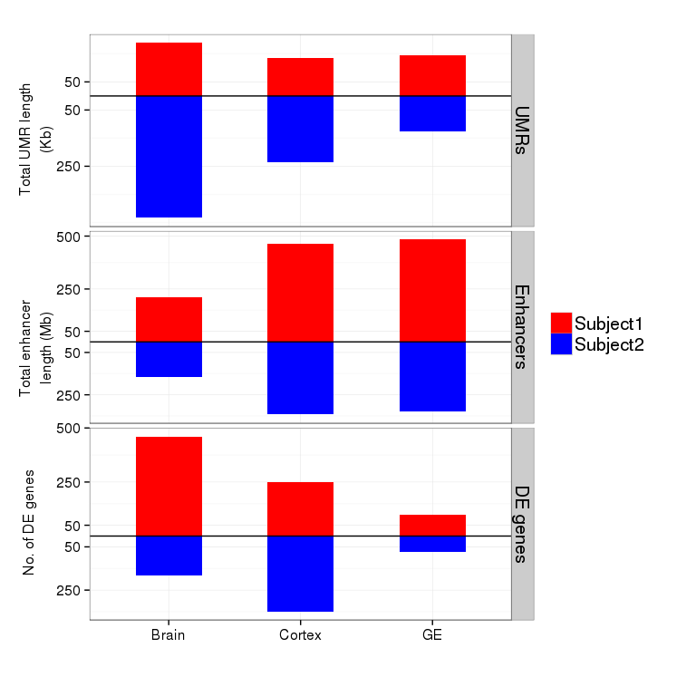
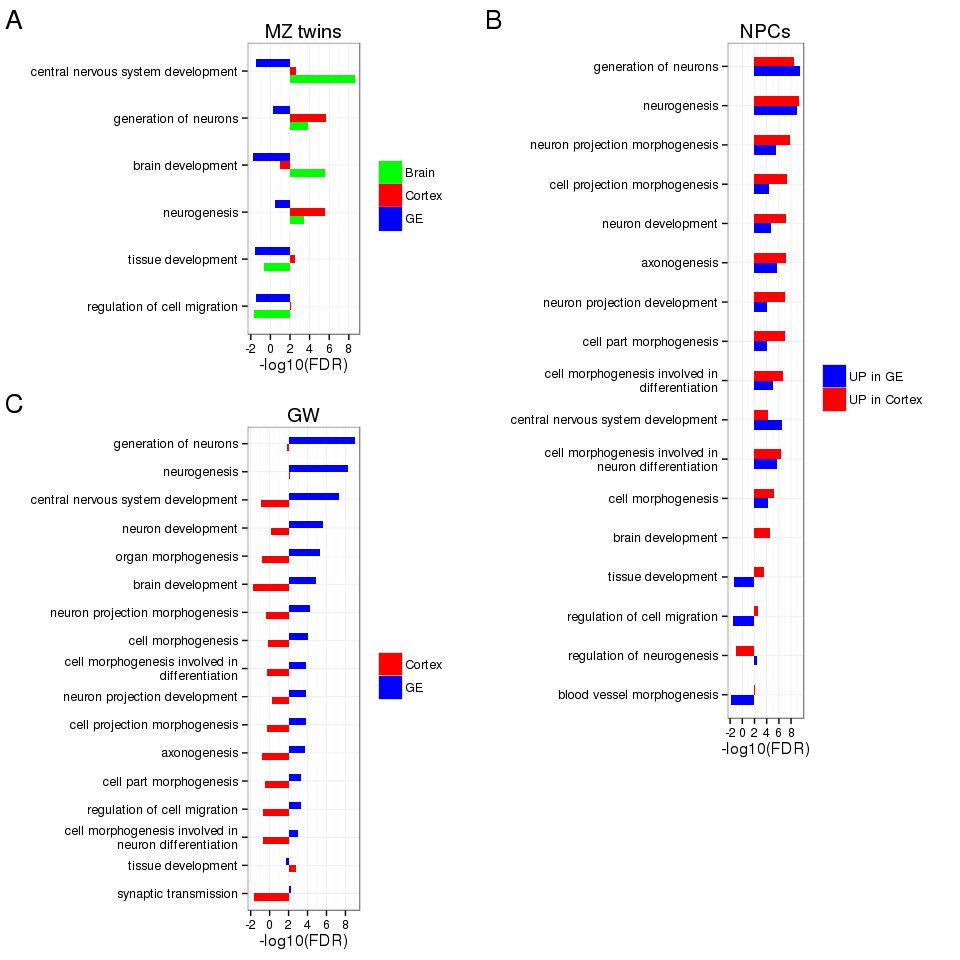
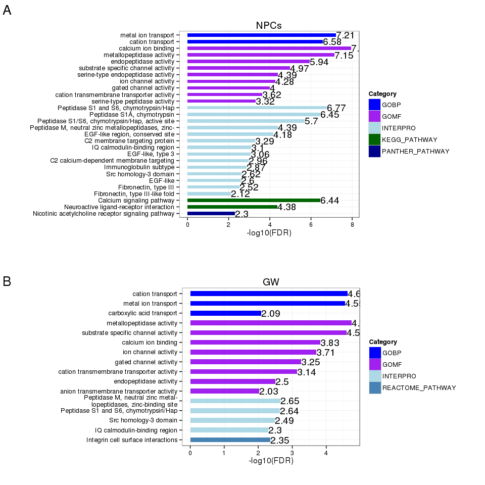
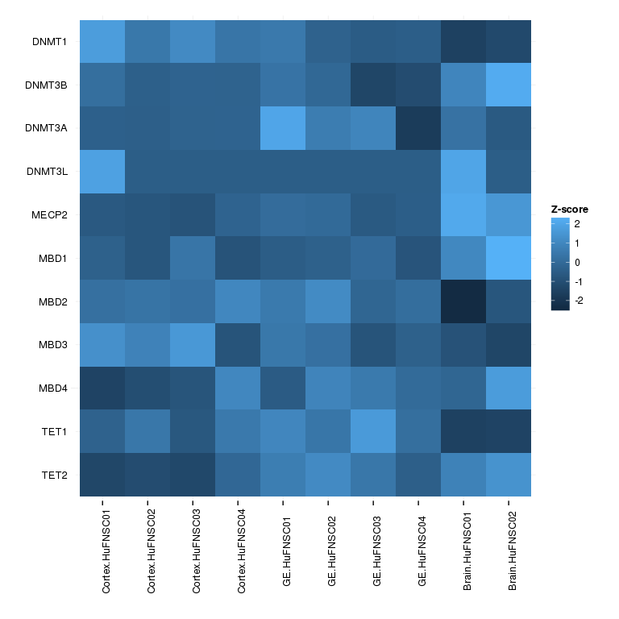

# FetalBrain - Figures
Gloria Li  
November 4, 2014  

Updated: Thu Jan 29 18:54:14 2015


## Figure 1: Overview      
### Figure 1a: Experimental design overview   

     

### Figure 1b: Comparisons setup  

* Summary of sample information and available libraries. Histone modifications includes H3K4me1, H3K4me3, H3K9me3, H3K27me3, H3K36me3, and input. * marked samples without H3K4me3. Boxes outline the setup for pairwise comparisons.    

     
    
### Figure 1c: Scale of UMRs and DE genes between MZ twins and neurospheres 

* MeDIP UMR frequency (top panel, bp/Mb), No. of differential expressed genes (middle panel), and No. of isoform genes (bottom panel) between MZ twins (left panel), and between two neurosphere cell types (right panel). HuFNSC01-specific/cortex-specific UMRs and genes up-regulated in HuFNSC01/cortex are shown in red, and HuFNSC02-specific/GE-specific UMRs and genes up-regulated in HuFNSC02/GE are shown in blue.        

 

```
## pdf 
##   2
```

### Figure 1d: Scale of UMRs and DE genes between neurospheres 

* WGBS UMR frequency (top panel, bp/Mb), No. of differential expressed genes (middle panel), and No. of isoform genes (bottom panel) between neurospheres cortex and GE in GW13 (left panel), and GW17 (right panel). cortex-specific UMRs and genes up-regulated in cortex are shown in red, and GE-specific UMRs and genes up-regulated in GE are shown in blue.        

 

```
## pdf 
##   2
```

### Figure 1e: UMRs and DE genes between GW 

* WGBS UMR frequency (top panel, bp/Mb), No. of differential expressed genes (middle panel), and No. of isoform genes (bottom panel) between GW13 and GW17 in neurospheres cortex (left panel), and GE (right panel). GW13-specific UMRs and genes up-regulated in GW13 are shown in red, and GW17-specific UMRs and genes up-regulated in GW17 are shown in blue.        

 

```
## pdf 
##   2
```

## Figure 2: Neurospheres Cortex and GE
### Figure 2a: TFBS asymmetry between neurosphere UMRs

* Relative abundance of transcription factor binding sites overlapping UMRs in neurospheres cortex and GE cells reveals regulatory asymmetry between cell types. Red represents transcription factor more enriched in cortex, and blue represents transcription factor enriched in GE.    

 

### Figure 2b: GREAT enrichment for neurospheres UMRs

* FDR for GREAT GO biological processes terms enriched (region-based binomial and hypergeometric FDR < 0.05) in neurospheres cortex UMRs (red), and GE UMRs (blue) on -log10 scale.     

 

## Figure 3: Stage-specific differential expression  
### Figure 3a: Stage-specific differential expression summary  

* No. of differential expressed genes between different gestational weeks (left panel: GW17 vs GW13, middle panel: GW17 vs GW15, right panel: GW15 vs GW13) in neurospheres cortex (red), GE (blue), and shared by two cell types (purple). Bars pointing up shows up-regulation in later stages, and bars pointing down shows up-regulation in earlier stages.    

 

### Figure 3b: Stage-specific differential expression trend - shared  

* Patterns of expression for genes differentially expressed between gestational weeks shared by neuropsheres cortex and GE. Genes are divided into eight groups: down-regulation from both GW13 to GW15 and GW15 to GW17 (orange), down-regulation from GW13 to GW15 only (brown), down-regulation from GW13 to GW15 and up-regulated from GW15 to GW17 (yellowgreen), down-regulation from GW15 to GW17 only (green), up-regulation from GW15 to GW17 only (greenblue), up-regulation from GW13 to GW15 and down-regulated from GW15 to GW17 (blue), up-regulation from GW13 to GW15 only (purple), and up-regulation from both GW13 to GW15 and GW15 to GW17 (pink). The thickness of the line represents relative No. of genes in the category, and dashed line means no genes are in the category.                

 

### Figure 3c: Stage-specific differential expression trend - cortex  

* Patterns of expression for genes differentially expressed between gestational weeks shared by neuropsheres cortex. Genes are divided into the same eight groups as in Figure 3b. The thickness of the line represents relative No. of genes in the category.    

 

### Figure 3d: Stage-specific differential expression trend - GE

* Patterns of expression for genes differentially expressed between gestational weeks shared by neuropsheres GE. Genes are divided into the same eight groups as in Figure 3b. The thickness of the line represents relative No. of genes in the category.    

 

### Figure 3e: Stage-specific differential expression heatmap  

* Heatmap for RPKM of stage-specific differential expressed genes in Figure 3c and 3d.         

 

```
## pdf 
##   2
```

## Supplemental Figures
### Supplemental 1: Asymmetry in UMRs 

* UMRs frequency (bp/MB) for each chromosome for MeDIP UMRs between MZ twins (a), WGBS UMRs between neurospheres cortex and GE (b), and WGBS UMRs between gestational weeks (c).     
  
 

```
## pdf 
##   2
```

### Supplemental 2: Genomic breakdown of UMRs

* Fold enrichment on log2 scale for overlapping with genomic regions in MeDIP UMRs between MZ twins (a), WGBS UMRs between neurospheres cortex and GE (b), and WGBS UMRs between gestational weeks (c).     

 

```
## pdf 
##   2
```

### Supplemental 3: Fraction of DE genes with proximal UMRs

* Fraction of differential expressed genes proximally (TSS +/- 1500bp) associated with MeDIP UMRs between MZ twins (a), WGBS UMRs between neurospheres cortex and GE (b), and WGBS UMRs between gestational weeks (c).     

 

```
## pdf 
##   2
```

### Supplemental 4: Venn diagram of differential expressed genes between MZ and between GW 

* Venn diagrame of No. of differential expressed genes between MZ twins in different cell types (a), and between different gestational weeks (b).     
  
 

```
## pdf 
##   2
```

### Supplemental 5: DAVID enrichment for DE genes

* DAVID GO biological processes enriched for DE genes between MZ twins (a), between neurospheres cortex and GE (b), and between gestational weeks (c).    

 

```
## pdf 
##   2
```

### Supplemental 6: Validate WGBS UMRs with MeDIP/MRE

* a. For each UMR between neurospheres identified by WGBS we calculated the normalized MeDIP-seq (methylated, top panel) and MRE-seq (unmethylated, bottom panel) signal. From this we show boxplot of methylation asymmetry between MeDIP-seq and MRE-seq signals in cortex and GE cells defined as (signal(cortex)-signal(GE))/(signal(cortex)+signal(GE)). b. UMR frequency (bp/MB) across all chromosomes for MeDIP UMRs between neurospheres cortex and GE. c. FDR for GREAT GO biological processes terms enriched (region-based binomial and hypergeometric FDR < 0.05) in MeDIP neurospheres cortex UMRs (red), and GE UMRs (blue) on -log10 scale. 

 

```
## pdf 
##   2
```

### Supplemental 7: Location of UMRs across the genome 

* Location of UMRs along each chromosome for MeDIP UMRs between MZ twins (a), WGBS UMRs between neurospheres cortex and GE (b), and WGBS UMRs between gestational weeks (c).     

 

```
## pdf 
##   2
```

### Supplemental 8: Neurosphere UMR enrichemnt at chromosome ends  

* Fraction of UMRs along normalized length of the genome in neurospheres cortex and GE UMRs (a), and gestational week UMRs (b).      

 

```
## pdf 
##   2
```

### Supplemental 9: DAVID enrichment for isoform genes   

* DAVID enriched terms (FDR < 0.01) for isoforms between neurospheres (a) and gestational weeks (b).   

 

```
## pdf 
##   2
```

##################################################################

### Supplemental 10: TFBS asymmetry in MZ and GW UMRs  

* Relative abundance of transcription factor binding sites overlapping UMRs between MZ twins (a), and gestational weeks (b).       

 

```
## pdf 
##   2
```

### Supplemental 11: DNA methylation at exon boundaries  

* Exon-intron junction mCpGs provide an inherited signature of exon expression. Average number of CpGs (black, bottom panel) and average mCpG levels (whole genome bisulfite shotgun, 20bp bins) at exon junctions +/- 200bp in cortex (solid line with round dots) and GE (dashed line with triangles). Exons are divided into four groups: 1) exons expressed in both cell types (exon RPKM > 0.1 in cortex and GE, purple); 2) cortex-specific exons (isoform exons expressed in cortex but not in GE, red); 3) GE-specific exons (isoform exons expressed in GE but not in cortex, green), and 4) exons not expressed in either cell types (all other exons, blue).           

 

```
## pdf 
##   2
```

### Supplemental 12: DNA methylation at exon boundaries with MeDIP

* Exon-intron junction mCpGs provide an inherited signature of exon expression. Normalized MeDIP signal (20bp bins) at exon junctions +/- 200bp in cortex (solid line with round dots) and GE (dashed line with triangles). Exons are divided into four groups: 1) exons expressed in both cell types (exon RPKM > 0.1 in cortex and GE, purple); 2) cortex-specific exons (isoform exons expressed in cortex but not in GE, red); 3) GE-specific exons (isoform exons expressed in GE but not in cortex, green), and 4) exons not expressed in either cell types (all other exons, blue).           

 

```
## pdf 
##   2
```

### Supplemental 13: Expression of DNA methylation reulators

* Heatmap of RPKM for DNA methylation regulators across all samples.         

 

### Supplemental 14: RNA-seq and miRNA-seq clustering

* Gene-level (a), exon-level (b), and miRNA (c) unsupervised clustering reveals breast derived cell-type relationships.        

 

```
## pdf 
##   2
```

### Supplemental 15: miRNA 

* Unique miRNA detected (>0.1 reads per million mapped) across all samples (a). Heatmap of differential expressed and highly expressed (RPM > 100) miRNAs between MZ twins (a), neurospheres cortex and GE (b), and gestational weeks (c).         

 

```
## pdf 
##   2
```

### Supplemental 16: GREAT for GW UMRs  

* GREAT GO biological processes enriched terms for UMRs between gestational weeks in cortex (a), GE (b), and shared by two cell types (c). GW13 UMRs are shown in red, and GW17 UMRs in blue.       

 

```
## pdf 
##   2
```


<!--
### Supplemental : GREAT analysis on UMRs between MZ twins - GOBP 


-->


