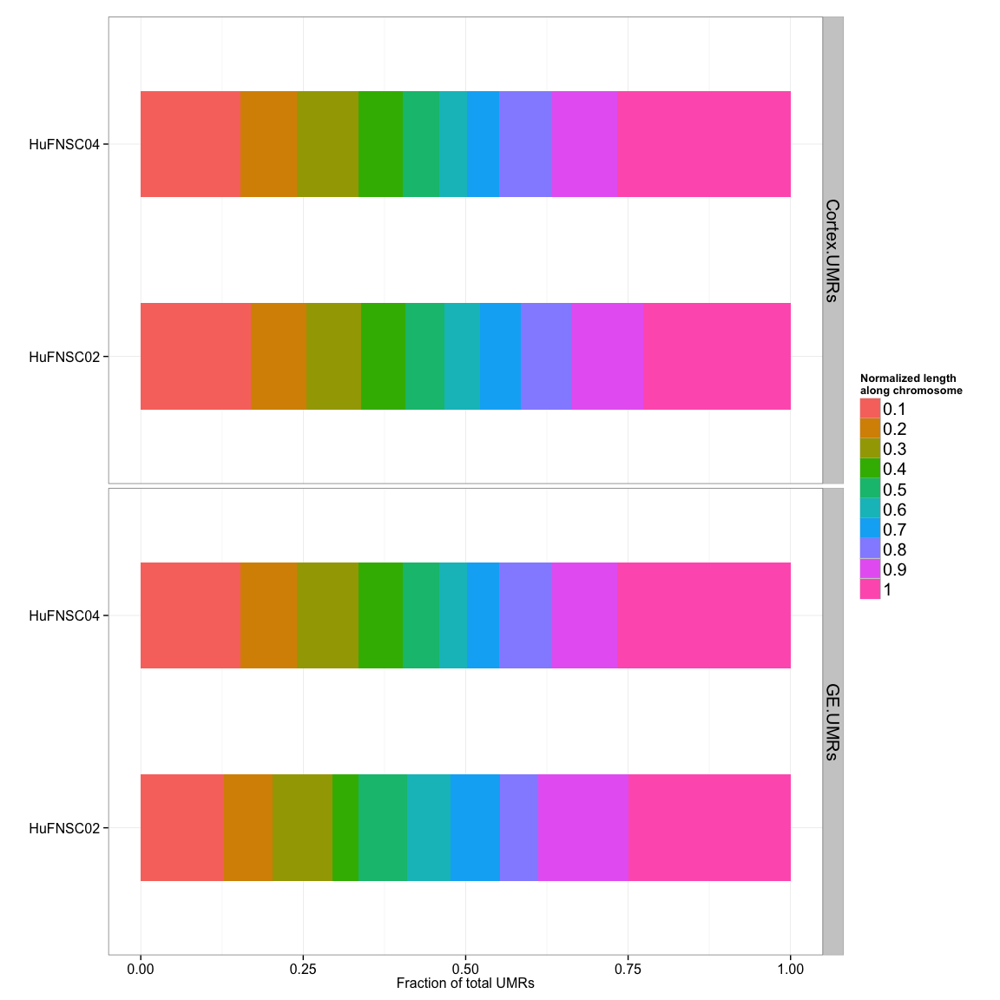

# FetalBrain - Figures
Gloria Li  
November 4, 2014  

Updated: Tue Nov  4 17:55:55 2014


## Figure 1: MZ twins 
### Figure 1a: No. of UMRs between MZ twins and neurospheres 
  * No. of UMRs (hypermethylated in red and hypomethylated in blue) between monozygotic twins and Cortex vs GE neurospheres.    
  * No. of UMRs between MZ twins are on the same scale as UMRs between neurospheres.   
  
 

### Figure 1b: Asymmetry in UMRs between MZ twins in Brain and Cortex
  * UMR frequency (base pair per million base pair) between MZ twins (HuFNSC01 UMRs in blue, and HuFNSC02 UMRs in red) in Brain, Neurospheres Cortex derived and GE derived across different chormosomes. 
  * HuFNSC02 UMRs are __2.41__-fold enriched in Brain, and __1.83__-fold enriched in Cortex compared to HuFNSC01 UMRs.    
  
 

### Figure 1c: Differential expressed genes between MZ twins are cell type specific
  * No. of differential expressed genes between MZ twins in Brain (green), Neurospheres Cortex derived (red), and GE derived (blue).  
  
 

```
## pdf 
##   2
```

## Figure 2: Neurospheres Cortex and GE
### Figure 2a: UMR/DE genes accumulates over time

 

### Figure 2b: UMR asymmetry between Neurospheres Cortex and GE
  * UMR frequency (base pair per million base pair) between neurospheres cortex derived (red), and GE derived(blue). 
  * On average, there are , __4.31__-fold enrichment in total UMR frequency in Cortex compared to GE, __4.07__ in HuFNSC02, and __5.31__ in HuFNSC04.    

 

### Figure 2c: GREAT enrichment for neurospheres UMRs

 

### Figure 2d: TFBS asymmetry between neurosphere UMRs

 

### Figure 2e: DNA methylation at exon boundaries

 

```
## pdf 
##   2
```

## Supplemental Figures
### Supplemental 1: Location of UMRs between MZ twins across the genome 

 

### Supplemental 2: Location of UMRs between neurospheres across the genome 

 

### Supplemental 3: Neurosphere UMR enrichemnt at chromosome ends

 

<!--
### Supplemental : GREAT analysis on UMRs between MZ twins - GOBP 


-->


