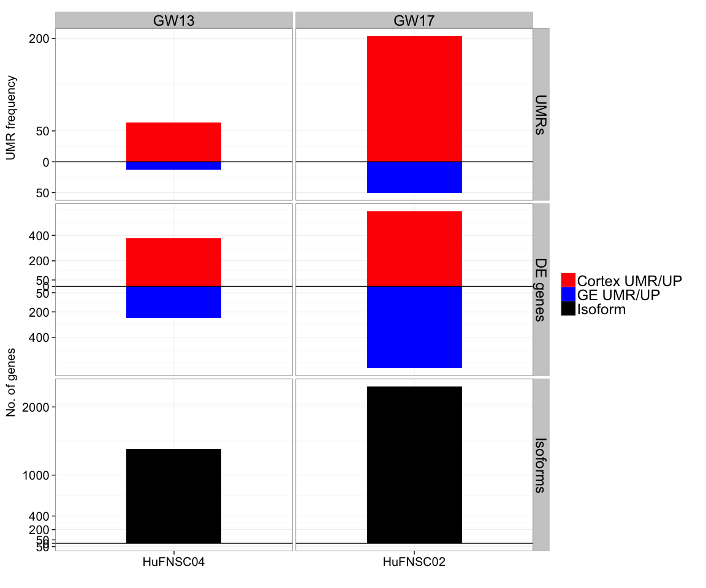
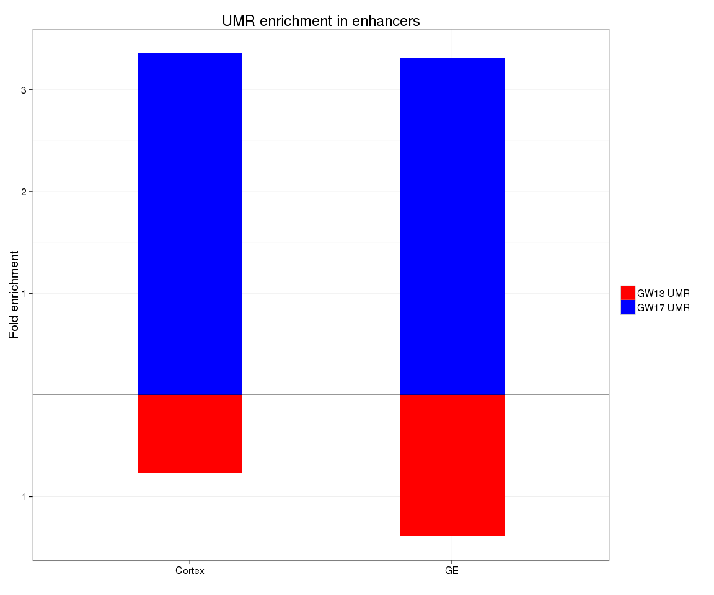
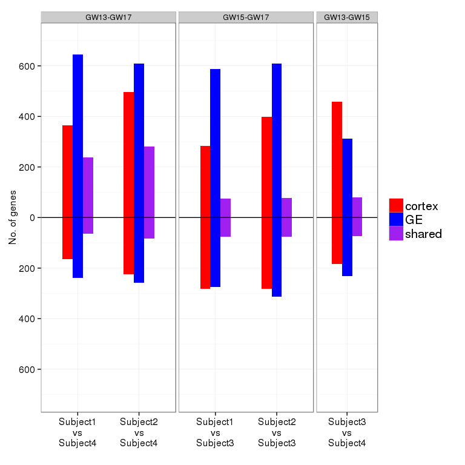
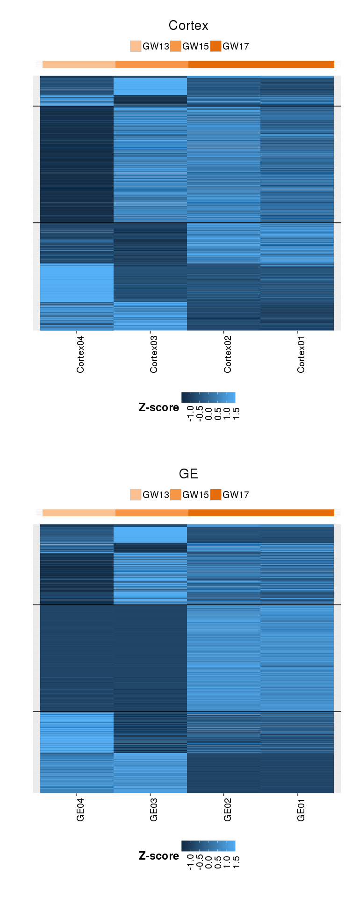
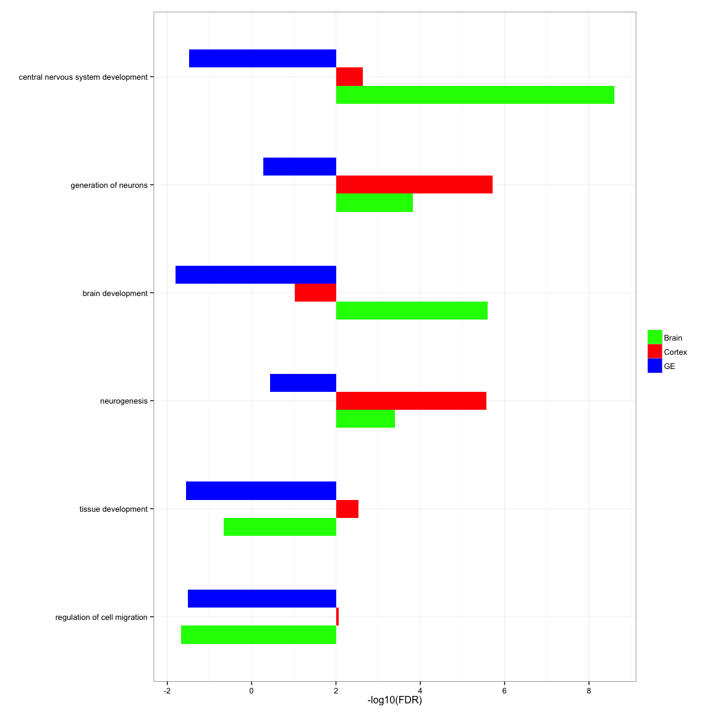
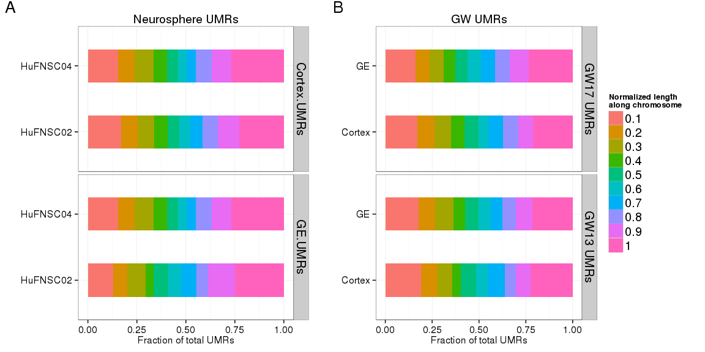
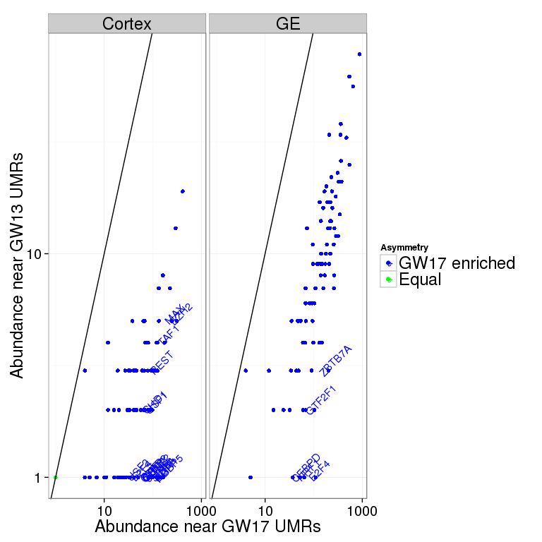

# FetalBrain - Figures
Gloria Li  
November 4, 2014  

Updated: Thu Jan  8 18:25:11 2015


## Figure 1: Summary   
### Figure 1a: Experimental design overview   

     

### Figure 1b: Comparisons setup  

     
    
### Figure 1c: UMRs and DE genes between MZ twins and neurospheres 
  * No. of UMRs (hypermethylated in red and hypomethylated in blue) between monozygotic twins and Cortex vs GE neurospheres.    
  * No. of UMRs between MZ twins are on the same scale as UMRs between neurospheres.   
  
 

```
## pdf 
##   2
```

### Figure 1d: UMRs and DE genes between neurospheres accumulates over time

 

```
## pdf 
##   2
```

### Figure 1e: UMRs and DE genes between GW 

 

```
## pdf 
##   2
```

## Figure 2: Neurospheres Cortex and GE
### Figure 2a: TFBS asymmetry between neurosphere UMRs

 

### Figure 2b: GREAT enrichment for neurospheres UMRs

 

## Figure 3: Stage-specific differential expression  
### Figure 3a: Stage-specific differential expression summary  

 

### Figure 3b: Stage-specific differential expression trend - shared

 

### Figure 3c: Stage-specific differential expression trend - cortex

 

### Figure 3d: Stage-specific differential expression trend - GE

 

### Figure 3e: Stage-specific differential expression heatmap  

 

```
## pdf 
##   2
```

## Supplemental Figures
### Supplemental 1: Asymmetry in UMRs 
  
 

```
## pdf 
##   2
```

### Supplemental 2: Genomic breakdown of UMRs

 

```
## pdf 
##   2
```

### Supplemental 3: Fraction of DE genes with proximal UMRs

 

```
## pdf 
##   2
```

### Supplemental 4: Venn diagram of differential expressed genes between MZ and between GW 
  * No. of differential expressed genes between MZ twins in Brain (green), Neurospheres Cortex derived (red), and GE derived (blue).  
  
 

```
## pdf 
##   2
```

### Supplemental 5: DAVID enrichment for MZ DE genes

 

### Supplemental 6: Validate WGBS UMRs with MeDIP/MRE

 

```
## pdf 
##   2
```

### Supplemental 7: Location of UMRs across the genome 

 

```
## pdf 
##   2
```

### Supplemental 8: Neurosphere UMR enrichemnt at chromosome ends

 

```
## pdf 
##   2
```

### Supplemental 9: DAVID enrichment for neurospheres DE genes

 

### Supplemental 10: DAVID enrichment for neurospheres isoform genes

 

##################################################################

### Supplemental 11: TFBS asymmetry in MZ UMRs

 

### Supplemental 12: DNA methylation at exon boundaries

 

```
## pdf 
##   2
```

### Supplemental 13: DNA methylation at exon boundaries with MeDIP

 

```
## pdf 
##   2
```

### Supplemental 14: Expression of DNA methylation reulators

 

### Supplemental 15: RNA-seq and miRNA-seq clustering

 

```
## pdf 
##   2
```

### Supplemental 16: miRNA 

 

```
## pdf 
##   2
```

### Supplemental 17: GREAT for GW UMRs  

 

```
## pdf 
##   2
```

### Supplemental 18: TFBS asymmetry in GW UMRs

 


<!--
### Supplemental : GREAT analysis on UMRs between MZ twins - GOBP 


-->


