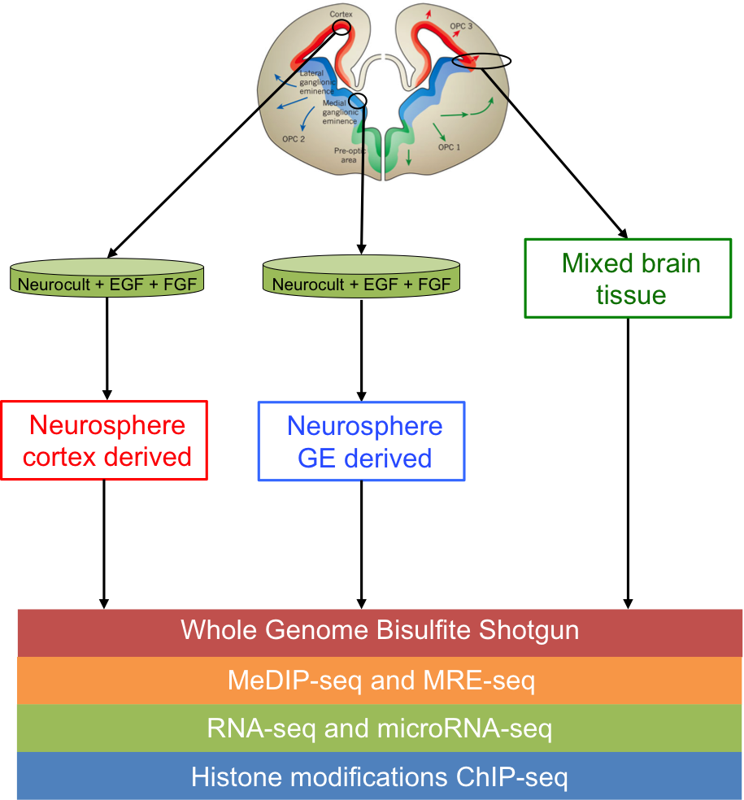
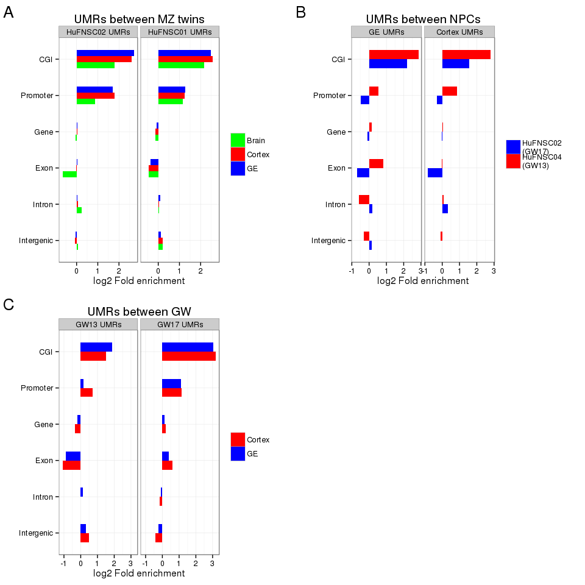
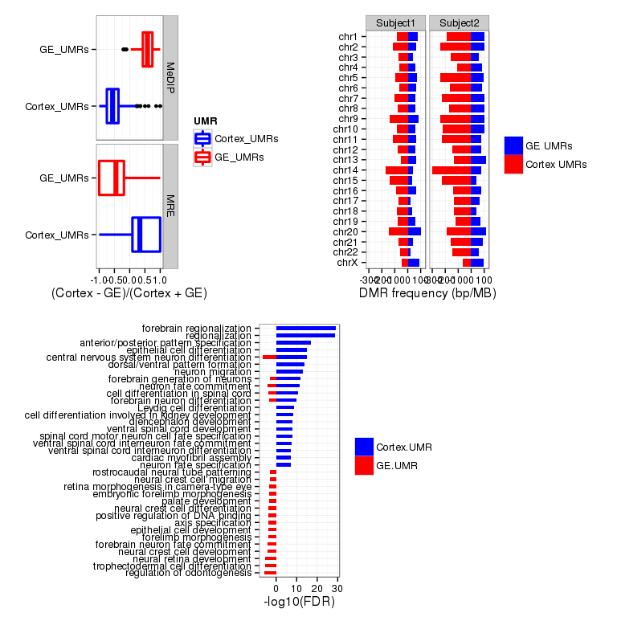
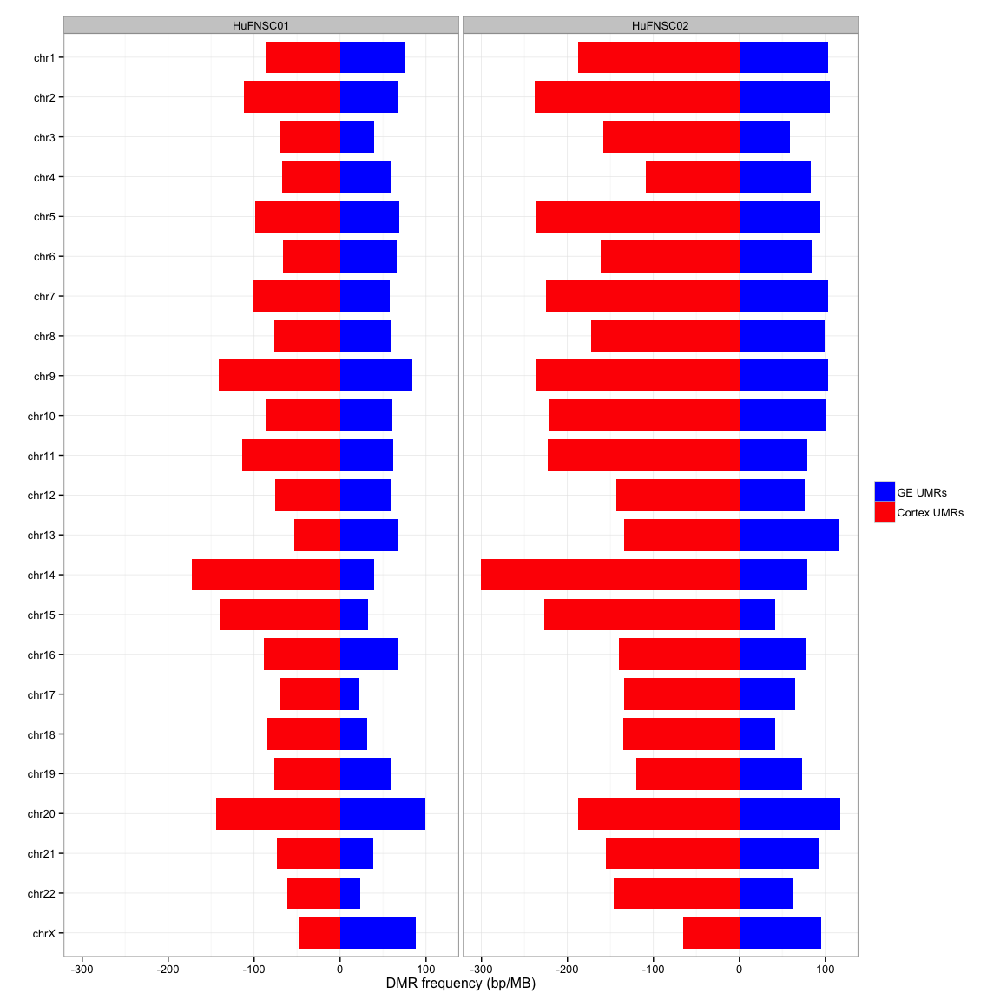
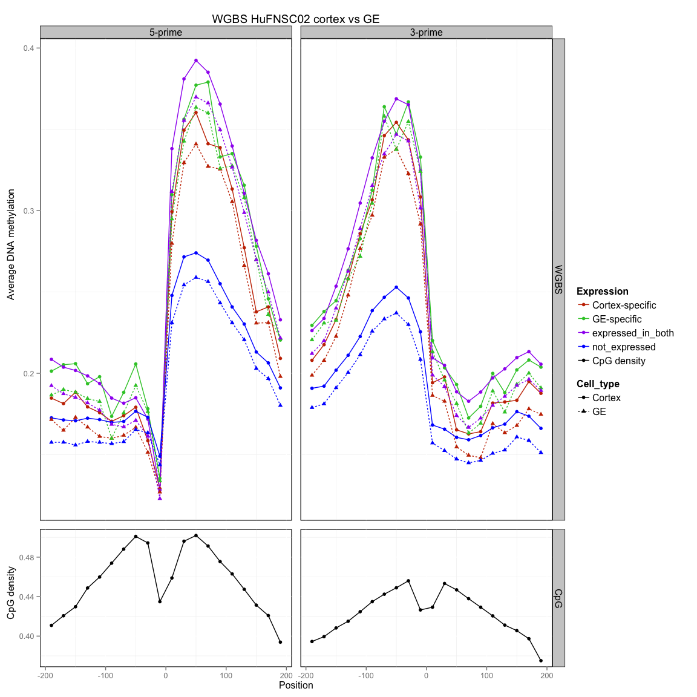
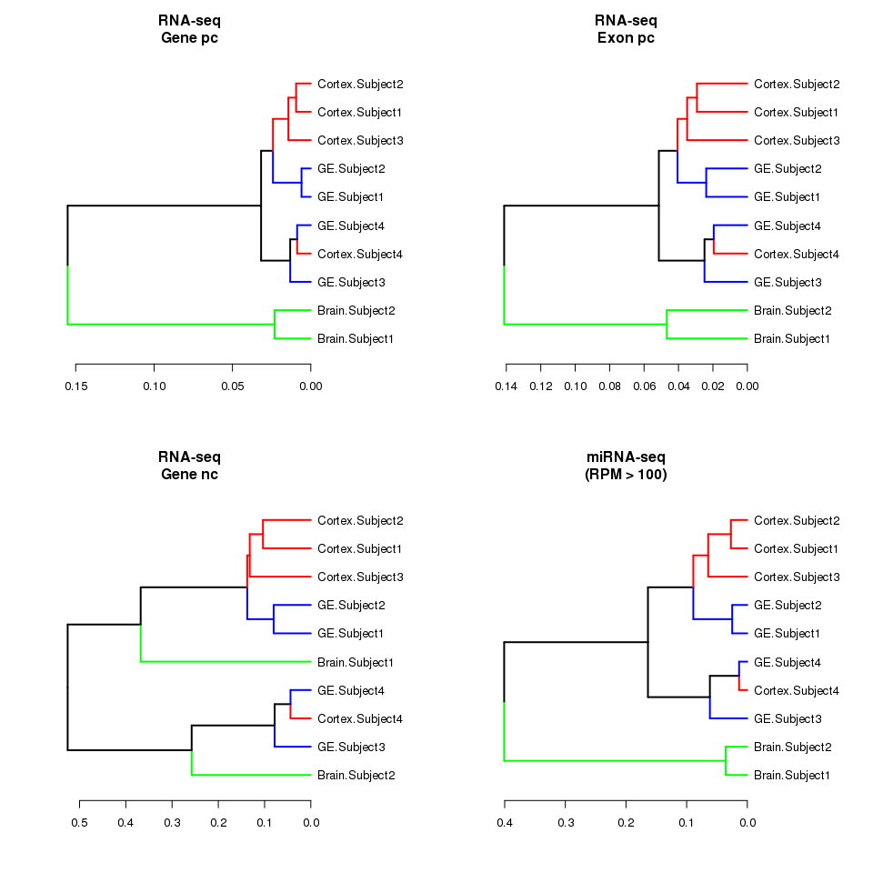

# FetalBrain - Figures
Gloria Li  
November 4, 2014  

Updated: Wed Jan  7 17:50:41 2015


## Figure 1: Summary   
### Figure 1a: Experimental design overview   

     

### Figure 1b: Comparisons setup  

     
    
### Figure 1c: No. of UMRs between MZ twins and neurospheres 
  * No. of UMRs (hypermethylated in red and hypomethylated in blue) between monozygotic twins and Cortex vs GE neurospheres.    
  * No. of UMRs between MZ twins are on the same scale as UMRs between neurospheres.   
  
 

```
## pdf 
##   2
```

### Figure 1d: UMR/DE genes accumulates over time

 

```
## pdf 
##   2
```

## Figure 2: Neurospheres Cortex and GE
### Figure 2a: TFBS asymmetry between neurosphere UMRs

 

### Figure 2b: GREAT enrichment for neurospheres UMRs

 


## Supplemental Figures
### Supplemental 1: Asymmetry in UMRs between MZ twins in Brain and Cortex
  * UMR frequency (base pair per million base pair) between MZ twins (HuFNSC01 UMRs in blue, and HuFNSC02 UMRs in red) in Brain, Neurospheres Cortex derived and GE derived across different chormosomes. 
  
 

```
## pdf 
##   2
```

### Supplemental 2: Genomic breakdown of UMRs

 

```
## pdf 
##   2
```

### Supplemental 3: Fraction of DE genes with proximal UMRs

 

```
## pdf 
##   2
```

### Supplemental 4: Differential expressed genes between MZ twins are cell type specific
  * No. of differential expressed genes between MZ twins in Brain (green), Neurospheres Cortex derived (red), and GE derived (blue).  
  
 

```
## pdf 
##   2
```

### Supplemental 5: DAVID enrichment for MZ DE genes

 

### Supplemental 6: Validate WGBS UMRs with MeDIP/MRE

 

### Supplemental 7: Location of UMRs across the genome 

 

```
## pdf 
##   2
```

### Supplemental 8: Neurosphere UMR enrichemnt at chromosome ends

 

### Supplemental 9: UMR asymmetry between Cortex and GE with MeDIP

 

### Supplemental 10: GREAT enrichment for neurospheres UMRs with MeDIP

 

### Supplemental 11: DAVID enrichment for neurospheres DE genes

 

### Supplemental 12: DAVID enrichment for neurospheres isoform genes

 

##################################################################

### Supplemental 13: TFBS asymmetry in MZ UMRs

 

### Supplemental 14: DNA methylation at exon boundaries

 

```
## pdf 
##   2
```

### Supplemental 15: DNA methylation at exon boundaries with MeDIP

 

```
## pdf 
##   2
```

### Supplemental 16: Expression of DNA methylation reulators

 

### Supplemental 17: RNA-seq and miRNA-seq clustering

 

```
## pdf 
##   2
```

### Supplemental 18: miRNA 

 

```
## pdf 
##   2
```


<!--
### Supplemental : GREAT analysis on UMRs between MZ twins - GOBP 


-->


