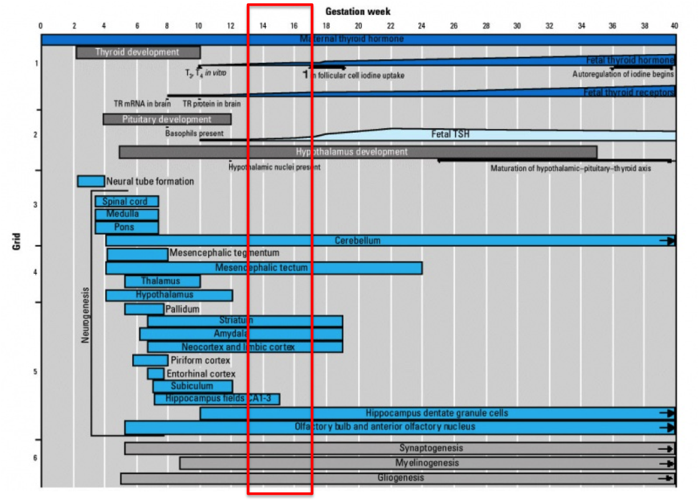
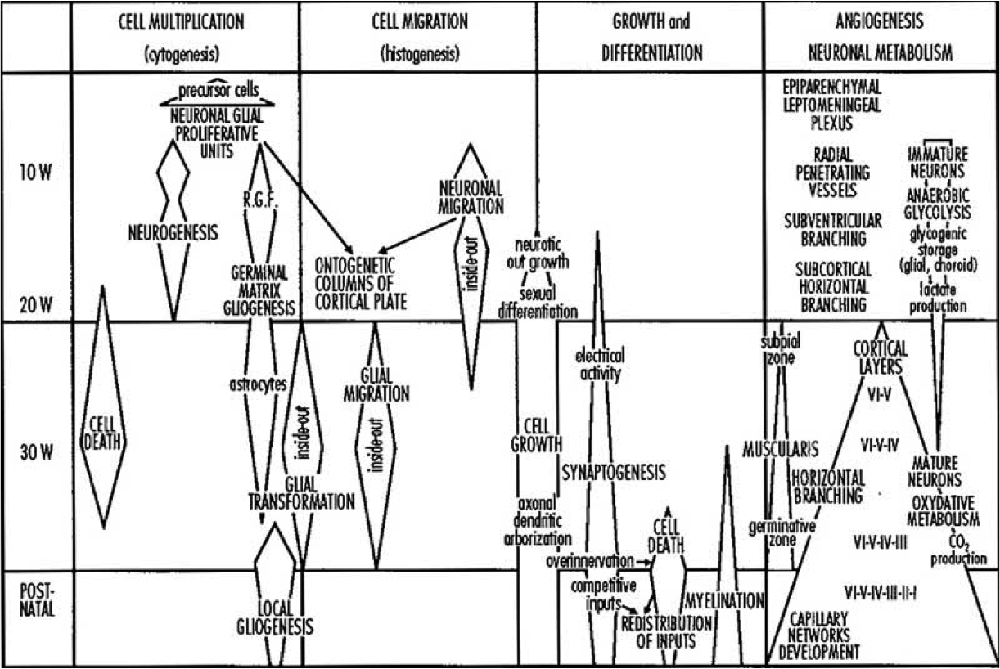

Updated: `r date()`

```{r setup, include = FALSE}
library(ggplot2)
library(dplyr)
library(ggbio)
library(GenomicRanges)
library(labeling)
library(VennDiagram)
library(gplots)
library(gridExtra)
library(xtable)
library(knitr)
load("~/快盘/FetalBrain/GW/GW.Rdata")
knitr::opts_chunk$set(message=FALSE, echo = FALSE, warning = FALSE, fig.height = 8, fig.width = 8)
```

## DMR identification with methyl_diff

  * Identify DM CpGs     
    + methyl_diff one-sided p-value $\le$ 0.005  
    + delta fractional methylation $\ge$ 0.5  
    + fractional methylation of one sample $\ge$ 0.75   
  * Collapse DM CpGs into DMRs     
    + adjacent DM CpGs have the same DM status;    
    + distance between adjacent CpGs (size) $\le$ 300bp;   
    + No. of CpGs within each DMR $\ge$ 3.   

## Background
         
          

## UMR summary and sanity check 

  * On average, there are __`r as.integer(mean(GW_DMR_summary$Hypo.DMR))`__ 17-week UMRs, __428__ intersect between Cortex and GE, and __`r as.integer(mean(GW_DMR_summary$Hyper.DMR))`__ 13-week UMRs, __76__ intersect. The intersect is highly significant.       
  * Median DMR length is __`r median(c(Cortex02_Cortex04_DMR$length, GE02_GE04_DMR$lenght))`__, _comparable to breast_. It's similar in all chromosomes in 17-week UMRs, but fluctuate more in 13-week UMRs, probably due to  small No. of UMRs identified.   
  * Median No. of CpGs per DMR is __`r median(c(Cortex02_Cortex04_DMR$CpG_count, GE02_GE04_DMR$CpG_count))`__, also _similar to breast_.            

```{r summary, results="asis"}
kable(GW_DMR_summary, format = "html", row.names = F, align = c("r", "r", "c", "c", "c"))
```

```{r summary_figure, fig.height=6, fig.width=6}
(DMR_length_GW_figure + ggtitle("DMR length between 13-week and 17-week"))
(DMR_count_GW_figure + ggtitle("No. of CpGs per DMR between 13-week and 17-week"))
```

```{r intersect, fig.height = 4}
grid.arrange(gTree(children = Venn_GW_UMR_hyper), gTree(children = Venn_GW_UMR_hypo), nrow = 1)
grid.text("13-week UMRs", x = unit(0.25, "npc"), y = unit(0.9, "npc"))
grid.text("17-week UMRs", x = unit(0.75, "npc"), y = unit(0.9, "npc"))
```

## UMR asymmetry 

  * On average, there are , __`r round(sum(DMR_freq_GW_figure$data[DMR_freq_GW_figure$data$DM == "-1", "freq"])/-sum(DMR_freq_GW_figure$data[DMR_freq_GW_figure$data$DM == "1", "freq"]), 2)`__-fold enrichment in total UMR frequency in 17-week compared to 13-week, __`r round(sum(DMR_freq_GW_figure$data[DMR_freq_GW_figure$data$cell == "Cortex" & DMR_freq_GW_figure$data$DM == "-1", "freq"])/-sum(DMR_freq_GW_figure$data[DMR_freq_GW_figure$data$cell == "Cortex" & DMR_freq_GW_figure$data$DM == "1", "freq"]), 2)`__ in Cortex, and __`r round(sum(DMR_freq_GW_figure$data[DMR_freq_GW_figure$data$cell == "GE" & DMR_freq_GW_figure$data$DM == "-1", "freq"])/-sum(DMR_freq_GW_figure$data[DMR_freq_GW_figure$data$cell == "GE" & DMR_freq_GW_figure$data$DM == "1", "freq"]), 2)`__ in GE.    

```{r asymmetry}
(DMR_freq_GW_figure + ggtitle("DMR frequency asymmetry between 13-week and 17-week") + scale_fill_manual(values = c("red", "blue"), labels = c("13-week UMRs", "17-week UMRs"), name = ""))
(DMR_pos_GW_figure + scale_color_manual(values = c("red", "blue"), labels = c("13-week UMRs", "17-week UMRs"), name = ""))
```

## GREAT enrichment for GW-associated UMRs 

  * GREAT terms are strongly associated with __neuron differentiation and brain development__.     
  * 17-week UMRs are highly enriched in __glial cell development__ in Cortex, and __neural tube development__ in GE. Intersect of these two cell types show enrichment in __cell fate commitment__ related to different types of brain cells.         
  * 13-week UMRs are enriched in __neuron fate commitment__ in Cortex, and __regionalization__ in GE. Intersect of these two cell types show no significant enrichment.          
  
```{r GREAT1, fig.height = 15}
(GREAT_GW_Cortex02.UMR + ggtitle("Cortex - 17-week UMRs"))
```
```{r GREAT2, fig.height = 4}
(GREAT_GW_Cortex04.UMR + ggtitle("Cortex - 13-week UMRs"))
```
```{r GREAT3, fig.height = 12}
(GREAT_GW_GE02.UMR + ggtitle("GE - 17-week UMRs"))
```
```{r GREAT4, fig.height = 15}
(GREAT_GW_GE04.UMR + ggtitle("GE - 13-week UMRs"))
(GREAT_GW_17week.UMR + ggtitle("17-week UMRs"))
```

## UMR Genomic breakdown

  + On average, __`r round(summarise(genomicBreak_GW[rownames(genomicBreak_GW) != "ExpectedPercent", ], mean(Gene))*genomicBreak_GW["ExpectedPercent", "Gene"]*100, 2)`%__ of CpGs in UMRs overlap with genebody, and __`r round(summarise(genomicBreak_GW[rownames(genomicBreak_GW) != "ExpectedPercent", ], mean(Promoter))*genomicBreak_GW["ExpectedPercent", "Promoter"]*100, 2)`%__ of CpGs in UMRs overlap with promoters, __`r round(summarise(filter(genomicBreak_GW_figure$data, Region == "Promoter"), mean(FC)), 2)`-fold__ enriched. __`r round(summarise(genomicBreak_GW[rownames(genomicBreak_GW) != "ExpectedPercent", ], mean(CGI))*genomicBreak_GW["ExpectedPercent", "CGI"]*100, 2)`%__ of CpGs in UMRs overlap with CGIs, __`r round(summarise(filter(genomicBreak_GW_figure$data, Region == "CGI"), mean(FC)), 2)`-fold__ than expected by random.        

<!-- For the entire genome, 3727169 out of 28217448 CpGs overlap with TSS +/- 1500bp promoter regions -->
<!-- For the entire genome, 2089538 out of 28217448 CpGs overlap with CGIs -->

```{r genomicBreak, fig.height=6, fig.width=6}
(genomicBreak_GW_figure + ggtitle("DMR breakdown between 13-week and 17-week"))
(CGI_coverage_figure)
```

## Proximal UMRs and DE genes  

  + On average, there are __`r as.integer(mean(DMR_proximal_GW_summary[, "proximal.DMRs"]))`__ UMRs proximally (TSS +/- 1.5kb) associated with protein-coding genes, __`r round(mean(DMR_proximal_GW_summary[grepl("02", rownames(DMR_proximal_GW_summary)), "proximal.DMRs"]) / mean(GW_DMR_summary[, "Hypo.DMR"]) * 100, 2)`%__ in 17-week UMRs, and __`r round(mean(DMR_proximal_GW_summary[grepl("04", rownames(DMR_proximal_GW_summary)), "proximal.DMRs"]) / mean(GW_DMR_summary[, "Hyper.DMR"]) * 100, 2)`%__ in 13-week UMRs, __much lower__ than 17-week UMRs.   
  + Among proximal UMRs, __`r round(mean(DMR_proximal_GW_summary[grepl("02", rownames(DMR_proximal_GW_summary)), "DE.DMRs"]) / mean(DMR_proximal_GW_summary[grepl("02", rownames(DMR_proximal_GW_summary)), "proximal.DMRs"]) * 100, 2)`%__ of 17-week proximal UMRs are associated with DE genes, __`r round(mean(DMR_proximal_GW_summary[grepl("04", rownames(DMR_proximal_GW_summary)), "DE.DMRs"]) / mean(DMR_proximal_GW_summary[grepl("04", rownames(DMR_proximal_GW_summary)), "proximal.DMRs"]) * 100, 2)`%__ 13-week UMRs, similar to 17-week UMRs. On average, __`r as.integer(mean(DMR_proximal_GW_summary[, "unique.DE.genes"]))`__ DE genes are associated with GW UMRs.        
  + Among proximal UMR assocaited with DE genes, __`r round(mean(DMR_proximal_GW_summary[grepl("02", rownames(DMR_proximal_GW_summary)), "same.direction"]) / mean(DMR_proximal_GW_summary[grepl("02", rownames(DMR_proximal_GW_summary)), "DE.DMRs"]) * 100, 2)`%__ 17-week UMRs change in the same direction as DE genes (hyper to DN), __much higher__ than any Fetal Brain UMRs and close to observed in breast. __`r round(mean(DMR_proximal_GW_summary[grepl("04", rownames(DMR_proximal_GW_summary)), "same.direction"]) / mean(DMR_proximal_GW_summary[grepl("04", rownames(DMR_proximal_GW_summary)), "DE.DMRs"]) * 100, 2)`%__ in 13-week UMRs, __much lower__ than 17-week UMRs.     

```{r proximal_DE, results='asis'}
kable(DMR_proximal_GW_summary, format = "html", align = c("c", "c", "c", "c", "c", "c"))
```

```{r proximal_DE_figure, fig.height=4}
grid.arrange(gTree(children = venn_DMR_proximal_GW_hyper), gTree(children = venn_DMR_proximal_GW_hypo), nrow = 1)
```

### Proximal 13-week UMRs in both Cortex and GE

```{r proximal_13, results='asis'}
kable(DMR_DE_Cortex02_Cortex04_hyper$DMR_gene[intersect(DMR_DE_Cortex02_Cortex04_hyper$DMR_gene$id, DMR_DE_GE02_GE04_hyper$DMR_gene$id), c("id", "name", "description")], format = "html", row.names = F, align = c("c", "r", "r"))
```

### Proximal GE 13-week UMRs with DE genes

```{r proximal_13_GE_DE, results='asis'}
kable(DMR_DE_GE02_GE04_hyper$DMR_gene_DE[!duplicated(DMR_DE_GE02_GE04_hyper$DMR_gene_DE$id), c("id", "name", "description", "DM", "DE")], format = "html", row.names = F, align = c("c", "r", "r", "c", "c"))
```

### Proximal 17-week UMRs with DE genes in both Cortex and GE

```{r proximal_17_DE, results='asis'}
kable(DMR_DE_GE02_GE04_hypo$DMR_gene_DE[intersect(DMR_DE_Cortex02_Cortex04_hypo$DMR_gene_DE$id, DMR_DE_GE02_GE04_hypo$DMR_gene_DE$id), c("id", "name", "description", "DM", "DE")], format = "html", row.names = F, align = c("c", "r", "r", "c", "c"))
```

## UMRs overlapping with TFBS

```{r UMR_TFBS, results='asis'}
(DMR_GW_TF_figure)
kable(DMR_GW_TF[DMR_GW_TF$Ratio_Cortex>25 & DMR_GW_TF$Ratio_GE>25, ], format = "html", row.names = F, align = c("r", "c", "c", "c", "c", "c", "c"))
```

## UMR enrichment at chromosome ends

```{r UMR_chrEnd}
(chrEnd_GW_figure)
```

## DE genes summary   
  
  + On average, there are __`r as.integer(mean(GW_DE_summary$DE))`__ genes differentially expressed between 13- and 17-week individuals, __`r as.integer(mean((GW_DE_summary %>% filter (GW == "15 vs 13"))$DE))`__ DE between GW13 and GW15 individuals, __`r as.integer(mean((GW_DE_summary %>% filter (GW == "17 vs 15"))$DE))`__ DE between GW15 and GW17, __`r as.integer(mean((GW_DE_summary %>% filter (GW == "17 vs 13"))$DE))`__ DE between GW13 and GW17.   
  + Within each cell type, majority of DE genes are shared among different comparisons (hypergeometric p-value = 0), less but still significant genes overlap between cell types. .   
  + Majority of the GW-associated DE genes are __stage-specific__.       

```{r DE, results='asis'}
GW_DE_summary <- xtable(GW_DE_summary)
align(GW_DE_summary) <- "ccccc"
print(GW_DE_summary, type = "html", include.rownames = T)

grid.arrange(gTree(children = venn_GW_17_13_UP), gTree(children = venn_GW_17_13_DN), 
             gTree(children = venn_GW_17_15_UP), gTree(children = venn_GW_17_15_DN), 
             gTree(children = venn_GW_15_13_UP), gTree(children = venn_GW_15_13_DN), nrow = 3)
grid.arrange(gTree(children = venn_GW_cortex), gTree(children = venn_GW_GE), nrow = 1)
heatmap.2(as.matrix(GW_DE_rpkm), scale = "row", trace = "none", margins = c(11, 6), keysize = 1, density.info = "none", col = bluered(256), key.title = "", key.xlab = "")
```

### Stage-specific DE gene profiles

1. GW13-15:UP, GW15-17:UP;    
    _No genes_   
2. GW13-15:UP, GW15-17:DN;    
```{r GW_UP_DN, results='asis'}
kable(GW_UP_DN %>% select(id, name, description), format = "html", row.names = F, align = "r")
```
3. GW13-15:DN, GW15-17:UP; 
```{r GW_DN_UP, results='asis'}
kable(GW_DN_UP %>% select(id, name, description), format = "html", row.names = F, align = "r")
```
4. GW13-15:DN, GW15-17:DN;   
    _No genes_   
5. GW13-15:UP, GW15-17:not DE; 
```{r GW_UP_no, results='asis'}
kable(GW_UP_no %>% select(id, name, description), format = "html", row.names = F, align = "r")
```
6. GW13-15:DN, GW15-17:not DE; 
```{r GW_DN_no, results='asis'}
kable(GW_DN_no %>% select(id, name, description), format = "html", row.names = F, align = "r")
```
7. GW13-15:not DE, GW15-17:UP; 
```{r GW_no_UP, results='asis'}
kable(GW_no_UP %>% select(id, name, description), format = "html", row.names = F, align = "r")
```
8. GW13-15:not DE, GW15-17:DN; 
```{r GW_no_DN, results='asis'}
kable(GW_no_DN %>% select(id, name, description), format = "html", row.names = F, align = "r")
```

### DAVID enrichment for DE genes  

  * GW associated DE genes shared by cell types show no enrichment due to small gene lists.    
  * GW15 vs GW 13: __calcium ion binding__ in cortex UP and GE DN, __neurogenesis__ in cortex DN.               
```{r DAVID_DE_15_13, fig.height=3}
(enrich_GW_15_13_UP_cortex)
(enrich_GW_15_13_DN_cortex)
(enrich_GW_15_13_UP_GE)
(enrich_GW_15_13_DN_GE)
```
  * GW17 vs GW 15: __neurogenesis__ in GE, no enrichment in cortex.            
```{r DAVID_DE_17_15, fig.height=5}
(enrich_GW_17_15_UP_GE)
(enrich_GW_17_15_DN_GE)
```
  * GW17 vs GW 13: __calcium ion binding__ in cortex UP and GE UP, __neurogenesis__ in GE DN.               
```{r DAVID_DE_17_13, fig.height=4}
(enrich_GW_17_13_UP_cortex)
(enrich_GW_17_13_UP_GE)
(enrich_GW_17_13_DN_GE)
```

## Isoform analysis   

  * On average, there are __`r as.integer(mean(GW_isoform_summary[, "isoform_genes"]))`__ isoform genes between 13- and 17-week individuals, majority of them are shared among different comparisons and between the two cell types (hypergeometric p-value = 0).    
  * There are __`r nrow(GW_isoform_gene_dup_cortex)`__ isoform genes in cortex supported by at least two comparisons, and __`r nrow(GW_isoform_gene_dup_GE)`__ in GE, among them, __`r nrow(GW_isoform_gene_dup)`__ isoform genes are shared between the two cell types.    
  * Isoform genes are enriched in __cell signaling__ related terms.        

```{r isoform, results='asis'}
GW_isoform_summary <- xtable(GW_isoform_summary)
align(GW_isoform_summary) <- "ccccccccc"
print(GW_isoform_summary, type = "html", include.rownames = F)

grid.arrange(gTree(children = venn_GW_isoform_cortex), gTree(children = venn_GW_isoform_GE), nrow = 1)
plot.new()
grid.draw(venn_GW_isoform)
```
```{r DAVID_isoform, fig.height=8}
(enrich_GW_isoform_gene_dup)
```


