# FetalBrain - Gestational week associated analysis
Gloria Li  
November 5, 2014  

Updated: Wed Dec  3 16:13:48 2014

## DMR identification with methyl_diff

  * Identify DM CpGs     
    + methyl_diff one-sided p-value $\le$ 0.005  
    + delta fractional methylation $\ge$ 0.5  
    + fractional methylation of one sample $\ge$ 0.75   
  * Collapse DM CpGs into DMRs     
    + adjacent DM CpGs have the same DM status;    
    + distance between adjacent CpGs (size) $\le$ 300bp;   
    + No. of CpGs within each DMR $\ge$ 3.   

## UMR summary and sanity check 

  * On average, there are __1692__ 17-week UMRs, __428__ intersect between Cortex and GE, and __450__ 13-week UMRs, __76__ intersect. The intersect is highly significant.       
  * Median DMR length is __321__, _comparable to breast_. It's similar in all chromosomes in 17-week UMRs, but fluctuate more in 13-week UMRs, probably due to  small No. of UMRs identified.   
  * Median No. of CpGs per DMR is __5__, also _similar to breast_.            

<table>
 <thead>
  <tr>
   <th style="text-align:right;"> Sample </th>
   <th style="text-align:right;"> Total.DMR </th>
   <th style="text-align:center;"> Hyper.DMR </th>
   <th style="text-align:center;"> Hypo.DMR </th>
  </tr>
 </thead>
<tbody>
  <tr>
   <td style="text-align:right;"> Cortex-HuFNSC02_Cortex-HuFNSC04 </td>
   <td style="text-align:right;"> 1283 </td>
   <td style="text-align:center;"> 179 </td>
   <td style="text-align:center;"> 1104 </td>
  </tr>
  <tr>
   <td style="text-align:right;"> GE-HuFNSC02_GE-HuFNSC04 </td>
   <td style="text-align:right;"> 3002 </td>
   <td style="text-align:center;"> 722 </td>
   <td style="text-align:center;"> 2280 </td>
  </tr>
</tbody>
</table>

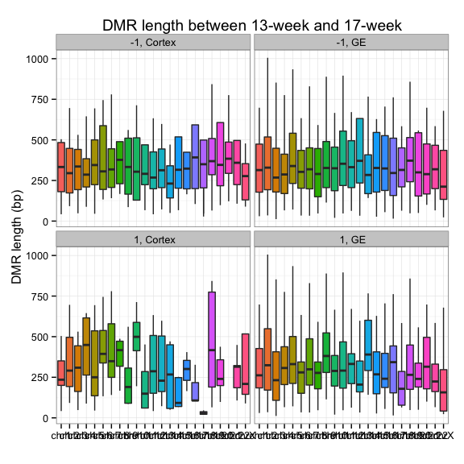  

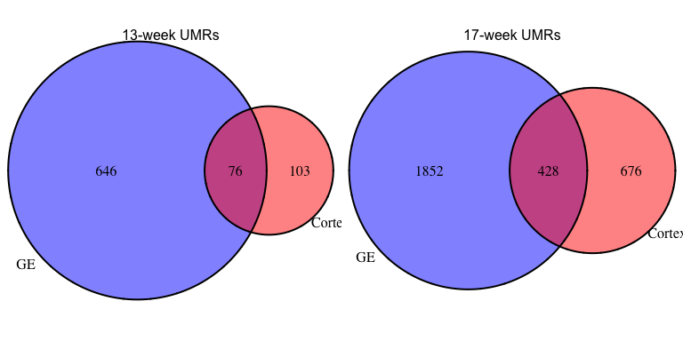 

## UMR asymmetry 

  * On average, there are , __4.8__-fold enrichment in total UMR frequency in 17-week compared to 13-week, __8.17__ in Cortex, and __3.97__ in GE.    

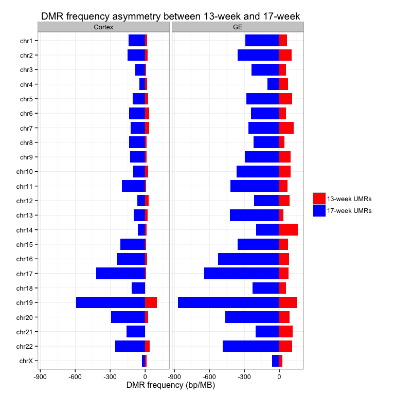 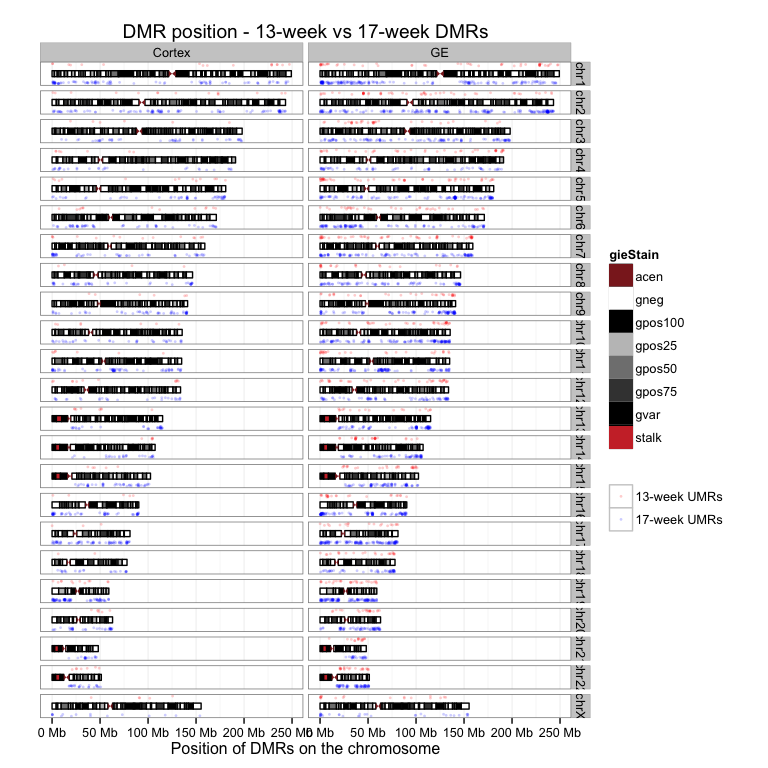 

## GREAT enrichment for GW-associated UMRs 

  * GREAT terms are strongly associated with __neuron differentiation and brain development__.     
  * 17-week UMRs are highly enriched in __glial cell development__ in Cortex, and __neural tube development__ in GE. Intersect of these two cell types show enrichment in __cell fate commitment__ related to different types of brain cells.         
  * 13-week UMRs are enriched in __neuron fate commitment__ in Cortex, and __regionalization__ in GE. Intersect of these two cell types show no significant enrichment.          
  
 
 
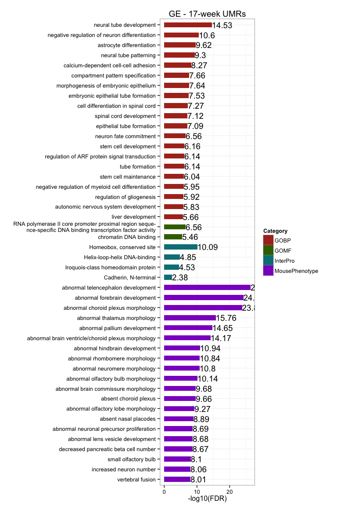 
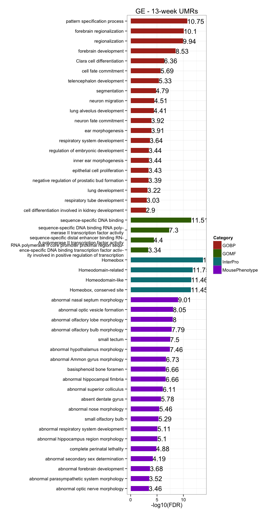 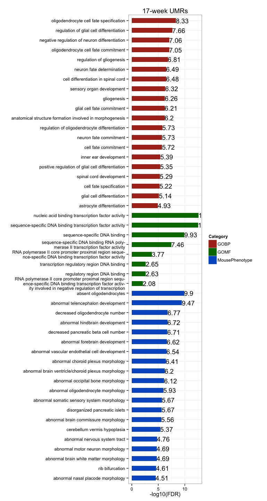 

## UMR Genomic breakdown

  + On average, __62.26%__ of CpGs in UMRs overlap with genebody, and __23.95%__ of CpGs in UMRs overlap with promoters, __1.78-fold__ enriched. __44.87%__ of CpGs in UMRs overlap with CGIs, __5.97-fold__ than expected by random.        

<!-- For the entire genome, 3727169 out of 28217448 CpGs overlap with TSS +/- 1500bp promoter regions -->
<!-- For the entire genome, 2089538 out of 28217448 CpGs overlap with CGIs -->

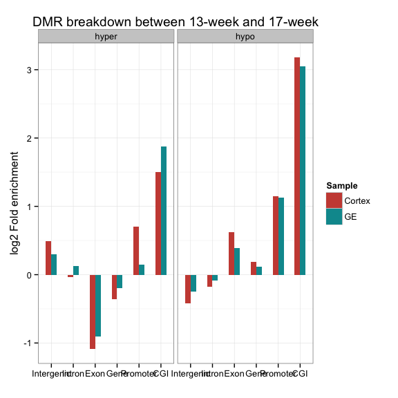 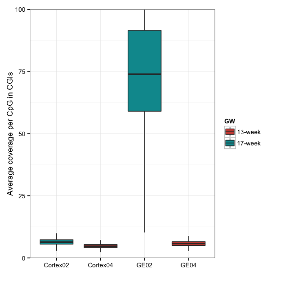 

## Proximal UMRs and DE genes  

  + On average, there are __165__ UMRs proximally (TSS +/- 1.5kb) associated with protein-coding genes, __18.23%__ in 17-week UMRs, and __4.88%__ in 13-week UMRs, __much lower__ than 17-week UMRs.   
  + Among proximal UMRs, __14.26%__ of 17-week proximal UMRs are associated with DE genes, __13.64%__ 13-week UMRs, similar to 17-week UMRs. On average, __20__ DE genes are associated with GW UMRs.        
  + Among proximal UMR assocaited with DE genes, __79.55%__ 17-week UMRs change in the same direction as DE genes (hyper to DN), __much higher__ than any Fetal Brain UMRs and close to observed in breast. __50%__ in 13-week UMRs, __much lower__ than 17-week UMRs.     

<table>
 <thead>
  <tr>
   <th style="text-align:left;">   </th>
   <th style="text-align:center;"> proximal.DMRs </th>
   <th style="text-align:center;"> unique.genes </th>
   <th style="text-align:center;"> DE.DMRs </th>
   <th style="text-align:center;"> unique.DE.genes </th>
   <th style="text-align:center;"> same.direction </th>
  </tr>
 </thead>
<tbody>
  <tr>
   <td style="text-align:left;"> Cortex04.UMRs </td>
   <td style="text-align:center;"> 7 </td>
   <td style="text-align:center;"> 7 </td>
   <td style="text-align:center;"> 0 </td>
   <td style="text-align:center;"> 0 </td>
   <td style="text-align:center;"> 0 </td>
  </tr>
  <tr>
   <td style="text-align:left;"> Cortex02.UMRs </td>
   <td style="text-align:center;"> 215 </td>
   <td style="text-align:center;"> 215 </td>
   <td style="text-align:center;"> 24 </td>
   <td style="text-align:center;"> 19 </td>
   <td style="text-align:center;"> 21 </td>
  </tr>
  <tr>
   <td style="text-align:left;"> GE04.UMRs </td>
   <td style="text-align:center;"> 37 </td>
   <td style="text-align:center;"> 36 </td>
   <td style="text-align:center;"> 6 </td>
   <td style="text-align:center;"> 5 </td>
   <td style="text-align:center;"> 3 </td>
  </tr>
  <tr>
   <td style="text-align:left;"> GE02.UMRs </td>
   <td style="text-align:center;"> 402 </td>
   <td style="text-align:center;"> 402 </td>
   <td style="text-align:center;"> 64 </td>
   <td style="text-align:center;"> 57 </td>
   <td style="text-align:center;"> 49 </td>
  </tr>
</tbody>
</table>

 

### Proximal 13-week UMRs in both Cortex and GE

<table>
 <thead>
  <tr>
   <th style="text-align:center;"> id </th>
   <th style="text-align:right;"> name </th>
   <th style="text-align:right;"> description </th>
  </tr>
 </thead>
<tbody>
  <tr>
   <td style="text-align:center;"> ENSG00000189334 </td>
   <td style="text-align:right;"> S100A14 </td>
   <td style="text-align:right;"> S100_calcium_binding_protein_A14_[Source:HGNC_Symbol;Acc:18901] </td>
  </tr>
  <tr>
   <td style="text-align:center;"> ENSG00000237693 </td>
   <td style="text-align:right;"> IRGM </td>
   <td style="text-align:right;"> immunity-related_GTPase_family,_M_[Source:HGNC_Symbol;Acc:29597] </td>
  </tr>
  <tr>
   <td style="text-align:center;"> ENSG00000124564 </td>
   <td style="text-align:right;"> SLC17A3 </td>
   <td style="text-align:right;"> solute_carrier_family_17_(sodium_phosphate),_member_3_[Source:HGNC_Symbol;Acc:10931] </td>
  </tr>
</tbody>
</table>

### Proximal GE 13-week UMRs with DE genes

<table>
 <thead>
  <tr>
   <th style="text-align:center;"> id </th>
   <th style="text-align:right;"> name </th>
   <th style="text-align:right;"> description </th>
   <th style="text-align:center;"> DM </th>
   <th style="text-align:center;"> DE </th>
  </tr>
 </thead>
<tbody>
  <tr>
   <td style="text-align:center;"> ENSG00000134954 </td>
   <td style="text-align:right;"> ETS1 </td>
   <td style="text-align:right;"> v-ets_erythroblastosis_virus_E26_oncogene_homolog_1_(avian)_[Source:HGNC_Symbol;Acc:3488] </td>
   <td style="text-align:center;"> hyper </td>
   <td style="text-align:center;"> UP </td>
  </tr>
  <tr>
   <td style="text-align:center;"> ENSG00000136352 </td>
   <td style="text-align:right;"> NKX2-1 </td>
   <td style="text-align:right;"> NK2_homeobox_1_[Source:HGNC_Symbol;Acc:11825] </td>
   <td style="text-align:center;"> hyper </td>
   <td style="text-align:center;"> UP </td>
  </tr>
  <tr>
   <td style="text-align:center;"> ENSG00000165588 </td>
   <td style="text-align:right;"> OTX2 </td>
   <td style="text-align:right;"> orthodenticle_homeobox_2_[Source:HGNC_Symbol;Acc:8522] </td>
   <td style="text-align:center;"> hyper </td>
   <td style="text-align:center;"> UP </td>
  </tr>
  <tr>
   <td style="text-align:center;"> ENSG00000231421 </td>
   <td style="text-align:right;">  </td>
   <td style="text-align:right;">  </td>
   <td style="text-align:center;"> hyper </td>
   <td style="text-align:center;"> DN </td>
  </tr>
  <tr>
   <td style="text-align:center;"> ENSG00000155760 </td>
   <td style="text-align:right;"> FZD7 </td>
   <td style="text-align:right;"> frizzled_family_receptor_7_[Source:HGNC_Symbol;Acc:4045] </td>
   <td style="text-align:center;"> hyper </td>
   <td style="text-align:center;"> DN </td>
  </tr>
</tbody>
</table>

### Proximal 17-week UMRs with DE genes in both Cortex and GE

<table>
 <thead>
  <tr>
   <th style="text-align:center;"> id </th>
   <th style="text-align:right;"> name </th>
   <th style="text-align:right;"> description </th>
   <th style="text-align:center;"> DM </th>
   <th style="text-align:center;"> DE </th>
  </tr>
 </thead>
<tbody>
  <tr>
   <td style="text-align:center;"> ENSG00000255737 </td>
   <td style="text-align:right;"> NA </td>
   <td style="text-align:right;"> HCG2014417,_isoform_CRA_aUncharacterized_proteincDNA_FLJ59598_[Source:UniProtKB/TrEMBL;Acc:B7Z718] </td>
   <td style="text-align:center;"> hypo </td>
   <td style="text-align:center;"> UP </td>
  </tr>
  <tr>
   <td style="text-align:center;"> ENSG00000167178 </td>
   <td style="text-align:right;"> ISLR2 </td>
   <td style="text-align:right;"> immunoglobulin_superfamily_containing_leucine-rich_repeat_2_[Source:HGNC_Symbol;Acc:29286] </td>
   <td style="text-align:center;"> hypo </td>
   <td style="text-align:center;"> UP </td>
  </tr>
  <tr>
   <td style="text-align:center;"> ENSG00000161999 </td>
   <td style="text-align:right;"> JMJD8 </td>
   <td style="text-align:right;"> jumonji_domain_containing_8_[Source:HGNC_Symbol;Acc:14148] </td>
   <td style="text-align:center;"> hypo </td>
   <td style="text-align:center;"> UP </td>
  </tr>
  <tr>
   <td style="text-align:center;"> ENSG00000051523 </td>
   <td style="text-align:right;"> CYBA </td>
   <td style="text-align:right;"> cytochrome_b-245,_alpha_polypeptide_[Source:HGNC_Symbol;Acc:2577] </td>
   <td style="text-align:center;"> hypo </td>
   <td style="text-align:center;"> UP </td>
  </tr>
  <tr>
   <td style="text-align:center;"> ENSG00000169515 </td>
   <td style="text-align:right;"> CCDC8 </td>
   <td style="text-align:right;"> coiled-coil_domain_containing_8_[Source:HGNC_Symbol;Acc:25367] </td>
   <td style="text-align:center;"> hypo </td>
   <td style="text-align:center;"> UP </td>
  </tr>
  <tr>
   <td style="text-align:center;"> ENSG00000205927 </td>
   <td style="text-align:right;"> OLIG2 </td>
   <td style="text-align:right;"> oligodendrocyte_lineage_transcription_factor_2_[Source:HGNC_Symbol;Acc:9398] </td>
   <td style="text-align:center;"> hypo </td>
   <td style="text-align:center;"> UP </td>
  </tr>
  <tr>
   <td style="text-align:center;"> ENSG00000189060 </td>
   <td style="text-align:right;"> H1F0 </td>
   <td style="text-align:right;"> H1_histone_family,_member_0_[Source:HGNC_Symbol;Acc:4714] </td>
   <td style="text-align:center;"> hypo </td>
   <td style="text-align:center;"> UP </td>
  </tr>
  <tr>
   <td style="text-align:center;"> ENSG00000146904 </td>
   <td style="text-align:right;"> EPHA1 </td>
   <td style="text-align:right;"> EPH_receptor_A1_[Source:HGNC_Symbol;Acc:3385] </td>
   <td style="text-align:center;"> hypo </td>
   <td style="text-align:center;"> UP </td>
  </tr>
  <tr>
   <td style="text-align:center;"> ENSG00000165072 </td>
   <td style="text-align:right;"> MAMDC2 </td>
   <td style="text-align:right;"> MAM_domain_containing_2_[Source:HGNC_Symbol;Acc:23673] </td>
   <td style="text-align:center;"> hypo </td>
   <td style="text-align:center;"> UP </td>
  </tr>
</tbody>
</table>

## UMRs overlapping with TFBS

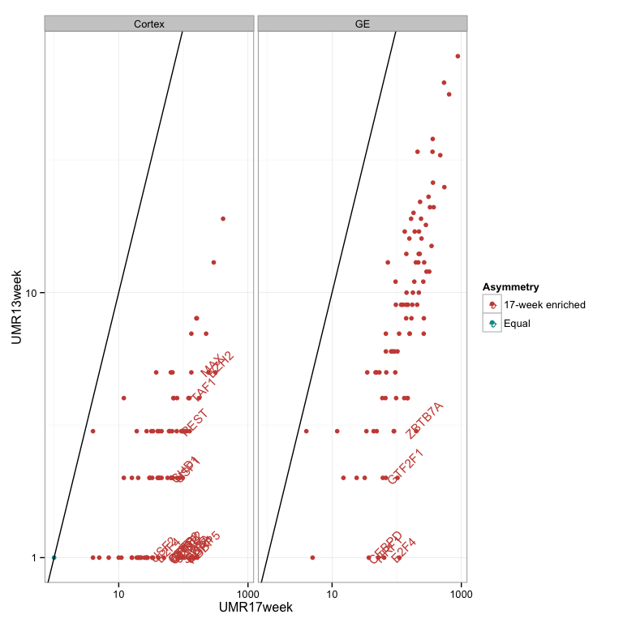 <table>
 <thead>
  <tr>
   <th style="text-align:right;"> TF </th>
   <th style="text-align:center;"> UMR17week_Cortex </th>
   <th style="text-align:center;"> UMR13week_Cortex </th>
   <th style="text-align:center;"> Ratio_Cortex </th>
   <th style="text-align:center;"> UMR17week_GE </th>
   <th style="text-align:center;"> UMR13week_GE </th>
   <th style="text-align:center;"> Ratio_GE </th>
  </tr>
 </thead>
<tbody>
  <tr>
   <td style="text-align:right;"> MAZ </td>
   <td style="text-align:center;"> 133 </td>
   <td style="text-align:center;"> 5 </td>
   <td style="text-align:center;"> 26.6000 </td>
   <td style="text-align:center;"> 319 </td>
   <td style="text-align:center;"> 12 </td>
   <td style="text-align:center;"> 26.5833 </td>
  </tr>
  <tr>
   <td style="text-align:right;"> GTF2F1 </td>
   <td style="text-align:center;"> 28 </td>
   <td style="text-align:center;"> 1 </td>
   <td style="text-align:center;"> 28.0000 </td>
   <td style="text-align:center;"> 103 </td>
   <td style="text-align:center;"> 2 </td>
   <td style="text-align:center;"> 51.5000 </td>
  </tr>
  <tr>
   <td style="text-align:right;"> ZBTB7A </td>
   <td style="text-align:center;"> 97 </td>
   <td style="text-align:center;"> 3 </td>
   <td style="text-align:center;"> 32.3333 </td>
   <td style="text-align:center;"> 201 </td>
   <td style="text-align:center;"> 3 </td>
   <td style="text-align:center;"> 67.0000 </td>
  </tr>
  <tr>
   <td style="text-align:right;"> HMGN3 </td>
   <td style="text-align:center;"> 66 </td>
   <td style="text-align:center;"> 2 </td>
   <td style="text-align:center;"> 33.0000 </td>
   <td style="text-align:center;"> 131 </td>
   <td style="text-align:center;"> 4 </td>
   <td style="text-align:center;"> 32.7500 </td>
  </tr>
  <tr>
   <td style="text-align:right;"> NRF1 </td>
   <td style="text-align:center;"> 34 </td>
   <td style="text-align:center;"> 1 </td>
   <td style="text-align:center;"> 34.0000 </td>
   <td style="text-align:center;"> 64 </td>
   <td style="text-align:center;"> 1 </td>
   <td style="text-align:center;"> 64.0000 </td>
  </tr>
  <tr>
   <td style="text-align:right;"> MXI1 </td>
   <td style="text-align:center;"> 112 </td>
   <td style="text-align:center;"> 3 </td>
   <td style="text-align:center;"> 37.3333 </td>
   <td style="text-align:center;"> 262 </td>
   <td style="text-align:center;"> 7 </td>
   <td style="text-align:center;"> 37.4286 </td>
  </tr>
  <tr>
   <td style="text-align:right;"> E2F4 </td>
   <td style="text-align:center;"> 50 </td>
   <td style="text-align:center;"> 1 </td>
   <td style="text-align:center;"> 50.0000 </td>
   <td style="text-align:center;"> 110 </td>
   <td style="text-align:center;"> 1 </td>
   <td style="text-align:center;"> 110.0000 </td>
  </tr>
  <tr>
   <td style="text-align:right;"> CCNT2 </td>
   <td style="text-align:center;"> 87 </td>
   <td style="text-align:center;"> 1 </td>
   <td style="text-align:center;"> 87.0000 </td>
   <td style="text-align:center;"> 148 </td>
   <td style="text-align:center;"> 4 </td>
   <td style="text-align:center;"> 37.0000 </td>
  </tr>
  <tr>
   <td style="text-align:right;"> E2F6 </td>
   <td style="text-align:center;"> 140 </td>
   <td style="text-align:center;"> 1 </td>
   <td style="text-align:center;"> 140.0000 </td>
   <td style="text-align:center;"> 263 </td>
   <td style="text-align:center;"> 8 </td>
   <td style="text-align:center;"> 32.8750 </td>
  </tr>
</tbody>
</table>

## UMR enrichment at chromosome ends

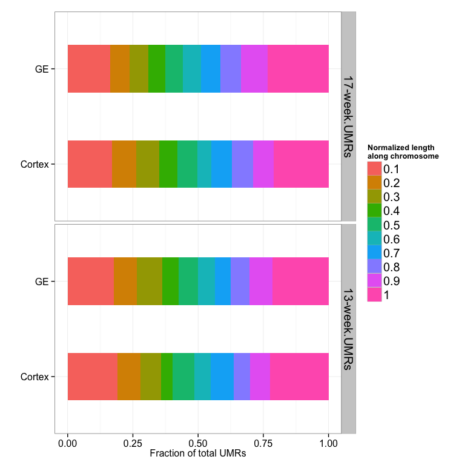 

## DE genes summary   
  
  + On average, there are __754__ genes differentially expressed between 13- and 17-week individuals, __254__ up-regulated in 13-week individuals, and __499__ up-regulated in 17-week individuals, __2__-times as many.   
  + Within each cell type, majority of DE genes are shared among different comparisons (hypergeometric p-value = 0). There are __496__ genes up-regulated in 17-week in cortex shared by at least two comparisons, __268__ up-regulated in 13-week in cortex, __718__ up-regulated in 17-week in GE, and __346__ up-regulated in 13-week in GE.   
  + The overlap between cell types is highly significant as well (hypergeometric p-value = 0), with __270__ genes up-regulated in 17-week in both cortex and GE supported by at least two comparisons, and __103__ genes up-regulated in 13-week.    

<!-- html table generated in R 3.1.1 by xtable 1.7-4 package -->
<!-- Wed Dec  3 16:14:17 2014 -->
<table border=1>
<tr> <th>  </th> <th> UP </th> <th> DN </th> <th> DE </th>  </tr>
  <tr> <td align="center"> cortex01_cortex03 </td> <td align="center"> 284 </td> <td align="center"> 281 </td> <td align="center"> 565 </td> </tr>
  <tr> <td align="center"> cortex01_cortex04 </td> <td align="center"> 365 </td> <td align="center"> 165 </td> <td align="center"> 530 </td> </tr>
  <tr> <td align="center"> cortex02_cortex03 </td> <td align="center"> 398 </td> <td align="center"> 283 </td> <td align="center"> 681 </td> </tr>
  <tr> <td align="center"> cortex02_cortex04 </td> <td align="center"> 497 </td> <td align="center"> 225 </td> <td align="center"> 722 </td> </tr>
  <tr> <td align="center"> GE01_GE03 </td> <td align="center"> 587 </td> <td align="center"> 274 </td> <td align="center"> 861 </td> </tr>
  <tr> <td align="center"> GE01_GE04 </td> <td align="center"> 645 </td> <td align="center"> 238 </td> <td align="center"> 883 </td> </tr>
  <tr> <td align="center"> GE02_GE03 </td> <td align="center"> 609 </td> <td align="center"> 312 </td> <td align="center"> 921 </td> </tr>
  <tr> <td align="center"> GE02_GE04 </td> <td align="center"> 610 </td> <td align="center"> 259 </td> <td align="center"> 869 </td> </tr>
   </table>
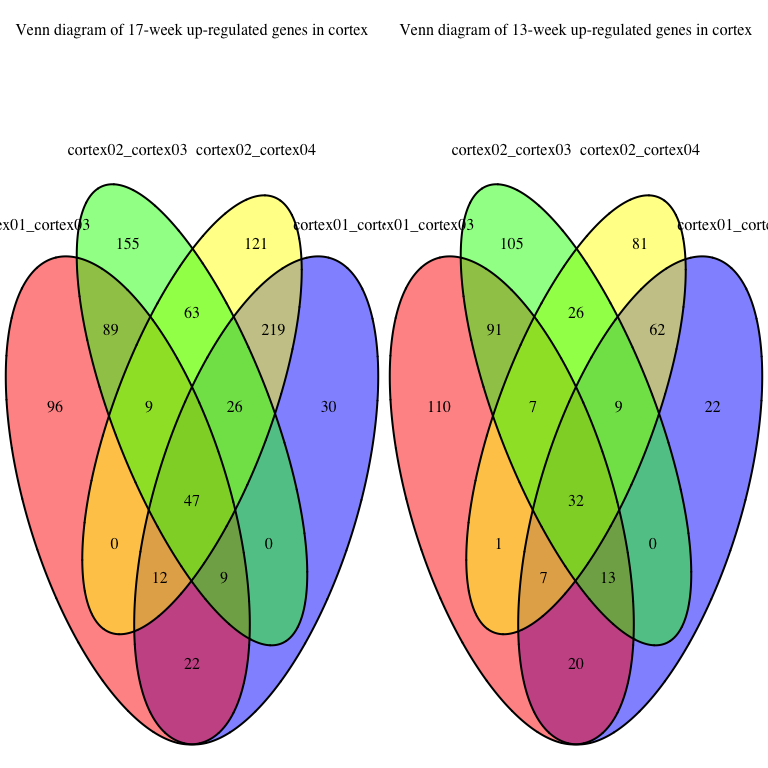 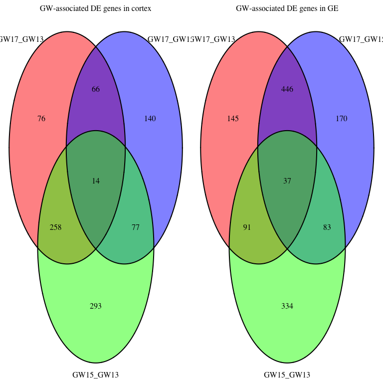 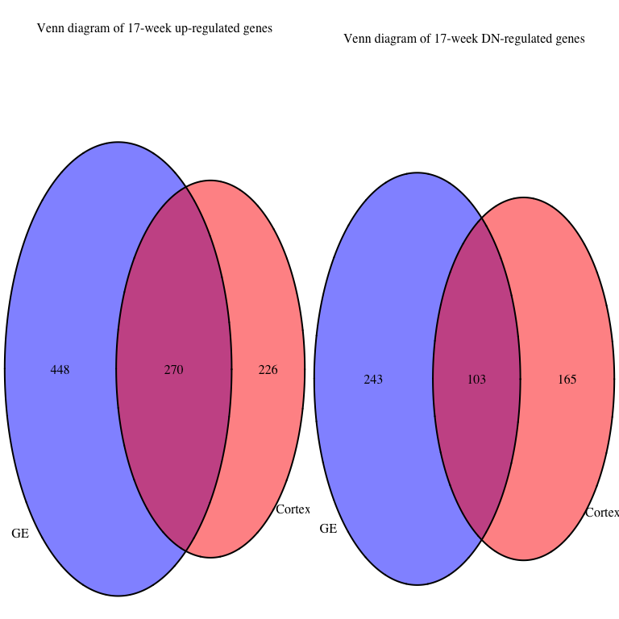 

## DAVID enrichment for DE genes  

  * Genes up-regulated in 17-week in both cortex and GE show enrichment in __tissue development__ and __calcium ion binding__, they also show more __brain development__ terms in GE.    
  * Genes up-regulated in 13-week in both cortex and GE show enrichment in __neurogenesis__.    
  * Genes shared by both cortex and GE show no significant terms, probably due to small No. of genes.    
  * In cortex:     
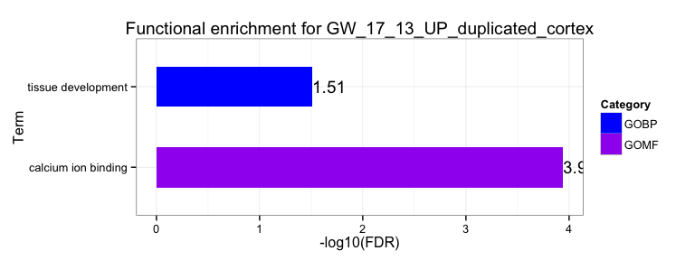 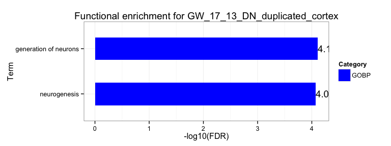 

  * In GE:    
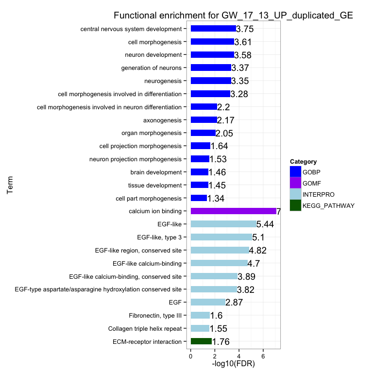 
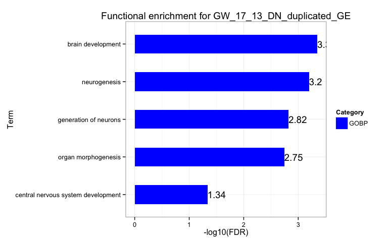 

## Isoform analysis   

  * On average, there are __2153__ isoform genes between 13- and 17-week individuals, majority of them are shared among different comparisons and between the two cell types (hypergeometric p-value = 0).    
  * There are __2878__ isoform genes in cortex supported by at least two comparisons, and __2505__ in GE, among them, __1800__ isoform genes are shared between the two cell types.    
  * Isoform genes are enriched in __cell signaling__ related terms.        

<!-- html table generated in R 3.1.1 by xtable 1.7-4 package -->
<!-- Wed Dec  3 16:14:18 2014 -->
<table border=1>
<tr> <th>  </th> <th> DE_genes </th> <th> DE_exons </th> <th> with_expressed_genes </th> <th> isoform_exons </th> <th> exclude_DE_genes </th> <th> isoform_genes </th>  </tr>
  <tr> <td align="center"> cortex01_cortex03 </td> <td align="center"> 565 </td> <td align="center"> 28637 </td> <td align="center"> 16045 </td> <td align="center"> 8044 </td> <td align="center"> 7772 </td> <td align="center"> 2490 </td> </tr>
  <tr> <td align="center"> cortex01_cortex04 </td> <td align="center"> 530 </td> <td align="center"> 27428 </td> <td align="center"> 13200 </td> <td align="center"> 6365 </td> <td align="center"> 6134 </td> <td align="center"> 2167 </td> </tr>
  <tr> <td align="center"> cortex02_cortex03 </td> <td align="center"> 681 </td> <td align="center"> 28963 </td> <td align="center"> 16765 </td> <td align="center"> 7961 </td> <td align="center"> 7630 </td> <td align="center"> 2425 </td> </tr>
  <tr> <td align="center"> cortex02_cortex04 </td> <td align="center"> 722 </td> <td align="center"> 29416 </td> <td align="center"> 13894 </td> <td align="center"> 6351 </td> <td align="center"> 6011 </td> <td align="center"> 2105 </td> </tr>
  <tr> <td align="center"> GE01_GE03 </td> <td align="center"> 861 </td> <td align="center"> 31361 </td> <td align="center"> 14725 </td> <td align="center"> 5880 </td> <td align="center"> 5458 </td> <td align="center"> 2041 </td> </tr>
  <tr> <td align="center"> GE01_GE04 </td> <td align="center"> 883 </td> <td align="center"> 34359 </td> <td align="center"> 15889 </td> <td align="center"> 6401 </td> <td align="center"> 5996 </td> <td align="center"> 2049 </td> </tr>
  <tr> <td align="center"> GE02_GE03 </td> <td align="center"> 921 </td> <td align="center"> 32827 </td> <td align="center"> 15557 </td> <td align="center"> 5773 </td> <td align="center"> 5306 </td> <td align="center"> 1965 </td> </tr>
  <tr> <td align="center"> GE02_GE04 </td> <td align="center"> 869 </td> <td align="center"> 34699 </td> <td align="center"> 16012 </td> <td align="center"> 6113 </td> <td align="center"> 5711 </td> <td align="center"> 1986 </td> </tr>
   </table>
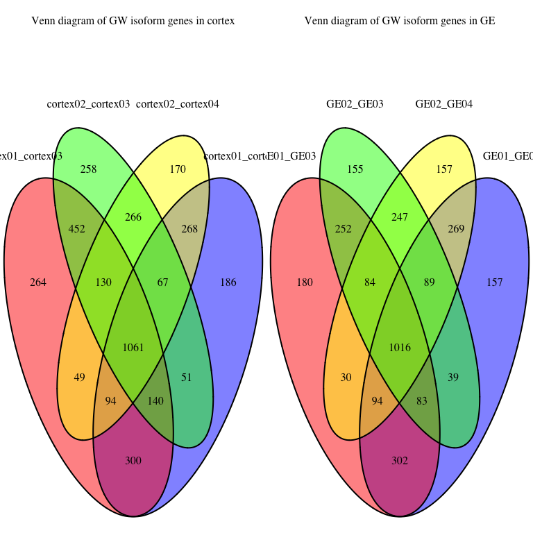 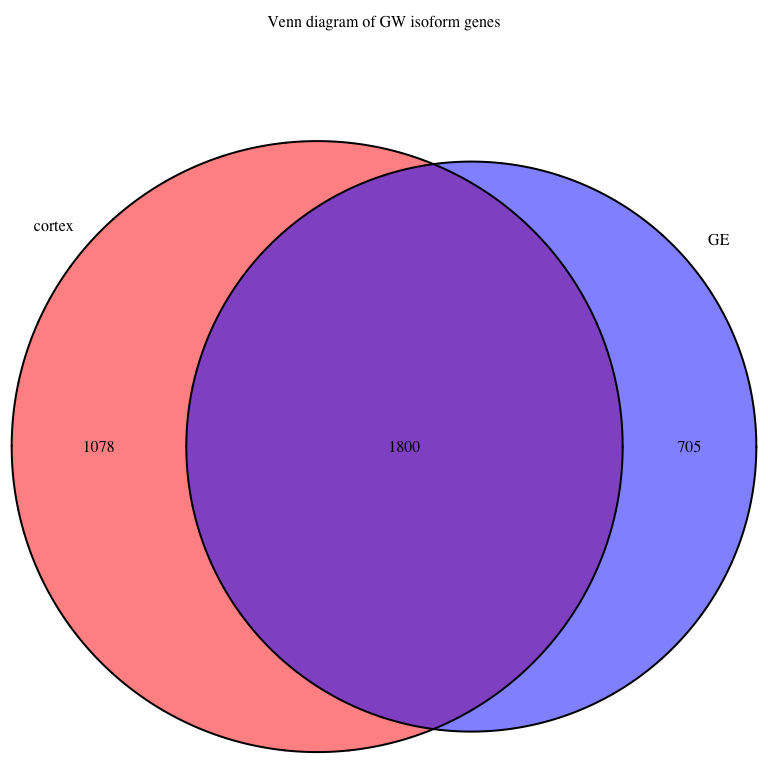 
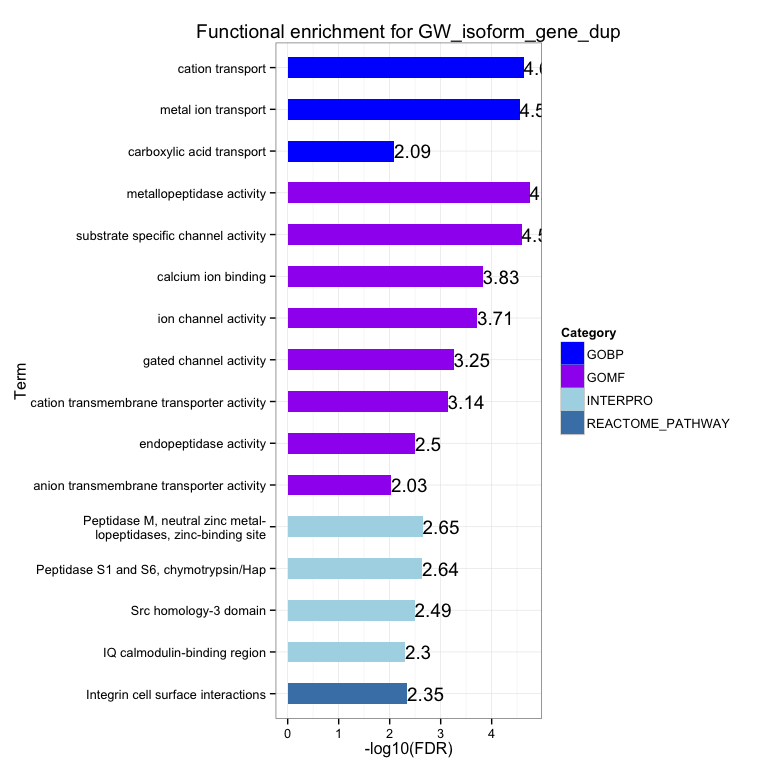 

