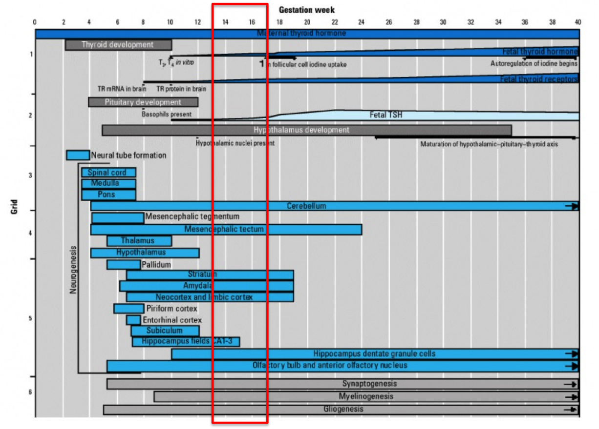
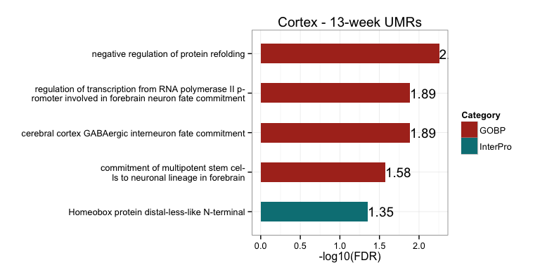

# FetalBrain - Gestational week associated analysis
Gloria Li  
November 5, 2014  

Updated: Tue Jan  6 15:53:19 2015

## DMR identification with methyl_diff

  * Identify DM CpGs     
    + methyl_diff one-sided p-value $\le$ 0.005  
    + delta fractional methylation $\ge$ 0.5  
    + fractional methylation of one sample $\ge$ 0.75   
  * Collapse DM CpGs into DMRs     
    + adjacent DM CpGs have the same DM status;    
    + distance between adjacent CpGs (size) $\le$ 300bp;   
    + No. of CpGs within each DMR $\ge$ 3.   

## Background
         
          

## UMR summary and sanity check 

  * On average, there are __1692__ 17-week UMRs, __428__ intersect between Cortex and GE, and __450__ 13-week UMRs, __76__ intersect. The intersect is highly significant.       
  * Median DMR length is __321__, _comparable to breast_. It's similar in all chromosomes in 17-week UMRs, but fluctuate more in 13-week UMRs, probably due to  small No. of UMRs identified.   
  * Median No. of CpGs per DMR is __5__, also _similar to breast_.            

<table>
 <thead>
  <tr>
   <th style="text-align:right;"> Sample </th>
   <th style="text-align:right;"> Total.DMR </th>
   <th style="text-align:center;"> Hyper.DMR </th>
   <th style="text-align:center;"> Hypo.DMR </th>
  </tr>
 </thead>
<tbody>
  <tr>
   <td style="text-align:right;"> Cortex-HuFNSC02_Cortex-HuFNSC04 </td>
   <td style="text-align:right;"> 1283 </td>
   <td style="text-align:center;"> 179 </td>
   <td style="text-align:center;"> 1104 </td>
  </tr>
  <tr>
   <td style="text-align:right;"> GE-HuFNSC02_GE-HuFNSC04 </td>
   <td style="text-align:right;"> 3002 </td>
   <td style="text-align:center;"> 722 </td>
   <td style="text-align:center;"> 2280 </td>
  </tr>
</tbody>
</table>

  

 

## UMR asymmetry 

  * On average, there are , __4.8__-fold enrichment in total UMR frequency in 17-week compared to 13-week, __8.17__ in Cortex, and __3.97__ in GE.    

  

## GREAT enrichment for GW-associated UMRs 

  * GREAT terms are strongly associated with __neuron differentiation and brain development__.     
  * 17-week UMRs are highly enriched in __glial cell development__ in Cortex, and __neural tube development__ in GE. Intersect of these two cell types show enrichment in __cell fate commitment__ related to different types of brain cells.         
  * 13-week UMRs are enriched in __neuron fate commitment__ in Cortex, and __regionalization__ in GE. Intersect of these two cell types show no significant enrichment.          
  
 
 
 
  

## UMR Genomic breakdown

  + On average, __62.26%__ of CpGs in UMRs overlap with genebody, and __23.95%__ of CpGs in UMRs overlap with promoters, __1.78-fold__ enriched. __44.87%__ of CpGs in UMRs overlap with CGIs, __5.97-fold__ than expected by random.        

<!-- For the entire genome, 3727169 out of 28217448 CpGs overlap with TSS +/- 1500bp promoter regions -->
<!-- For the entire genome, 2089538 out of 28217448 CpGs overlap with CGIs -->

  

## Proximal UMRs and DE genes  

  + On average, there are __165__ UMRs proximally (TSS +/- 1.5kb) associated with protein-coding genes, __18.23%__ in 17-week UMRs, and __4.88%__ in 13-week UMRs, __much lower__ than 17-week UMRs.   
  + Among proximal UMRs, __14.26%__ of 17-week proximal UMRs are associated with DE genes, __13.64%__ 13-week UMRs, similar to 17-week UMRs. On average, __20__ DE genes are associated with GW UMRs.        
  + Among proximal UMR assocaited with DE genes, __79.55%__ 17-week UMRs change in the same direction as DE genes (hyper to DN), __much higher__ than any Fetal Brain UMRs and close to observed in breast. __50%__ in 13-week UMRs, __much lower__ than 17-week UMRs.     

<table>
 <thead>
  <tr>
   <th style="text-align:left;">   </th>
   <th style="text-align:center;"> proximal.DMRs </th>
   <th style="text-align:center;"> unique.genes </th>
   <th style="text-align:center;"> DE.DMRs </th>
   <th style="text-align:center;"> unique.DE.genes </th>
   <th style="text-align:center;"> same.direction </th>
  </tr>
 </thead>
<tbody>
  <tr>
   <td style="text-align:left;"> Cortex04.UMRs </td>
   <td style="text-align:center;"> 7 </td>
   <td style="text-align:center;"> 7 </td>
   <td style="text-align:center;"> 0 </td>
   <td style="text-align:center;"> 0 </td>
   <td style="text-align:center;"> 0 </td>
  </tr>
  <tr>
   <td style="text-align:left;"> Cortex02.UMRs </td>
   <td style="text-align:center;"> 215 </td>
   <td style="text-align:center;"> 215 </td>
   <td style="text-align:center;"> 24 </td>
   <td style="text-align:center;"> 19 </td>
   <td style="text-align:center;"> 21 </td>
  </tr>
  <tr>
   <td style="text-align:left;"> GE04.UMRs </td>
   <td style="text-align:center;"> 37 </td>
   <td style="text-align:center;"> 36 </td>
   <td style="text-align:center;"> 6 </td>
   <td style="text-align:center;"> 5 </td>
   <td style="text-align:center;"> 3 </td>
  </tr>
  <tr>
   <td style="text-align:left;"> GE02.UMRs </td>
   <td style="text-align:center;"> 402 </td>
   <td style="text-align:center;"> 402 </td>
   <td style="text-align:center;"> 64 </td>
   <td style="text-align:center;"> 57 </td>
   <td style="text-align:center;"> 49 </td>
  </tr>
</tbody>
</table>

 

### Proximal 13-week UMRs in both Cortex and GE

<table>
 <thead>
  <tr>
   <th style="text-align:center;"> id </th>
   <th style="text-align:right;"> name </th>
   <th style="text-align:right;"> description </th>
  </tr>
 </thead>
<tbody>
  <tr>
   <td style="text-align:center;"> ENSG00000189334 </td>
   <td style="text-align:right;"> S100A14 </td>
   <td style="text-align:right;"> S100_calcium_binding_protein_A14_[Source:HGNC_Symbol;Acc:18901] </td>
  </tr>
  <tr>
   <td style="text-align:center;"> ENSG00000237693 </td>
   <td style="text-align:right;"> IRGM </td>
   <td style="text-align:right;"> immunity-related_GTPase_family,_M_[Source:HGNC_Symbol;Acc:29597] </td>
  </tr>
  <tr>
   <td style="text-align:center;"> ENSG00000124564 </td>
   <td style="text-align:right;"> SLC17A3 </td>
   <td style="text-align:right;"> solute_carrier_family_17_(sodium_phosphate),_member_3_[Source:HGNC_Symbol;Acc:10931] </td>
  </tr>
</tbody>
</table>

### Proximal GE 13-week UMRs with DE genes

<table>
 <thead>
  <tr>
   <th style="text-align:center;"> id </th>
   <th style="text-align:right;"> name </th>
   <th style="text-align:right;"> description </th>
   <th style="text-align:center;"> DM </th>
   <th style="text-align:center;"> DE </th>
  </tr>
 </thead>
<tbody>
  <tr>
   <td style="text-align:center;"> ENSG00000134954 </td>
   <td style="text-align:right;"> ETS1 </td>
   <td style="text-align:right;"> v-ets_erythroblastosis_virus_E26_oncogene_homolog_1_(avian)_[Source:HGNC_Symbol;Acc:3488] </td>
   <td style="text-align:center;"> hyper </td>
   <td style="text-align:center;"> UP </td>
  </tr>
  <tr>
   <td style="text-align:center;"> ENSG00000136352 </td>
   <td style="text-align:right;"> NKX2-1 </td>
   <td style="text-align:right;"> NK2_homeobox_1_[Source:HGNC_Symbol;Acc:11825] </td>
   <td style="text-align:center;"> hyper </td>
   <td style="text-align:center;"> UP </td>
  </tr>
  <tr>
   <td style="text-align:center;"> ENSG00000165588 </td>
   <td style="text-align:right;"> OTX2 </td>
   <td style="text-align:right;"> orthodenticle_homeobox_2_[Source:HGNC_Symbol;Acc:8522] </td>
   <td style="text-align:center;"> hyper </td>
   <td style="text-align:center;"> UP </td>
  </tr>
  <tr>
   <td style="text-align:center;"> ENSG00000231421 </td>
   <td style="text-align:right;">  </td>
   <td style="text-align:right;">  </td>
   <td style="text-align:center;"> hyper </td>
   <td style="text-align:center;"> DN </td>
  </tr>
  <tr>
   <td style="text-align:center;"> ENSG00000155760 </td>
   <td style="text-align:right;"> FZD7 </td>
   <td style="text-align:right;"> frizzled_family_receptor_7_[Source:HGNC_Symbol;Acc:4045] </td>
   <td style="text-align:center;"> hyper </td>
   <td style="text-align:center;"> DN </td>
  </tr>
</tbody>
</table>

### Proximal 17-week UMRs with DE genes in both Cortex and GE

<table>
 <thead>
  <tr>
   <th style="text-align:center;"> id </th>
   <th style="text-align:right;"> name </th>
   <th style="text-align:right;"> description </th>
   <th style="text-align:center;"> DM </th>
   <th style="text-align:center;"> DE </th>
  </tr>
 </thead>
<tbody>
  <tr>
   <td style="text-align:center;"> ENSG00000255737 </td>
   <td style="text-align:right;"> NA </td>
   <td style="text-align:right;"> HCG2014417,_isoform_CRA_aUncharacterized_proteincDNA_FLJ59598_[Source:UniProtKB/TrEMBL;Acc:B7Z718] </td>
   <td style="text-align:center;"> hypo </td>
   <td style="text-align:center;"> UP </td>
  </tr>
  <tr>
   <td style="text-align:center;"> ENSG00000167178 </td>
   <td style="text-align:right;"> ISLR2 </td>
   <td style="text-align:right;"> immunoglobulin_superfamily_containing_leucine-rich_repeat_2_[Source:HGNC_Symbol;Acc:29286] </td>
   <td style="text-align:center;"> hypo </td>
   <td style="text-align:center;"> UP </td>
  </tr>
  <tr>
   <td style="text-align:center;"> ENSG00000161999 </td>
   <td style="text-align:right;"> JMJD8 </td>
   <td style="text-align:right;"> jumonji_domain_containing_8_[Source:HGNC_Symbol;Acc:14148] </td>
   <td style="text-align:center;"> hypo </td>
   <td style="text-align:center;"> UP </td>
  </tr>
  <tr>
   <td style="text-align:center;"> ENSG00000051523 </td>
   <td style="text-align:right;"> CYBA </td>
   <td style="text-align:right;"> cytochrome_b-245,_alpha_polypeptide_[Source:HGNC_Symbol;Acc:2577] </td>
   <td style="text-align:center;"> hypo </td>
   <td style="text-align:center;"> UP </td>
  </tr>
  <tr>
   <td style="text-align:center;"> ENSG00000169515 </td>
   <td style="text-align:right;"> CCDC8 </td>
   <td style="text-align:right;"> coiled-coil_domain_containing_8_[Source:HGNC_Symbol;Acc:25367] </td>
   <td style="text-align:center;"> hypo </td>
   <td style="text-align:center;"> UP </td>
  </tr>
  <tr>
   <td style="text-align:center;"> ENSG00000205927 </td>
   <td style="text-align:right;"> OLIG2 </td>
   <td style="text-align:right;"> oligodendrocyte_lineage_transcription_factor_2_[Source:HGNC_Symbol;Acc:9398] </td>
   <td style="text-align:center;"> hypo </td>
   <td style="text-align:center;"> UP </td>
  </tr>
  <tr>
   <td style="text-align:center;"> ENSG00000189060 </td>
   <td style="text-align:right;"> H1F0 </td>
   <td style="text-align:right;"> H1_histone_family,_member_0_[Source:HGNC_Symbol;Acc:4714] </td>
   <td style="text-align:center;"> hypo </td>
   <td style="text-align:center;"> UP </td>
  </tr>
  <tr>
   <td style="text-align:center;"> ENSG00000146904 </td>
   <td style="text-align:right;"> EPHA1 </td>
   <td style="text-align:right;"> EPH_receptor_A1_[Source:HGNC_Symbol;Acc:3385] </td>
   <td style="text-align:center;"> hypo </td>
   <td style="text-align:center;"> UP </td>
  </tr>
  <tr>
   <td style="text-align:center;"> ENSG00000165072 </td>
   <td style="text-align:right;"> MAMDC2 </td>
   <td style="text-align:right;"> MAM_domain_containing_2_[Source:HGNC_Symbol;Acc:23673] </td>
   <td style="text-align:center;"> hypo </td>
   <td style="text-align:center;"> UP </td>
  </tr>
</tbody>
</table>

## UMRs overlapping with TFBS

 <table>
 <thead>
  <tr>
   <th style="text-align:right;"> TF </th>
   <th style="text-align:center;"> UMR17week_Cortex </th>
   <th style="text-align:center;"> UMR13week_Cortex </th>
   <th style="text-align:center;"> Ratio_Cortex </th>
   <th style="text-align:center;"> UMR17week_GE </th>
   <th style="text-align:center;"> UMR13week_GE </th>
   <th style="text-align:center;"> Ratio_GE </th>
  </tr>
 </thead>
<tbody>
  <tr>
   <td style="text-align:right;"> MAZ </td>
   <td style="text-align:center;"> 133 </td>
   <td style="text-align:center;"> 5 </td>
   <td style="text-align:center;"> 26.6000 </td>
   <td style="text-align:center;"> 319 </td>
   <td style="text-align:center;"> 12 </td>
   <td style="text-align:center;"> 26.5833 </td>
  </tr>
  <tr>
   <td style="text-align:right;"> GTF2F1 </td>
   <td style="text-align:center;"> 28 </td>
   <td style="text-align:center;"> 1 </td>
   <td style="text-align:center;"> 28.0000 </td>
   <td style="text-align:center;"> 103 </td>
   <td style="text-align:center;"> 2 </td>
   <td style="text-align:center;"> 51.5000 </td>
  </tr>
  <tr>
   <td style="text-align:right;"> ZBTB7A </td>
   <td style="text-align:center;"> 97 </td>
   <td style="text-align:center;"> 3 </td>
   <td style="text-align:center;"> 32.3333 </td>
   <td style="text-align:center;"> 201 </td>
   <td style="text-align:center;"> 3 </td>
   <td style="text-align:center;"> 67.0000 </td>
  </tr>
  <tr>
   <td style="text-align:right;"> HMGN3 </td>
   <td style="text-align:center;"> 66 </td>
   <td style="text-align:center;"> 2 </td>
   <td style="text-align:center;"> 33.0000 </td>
   <td style="text-align:center;"> 131 </td>
   <td style="text-align:center;"> 4 </td>
   <td style="text-align:center;"> 32.7500 </td>
  </tr>
  <tr>
   <td style="text-align:right;"> NRF1 </td>
   <td style="text-align:center;"> 34 </td>
   <td style="text-align:center;"> 1 </td>
   <td style="text-align:center;"> 34.0000 </td>
   <td style="text-align:center;"> 64 </td>
   <td style="text-align:center;"> 1 </td>
   <td style="text-align:center;"> 64.0000 </td>
  </tr>
  <tr>
   <td style="text-align:right;"> MXI1 </td>
   <td style="text-align:center;"> 112 </td>
   <td style="text-align:center;"> 3 </td>
   <td style="text-align:center;"> 37.3333 </td>
   <td style="text-align:center;"> 262 </td>
   <td style="text-align:center;"> 7 </td>
   <td style="text-align:center;"> 37.4286 </td>
  </tr>
  <tr>
   <td style="text-align:right;"> E2F4 </td>
   <td style="text-align:center;"> 50 </td>
   <td style="text-align:center;"> 1 </td>
   <td style="text-align:center;"> 50.0000 </td>
   <td style="text-align:center;"> 110 </td>
   <td style="text-align:center;"> 1 </td>
   <td style="text-align:center;"> 110.0000 </td>
  </tr>
  <tr>
   <td style="text-align:right;"> CCNT2 </td>
   <td style="text-align:center;"> 87 </td>
   <td style="text-align:center;"> 1 </td>
   <td style="text-align:center;"> 87.0000 </td>
   <td style="text-align:center;"> 148 </td>
   <td style="text-align:center;"> 4 </td>
   <td style="text-align:center;"> 37.0000 </td>
  </tr>
  <tr>
   <td style="text-align:right;"> E2F6 </td>
   <td style="text-align:center;"> 140 </td>
   <td style="text-align:center;"> 1 </td>
   <td style="text-align:center;"> 140.0000 </td>
   <td style="text-align:center;"> 263 </td>
   <td style="text-align:center;"> 8 </td>
   <td style="text-align:center;"> 32.8750 </td>
  </tr>
</tbody>
</table>

## UMR enrichment at chromosome ends

 

## DE genes summary   
  
  + On average, there are __561__ genes differentially expressed between 13- and 17-week individuals, __NA__ DE between GW13 and GW15 individuals, __NA__ DE between GW15 and GW17, __NA__ DE between GW13 and GW17.   
  + Within each cell type, majority of DE genes are shared among different comparisons (hypergeometric p-value = 0), less but still significant genes overlap between cell types. .   
  + Majority of the GW-associated DE genes are __stage-specific__.       

<table>
 <thead>
  <tr>
   <th style="text-align:left;">   </th>
   <th style="text-align:center;"> UP </th>
   <th style="text-align:center;"> DN </th>
   <th style="text-align:center;"> DE </th>
   <th style="text-align:center;"> GW </th>
   <th style="text-align:center;"> type </th>
   <th style="text-align:center;"> Sample </th>
  </tr>
 </thead>
<tbody>
  <tr>
   <td style="text-align:left;"> 1 </td>
   <td style="text-align:center;"> 284 </td>
   <td style="text-align:center;"> 281 </td>
   <td style="text-align:center;"> 565 </td>
   <td style="text-align:center;"> GW17-GW15 </td>
   <td style="text-align:center;"> cortex </td>
   <td style="text-align:center;"> GW17-GW15.1_cortex </td>
  </tr>
  <tr>
   <td style="text-align:left;"> 2 </td>
   <td style="text-align:center;"> 365 </td>
   <td style="text-align:center;"> 165 </td>
   <td style="text-align:center;"> 530 </td>
   <td style="text-align:center;"> GW17-GW13 </td>
   <td style="text-align:center;"> cortex </td>
   <td style="text-align:center;"> GW17-GW13.1_cortex </td>
  </tr>
  <tr>
   <td style="text-align:left;"> 3 </td>
   <td style="text-align:center;"> 398 </td>
   <td style="text-align:center;"> 283 </td>
   <td style="text-align:center;"> 681 </td>
   <td style="text-align:center;"> GW17-GW15 </td>
   <td style="text-align:center;"> cortex </td>
   <td style="text-align:center;"> GW17-GW15.2_cortex </td>
  </tr>
  <tr>
   <td style="text-align:left;"> 4 </td>
   <td style="text-align:center;"> 497 </td>
   <td style="text-align:center;"> 225 </td>
   <td style="text-align:center;"> 722 </td>
   <td style="text-align:center;"> GW17-GW13 </td>
   <td style="text-align:center;"> cortex </td>
   <td style="text-align:center;"> GW17-GW13.2_cortex </td>
  </tr>
  <tr>
   <td style="text-align:left;"> 5 </td>
   <td style="text-align:center;"> 459 </td>
   <td style="text-align:center;"> 183 </td>
   <td style="text-align:center;"> 642 </td>
   <td style="text-align:center;"> GW15-GW13 </td>
   <td style="text-align:center;"> cortex </td>
   <td style="text-align:center;"> GW15-GW13_cortex </td>
  </tr>
  <tr>
   <td style="text-align:left;"> 6 </td>
   <td style="text-align:center;"> 587 </td>
   <td style="text-align:center;"> 274 </td>
   <td style="text-align:center;"> 861 </td>
   <td style="text-align:center;"> GW17-GW15 </td>
   <td style="text-align:center;"> GE </td>
   <td style="text-align:center;"> GW17-GW15.1_GE </td>
  </tr>
  <tr>
   <td style="text-align:left;"> 7 </td>
   <td style="text-align:center;"> 645 </td>
   <td style="text-align:center;"> 238 </td>
   <td style="text-align:center;"> 883 </td>
   <td style="text-align:center;"> GW17-GW13 </td>
   <td style="text-align:center;"> GE </td>
   <td style="text-align:center;"> GW17-GW13.1_GE </td>
  </tr>
  <tr>
   <td style="text-align:left;"> 8 </td>
   <td style="text-align:center;"> 609 </td>
   <td style="text-align:center;"> 312 </td>
   <td style="text-align:center;"> 921 </td>
   <td style="text-align:center;"> GW17-GW15 </td>
   <td style="text-align:center;"> GE </td>
   <td style="text-align:center;"> GW17-GW15.2_GE </td>
  </tr>
  <tr>
   <td style="text-align:left;"> 9 </td>
   <td style="text-align:center;"> 610 </td>
   <td style="text-align:center;"> 259 </td>
   <td style="text-align:center;"> 869 </td>
   <td style="text-align:center;"> GW17-GW13 </td>
   <td style="text-align:center;"> GE </td>
   <td style="text-align:center;"> GW17-GW13.2_GE </td>
  </tr>
  <tr>
   <td style="text-align:left;"> 10 </td>
   <td style="text-align:center;"> 313 </td>
   <td style="text-align:center;"> 232 </td>
   <td style="text-align:center;"> 545 </td>
   <td style="text-align:center;"> GW15-GW13 </td>
   <td style="text-align:center;"> GE </td>
   <td style="text-align:center;"> GW15-GW13_GE </td>
  </tr>
  <tr>
   <td style="text-align:left;"> 11 </td>
   <td style="text-align:center;"> 74 </td>
   <td style="text-align:center;"> 75 </td>
   <td style="text-align:center;"> 173 </td>
   <td style="text-align:center;"> GW17-GW15 </td>
   <td style="text-align:center;"> shared </td>
   <td style="text-align:center;"> GW17-GW15.1_shared </td>
  </tr>
  <tr>
   <td style="text-align:left;"> 12 </td>
   <td style="text-align:center;"> 239 </td>
   <td style="text-align:center;"> 65 </td>
   <td style="text-align:center;"> 311 </td>
   <td style="text-align:center;"> GW17-GW13 </td>
   <td style="text-align:center;"> shared </td>
   <td style="text-align:center;"> GW17-GW13.1_shared </td>
  </tr>
  <tr>
   <td style="text-align:left;"> 13 </td>
   <td style="text-align:center;"> 78 </td>
   <td style="text-align:center;"> 75 </td>
   <td style="text-align:center;"> 180 </td>
   <td style="text-align:center;"> GW17-GW15 </td>
   <td style="text-align:center;"> shared </td>
   <td style="text-align:center;"> GW17-GW15.2_shared </td>
  </tr>
  <tr>
   <td style="text-align:left;"> 14 </td>
   <td style="text-align:center;"> 282 </td>
   <td style="text-align:center;"> 84 </td>
   <td style="text-align:center;"> 372 </td>
   <td style="text-align:center;"> GW17-GW13 </td>
   <td style="text-align:center;"> shared </td>
   <td style="text-align:center;"> GW17-GW13.2_shared </td>
  </tr>
  <tr>
   <td style="text-align:left;"> 15 </td>
   <td style="text-align:center;"> 79 </td>
   <td style="text-align:center;"> 74 </td>
   <td style="text-align:center;"> 166 </td>
   <td style="text-align:center;"> GW15-GW13 </td>
   <td style="text-align:center;"> shared </td>
   <td style="text-align:center;"> GW15-GW13_shared </td>
  </tr>
</tbody>
</table>
   

### Stage-specific DE gene profiles

  + Cortex stage-specific DE genes are mostly turned on during GW13-GW15, while GE stage-specific DE genes are mostly turned on during GW15-GW17. This supports the clustering in coding gene RPKM, exon RPKM and miRNA RPM that in cortex GW15 clustered with GW17, and in GE GW15 clustered with GW13.     

    

  + Genes activated during GW13-GW15 in cortex, not GE     
<table>
 <thead>
  <tr>
   <th style="text-align:center;"> id </th>
   <th style="text-align:center;"> name </th>
   <th style="text-align:center;"> description </th>
  </tr>
 </thead>
<tbody>
  <tr>
   <td style="text-align:center;"> ENSG00000086570 </td>
   <td style="text-align:center;"> FAT2 </td>
   <td style="text-align:center;"> FAT_tumor_suppressor_homolog_2_(Drosophila)_[Source:HGNC_Symbol;Acc:3596] </td>
  </tr>
  <tr>
   <td style="text-align:center;"> ENSG00000117152 </td>
   <td style="text-align:center;"> RGS4 </td>
   <td style="text-align:center;"> regulator_of_G-protein_signaling_4_[Source:HGNC_Symbol;Acc:10000] </td>
  </tr>
  <tr>
   <td style="text-align:center;"> ENSG00000204577 </td>
   <td style="text-align:center;"> LILRB3 </td>
   <td style="text-align:center;"> leukocyte_immunoglobulin-like_receptor,_subfamily_B_(with_TM_and_ITIM_domains),_member_3_[Source:HGNC_Symbol;Acc:6607] </td>
  </tr>
  <tr>
   <td style="text-align:center;"> ENSG00000115353 </td>
   <td style="text-align:center;"> TACR1 </td>
   <td style="text-align:center;"> tachykinin_receptor_1_[Source:HGNC_Symbol;Acc:11526] </td>
  </tr>
  <tr>
   <td style="text-align:center;"> ENSG00000117281 </td>
   <td style="text-align:center;"> CD160 </td>
   <td style="text-align:center;"> CD160_molecule_[Source:HGNC_Symbol;Acc:17013] </td>
  </tr>
  <tr>
   <td style="text-align:center;"> ENSG00000144130 </td>
   <td style="text-align:center;"> NT5DC4 </td>
   <td style="text-align:center;"> 5'-nucleotidase_domain_containing_4_[Source:HGNC_Symbol;Acc:27678] </td>
  </tr>
  <tr>
   <td style="text-align:center;"> ENSG00000166501 </td>
   <td style="text-align:center;"> PRKCB </td>
   <td style="text-align:center;"> protein_kinase_C,_beta_[Source:HGNC_Symbol;Acc:9395] </td>
  </tr>
  <tr>
   <td style="text-align:center;"> ENSG00000074276 </td>
   <td style="text-align:center;"> CDHR2 </td>
   <td style="text-align:center;"> cadherin-related_family_member_2_[Source:HGNC_Symbol;Acc:18231] </td>
  </tr>
  <tr>
   <td style="text-align:center;"> ENSG00000185105 </td>
   <td style="text-align:center;"> MYADML2 </td>
   <td style="text-align:center;"> myeloid-associated_differentiation_marker-like_2_[Source:HGNC_Symbol;Acc:34548] </td>
  </tr>
  <tr>
   <td style="text-align:center;"> ENSG00000075073 </td>
   <td style="text-align:center;"> TACR2 </td>
   <td style="text-align:center;"> tachykinin_receptor_2_[Source:HGNC_Symbol;Acc:11527] </td>
  </tr>
  <tr>
   <td style="text-align:center;"> ENSG00000206129 </td>
   <td style="text-align:center;"> NA </td>
   <td style="text-align:center;"> HCG2045177Uncharacterized_proteincDNA_FLJ45743_fis,_clone_KIDNE2016464_[Source:UniProtKB/TrEMBL;Acc:Q6ZS83] </td>
  </tr>
  <tr>
   <td style="text-align:center;"> ENSG00000138653 </td>
   <td style="text-align:center;"> NDST4 </td>
   <td style="text-align:center;"> N-deacetylase/N-sulfotransferase_(heparan_glucosaminyl)_4_[Source:HGNC_Symbol;Acc:20779] </td>
  </tr>
  <tr>
   <td style="text-align:center;"> ENSG00000163357 </td>
   <td style="text-align:center;"> DCST1 </td>
   <td style="text-align:center;"> DC-STAMP_domain_containing_1_[Source:HGNC_Symbol;Acc:26539] </td>
  </tr>
  <tr>
   <td style="text-align:center;"> ENSG00000171873 </td>
   <td style="text-align:center;"> ADRA1D </td>
   <td style="text-align:center;"> adrenergic,_alpha-1D-,_receptor_[Source:HGNC_Symbol;Acc:280] </td>
  </tr>
  <tr>
   <td style="text-align:center;"> ENSG00000212122 </td>
   <td style="text-align:center;"> TSSK1B </td>
   <td style="text-align:center;"> testis-specific_serine_kinase_1B_[Source:HGNC_Symbol;Acc:14968] </td>
  </tr>
  <tr>
   <td style="text-align:center;"> ENSG00000186583 </td>
   <td style="text-align:center;"> SPATC1 </td>
   <td style="text-align:center;"> spermatogenesis_and_centriole_associated_1_[Source:HGNC_Symbol;Acc:30510] </td>
  </tr>
  <tr>
   <td style="text-align:center;"> ENSG00000204323 </td>
   <td style="text-align:center;"> C17orf109 </td>
   <td style="text-align:center;"> chromosome_17_open_reading_frame_109_[Source:HGNC_Symbol;Acc:40030] </td>
  </tr>
  <tr>
   <td style="text-align:center;"> ENSG00000116176 </td>
   <td style="text-align:center;"> TPSG1 </td>
   <td style="text-align:center;"> tryptase_gamma_1_[Source:HGNC_Symbol;Acc:14134] </td>
  </tr>
  <tr>
   <td style="text-align:center;"> ENSG00000128617 </td>
   <td style="text-align:center;"> OPN1SW </td>
   <td style="text-align:center;"> opsin_1_(cone_pigments),_short-wave-sensitive_[Source:HGNC_Symbol;Acc:1012] </td>
  </tr>
  <tr>
   <td style="text-align:center;"> ENSG00000156113 </td>
   <td style="text-align:center;"> KCNMA1 </td>
   <td style="text-align:center;"> potassium_large_conductance_calcium-activated_channel,_subfamily_M,_alpha_member_1_[Source:HGNC_Symbol;Acc:6284] </td>
  </tr>
  <tr>
   <td style="text-align:center;"> ENSG00000006453 </td>
   <td style="text-align:center;"> NA </td>
   <td style="text-align:center;"> Brain-specific_angiogenesis_inhibitor_1-associated_protein_2-like_protein_1_[Source:UniProtKB/Swiss-Prot;Acc:Q9UHR4] </td>
  </tr>
  <tr>
   <td style="text-align:center;"> ENSG00000166278 </td>
   <td style="text-align:center;"> C2 </td>
   <td style="text-align:center;"> complement_component_2_[Source:HGNC_Symbol;Acc:1248] </td>
  </tr>
  <tr>
   <td style="text-align:center;"> ENSG00000233198 </td>
   <td style="text-align:center;"> RNF224 </td>
   <td style="text-align:center;"> ring_finger_protein_224_[Source:HGNC_Symbol;Acc:41912] </td>
  </tr>
  <tr>
   <td style="text-align:center;"> ENSG00000146221 </td>
   <td style="text-align:center;"> TCTE1 </td>
   <td style="text-align:center;"> t-complex-associated-testis-expressed_1_[Source:HGNC_Symbol;Acc:11693] </td>
  </tr>
  <tr>
   <td style="text-align:center;"> ENSG00000149609 </td>
   <td style="text-align:center;"> C20orf144 </td>
   <td style="text-align:center;"> chromosome_20_open_reading_frame_144_[Source:HGNC_Symbol;Acc:16137] </td>
  </tr>
  <tr>
   <td style="text-align:center;"> ENSG00000233745 </td>
   <td style="text-align:center;">  </td>
   <td style="text-align:center;">  </td>
  </tr>
  <tr>
   <td style="text-align:center;"> ENSG00000135436 </td>
   <td style="text-align:center;"> FAM186B </td>
   <td style="text-align:center;"> family_with_sequence_similarity_186,_member_B_[Source:HGNC_Symbol;Acc:25296] </td>
  </tr>
  <tr>
   <td style="text-align:center;"> ENSG00000218416 </td>
   <td style="text-align:center;"> NA </td>
   <td style="text-align:center;"> Uncharacterized_protein_[Source:UniProtKB/TrEMBL;Acc:B5MC12] </td>
  </tr>
  <tr>
   <td style="text-align:center;"> ENSG00000130173 </td>
   <td style="text-align:center;"> C19orf80 </td>
   <td style="text-align:center;"> chromosome_19_open_reading_frame_80_[Source:HGNC_Symbol;Acc:24933] </td>
  </tr>
  <tr>
   <td style="text-align:center;"> ENSG00000176563 </td>
   <td style="text-align:center;"> CNTD1 </td>
   <td style="text-align:center;"> cyclin_N-terminal_domain_containing_1_[Source:HGNC_Symbol;Acc:26847] </td>
  </tr>
  <tr>
   <td style="text-align:center;"> ENSG00000130812 </td>
   <td style="text-align:center;"> ANGPTL6 </td>
   <td style="text-align:center;"> angiopoietin-like_6_[Source:HGNC_Symbol;Acc:23140] </td>
  </tr>
  <tr>
   <td style="text-align:center;"> ENSG00000161509 </td>
   <td style="text-align:center;"> GRIN2C </td>
   <td style="text-align:center;"> glutamate_receptor,_ionotropic,_N-methyl_D-aspartate_2C_[Source:HGNC_Symbol;Acc:4587] </td>
  </tr>
  <tr>
   <td style="text-align:center;"> ENSG00000095303 </td>
   <td style="text-align:center;"> PTGS1 </td>
   <td style="text-align:center;"> prostaglandin-endoperoxide_synthase_1_(prostaglandin_G/H_synthase_and_cyclooxygenase)_[Source:HGNC_Symbol;Acc:9604] </td>
  </tr>
  <tr>
   <td style="text-align:center;"> ENSG00000125845 </td>
   <td style="text-align:center;"> BMP2 </td>
   <td style="text-align:center;"> bone_morphogenetic_protein_2_[Source:HGNC_Symbol;Acc:1069] </td>
  </tr>
  <tr>
   <td style="text-align:center;"> ENSG00000137752 </td>
   <td style="text-align:center;"> CASP1 </td>
   <td style="text-align:center;"> caspase_1,_apoptosis-related_cysteine_peptidase_(interleukin_1,_beta,_convertase)_[Source:HGNC_Symbol;Acc:1499] </td>
  </tr>
  <tr>
   <td style="text-align:center;"> ENSG00000141682 </td>
   <td style="text-align:center;"> PMAIP1 </td>
   <td style="text-align:center;"> phorbol-12-myristate-13-acetate-induced_protein_1_[Source:HGNC_Symbol;Acc:9108] </td>
  </tr>
  <tr>
   <td style="text-align:center;"> ENSG00000163394 </td>
   <td style="text-align:center;"> CCKAR </td>
   <td style="text-align:center;"> cholecystokinin_A_receptor_[Source:HGNC_Symbol;Acc:1570] </td>
  </tr>
  <tr>
   <td style="text-align:center;"> ENSG00000124529 </td>
   <td style="text-align:center;"> HIST1H4B </td>
   <td style="text-align:center;"> histone_cluster_1,_H4b_[Source:HGNC_Symbol;Acc:4789] </td>
  </tr>
  <tr>
   <td style="text-align:center;"> ENSG00000140015 </td>
   <td style="text-align:center;"> KCNH5 </td>
   <td style="text-align:center;"> potassium_voltage-gated_channel,_subfamily_H_(eag-related),_member_5_[Source:HGNC_Symbol;Acc:6254] </td>
  </tr>
  <tr>
   <td style="text-align:center;"> ENSG00000182572 </td>
   <td style="text-align:center;"> HIST1H3I </td>
   <td style="text-align:center;"> histone_cluster_1,_H3i_[Source:HGNC_Symbol;Acc:4771] </td>
  </tr>
  <tr>
   <td style="text-align:center;"> ENSG00000083067 </td>
   <td style="text-align:center;"> TRPM3 </td>
   <td style="text-align:center;"> transient_receptor_potential_cation_channel,_subfamily_M,_member_3_[Source:HGNC_Symbol;Acc:17992] </td>
  </tr>
  <tr>
   <td style="text-align:center;"> ENSG00000172497 </td>
   <td style="text-align:center;"> ACOT12 </td>
   <td style="text-align:center;"> acyl-CoA_thioesterase_12_[Source:HGNC_Symbol;Acc:24436] </td>
  </tr>
  <tr>
   <td style="text-align:center;"> ENSG00000166922 </td>
   <td style="text-align:center;"> SCG5 </td>
   <td style="text-align:center;"> secretogranin_V_(7B2_protein)_[Source:HGNC_Symbol;Acc:10816] </td>
  </tr>
  <tr>
   <td style="text-align:center;"> ENSG00000183569 </td>
   <td style="text-align:center;"> SERHL2 </td>
   <td style="text-align:center;"> serine_hydrolase-like_2_[Source:HGNC_Symbol;Acc:29446] </td>
  </tr>
  <tr>
   <td style="text-align:center;"> ENSG00000136960 </td>
   <td style="text-align:center;"> ENPP2 </td>
   <td style="text-align:center;"> ectonucleotide_pyrophosphatase/phosphodiesterase_2_[Source:HGNC_Symbol;Acc:3357] </td>
  </tr>
  <tr>
   <td style="text-align:center;"> ENSG00000005884 </td>
   <td style="text-align:center;"> ITGA3 </td>
   <td style="text-align:center;"> integrin,_alpha_3_(antigen_CD49C,_alpha_3_subunit_of_VLA-3_receptor)_[Source:HGNC_Symbol;Acc:6139] </td>
  </tr>
  <tr>
   <td style="text-align:center;"> ENSG00000197182 </td>
   <td style="text-align:center;"> MIR4763 </td>
   <td style="text-align:center;"> microRNA_4763_[Source:HGNC_Symbol;Acc:41677] </td>
  </tr>
  <tr>
   <td style="text-align:center;"> ENSG00000169715 </td>
   <td style="text-align:center;"> MT1E </td>
   <td style="text-align:center;"> metallothionein_1E_[Source:HGNC_Symbol;Acc:7397] </td>
  </tr>
  <tr>
   <td style="text-align:center;"> ENSG00000175592 </td>
   <td style="text-align:center;"> FOSL1 </td>
   <td style="text-align:center;"> FOS-like_antigen_1_[Source:HGNC_Symbol;Acc:13718] </td>
  </tr>
  <tr>
   <td style="text-align:center;"> ENSG00000115107 </td>
   <td style="text-align:center;"> STEAP3 </td>
   <td style="text-align:center;"> STEAP_family_member_3,_metalloreductase_[Source:HGNC_Symbol;Acc:24592] </td>
  </tr>
  <tr>
   <td style="text-align:center;"> ENSG00000117877 </td>
   <td style="text-align:center;"> CD3EAP </td>
   <td style="text-align:center;"> CD3e_molecule,_epsilon_associated_protein_[Source:HGNC_Symbol;Acc:24219] </td>
  </tr>
  <tr>
   <td style="text-align:center;"> ENSG00000156049 </td>
   <td style="text-align:center;"> GNA14 </td>
   <td style="text-align:center;"> guanine_nucleotide_binding_protein_(G_protein),_alpha_14_[Source:HGNC_Symbol;Acc:4382] </td>
  </tr>
  <tr>
   <td style="text-align:center;"> ENSG00000241978 </td>
   <td style="text-align:center;"> AKAP2 </td>
   <td style="text-align:center;"> A_kinase_(PRKA)_anchor_protein_2_[Source:HGNC_Symbol;Acc:372] </td>
  </tr>
  <tr>
   <td style="text-align:center;"> ENSG00000157654 </td>
   <td style="text-align:center;"> PALM2-AKAP2 </td>
   <td style="text-align:center;"> PALM2-AKAP2_readthrough_[Source:HGNC_Symbol;Acc:33529] </td>
  </tr>
  <tr>
   <td style="text-align:center;"> ENSG00000169231 </td>
   <td style="text-align:center;"> THBS3 </td>
   <td style="text-align:center;"> thrombospondin_3_[Source:HGNC_Symbol;Acc:11787] </td>
  </tr>
  <tr>
   <td style="text-align:center;"> ENSG00000112309 </td>
   <td style="text-align:center;"> B3GAT2 </td>
   <td style="text-align:center;"> beta-1,3-glucuronyltransferase_2_(glucuronosyltransferase_S)_[Source:HGNC_Symbol;Acc:922] </td>
  </tr>
  <tr>
   <td style="text-align:center;"> ENSG00000158457 </td>
   <td style="text-align:center;"> TSPAN33 </td>
   <td style="text-align:center;"> tetraspanin_33_[Source:HGNC_Symbol;Acc:28743] </td>
  </tr>
  <tr>
   <td style="text-align:center;"> ENSG00000135926 </td>
   <td style="text-align:center;"> TMBIM1 </td>
   <td style="text-align:center;"> transmembrane_BAX_inhibitor_motif_containing_1_[Source:HGNC_Symbol;Acc:23410] </td>
  </tr>
  <tr>
   <td style="text-align:center;"> ENSG00000075340 </td>
   <td style="text-align:center;"> ADD2 </td>
   <td style="text-align:center;"> adducin_2_(beta)_[Source:HGNC_Symbol;Acc:244] </td>
  </tr>
  <tr>
   <td style="text-align:center;"> ENSG00000134138 </td>
   <td style="text-align:center;"> MEIS2 </td>
   <td style="text-align:center;"> Meis_homeobox_2_[Source:HGNC_Symbol;Acc:7001] </td>
  </tr>
  <tr>
   <td style="text-align:center;"> ENSG00000152642 </td>
   <td style="text-align:center;"> GPD1L </td>
   <td style="text-align:center;"> glycerol-3-phosphate_dehydrogenase_1-like_[Source:HGNC_Symbol;Acc:28956] </td>
  </tr>
  <tr>
   <td style="text-align:center;"> ENSG00000131941 </td>
   <td style="text-align:center;"> RHPN2 </td>
   <td style="text-align:center;"> rhophilin,_Rho_GTPase_binding_protein_2_[Source:HGNC_Symbol;Acc:19974] </td>
  </tr>
  <tr>
   <td style="text-align:center;"> ENSG00000111859 </td>
   <td style="text-align:center;"> NEDD9 </td>
   <td style="text-align:center;"> neural_precursor_cell_expressed,_developmentally_down-regulated_9_[Source:HGNC_Symbol;Acc:7733] </td>
  </tr>
  <tr>
   <td style="text-align:center;"> ENSG00000171189 </td>
   <td style="text-align:center;"> GRIK1 </td>
   <td style="text-align:center;"> glutamate_receptor,_ionotropic,_kainate_1_[Source:HGNC_Symbol;Acc:4579] </td>
  </tr>
  <tr>
   <td style="text-align:center;"> ENSG00000149218 </td>
   <td style="text-align:center;"> ENDOD1 </td>
   <td style="text-align:center;"> endonuclease_domain_containing_1_[Source:HGNC_Symbol;Acc:29129] </td>
  </tr>
  <tr>
   <td style="text-align:center;"> ENSG00000100410 </td>
   <td style="text-align:center;"> PHF5A </td>
   <td style="text-align:center;"> PHD_finger_protein_5A_[Source:HGNC_Symbol;Acc:18000] </td>
  </tr>
  <tr>
   <td style="text-align:center;"> ENSG00000228716 </td>
   <td style="text-align:center;"> DHFR </td>
   <td style="text-align:center;"> dihydrofolate_reductase_[Source:HGNC_Symbol;Acc:2861] </td>
  </tr>
  <tr>
   <td style="text-align:center;"> ENSG00000158623 </td>
   <td style="text-align:center;"> COPG2 </td>
   <td style="text-align:center;"> coatomer_protein_complex,_subunit_gamma_2_[Source:HGNC_Symbol;Acc:2237] </td>
  </tr>
  <tr>
   <td style="text-align:center;"> ENSG00000162490 </td>
   <td style="text-align:center;"> C1orf187 </td>
   <td style="text-align:center;"> chromosome_1_open_reading_frame_187_[Source:HGNC_Symbol;Acc:25054] </td>
  </tr>
  <tr>
   <td style="text-align:center;"> ENSG00000181350 </td>
   <td style="text-align:center;"> C17orf76 </td>
   <td style="text-align:center;"> chromosome_17_open_reading_frame_76_[Source:HGNC_Symbol;Acc:32403] </td>
  </tr>
  <tr>
   <td style="text-align:center;"> ENSG00000185386 </td>
   <td style="text-align:center;"> MAPK11 </td>
   <td style="text-align:center;"> mitogen-activated_protein_kinase_11_[Source:HGNC_Symbol;Acc:6873] </td>
  </tr>
  <tr>
   <td style="text-align:center;"> ENSG00000155893 </td>
   <td style="text-align:center;"> ACPL2 </td>
   <td style="text-align:center;"> acid_phosphatase-like_2_[Source:HGNC_Symbol;Acc:26303] </td>
  </tr>
  <tr>
   <td style="text-align:center;"> ENSG00000150938 </td>
   <td style="text-align:center;"> CRIM1 </td>
   <td style="text-align:center;"> cysteine_rich_transmembrane_BMP_regulator_1_(chordin-like)_[Source:HGNC_Symbol;Acc:2359] </td>
  </tr>
  <tr>
   <td style="text-align:center;"> ENSG00000166337 </td>
   <td style="text-align:center;"> TAF10 </td>
   <td style="text-align:center;"> TAF10_RNA_polymerase_II,_TATA_box_binding_protein_(TBP)-associated_factor,_30kDa_[Source:HGNC_Symbol;Acc:11543] </td>
  </tr>
  <tr>
   <td style="text-align:center;"> ENSG00000198873 </td>
   <td style="text-align:center;"> GRK5 </td>
   <td style="text-align:center;"> G_protein-coupled_receptor_kinase_5_[Source:HGNC_Symbol;Acc:4544] </td>
  </tr>
  <tr>
   <td style="text-align:center;"> ENSG00000102271 </td>
   <td style="text-align:center;"> KLHL4 </td>
   <td style="text-align:center;"> kelch-like_4_(Drosophila)_[Source:HGNC_Symbol;Acc:6355] </td>
  </tr>
  <tr>
   <td style="text-align:center;"> ENSG00000172380 </td>
   <td style="text-align:center;"> GNG12 </td>
   <td style="text-align:center;"> guanine_nucleotide_binding_protein_(G_protein),_gamma_12_[Source:HGNC_Symbol;Acc:19663] </td>
  </tr>
  <tr>
   <td style="text-align:center;"> ENSG00000110107 </td>
   <td style="text-align:center;"> PRPF19 </td>
   <td style="text-align:center;"> PRP19/PSO4_pre-mRNA_processing_factor_19_homolog_(S._cerevisiae)_[Source:HGNC_Symbol;Acc:17896] </td>
  </tr>
  <tr>
   <td style="text-align:center;"> ENSG00000162975 </td>
   <td style="text-align:center;"> KCNF1 </td>
   <td style="text-align:center;"> potassium_voltage-gated_channel,_subfamily_F,_member_1_[Source:HGNC_Symbol;Acc:6246] </td>
  </tr>
  <tr>
   <td style="text-align:center;"> ENSG00000114942 </td>
   <td style="text-align:center;"> EEF1B2 </td>
   <td style="text-align:center;"> eukaryotic_translation_elongation_factor_1_beta_2_[Source:HGNC_Symbol;Acc:3208] </td>
  </tr>
  <tr>
   <td style="text-align:center;"> ENSG00000139970 </td>
   <td style="text-align:center;"> RTN1 </td>
   <td style="text-align:center;"> reticulon_1_[Source:HGNC_Symbol;Acc:10467] </td>
  </tr>
  <tr>
   <td style="text-align:center;"> ENSG00000205609 </td>
   <td style="text-align:center;"> EIF3CL </td>
   <td style="text-align:center;"> eukaryotic_translation_initiation_factor_3,_subunit_C-like_[Source:HGNC_Symbol;Acc:26347] </td>
  </tr>
  <tr>
   <td style="text-align:center;"> ENSG00000164929 </td>
   <td style="text-align:center;"> BAALC </td>
   <td style="text-align:center;"> brain_and_acute_leukemia,_cytoplasmic_[Source:HGNC_Symbol;Acc:14333] </td>
  </tr>
</tbody>
</table>

  + Genes activated during GW15-GW17 in GE, not cortex     
<table>
 <thead>
  <tr>
   <th style="text-align:center;"> id </th>
   <th style="text-align:center;"> name </th>
   <th style="text-align:center;"> description </th>
  </tr>
 </thead>
<tbody>
  <tr>
   <td style="text-align:center;"> ENSG00000154736 </td>
   <td style="text-align:center;"> ADAMTS5 </td>
   <td style="text-align:center;"> ADAM_metallopeptidase_with_thrombospondin_type_1_motif,_5_[Source:HGNC_Symbol;Acc:221] </td>
  </tr>
  <tr>
   <td style="text-align:center;"> ENSG00000159263 </td>
   <td style="text-align:center;"> SIM2 </td>
   <td style="text-align:center;"> single-minded_homolog_2_(Drosophila)_[Source:HGNC_Symbol;Acc:10883] </td>
  </tr>
  <tr>
   <td style="text-align:center;"> ENSG00000163285 </td>
   <td style="text-align:center;"> GABRG1 </td>
   <td style="text-align:center;"> gamma-aminobutyric_acid_(GABA)_A_receptor,_gamma_1_[Source:HGNC_Symbol;Acc:4086] </td>
  </tr>
  <tr>
   <td style="text-align:center;"> ENSG00000169994 </td>
   <td style="text-align:center;"> MYO7B </td>
   <td style="text-align:center;"> myosin_VIIB_[Source:HGNC_Symbol;Acc:7607] </td>
  </tr>
  <tr>
   <td style="text-align:center;"> ENSG00000182836 </td>
   <td style="text-align:center;"> PLCXD3 </td>
   <td style="text-align:center;"> phosphatidylinositol-specific_phospholipase_C,_X_domain_containing_3_[Source:HGNC_Symbol;Acc:31822] </td>
  </tr>
  <tr>
   <td style="text-align:center;"> ENSG00000118733 </td>
   <td style="text-align:center;"> OLFM3 </td>
   <td style="text-align:center;"> olfactomedin_3_[Source:HGNC_Symbol;Acc:17990] </td>
  </tr>
  <tr>
   <td style="text-align:center;"> ENSG00000176769 </td>
   <td style="text-align:center;"> TCERG1L </td>
   <td style="text-align:center;"> transcription_elongation_regulator_1-like_[Source:HGNC_Symbol;Acc:23533] </td>
  </tr>
  <tr>
   <td style="text-align:center;"> ENSG00000107099 </td>
   <td style="text-align:center;"> DOCK8 </td>
   <td style="text-align:center;"> dedicator_of_cytokinesis_8_[Source:HGNC_Symbol;Acc:19191] </td>
  </tr>
  <tr>
   <td style="text-align:center;"> ENSG00000179542 </td>
   <td style="text-align:center;"> SLITRK4 </td>
   <td style="text-align:center;"> SLIT_and_NTRK-like_family,_member_4_[Source:HGNC_Symbol;Acc:23502] </td>
  </tr>
  <tr>
   <td style="text-align:center;"> ENSG00000187775 </td>
   <td style="text-align:center;"> DNAH17 </td>
   <td style="text-align:center;"> dynein,_axonemal,_heavy_chain_17_[Source:HGNC_Symbol;Acc:2946] </td>
  </tr>
  <tr>
   <td style="text-align:center;"> ENSG00000250493 </td>
   <td style="text-align:center;"> NA </td>
   <td style="text-align:center;"> Uncharacterized_protein_[Source:UniProtKB/TrEMBL;Acc:E9PLU8] </td>
  </tr>
  <tr>
   <td style="text-align:center;"> ENSG00000101188 </td>
   <td style="text-align:center;"> NTSR1 </td>
   <td style="text-align:center;"> neurotensin_receptor_1_(high_affinity)_[Source:HGNC_Symbol;Acc:8039] </td>
  </tr>
  <tr>
   <td style="text-align:center;"> ENSG00000119608 </td>
   <td style="text-align:center;"> PROX2 </td>
   <td style="text-align:center;"> prospero_homeobox_2_[Source:HGNC_Symbol;Acc:26715] </td>
  </tr>
  <tr>
   <td style="text-align:center;"> ENSG00000215475 </td>
   <td style="text-align:center;"> SIAH3 </td>
   <td style="text-align:center;"> seven_in_absentia_homolog_3_(Drosophila)_[Source:HGNC_Symbol;Acc:30553] </td>
  </tr>
  <tr>
   <td style="text-align:center;"> ENSG00000164588 </td>
   <td style="text-align:center;"> HCN1 </td>
   <td style="text-align:center;"> hyperpolarization_activated_cyclic_nucleotide-gated_potassium_channel_1_[Source:HGNC_Symbol;Acc:4845] </td>
  </tr>
  <tr>
   <td style="text-align:center;"> ENSG00000196104 </td>
   <td style="text-align:center;"> SPOCK3 </td>
   <td style="text-align:center;"> sparc/osteonectin,_cwcv_and_kazal-like_domains_proteoglycan_(testican)_3_[Source:HGNC_Symbol;Acc:13565] </td>
  </tr>
  <tr>
   <td style="text-align:center;"> ENSG00000132677 </td>
   <td style="text-align:center;"> RHBG </td>
   <td style="text-align:center;"> Rh_family,_B_glycoprotein_(gene/pseudogene)_[Source:HGNC_Symbol;Acc:14572] </td>
  </tr>
  <tr>
   <td style="text-align:center;"> ENSG00000137573 </td>
   <td style="text-align:center;"> SULF1 </td>
   <td style="text-align:center;"> sulfatase_1_[Source:HGNC_Symbol;Acc:20391] </td>
  </tr>
  <tr>
   <td style="text-align:center;"> ENSG00000185245 </td>
   <td style="text-align:center;"> GP1BA </td>
   <td style="text-align:center;"> glycoprotein_Ib_(platelet),_alpha_polypeptide_[Source:HGNC_Symbol;Acc:4439] </td>
  </tr>
  <tr>
   <td style="text-align:center;"> ENSG00000117154 </td>
   <td style="text-align:center;"> IGSF21 </td>
   <td style="text-align:center;"> immunoglobin_superfamily,_member_21_[Source:HGNC_Symbol;Acc:28246] </td>
  </tr>
  <tr>
   <td style="text-align:center;"> ENSG00000172215 </td>
   <td style="text-align:center;"> CXCR6 </td>
   <td style="text-align:center;"> chemokine_(C-X-C_motif)_receptor_6_[Source:HGNC_Symbol;Acc:16647] </td>
  </tr>
  <tr>
   <td style="text-align:center;"> ENSG00000172404 </td>
   <td style="text-align:center;"> DNAJB7 </td>
   <td style="text-align:center;"> DnaJ_(Hsp40)_homolog,_subfamily_B,_member_7_[Source:HGNC_Symbol;Acc:24986] </td>
  </tr>
  <tr>
   <td style="text-align:center;"> ENSG00000172568 </td>
   <td style="text-align:center;"> FNDC9 </td>
   <td style="text-align:center;"> fibronectin_type_III_domain_containing_9_[Source:HGNC_Symbol;Acc:33547] </td>
  </tr>
  <tr>
   <td style="text-align:center;"> ENSG00000019505 </td>
   <td style="text-align:center;"> SYT13 </td>
   <td style="text-align:center;"> synaptotagmin_XIII_[Source:HGNC_Symbol;Acc:14962] </td>
  </tr>
  <tr>
   <td style="text-align:center;"> ENSG00000166006 </td>
   <td style="text-align:center;"> KCNC2 </td>
   <td style="text-align:center;"> potassium_voltage-gated_channel,_Shaw-related_subfamily,_member_2_[Source:HGNC_Symbol;Acc:6234] </td>
  </tr>
  <tr>
   <td style="text-align:center;"> ENSG00000170162 </td>
   <td style="text-align:center;"> VGLL2 </td>
   <td style="text-align:center;"> vestigial_like_2_(Drosophila)_[Source:HGNC_Symbol;Acc:20232] </td>
  </tr>
  <tr>
   <td style="text-align:center;"> ENSG00000174171 </td>
   <td style="text-align:center;"> NA </td>
   <td style="text-align:center;"> HCG1998685_[Source:UniProtKB/TrEMBL;Acc:Q8TCB4] </td>
  </tr>
  <tr>
   <td style="text-align:center;"> ENSG00000235531 </td>
   <td style="text-align:center;"> NA </td>
   <td style="text-align:center;"> Uncharacterized_proteincDNA_FLJ53548_[Source:UniProtKB/TrEMBL;Acc:B7Z945] </td>
  </tr>
  <tr>
   <td style="text-align:center;"> ENSG00000140945 </td>
   <td style="text-align:center;"> CDH13 </td>
   <td style="text-align:center;"> cadherin_13,_H-cadherin_(heart)_[Source:HGNC_Symbol;Acc:1753] </td>
  </tr>
  <tr>
   <td style="text-align:center;"> ENSG00000169314 </td>
   <td style="text-align:center;"> C22orf15 </td>
   <td style="text-align:center;"> chromosome_22_open_reading_frame_15_[Source:HGNC_Symbol;Acc:15558] </td>
  </tr>
  <tr>
   <td style="text-align:center;"> ENSG00000182463 </td>
   <td style="text-align:center;"> TSHZ2 </td>
   <td style="text-align:center;"> teashirt_zinc_finger_homeobox_2_[Source:HGNC_Symbol;Acc:13010] </td>
  </tr>
  <tr>
   <td style="text-align:center;"> ENSG00000203691 </td>
   <td style="text-align:center;">  </td>
   <td style="text-align:center;">  </td>
  </tr>
  <tr>
   <td style="text-align:center;"> ENSG00000171819 </td>
   <td style="text-align:center;"> ANGPTL7 </td>
   <td style="text-align:center;"> angiopoietin-like_7_[Source:HGNC_Symbol;Acc:24078] </td>
  </tr>
  <tr>
   <td style="text-align:center;"> ENSG00000011677 </td>
   <td style="text-align:center;"> GABRA3 </td>
   <td style="text-align:center;"> gamma-aminobutyric_acid_(GABA)_A_receptor,_alpha_3_[Source:HGNC_Symbol;Acc:4077] </td>
  </tr>
  <tr>
   <td style="text-align:center;"> ENSG00000100146 </td>
   <td style="text-align:center;"> SOX10 </td>
   <td style="text-align:center;"> SRY_(sex_determining_region_Y)-box_10_[Source:HGNC_Symbol;Acc:11190] </td>
  </tr>
  <tr>
   <td style="text-align:center;"> ENSG00000132031 </td>
   <td style="text-align:center;"> MATN3 </td>
   <td style="text-align:center;"> matrilin_3_[Source:HGNC_Symbol;Acc:6909] </td>
  </tr>
  <tr>
   <td style="text-align:center;"> ENSG00000138722 </td>
   <td style="text-align:center;"> MMRN1 </td>
   <td style="text-align:center;"> multimerin_1_[Source:HGNC_Symbol;Acc:7178] </td>
  </tr>
  <tr>
   <td style="text-align:center;"> ENSG00000156675 </td>
   <td style="text-align:center;"> RAB11FIP1 </td>
   <td style="text-align:center;"> RAB11_family_interacting_protein_1_(class_I)_[Source:HGNC_Symbol;Acc:30265] </td>
  </tr>
  <tr>
   <td style="text-align:center;"> ENSG00000180071 </td>
   <td style="text-align:center;"> ANKRD18A </td>
   <td style="text-align:center;"> ankyrin_repeat_domain_18A_[Source:HGNC_Symbol;Acc:23643] </td>
  </tr>
  <tr>
   <td style="text-align:center;"> ENSG00000214872 </td>
   <td style="text-align:center;"> SMTNL1 </td>
   <td style="text-align:center;"> smoothelin-like_1_[Source:HGNC_Symbol;Acc:32394] </td>
  </tr>
  <tr>
   <td style="text-align:center;"> ENSG00000019102 </td>
   <td style="text-align:center;"> VSIG2 </td>
   <td style="text-align:center;"> V-set_and_immunoglobulin_domain_containing_2_[Source:HGNC_Symbol;Acc:17149] </td>
  </tr>
  <tr>
   <td style="text-align:center;"> ENSG00000255974 </td>
   <td style="text-align:center;"> CYP2A6 </td>
   <td style="text-align:center;"> cytochrome_P450,_family_2,_subfamily_A,_polypeptide_6_[Source:HGNC_Symbol;Acc:2610] </td>
  </tr>
  <tr>
   <td style="text-align:center;"> ENSG00000106341 </td>
   <td style="text-align:center;"> PPP1R17 </td>
   <td style="text-align:center;"> protein_phosphatase_1,_regulatory_subunit_17_[Source:HGNC_Symbol;Acc:16973] </td>
  </tr>
  <tr>
   <td style="text-align:center;"> ENSG00000106128 </td>
   <td style="text-align:center;"> GHRHR </td>
   <td style="text-align:center;"> growth_hormone_releasing_hormone_receptor_[Source:HGNC_Symbol;Acc:4266] </td>
  </tr>
  <tr>
   <td style="text-align:center;"> ENSG00000111249 </td>
   <td style="text-align:center;"> CUX2 </td>
   <td style="text-align:center;"> cut-like_homeobox_2_[Source:HGNC_Symbol;Acc:19347] </td>
  </tr>
  <tr>
   <td style="text-align:center;"> ENSG00000133640 </td>
   <td style="text-align:center;"> LRRIQ1 </td>
   <td style="text-align:center;"> leucine-rich_repeats_and_IQ_motif_containing_1_[Source:HGNC_Symbol;Acc:25708] </td>
  </tr>
  <tr>
   <td style="text-align:center;"> ENSG00000166359 </td>
   <td style="text-align:center;"> WDR88 </td>
   <td style="text-align:center;"> WD_repeat_domain_88_[Source:HGNC_Symbol;Acc:26999] </td>
  </tr>
  <tr>
   <td style="text-align:center;"> ENSG00000180269 </td>
   <td style="text-align:center;"> GPR139 </td>
   <td style="text-align:center;"> G_protein-coupled_receptor_139_[Source:HGNC_Symbol;Acc:19995] </td>
  </tr>
  <tr>
   <td style="text-align:center;"> ENSG00000182601 </td>
   <td style="text-align:center;"> HS3ST4 </td>
   <td style="text-align:center;"> heparan_sulfate_(glucosamine)_3-O-sulfotransferase_4_[Source:HGNC_Symbol;Acc:5200] </td>
  </tr>
  <tr>
   <td style="text-align:center;"> ENSG00000205838 </td>
   <td style="text-align:center;"> TTC23L </td>
   <td style="text-align:center;"> tetratricopeptide_repeat_domain_23-like_[Source:HGNC_Symbol;Acc:26355] </td>
  </tr>
  <tr>
   <td style="text-align:center;"> ENSG00000110852 </td>
   <td style="text-align:center;"> CLEC2B </td>
   <td style="text-align:center;"> C-type_lectin_domain_family_2,_member_B_[Source:HGNC_Symbol;Acc:2053] </td>
  </tr>
  <tr>
   <td style="text-align:center;"> ENSG00000134115 </td>
   <td style="text-align:center;"> CNTN6 </td>
   <td style="text-align:center;"> contactin_6_[Source:HGNC_Symbol;Acc:2176] </td>
  </tr>
  <tr>
   <td style="text-align:center;"> ENSG00000134602 </td>
   <td style="text-align:center;"> NA </td>
   <td style="text-align:center;"> Serine/threonine-protein_kinase_MST4_[Source:UniProtKB/Swiss-Prot;Acc:Q9P289] </td>
  </tr>
  <tr>
   <td style="text-align:center;"> ENSG00000170571 </td>
   <td style="text-align:center;"> EMB </td>
   <td style="text-align:center;"> embigin_[Source:HGNC_Symbol;Acc:30465] </td>
  </tr>
  <tr>
   <td style="text-align:center;"> ENSG00000185862 </td>
   <td style="text-align:center;"> EVI2B </td>
   <td style="text-align:center;"> ecotropic_viral_integration_site_2B_[Source:HGNC_Symbol;Acc:3500] </td>
  </tr>
  <tr>
   <td style="text-align:center;"> ENSG00000179038 </td>
   <td style="text-align:center;">  </td>
   <td style="text-align:center;">  </td>
  </tr>
  <tr>
   <td style="text-align:center;"> ENSG00000164484 </td>
   <td style="text-align:center;"> TMEM200A </td>
   <td style="text-align:center;"> transmembrane_protein_200A_[Source:HGNC_Symbol;Acc:21075] </td>
  </tr>
  <tr>
   <td style="text-align:center;"> ENSG00000183032 </td>
   <td style="text-align:center;"> SLC25A21 </td>
   <td style="text-align:center;"> solute_carrier_family_25_(mitochondrial_oxodicarboxylate_carrier),_member_21_[Source:HGNC_Symbol;Acc:14411] </td>
  </tr>
  <tr>
   <td style="text-align:center;"> ENSG00000091879 </td>
   <td style="text-align:center;"> ANGPT2 </td>
   <td style="text-align:center;"> angiopoietin_2_[Source:HGNC_Symbol;Acc:485] </td>
  </tr>
  <tr>
   <td style="text-align:center;"> ENSG00000101292 </td>
   <td style="text-align:center;"> PROKR2 </td>
   <td style="text-align:center;"> prokineticin_receptor_2_[Source:HGNC_Symbol;Acc:15836] </td>
  </tr>
  <tr>
   <td style="text-align:center;"> ENSG00000153071 </td>
   <td style="text-align:center;"> DAB2 </td>
   <td style="text-align:center;"> disabled_homolog_2,_mitogen-responsive_phosphoprotein_(Drosophila)_[Source:HGNC_Symbol;Acc:2662] </td>
  </tr>
  <tr>
   <td style="text-align:center;"> ENSG00000184566 </td>
   <td style="text-align:center;"> NA </td>
   <td style="text-align:center;"> HCG1785179PRO1787Uncharacterized_protein_[Source:UniProtKB/TrEMBL;Acc:Q9P1G6] </td>
  </tr>
  <tr>
   <td style="text-align:center;"> ENSG00000154760 </td>
   <td style="text-align:center;"> SLFN13 </td>
   <td style="text-align:center;"> schlafen_family_member_13_[Source:HGNC_Symbol;Acc:26481] </td>
  </tr>
  <tr>
   <td style="text-align:center;"> ENSG00000203811 </td>
   <td style="text-align:center;"> HIST2H3C </td>
   <td style="text-align:center;"> histone_cluster_2,_H3c_[Source:HGNC_Symbol;Acc:20503] </td>
  </tr>
  <tr>
   <td style="text-align:center;"> ENSG00000102053 </td>
   <td style="text-align:center;"> ZC3H12B </td>
   <td style="text-align:center;"> zinc_finger_CCCH-type_containing_12B_[Source:HGNC_Symbol;Acc:17407] </td>
  </tr>
  <tr>
   <td style="text-align:center;"> ENSG00000106236 </td>
   <td style="text-align:center;"> NPTX2 </td>
   <td style="text-align:center;"> neuronal_pentraxin_II_[Source:HGNC_Symbol;Acc:7953] </td>
  </tr>
  <tr>
   <td style="text-align:center;"> ENSG00000186493 </td>
   <td style="text-align:center;"> C5orf38 </td>
   <td style="text-align:center;"> chromosome_5_open_reading_frame_38_[Source:HGNC_Symbol;Acc:24226] </td>
  </tr>
  <tr>
   <td style="text-align:center;"> ENSG00000172123 </td>
   <td style="text-align:center;"> SLFN12 </td>
   <td style="text-align:center;"> schlafen_family_member_12_[Source:HGNC_Symbol;Acc:25500] </td>
  </tr>
  <tr>
   <td style="text-align:center;"> ENSG00000178235 </td>
   <td style="text-align:center;"> SLITRK1 </td>
   <td style="text-align:center;"> SLIT_and_NTRK-like_family,_member_1_[Source:HGNC_Symbol;Acc:20297] </td>
  </tr>
  <tr>
   <td style="text-align:center;"> ENSG00000197410 </td>
   <td style="text-align:center;"> DCHS2 </td>
   <td style="text-align:center;"> dachsous_2_(Drosophila)_[Source:HGNC_Symbol;Acc:23111] </td>
  </tr>
  <tr>
   <td style="text-align:center;"> ENSG00000164100 </td>
   <td style="text-align:center;"> NDST3 </td>
   <td style="text-align:center;"> N-deacetylase/N-sulfotransferase_(heparan_glucosaminyl)_3_[Source:HGNC_Symbol;Acc:7682] </td>
  </tr>
  <tr>
   <td style="text-align:center;"> ENSG00000033122 </td>
   <td style="text-align:center;"> LRRC7 </td>
   <td style="text-align:center;"> leucine_rich_repeat_containing_7_[Source:HGNC_Symbol;Acc:18531] </td>
  </tr>
  <tr>
   <td style="text-align:center;"> ENSG00000073734 </td>
   <td style="text-align:center;"> ABCB11 </td>
   <td style="text-align:center;"> ATP-binding_cassette,_sub-family_B_(MDR/TAP),_member_11_[Source:HGNC_Symbol;Acc:42] </td>
  </tr>
  <tr>
   <td style="text-align:center;"> ENSG00000081479 </td>
   <td style="text-align:center;"> LRP2 </td>
   <td style="text-align:center;"> low_density_lipoprotein_receptor-related_protein_2_[Source:HGNC_Symbol;Acc:6694] </td>
  </tr>
  <tr>
   <td style="text-align:center;"> ENSG00000203815 </td>
   <td style="text-align:center;"> NA </td>
   <td style="text-align:center;"> UPF0627_protein_ENSP00000358171_[Source:UniProtKB/Swiss-Prot;Acc:Q6ZW35] </td>
  </tr>
  <tr>
   <td style="text-align:center;"> ENSG00000214646 </td>
   <td style="text-align:center;">  </td>
   <td style="text-align:center;">  </td>
  </tr>
  <tr>
   <td style="text-align:center;"> ENSG00000099260 </td>
   <td style="text-align:center;"> PALMD </td>
   <td style="text-align:center;"> palmdelphin_[Source:HGNC_Symbol;Acc:15846] </td>
  </tr>
  <tr>
   <td style="text-align:center;"> ENSG00000115138 </td>
   <td style="text-align:center;"> POMC </td>
   <td style="text-align:center;"> proopiomelanocortin_[Source:HGNC_Symbol;Acc:9201] </td>
  </tr>
  <tr>
   <td style="text-align:center;"> ENSG00000136457 </td>
   <td style="text-align:center;"> CHAD </td>
   <td style="text-align:center;"> chondroadherin_[Source:HGNC_Symbol;Acc:1909] </td>
  </tr>
  <tr>
   <td style="text-align:center;"> ENSG00000140287 </td>
   <td style="text-align:center;"> HDC </td>
   <td style="text-align:center;"> histidine_decarboxylase_[Source:HGNC_Symbol;Acc:4855] </td>
  </tr>
  <tr>
   <td style="text-align:center;"> ENSG00000187323 </td>
   <td style="text-align:center;"> DCC </td>
   <td style="text-align:center;"> deleted_in_colorectal_carcinoma_[Source:HGNC_Symbol;Acc:2701] </td>
  </tr>
  <tr>
   <td style="text-align:center;"> ENSG00000238243 </td>
   <td style="text-align:center;"> OR2W3 </td>
   <td style="text-align:center;"> olfactory_receptor,_family_2,_subfamily_W,_member_3_[Source:HGNC_Symbol;Acc:15021] </td>
  </tr>
  <tr>
   <td style="text-align:center;"> ENSG00000001561 </td>
   <td style="text-align:center;"> ENPP4 </td>
   <td style="text-align:center;"> ectonucleotide_pyrophosphatase/phosphodiesterase_4_(putative)_[Source:HGNC_Symbol;Acc:3359] </td>
  </tr>
  <tr>
   <td style="text-align:center;"> ENSG00000106852 </td>
   <td style="text-align:center;"> LHX6 </td>
   <td style="text-align:center;"> LIM_homeobox_6_[Source:HGNC_Symbol;Acc:21735] </td>
  </tr>
  <tr>
   <td style="text-align:center;"> ENSG00000139537 </td>
   <td style="text-align:center;"> CCDC65 </td>
   <td style="text-align:center;"> coiled-coil_domain_containing_65_[Source:HGNC_Symbol;Acc:29937] </td>
  </tr>
  <tr>
   <td style="text-align:center;"> ENSG00000183671 </td>
   <td style="text-align:center;"> GPR1 </td>
   <td style="text-align:center;"> G_protein-coupled_receptor_1_[Source:HGNC_Symbol;Acc:4463] </td>
  </tr>
  <tr>
   <td style="text-align:center;"> ENSG00000197565 </td>
   <td style="text-align:center;"> COL4A6 </td>
   <td style="text-align:center;"> collagen,_type_IV,_alpha_6_[Source:HGNC_Symbol;Acc:2208] </td>
  </tr>
  <tr>
   <td style="text-align:center;"> ENSG00000179520 </td>
   <td style="text-align:center;"> SLC17A8 </td>
   <td style="text-align:center;"> solute_carrier_family_17_(sodium-dependent_inorganic_phosphate_cotransporter),_member_8_[Source:HGNC_Symbol;Acc:20151] </td>
  </tr>
  <tr>
   <td style="text-align:center;"> ENSG00000148935 </td>
   <td style="text-align:center;"> GAS2 </td>
   <td style="text-align:center;"> growth_arrest-specific_2_[Source:HGNC_Symbol;Acc:4167] </td>
  </tr>
  <tr>
   <td style="text-align:center;"> ENSG00000183111 </td>
   <td style="text-align:center;"> ARHGEF37 </td>
   <td style="text-align:center;"> Rho_guanine_nucleotide_exchange_factor_(GEF)_37_[Source:HGNC_Symbol;Acc:34430] </td>
  </tr>
  <tr>
   <td style="text-align:center;"> ENSG00000007944 </td>
   <td style="text-align:center;"> MYLIP </td>
   <td style="text-align:center;"> myosin_regulatory_light_chain_interacting_protein_[Source:HGNC_Symbol;Acc:21155] </td>
  </tr>
  <tr>
   <td style="text-align:center;"> ENSG00000139278 </td>
   <td style="text-align:center;"> GLIPR1 </td>
   <td style="text-align:center;"> GLI_pathogenesis-related_1_[Source:HGNC_Symbol;Acc:17001] </td>
  </tr>
  <tr>
   <td style="text-align:center;"> ENSG00000162722 </td>
   <td style="text-align:center;"> TRIM58 </td>
   <td style="text-align:center;"> tripartite_motif_containing_58_[Source:HGNC_Symbol;Acc:24150] </td>
  </tr>
  <tr>
   <td style="text-align:center;"> ENSG00000157005 </td>
   <td style="text-align:center;"> SST </td>
   <td style="text-align:center;"> somatostatin_[Source:HGNC_Symbol;Acc:11329] </td>
  </tr>
  <tr>
   <td style="text-align:center;"> ENSG00000086300 </td>
   <td style="text-align:center;"> SNX10 </td>
   <td style="text-align:center;"> sorting_nexin_10_[Source:HGNC_Symbol;Acc:14974] </td>
  </tr>
  <tr>
   <td style="text-align:center;"> ENSG00000100433 </td>
   <td style="text-align:center;"> KCNK10 </td>
   <td style="text-align:center;"> potassium_channel,_subfamily_K,_member_10_[Source:HGNC_Symbol;Acc:6273] </td>
  </tr>
  <tr>
   <td style="text-align:center;"> ENSG00000137877 </td>
   <td style="text-align:center;"> SPTBN5 </td>
   <td style="text-align:center;"> spectrin,_beta,_non-erythrocytic_5_[Source:HGNC_Symbol;Acc:15680] </td>
  </tr>
  <tr>
   <td style="text-align:center;"> ENSG00000006283 </td>
   <td style="text-align:center;"> CACNA1G </td>
   <td style="text-align:center;"> calcium_channel,_voltage-dependent,_T_type,_alpha_1G_subunit_[Source:HGNC_Symbol;Acc:1394] </td>
  </tr>
  <tr>
   <td style="text-align:center;"> ENSG00000087303 </td>
   <td style="text-align:center;"> NID2 </td>
   <td style="text-align:center;"> nidogen_2_(osteonidogen)_[Source:HGNC_Symbol;Acc:13389] </td>
  </tr>
  <tr>
   <td style="text-align:center;"> ENSG00000141449 </td>
   <td style="text-align:center;"> GREB1L </td>
   <td style="text-align:center;"> growth_regulation_by_estrogen_in_breast_cancer-like_[Source:HGNC_Symbol;Acc:31042] </td>
  </tr>
  <tr>
   <td style="text-align:center;"> ENSG00000198822 </td>
   <td style="text-align:center;"> GRM3 </td>
   <td style="text-align:center;"> glutamate_receptor,_metabotropic_3_[Source:HGNC_Symbol;Acc:4595] </td>
  </tr>
  <tr>
   <td style="text-align:center;"> ENSG00000164418 </td>
   <td style="text-align:center;"> GRIK2 </td>
   <td style="text-align:center;"> glutamate_receptor,_ionotropic,_kainate_2_[Source:HGNC_Symbol;Acc:4580] </td>
  </tr>
  <tr>
   <td style="text-align:center;"> ENSG00000181234 </td>
   <td style="text-align:center;"> TMEM132C </td>
   <td style="text-align:center;"> transmembrane_protein_132C_[Source:HGNC_Symbol;Acc:25436] </td>
  </tr>
  <tr>
   <td style="text-align:center;"> ENSG00000213088 </td>
   <td style="text-align:center;"> DARC </td>
   <td style="text-align:center;"> Duffy_blood_group,_chemokine_receptor_[Source:HGNC_Symbol;Acc:4035] </td>
  </tr>
  <tr>
   <td style="text-align:center;"> ENSG00000183287 </td>
   <td style="text-align:center;"> CCBE1 </td>
   <td style="text-align:center;"> collagen_and_calcium_binding_EGF_domains_1_[Source:HGNC_Symbol;Acc:29426] </td>
  </tr>
  <tr>
   <td style="text-align:center;"> ENSG00000170561 </td>
   <td style="text-align:center;"> IRX2 </td>
   <td style="text-align:center;"> iroquois_homeobox_2_[Source:HGNC_Symbol;Acc:14359] </td>
  </tr>
  <tr>
   <td style="text-align:center;"> ENSG00000174599 </td>
   <td style="text-align:center;"> TRAM1L1 </td>
   <td style="text-align:center;"> translocation_associated_membrane_protein_1-like_1_[Source:HGNC_Symbol;Acc:28371] </td>
  </tr>
  <tr>
   <td style="text-align:center;"> ENSG00000077942 </td>
   <td style="text-align:center;"> FBLN1 </td>
   <td style="text-align:center;"> fibulin_1_[Source:HGNC_Symbol;Acc:3600] </td>
  </tr>
  <tr>
   <td style="text-align:center;"> ENSG00000170091 </td>
   <td style="text-align:center;"> NA </td>
   <td style="text-align:center;"> Neuron-specific_protein_family_member_2_[Source:UniProtKB/Swiss-Prot;Acc:Q9Y328] </td>
  </tr>
  <tr>
   <td style="text-align:center;"> ENSG00000229415 </td>
   <td style="text-align:center;"> SFTA3 </td>
   <td style="text-align:center;"> surfactant_associated_3_[Source:HGNC_Symbol;Acc:18387] </td>
  </tr>
  <tr>
   <td style="text-align:center;"> ENSG00000204335 </td>
   <td style="text-align:center;"> SP5 </td>
   <td style="text-align:center;"> Sp5_transcription_factor_[Source:HGNC_Symbol;Acc:14529] </td>
  </tr>
  <tr>
   <td style="text-align:center;"> ENSG00000163251 </td>
   <td style="text-align:center;"> FZD5 </td>
   <td style="text-align:center;"> frizzled_family_receptor_5_[Source:HGNC_Symbol;Acc:4043] </td>
  </tr>
  <tr>
   <td style="text-align:center;"> ENSG00000196083 </td>
   <td style="text-align:center;"> IL1RAP </td>
   <td style="text-align:center;"> interleukin_1_receptor_accessory_protein_[Source:HGNC_Symbol;Acc:5995] </td>
  </tr>
  <tr>
   <td style="text-align:center;"> ENSG00000127528 </td>
   <td style="text-align:center;"> KLF2 </td>
   <td style="text-align:center;"> Kruppel-like_factor_2_(lung)_[Source:HGNC_Symbol;Acc:6347] </td>
  </tr>
  <tr>
   <td style="text-align:center;"> ENSG00000173848 </td>
   <td style="text-align:center;"> NET1 </td>
   <td style="text-align:center;"> neuroepithelial_cell_transforming_1_[Source:HGNC_Symbol;Acc:14592] </td>
  </tr>
  <tr>
   <td style="text-align:center;"> ENSG00000056291 </td>
   <td style="text-align:center;"> NPFFR2 </td>
   <td style="text-align:center;"> neuropeptide_FF_receptor_2_[Source:HGNC_Symbol;Acc:4525] </td>
  </tr>
  <tr>
   <td style="text-align:center;"> ENSG00000084628 </td>
   <td style="text-align:center;"> NKAIN1 </td>
   <td style="text-align:center;"> Na+/K+_transporting_ATPase_interacting_1_[Source:HGNC_Symbol;Acc:25743] </td>
  </tr>
  <tr>
   <td style="text-align:center;"> ENSG00000169302 </td>
   <td style="text-align:center;"> STK32A </td>
   <td style="text-align:center;"> serine/threonine_kinase_32A_[Source:HGNC_Symbol;Acc:28317] </td>
  </tr>
  <tr>
   <td style="text-align:center;"> ENSG00000234409 </td>
   <td style="text-align:center;">  </td>
   <td style="text-align:center;">  </td>
  </tr>
  <tr>
   <td style="text-align:center;"> ENSG00000137968 </td>
   <td style="text-align:center;"> SLC44A5 </td>
   <td style="text-align:center;"> solute_carrier_family_44,_member_5_[Source:HGNC_Symbol;Acc:28524] </td>
  </tr>
  <tr>
   <td style="text-align:center;"> ENSG00000104368 </td>
   <td style="text-align:center;"> PLAT </td>
   <td style="text-align:center;"> plasminogen_activator,_tissue_[Source:HGNC_Symbol;Acc:9051] </td>
  </tr>
  <tr>
   <td style="text-align:center;"> ENSG00000164574 </td>
   <td style="text-align:center;"> GALNT10 </td>
   <td style="text-align:center;"> UDP-N-acetyl-alpha-D-galactosamine:polypeptide_N-acetylgalactosaminyltransferase_10_(GalNAc-T10)_[Source:HGNC_Symbol;Acc:19873] </td>
  </tr>
  <tr>
   <td style="text-align:center;"> ENSG00000101986 </td>
   <td style="text-align:center;"> ABCD1 </td>
   <td style="text-align:center;"> ATP-binding_cassette,_sub-family_D_(ALD),_member_1_[Source:HGNC_Symbol;Acc:61] </td>
  </tr>
  <tr>
   <td style="text-align:center;"> ENSG00000137166 </td>
   <td style="text-align:center;"> FOXP4 </td>
   <td style="text-align:center;"> forkhead_box_P4_[Source:HGNC_Symbol;Acc:20842] </td>
  </tr>
  <tr>
   <td style="text-align:center;"> ENSG00000148798 </td>
   <td style="text-align:center;"> INA </td>
   <td style="text-align:center;"> internexin_neuronal_intermediate_filament_protein,_alpha_[Source:HGNC_Symbol;Acc:6057] </td>
  </tr>
  <tr>
   <td style="text-align:center;"> ENSG00000114923 </td>
   <td style="text-align:center;"> SLC4A3 </td>
   <td style="text-align:center;"> solute_carrier_family_4,_anion_exchanger,_member_3_[Source:HGNC_Symbol;Acc:11029] </td>
  </tr>
  <tr>
   <td style="text-align:center;"> ENSG00000134508 </td>
   <td style="text-align:center;"> CABLES1 </td>
   <td style="text-align:center;"> Cdk5_and_Abl_enzyme_substrate_1_[Source:HGNC_Symbol;Acc:25097] </td>
  </tr>
  <tr>
   <td style="text-align:center;"> ENSG00000138083 </td>
   <td style="text-align:center;"> SIX3 </td>
   <td style="text-align:center;"> SIX_homeobox_3_[Source:HGNC_Symbol;Acc:10889] </td>
  </tr>
  <tr>
   <td style="text-align:center;"> ENSG00000170891 </td>
   <td style="text-align:center;"> CYTL1 </td>
   <td style="text-align:center;"> cytokine-like_1_[Source:HGNC_Symbol;Acc:24435] </td>
  </tr>
  <tr>
   <td style="text-align:center;"> ENSG00000181744 </td>
   <td style="text-align:center;"> C3orf58 </td>
   <td style="text-align:center;"> chromosome_3_open_reading_frame_58_[Source:HGNC_Symbol;Acc:28490] </td>
  </tr>
  <tr>
   <td style="text-align:center;"> ENSG00000198189 </td>
   <td style="text-align:center;"> HSD17B11 </td>
   <td style="text-align:center;"> hydroxysteroid_(17-beta)_dehydrogenase_11_[Source:HGNC_Symbol;Acc:22960] </td>
  </tr>
  <tr>
   <td style="text-align:center;"> ENSG00000166426 </td>
   <td style="text-align:center;"> CRABP1 </td>
   <td style="text-align:center;"> cellular_retinoic_acid_binding_protein_1_[Source:HGNC_Symbol;Acc:2338] </td>
  </tr>
  <tr>
   <td style="text-align:center;"> ENSG00000182771 </td>
   <td style="text-align:center;"> GRID1 </td>
   <td style="text-align:center;"> glutamate_receptor,_ionotropic,_delta_1_[Source:HGNC_Symbol;Acc:4575] </td>
  </tr>
  <tr>
   <td style="text-align:center;"> ENSG00000076356 </td>
   <td style="text-align:center;"> PLXNA2 </td>
   <td style="text-align:center;"> plexin_A2_[Source:HGNC_Symbol;Acc:9100] </td>
  </tr>
  <tr>
   <td style="text-align:center;"> ENSG00000170677 </td>
   <td style="text-align:center;"> SOCS6 </td>
   <td style="text-align:center;"> suppressor_of_cytokine_signaling_6_[Source:HGNC_Symbol;Acc:16833] </td>
  </tr>
  <tr>
   <td style="text-align:center;"> ENSG00000159921 </td>
   <td style="text-align:center;"> GNE </td>
   <td style="text-align:center;"> glucosamine_(UDP-N-acetyl)-2-epimerase/N-acetylmannosamine_kinase_[Source:HGNC_Symbol;Acc:23657] </td>
  </tr>
  <tr>
   <td style="text-align:center;"> ENSG00000111145 </td>
   <td style="text-align:center;"> ELK3 </td>
   <td style="text-align:center;"> ELK3,_ETS-domain_protein_(SRF_accessory_protein_2)_[Source:HGNC_Symbol;Acc:3325] </td>
  </tr>
  <tr>
   <td style="text-align:center;"> ENSG00000119042 </td>
   <td style="text-align:center;"> SATB2 </td>
   <td style="text-align:center;"> SATB_homeobox_2_[Source:HGNC_Symbol;Acc:21637] </td>
  </tr>
  <tr>
   <td style="text-align:center;"> ENSG00000254402 </td>
   <td style="text-align:center;"> LRRC24 </td>
   <td style="text-align:center;"> leucine_rich_repeat_containing_24_[Source:HGNC_Symbol;Acc:28947] </td>
  </tr>
  <tr>
   <td style="text-align:center;"> ENSG00000106799 </td>
   <td style="text-align:center;"> TGFBR1 </td>
   <td style="text-align:center;"> transforming_growth_factor,_beta_receptor_1_[Source:HGNC_Symbol;Acc:11772] </td>
  </tr>
  <tr>
   <td style="text-align:center;"> ENSG00000151692 </td>
   <td style="text-align:center;"> RNF144A </td>
   <td style="text-align:center;"> ring_finger_protein_144A_[Source:HGNC_Symbol;Acc:20457] </td>
  </tr>
  <tr>
   <td style="text-align:center;"> ENSG00000158106 </td>
   <td style="text-align:center;"> RHPN1 </td>
   <td style="text-align:center;"> rhophilin,_Rho_GTPase_binding_protein_1_[Source:HGNC_Symbol;Acc:19973] </td>
  </tr>
  <tr>
   <td style="text-align:center;"> ENSG00000112414 </td>
   <td style="text-align:center;"> GPR126 </td>
   <td style="text-align:center;"> G_protein-coupled_receptor_126_[Source:HGNC_Symbol;Acc:13841] </td>
  </tr>
  <tr>
   <td style="text-align:center;"> ENSG00000145147 </td>
   <td style="text-align:center;"> SLIT2 </td>
   <td style="text-align:center;"> slit_homolog_2_(Drosophila)_[Source:HGNC_Symbol;Acc:11086] </td>
  </tr>
  <tr>
   <td style="text-align:center;"> ENSG00000136352 </td>
   <td style="text-align:center;"> NKX2-1 </td>
   <td style="text-align:center;"> NK2_homeobox_1_[Source:HGNC_Symbol;Acc:11825] </td>
  </tr>
  <tr>
   <td style="text-align:center;"> ENSG00000126016 </td>
   <td style="text-align:center;"> AMOT </td>
   <td style="text-align:center;"> angiomotin_[Source:HGNC_Symbol;Acc:17810] </td>
  </tr>
  <tr>
   <td style="text-align:center;"> ENSG00000148824 </td>
   <td style="text-align:center;"> NA </td>
   <td style="text-align:center;"> Mitochondrial_GTPase_1_[Source:UniProtKB/Swiss-Prot;Acc:Q9BT17] </td>
  </tr>
  <tr>
   <td style="text-align:center;"> ENSG00000162627 </td>
   <td style="text-align:center;"> SNX7 </td>
   <td style="text-align:center;"> sorting_nexin_7_[Source:HGNC_Symbol;Acc:14971] </td>
  </tr>
  <tr>
   <td style="text-align:center;"> ENSG00000146950 </td>
   <td style="text-align:center;"> SHROOM2 </td>
   <td style="text-align:center;"> shroom_family_member_2_[Source:HGNC_Symbol;Acc:630] </td>
  </tr>
  <tr>
   <td style="text-align:center;"> ENSG00000162706 </td>
   <td style="text-align:center;"> CADM3 </td>
   <td style="text-align:center;"> cell_adhesion_molecule_3_[Source:HGNC_Symbol;Acc:17601] </td>
  </tr>
  <tr>
   <td style="text-align:center;"> ENSG00000163110 </td>
   <td style="text-align:center;"> PDLIM5 </td>
   <td style="text-align:center;"> PDZ_and_LIM_domain_5_[Source:HGNC_Symbol;Acc:17468] </td>
  </tr>
  <tr>
   <td style="text-align:center;"> ENSG00000110108 </td>
   <td style="text-align:center;"> TMEM109 </td>
   <td style="text-align:center;"> transmembrane_protein_109_[Source:HGNC_Symbol;Acc:28771] </td>
  </tr>
  <tr>
   <td style="text-align:center;"> ENSG00000169116 </td>
   <td style="text-align:center;"> PARM1 </td>
   <td style="text-align:center;"> prostate_androgen-regulated_mucin-like_protein_1_[Source:HGNC_Symbol;Acc:24536] </td>
  </tr>
  <tr>
   <td style="text-align:center;"> ENSG00000169184 </td>
   <td style="text-align:center;"> MN1 </td>
   <td style="text-align:center;"> meningioma_(disrupted_in_balanced_translocation)_1_[Source:HGNC_Symbol;Acc:7180] </td>
  </tr>
  <tr>
   <td style="text-align:center;"> ENSG00000213390 </td>
   <td style="text-align:center;"> ARHGAP19 </td>
   <td style="text-align:center;"> Rho_GTPase_activating_protein_19_[Source:HGNC_Symbol;Acc:23724] </td>
  </tr>
  <tr>
   <td style="text-align:center;"> ENSG00000104332 </td>
   <td style="text-align:center;"> SFRP1 </td>
   <td style="text-align:center;"> secreted_frizzled-related_protein_1_[Source:HGNC_Symbol;Acc:10776] </td>
  </tr>
  <tr>
   <td style="text-align:center;"> ENSG00000132561 </td>
   <td style="text-align:center;"> MATN2 </td>
   <td style="text-align:center;"> matrilin_2_[Source:HGNC_Symbol;Acc:6908] </td>
  </tr>
  <tr>
   <td style="text-align:center;"> ENSG00000144730 </td>
   <td style="text-align:center;"> IL17RD </td>
   <td style="text-align:center;"> interleukin_17_receptor_D_[Source:HGNC_Symbol;Acc:17616] </td>
  </tr>
  <tr>
   <td style="text-align:center;"> ENSG00000254706 </td>
   <td style="text-align:center;">  </td>
   <td style="text-align:center;">  </td>
  </tr>
  <tr>
   <td style="text-align:center;"> ENSG00000154146 </td>
   <td style="text-align:center;"> NRGN </td>
   <td style="text-align:center;"> neurogranin_(protein_kinase_C_substrate,_RC3)_[Source:HGNC_Symbol;Acc:8000] </td>
  </tr>
  <tr>
   <td style="text-align:center;"> ENSG00000101608 </td>
   <td style="text-align:center;"> MYL12A </td>
   <td style="text-align:center;"> myosin,_light_chain_12A,_regulatory,_non-sarcomeric_[Source:HGNC_Symbol;Acc:16701] </td>
  </tr>
  <tr>
   <td style="text-align:center;"> ENSG00000188559 </td>
   <td style="text-align:center;"> RALGAPA2 </td>
   <td style="text-align:center;"> Ral_GTPase_activating_protein,_alpha_subunit_2_(catalytic)_[Source:HGNC_Symbol;Acc:16207] </td>
  </tr>
  <tr>
   <td style="text-align:center;"> ENSG00000106484 </td>
   <td style="text-align:center;"> MEST </td>
   <td style="text-align:center;"> mesoderm_specific_transcript_homolog_(mouse)_[Source:HGNC_Symbol;Acc:7028] </td>
  </tr>
  <tr>
   <td style="text-align:center;"> ENSG00000065320 </td>
   <td style="text-align:center;"> NTN1 </td>
   <td style="text-align:center;"> netrin_1_[Source:HGNC_Symbol;Acc:8029] </td>
  </tr>
  <tr>
   <td style="text-align:center;"> ENSG00000182580 </td>
   <td style="text-align:center;"> EPHB3 </td>
   <td style="text-align:center;"> EPH_receptor_B3_[Source:HGNC_Symbol;Acc:3394] </td>
  </tr>
</tbody>
</table>

#### Stage-specific DE gene shared by Crotex and GE
1. GW13-15:UP, GW15-17:UP;    
    _No genes_   
2. GW13-15:UP, GW15-17:DN;    
<table>
 <thead>
  <tr>
   <th style="text-align:right;"> id </th>
   <th style="text-align:right;"> name </th>
   <th style="text-align:right;"> description </th>
  </tr>
 </thead>
<tbody>
  <tr>
   <td style="text-align:right;"> ENSG00000168542 </td>
   <td style="text-align:right;"> COL3A1 </td>
   <td style="text-align:right;"> collagen,_type_III,_alpha_1_[Source:HGNC_Symbol;Acc:2201] </td>
  </tr>
  <tr>
   <td style="text-align:right;"> ENSG00000133636 </td>
   <td style="text-align:right;"> NTS </td>
   <td style="text-align:right;"> neurotensin_[Source:HGNC_Symbol;Acc:8038] </td>
  </tr>
  <tr>
   <td style="text-align:right;"> ENSG00000066032 </td>
   <td style="text-align:right;"> CTNNA2 </td>
   <td style="text-align:right;"> catenin_(cadherin-associated_protein),_alpha_2_[Source:HGNC_Symbol;Acc:2510] </td>
  </tr>
  <tr>
   <td style="text-align:right;"> ENSG00000135063 </td>
   <td style="text-align:right;"> FAM189A2 </td>
   <td style="text-align:right;"> family_with_sequence_similarity_189,_member_A2_[Source:HGNC_Symbol;Acc:24820] </td>
  </tr>
  <tr>
   <td style="text-align:right;"> ENSG00000214401 </td>
   <td style="text-align:right;">  </td>
   <td style="text-align:right;">  </td>
  </tr>
  <tr>
   <td style="text-align:right;"> ENSG00000099984 </td>
   <td style="text-align:right;"> GSTT2 </td>
   <td style="text-align:right;"> glutathione_S-transferase_theta_2_[Source:HGNC_Symbol;Acc:4642] </td>
  </tr>
  <tr>
   <td style="text-align:right;"> ENSG00000238083 </td>
   <td style="text-align:right;"> LRRC37A2 </td>
   <td style="text-align:right;"> leucine_rich_repeat_containing_37,_member_A2_[Source:HGNC_Symbol;Acc:32404] </td>
  </tr>
  <tr>
   <td style="text-align:right;"> ENSG00000101255 </td>
   <td style="text-align:right;"> TRIB3 </td>
   <td style="text-align:right;"> tribbles_homolog_3_(Drosophila)_[Source:HGNC_Symbol;Acc:16228] </td>
  </tr>
  <tr>
   <td style="text-align:right;"> ENSG00000160284 </td>
   <td style="text-align:right;"> C21orf56 </td>
   <td style="text-align:right;"> chromosome_21_open_reading_frame_56_[Source:HGNC_Symbol;Acc:1298] </td>
  </tr>
</tbody>
</table>
3. GW13-15:DN, GW15-17:UP; 
<table>
 <thead>
  <tr>
   <th style="text-align:right;"> id </th>
   <th style="text-align:right;"> name </th>
   <th style="text-align:right;"> description </th>
  </tr>
 </thead>
<tbody>
  <tr>
   <td style="text-align:right;"> ENSG00000022556 </td>
   <td style="text-align:right;"> NLRP2 </td>
   <td style="text-align:right;"> NLR_family,_pyrin_domain_containing_2_[Source:HGNC_Symbol;Acc:22948] </td>
  </tr>
  <tr>
   <td style="text-align:right;"> ENSG00000225607 </td>
   <td style="text-align:right;"> NA </td>
   <td style="text-align:right;"> Uncharacterized_proteincDNA_FLJ60024,_highly_similar_to_Cytochrome_P450_4F12__[Source:UniProtKB/TrEMBL;Acc:B4DNA9] </td>
  </tr>
  <tr>
   <td style="text-align:right;"> ENSG00000147813 </td>
   <td style="text-align:right;"> NAPRT1 </td>
   <td style="text-align:right;"> nicotinate_phosphoribosyltransferase_domain_containing_1_[Source:HGNC_Symbol;Acc:30450] </td>
  </tr>
  <tr>
   <td style="text-align:right;"> ENSG00000167654 </td>
   <td style="text-align:right;"> ATCAY </td>
   <td style="text-align:right;"> ataxia,_cerebellar,_Cayman_type_[Source:HGNC_Symbol;Acc:779] </td>
  </tr>
</tbody>
</table>
4. GW13-15:DN, GW15-17:DN;   
    _No genes_   
5. GW13-15:UP, GW15-17:not DE; 
<table>
 <thead>
  <tr>
   <th style="text-align:right;"> id </th>
   <th style="text-align:right;"> name </th>
   <th style="text-align:right;"> description </th>
  </tr>
 </thead>
<tbody>
  <tr>
   <td style="text-align:right;"> ENSG00000149054 </td>
   <td style="text-align:right;"> ZNF215 </td>
   <td style="text-align:right;"> zinc_finger_protein_215_[Source:HGNC_Symbol;Acc:13007] </td>
  </tr>
  <tr>
   <td style="text-align:right;"> ENSG00000215845 </td>
   <td style="text-align:right;"> TSTD1 </td>
   <td style="text-align:right;"> thiosulfate_sulfurtransferase_(rhodanese)-like_domain_containing_1_[Source:HGNC_Symbol;Acc:35410] </td>
  </tr>
  <tr>
   <td style="text-align:right;"> ENSG00000100336 </td>
   <td style="text-align:right;"> APOL4 </td>
   <td style="text-align:right;"> apolipoprotein_L,_4_[Source:HGNC_Symbol;Acc:14867] </td>
  </tr>
  <tr>
   <td style="text-align:right;"> ENSG00000163823 </td>
   <td style="text-align:right;"> CCR1 </td>
   <td style="text-align:right;"> chemokine_(C-C_motif)_receptor_1_[Source:HGNC_Symbol;Acc:1602] </td>
  </tr>
  <tr>
   <td style="text-align:right;"> ENSG00000169220 </td>
   <td style="text-align:right;"> RGS14 </td>
   <td style="text-align:right;"> regulator_of_G-protein_signaling_14_[Source:HGNC_Symbol;Acc:9996] </td>
  </tr>
  <tr>
   <td style="text-align:right;"> ENSG00000203804 </td>
   <td style="text-align:right;"> C1orf138 </td>
   <td style="text-align:right;"> chromosome_1_open_reading_frame_138_[Source:HGNC_Symbol;Acc:32041] </td>
  </tr>
  <tr>
   <td style="text-align:right;"> ENSG00000204520 </td>
   <td style="text-align:right;"> MICA </td>
   <td style="text-align:right;"> MHC_class_I_polypeptide-related_sequence_A_[Source:HGNC_Symbol;Acc:7090] </td>
  </tr>
  <tr>
   <td style="text-align:right;"> ENSG00000080573 </td>
   <td style="text-align:right;"> COL5A3 </td>
   <td style="text-align:right;"> collagen,_type_V,_alpha_3_[Source:HGNC_Symbol;Acc:14864] </td>
  </tr>
  <tr>
   <td style="text-align:right;"> ENSG00000165379 </td>
   <td style="text-align:right;"> LRFN5 </td>
   <td style="text-align:right;"> leucine_rich_repeat_and_fibronectin_type_III_domain_containing_5_[Source:HGNC_Symbol;Acc:20360] </td>
  </tr>
  <tr>
   <td style="text-align:right;"> ENSG00000213402 </td>
   <td style="text-align:right;"> PTPRCAP </td>
   <td style="text-align:right;"> protein_tyrosine_phosphatase,_receptor_type,_C-associated_protein_[Source:HGNC_Symbol;Acc:9667] </td>
  </tr>
  <tr>
   <td style="text-align:right;"> ENSG00000139155 </td>
   <td style="text-align:right;"> SLCO1C1 </td>
   <td style="text-align:right;"> solute_carrier_organic_anion_transporter_family,_member_1C1_[Source:HGNC_Symbol;Acc:13819] </td>
  </tr>
  <tr>
   <td style="text-align:right;"> ENSG00000187773 </td>
   <td style="text-align:right;"> FAM69C </td>
   <td style="text-align:right;"> family_with_sequence_similarity_69,_member_C_[Source:HGNC_Symbol;Acc:31729] </td>
  </tr>
  <tr>
   <td style="text-align:right;"> ENSG00000133216 </td>
   <td style="text-align:right;"> EPHB2 </td>
   <td style="text-align:right;"> EPH_receptor_B2_[Source:HGNC_Symbol;Acc:3393] </td>
  </tr>
  <tr>
   <td style="text-align:right;"> ENSG00000119737 </td>
   <td style="text-align:right;"> GPR75 </td>
   <td style="text-align:right;"> G_protein-coupled_receptor_75_[Source:HGNC_Symbol;Acc:4526] </td>
  </tr>
  <tr>
   <td style="text-align:right;"> ENSG00000126790 </td>
   <td style="text-align:right;"> C14orf149 </td>
   <td style="text-align:right;"> chromosome_14_open_reading_frame_149_[Source:HGNC_Symbol;Acc:20488] </td>
  </tr>
  <tr>
   <td style="text-align:right;"> ENSG00000162733 </td>
   <td style="text-align:right;"> DDR2 </td>
   <td style="text-align:right;"> discoidin_domain_receptor_tyrosine_kinase_2_[Source:HGNC_Symbol;Acc:2731] </td>
  </tr>
  <tr>
   <td style="text-align:right;"> ENSG00000108231 </td>
   <td style="text-align:right;"> LGI1 </td>
   <td style="text-align:right;"> leucine-rich,_glioma_inactivated_1_[Source:HGNC_Symbol;Acc:6572] </td>
  </tr>
  <tr>
   <td style="text-align:right;"> ENSG00000161921 </td>
   <td style="text-align:right;"> CXCL16 </td>
   <td style="text-align:right;"> chemokine_(C-X-C_motif)_ligand_16_[Source:HGNC_Symbol;Acc:16642] </td>
  </tr>
  <tr>
   <td style="text-align:right;"> ENSG00000119673 </td>
   <td style="text-align:right;"> ACOT2 </td>
   <td style="text-align:right;"> acyl-CoA_thioesterase_2_[Source:HGNC_Symbol;Acc:18431] </td>
  </tr>
  <tr>
   <td style="text-align:right;"> ENSG00000135046 </td>
   <td style="text-align:right;"> ANXA1 </td>
   <td style="text-align:right;"> annexin_A1_[Source:HGNC_Symbol;Acc:533] </td>
  </tr>
  <tr>
   <td style="text-align:right;"> ENSG00000215790 </td>
   <td style="text-align:right;"> SLC35E2 </td>
   <td style="text-align:right;"> solute_carrier_family_35,_member_E2_[Source:HGNC_Symbol;Acc:20863] </td>
  </tr>
  <tr>
   <td style="text-align:right;"> ENSG00000157150 </td>
   <td style="text-align:right;"> TIMP4 </td>
   <td style="text-align:right;"> TIMP_metallopeptidase_inhibitor_4_[Source:HGNC_Symbol;Acc:11823] </td>
  </tr>
  <tr>
   <td style="text-align:right;"> ENSG00000170579 </td>
   <td style="text-align:right;"> DLGAP1 </td>
   <td style="text-align:right;"> discs,_large_(Drosophila)_homolog-associated_protein_1_[Source:HGNC_Symbol;Acc:2905] </td>
  </tr>
  <tr>
   <td style="text-align:right;"> ENSG00000143252 </td>
   <td style="text-align:right;"> SDHC </td>
   <td style="text-align:right;"> succinate_dehydrogenase_complex,_subunit_C,_integral_membrane_protein,_15kDa_[Source:HGNC_Symbol;Acc:10682] </td>
  </tr>
  <tr>
   <td style="text-align:right;"> ENSG00000107796 </td>
   <td style="text-align:right;"> ACTA2 </td>
   <td style="text-align:right;"> actin,_alpha_2,_smooth_muscle,_aorta_[Source:HGNC_Symbol;Acc:130] </td>
  </tr>
  <tr>
   <td style="text-align:right;"> ENSG00000124193 </td>
   <td style="text-align:right;"> SRSF6 </td>
   <td style="text-align:right;"> serine/arginine-rich_splicing_factor_6_[Source:HGNC_Symbol;Acc:10788] </td>
  </tr>
  <tr>
   <td style="text-align:right;"> ENSG00000152661 </td>
   <td style="text-align:right;"> GJA1 </td>
   <td style="text-align:right;"> gap_junction_protein,_alpha_1,_43kDa_[Source:HGNC_Symbol;Acc:4274] </td>
  </tr>
  <tr>
   <td style="text-align:right;"> ENSG00000184110 </td>
   <td style="text-align:right;"> EIF3C </td>
   <td style="text-align:right;"> eukaryotic_translation_initiation_factor_3,_subunit_C_[Source:HGNC_Symbol;Acc:3279] </td>
  </tr>
</tbody>
</table>
6. GW13-15:DN, GW15-17:not DE; 
<table>
 <thead>
  <tr>
   <th style="text-align:right;"> id </th>
   <th style="text-align:right;"> name </th>
   <th style="text-align:right;"> description </th>
  </tr>
 </thead>
<tbody>
  <tr>
   <td style="text-align:right;"> ENSG00000166923 </td>
   <td style="text-align:right;"> GREM1 </td>
   <td style="text-align:right;"> gremlin_1_[Source:HGNC_Symbol;Acc:2001] </td>
  </tr>
  <tr>
   <td style="text-align:right;"> ENSG00000164123 </td>
   <td style="text-align:right;"> C4orf45 </td>
   <td style="text-align:right;"> chromosome_4_open_reading_frame_45_[Source:HGNC_Symbol;Acc:26342] </td>
  </tr>
  <tr>
   <td style="text-align:right;"> ENSG00000008196 </td>
   <td style="text-align:right;"> TFAP2B </td>
   <td style="text-align:right;"> transcription_factor_AP-2_beta_(activating_enhancer_binding_protein_2_beta)_[Source:HGNC_Symbol;Acc:11743] </td>
  </tr>
  <tr>
   <td style="text-align:right;"> ENSG00000186897 </td>
   <td style="text-align:right;"> C1QL4 </td>
   <td style="text-align:right;"> complement_component_1,_q_subcomponent-like_4_[Source:HGNC_Symbol;Acc:31416] </td>
  </tr>
  <tr>
   <td style="text-align:right;"> ENSG00000054598 </td>
   <td style="text-align:right;"> FOXC1 </td>
   <td style="text-align:right;"> forkhead_box_C1_[Source:HGNC_Symbol;Acc:3800] </td>
  </tr>
  <tr>
   <td style="text-align:right;"> ENSG00000104808 </td>
   <td style="text-align:right;"> DHDH </td>
   <td style="text-align:right;"> dihydrodiol_dehydrogenase_(dimeric)_[Source:HGNC_Symbol;Acc:17887] </td>
  </tr>
  <tr>
   <td style="text-align:right;"> ENSG00000124813 </td>
   <td style="text-align:right;"> RUNX2 </td>
   <td style="text-align:right;"> runt-related_transcription_factor_2_[Source:HGNC_Symbol;Acc:10472] </td>
  </tr>
  <tr>
   <td style="text-align:right;"> ENSG00000173068 </td>
   <td style="text-align:right;"> BNC2 </td>
   <td style="text-align:right;"> basonuclin_2_[Source:HGNC_Symbol;Acc:30988] </td>
  </tr>
  <tr>
   <td style="text-align:right;"> ENSG00000165929 </td>
   <td style="text-align:right;"> TC2N </td>
   <td style="text-align:right;"> tandem_C2_domains,_nuclear_[Source:HGNC_Symbol;Acc:19859] </td>
  </tr>
  <tr>
   <td style="text-align:right;"> ENSG00000157064 </td>
   <td style="text-align:right;"> NMNAT2 </td>
   <td style="text-align:right;"> nicotinamide_nucleotide_adenylyltransferase_2_[Source:HGNC_Symbol;Acc:16789] </td>
  </tr>
  <tr>
   <td style="text-align:right;"> ENSG00000243244 </td>
   <td style="text-align:right;"> STON1 </td>
   <td style="text-align:right;"> stonin_1_[Source:HGNC_Symbol;Acc:17003] </td>
  </tr>
  <tr>
   <td style="text-align:right;"> ENSG00000173809 </td>
   <td style="text-align:right;"> TDRD12 </td>
   <td style="text-align:right;"> tudor_domain_containing_12_[Source:HGNC_Symbol;Acc:25044] </td>
  </tr>
  <tr>
   <td style="text-align:right;"> ENSG00000135333 </td>
   <td style="text-align:right;"> EPHA7 </td>
   <td style="text-align:right;"> EPH_receptor_A7_[Source:HGNC_Symbol;Acc:3390] </td>
  </tr>
  <tr>
   <td style="text-align:right;"> ENSG00000231421 </td>
   <td style="text-align:right;">  </td>
   <td style="text-align:right;">  </td>
  </tr>
  <tr>
   <td style="text-align:right;"> ENSG00000168675 </td>
   <td style="text-align:right;"> C18orf1 </td>
   <td style="text-align:right;"> chromosome_18_open_reading_frame_1_[Source:HGNC_Symbol;Acc:1224] </td>
  </tr>
  <tr>
   <td style="text-align:right;"> ENSG00000156395 </td>
   <td style="text-align:right;"> SORCS3 </td>
   <td style="text-align:right;"> sortilin-related_VPS10_domain_containing_receptor_3_[Source:HGNC_Symbol;Acc:16699] </td>
  </tr>
  <tr>
   <td style="text-align:right;"> ENSG00000204103 </td>
   <td style="text-align:right;"> MAFB </td>
   <td style="text-align:right;"> v-maf_musculoaponeurotic_fibrosarcoma_oncogene_homolog_B_(avian)_[Source:HGNC_Symbol;Acc:6408] </td>
  </tr>
  <tr>
   <td style="text-align:right;"> ENSG00000168447 </td>
   <td style="text-align:right;"> SCNN1B </td>
   <td style="text-align:right;"> sodium_channel,_nonvoltage-gated_1,_beta_[Source:HGNC_Symbol;Acc:10600] </td>
  </tr>
  <tr>
   <td style="text-align:right;"> ENSG00000106546 </td>
   <td style="text-align:right;"> AHR </td>
   <td style="text-align:right;"> aryl_hydrocarbon_receptor_[Source:HGNC_Symbol;Acc:348] </td>
  </tr>
  <tr>
   <td style="text-align:right;"> ENSG00000117598 </td>
   <td style="text-align:right;"> NA </td>
   <td style="text-align:right;"> Lipid_phosphate_phosphatase-related_protein_type_5_[Source:UniProtKB/Swiss-Prot;Acc:Q32ZL2] </td>
  </tr>
  <tr>
   <td style="text-align:right;"> ENSG00000120322 </td>
   <td style="text-align:right;"> PCDHB8 </td>
   <td style="text-align:right;"> protocadherin_beta_8_[Source:HGNC_Symbol;Acc:8693] </td>
  </tr>
  <tr>
   <td style="text-align:right;"> ENSG00000250305 </td>
   <td style="text-align:right;"> NA </td>
   <td style="text-align:right;"> Putative_methyltransferase_KIAA1456_[Source:UniProtKB/Swiss-Prot;Acc:Q9P272] </td>
  </tr>
  <tr>
   <td style="text-align:right;"> ENSG00000106868 </td>
   <td style="text-align:right;"> SUSD1 </td>
   <td style="text-align:right;"> sushi_domain_containing_1_[Source:HGNC_Symbol;Acc:25413] </td>
  </tr>
  <tr>
   <td style="text-align:right;"> ENSG00000183943 </td>
   <td style="text-align:right;"> PRKX </td>
   <td style="text-align:right;"> protein_kinase,_X-linked_[Source:HGNC_Symbol;Acc:9441] </td>
  </tr>
  <tr>
   <td style="text-align:right;"> ENSG00000204060 </td>
   <td style="text-align:right;"> FOXO6 </td>
   <td style="text-align:right;"> forkhead_box_O6_[Source:HGNC_Symbol;Acc:24814] </td>
  </tr>
  <tr>
   <td style="text-align:right;"> ENSG00000170941 </td>
   <td style="text-align:right;"> NA </td>
   <td style="text-align:right;"> Uncharacterized_protein_KIAA1456_[Source:UniProtKB/Swiss-Prot;Acc:Q8N9K7] </td>
  </tr>
  <tr>
   <td style="text-align:right;"> ENSG00000063438 </td>
   <td style="text-align:right;"> AHRR </td>
   <td style="text-align:right;"> aryl-hydrocarbon_receptor_repressor_[Source:HGNC_Symbol;Acc:346] </td>
  </tr>
  <tr>
   <td style="text-align:right;"> ENSG00000107902 </td>
   <td style="text-align:right;"> LHPP </td>
   <td style="text-align:right;"> phospholysine_phosphohistidine_inorganic_pyrophosphate_phosphatase_[Source:HGNC_Symbol;Acc:30042] </td>
  </tr>
  <tr>
   <td style="text-align:right;"> ENSG00000169436 </td>
   <td style="text-align:right;"> COL22A1 </td>
   <td style="text-align:right;"> collagen,_type_XXII,_alpha_1_[Source:HGNC_Symbol;Acc:22989] </td>
  </tr>
  <tr>
   <td style="text-align:right;"> ENSG00000184985 </td>
   <td style="text-align:right;"> SORCS2 </td>
   <td style="text-align:right;"> sortilin-related_VPS10_domain_containing_receptor_2_[Source:HGNC_Symbol;Acc:16698] </td>
  </tr>
  <tr>
   <td style="text-align:right;"> ENSG00000163328 </td>
   <td style="text-align:right;"> GPR155 </td>
   <td style="text-align:right;"> G_protein-coupled_receptor_155_[Source:HGNC_Symbol;Acc:22951] </td>
  </tr>
  <tr>
   <td style="text-align:right;"> ENSG00000173598 </td>
   <td style="text-align:right;"> NUDT4 </td>
   <td style="text-align:right;"> nudix_(nucleoside_diphosphate_linked_moiety_X)-type_motif_4_[Source:HGNC_Symbol;Acc:8051] </td>
  </tr>
  <tr>
   <td style="text-align:right;"> ENSG00000114200 </td>
   <td style="text-align:right;"> BCHE </td>
   <td style="text-align:right;"> butyrylcholinesterase_[Source:HGNC_Symbol;Acc:983] </td>
  </tr>
  <tr>
   <td style="text-align:right;"> ENSG00000183722 </td>
   <td style="text-align:right;"> LHFP </td>
   <td style="text-align:right;"> lipoma_HMGIC_fusion_partner_[Source:HGNC_Symbol;Acc:6586] </td>
  </tr>
  <tr>
   <td style="text-align:right;"> ENSG00000139722 </td>
   <td style="text-align:right;"> VPS37B </td>
   <td style="text-align:right;"> vacuolar_protein_sorting_37_homolog_B_(S._cerevisiae)_[Source:HGNC_Symbol;Acc:25754] </td>
  </tr>
</tbody>
</table>
7. GW13-15:not DE, GW15-17:UP; 
<table>
 <thead>
  <tr>
   <th style="text-align:right;"> id </th>
   <th style="text-align:right;"> name </th>
   <th style="text-align:right;"> description </th>
  </tr>
 </thead>
<tbody>
  <tr>
   <td style="text-align:right;"> ENSG00000145247 </td>
   <td style="text-align:right;"> OCIAD2 </td>
   <td style="text-align:right;"> OCIA_domain_containing_2_[Source:HGNC_Symbol;Acc:28685] </td>
  </tr>
  <tr>
   <td style="text-align:right;"> ENSG00000070748 </td>
   <td style="text-align:right;"> CHAT </td>
   <td style="text-align:right;"> choline_O-acetyltransferase_[Source:HGNC_Symbol;Acc:1912] </td>
  </tr>
  <tr>
   <td style="text-align:right;"> ENSG00000165659 </td>
   <td style="text-align:right;"> DACH1 </td>
   <td style="text-align:right;"> dachshund_homolog_1_(Drosophila)_[Source:HGNC_Symbol;Acc:2663] </td>
  </tr>
  <tr>
   <td style="text-align:right;"> ENSG00000165983 </td>
   <td style="text-align:right;"> PTER </td>
   <td style="text-align:right;"> phosphotriesterase_related_[Source:HGNC_Symbol;Acc:9590] </td>
  </tr>
  <tr>
   <td style="text-align:right;"> ENSG00000139220 </td>
   <td style="text-align:right;"> PPFIA2 </td>
   <td style="text-align:right;"> protein_tyrosine_phosphatase,_receptor_type,_f_polypeptide_(PTPRF),_interacting_protein_(liprin),_alpha_2_[Source:HGNC_Symbol;Acc:9246] </td>
  </tr>
  <tr>
   <td style="text-align:right;"> ENSG00000147255 </td>
   <td style="text-align:right;"> IGSF1 </td>
   <td style="text-align:right;"> immunoglobulin_superfamily,_member_1_[Source:HGNC_Symbol;Acc:5948] </td>
  </tr>
  <tr>
   <td style="text-align:right;"> ENSG00000146233 </td>
   <td style="text-align:right;"> CYP39A1 </td>
   <td style="text-align:right;"> cytochrome_P450,_family_39,_subfamily_A,_polypeptide_1_[Source:HGNC_Symbol;Acc:17449] </td>
  </tr>
  <tr>
   <td style="text-align:right;"> ENSG00000181649 </td>
   <td style="text-align:right;"> PHLDA2 </td>
   <td style="text-align:right;"> pleckstrin_homology-like_domain,_family_A,_member_2_[Source:HGNC_Symbol;Acc:12385] </td>
  </tr>
  <tr>
   <td style="text-align:right;"> ENSG00000204516 </td>
   <td style="text-align:right;"> MICB </td>
   <td style="text-align:right;"> MHC_class_I_polypeptide-related_sequence_B_[Source:HGNC_Symbol;Acc:7091] </td>
  </tr>
  <tr>
   <td style="text-align:right;"> ENSG00000164692 </td>
   <td style="text-align:right;"> COL1A2 </td>
   <td style="text-align:right;"> collagen,_type_I,_alpha_2_[Source:HGNC_Symbol;Acc:2198] </td>
  </tr>
  <tr>
   <td style="text-align:right;"> ENSG00000114805 </td>
   <td style="text-align:right;"> PLCH1 </td>
   <td style="text-align:right;"> phospholipase_C,_eta_1_[Source:HGNC_Symbol;Acc:29185] </td>
  </tr>
  <tr>
   <td style="text-align:right;"> ENSG00000051523 </td>
   <td style="text-align:right;"> CYBA </td>
   <td style="text-align:right;"> cytochrome_b-245,_alpha_polypeptide_[Source:HGNC_Symbol;Acc:2577] </td>
  </tr>
  <tr>
   <td style="text-align:right;"> ENSG00000145703 </td>
   <td style="text-align:right;"> IQGAP2 </td>
   <td style="text-align:right;"> IQ_motif_containing_GTPase_activating_protein_2_[Source:HGNC_Symbol;Acc:6111] </td>
  </tr>
  <tr>
   <td style="text-align:right;"> ENSG00000165072 </td>
   <td style="text-align:right;"> MAMDC2 </td>
   <td style="text-align:right;"> MAM_domain_containing_2_[Source:HGNC_Symbol;Acc:23673] </td>
  </tr>
  <tr>
   <td style="text-align:right;"> ENSG00000130558 </td>
   <td style="text-align:right;"> OLFM1 </td>
   <td style="text-align:right;"> olfactomedin_1_[Source:HGNC_Symbol;Acc:17187] </td>
  </tr>
  <tr>
   <td style="text-align:right;"> ENSG00000120318 </td>
   <td style="text-align:right;"> ARAP3 </td>
   <td style="text-align:right;"> ArfGAP_with_RhoGAP_domain,_ankyrin_repeat_and_PH_domain_3_[Source:HGNC_Symbol;Acc:24097] </td>
  </tr>
  <tr>
   <td style="text-align:right;"> ENSG00000198750 </td>
   <td style="text-align:right;"> GATSL2 </td>
   <td style="text-align:right;"> GATS_protein-like_2_[Source:HGNC_Symbol;Acc:37073] </td>
  </tr>
  <tr>
   <td style="text-align:right;"> ENSG00000162849 </td>
   <td style="text-align:right;"> KIF26B </td>
   <td style="text-align:right;"> kinesin_family_member_26B_[Source:HGNC_Symbol;Acc:25484] </td>
  </tr>
  <tr>
   <td style="text-align:right;"> ENSG00000134333 </td>
   <td style="text-align:right;"> LDHA </td>
   <td style="text-align:right;"> lactate_dehydrogenase_A_[Source:HGNC_Symbol;Acc:6535] </td>
  </tr>
  <tr>
   <td style="text-align:right;"> ENSG00000064666 </td>
   <td style="text-align:right;"> CNN2 </td>
   <td style="text-align:right;"> calponin_2_[Source:HGNC_Symbol;Acc:2156] </td>
  </tr>
</tbody>
</table>
8. GW13-15:not DE, GW15-17:DN; 
<table>
 <thead>
  <tr>
   <th style="text-align:right;"> id </th>
   <th style="text-align:right;"> name </th>
   <th style="text-align:right;"> description </th>
  </tr>
 </thead>
<tbody>
  <tr>
   <td style="text-align:right;"> ENSG00000259210 </td>
   <td style="text-align:right;">  </td>
   <td style="text-align:right;">  </td>
  </tr>
  <tr>
   <td style="text-align:right;"> ENSG00000198650 </td>
   <td style="text-align:right;"> TAT </td>
   <td style="text-align:right;"> tyrosine_aminotransferase_[Source:HGNC_Symbol;Acc:11573] </td>
  </tr>
  <tr>
   <td style="text-align:right;"> ENSG00000163053 </td>
   <td style="text-align:right;"> SLC16A14 </td>
   <td style="text-align:right;"> solute_carrier_family_16,_member_14_(monocarboxylic_acid_transporter_14)_[Source:HGNC_Symbol;Acc:26417] </td>
  </tr>
  <tr>
   <td style="text-align:right;"> ENSG00000125637 </td>
   <td style="text-align:right;"> PSD4 </td>
   <td style="text-align:right;"> pleckstrin_and_Sec7_domain_containing_4_[Source:HGNC_Symbol;Acc:19096] </td>
  </tr>
  <tr>
   <td style="text-align:right;"> ENSG00000153822 </td>
   <td style="text-align:right;"> KCNJ16 </td>
   <td style="text-align:right;"> potassium_inwardly-rectifying_channel,_subfamily_J,_member_16_[Source:HGNC_Symbol;Acc:6262] </td>
  </tr>
  <tr>
   <td style="text-align:right;"> ENSG00000188803 </td>
   <td style="text-align:right;"> SHISA6 </td>
   <td style="text-align:right;"> shisa_homolog_6_(Xenopus_laevis)_[Source:HGNC_Symbol;Acc:34491] </td>
  </tr>
  <tr>
   <td style="text-align:right;"> ENSG00000127952 </td>
   <td style="text-align:right;"> STYXL1 </td>
   <td style="text-align:right;"> serine/threonine/tyrosine_interacting-like_1_[Source:HGNC_Symbol;Acc:18165] </td>
  </tr>
  <tr>
   <td style="text-align:right;"> ENSG00000150907 </td>
   <td style="text-align:right;"> FOXO1 </td>
   <td style="text-align:right;"> forkhead_box_O1_[Source:HGNC_Symbol;Acc:3819] </td>
  </tr>
  <tr>
   <td style="text-align:right;"> ENSG00000076344 </td>
   <td style="text-align:right;"> RGS11 </td>
   <td style="text-align:right;"> regulator_of_G-protein_signaling_11_[Source:HGNC_Symbol;Acc:9993] </td>
  </tr>
  <tr>
   <td style="text-align:right;"> ENSG00000174938 </td>
   <td style="text-align:right;"> SEZ6L2 </td>
   <td style="text-align:right;"> seizure_related_6_homolog_(mouse)-like_2_[Source:HGNC_Symbol;Acc:30844] </td>
  </tr>
  <tr>
   <td style="text-align:right;"> ENSG00000122694 </td>
   <td style="text-align:right;"> GLIPR2 </td>
   <td style="text-align:right;"> GLI_pathogenesis-related_2_[Source:HGNC_Symbol;Acc:18007] </td>
  </tr>
  <tr>
   <td style="text-align:right;"> ENSG00000167774 </td>
   <td style="text-align:right;"> NDUFA7 </td>
   <td style="text-align:right;"> NADH_dehydrogenase_(ubiquinone)_1_alpha_subcomplex,_7,_14.5kDa_[Source:HGNC_Symbol;Acc:7691] </td>
  </tr>
  <tr>
   <td style="text-align:right;"> ENSG00000132164 </td>
   <td style="text-align:right;"> SLC6A11 </td>
   <td style="text-align:right;"> solute_carrier_family_6_(neurotransmitter_transporter,_GABA),_member_11_[Source:HGNC_Symbol;Acc:11044] </td>
  </tr>
</tbody>
</table>

### DAVID enrichment for DE genes  

  * GW associated DE genes shared by cell types show no enrichment due to small gene lists.    
  * GW15 vs GW 13: __calcium ion binding__ in cortex UP and GE DN, __neurogenesis__ in cortex DN.               
    
  * GW17 vs GW 15: __neurogenesis__ in GE, no enrichment in cortex.            
  
  * GW17 vs GW 13: __calcium ion binding__ in cortex UP and GE UP, __neurogenesis__ in GE DN.               
   

## Isoform analysis   

  * On average, there are __NA__ isoform genes between 13- and 17-week individuals, majority of them are shared among different comparisons and between the two cell types (hypergeometric p-value = 0).    
  * There are __2878__ isoform genes in cortex supported by at least two comparisons, and __2505__ in GE, among them, __1800__ isoform genes are shared between the two cell types.    
  * Isoform genes are enriched in __cell signaling__ related terms.        

<!-- html table generated in R 3.1.1 by xtable 1.7-4 package -->
<!-- Tue Jan  6 15:54:01 2015 -->
<table border=1>
<tr> <th> Sample </th> <th> DE_genes </th> <th> DE_exons </th> <th> with_expressed_genes </th> <th> isoform_exons </th> <th> exclude_DE_genes </th> <th> isoform_genes </th> <th> GW </th>  </tr>
  <tr> <td align="center"> Cortex-HuFNSC01_Cortex-HuFNSC03 </td> <td align="center"> 565 </td> <td align="center"> 28637 </td> <td align="center"> 16045 </td> <td align="center"> 8044 </td> <td align="center"> 7772 </td> <td align="center"> 2490 </td> <td align="center"> 17 vs 15 </td> </tr>
  <tr> <td align="center"> Cortex-HuFNSC01_Cortex-HuFNSC04 </td> <td align="center"> 530 </td> <td align="center"> 27428 </td> <td align="center"> 13200 </td> <td align="center"> 6365 </td> <td align="center"> 6134 </td> <td align="center"> 2167 </td> <td align="center"> 17 vs 13 </td> </tr>
  <tr> <td align="center"> Cortex-HuFNSC02_Cortex-HuFNSC03 </td> <td align="center"> 681 </td> <td align="center"> 28963 </td> <td align="center"> 16765 </td> <td align="center"> 7961 </td> <td align="center"> 7630 </td> <td align="center"> 2425 </td> <td align="center"> 17 vs 15 </td> </tr>
  <tr> <td align="center"> Cortex-HuFNSC02_Cortex-HuFNSC04 </td> <td align="center"> 722 </td> <td align="center"> 29416 </td> <td align="center"> 13894 </td> <td align="center"> 6351 </td> <td align="center"> 6011 </td> <td align="center"> 2105 </td> <td align="center"> 17 vs 13 </td> </tr>
  <tr> <td align="center"> Cortex-HuFNSC03_Cortex-HuFNSC04 </td> <td align="center"> 642 </td> <td align="center"> 26826 </td> <td align="center"> 12185 </td> <td align="center"> 5818 </td> <td align="center"> 5479 </td> <td align="center"> 1994 </td> <td align="center"> 15 vs 13 </td> </tr>
  <tr> <td align="center"> GE-HuFNSC01_GE-HuFNSC03 </td> <td align="center"> 861 </td> <td align="center"> 31361 </td> <td align="center"> 14725 </td> <td align="center"> 5880 </td> <td align="center"> 5458 </td> <td align="center"> 2041 </td> <td align="center"> 17 vs 15 </td> </tr>
  <tr> <td align="center"> GE-HuFNSC01_GE-HuFNSC04 </td> <td align="center"> 883 </td> <td align="center"> 34359 </td> <td align="center"> 15889 </td> <td align="center"> 6401 </td> <td align="center"> 5996 </td> <td align="center"> 2049 </td> <td align="center"> 17 vs 13 </td> </tr>
  <tr> <td align="center"> GE-HuFNSC02_GE-HuFNSC03 </td> <td align="center"> 921 </td> <td align="center"> 32827 </td> <td align="center"> 15557 </td> <td align="center"> 5773 </td> <td align="center"> 5306 </td> <td align="center"> 1965 </td> <td align="center"> 17 vs 15 </td> </tr>
  <tr> <td align="center"> GE-HuFNSC02_GE-HuFNSC04 </td> <td align="center"> 869 </td> <td align="center"> 34699 </td> <td align="center"> 16012 </td> <td align="center"> 6113 </td> <td align="center"> 5711 </td> <td align="center"> 1986 </td> <td align="center"> 17 vs 13 </td> </tr>
  <tr> <td align="center"> GE-HuFNSC03_GE-HuFNSC04 </td> <td align="center"> 545 </td> <td align="center"> 24752 </td> <td align="center"> 12223 </td> <td align="center"> 4582 </td> <td align="center"> 4422 </td> <td align="center"> 1454 </td> <td align="center"> 15 vs 13 </td> </tr>
   </table>
  
 

