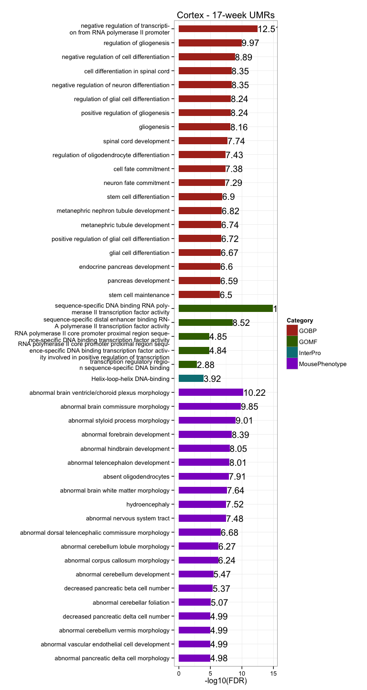
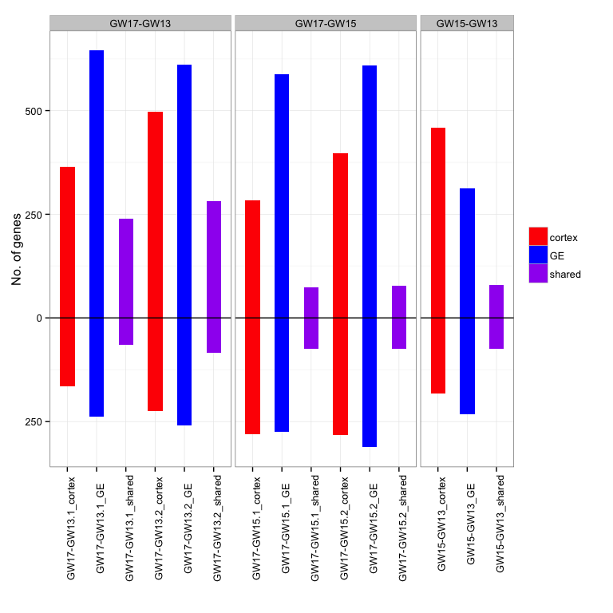

# FetalBrain - Gestational week associated analysis
gloriali  
November 5, 2014  

Updated: Thu Nov 20 11:03:42 2014

## DMR identification with methyl_diff

  * Identify DM CpGs     
    + methyl_diff one-sided p-value $\le$ 0.005  
    + delta fractional methylation $\ge$ 0.5  
    + fractional methylation of one sample $\ge$ 0.75   
  * Collapse DM CpGs into DMRs     
    + adjacent DM CpGs have the same DM status;    
    + distance between adjacent CpGs (size) $\le$ 300bp;   
    + No. of CpGs within each DMR $\ge$ 3.   

## UMR summary and sanity check 

  * On average, there are __1692__ 17-week UMRs, __428__ intersect between Cortex and GE, and __450__ 13-week UMRs, __76__ intersect. The intersect is highly significant.       
  * Median DMR length is __321__, _comparable to breast_. It's similar in all chromosomes in 17-week UMRs, but fluctuate more in 13-week UMRs, probably due to  small No. of UMRs identified.   
  * Median No. of CpGs per DMR is __5__, also _similar to breast_.     

<!-- html table generated in R 3.1.1 by xtable 1.7-4 package -->
<!-- Thu Nov 20 11:03:57 2014 -->
<table border=1>
<tr> <th>  </th> <th> Sample </th> <th> Total.DMR </th> <th> Hyper.DMR </th> <th> Hypo.DMR </th>  </tr>
  <tr> <td align="right"> 1 </td> <td align="right"> Cortex-HuFNSC02_Cortex-HuFNSC04 </td> <td align="center"> 1283 </td> <td align="center"> 179 </td> <td align="center"> 1104 </td> </tr>
  <tr> <td align="right"> 2 </td> <td align="right"> GE-HuFNSC02_GE-HuFNSC04 </td> <td align="center"> 3002 </td> <td align="center"> 722 </td> <td align="center"> 2280 </td> </tr>
   </table>
  
 

## UMR asymmetry 

  * On average, there are , __4.8__-fold enrichment in total UMR frequency in 17-week compared to 13-week, __8.17__ in Cortex, and __3.97__ in GE.    

  

## GREAT enrichment for GW-associated UMRs 

  * GREAT terms are strongly associated with __neuron differentiation and brain development__.     
  * 17-week UMRs are highly enriched in __glial cell development__ in Cortex, and __neural tube development__ in GE. Intersect of these two cell types show enrichment in __cell fate commitment__ related to different types of brain cells.         
  * 13-week UMRs are enriched in __neuron fate commitment__ in Cortex, and __regionalization__ in GE. Intersect of these two cell types show no significant enrichment.          
  
 
 
 
  

## UMR Genomic breakdown

  + On average, __62.81%__ of CpGs in UMRs overlap with genebody, and __23.58%__ of CpGs in UMRs overlap with promoters, __1.78-fold__ enriched. __44.2%__ of CpGs in UMRs overlap with CGIs, __5.97-fold__ than expected by random.        

<!-- For the entire genome, 3727169 out of 28217448 CpGs overlap with TSS +/- 1500bp promoter regions -->
<!-- For the entire genome, 2089538 out of 28217448 CpGs overlap with CGIs -->

 

## Proximal UMRs and DE genes  

  + On average, there are __165__ UMRs proximally (TSS +/- 1.5kb) associated with protein-coding genes, __18.23%__ in 17-week UMRs, and __4.88%__ in 13-week UMRs, __much lower__ than 17-week UMRs.   
  + Among proximal UMRs, __14.26%__ of 17-week proximal UMRs are associated with DE genes, __13.64%__ 13-week UMRs, similar to 17-week UMRs. On average, __20__ DE genes are associated with GW UMRs.        
  + Among proximal UMR assocaited with DE genes, __79.55%__ 17-week UMRs change in the same direction as DE genes (hyper to DN), __much higher__ than any Fetal Brain UMRs and close to observed in breast. __50%__ in 13-week UMRs, __much lower__ than 17-week UMRs.     

<!-- html table generated in R 3.1.1 by xtable 1.7-4 package -->
<!-- Thu Nov 20 11:04:07 2014 -->
<table border=1>
<tr> <th>  </th> <th> proximal.DMRs </th> <th> unique.genes </th> <th> DE.DMRs </th> <th> unique.DE.genes </th> <th> same.direction </th>  </tr>
  <tr> <td align="center"> Cortex04.UMRs </td> <td align="center">   7 </td> <td align="center">   7 </td> <td align="center">   0 </td> <td align="center">   0 </td> <td align="center">   0 </td> </tr>
  <tr> <td align="center"> Cortex02.UMRs </td> <td align="center"> 215 </td> <td align="center"> 215 </td> <td align="center">  24 </td> <td align="center">  19 </td> <td align="center">  21 </td> </tr>
  <tr> <td align="center"> GE04.UMRs </td> <td align="center">  37 </td> <td align="center">  36 </td> <td align="center">   6 </td> <td align="center">   5 </td> <td align="center">   3 </td> </tr>
  <tr> <td align="center"> GE02.UMRs </td> <td align="center"> 402 </td> <td align="center"> 402 </td> <td align="center">  64 </td> <td align="center">  57 </td> <td align="center">  49 </td> </tr>
   </table>
 

## DE genes summary   
  
  + On average, there are __754__ genes differentially expressed between 13- and 17-week individuals, __254__ up-regulated in 13-week individuals, and __499__ up-regulated in 17-week individuals, __2__-times as many.   
  + Within each cell type, majority of DE genes are shared among different comparisons (hypergeometric p-value = 0). There are __496__ genes up-regulated in 17-week in cortex shared by at least two comparisons, __268__ up-regulated in 13-week in cortex, __718__ up-regulated in 17-week in GE, and __346__ up-regulated in 13-week in GE.   
  + The overlap between cell types is highly significant as well (hypergeometric p-value = 0), with __270__ genes up-regulated in 17-week in both cortex and GE supported by at least two comparisons, and __103__ genes up-regulated in 13-week.    

<!-- html table generated in R 3.1.1 by xtable 1.7-4 package -->
<!-- Thu Nov 20 11:04:07 2014 -->
<table border=1>
<tr> <th>  </th> <th> UP </th> <th> DN </th> <th> DE </th>  </tr>
  <tr> <td align="center"> cortex01_cortex03 </td> <td align="center"> 284 </td> <td align="center"> 281 </td> <td align="center"> 565 </td> </tr>
  <tr> <td align="center"> cortex01_cortex04 </td> <td align="center"> 365 </td> <td align="center"> 165 </td> <td align="center"> 530 </td> </tr>
  <tr> <td align="center"> cortex02_cortex03 </td> <td align="center"> 398 </td> <td align="center"> 283 </td> <td align="center"> 681 </td> </tr>
  <tr> <td align="center"> cortex02_cortex04 </td> <td align="center"> 497 </td> <td align="center"> 225 </td> <td align="center"> 722 </td> </tr>
  <tr> <td align="center"> GE01_GE03 </td> <td align="center"> 587 </td> <td align="center"> 274 </td> <td align="center"> 861 </td> </tr>
  <tr> <td align="center"> GE01_GE04 </td> <td align="center"> 645 </td> <td align="center"> 238 </td> <td align="center"> 883 </td> </tr>
  <tr> <td align="center"> GE02_GE03 </td> <td align="center"> 609 </td> <td align="center"> 312 </td> <td align="center"> 921 </td> </tr>
  <tr> <td align="center"> GE02_GE04 </td> <td align="center"> 610 </td> <td align="center"> 259 </td> <td align="center"> 869 </td> </tr>
   </table>
   

## DAVID enrichment for DE genes  

  * Genes up-regulated in 17-week in both cortex and GE show enrichment in __tissue development__ and __calcium ion binding__, they also show more __brain development__ terms in GE.    
  * Genes up-regulated in 13-week in both cortex and GE show enrichment in __neurogenesis__.    
  * Genes shared by both cortex and GE show no significant terms, probably due to small No. of genes.    
  * In cortex:     
  

  * In GE:    
 
 

## Isoform analysis   

  * On average, there are __2153__ isoform genes between 13- and 17-week individuals, majority of them are shared among different comparisons and between the two cell types (hypergeometric p-value = 0).    
  * There are __2878__ isoform genes in cortex supported by at least two comparisons, and __2505__ in GE, among them, __1800__ isoform genes are shared between the two cell types.    
  * Isoform genes are enriched in __cell signaling__ related terms.        

<!-- html table generated in R 3.1.1 by xtable 1.7-4 package -->
<!-- Thu Nov 20 11:04:09 2014 -->
<table border=1>
<tr> <th>  </th> <th> DE_genes </th> <th> DE_exons </th> <th> with_expressed_genes </th> <th> isoform_exons </th> <th> exclude_DE_genes </th> <th> isoform_genes </th>  </tr>
  <tr> <td align="center"> cortex01_cortex03 </td> <td align="center"> 565 </td> <td align="center"> 28637 </td> <td align="center"> 16045 </td> <td align="center"> 8044 </td> <td align="center"> 7772 </td> <td align="center"> 2490 </td> </tr>
  <tr> <td align="center"> cortex01_cortex04 </td> <td align="center"> 530 </td> <td align="center"> 27428 </td> <td align="center"> 13200 </td> <td align="center"> 6365 </td> <td align="center"> 6134 </td> <td align="center"> 2167 </td> </tr>
  <tr> <td align="center"> cortex02_cortex03 </td> <td align="center"> 681 </td> <td align="center"> 28963 </td> <td align="center"> 16765 </td> <td align="center"> 7961 </td> <td align="center"> 7630 </td> <td align="center"> 2425 </td> </tr>
  <tr> <td align="center"> cortex02_cortex04 </td> <td align="center"> 722 </td> <td align="center"> 29416 </td> <td align="center"> 13894 </td> <td align="center"> 6351 </td> <td align="center"> 6011 </td> <td align="center"> 2105 </td> </tr>
  <tr> <td align="center"> GE01_GE03 </td> <td align="center"> 861 </td> <td align="center"> 31361 </td> <td align="center"> 14725 </td> <td align="center"> 5880 </td> <td align="center"> 5458 </td> <td align="center"> 2041 </td> </tr>
  <tr> <td align="center"> GE01_GE04 </td> <td align="center"> 883 </td> <td align="center"> 34359 </td> <td align="center"> 15889 </td> <td align="center"> 6401 </td> <td align="center"> 5996 </td> <td align="center"> 2049 </td> </tr>
  <tr> <td align="center"> GE02_GE03 </td> <td align="center"> 921 </td> <td align="center"> 32827 </td> <td align="center"> 15557 </td> <td align="center"> 5773 </td> <td align="center"> 5306 </td> <td align="center"> 1965 </td> </tr>
  <tr> <td align="center"> GE02_GE04 </td> <td align="center"> 869 </td> <td align="center"> 34699 </td> <td align="center"> 16012 </td> <td align="center"> 6113 </td> <td align="center"> 5711 </td> <td align="center"> 1986 </td> </tr>
   </table>
  
 

