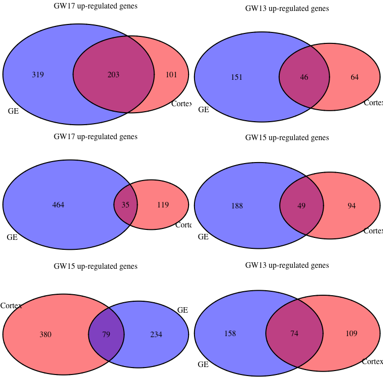

# FetalBrain - Gestational week associated analysis
Gloria Li  
November 5, 2014  

Updated: Thu Dec 18 09:57:30 2014

## DMR identification with methyl_diff

  * Identify DM CpGs     
    + methyl_diff one-sided p-value $\le$ 0.005  
    + delta fractional methylation $\ge$ 0.5  
    + fractional methylation of one sample $\ge$ 0.75   
  * Collapse DM CpGs into DMRs     
    + adjacent DM CpGs have the same DM status;    
    + distance between adjacent CpGs (size) $\le$ 300bp;   
    + No. of CpGs within each DMR $\ge$ 3.   

## Background
         
          

## UMR summary and sanity check 

  * On average, there are __1692__ 17-week UMRs, __428__ intersect between Cortex and GE, and __450__ 13-week UMRs, __76__ intersect. The intersect is highly significant.       
  * Median DMR length is __321__, _comparable to breast_. It's similar in all chromosomes in 17-week UMRs, but fluctuate more in 13-week UMRs, probably due to  small No. of UMRs identified.   
  * Median No. of CpGs per DMR is __5__, also _similar to breast_.            

<table>
 <thead>
  <tr>
   <th style="text-align:right;"> Sample </th>
   <th style="text-align:right;"> Total.DMR </th>
   <th style="text-align:center;"> Hyper.DMR </th>
   <th style="text-align:center;"> Hypo.DMR </th>
  </tr>
 </thead>
<tbody>
  <tr>
   <td style="text-align:right;"> Cortex-HuFNSC02_Cortex-HuFNSC04 </td>
   <td style="text-align:right;"> 1283 </td>
   <td style="text-align:center;"> 179 </td>
   <td style="text-align:center;"> 1104 </td>
  </tr>
  <tr>
   <td style="text-align:right;"> GE-HuFNSC02_GE-HuFNSC04 </td>
   <td style="text-align:right;"> 3002 </td>
   <td style="text-align:center;"> 722 </td>
   <td style="text-align:center;"> 2280 </td>
  </tr>
</tbody>
</table>

  

 

## UMR asymmetry 

  * On average, there are , __4.8__-fold enrichment in total UMR frequency in 17-week compared to 13-week, __8.17__ in Cortex, and __3.97__ in GE.    

  

## GREAT enrichment for GW-associated UMRs 

  * GREAT terms are strongly associated with __neuron differentiation and brain development__.     
  * 17-week UMRs are highly enriched in __glial cell development__ in Cortex, and __neural tube development__ in GE. Intersect of these two cell types show enrichment in __cell fate commitment__ related to different types of brain cells.         
  * 13-week UMRs are enriched in __neuron fate commitment__ in Cortex, and __regionalization__ in GE. Intersect of these two cell types show no significant enrichment.          
  
 
 
 
  

## UMR Genomic breakdown

  + On average, __62.26%__ of CpGs in UMRs overlap with genebody, and __23.95%__ of CpGs in UMRs overlap with promoters, __1.78-fold__ enriched. __44.87%__ of CpGs in UMRs overlap with CGIs, __5.97-fold__ than expected by random.        

<!-- For the entire genome, 3727169 out of 28217448 CpGs overlap with TSS +/- 1500bp promoter regions -->
<!-- For the entire genome, 2089538 out of 28217448 CpGs overlap with CGIs -->

  

## Proximal UMRs and DE genes  

  + On average, there are __165__ UMRs proximally (TSS +/- 1.5kb) associated with protein-coding genes, __18.23%__ in 17-week UMRs, and __4.88%__ in 13-week UMRs, __much lower__ than 17-week UMRs.   
  + Among proximal UMRs, __14.26%__ of 17-week proximal UMRs are associated with DE genes, __13.64%__ 13-week UMRs, similar to 17-week UMRs. On average, __20__ DE genes are associated with GW UMRs.        
  + Among proximal UMR assocaited with DE genes, __79.55%__ 17-week UMRs change in the same direction as DE genes (hyper to DN), __much higher__ than any Fetal Brain UMRs and close to observed in breast. __50%__ in 13-week UMRs, __much lower__ than 17-week UMRs.     

<table>
 <thead>
  <tr>
   <th style="text-align:left;">   </th>
   <th style="text-align:center;"> proximal.DMRs </th>
   <th style="text-align:center;"> unique.genes </th>
   <th style="text-align:center;"> DE.DMRs </th>
   <th style="text-align:center;"> unique.DE.genes </th>
   <th style="text-align:center;"> same.direction </th>
  </tr>
 </thead>
<tbody>
  <tr>
   <td style="text-align:left;"> Cortex04.UMRs </td>
   <td style="text-align:center;"> 7 </td>
   <td style="text-align:center;"> 7 </td>
   <td style="text-align:center;"> 0 </td>
   <td style="text-align:center;"> 0 </td>
   <td style="text-align:center;"> 0 </td>
  </tr>
  <tr>
   <td style="text-align:left;"> Cortex02.UMRs </td>
   <td style="text-align:center;"> 215 </td>
   <td style="text-align:center;"> 215 </td>
   <td style="text-align:center;"> 24 </td>
   <td style="text-align:center;"> 19 </td>
   <td style="text-align:center;"> 21 </td>
  </tr>
  <tr>
   <td style="text-align:left;"> GE04.UMRs </td>
   <td style="text-align:center;"> 37 </td>
   <td style="text-align:center;"> 36 </td>
   <td style="text-align:center;"> 6 </td>
   <td style="text-align:center;"> 5 </td>
   <td style="text-align:center;"> 3 </td>
  </tr>
  <tr>
   <td style="text-align:left;"> GE02.UMRs </td>
   <td style="text-align:center;"> 402 </td>
   <td style="text-align:center;"> 402 </td>
   <td style="text-align:center;"> 64 </td>
   <td style="text-align:center;"> 57 </td>
   <td style="text-align:center;"> 49 </td>
  </tr>
</tbody>
</table>

 

### Proximal 13-week UMRs in both Cortex and GE

<table>
 <thead>
  <tr>
   <th style="text-align:center;"> id </th>
   <th style="text-align:right;"> name </th>
   <th style="text-align:right;"> description </th>
  </tr>
 </thead>
<tbody>
  <tr>
   <td style="text-align:center;"> ENSG00000189334 </td>
   <td style="text-align:right;"> S100A14 </td>
   <td style="text-align:right;"> S100_calcium_binding_protein_A14_[Source:HGNC_Symbol;Acc:18901] </td>
  </tr>
  <tr>
   <td style="text-align:center;"> ENSG00000237693 </td>
   <td style="text-align:right;"> IRGM </td>
   <td style="text-align:right;"> immunity-related_GTPase_family,_M_[Source:HGNC_Symbol;Acc:29597] </td>
  </tr>
  <tr>
   <td style="text-align:center;"> ENSG00000124564 </td>
   <td style="text-align:right;"> SLC17A3 </td>
   <td style="text-align:right;"> solute_carrier_family_17_(sodium_phosphate),_member_3_[Source:HGNC_Symbol;Acc:10931] </td>
  </tr>
</tbody>
</table>

### Proximal GE 13-week UMRs with DE genes

<table>
 <thead>
  <tr>
   <th style="text-align:center;"> id </th>
   <th style="text-align:right;"> name </th>
   <th style="text-align:right;"> description </th>
   <th style="text-align:center;"> DM </th>
   <th style="text-align:center;"> DE </th>
  </tr>
 </thead>
<tbody>
  <tr>
   <td style="text-align:center;"> ENSG00000134954 </td>
   <td style="text-align:right;"> ETS1 </td>
   <td style="text-align:right;"> v-ets_erythroblastosis_virus_E26_oncogene_homolog_1_(avian)_[Source:HGNC_Symbol;Acc:3488] </td>
   <td style="text-align:center;"> hyper </td>
   <td style="text-align:center;"> UP </td>
  </tr>
  <tr>
   <td style="text-align:center;"> ENSG00000136352 </td>
   <td style="text-align:right;"> NKX2-1 </td>
   <td style="text-align:right;"> NK2_homeobox_1_[Source:HGNC_Symbol;Acc:11825] </td>
   <td style="text-align:center;"> hyper </td>
   <td style="text-align:center;"> UP </td>
  </tr>
  <tr>
   <td style="text-align:center;"> ENSG00000165588 </td>
   <td style="text-align:right;"> OTX2 </td>
   <td style="text-align:right;"> orthodenticle_homeobox_2_[Source:HGNC_Symbol;Acc:8522] </td>
   <td style="text-align:center;"> hyper </td>
   <td style="text-align:center;"> UP </td>
  </tr>
  <tr>
   <td style="text-align:center;"> ENSG00000231421 </td>
   <td style="text-align:right;">  </td>
   <td style="text-align:right;">  </td>
   <td style="text-align:center;"> hyper </td>
   <td style="text-align:center;"> DN </td>
  </tr>
  <tr>
   <td style="text-align:center;"> ENSG00000155760 </td>
   <td style="text-align:right;"> FZD7 </td>
   <td style="text-align:right;"> frizzled_family_receptor_7_[Source:HGNC_Symbol;Acc:4045] </td>
   <td style="text-align:center;"> hyper </td>
   <td style="text-align:center;"> DN </td>
  </tr>
</tbody>
</table>

### Proximal 17-week UMRs with DE genes in both Cortex and GE

<table>
 <thead>
  <tr>
   <th style="text-align:center;"> id </th>
   <th style="text-align:right;"> name </th>
   <th style="text-align:right;"> description </th>
   <th style="text-align:center;"> DM </th>
   <th style="text-align:center;"> DE </th>
  </tr>
 </thead>
<tbody>
  <tr>
   <td style="text-align:center;"> ENSG00000255737 </td>
   <td style="text-align:right;"> NA </td>
   <td style="text-align:right;"> HCG2014417,_isoform_CRA_aUncharacterized_proteincDNA_FLJ59598_[Source:UniProtKB/TrEMBL;Acc:B7Z718] </td>
   <td style="text-align:center;"> hypo </td>
   <td style="text-align:center;"> UP </td>
  </tr>
  <tr>
   <td style="text-align:center;"> ENSG00000167178 </td>
   <td style="text-align:right;"> ISLR2 </td>
   <td style="text-align:right;"> immunoglobulin_superfamily_containing_leucine-rich_repeat_2_[Source:HGNC_Symbol;Acc:29286] </td>
   <td style="text-align:center;"> hypo </td>
   <td style="text-align:center;"> UP </td>
  </tr>
  <tr>
   <td style="text-align:center;"> ENSG00000161999 </td>
   <td style="text-align:right;"> JMJD8 </td>
   <td style="text-align:right;"> jumonji_domain_containing_8_[Source:HGNC_Symbol;Acc:14148] </td>
   <td style="text-align:center;"> hypo </td>
   <td style="text-align:center;"> UP </td>
  </tr>
  <tr>
   <td style="text-align:center;"> ENSG00000051523 </td>
   <td style="text-align:right;"> CYBA </td>
   <td style="text-align:right;"> cytochrome_b-245,_alpha_polypeptide_[Source:HGNC_Symbol;Acc:2577] </td>
   <td style="text-align:center;"> hypo </td>
   <td style="text-align:center;"> UP </td>
  </tr>
  <tr>
   <td style="text-align:center;"> ENSG00000169515 </td>
   <td style="text-align:right;"> CCDC8 </td>
   <td style="text-align:right;"> coiled-coil_domain_containing_8_[Source:HGNC_Symbol;Acc:25367] </td>
   <td style="text-align:center;"> hypo </td>
   <td style="text-align:center;"> UP </td>
  </tr>
  <tr>
   <td style="text-align:center;"> ENSG00000205927 </td>
   <td style="text-align:right;"> OLIG2 </td>
   <td style="text-align:right;"> oligodendrocyte_lineage_transcription_factor_2_[Source:HGNC_Symbol;Acc:9398] </td>
   <td style="text-align:center;"> hypo </td>
   <td style="text-align:center;"> UP </td>
  </tr>
  <tr>
   <td style="text-align:center;"> ENSG00000189060 </td>
   <td style="text-align:right;"> H1F0 </td>
   <td style="text-align:right;"> H1_histone_family,_member_0_[Source:HGNC_Symbol;Acc:4714] </td>
   <td style="text-align:center;"> hypo </td>
   <td style="text-align:center;"> UP </td>
  </tr>
  <tr>
   <td style="text-align:center;"> ENSG00000146904 </td>
   <td style="text-align:right;"> EPHA1 </td>
   <td style="text-align:right;"> EPH_receptor_A1_[Source:HGNC_Symbol;Acc:3385] </td>
   <td style="text-align:center;"> hypo </td>
   <td style="text-align:center;"> UP </td>
  </tr>
  <tr>
   <td style="text-align:center;"> ENSG00000165072 </td>
   <td style="text-align:right;"> MAMDC2 </td>
   <td style="text-align:right;"> MAM_domain_containing_2_[Source:HGNC_Symbol;Acc:23673] </td>
   <td style="text-align:center;"> hypo </td>
   <td style="text-align:center;"> UP </td>
  </tr>
</tbody>
</table>

## UMRs overlapping with TFBS

 <table>
 <thead>
  <tr>
   <th style="text-align:right;"> TF </th>
   <th style="text-align:center;"> UMR17week_Cortex </th>
   <th style="text-align:center;"> UMR13week_Cortex </th>
   <th style="text-align:center;"> Ratio_Cortex </th>
   <th style="text-align:center;"> UMR17week_GE </th>
   <th style="text-align:center;"> UMR13week_GE </th>
   <th style="text-align:center;"> Ratio_GE </th>
  </tr>
 </thead>
<tbody>
  <tr>
   <td style="text-align:right;"> MAZ </td>
   <td style="text-align:center;"> 133 </td>
   <td style="text-align:center;"> 5 </td>
   <td style="text-align:center;"> 26.6000 </td>
   <td style="text-align:center;"> 319 </td>
   <td style="text-align:center;"> 12 </td>
   <td style="text-align:center;"> 26.5833 </td>
  </tr>
  <tr>
   <td style="text-align:right;"> GTF2F1 </td>
   <td style="text-align:center;"> 28 </td>
   <td style="text-align:center;"> 1 </td>
   <td style="text-align:center;"> 28.0000 </td>
   <td style="text-align:center;"> 103 </td>
   <td style="text-align:center;"> 2 </td>
   <td style="text-align:center;"> 51.5000 </td>
  </tr>
  <tr>
   <td style="text-align:right;"> ZBTB7A </td>
   <td style="text-align:center;"> 97 </td>
   <td style="text-align:center;"> 3 </td>
   <td style="text-align:center;"> 32.3333 </td>
   <td style="text-align:center;"> 201 </td>
   <td style="text-align:center;"> 3 </td>
   <td style="text-align:center;"> 67.0000 </td>
  </tr>
  <tr>
   <td style="text-align:right;"> HMGN3 </td>
   <td style="text-align:center;"> 66 </td>
   <td style="text-align:center;"> 2 </td>
   <td style="text-align:center;"> 33.0000 </td>
   <td style="text-align:center;"> 131 </td>
   <td style="text-align:center;"> 4 </td>
   <td style="text-align:center;"> 32.7500 </td>
  </tr>
  <tr>
   <td style="text-align:right;"> NRF1 </td>
   <td style="text-align:center;"> 34 </td>
   <td style="text-align:center;"> 1 </td>
   <td style="text-align:center;"> 34.0000 </td>
   <td style="text-align:center;"> 64 </td>
   <td style="text-align:center;"> 1 </td>
   <td style="text-align:center;"> 64.0000 </td>
  </tr>
  <tr>
   <td style="text-align:right;"> MXI1 </td>
   <td style="text-align:center;"> 112 </td>
   <td style="text-align:center;"> 3 </td>
   <td style="text-align:center;"> 37.3333 </td>
   <td style="text-align:center;"> 262 </td>
   <td style="text-align:center;"> 7 </td>
   <td style="text-align:center;"> 37.4286 </td>
  </tr>
  <tr>
   <td style="text-align:right;"> E2F4 </td>
   <td style="text-align:center;"> 50 </td>
   <td style="text-align:center;"> 1 </td>
   <td style="text-align:center;"> 50.0000 </td>
   <td style="text-align:center;"> 110 </td>
   <td style="text-align:center;"> 1 </td>
   <td style="text-align:center;"> 110.0000 </td>
  </tr>
  <tr>
   <td style="text-align:right;"> CCNT2 </td>
   <td style="text-align:center;"> 87 </td>
   <td style="text-align:center;"> 1 </td>
   <td style="text-align:center;"> 87.0000 </td>
   <td style="text-align:center;"> 148 </td>
   <td style="text-align:center;"> 4 </td>
   <td style="text-align:center;"> 37.0000 </td>
  </tr>
  <tr>
   <td style="text-align:right;"> E2F6 </td>
   <td style="text-align:center;"> 140 </td>
   <td style="text-align:center;"> 1 </td>
   <td style="text-align:center;"> 140.0000 </td>
   <td style="text-align:center;"> 263 </td>
   <td style="text-align:center;"> 8 </td>
   <td style="text-align:center;"> 32.8750 </td>
  </tr>
</tbody>
</table>

## UMR enrichment at chromosome ends

 

## DE genes summary   
  
  + On average, there are __721__ genes differentially expressed between 13- and 17-week individuals, __593__ DE between GW13 and GW15 individuals, __757__ DE between GW15 and GW17, __751__ DE between GW13 and GW17.   
  + Within each cell type, majority of DE genes are shared among different comparisons (hypergeometric p-value = 0), less but still significant genes overlap between cell types. .   
  + Majority of the GW-associated DE genes are __stage-specific__.       

<table>
 <thead>
  <tr>
   <th style="text-align:left;">   </th>
   <th style="text-align:center;"> UP </th>
   <th style="text-align:center;"> DN </th>
   <th style="text-align:center;"> DE </th>
   <th style="text-align:center;"> GW </th>
  </tr>
 </thead>
<tbody>
  <tr>
   <td style="text-align:left;"> cortex01_cortex03 </td>
   <td style="text-align:center;"> 284 </td>
   <td style="text-align:center;"> 281 </td>
   <td style="text-align:center;"> 565 </td>
   <td style="text-align:center;"> 17 vs 15 </td>
  </tr>
  <tr>
   <td style="text-align:left;"> cortex01_cortex04 </td>
   <td style="text-align:center;"> 365 </td>
   <td style="text-align:center;"> 165 </td>
   <td style="text-align:center;"> 530 </td>
   <td style="text-align:center;"> 17 vs 13 </td>
  </tr>
  <tr>
   <td style="text-align:left;"> cortex02_cortex03 </td>
   <td style="text-align:center;"> 398 </td>
   <td style="text-align:center;"> 283 </td>
   <td style="text-align:center;"> 681 </td>
   <td style="text-align:center;"> 17 vs 15 </td>
  </tr>
  <tr>
   <td style="text-align:left;"> cortex02_cortex04 </td>
   <td style="text-align:center;"> 497 </td>
   <td style="text-align:center;"> 225 </td>
   <td style="text-align:center;"> 722 </td>
   <td style="text-align:center;"> 17 vs 13 </td>
  </tr>
  <tr>
   <td style="text-align:left;"> cortex03_cortex04 </td>
   <td style="text-align:center;"> 459 </td>
   <td style="text-align:center;"> 183 </td>
   <td style="text-align:center;"> 642 </td>
   <td style="text-align:center;"> 15 vs 13 </td>
  </tr>
  <tr>
   <td style="text-align:left;"> GE01_GE03 </td>
   <td style="text-align:center;"> 587 </td>
   <td style="text-align:center;"> 274 </td>
   <td style="text-align:center;"> 861 </td>
   <td style="text-align:center;"> 17 vs 15 </td>
  </tr>
  <tr>
   <td style="text-align:left;"> GE01_GE04 </td>
   <td style="text-align:center;"> 645 </td>
   <td style="text-align:center;"> 238 </td>
   <td style="text-align:center;"> 883 </td>
   <td style="text-align:center;"> 17 vs 13 </td>
  </tr>
  <tr>
   <td style="text-align:left;"> GE02_GE03 </td>
   <td style="text-align:center;"> 609 </td>
   <td style="text-align:center;"> 312 </td>
   <td style="text-align:center;"> 921 </td>
   <td style="text-align:center;"> 17 vs 15 </td>
  </tr>
  <tr>
   <td style="text-align:left;"> GE02_GE04 </td>
   <td style="text-align:center;"> 610 </td>
   <td style="text-align:center;"> 259 </td>
   <td style="text-align:center;"> 869 </td>
   <td style="text-align:center;"> 17 vs 13 </td>
  </tr>
  <tr>
   <td style="text-align:left;"> GE03_GE04 </td>
   <td style="text-align:center;"> 313 </td>
   <td style="text-align:center;"> 232 </td>
   <td style="text-align:center;"> 545 </td>
   <td style="text-align:center;"> 15 vs 13 </td>
  </tr>
</tbody>
</table>
   

### Stage-specific DE gene profiles

1. GW13-15:UP, GW15-17:UP;    
    _No genes_   
2. GW13-15:UP, GW15-17:DN;    
<table>
 <thead>
  <tr>
   <th style="text-align:right;"> id </th>
   <th style="text-align:right;"> name </th>
   <th style="text-align:right;"> description </th>
  </tr>
 </thead>
<tbody>
  <tr>
   <td style="text-align:right;"> ENSG00000168542 </td>
   <td style="text-align:right;"> COL3A1 </td>
   <td style="text-align:right;"> collagen,_type_III,_alpha_1_[Source:HGNC_Symbol;Acc:2201] </td>
  </tr>
  <tr>
   <td style="text-align:right;"> ENSG00000133636 </td>
   <td style="text-align:right;"> NTS </td>
   <td style="text-align:right;"> neurotensin_[Source:HGNC_Symbol;Acc:8038] </td>
  </tr>
  <tr>
   <td style="text-align:right;"> ENSG00000066032 </td>
   <td style="text-align:right;"> CTNNA2 </td>
   <td style="text-align:right;"> catenin_(cadherin-associated_protein),_alpha_2_[Source:HGNC_Symbol;Acc:2510] </td>
  </tr>
  <tr>
   <td style="text-align:right;"> ENSG00000135063 </td>
   <td style="text-align:right;"> FAM189A2 </td>
   <td style="text-align:right;"> family_with_sequence_similarity_189,_member_A2_[Source:HGNC_Symbol;Acc:24820] </td>
  </tr>
  <tr>
   <td style="text-align:right;"> ENSG00000214401 </td>
   <td style="text-align:right;">  </td>
   <td style="text-align:right;">  </td>
  </tr>
  <tr>
   <td style="text-align:right;"> ENSG00000099984 </td>
   <td style="text-align:right;"> GSTT2 </td>
   <td style="text-align:right;"> glutathione_S-transferase_theta_2_[Source:HGNC_Symbol;Acc:4642] </td>
  </tr>
  <tr>
   <td style="text-align:right;"> ENSG00000238083 </td>
   <td style="text-align:right;"> LRRC37A2 </td>
   <td style="text-align:right;"> leucine_rich_repeat_containing_37,_member_A2_[Source:HGNC_Symbol;Acc:32404] </td>
  </tr>
  <tr>
   <td style="text-align:right;"> ENSG00000101255 </td>
   <td style="text-align:right;"> TRIB3 </td>
   <td style="text-align:right;"> tribbles_homolog_3_(Drosophila)_[Source:HGNC_Symbol;Acc:16228] </td>
  </tr>
  <tr>
   <td style="text-align:right;"> ENSG00000160284 </td>
   <td style="text-align:right;"> C21orf56 </td>
   <td style="text-align:right;"> chromosome_21_open_reading_frame_56_[Source:HGNC_Symbol;Acc:1298] </td>
  </tr>
</tbody>
</table>
3. GW13-15:DN, GW15-17:UP; 
<table>
 <thead>
  <tr>
   <th style="text-align:right;"> id </th>
   <th style="text-align:right;"> name </th>
   <th style="text-align:right;"> description </th>
  </tr>
 </thead>
<tbody>
  <tr>
   <td style="text-align:right;"> ENSG00000022556 </td>
   <td style="text-align:right;"> NLRP2 </td>
   <td style="text-align:right;"> NLR_family,_pyrin_domain_containing_2_[Source:HGNC_Symbol;Acc:22948] </td>
  </tr>
  <tr>
   <td style="text-align:right;"> ENSG00000225607 </td>
   <td style="text-align:right;"> NA </td>
   <td style="text-align:right;"> Uncharacterized_proteincDNA_FLJ60024,_highly_similar_to_Cytochrome_P450_4F12__[Source:UniProtKB/TrEMBL;Acc:B4DNA9] </td>
  </tr>
  <tr>
   <td style="text-align:right;"> ENSG00000147813 </td>
   <td style="text-align:right;"> NAPRT1 </td>
   <td style="text-align:right;"> nicotinate_phosphoribosyltransferase_domain_containing_1_[Source:HGNC_Symbol;Acc:30450] </td>
  </tr>
  <tr>
   <td style="text-align:right;"> ENSG00000167654 </td>
   <td style="text-align:right;"> ATCAY </td>
   <td style="text-align:right;"> ataxia,_cerebellar,_Cayman_type_[Source:HGNC_Symbol;Acc:779] </td>
  </tr>
</tbody>
</table>
4. GW13-15:DN, GW15-17:DN;   
    _No genes_   
5. GW13-15:UP, GW15-17:not DE; 
<table>
 <thead>
  <tr>
   <th style="text-align:right;"> id </th>
   <th style="text-align:right;"> name </th>
   <th style="text-align:right;"> description </th>
  </tr>
 </thead>
<tbody>
  <tr>
   <td style="text-align:right;"> ENSG00000149054 </td>
   <td style="text-align:right;"> ZNF215 </td>
   <td style="text-align:right;"> zinc_finger_protein_215_[Source:HGNC_Symbol;Acc:13007] </td>
  </tr>
  <tr>
   <td style="text-align:right;"> ENSG00000215845 </td>
   <td style="text-align:right;"> TSTD1 </td>
   <td style="text-align:right;"> thiosulfate_sulfurtransferase_(rhodanese)-like_domain_containing_1_[Source:HGNC_Symbol;Acc:35410] </td>
  </tr>
  <tr>
   <td style="text-align:right;"> ENSG00000100336 </td>
   <td style="text-align:right;"> APOL4 </td>
   <td style="text-align:right;"> apolipoprotein_L,_4_[Source:HGNC_Symbol;Acc:14867] </td>
  </tr>
  <tr>
   <td style="text-align:right;"> ENSG00000163823 </td>
   <td style="text-align:right;"> CCR1 </td>
   <td style="text-align:right;"> chemokine_(C-C_motif)_receptor_1_[Source:HGNC_Symbol;Acc:1602] </td>
  </tr>
  <tr>
   <td style="text-align:right;"> ENSG00000169220 </td>
   <td style="text-align:right;"> RGS14 </td>
   <td style="text-align:right;"> regulator_of_G-protein_signaling_14_[Source:HGNC_Symbol;Acc:9996] </td>
  </tr>
  <tr>
   <td style="text-align:right;"> ENSG00000203804 </td>
   <td style="text-align:right;"> C1orf138 </td>
   <td style="text-align:right;"> chromosome_1_open_reading_frame_138_[Source:HGNC_Symbol;Acc:32041] </td>
  </tr>
  <tr>
   <td style="text-align:right;"> ENSG00000204520 </td>
   <td style="text-align:right;"> MICA </td>
   <td style="text-align:right;"> MHC_class_I_polypeptide-related_sequence_A_[Source:HGNC_Symbol;Acc:7090] </td>
  </tr>
  <tr>
   <td style="text-align:right;"> ENSG00000080573 </td>
   <td style="text-align:right;"> COL5A3 </td>
   <td style="text-align:right;"> collagen,_type_V,_alpha_3_[Source:HGNC_Symbol;Acc:14864] </td>
  </tr>
  <tr>
   <td style="text-align:right;"> ENSG00000165379 </td>
   <td style="text-align:right;"> LRFN5 </td>
   <td style="text-align:right;"> leucine_rich_repeat_and_fibronectin_type_III_domain_containing_5_[Source:HGNC_Symbol;Acc:20360] </td>
  </tr>
  <tr>
   <td style="text-align:right;"> ENSG00000213402 </td>
   <td style="text-align:right;"> PTPRCAP </td>
   <td style="text-align:right;"> protein_tyrosine_phosphatase,_receptor_type,_C-associated_protein_[Source:HGNC_Symbol;Acc:9667] </td>
  </tr>
  <tr>
   <td style="text-align:right;"> ENSG00000139155 </td>
   <td style="text-align:right;"> SLCO1C1 </td>
   <td style="text-align:right;"> solute_carrier_organic_anion_transporter_family,_member_1C1_[Source:HGNC_Symbol;Acc:13819] </td>
  </tr>
  <tr>
   <td style="text-align:right;"> ENSG00000187773 </td>
   <td style="text-align:right;"> FAM69C </td>
   <td style="text-align:right;"> family_with_sequence_similarity_69,_member_C_[Source:HGNC_Symbol;Acc:31729] </td>
  </tr>
  <tr>
   <td style="text-align:right;"> ENSG00000133216 </td>
   <td style="text-align:right;"> EPHB2 </td>
   <td style="text-align:right;"> EPH_receptor_B2_[Source:HGNC_Symbol;Acc:3393] </td>
  </tr>
  <tr>
   <td style="text-align:right;"> ENSG00000119737 </td>
   <td style="text-align:right;"> GPR75 </td>
   <td style="text-align:right;"> G_protein-coupled_receptor_75_[Source:HGNC_Symbol;Acc:4526] </td>
  </tr>
  <tr>
   <td style="text-align:right;"> ENSG00000126790 </td>
   <td style="text-align:right;"> C14orf149 </td>
   <td style="text-align:right;"> chromosome_14_open_reading_frame_149_[Source:HGNC_Symbol;Acc:20488] </td>
  </tr>
  <tr>
   <td style="text-align:right;"> ENSG00000162733 </td>
   <td style="text-align:right;"> DDR2 </td>
   <td style="text-align:right;"> discoidin_domain_receptor_tyrosine_kinase_2_[Source:HGNC_Symbol;Acc:2731] </td>
  </tr>
  <tr>
   <td style="text-align:right;"> ENSG00000108231 </td>
   <td style="text-align:right;"> LGI1 </td>
   <td style="text-align:right;"> leucine-rich,_glioma_inactivated_1_[Source:HGNC_Symbol;Acc:6572] </td>
  </tr>
  <tr>
   <td style="text-align:right;"> ENSG00000161921 </td>
   <td style="text-align:right;"> CXCL16 </td>
   <td style="text-align:right;"> chemokine_(C-X-C_motif)_ligand_16_[Source:HGNC_Symbol;Acc:16642] </td>
  </tr>
  <tr>
   <td style="text-align:right;"> ENSG00000119673 </td>
   <td style="text-align:right;"> ACOT2 </td>
   <td style="text-align:right;"> acyl-CoA_thioesterase_2_[Source:HGNC_Symbol;Acc:18431] </td>
  </tr>
  <tr>
   <td style="text-align:right;"> ENSG00000135046 </td>
   <td style="text-align:right;"> ANXA1 </td>
   <td style="text-align:right;"> annexin_A1_[Source:HGNC_Symbol;Acc:533] </td>
  </tr>
  <tr>
   <td style="text-align:right;"> ENSG00000215790 </td>
   <td style="text-align:right;"> SLC35E2 </td>
   <td style="text-align:right;"> solute_carrier_family_35,_member_E2_[Source:HGNC_Symbol;Acc:20863] </td>
  </tr>
  <tr>
   <td style="text-align:right;"> ENSG00000157150 </td>
   <td style="text-align:right;"> TIMP4 </td>
   <td style="text-align:right;"> TIMP_metallopeptidase_inhibitor_4_[Source:HGNC_Symbol;Acc:11823] </td>
  </tr>
  <tr>
   <td style="text-align:right;"> ENSG00000170579 </td>
   <td style="text-align:right;"> DLGAP1 </td>
   <td style="text-align:right;"> discs,_large_(Drosophila)_homolog-associated_protein_1_[Source:HGNC_Symbol;Acc:2905] </td>
  </tr>
  <tr>
   <td style="text-align:right;"> ENSG00000143252 </td>
   <td style="text-align:right;"> SDHC </td>
   <td style="text-align:right;"> succinate_dehydrogenase_complex,_subunit_C,_integral_membrane_protein,_15kDa_[Source:HGNC_Symbol;Acc:10682] </td>
  </tr>
  <tr>
   <td style="text-align:right;"> ENSG00000107796 </td>
   <td style="text-align:right;"> ACTA2 </td>
   <td style="text-align:right;"> actin,_alpha_2,_smooth_muscle,_aorta_[Source:HGNC_Symbol;Acc:130] </td>
  </tr>
  <tr>
   <td style="text-align:right;"> ENSG00000124193 </td>
   <td style="text-align:right;"> SRSF6 </td>
   <td style="text-align:right;"> serine/arginine-rich_splicing_factor_6_[Source:HGNC_Symbol;Acc:10788] </td>
  </tr>
  <tr>
   <td style="text-align:right;"> ENSG00000152661 </td>
   <td style="text-align:right;"> GJA1 </td>
   <td style="text-align:right;"> gap_junction_protein,_alpha_1,_43kDa_[Source:HGNC_Symbol;Acc:4274] </td>
  </tr>
  <tr>
   <td style="text-align:right;"> ENSG00000184110 </td>
   <td style="text-align:right;"> EIF3C </td>
   <td style="text-align:right;"> eukaryotic_translation_initiation_factor_3,_subunit_C_[Source:HGNC_Symbol;Acc:3279] </td>
  </tr>
</tbody>
</table>
6. GW13-15:DN, GW15-17:not DE; 
<table>
 <thead>
  <tr>
   <th style="text-align:right;"> id </th>
   <th style="text-align:right;"> name </th>
   <th style="text-align:right;"> description </th>
  </tr>
 </thead>
<tbody>
  <tr>
   <td style="text-align:right;"> ENSG00000166923 </td>
   <td style="text-align:right;"> GREM1 </td>
   <td style="text-align:right;"> gremlin_1_[Source:HGNC_Symbol;Acc:2001] </td>
  </tr>
  <tr>
   <td style="text-align:right;"> ENSG00000164123 </td>
   <td style="text-align:right;"> C4orf45 </td>
   <td style="text-align:right;"> chromosome_4_open_reading_frame_45_[Source:HGNC_Symbol;Acc:26342] </td>
  </tr>
  <tr>
   <td style="text-align:right;"> ENSG00000008196 </td>
   <td style="text-align:right;"> TFAP2B </td>
   <td style="text-align:right;"> transcription_factor_AP-2_beta_(activating_enhancer_binding_protein_2_beta)_[Source:HGNC_Symbol;Acc:11743] </td>
  </tr>
  <tr>
   <td style="text-align:right;"> ENSG00000186897 </td>
   <td style="text-align:right;"> C1QL4 </td>
   <td style="text-align:right;"> complement_component_1,_q_subcomponent-like_4_[Source:HGNC_Symbol;Acc:31416] </td>
  </tr>
  <tr>
   <td style="text-align:right;"> ENSG00000054598 </td>
   <td style="text-align:right;"> FOXC1 </td>
   <td style="text-align:right;"> forkhead_box_C1_[Source:HGNC_Symbol;Acc:3800] </td>
  </tr>
  <tr>
   <td style="text-align:right;"> ENSG00000104808 </td>
   <td style="text-align:right;"> DHDH </td>
   <td style="text-align:right;"> dihydrodiol_dehydrogenase_(dimeric)_[Source:HGNC_Symbol;Acc:17887] </td>
  </tr>
  <tr>
   <td style="text-align:right;"> ENSG00000124813 </td>
   <td style="text-align:right;"> RUNX2 </td>
   <td style="text-align:right;"> runt-related_transcription_factor_2_[Source:HGNC_Symbol;Acc:10472] </td>
  </tr>
  <tr>
   <td style="text-align:right;"> ENSG00000173068 </td>
   <td style="text-align:right;"> BNC2 </td>
   <td style="text-align:right;"> basonuclin_2_[Source:HGNC_Symbol;Acc:30988] </td>
  </tr>
  <tr>
   <td style="text-align:right;"> ENSG00000165929 </td>
   <td style="text-align:right;"> TC2N </td>
   <td style="text-align:right;"> tandem_C2_domains,_nuclear_[Source:HGNC_Symbol;Acc:19859] </td>
  </tr>
  <tr>
   <td style="text-align:right;"> ENSG00000157064 </td>
   <td style="text-align:right;"> NMNAT2 </td>
   <td style="text-align:right;"> nicotinamide_nucleotide_adenylyltransferase_2_[Source:HGNC_Symbol;Acc:16789] </td>
  </tr>
  <tr>
   <td style="text-align:right;"> ENSG00000243244 </td>
   <td style="text-align:right;"> STON1 </td>
   <td style="text-align:right;"> stonin_1_[Source:HGNC_Symbol;Acc:17003] </td>
  </tr>
  <tr>
   <td style="text-align:right;"> ENSG00000173809 </td>
   <td style="text-align:right;"> TDRD12 </td>
   <td style="text-align:right;"> tudor_domain_containing_12_[Source:HGNC_Symbol;Acc:25044] </td>
  </tr>
  <tr>
   <td style="text-align:right;"> ENSG00000135333 </td>
   <td style="text-align:right;"> EPHA7 </td>
   <td style="text-align:right;"> EPH_receptor_A7_[Source:HGNC_Symbol;Acc:3390] </td>
  </tr>
  <tr>
   <td style="text-align:right;"> ENSG00000231421 </td>
   <td style="text-align:right;">  </td>
   <td style="text-align:right;">  </td>
  </tr>
  <tr>
   <td style="text-align:right;"> ENSG00000168675 </td>
   <td style="text-align:right;"> C18orf1 </td>
   <td style="text-align:right;"> chromosome_18_open_reading_frame_1_[Source:HGNC_Symbol;Acc:1224] </td>
  </tr>
  <tr>
   <td style="text-align:right;"> ENSG00000156395 </td>
   <td style="text-align:right;"> SORCS3 </td>
   <td style="text-align:right;"> sortilin-related_VPS10_domain_containing_receptor_3_[Source:HGNC_Symbol;Acc:16699] </td>
  </tr>
  <tr>
   <td style="text-align:right;"> ENSG00000204103 </td>
   <td style="text-align:right;"> MAFB </td>
   <td style="text-align:right;"> v-maf_musculoaponeurotic_fibrosarcoma_oncogene_homolog_B_(avian)_[Source:HGNC_Symbol;Acc:6408] </td>
  </tr>
  <tr>
   <td style="text-align:right;"> ENSG00000168447 </td>
   <td style="text-align:right;"> SCNN1B </td>
   <td style="text-align:right;"> sodium_channel,_nonvoltage-gated_1,_beta_[Source:HGNC_Symbol;Acc:10600] </td>
  </tr>
  <tr>
   <td style="text-align:right;"> ENSG00000106546 </td>
   <td style="text-align:right;"> AHR </td>
   <td style="text-align:right;"> aryl_hydrocarbon_receptor_[Source:HGNC_Symbol;Acc:348] </td>
  </tr>
  <tr>
   <td style="text-align:right;"> ENSG00000117598 </td>
   <td style="text-align:right;"> NA </td>
   <td style="text-align:right;"> Lipid_phosphate_phosphatase-related_protein_type_5_[Source:UniProtKB/Swiss-Prot;Acc:Q32ZL2] </td>
  </tr>
  <tr>
   <td style="text-align:right;"> ENSG00000120322 </td>
   <td style="text-align:right;"> PCDHB8 </td>
   <td style="text-align:right;"> protocadherin_beta_8_[Source:HGNC_Symbol;Acc:8693] </td>
  </tr>
  <tr>
   <td style="text-align:right;"> ENSG00000250305 </td>
   <td style="text-align:right;"> NA </td>
   <td style="text-align:right;"> Putative_methyltransferase_KIAA1456_[Source:UniProtKB/Swiss-Prot;Acc:Q9P272] </td>
  </tr>
  <tr>
   <td style="text-align:right;"> ENSG00000106868 </td>
   <td style="text-align:right;"> SUSD1 </td>
   <td style="text-align:right;"> sushi_domain_containing_1_[Source:HGNC_Symbol;Acc:25413] </td>
  </tr>
  <tr>
   <td style="text-align:right;"> ENSG00000183943 </td>
   <td style="text-align:right;"> PRKX </td>
   <td style="text-align:right;"> protein_kinase,_X-linked_[Source:HGNC_Symbol;Acc:9441] </td>
  </tr>
  <tr>
   <td style="text-align:right;"> ENSG00000204060 </td>
   <td style="text-align:right;"> FOXO6 </td>
   <td style="text-align:right;"> forkhead_box_O6_[Source:HGNC_Symbol;Acc:24814] </td>
  </tr>
  <tr>
   <td style="text-align:right;"> ENSG00000170941 </td>
   <td style="text-align:right;"> NA </td>
   <td style="text-align:right;"> Uncharacterized_protein_KIAA1456_[Source:UniProtKB/Swiss-Prot;Acc:Q8N9K7] </td>
  </tr>
  <tr>
   <td style="text-align:right;"> ENSG00000063438 </td>
   <td style="text-align:right;"> AHRR </td>
   <td style="text-align:right;"> aryl-hydrocarbon_receptor_repressor_[Source:HGNC_Symbol;Acc:346] </td>
  </tr>
  <tr>
   <td style="text-align:right;"> ENSG00000107902 </td>
   <td style="text-align:right;"> LHPP </td>
   <td style="text-align:right;"> phospholysine_phosphohistidine_inorganic_pyrophosphate_phosphatase_[Source:HGNC_Symbol;Acc:30042] </td>
  </tr>
  <tr>
   <td style="text-align:right;"> ENSG00000169436 </td>
   <td style="text-align:right;"> COL22A1 </td>
   <td style="text-align:right;"> collagen,_type_XXII,_alpha_1_[Source:HGNC_Symbol;Acc:22989] </td>
  </tr>
  <tr>
   <td style="text-align:right;"> ENSG00000184985 </td>
   <td style="text-align:right;"> SORCS2 </td>
   <td style="text-align:right;"> sortilin-related_VPS10_domain_containing_receptor_2_[Source:HGNC_Symbol;Acc:16698] </td>
  </tr>
  <tr>
   <td style="text-align:right;"> ENSG00000163328 </td>
   <td style="text-align:right;"> GPR155 </td>
   <td style="text-align:right;"> G_protein-coupled_receptor_155_[Source:HGNC_Symbol;Acc:22951] </td>
  </tr>
  <tr>
   <td style="text-align:right;"> ENSG00000173598 </td>
   <td style="text-align:right;"> NUDT4 </td>
   <td style="text-align:right;"> nudix_(nucleoside_diphosphate_linked_moiety_X)-type_motif_4_[Source:HGNC_Symbol;Acc:8051] </td>
  </tr>
  <tr>
   <td style="text-align:right;"> ENSG00000114200 </td>
   <td style="text-align:right;"> BCHE </td>
   <td style="text-align:right;"> butyrylcholinesterase_[Source:HGNC_Symbol;Acc:983] </td>
  </tr>
  <tr>
   <td style="text-align:right;"> ENSG00000183722 </td>
   <td style="text-align:right;"> LHFP </td>
   <td style="text-align:right;"> lipoma_HMGIC_fusion_partner_[Source:HGNC_Symbol;Acc:6586] </td>
  </tr>
  <tr>
   <td style="text-align:right;"> ENSG00000139722 </td>
   <td style="text-align:right;"> VPS37B </td>
   <td style="text-align:right;"> vacuolar_protein_sorting_37_homolog_B_(S._cerevisiae)_[Source:HGNC_Symbol;Acc:25754] </td>
  </tr>
</tbody>
</table>
7. GW13-15:not DE, GW15-17:UP; 
<table>
 <thead>
  <tr>
   <th style="text-align:right;"> id </th>
   <th style="text-align:right;"> name </th>
   <th style="text-align:right;"> description </th>
  </tr>
 </thead>
<tbody>
  <tr>
   <td style="text-align:right;"> ENSG00000145247 </td>
   <td style="text-align:right;"> OCIAD2 </td>
   <td style="text-align:right;"> OCIA_domain_containing_2_[Source:HGNC_Symbol;Acc:28685] </td>
  </tr>
  <tr>
   <td style="text-align:right;"> ENSG00000070748 </td>
   <td style="text-align:right;"> CHAT </td>
   <td style="text-align:right;"> choline_O-acetyltransferase_[Source:HGNC_Symbol;Acc:1912] </td>
  </tr>
  <tr>
   <td style="text-align:right;"> ENSG00000165659 </td>
   <td style="text-align:right;"> DACH1 </td>
   <td style="text-align:right;"> dachshund_homolog_1_(Drosophila)_[Source:HGNC_Symbol;Acc:2663] </td>
  </tr>
  <tr>
   <td style="text-align:right;"> ENSG00000165983 </td>
   <td style="text-align:right;"> PTER </td>
   <td style="text-align:right;"> phosphotriesterase_related_[Source:HGNC_Symbol;Acc:9590] </td>
  </tr>
  <tr>
   <td style="text-align:right;"> ENSG00000139220 </td>
   <td style="text-align:right;"> PPFIA2 </td>
   <td style="text-align:right;"> protein_tyrosine_phosphatase,_receptor_type,_f_polypeptide_(PTPRF),_interacting_protein_(liprin),_alpha_2_[Source:HGNC_Symbol;Acc:9246] </td>
  </tr>
  <tr>
   <td style="text-align:right;"> ENSG00000147255 </td>
   <td style="text-align:right;"> IGSF1 </td>
   <td style="text-align:right;"> immunoglobulin_superfamily,_member_1_[Source:HGNC_Symbol;Acc:5948] </td>
  </tr>
  <tr>
   <td style="text-align:right;"> ENSG00000146233 </td>
   <td style="text-align:right;"> CYP39A1 </td>
   <td style="text-align:right;"> cytochrome_P450,_family_39,_subfamily_A,_polypeptide_1_[Source:HGNC_Symbol;Acc:17449] </td>
  </tr>
  <tr>
   <td style="text-align:right;"> ENSG00000181649 </td>
   <td style="text-align:right;"> PHLDA2 </td>
   <td style="text-align:right;"> pleckstrin_homology-like_domain,_family_A,_member_2_[Source:HGNC_Symbol;Acc:12385] </td>
  </tr>
  <tr>
   <td style="text-align:right;"> ENSG00000204516 </td>
   <td style="text-align:right;"> MICB </td>
   <td style="text-align:right;"> MHC_class_I_polypeptide-related_sequence_B_[Source:HGNC_Symbol;Acc:7091] </td>
  </tr>
  <tr>
   <td style="text-align:right;"> ENSG00000164692 </td>
   <td style="text-align:right;"> COL1A2 </td>
   <td style="text-align:right;"> collagen,_type_I,_alpha_2_[Source:HGNC_Symbol;Acc:2198] </td>
  </tr>
  <tr>
   <td style="text-align:right;"> ENSG00000114805 </td>
   <td style="text-align:right;"> PLCH1 </td>
   <td style="text-align:right;"> phospholipase_C,_eta_1_[Source:HGNC_Symbol;Acc:29185] </td>
  </tr>
  <tr>
   <td style="text-align:right;"> ENSG00000051523 </td>
   <td style="text-align:right;"> CYBA </td>
   <td style="text-align:right;"> cytochrome_b-245,_alpha_polypeptide_[Source:HGNC_Symbol;Acc:2577] </td>
  </tr>
  <tr>
   <td style="text-align:right;"> ENSG00000145703 </td>
   <td style="text-align:right;"> IQGAP2 </td>
   <td style="text-align:right;"> IQ_motif_containing_GTPase_activating_protein_2_[Source:HGNC_Symbol;Acc:6111] </td>
  </tr>
  <tr>
   <td style="text-align:right;"> ENSG00000165072 </td>
   <td style="text-align:right;"> MAMDC2 </td>
   <td style="text-align:right;"> MAM_domain_containing_2_[Source:HGNC_Symbol;Acc:23673] </td>
  </tr>
  <tr>
   <td style="text-align:right;"> ENSG00000130558 </td>
   <td style="text-align:right;"> OLFM1 </td>
   <td style="text-align:right;"> olfactomedin_1_[Source:HGNC_Symbol;Acc:17187] </td>
  </tr>
  <tr>
   <td style="text-align:right;"> ENSG00000120318 </td>
   <td style="text-align:right;"> ARAP3 </td>
   <td style="text-align:right;"> ArfGAP_with_RhoGAP_domain,_ankyrin_repeat_and_PH_domain_3_[Source:HGNC_Symbol;Acc:24097] </td>
  </tr>
  <tr>
   <td style="text-align:right;"> ENSG00000198750 </td>
   <td style="text-align:right;"> GATSL2 </td>
   <td style="text-align:right;"> GATS_protein-like_2_[Source:HGNC_Symbol;Acc:37073] </td>
  </tr>
  <tr>
   <td style="text-align:right;"> ENSG00000162849 </td>
   <td style="text-align:right;"> KIF26B </td>
   <td style="text-align:right;"> kinesin_family_member_26B_[Source:HGNC_Symbol;Acc:25484] </td>
  </tr>
  <tr>
   <td style="text-align:right;"> ENSG00000134333 </td>
   <td style="text-align:right;"> LDHA </td>
   <td style="text-align:right;"> lactate_dehydrogenase_A_[Source:HGNC_Symbol;Acc:6535] </td>
  </tr>
  <tr>
   <td style="text-align:right;"> ENSG00000064666 </td>
   <td style="text-align:right;"> CNN2 </td>
   <td style="text-align:right;"> calponin_2_[Source:HGNC_Symbol;Acc:2156] </td>
  </tr>
</tbody>
</table>
8. GW13-15:not DE, GW15-17:DN; 
<table>
 <thead>
  <tr>
   <th style="text-align:right;"> id </th>
   <th style="text-align:right;"> name </th>
   <th style="text-align:right;"> description </th>
  </tr>
 </thead>
<tbody>
  <tr>
   <td style="text-align:right;"> ENSG00000259210 </td>
   <td style="text-align:right;">  </td>
   <td style="text-align:right;">  </td>
  </tr>
  <tr>
   <td style="text-align:right;"> ENSG00000198650 </td>
   <td style="text-align:right;"> TAT </td>
   <td style="text-align:right;"> tyrosine_aminotransferase_[Source:HGNC_Symbol;Acc:11573] </td>
  </tr>
  <tr>
   <td style="text-align:right;"> ENSG00000163053 </td>
   <td style="text-align:right;"> SLC16A14 </td>
   <td style="text-align:right;"> solute_carrier_family_16,_member_14_(monocarboxylic_acid_transporter_14)_[Source:HGNC_Symbol;Acc:26417] </td>
  </tr>
  <tr>
   <td style="text-align:right;"> ENSG00000125637 </td>
   <td style="text-align:right;"> PSD4 </td>
   <td style="text-align:right;"> pleckstrin_and_Sec7_domain_containing_4_[Source:HGNC_Symbol;Acc:19096] </td>
  </tr>
  <tr>
   <td style="text-align:right;"> ENSG00000153822 </td>
   <td style="text-align:right;"> KCNJ16 </td>
   <td style="text-align:right;"> potassium_inwardly-rectifying_channel,_subfamily_J,_member_16_[Source:HGNC_Symbol;Acc:6262] </td>
  </tr>
  <tr>
   <td style="text-align:right;"> ENSG00000188803 </td>
   <td style="text-align:right;"> SHISA6 </td>
   <td style="text-align:right;"> shisa_homolog_6_(Xenopus_laevis)_[Source:HGNC_Symbol;Acc:34491] </td>
  </tr>
  <tr>
   <td style="text-align:right;"> ENSG00000127952 </td>
   <td style="text-align:right;"> STYXL1 </td>
   <td style="text-align:right;"> serine/threonine/tyrosine_interacting-like_1_[Source:HGNC_Symbol;Acc:18165] </td>
  </tr>
  <tr>
   <td style="text-align:right;"> ENSG00000150907 </td>
   <td style="text-align:right;"> FOXO1 </td>
   <td style="text-align:right;"> forkhead_box_O1_[Source:HGNC_Symbol;Acc:3819] </td>
  </tr>
  <tr>
   <td style="text-align:right;"> ENSG00000076344 </td>
   <td style="text-align:right;"> RGS11 </td>
   <td style="text-align:right;"> regulator_of_G-protein_signaling_11_[Source:HGNC_Symbol;Acc:9993] </td>
  </tr>
  <tr>
   <td style="text-align:right;"> ENSG00000174938 </td>
   <td style="text-align:right;"> SEZ6L2 </td>
   <td style="text-align:right;"> seizure_related_6_homolog_(mouse)-like_2_[Source:HGNC_Symbol;Acc:30844] </td>
  </tr>
  <tr>
   <td style="text-align:right;"> ENSG00000122694 </td>
   <td style="text-align:right;"> GLIPR2 </td>
   <td style="text-align:right;"> GLI_pathogenesis-related_2_[Source:HGNC_Symbol;Acc:18007] </td>
  </tr>
  <tr>
   <td style="text-align:right;"> ENSG00000167774 </td>
   <td style="text-align:right;"> NDUFA7 </td>
   <td style="text-align:right;"> NADH_dehydrogenase_(ubiquinone)_1_alpha_subcomplex,_7,_14.5kDa_[Source:HGNC_Symbol;Acc:7691] </td>
  </tr>
  <tr>
   <td style="text-align:right;"> ENSG00000132164 </td>
   <td style="text-align:right;"> SLC6A11 </td>
   <td style="text-align:right;"> solute_carrier_family_6_(neurotransmitter_transporter,_GABA),_member_11_[Source:HGNC_Symbol;Acc:11044] </td>
  </tr>
</tbody>
</table>

### DAVID enrichment for DE genes  

  * GW associated DE genes shared by cell types show no enrichment due to small gene lists.    
  * GW15 vs GW 13: __calcium ion binding__ in cortex UP and GE DN, __neurogenesis__ in cortex DN.               
    
  * GW17 vs GW 15: __neurogenesis__ in GE, no enrichment in cortex.            
  
  * GW17 vs GW 13: __calcium ion binding__ in cortex UP and GE UP, __neurogenesis__ in GE DN.               
   

## Isoform analysis   

  * On average, there are __NA__ isoform genes between 13- and 17-week individuals, majority of them are shared among different comparisons and between the two cell types (hypergeometric p-value = 0).    
  * There are __2878__ isoform genes in cortex supported by at least two comparisons, and __2505__ in GE, among them, __1800__ isoform genes are shared between the two cell types.    
  * Isoform genes are enriched in __cell signaling__ related terms.        

<!-- html table generated in R 3.1.1 by xtable 1.7-4 package -->
<!-- Thu Dec 18 09:58:16 2014 -->
<table border=1>
<tr> <th> Sample </th> <th> DE_genes </th> <th> DE_exons </th> <th> with_expressed_genes </th> <th> isoform_exons </th> <th> exclude_DE_genes </th> <th> isoform_genes </th> <th> GW </th>  </tr>
  <tr> <td align="center"> Cortex-HuFNSC01_Cortex-HuFNSC03 </td> <td align="center"> 565 </td> <td align="center"> 28637 </td> <td align="center"> 16045 </td> <td align="center"> 8044 </td> <td align="center"> 7772 </td> <td align="center"> 2490 </td> <td align="center"> 17 vs 15 </td> </tr>
  <tr> <td align="center"> Cortex-HuFNSC01_Cortex-HuFNSC04 </td> <td align="center"> 530 </td> <td align="center"> 27428 </td> <td align="center"> 13200 </td> <td align="center"> 6365 </td> <td align="center"> 6134 </td> <td align="center"> 2167 </td> <td align="center"> 17 vs 13 </td> </tr>
  <tr> <td align="center"> Cortex-HuFNSC02_Cortex-HuFNSC03 </td> <td align="center"> 681 </td> <td align="center"> 28963 </td> <td align="center"> 16765 </td> <td align="center"> 7961 </td> <td align="center"> 7630 </td> <td align="center"> 2425 </td> <td align="center"> 17 vs 15 </td> </tr>
  <tr> <td align="center"> Cortex-HuFNSC02_Cortex-HuFNSC04 </td> <td align="center"> 722 </td> <td align="center"> 29416 </td> <td align="center"> 13894 </td> <td align="center"> 6351 </td> <td align="center"> 6011 </td> <td align="center"> 2105 </td> <td align="center"> 17 vs 13 </td> </tr>
  <tr> <td align="center"> Cortex-HuFNSC03_Cortex-HuFNSC04 </td> <td align="center"> 642 </td> <td align="center"> 26826 </td> <td align="center"> 12185 </td> <td align="center"> 5818 </td> <td align="center"> 5479 </td> <td align="center"> 1994 </td> <td align="center"> 15 vs 13 </td> </tr>
  <tr> <td align="center"> GE-HuFNSC01_GE-HuFNSC03 </td> <td align="center"> 861 </td> <td align="center"> 31361 </td> <td align="center"> 14725 </td> <td align="center"> 5880 </td> <td align="center"> 5458 </td> <td align="center"> 2041 </td> <td align="center"> 17 vs 15 </td> </tr>
  <tr> <td align="center"> GE-HuFNSC01_GE-HuFNSC04 </td> <td align="center"> 883 </td> <td align="center"> 34359 </td> <td align="center"> 15889 </td> <td align="center"> 6401 </td> <td align="center"> 5996 </td> <td align="center"> 2049 </td> <td align="center"> 17 vs 13 </td> </tr>
  <tr> <td align="center"> GE-HuFNSC02_GE-HuFNSC03 </td> <td align="center"> 921 </td> <td align="center"> 32827 </td> <td align="center"> 15557 </td> <td align="center"> 5773 </td> <td align="center"> 5306 </td> <td align="center"> 1965 </td> <td align="center"> 17 vs 15 </td> </tr>
  <tr> <td align="center"> GE-HuFNSC02_GE-HuFNSC04 </td> <td align="center"> 869 </td> <td align="center"> 34699 </td> <td align="center"> 16012 </td> <td align="center"> 6113 </td> <td align="center"> 5711 </td> <td align="center"> 1986 </td> <td align="center"> 17 vs 13 </td> </tr>
  <tr> <td align="center"> GE-HuFNSC03_GE-HuFNSC04 </td> <td align="center"> 545 </td> <td align="center"> 24752 </td> <td align="center"> 12223 </td> <td align="center"> 4582 </td> <td align="center"> 4422 </td> <td align="center"> 1454 </td> <td align="center"> 15 vs 13 </td> </tr>
   </table>
  
 

