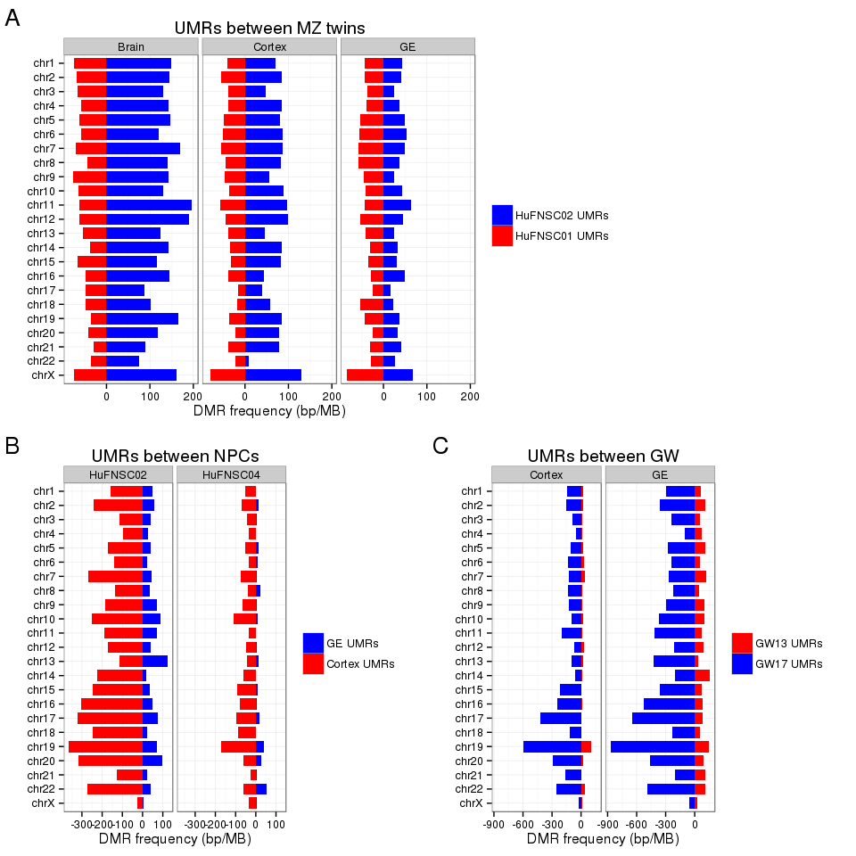
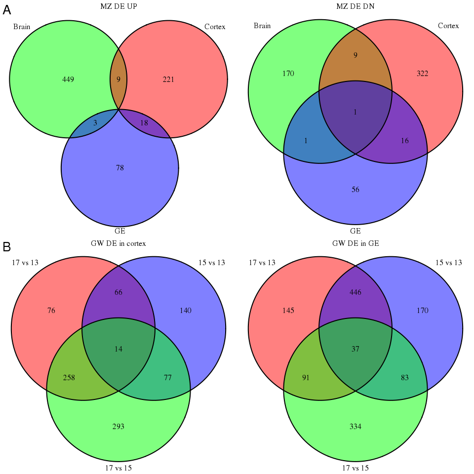
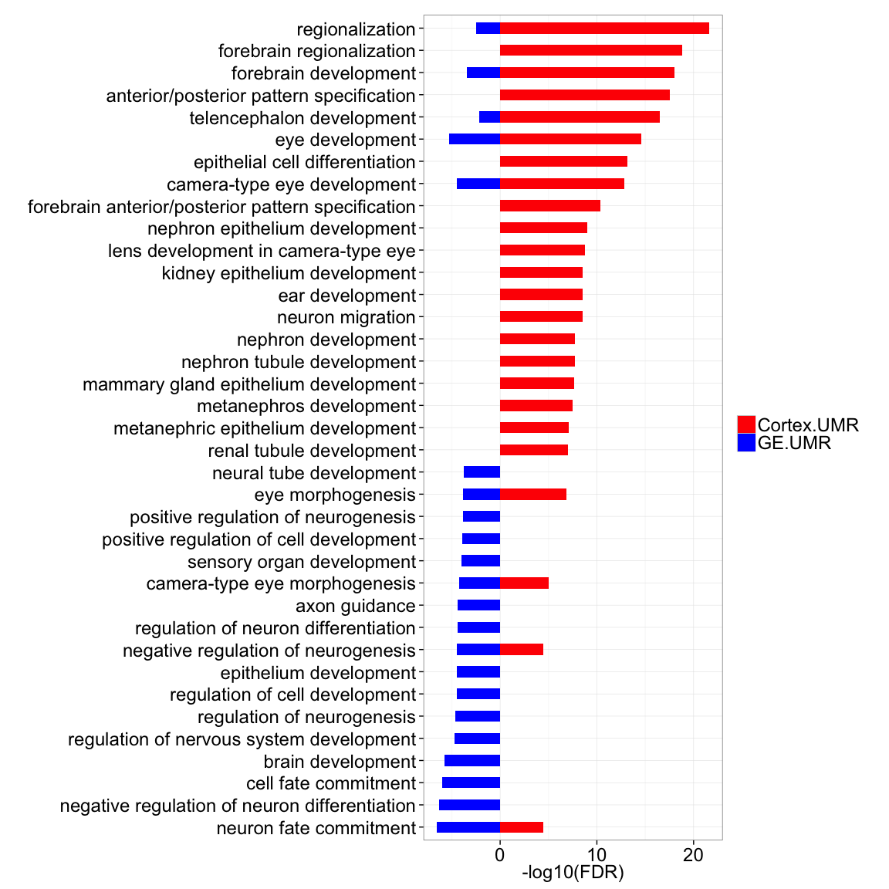

Epigenetic and transcriptional profiling of fetal brain of human monozygotic twins
=============================

## Key points 

* Epigenetic differences between MZ twins are on the same scale as differences between cell types, and are asymmetric between the twins.    
* UMRs between cortex and GE neurospheres are more dynamic in GW17 than GW13, and lead to differential expression of key factors in brain development.    
* Differences between GW are asymmetric, with more GW17-specific UMRs and up-regulated genes, and key neuron fate regulators are epigenetically activated in GW17.      
* Transcriptional activation in neurospheres happens at different gestational stages, with major wave at GW13-GW15 in cortex, and at GW15-GW17 in GE.    

## Abstract
Epigenetic differences between genetically identical monozygotic (MZ) twins are well documented but their emergence and functional significance are poorly understood. Here, we characterized epigenomes and transcriptomes of brain tissue and primary cell types derived from four human fetuses at 3 developmental stages.  Differential methylation analysis identified similar numbers of unmethylated regions (UMRs) between MZ twins and between different cell types. Strikingly, DNA methylation asymmetry was observed in these regions between the twins in cortex and mixed brain tissue, as well as between cortex and GE neurospheres, with more UMRs in cortex than in GE. Among the cell type-specific UMRs proximally associated with protein-coding genes, key factors in brain development, such as GFAP, NFIX and FEZF1, were identified with differential expression between cortex and GE neurospheres. Both epigentic and expressional analysis revealed more dynamic changes between the neurospheres in GW17 compared to GW13. Comparing individuals at different developmental stages found higher number of GW17 specific UMRs and up-regulated genes, associated with neurogenesis. In particular, OLIG2, a neuron fate regulator was epigenetically turned on in GW17 individuals. Moreover, transcriptional activation in neurospheres happens at different gestational stages, with major wave at GW13-GW15 in cortex neurosphere, and at GW15-GW17 in GE neurosphere. Taken together, our results suggest that individual specific DNA methylation patterns can arise as early as GW17 in fetal monozygotic twins, and epigenetic and transcriptional differences accumulates over time during early fetal brain development.

* _Science template: 100-150 words; Current: ~ 250 words_   

## Introduction
### MZ twins 

  * The genomes of monozygotic twins are genetically identical but epigenetically distinct providing evidence for the influence of environment on the phenotype. 
  * When these epigenetic differences arise during development and their consequence is still unknown. 

### Neurospheres Cortex vs GE

  * Genetic mutations to epigenetic regulators and epigenomic alterations are amongst the earliest events in brain cell transformation. [PMID: 18772396](http://www.ncbi.nlm.nih.gov/pubmed/18772396) 
  * Defining the epigenomic landscape of normal human brain cells is an important first step towards defining the degree of epigenomic deregulation associated with transformation. 
  * Adult cerebral cortex neurons are derived from progenitor cells in fetal cortex and ganglionic eminence (GE). [PMID: 12042877](http://www.ncbi.nlm.nih.gov/pubmed/12042877)       
  * Neurospheres provide a powerful model to study neural stem cells, which are thought to be population from which malignant clones arise. 
  * Little is known about epigenetic differences that define neurospheres emerged from distinct brain regions. 

### Gestational week

## Results  
To explore the epigenetic landscape in the developing human brain we performed comprehensive epigenomic profiling of primary brain tissue and neurospheres derived from microdissected cortex and ganglionic eminence brain regions from normal human fetal brain at 13, 15 and 17 gestational weeks (Figure X and Table SX).  , including a 13-gestational-week (GW13) individual (HuFNSC04), a 15-gestational-week (GW15) individual (HuFNSC03), and a pair of 17-gestational-week (GW17) monozygotic twins (HuFNSC01 and HuFNSC02). Epigenomic and transcriptomic sequencing (Figure X? and Table SX) were employed to comprehensively annotate epigenetic and expressional differences associated with MZ twins, by pairwise comparisons between MZ twins within same cell types, neurospheres, by pairwise comparisons between cortex and GE neurospheres within same individuals, and gestational week, by pairwise comparisons between GW13 and GW17 individuals within same cell types (Figure X). _(Need further description of the cell types?)_        
    
  * Figure 1a    
     
  * Figure 1b    
    
    
### MZ twins 

* Similar levels of epigenetic and transcriptional differences between twins and between cell types.    
* UMR asymmetry between twins.       
* UMRs are enriched in promoters, and includes DE genes critical to development (WNT).        
* DE genes are cell types specific and enriched in brain development terms.      
* _Pending: enhancers_.     
  
    To investigate epigenetic differences between monozygotic twins in early development, Methylated DNA immunoprecipitation sequencing (MeDIP-seq) and Methylation-sensitive Restriction Enzyme Sequencing (MRE-Seq) were performed on mixed brain tissue, cortex and GE neurospheres of the GW17 monozygotic twins. Pairwise differential methylation analysis between the twins identified an average of 1568 UMRs in HuFNSC01, and 1881 UMRs in HuFNSC02 across the three cell types, comparable to the number of differences between cortex and GE neuropsheres in these two individuals (Figure X and Table SX). Strikingly, there are 2.3 fold more UMRs in HuFNSC02 compared to HuFNSC01 in the mixed brain tissue, and 1.8 fold in cortex neurospheres (Figure X and SX), suggesting the two individuals might be at different stages of development. On average, 34.3% UMRs are proximally (TSS +/- 1.5kb) associated with genes, 3-fold enriched than expected by chance (Figure SX). Among them, an average of 17 genes are also differential expressed across the three cell types, including WNT pathway proteins such as SFRP1, SFRP2, WNT3 and WNT7A (Figure SX and Table SX). WNT signaling pathway is critical in maintaining normal neurogenesis in developing brain (PMID: 17127312) and plays an important role in glioblastoma (PMID: 23791939).      
            
    Transcriptome analysis of the monozygotic twins revealed on average 470 differential expressed genes across three cell types, among them, GE neurospheres are more homogeneous than the other two cell types with only 173 differential expressed genes (Figure X and Table SX). These genes are mostly cell type specific, with few shared by different cell types (Figure SX), and enriched in neurogenesis and brain development (Figure SX). Isoform analysis identified an average of 2617 genes with cassette exons, 796 are shared by all three cell types (hypergeometric p-value = 0).              
    
* Figure 1c    
         
* Figure S1a    
          
* Figure S2a    
        
* Figure S3a    
      
* Figure S4a      
       
* Figure S5a   
     
    
### Neurospheres cortex vs GE  

* More differences in GW17 than in GW13.   
* UMR asymmetry between cortex and GE.   
* Enrichment of UMRs at ends of chromosomes. 
* GREAT analysis of UMRs showed brain development terms.    
* DE genes with proximal UMRs show key factors in brain development.    
* TFBS overlapping with UMRs asymmetry.   
* DE genes are enriched in neurogenesis and cell migration, and isoforms are enriched in signaling proteins.   
* mCpG provides a stable record of exon usage. _(include?)_    
* _Pending: enhancers_.     
    
     Whole Genome Bisulfite Sequencing (WGBS) was employed to analysis genome-wide DNA methylation status of neurospheres derived from cortex and GE. Cortex-specific and GE-specific UMRs were identified by pairwise comparisons between cell types in each individual, and were supported by corresponding MeDIP-seq and MRE-seq signals (Figure SX). In total, 2178 UMRs were identified in the GW17 individual, an 3-fold increase over the GW13 individual (646 UMRs), suggesting that epigenetic differences between cell types are accumulated over time (Figure X). Interestingly, these UMRs are enriched towards the ends of chromosomes (Figure SX and SX). Among these cell-type specific UMRs, there is an asymmetry between cortex and GE with 3-fold more cortex UMRs than GE UMRs (Figure X and Figure SX), also supported by MeDIP (Figure SX). And overlapping UMRs with transcription factor binding sites (TFBS) showed more TFBSs in cortex UMRs than GE UMRs (Figure X). Cortex UMRs are enriched in forebrain regionalization, while GE UMRs are enriched in neuron fate commitment (Figure X and SX), consistent with their migration patterns that cortex progenitor cells give rise to cerebral cortex neurons while GE progenitor cells give rise to neurons migrates to different part of the brain (PMID: 12042877, 15219738). On average, only 15.8% UMRs are proximally associated with genes, much lower than observed between MZ twins (Figure SX). Three differential expressed genes with proximal cortex UMRs were identified in both individuals: Glial Fibrillary Acidic Protein (GFAP), an astrocyte marker associated with many brain disease including gliomas and astrocytomas (PMID: 11567214, 15498217, 8339269); Nuclear Factor I/X (CCAAT-Binding Transcription Factor, NFIX), an active transcription factor essential for the development of a number of organ systems including brain (PMID: 18477394, 19058033); and FEZ Family Zinc Finger 1 (FEZF1), a transcription repressor involved in the axonal projection and proper termination of olfactory sensory neurons (PMID: 19222525).       
               
     RNA sequencing was performed on cortex and GE neurospheres of all four individuals to annotate expressional differences of the two cell types. There are on average 860 genes differentially expressed, with 382 cortex up-regulated and 456 GE up-regulated genes supported by at least two individuals (hypergeometric p-value = 0). The transcriptomes of GW17 individuals are also more dynamic than GW13 ones, with nearly twice differential expressed genes (Figure X). The differentially expressed genes are enriched in neurogenesis and cell migration in both cortex and GE (Figure SX). Exon-level differential expression analysis identified on average 2054 isoform genes, with 2352 genes shared by at least two individuals enriched in cell signaling activities and EGF protein domains (Figure SX).   
     
* Figure S6    
   
* Figure 1d   
  
* Figure S7b     

* Figure S8   
   
* Figure S1b   
   
* Figure 2a  

* Figure 2b  
   
* Figure S2b    
        
* Figure S5b   
     
* Figure S9  

     
### Gestational week associated  

