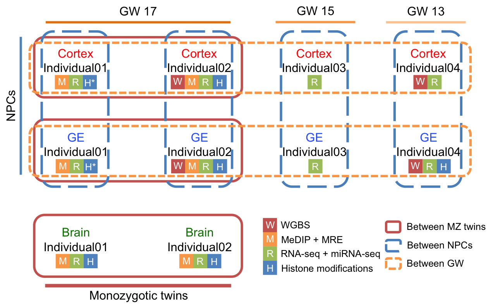
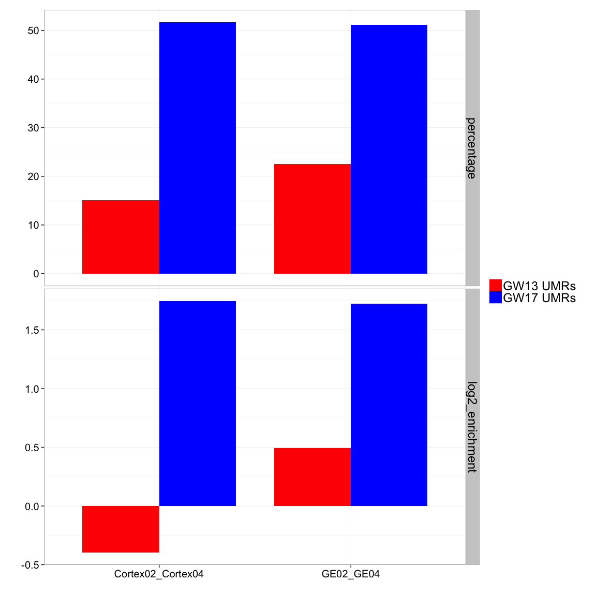
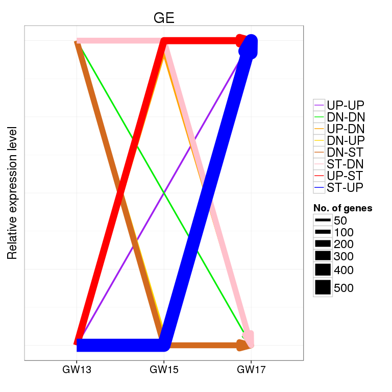

Epigenetic and transcriptional profiling of fetal brain of human monozygotic twins
=============================

## Key points 

* Epigenetic differences between MZ twins are on the same scale as differences between cell types, and are asymmetric between the twins.    
* UMRs between cortex and GE neurospheres are more dynamic in GW17 than GW13, and lead to differential expression of key factors in brain development.    
* Differences between GW are asymmetric, with more GW17-specific UMRs and up-regulated genes, and key neuron fate regulators are epigenetically activated in GW17.      
* Transcriptional activation in neurospheres happens at different gestational stages, with major wave at GW13-GW15 in cortex, and at GW15-GW17 in GE.    

## Abstract
Epigenetic differences between genetically identical monozygotic (MZ) twins are well documented but their emergence and functional significance are poorly understood. Here, we characterized epigenomes and transcriptomes of brain tissue and primary cell types derived from four human fetuses at 3 developmental stages. Differential methylation analysis identified similar numbers of unmethylated regions (UMRs) between MZ twins and between different cell types. Strikingly, DNA methylation asymmetry was observed in these regions between the twins in cortex and mixed brain tissue, as well as between cortex and GE neurospheres with more UMRs in cortex than in GE. Among the cell type-specific UMRs proximally associated with protein-coding genes, key factors in brain development, such as GFAP, NFIX and FEZF1, were identified with differential expression between cortex and GE neurospheres. Both epigentic and expressional analysis revealed more dynamic changes between the neurospheres in gestational week (GW) 17 compared to GW13. Comparing individuals at different developmental stages found higher number of GW17 specific UMRs and up-regulated genes, associated with neurogenesis. In particular, OLIG2, a neuron fate regulator was epigenetically turned on in GW17 individuals. Moreover, transcriptional activation in neurospheres happens at different developmental stages, with the peak of activation during GW13-GW15 in cortex neurosphere, and during GW15-GW17 in GE neurosphere. Taken together, our results suggest that individual specific DNA methylation patterns can arise as early as GW17 in fetal monozygotic twins, and epigenetic and transcriptional differences accumulates over time during early fetal brain development.

* _Science template: 100-150 words; Current: ~ 250 words_   
* Figures and legens can be found [here](https://github.com/gloriali/HirstLab/blob/master/FetalBrain/Summary/Figures.md).        

## Introduction
### MZ twins 

The genomes of monozygotic twins are genetically identical but epigenetically distinct providing evidence for the influence of environment on the phenotype. Post-natal epigenetic and transcriptional differences between human monozygotic (MZ) twins and their biological implications in brain development and diseases {Biondi 1998} {Hu 2006} {Yang 2007} {Lévesque 2014} are well documented. However, when these differences arise during pre-natal development and their consequence is still poorly understood.      

### Neurospheres Cortex vs GE

Brain tumors are a collection of neoplasms highly lethal in both children and adults {Deangelis 2001}. Genetic mutations to epigenetic regulators and epigenomic alterations are amongst the earliest events in brain cell transformation {Parsons 2008}. Defining the epigenomic landscape of normal human brain cells is an important first step towards defining the degree of epigenomic deregulation associated with transformation. Neurospheres provide a powerful model to study neural stem cells, which are thought to be population from which malignant clones arise {Lee 2005}. However, little is known about epigenetic differences that define neurospheres emerged from distinct brain regions.      

### Gestational week

Adult cerebral cortex neurons are derived from progenitor cells in fetal cortex and ganglionic eminence (GE) {Nadarajah 2002}. The early fetal period, which begins at gestational week (GW) 8 and extends through midgestation, is a critical period in neocortex development involving massive neurogenesis and migration {Stiles 2010}. But epigenetic and transcriptional changes during this period have never been closely examined.     

## Results  
To explore the epigenetic and expressional landscape in the developing human brain we performed comprehensive epigenomic and transcriptomic profiling of primary brain tissue and neurospheres derived from microdissected cortex and GE brain regions from normal human fetal at GW13, GW15 and GW17 (Figure 1A), including a pair of monozygotic twins. Epigenomic and transcriptomic sequencing were employed to comprehensively annotate epigenetic and expressional differences associated with MZ twins by pairwise comparisons between MZ twins within same cell types, neurospheres by pairwise comparisons between cortex and GE derived neurospheres within same individuals, and gestational week by pairwise comparisons across gestational weeks (Figure 1B and Table S1). _(Need further description of the cell types?)_        
    
  * Figure 1a    
     
  * Figure 1b    
    
    
### MZ twins 

* Similar levels of epigenetic and transcriptional differences between twins and between cell types.    
* UMR asymmetry between twins.       
* UMRs are enriched in promoters, and includes DE genes critical to development (WNT).        
* DE genes are cell types specific and enriched in brain development terms.      
  
    To investigate epigenetic differences between monozygotic twins in early brain development, Methylated DNA Immunoprecipitation Sequencing (MeDIP-seq) and Methylation-sensitive Restriction Enzyme Sequencing (MRE-Seq) were performed on mixed brain tissue, cortex and GE neurospheres of the GW17 monozygotic twins. Pairwise differential methylation analysis between the twins identified an average of 1568 UMRs in HuFNSC01, and 1881 UMRs in HuFNSC02 across the three cell types, comparable to the number of differences between cortex and GE neuropsheres in these two individuals (Figure 1C and Table S2). Strikingly, there are 2.3 fold more UMRs in HuFNSC02 compared to HuFNSC01 in the mixed brain tissue, and 1.8 fold in cortex neurospheres (Figure 1C and S1), suggesting the two individuals might be at slightly different stages of development. On average, 34.3% UMRs are proximally (TSS +/- 1.5kb) associated with protein-coding genes, 3-fold enriched than expected by chance (Figure S2). Among them, an average of 17 genes are also differential expressed across the three cell types, including WNT pathway proteins such as SFRP1, SFRP2, WNT3 and WNT7A (Figure S3A). WNT signaling pathway is critical in maintaining normal neurogenesis in developing brain (PMID: 17127312) and plays an important role in glioblastoma (PMID: 23791939). Taken together, epigenetic differences between monozygotic twins exist as early as GW17, and lead to differential expression of critical developmental genes.         
            
    Transcriptome analysis of the monozygotic twins revealed on average 470 differential expressed genes across three cell types, among them, GE neurospheres are more homogeneous than the other two cell types with only 173 differential expressed genes (Figure 1C and Table S3). These genes are mostly cell type specific, with few shared by different cell types (Figure S4A), and enriched in neurogenesis and brain development (Figure S5A). Isoform analysis identified an average of 2617 genes with cassette exons, 796 are shared by all three cell types (hypergeometric p-value = 0).              
    
* Figure 1c    
         
* Figure S1a    
          
* Figure S2a    
        
* Figure S3a    
      
* Figure S4a      
       
* Figure S5a   
     
    
### Neurospheres cortex vs GE  

* More epigenetic and transcriptional differences in GW17 than in GW13.   
* UMR asymmetry between cortex and GE.   
* Enrichment of UMRs at ends of chromosomes. 
* GREAT analysis of UMRs showed brain development terms.    
* DE genes with proximal UMRs show key factors in brain development.   
* UMRs are enriched in enhancers.     
* TFBS overlapping with UMRs asymmetry.   
* DE genes are enriched in neurogenesis and cell migration, and isoforms are enriched in signaling proteins.   
* mCpG provides a stable record of exon usage. _(include?)_    
    
     Whole Genome Bisulfite Sequencing (WGBS) was employed to analysis genome-wide DNA methylation status of neurospheres derived from cortex and GE. Cortex-specific and GE-specific UMRs were identified by pairwise comparisons between cell types in each of the four individuals, and were supported by corresponding MeDIP-seq and MRE-seq signals (Figure S6A). In total, 2178 UMRs were identified in the GW17 individual, a 3-fold increase over the GW13 individual (646 UMRs), suggesting that epigenetic differences between cell types are accumulated over time (Figure 2A and Table S4). Among these cell-type specific UMRs, there is an asymmetry between cortex and GE with 3-fold more cortex UMRs than GE UMRs (Figures 2A and Figure S1B), also supported by MeDIP (Figure S6B). And overlapping UMRs with transcription factor binding sites (TFBS) showed more TFBSs in cortex UMRs than GE UMRs (Figure S7). Cortex UMRs are enriched in forebrain regionalization, while GE UMRs are enriched in neuron fate commitment (Figure 2B and S6C), consistent with their migration patterns that cortex progenitor cells give rise to cerebral cortex neurons while GE progenitor cells give rise to neurons migrates to different part of the brain (PMID: 12042877, 15219738). On average, only 15.8% UMRs are proximally associated with genes, much lower than observed between MZ twins (Figure S2B). Three differential expressed genes with proximal cortex UMRs were identified in both individuals (Figure 2C): Glial Fibrillary Acidic Protein (GFAP), an astrocyte marker associated with many brain disease including gliomas and astrocytomas (PMID: 11567214, 15498217, 8339269); Nuclear Factor I/X (CCAAT-Binding Transcription Factor, NFIX), an active transcription factor essential for the development of a number of organ systems including brain (PMID: 18477394, 19058033); and FEZ Family Zinc Finger 1 (FEZF1), a transcription repressor involved in the axonal projection and proper termination of olfactory sensory neurons (PMID: 19222525). In short, epigenetic differences between cortex and GE neurospheres accumulate in time, and lead to differential expression of key factors in brain development.        
               
     RNA sequencing was performed on cortex and GE neurospheres of all four individuals to annotate expressional differences of the two cell types. There are on average 860 genes differentially expressed, with 382 cortex up-regulated and 456 GE up-regulated genes supported by at least two individuals (hypergeometric p-value = 0; Table S3). The transcriptomes of GW17 individuals are also more dynamic than GW13 ones, with nearly twice differential expressed genes (Figure 2A). The differentially expressed genes are enriched in neurogenesis and cell migration in both cortex and GE (Figure S5B). Exon-level differential expression analysis identified on average 2054 isoform genes, with 2352 genes shared by at least two individuals enriched in cell signaling activities and EGF protein domains (Figure S8).   
     
* Figure S6    
   
* Figure 2a   
  
* Figure S7     

* Figure S1b   
   
* Figure 2b  
   
* Figure S2b    
        
* Figure S5b   
     
* Figure S8  
     
     
### Gestational week associated  

* More GW17-specific UMRs and upregulated genes than GW13.    
* UMRs are strongly associated with neuron differentiation and brain development GREAT terms.      
* OLIG2, a neuron fate regulator was epigenetically turned on in GW17 individuals by GW17 UMRs.    
* TFBS overlapping with UMRs asymmetry.       
* GW17 UMRs are enriched for enhancers but GW13 UMRs are not.       
* Transcriptiome clustering and stage-specific DE gene profiles found transcriptional activation in neurospheres happens at different gestational stages, with major wave at GW13-GW15 in cortex neurosphere, and at GW15-GW17 in GE neurosphere.      
* DE genes are enriched in neurogenesis and cell migration, and isoforms are enriched in signaling proteins.      

     To analysis the dynamic epigenetic change during early brain development, UMRs between GW13 and GW17 were identified with WGBS data in neurospheres cortex and GE respectively. On average, there are 1692 GW17-specific UMRs, 3.76-fold over GW13-specific UMRs (Figure 3A and Table S4). GW17 UMRs are enriched in oligodendrocyte and glio cell development, while GW13 UMRs are enriched in neuron fate commitment in cortex and regionalization in GE neurospheres (Figure S9), suggesting epigenetic changes are critical for early fetal brain development. Furthermore, GW17 UMRs are 3-fold enriched in enhancer regions marked by H3K4me1 while GW13 UMRs are not enriched (Figure 3B). And overlapping UMRs with transcription factor binding sites (TFBS) showed more TFBSs in GW17 UMRs than GW13 UMRs (Figure 3C). On average, only 165 UMRs are proximally associated with protein-coding genes (Figure S2C), and among them, 14% genes are also differentially expressed (Figure S3C). Particularly, OLIG2 (Figure 3D), a neuron fate regulator (ref), were epigenetically turned on in both cortex and GE neurospheres. In sum, epigenetic differences between gestational weeks are asymmetric, with more UMRs in GW17 overlapping with regulatory elements, and lead to activation of key neuron fate regulators in later period.       
     
     Unsupervised clustering of expression of protein-coding genes, exons, and highly expressed (RPM > 100) miRNAs all showed the same clustering, with mostly cell-type specific clusters except cortex neurospheres in GW13 clustering with GW13 GE, away from other cortex neurospheres (Figure S10). This suggest that transcriptomes between neuron stem cells are still very similar at the beginning of fetal period, and may continue to diverge at different paces later on. To further classify dynamic transcriptional changes during early brain development, differential expression between GW13, GW15, and GW17 were identified (Figure 4A and Table S3), and categorized into eight profile groups: up regulated in both GW13-GW15 and GW15-GW17, down regulated at both stages, up and then down regulated, down and then up regulated, not differentially expressed and then up regulated, not differentially expressed and then down regulated, up regulated and then not differentially expressed, down regulated and then not differentially expressed. In cortex neuropshere, the major differential expression profile group was up regulation between GW13-GW15 (Figure 4C), while in GE neurosphere, it was up regulation between GW15-GW17 (Figure 4D). This further supports transcriptional clustering that GW15 cortex clustered with GW17 cortex, while GW15 GE is closer related to GW13 GE, suggesting the peak of transcriptional activation in different neuron stem cells happen at different developmental stages. Several key factors in brain development follow this pattern (Figures 4E), including aforementioned OLIG2. Taken together, transcriptional activation happens at different paces in different neuron progenitor cell types.          

* Figure 3a
    
* Figure S9
  
* Figure 3b
    
* Figure 3c
    
* Figure S2c    
        
* Figure S3c    
      
* Figure S10
 
* Figure 4a    
 
* Figure 4b   
 
* Figure 4c      

* Figure 4d    

* Figure 4e 
 

    Our analysis of neuron progenitor cell types has revealed novel insight into early fetal brain development. These findings suggest evidence of epigenetic differences between monozygotic twins during early fetal period, and provide a comprehensive reference of neuron progenitor cells for future disease studies.      
    
