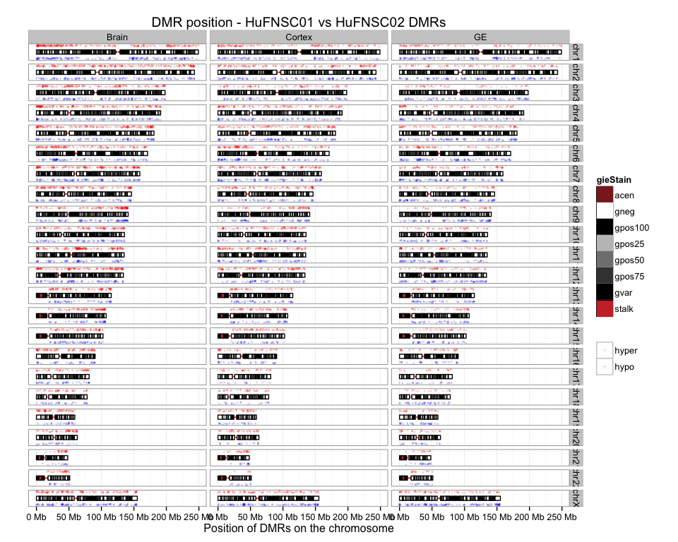

# FetalBrain - Summary
Gloria Li  
October 21, 2014  

Updated: Wed Oct 22 17:46:55 2014

## Introduction
### Neurospheres Cortex vs GE

* Genetic mutations to epigenetic regulators and epigenomic alterations are amongst the earliest events in brain cell transformation. [PMID: 18772396](http://www.ncbi.nlm.nih.gov/pubmed/18772396) 
* Defining the epigenomic landscape of normal human brain cells is an important first step towards defining the degree of epigenomic deregulation associated with transformation.
* Neurospheres provide a powerful model to study neural stem cells, which are thought to be population from which malignant clones arise. 
* Little is known about epigenetic differences that define neurospheres emerged from distinct brain regions. 

### MZ twins 

* The genomes of monozygotic twins are genetically identical but epigenetically distinct providing evidence for the influence of environment on the phenotype. 
* When these epigenetic differences arise during development and their consequence is still unknown. 

## Results
### Neurospheres Cortex derived vs GE derived 
#### Asymmetry between Cortex and GE UMRs  

* On average, there are , __4.26__-fold enrichment in total UMR length in Cortex compared to GE, __3.86__ in HuFNSC02, and __6.29__ in HuFNSC04.    
* The asymmetry appears to be global, in all chromosomes. It is reproduced in the two individuals, and __supported in MeDIP UMRs__.  
* __Single CpG level__ differential methylation is __symmetric__, but the asymmetry on __UMR level__ can be reproduced with different cutoffs. However, there are __no apparent differences in UMR length__ between Cortex and GE, suggesting that there are more __orphan GE UM CpGs__ that was not able to form UMRs than in Cortex. 

<!-- html table generated in R 3.1.1 by xtable 1.7-3 package -->
<!-- Wed Oct 22 17:47:33 2014 -->
<TABLE border=1>
<TR> <TH> Sample </TH> <TH> Total.DMR </TH> <TH> Hyper.DMR </TH> <TH> Hypo.DMR </TH>  </TR>
  <TR> <TD align="center"> Cortex-HuFNSC02_GE-HuFNSC02 </TD> <TD align="center"> 2178 </TD> <TD align="center"> 420 </TD> <TD align="center"> 1758 </TD> </TR>
  <TR> <TD align="center"> Cortex-HuFNSC04_GE-HuFNSC04 </TD> <TD align="center"> 646 </TD> <TD align="center">  91 </TD> <TD align="center"> 555 </TD> </TR>
   </TABLE>
  

#### GREAT analysis on Cortex and GE UMRs show brain development terms  

* UMRs in both Cortex and GE show enrichment in __neuron fate commitment__ biological process, __transcriptional regulation__ activities, __Homeobox__ protein domain, and __abnormal brain development__ mouse phenotype.    
* Cortex UMRs are also enriched in __forebrain regionalization__ and __pattern specification__ processes.   
* GREAT enriched terms are also __supported by MeDIP__.    
* In HuFNSC04, Cortex UMRs show __abnormal brain development__ in Mouse Phenotype, but are also enriched in __kidney-related processes__.   

 
 
 
 

#### UMR breakdown in chromatin states 

* __Pending: ChromHMM__

#### DE genes with proximal UMRs show key factors in brain development 

+ On average, there are __40__ UMRs proximally associated with protein-coding genes (TSS +/- 1500bp), __2.85%__ of all UMRs.         
+ There are average __8__ proximal UMRs associated with DE genes, __19.88%__ of all proximal UMRs, __much lower than observed in breast and supported by MeDIP__, _maybe more UMRs in enhancers? (ChromHMM)_. Among them, there are __46.67%__ unique DE genes change in the same direction as the UMRs, __also lower than observed in breast and supported by MeDIP__.         
+ The intersect between two individuals are __significant__ in Cortex UMRs. There are 3 DE genes with proximal Cortex UMR that are shared by both individual: __GFAP, NFIX, FEZF1__.   
+ __GFAP__: Glial Fibrillary Acidic Protein. It is used as a marker to distinguish astrocytes from other glial cells during development. Reported associated with many brain disease, including alexanders disease, [PMID: 11567214](http://www.ncbi.nlm.nih.gov/pubmed?cmd=search&term=11567214&dopt=b); gliomas, UP reduce tumor and induce differentiation, [PMID: 15498217](http://www.ncbi.nlm.nih.gov/pubmed?cmd=search&term=15498217&dopt=b), and astrocytoma, tumor suppressor [PMID: 8339269](http://www.ncbi.nlm.nih.gov/pubmed?cmd=search&term=8339269&dopt=b) etc.    
+ __NFIX__: Nuclear Factor I/X (CCAAT-Binding Transcription Factor). _Also supported by MeDIP._ A transcription factor that binds the palindromic sequence in viral and cellular promoters, capable of activating transcription and replication. It is essential for the development of a number of organ systems including brain and bone, e.g. severe neuroanatomical defects (may function in the repression of neural stem cell proliferation or in cell migration) [PMID: 18477394](http://www.ncbi.nlm.nih.gov/pubmed/18477394), [PMID: 19058033](http://www.ncbi.nlm.nih.gov/pubmed/19058033). 
+ __FEZF1__: FEZ Family Zinc Finger 1 (ZNF312B). Transcription repressor. Involved in the axonal projection and proper termination of olfactory sensory neurons. Regulates non-cell-autonomously the layer formation of the olfactory bulb development and the interneurons. May be required for correct rostral migration of the interneuron progenitors. DNA demethylation and histone acetylation in its promoter activates its expression and oncogene effect in gastric cancer [PMID: 19318583](http://www.ncbi.nlm.nih.gov/pubmed?cmd=search&term=19318583&dopt=b). _We observe DN-regulation in Cortex and Cortex UMR though._     
+ There are no intersect in pc genes with proximal GE UMRs between the two individual.  
+ There are __no significant__ DAVID enrichment terms due to the small number of genes.  

<!-- html table generated in R 3.1.1 by xtable 1.7-3 package -->
<!-- Wed Oct 22 17:47:37 2014 -->
<TABLE border=1>
<TR> <TH>  </TH> <TH> proximal.UMRs </TH> <TH> unique.genes </TH> <TH> DE.DMRs </TH> <TH> unique.DE.genes </TH> <TH> same.direction </TH>  </TR>
  <TR> <TD align="center"> GE_UMRs-HuFNSC02 </TD> <TD align="center">  17 </TD> <TD align="center">  17 </TD> <TD align="center">   4 </TD> <TD align="center">   4 </TD> <TD align="center">   1 </TD> </TR>
  <TR> <TD align="center"> Cortex_UMRs-HuFNSC02 </TD> <TD align="center">  53 </TD> <TD align="center">  52 </TD> <TD align="center">  15 </TD> <TD align="center">  14 </TD> <TD align="center">   8 </TD> </TR>
  <TR> <TD align="center"> GE_UMRs-HuFNSC04 </TD> <TD align="center">   9 </TD> <TD align="center">  11 </TD> <TD align="center">   3 </TD> <TD align="center">   3 </TD> <TD align="center">   2 </TD> </TR>
  <TR> <TD align="center"> Cortex_UMRs-HuFNSC04 </TD> <TD align="center">  82 </TD> <TD align="center">  84 </TD> <TD align="center">  10 </TD> <TD align="center">   9 </TD> <TD align="center">   3 </TD> </TR>
   </TABLE>
  

##### DE genes with proximal Cortex UMRs  

* HuFNSC02    

<!-- html table generated in R 3.1.1 by xtable 1.7-3 package -->
<!-- Wed Oct 22 17:47:39 2014 -->
<TABLE border=1>
<TR> <TH> name </TH> <TH> description </TH> <TH> DE </TH>  </TR>
  <TR> <TD align="right"> CD58 </TD> <TD align="right"> CD58_molecule </TD> <TD align="center"> UP </TD> </TR>
  <TR> <TD align="right"> RGS10 </TD> <TD align="right"> regulator_of_G-protein_signaling_10 </TD> <TD align="center"> UP </TD> </TR>
  <TR> <TD align="right"> ADM </TD> <TD align="right"> adrenomedullin </TD> <TD align="center"> UP </TD> </TR>
  <TR> <TD align="right"> NKX2-1 </TD> <TD align="right"> NK2_homeobox_1 </TD> <TD align="center"> DN </TD> </TR>
  <TR> <TD align="right"> OTX2 </TD> <TD align="right"> orthodenticle_homeobox_2 </TD> <TD align="center"> DN </TD> </TR>
  <TR> <TD align="right"> USP43 </TD> <TD align="right"> ubiquitin_specific_peptidase_43 </TD> <TD align="center"> DN </TD> </TR>
  <TR> <TD align="right"> GFAP </TD> <TD align="right"> glial_fibrillary_acidic_protein </TD> <TD align="center"> UP </TD> </TR>
  <TR> <TD align="right"> NFIX </TD> <TD align="right"> nuclear_factor_I/X_(CCAAT-binding_transcription_factor) </TD> <TD align="center"> UP </TD> </TR>
  <TR> <TD align="right"> GAD1 </TD> <TD align="right"> glutamate_decarboxylase_1_(brain,_67kDa) </TD> <TD align="center"> DN </TD> </TR>
  <TR> <TD align="right"> FZD7 </TD> <TD align="right"> frizzled_family_receptor_7 </TD> <TD align="center"> UP </TD> </TR>
  <TR> <TD align="right"> FZD5 </TD> <TD align="right"> frizzled_family_receptor_5 </TD> <TD align="center"> DN </TD> </TR>
  <TR> <TD align="right"> CXCR7 </TD> <TD align="right"> chemokine_(C-X-C_motif)_receptor_7 </TD> <TD align="center"> DN </TD> </TR>
  <TR> <TD align="right"> ZAR1 </TD> <TD align="right"> zygote_arrest_1 </TD> <TD align="center"> UP </TD> </TR>
  <TR> <TD align="right"> FEZF1 </TD> <TD align="right"> FEZ_family_zinc_finger_1 </TD> <TD align="center"> DN </TD> </TR>
   </TABLE>

* HuFNSC04    

<!-- html table generated in R 3.1.1 by xtable 1.7-3 package -->
<!-- Wed Oct 22 17:47:39 2014 -->
<TABLE border=1>
<TR> <TH> name </TH> <TH> description </TH> <TH> DE </TH>  </TR>
  <TR> <TD align="right"> FAM5C </TD> <TD align="right"> family_with_sequence_similarity_5,_member_C </TD> <TD align="center"> UP </TD> </TR>
  <TR> <TD align="right"> STXBP6 </TD> <TD align="right"> syntaxin_binding_protein_6_(amisyn) </TD> <TD align="center"> DN </TD> </TR>
  <TR> <TD align="right"> GFAP </TD> <TD align="right"> glial_fibrillary_acidic_protein </TD> <TD align="center"> UP </TD> </TR>
  <TR> <TD align="right"> NFIX </TD> <TD align="right"> nuclear_factor_I/X_(CCAAT-binding_transcription_factor) </TD> <TD align="center"> UP </TD> </TR>
  <TR> <TD align="right"> MEIS1 </TD> <TD align="right"> Meis_homeobox_1 </TD> <TD align="center"> DN </TD> </TR>
  <TR> <TD align="right"> FSIP2 </TD> <TD align="right"> fibrous_sheath_interacting_protein_2 </TD> <TD align="center"> DN </TD> </TR>
  <TR> <TD align="right"> INSM1 </TD> <TD align="right"> insulinoma-associated_1 </TD> <TD align="center"> DN </TD> </TR>
  <TR> <TD align="right"> FEZF1 </TD> <TD align="right"> FEZ_family_zinc_finger_1 </TD> <TD align="center"> DN </TD> </TR>
  <TR> <TD align="right"> C9orf172 </TD> <TD align="right"> chromosome_9_open_reading_frame_172 </TD> <TD align="center"> DN </TD> </TR>
   </TABLE>

##### DE genes with proximal GE UMRs  

* HuFNSC02    

<!-- html table generated in R 3.1.1 by xtable 1.7-3 package -->
<!-- Wed Oct 22 17:47:39 2014 -->
<TABLE border=1>
<TR> <TH> name </TH> <TH> description </TH> <TH> DE </TH>  </TR>
  <TR> <TD align="right"> PAX6 </TD> <TD align="right"> paired_box_6 </TD> <TD align="center"> UP </TD> </TR>
  <TR> <TD align="right"> TMEM132B </TD> <TD align="right"> transmembrane_protein_132B </TD> <TD align="center"> UP </TD> </TR>
  <TR> <TD align="right"> PID1 </TD> <TD align="right"> phosphotyrosine_interaction_domain_containing_1 </TD> <TD align="center"> DN </TD> </TR>
  <TR> <TD align="right"> ZIC3 </TD> <TD align="right"> Zic_family_member_3 </TD> <TD align="center"> UP </TD> </TR>
   </TABLE>

* HuFNSC04    

<!-- html table generated in R 3.1.1 by xtable 1.7-3 package -->
<!-- Wed Oct 22 17:47:39 2014 -->
<TABLE border=1>
<TR> <TH> name </TH> <TH> description </TH> <TH> DE </TH>  </TR>
  <TR> <TD align="right"> MN1 </TD> <TD align="right"> meningioma_(disrupted_in_balanced_translocation)_1 </TD> <TD align="center"> DN </TD> </TR>
  <TR> <TD align="right"> PNCK </TD> <TD align="right"> pregnancy_up-regulated_non-ubiquitously_expressed_CaM_kinase </TD> <TD align="center"> UP </TD> </TR>
   </TABLE>

#### UMR distal associated genes  

* __PENDING__   

#### Asymmetry in overlapping UMRs with TFBSs 

* Overlap UMRs with transcription factor binding sites and count No. of overlapping TFBSs for each TF showed similar asymmetry between Cortex and GE in both individuals, with TFBSs enriched in Cortex UMRs for most TFs.  __Opposite trend in HuFNSC01 MeDIP__.     
* However, in general, the correlation of TFBS Cortex UMR vs GE UMR fold change between the two individual is quite low, only 0.2. __Same in MeDIP__.     
* There are 15 TFs that are at least 3-fold enriched in TFBSs overlapping Cortex UMRs compared to GE UMRs as shown below.   

 <!-- html table generated in R 3.1.1 by xtable 1.7-3 package -->
<!-- Wed Oct 22 17:47:40 2014 -->
<TABLE border=1>
<TR> <TH> TF </TH> <TH> Cortex02UMR </TH> <TH> GE02UMR </TH> <TH> Ratio02 </TH> <TH> Cortex04UMR </TH> <TH> GE04UMR </TH> <TH> Ratio04 </TH>  </TR>
  <TR> <TD align="center"> TAF7 </TD> <TD align="center">  12 </TD> <TD align="center">   4 </TD> <TD align="center"> 3.00 </TD> <TD align="center">  10 </TD> <TD align="center">   1 </TD> <TD align="center"> 10.00 </TD> </TR>
  <TR> <TD align="center"> TFAP2A </TD> <TD align="center">  30 </TD> <TD align="center">  10 </TD> <TD align="center"> 3.00 </TD> <TD align="center">  20 </TD> <TD align="center">   3 </TD> <TD align="center"> 6.67 </TD> </TR>
  <TR> <TD align="center"> USF1 </TD> <TD align="center">  67 </TD> <TD align="center">  21 </TD> <TD align="center"> 3.19 </TD> <TD align="center">  31 </TD> <TD align="center">   6 </TD> <TD align="center"> 5.17 </TD> </TR>
  <TR> <TD align="center"> ELF1 </TD> <TD align="center">  45 </TD> <TD align="center">  14 </TD> <TD align="center"> 3.21 </TD> <TD align="center">  39 </TD> <TD align="center">   5 </TD> <TD align="center"> 7.80 </TD> </TR>
  <TR> <TD align="center"> GATA2 </TD> <TD align="center"> 116 </TD> <TD align="center">  36 </TD> <TD align="center"> 3.22 </TD> <TD align="center">  43 </TD> <TD align="center">   4 </TD> <TD align="center"> 10.75 </TD> </TR>
  <TR> <TD align="center"> ESR1 </TD> <TD align="center">  55 </TD> <TD align="center">  17 </TD> <TD align="center"> 3.24 </TD> <TD align="center">   9 </TD> <TD align="center">   3 </TD> <TD align="center"> 3.00 </TD> </TR>
  <TR> <TD align="center"> CTCF </TD> <TD align="center"> 197 </TD> <TD align="center">  56 </TD> <TD align="center"> 3.52 </TD> <TD align="center"> 105 </TD> <TD align="center">  16 </TD> <TD align="center"> 6.56 </TD> </TR>
  <TR> <TD align="center"> TFAP2C </TD> <TD align="center">  32 </TD> <TD align="center">   9 </TD> <TD align="center"> 3.56 </TD> <TD align="center">  23 </TD> <TD align="center">   5 </TD> <TD align="center"> 4.60 </TD> </TR>
  <TR> <TD align="center"> MYC </TD> <TD align="center"> 133 </TD> <TD align="center">  36 </TD> <TD align="center"> 3.69 </TD> <TD align="center">  84 </TD> <TD align="center">   5 </TD> <TD align="center"> 16.80 </TD> </TR>
  <TR> <TD align="center"> FOXA1 </TD> <TD align="center">  89 </TD> <TD align="center">  24 </TD> <TD align="center"> 3.71 </TD> <TD align="center">  26 </TD> <TD align="center">   5 </TD> <TD align="center"> 5.20 </TD> </TR>
  <TR> <TD align="center"> TCF7L2 </TD> <TD align="center">  82 </TD> <TD align="center">  22 </TD> <TD align="center"> 3.73 </TD> <TD align="center">  47 </TD> <TD align="center">   4 </TD> <TD align="center"> 11.75 </TD> </TR>
  <TR> <TD align="center"> ZNF263 </TD> <TD align="center">  31 </TD> <TD align="center">   8 </TD> <TD align="center"> 3.88 </TD> <TD align="center">  23 </TD> <TD align="center">   5 </TD> <TD align="center"> 4.60 </TD> </TR>
  <TR> <TD align="center"> E2F1 </TD> <TD align="center">  35 </TD> <TD align="center">   9 </TD> <TD align="center"> 3.89 </TD> <TD align="center">  38 </TD> <TD align="center">   5 </TD> <TD align="center"> 7.60 </TD> </TR>
  <TR> <TD align="center"> TAL1 </TD> <TD align="center">  16 </TD> <TD align="center">   4 </TD> <TD align="center"> 4.00 </TD> <TD align="center">   5 </TD> <TD align="center">   1 </TD> <TD align="center"> 5.00 </TD> </TR>
  <TR> <TD align="center"> GATA3 </TD> <TD align="center">  63 </TD> <TD align="center">   8 </TD> <TD align="center"> 7.88 </TD> <TD align="center">  18 </TD> <TD align="center">   1 </TD> <TD align="center"> 18.00 </TD> </TR>
   </TABLE>

#### DE genes between Cortex and GE are enriched in neuron development and cell migration   

* On average, there are __860__ genes differentially expressed between cortex and GE, among them, __454__ are upregulated in cortex, and __406__ are downregulated.    
* __382__ Cortex up-regulated genes, and __456__ GE up-regulated genes are shared by at least two individuals.    
* DAVID enrichment analysis show significant enrichment in __neuronal development__ and __cell migration__ terms, GE up-regulated genes are enriched in __EGF-related__ protein domains as well. 

<!-- html table generated in R 3.1.1 by xtable 1.7-3 package -->
<!-- Wed Oct 22 17:47:40 2014 -->
<TABLE border=1>
<TR> <TH>  </TH> <TH> UP </TH> <TH> DN </TH> <TH> DE </TH>  </TR>
  <TR> <TD> HuFNSC01 </TD> <TD align="center"> 403 </TD> <TD align="center"> 508 </TD> <TD align="center"> 911 </TD> </TR>
  <TR> <TD> HuFNSC02 </TD> <TD align="center"> 588 </TD> <TD align="center"> 640 </TD> <TD align="center"> 1228 </TD> </TR>
  <TR> <TD> HuFNSC03 </TD> <TD align="center"> 447 </TD> <TD align="center"> 227 </TD> <TD align="center"> 674 </TD> </TR>
  <TR> <TD> HuFNSC04 </TD> <TD align="center"> 378 </TD> <TD align="center"> 249 </TD> <TD align="center"> 627 </TD> </TR>
   </TABLE>
  

#### Isoforms between Cortex and GE are enriched in cell signaling proteins

* On average, __2054__ genes are identified as isoforms between cortex and GE in each individual. __2352__ genes are shared in at least two individuals.       
* Individual specific isoforms between cortex and GE have __no__ significantly enriched terms, suggesting they are more likely random events without biological functions.          
* Isoforms shared by at least two individuals are enriched in terms related to __cellular signaling__. InterPro shows enrichment in __EGF protein domain__.         

<!-- html table generated in R 3.1.1 by xtable 1.7-3 package -->
<!-- Wed Oct 22 17:47:41 2014 -->
<TABLE border=1>
<TR> <TH>  </TH> <TH> DE_genes </TH> <TH> DE_exons </TH> <TH> with_expressed_genes </TH> <TH> isoform_exons </TH> <TH> exclude_DE_genes </TH> <TH> isoform_genes </TH>  </TR>
  <TR> <TD> cortex01_GE01_summary </TD> <TD align="center"> 911 </TD> <TD align="center"> 32372 </TD> <TD align="center"> 18968 </TD> <TD align="center"> 8440 </TD> <TD align="center"> 7962 </TD> <TD align="center"> 2447 </TD> </TR>
  <TR> <TD> cortex02_GE02_summary </TD> <TD align="center"> 1228 </TD> <TD align="center"> 35196 </TD> <TD align="center"> 21880 </TD> <TD align="center"> 8163 </TD> <TD align="center"> 7374 </TD> <TD align="center"> 2298 </TD> </TR>
  <TR> <TD> cortex03_GE03_summary </TD> <TD align="center"> 674 </TD> <TD align="center"> 29617 </TD> <TD align="center"> 13746 </TD> <TD align="center"> 6401 </TD> <TD align="center"> 6022 </TD> <TD align="center"> 2086 </TD> </TR>
  <TR> <TD> cortex04_GE04_summary </TD> <TD align="center"> 627 </TD> <TD align="center"> 22386 </TD> <TD align="center"> 11253 </TD> <TD align="center"> 4323 </TD> <TD align="center"> 4259 </TD> <TD align="center"> 1386 </TD> </TR>
   </TABLE>
 

#### mCpG is a stable mark for exon transcription during development     

* mCpG at cassette exon boundaries has similar pattern to expressed in both exons.   
* mCpG for cassette exons between cortex and GE neurospheres shows no significant differences.   
* Results from both WGBS (HuFNSC02 & HuFNSC04) and MeDIP (HuFNSC01 & HuFNSC02) support the assumption that mCpG is a stable mark for exon transcription during development.   
* mCpG exon marking is established between neurospheres. _Needs further validation against H1_.   

    

#### H3K36me3 in exon bodies - normalization issue? 

* H3K36me3 in expressed in both / not expressed exons shows no significant differences between HuFNSC01 and HuFNSC02.    
* H3K36me3 in cassette exons in HuFNSC01 are enriched in GE compared to cortex. However, it is not reproduced in HuFNSC02, where there is no significant differences between cortex and GE. _Not sure what to make of this. Are there any potential bias?_    

  

### MZ twins  
#### UMR asymmetry between MZ twins in Brain and Cortex 

+ There is an __asymmetry__ between UMRs in HuFNSC01 and HuFNSC02 in the Brain and Cortex neurosphere, but __not__ in GE neurosphere. Fold change in total UMR length HuFNSC02/HuFNSC01 in Brain is __2.33__, in Cortex is __1.76__, and in GE is __0.89__.    
  
<!-- html table generated in R 3.1.1 by xtable 1.7-3 package -->
<!-- Wed Oct 22 17:47:44 2014 -->
<TABLE border=1>
<TR> <TH> Sample </TH> <TH> Total.DMR </TH> <TH> Hyper.DMR </TH> <TH> Hypo.DMR </TH>  </TR>
  <TR> <TD> Brain-HuFNSC01_Brain-HuFNSC02 </TD> <TD align="center"> 4472 </TD> <TD align="center"> 2750 </TD> <TD align="center"> 1722 </TD> </TR>
  <TR> <TD> Cortex-HuFNSC01_Cortex-HuFNSC02 </TD> <TD align="center"> 3161 </TD> <TD align="center"> 1758 </TD> <TD align="center"> 1403 </TD> </TR>
  <TR> <TD> GE-HuFNSC01_GE-HuFNSC02 </TD> <TD align="center"> 2716 </TD> <TD align="center"> 1136 </TD> <TD align="center"> 1580 </TD> </TR>
   </TABLE>
  

#### GREAT analysis on MZ UMRs are enriched in Homeobox and brain development  

* __Homeobox__ protein domain is enriched in all UMR lists.   
* __Brain development related__ biological processes are enriched in most lists.   

   
   

#### UMR breakdown in chromatin states 

* __Pending: ChromHMM__

#### MZ UMRs in Brain have less CpGs in CGIs  

  + Majority of UMR CpGs overlap with genebody, on average __62.59%__. And UMR CpGs are __3-fold__ enriched in promoter regions, with on average __34.29%__ UMR CpGs are in promoter regions, __39.54%__ of CpGs in UMRs overlap with CGIs, __5.34-fold__ than expected by random. 
  + Brain seems to have less CGI/promoter UMRs.   
  
<!-- For the entire genome, 3727169 out of 28217448 CpGs overlap with TSS +/- 1500bp promoter regions -->  
<!-- For the entire genome, 2089538 out of 28217448 CpGs overlap with CGIs -->

 

#### DE genes with proximal UMRs between MZ are cell type specific  

  + On average, there are __405__ UMRs proximally (TSS +/- 1500bp) associated with protein-coding genes, __11.75%__ of all UMRs, _similar to UMRs between Cortex and GE_.         
  + On average, there are __17__ proximal UMRs associated with DE genes, __4.24%__ of all proximal DMRs, _much less than UMRs between Cortex and GE (less functional?)_. Among them, there are __52.53%__ unique DE genes change in the same direction as the UMRs, _similar to UMRs between Cortex and GE_.         
  + Proximal UMR genes are mostly __cell type specific__, but the overlap is still statistically significant.  
  + No overlap between Brain and Cortex for proximal HuFNSC01 UMR DE genes, only one for HuFNSC02, __neuropeptide_Y__.   

<!-- html table generated in R 3.1.1 by xtable 1.7-3 package -->
<!-- Wed Oct 22 17:47:48 2014 -->
<TABLE border=1>
<TR> <TH>  </TH> <TH> DMRs </TH> <TH> unique.genes </TH> <TH> DE.DMRs </TH> <TH> unique.DE.genes </TH> <TH> same.direction </TH>  </TR>
  <TR> <TD> Brain01_Brain02_hyper </TD> <TD align="center"> 432 </TD> <TD align="center"> 473 </TD> <TD align="center">  26 </TD> <TD align="center">  26 </TD> <TD align="center">  10 </TD> </TR>
  <TR> <TD> Brain01_Brain02_hypo </TD> <TD align="center"> 367 </TD> <TD align="center"> 409 </TD> <TD align="center">  20 </TD> <TD align="center">  20 </TD> <TD align="center">  13 </TD> </TR>
  <TR> <TD> Cortex01_Cortex02_hyper </TD> <TD align="center"> 587 </TD> <TD align="center"> 659 </TD> <TD align="center">  30 </TD> <TD align="center">  28 </TD> <TD align="center">  17 </TD> </TR>
  <TR> <TD> Cortex01_Cortex02_hypo </TD> <TD align="center"> 316 </TD> <TD align="center"> 342 </TD> <TD align="center">  24 </TD> <TD align="center">  22 </TD> <TD align="center">  11 </TD> </TR>
  <TR> <TD> GE01_GE02_hyper </TD> <TD align="center"> 369 </TD> <TD align="center"> 402 </TD> <TD align="center">   1 </TD> <TD align="center">   1 </TD> <TD align="center">   1 </TD> </TR>
  <TR> <TD> GE01_GE02_hypo </TD> <TD align="center"> 361 </TD> <TD align="center"> 398 </TD> <TD align="center">   2 </TD> <TD align="center">   2 </TD> <TD align="center">   0 </TD> </TR>
   </TABLE>
  

##### HuFNSC01 UMRs proximal associated DE genes

<!-- html table generated in R 3.1.1 by xtable 1.7-3 package -->
<!-- Wed Oct 22 17:47:48 2014 -->
<TABLE border=1>
<TR> <TH> CellType </TH> <TH> name </TH> <TH> description </TH> <TH> DM </TH> <TH> DE </TH>  </TR>
  <TR> <TD align="center"> Brain </TD> <TD align="right"> SAMD11 </TD> <TD align="right"> sterile_alpha_motif_domain_containing_11 </TD> <TD align="center"> hypo </TD> <TD align="center"> UP </TD> </TR>
  <TR> <TD align="center"> Brain </TD> <TD align="right"> ITGA8 </TD> <TD align="right"> integrin,_alpha_8 </TD> <TD align="center"> hypo </TD> <TD align="center"> UP </TD> </TR>
  <TR> <TD align="center"> Brain </TD> <TD align="right"> EMX2 </TD> <TD align="right"> empty_spiracles_homeobox_2 </TD> <TD align="center"> hypo </TD> <TD align="center"> DN </TD> </TR>
  <TR> <TD align="center"> Brain </TD> <TD align="right"> ARNTL2 </TD> <TD align="right"> aryl_hydrocarbon_receptor_nuclear_translocator-like_2 </TD> <TD align="center"> hypo </TD> <TD align="center"> UP </TD> </TR>
  <TR> <TD align="center"> Brain </TD> <TD align="right"> CPNE8 </TD> <TD align="right"> copine_VIII </TD> <TD align="center"> hypo </TD> <TD align="center"> DN </TD> </TR>
  <TR> <TD align="center"> Brain </TD> <TD align="right"> PCDH17 </TD> <TD align="right"> protocadherin_17 </TD> <TD align="center"> hypo </TD> <TD align="center"> DN </TD> </TR>
  <TR> <TD align="center"> Brain </TD> <TD align="right">  </TD> <TD align="right"> Putative_3-phosphoinositide-dependent_protein_kinase_2 </TD> <TD align="center"> hypo </TD> <TD align="center"> UP </TD> </TR>
  <TR> <TD align="center"> Brain </TD> <TD align="right"> CPNE7 </TD> <TD align="right"> copine_VII </TD> <TD align="center"> hypo </TD> <TD align="center"> UP </TD> </TR>
  <TR> <TD align="center"> Brain </TD> <TD align="right"> PKDREJ </TD> <TD align="right"> polycystic_kidney_disease_(polycystin)_and_REJ_homolog_(sperm_receptor_for_egg_jelly_homolog,_sea_urchin) </TD> <TD align="center"> hypo </TD> <TD align="center"> UP </TD> </TR>
  <TR> <TD align="center"> Brain </TD> <TD align="right"> THRB </TD> <TD align="right"> thyroid_hormone_receptor,_beta </TD> <TD align="center"> hypo </TD> <TD align="center"> UP </TD> </TR>
  <TR> <TD align="center"> Brain </TD> <TD align="right"> SFRP2 </TD> <TD align="right"> secreted_frizzled-related_protein_2 </TD> <TD align="center"> hypo </TD> <TD align="center"> DN </TD> </TR>
  <TR> <TD align="center"> Brain </TD> <TD align="right"> IER3 </TD> <TD align="right"> immediate_early_response_3 </TD> <TD align="center"> hypo </TD> <TD align="center"> UP </TD> </TR>
  <TR> <TD align="center"> Brain </TD> <TD align="right"> ZBTB12 </TD> <TD align="right"> zinc_finger_and_BTB_domain_containing_12 </TD> <TD align="center"> hypo </TD> <TD align="center"> UP </TD> </TR>
  <TR> <TD align="center"> Brain </TD> <TD align="right"> MDGA1 </TD> <TD align="right"> MAM_domain_containing_glycosylphosphatidylinositol_anchor_1 </TD> <TD align="center"> hypo </TD> <TD align="center"> DN </TD> </TR>
  <TR> <TD align="center"> Brain </TD> <TD align="right"> EPHA1 </TD> <TD align="right"> EPH_receptor_A1 </TD> <TD align="center"> hypo </TD> <TD align="center"> UP </TD> </TR>
  <TR> <TD align="center"> Brain </TD> <TD align="right">  </TD> <TD align="right"> Protein_kinase-like_protein_SgK196 </TD> <TD align="center"> hypo </TD> <TD align="center"> UP </TD> </TR>
  <TR> <TD align="center"> Brain </TD> <TD align="right"> TOX </TD> <TD align="right"> thymocyte_selection-associated_high_mobility_group_box </TD> <TD align="center"> hypo </TD> <TD align="center"> DN </TD> </TR>
  <TR> <TD align="center"> Brain </TD> <TD align="right"> NCOA2 </TD> <TD align="right"> nuclear_receptor_coactivator_2 </TD> <TD align="center"> hypo </TD> <TD align="center"> UP </TD> </TR>
  <TR> <TD align="center"> Brain </TD> <TD align="right"> GPR64 </TD> <TD align="right"> G_protein-coupled_receptor_64 </TD> <TD align="center"> hypo </TD> <TD align="center"> UP </TD> </TR>
  <TR> <TD align="center"> Brain </TD> <TD align="right"> TRPC5 </TD> <TD align="right"> transient_receptor_potential_cation_channel,_subfamily_C,_member_5 </TD> <TD align="center"> hypo </TD> <TD align="center"> DN </TD> </TR>
  <TR> <TD align="center"> Cortex </TD> <TD align="right"> ELTD1 </TD> <TD align="right"> EGF,_latrophilin_and_seven_transmembrane_domain_containing_1 </TD> <TD align="center"> hypo </TD> <TD align="center"> UP </TD> </TR>
  <TR> <TD align="center"> Cortex </TD> <TD align="right"> CRABP2 </TD> <TD align="right"> cellular_retinoic_acid_binding_protein_2 </TD> <TD align="center"> hypo </TD> <TD align="center"> DN </TD> </TR>
  <TR> <TD align="center"> Cortex </TD> <TD align="right"> SPOCK2 </TD> <TD align="right"> sparc/osteonectin,_cwcv_and_kazal-like_domains_proteoglycan_(testican)_2 </TD> <TD align="center"> hypo </TD> <TD align="center"> DN </TD> </TR>
  <TR> <TD align="center"> Cortex </TD> <TD align="right"> VAX1 </TD> <TD align="right"> ventral_anterior_homeobox_1 </TD> <TD align="center"> hypo </TD> <TD align="center"> UP </TD> </TR>
  <TR> <TD align="center"> Cortex </TD> <TD align="right"> LRRC10B </TD> <TD align="right"> leucine_rich_repeat_containing_10B </TD> <TD align="center"> hypo </TD> <TD align="center"> DN </TD> </TR>
  <TR> <TD align="center"> Cortex </TD> <TD align="right"> NDUFA4L2 </TD> <TD align="right"> NADH_dehydrogenase_(ubiquinone)_1_alpha_subcomplex,_4-like_2 </TD> <TD align="center"> hypo </TD> <TD align="center"> DN </TD> </TR>
  <TR> <TD align="center"> Cortex </TD> <TD align="right"> FOXO1 </TD> <TD align="right"> forkhead_box_O1 </TD> <TD align="center"> hypo </TD> <TD align="center"> UP </TD> </TR>
  <TR> <TD align="center"> Cortex </TD> <TD align="right"> C16orf74 </TD> <TD align="right"> chromosome_16_open_reading_frame_74 </TD> <TD align="center"> hypo </TD> <TD align="center"> DN </TD> </TR>
  <TR> <TD align="center"> Cortex </TD> <TD align="right"> WNT3 </TD> <TD align="right"> wingless-type_MMTV_integration_site_family,_member_3 </TD> <TD align="center"> hypo </TD> <TD align="center"> DN </TD> </TR>
  <TR> <TD align="center"> Cortex </TD> <TD align="right"> CHST9 </TD> <TD align="right"> carbohydrate_(N-acetylgalactosamine_4-0)_sulfotransferase_9 </TD> <TD align="center"> hypo </TD> <TD align="center"> UP </TD> </TR>
  <TR> <TD align="center"> Cortex </TD> <TD align="right"> CD97 </TD> <TD align="right"> CD97_molecule </TD> <TD align="center"> hypo </TD> <TD align="center"> DN </TD> </TR>
  <TR> <TD align="center"> Cortex </TD> <TD align="right"> RNF144A </TD> <TD align="right"> ring_finger_protein_144A </TD> <TD align="center"> hypo </TD> <TD align="center"> UP </TD> </TR>
  <TR> <TD align="center"> Cortex </TD> <TD align="right"> DLX1 </TD> <TD align="right"> distal-less_homeobox_1 </TD> <TD align="center"> hypo </TD> <TD align="center"> UP </TD> </TR>
  <TR> <TD align="center"> Cortex </TD> <TD align="right"> OLIG1 </TD> <TD align="right"> oligodendrocyte_transcription_factor_1 </TD> <TD align="center"> hypo </TD> <TD align="center"> UP </TD> </TR>
  <TR> <TD align="center"> Cortex </TD> <TD align="right"> SCUBE1 </TD> <TD align="right"> signal_peptide,_CUB_domain,_EGF-like_1 </TD> <TD align="center"> hypo </TD> <TD align="center"> DN </TD> </TR>
  <TR> <TD align="center"> Cortex </TD> <TD align="right"> GRIA1 </TD> <TD align="right"> glutamate_receptor,_ionotropic,_AMPA_1 </TD> <TD align="center"> hypo </TD> <TD align="center"> DN </TD> </TR>
  <TR> <TD align="center"> Cortex </TD> <TD align="right"> MMD2 </TD> <TD align="right"> monocyte_to_macrophage_differentiation-associated_2 </TD> <TD align="center"> hypo </TD> <TD align="center"> UP </TD> </TR>
  <TR> <TD align="center"> Cortex </TD> <TD align="right"> SEMA3E </TD> <TD align="right"> sema_domain,_immunoglobulin_domain_(Ig),_short_basic_domain,_secreted,_(semaphorin)_3E </TD> <TD align="center"> hypo </TD> <TD align="center"> DN </TD> </TR>
  <TR> <TD align="center"> Cortex </TD> <TD align="right"> VIPR2 </TD> <TD align="right"> vasoactive_intestinal_peptide_receptor_2 </TD> <TD align="center"> hypo </TD> <TD align="center"> DN </TD> </TR>
  <TR> <TD align="center"> Cortex </TD> <TD align="right"> AP1S2 </TD> <TD align="right"> adaptor-related_protein_complex_1,_sigma_2_subunit </TD> <TD align="center"> hypo </TD> <TD align="center"> DN </TD> </TR>
  <TR> <TD align="center"> Cortex </TD> <TD align="right"> SH3KBP1 </TD> <TD align="right"> SH3-domain_kinase_binding_protein_1 </TD> <TD align="center"> hypo </TD> <TD align="center"> UP </TD> </TR>
  <TR> <TD align="center"> GE </TD> <TD align="right"> FAM5B </TD> <TD align="right"> family_with_sequence_similarity_5,_member_B </TD> <TD align="center"> hypo </TD> <TD align="center"> DN </TD> </TR>
  <TR> <TD align="center"> GE </TD> <TD align="right"> DLL1 </TD> <TD align="right"> delta-like_1_(Drosophila) </TD> <TD align="center"> hypo </TD> <TD align="center"> DN </TD> </TR>
   </TABLE>

##### HuFNSC02 UMRs proximal associated DE genes

<!-- html table generated in R 3.1.1 by xtable 1.7-3 package -->
<!-- Wed Oct 22 17:47:48 2014 -->
<TABLE border=1>
<TR> <TH> CellType </TH> <TH> name </TH> <TH> description </TH> <TH> DM </TH> <TH> DE </TH>  </TR>
  <TR> <TD align="center"> Brain </TD> <TD align="right"> EPHA8 </TD> <TD align="right"> EPH_receptor_A8 </TD> <TD align="center"> hyper </TD> <TD align="center"> UP </TD> </TR>
  <TR> <TD align="center"> Brain </TD> <TD align="right"> IFI6 </TD> <TD align="right"> interferon,_alpha-inducible_protein_6 </TD> <TD align="center"> hyper </TD> <TD align="center"> DN </TD> </TR>
  <TR> <TD align="center"> Brain </TD> <TD align="right"> BMP8A </TD> <TD align="right"> bone_morphogenetic_protein_8a </TD> <TD align="center"> hyper </TD> <TD align="center"> UP </TD> </TR>
  <TR> <TD align="center"> Brain </TD> <TD align="right"> ALX3 </TD> <TD align="right"> ALX_homeobox_3 </TD> <TD align="center"> hyper </TD> <TD align="center"> UP </TD> </TR>
  <TR> <TD align="center"> Brain </TD> <TD align="right"> NRGN </TD> <TD align="right"> neurogranin_(protein_kinase_C_substrate,_RC3) </TD> <TD align="center"> hyper </TD> <TD align="center"> UP </TD> </TR>
  <TR> <TD align="center"> Brain </TD> <TD align="right"> C1QL4 </TD> <TD align="right"> complement_component_1,_q_subcomponent-like_4 </TD> <TD align="center"> hyper </TD> <TD align="center"> UP </TD> </TR>
  <TR> <TD align="center"> Brain </TD> <TD align="right"> CSRP2 </TD> <TD align="right"> cysteine_and_glycine-rich_protein_2 </TD> <TD align="center"> hyper </TD> <TD align="center"> DN </TD> </TR>
  <TR> <TD align="center"> Brain </TD> <TD align="right"> TTYH2 </TD> <TD align="right"> tweety_homolog_2_(Drosophila) </TD> <TD align="center"> hyper </TD> <TD align="center"> DN </TD> </TR>
  <TR> <TD align="center"> Brain </TD> <TD align="right"> DTNB </TD> <TD align="right"> dystrobrevin,_beta </TD> <TD align="center"> hyper </TD> <TD align="center"> UP </TD> </TR>
  <TR> <TD align="center"> Brain </TD> <TD align="right"> CXCR7 </TD> <TD align="right"> chemokine_(C-X-C_motif)_receptor_7 </TD> <TD align="center"> hyper </TD> <TD align="center"> UP </TD> </TR>
  <TR> <TD align="center"> Brain </TD> <TD align="right"> VHL </TD> <TD align="right"> von_Hippel-Lindau_tumor_suppressor </TD> <TD align="center"> hyper </TD> <TD align="center"> UP </TD> </TR>
  <TR> <TD align="center"> Brain </TD> <TD align="right"> EPHA6 </TD> <TD align="right"> EPH_receptor_A6 </TD> <TD align="center"> hyper </TD> <TD align="center"> UP </TD> </TR>
  <TR> <TD align="center"> Brain </TD> <TD align="right"> CAMK2N2 </TD> <TD align="right"> calcium/calmodulin-dependent_protein_kinase_II_inhibitor_2 </TD> <TD align="center"> hyper </TD> <TD align="center"> UP </TD> </TR>
  <TR> <TD align="center"> Brain </TD> <TD align="right"> TBC1D1 </TD> <TD align="right"> TBC1_(tre-2/USP6,_BUB2,_cdc16)_domain_family,_member_1 </TD> <TD align="center"> hyper </TD> <TD align="center"> DN </TD> </TR>
  <TR> <TD align="center"> Brain </TD> <TD align="right"> NMU </TD> <TD align="right"> neuromedin_U </TD> <TD align="center"> hyper </TD> <TD align="center"> DN </TD> </TR>
  <TR> <TD align="center"> Brain </TD> <TD align="right"> FSTL5 </TD> <TD align="right"> follistatin-like_5 </TD> <TD align="center"> hyper </TD> <TD align="center"> DN </TD> </TR>
  <TR> <TD align="center"> Brain </TD> <TD align="right"> CARTPT </TD> <TD align="right"> CART_prepropeptide </TD> <TD align="center"> hyper </TD> <TD align="center"> DN </TD> </TR>
  <TR> <TD align="center"> Brain </TD> <TD align="right"> EDIL3 </TD> <TD align="right"> EGF-like_repeats_and_discoidin_I-like_domains_3 </TD> <TD align="center"> hyper </TD> <TD align="center"> UP </TD> </TR>
  <TR> <TD align="center"> Brain </TD> <TD align="right"> CCDC90A </TD> <TD align="right"> coiled-coil_domain_containing_90A </TD> <TD align="center"> hyper </TD> <TD align="center"> UP </TD> </TR>
  <TR> <TD align="center"> Brain </TD> <TD align="right">  </TD> <TD align="right"> LOC401296_proteinUncharacterized_protein </TD> <TD align="center"> hyper </TD> <TD align="center"> UP </TD> </TR>
  <TR> <TD align="center"> Brain </TD> <TD align="right"> NPY </TD> <TD align="right"> neuropeptide_Y </TD> <TD align="center"> hyper </TD> <TD align="center"> UP </TD> </TR>
  <TR> <TD align="center"> Brain </TD> <TD align="right"> SFRP1 </TD> <TD align="right"> secreted_frizzled-related_protein_1 </TD> <TD align="center"> hyper </TD> <TD align="center"> DN </TD> </TR>
  <TR> <TD align="center"> Brain </TD> <TD align="right"> TOX </TD> <TD align="right"> thymocyte_selection-associated_high_mobility_group_box </TD> <TD align="center"> hyper </TD> <TD align="center"> DN </TD> </TR>
  <TR> <TD align="center"> Brain </TD> <TD align="right"> ENTPD2 </TD> <TD align="right"> ectonucleoside_triphosphate_diphosphohydrolase_2 </TD> <TD align="center"> hyper </TD> <TD align="center"> UP </TD> </TR>
  <TR> <TD align="center"> Brain </TD> <TD align="right"> KLHL4 </TD> <TD align="right"> kelch-like_4_(Drosophila) </TD> <TD align="center"> hyper </TD> <TD align="center"> UP </TD> </TR>
  <TR> <TD align="center"> Brain </TD> <TD align="right"> SOX3 </TD> <TD align="right"> SRY_(sex_determining_region_Y)-box_3 </TD> <TD align="center"> hyper </TD> <TD align="center"> DN </TD> </TR>
  <TR> <TD align="center"> Cortex </TD> <TD align="right"> DMRTA2 </TD> <TD align="right"> DMRT-like_family_A2 </TD> <TD align="center"> hyper </TD> <TD align="center"> DN </TD> </TR>
  <TR> <TD align="center"> Cortex </TD> <TD align="right"> NPR1 </TD> <TD align="right"> natriuretic_peptide_receptor_A/guanylate_cyclase_A_(atrionatriuretic_peptide_receptor_A) </TD> <TD align="center"> hyper </TD> <TD align="center"> UP </TD> </TR>
  <TR> <TD align="center"> Cortex </TD> <TD align="right"> PTPRE </TD> <TD align="right"> protein_tyrosine_phosphatase,_receptor_type,_E </TD> <TD align="center"> hyper </TD> <TD align="center"> DN </TD> </TR>
  <TR> <TD align="center"> Cortex </TD> <TD align="right"> PDE3B </TD> <TD align="right"> phosphodiesterase_3B,_cGMP-inhibited </TD> <TD align="center"> hyper </TD> <TD align="center"> UP </TD> </TR>
  <TR> <TD align="center"> Cortex </TD> <TD align="right"> LDHA </TD> <TD align="right"> lactate_dehydrogenase_A </TD> <TD align="center"> hyper </TD> <TD align="center"> DN </TD> </TR>
  <TR> <TD align="center"> Cortex </TD> <TD align="right"> GNG3 </TD> <TD align="right"> guanine_nucleotide_binding_protein_(G_protein),_gamma_3 </TD> <TD align="center"> hyper </TD> <TD align="center"> DN </TD> </TR>
  <TR> <TD align="center"> Cortex </TD> <TD align="right"> METTL7B </TD> <TD align="right"> methyltransferase_like_7B </TD> <TD align="center"> hyper </TD> <TD align="center"> DN </TD> </TR>
  <TR> <TD align="center"> Cortex </TD> <TD align="right"> NME3 </TD> <TD align="right"> non-metastatic_cells_3,_protein_expressed_in </TD> <TD align="center"> hyper </TD> <TD align="center"> DN </TD> </TR>
  <TR> <TD align="center"> Cortex </TD> <TD align="right"> GRIN2A </TD> <TD align="right"> glutamate_receptor,_ionotropic,_N-methyl_D-aspartate_2A </TD> <TD align="center"> hyper </TD> <TD align="center"> UP </TD> </TR>
  <TR> <TD align="center"> Cortex </TD> <TD align="right"> NOL3 </TD> <TD align="right"> nucleolar_protein_3_(apoptosis_repressor_with_CARD_domain) </TD> <TD align="center"> hyper </TD> <TD align="center"> DN </TD> </TR>
  <TR> <TD align="center"> Cortex </TD> <TD align="right"> NR1D1 </TD> <TD align="right"> nuclear_receptor_subfamily_1,_group_D,_member_1 </TD> <TD align="center"> hyper </TD> <TD align="center"> DN </TD> </TR>
  <TR> <TD align="center"> Cortex </TD> <TD align="right"> IGFBP4 </TD> <TD align="right"> insulin-like_growth_factor_binding_protein_4 </TD> <TD align="center"> hyper </TD> <TD align="center"> UP </TD> </TR>
  <TR> <TD align="center"> Cortex </TD> <TD align="right"> TBX2 </TD> <TD align="right"> T-box_2 </TD> <TD align="center"> hyper </TD> <TD align="center"> UP </TD> </TR>
  <TR> <TD align="center"> Cortex </TD> <TD align="right"> LBH </TD> <TD align="right"> limb_bud_and_heart_development_homolog_(mouse) </TD> <TD align="center"> hyper </TD> <TD align="center"> DN </TD> </TR>
  <TR> <TD align="center"> Cortex </TD> <TD align="right"> INSIG2 </TD> <TD align="right"> insulin_induced_gene_2 </TD> <TD align="center"> hyper </TD> <TD align="center"> DN </TD> </TR>
  <TR> <TD align="center"> Cortex </TD> <TD align="right"> WNT7A </TD> <TD align="right"> wingless-type_MMTV_integration_site_family,_member_7A </TD> <TD align="center"> hyper </TD> <TD align="center"> DN </TD> </TR>
  <TR> <TD align="center"> Cortex </TD> <TD align="right"> SNCA </TD> <TD align="right"> synuclein,_alpha_(non_A4_component_of_amyloid_precursor) </TD> <TD align="center"> hyper </TD> <TD align="center"> UP </TD> </TR>
  <TR> <TD align="center"> Cortex </TD> <TD align="right"> NPNT </TD> <TD align="right"> nephronectin </TD> <TD align="center"> hyper </TD> <TD align="center"> DN </TD> </TR>
  <TR> <TD align="center"> Cortex </TD> <TD align="right"> SFRP2 </TD> <TD align="right"> secreted_frizzled-related_protein_2 </TD> <TD align="center"> hyper </TD> <TD align="center"> UP </TD> </TR>
  <TR> <TD align="center"> Cortex </TD> <TD align="right"> PRR16 </TD> <TD align="right"> proline_rich_16 </TD> <TD align="center"> hyper </TD> <TD align="center"> UP </TD> </TR>
  <TR> <TD align="center"> Cortex </TD> <TD align="right"> STC2 </TD> <TD align="right"> stanniocalcin_2 </TD> <TD align="center"> hyper </TD> <TD align="center"> DN </TD> </TR>
  <TR> <TD align="center"> Cortex </TD> <TD align="right"> SNCB </TD> <TD align="right"> synuclein,_beta </TD> <TD align="center"> hyper </TD> <TD align="center"> DN </TD> </TR>
  <TR> <TD align="center"> Cortex </TD> <TD align="right"> ITPR3 </TD> <TD align="right"> inositol_1,4,5-trisphosphate_receptor,_type_3 </TD> <TD align="center"> hyper </TD> <TD align="center"> UP </TD> </TR>
  <TR> <TD align="center"> Cortex </TD> <TD align="right"> NPY </TD> <TD align="right"> neuropeptide_Y </TD> <TD align="center"> hyper </TD> <TD align="center"> DN </TD> </TR>
  <TR> <TD align="center"> Cortex </TD> <TD align="right"> SEMA3D </TD> <TD align="right"> sema_domain,_immunoglobulin_domain_(Ig),_short_basic_domain,_secreted,_(semaphorin)_3D </TD> <TD align="center"> hyper </TD> <TD align="center"> UP </TD> </TR>
  <TR> <TD align="center"> Cortex </TD> <TD align="right"> VGF </TD> <TD align="right"> VGF_nerve_growth_factor_inducible </TD> <TD align="center"> hyper </TD> <TD align="center"> UP </TD> </TR>
  <TR> <TD align="center"> Cortex </TD> <TD align="right"> CAV1 </TD> <TD align="right"> caveolin_1,_caveolae_protein,_22kDa </TD> <TD align="center"> hyper </TD> <TD align="center"> UP </TD> </TR>
  <TR> <TD align="center"> Cortex </TD> <TD align="right"> SHROOM2 </TD> <TD align="right"> shroom_family_member_2 </TD> <TD align="center"> hyper </TD> <TD align="center"> UP </TD> </TR>
  <TR> <TD align="center"> GE </TD> <TD align="right"> DBC1 </TD> <TD align="right"> deleted_in_bladder_cancer_1 </TD> <TD align="center"> hyper </TD> <TD align="center"> DN </TD> </TR>
   </TABLE>

#### UMR distal associated genes  

* __PENDING__   

#### Overlapping UMRs with TFBSs show asymmetric in Brain and Cortex  

* Overlap UMRs with transcription factor binding sites and count No. of overlapping TFBSs for each TF showed similar asymmetry in Brain and Cortex, but is symmetric in GE. The correlation between Brain and Cortex is also very low, __0.15__.    
* With 2-fold change cutoff, there are 18 TFs enriched in HuFNSC02 in both Brain and Cortex.   

 <!-- html table generated in R 3.1.1 by xtable 1.7-3 package -->
<!-- Wed Oct 22 17:47:48 2014 -->
<TABLE border=1>
<TR> <TH> TF </TH> <TH> Brain.hypo </TH> <TH> Brain.hyper </TH> <TH> Ratio.Brain </TH> <TH> Cortex.hypo </TH> <TH> Cortex.hyper </TH> <TH> Ratio.Cortex </TH>  </TR>
  <TR> <TD align="center"> ESRRA </TD> <TD align="center">   1 </TD> <TD align="center">   7 </TD> <TD align="center"> 0.14 </TD> <TD align="center">   1 </TD> <TD align="center">   5 </TD> <TD align="center"> 0.20 </TD> </TR>
  <TR> <TD align="center"> TAL1 </TD> <TD align="center">  10 </TD> <TD align="center">  42 </TD> <TD align="center"> 0.24 </TD> <TD align="center">   9 </TD> <TD align="center">  34 </TD> <TD align="center"> 0.26 </TD> </TR>
  <TR> <TD align="center"> HNF4A </TD> <TD align="center">  15 </TD> <TD align="center">  49 </TD> <TD align="center"> 0.31 </TD> <TD align="center">  11 </TD> <TD align="center">  27 </TD> <TD align="center"> 0.41 </TD> </TR>
  <TR> <TD align="center"> HNF4G </TD> <TD align="center">  13 </TD> <TD align="center">  41 </TD> <TD align="center"> 0.32 </TD> <TD align="center">  10 </TD> <TD align="center">  29 </TD> <TD align="center"> 0.34 </TD> </TR>
  <TR> <TD align="center"> ZNF217 </TD> <TD align="center">   6 </TD> <TD align="center">  17 </TD> <TD align="center"> 0.35 </TD> <TD align="center">   6 </TD> <TD align="center">  14 </TD> <TD align="center"> 0.43 </TD> </TR>
  <TR> <TD align="center"> EBF1 </TD> <TD align="center">  49 </TD> <TD align="center"> 130 </TD> <TD align="center"> 0.38 </TD> <TD align="center">  48 </TD> <TD align="center">  98 </TD> <TD align="center"> 0.49 </TD> </TR>
  <TR> <TD align="center"> FOS </TD> <TD align="center">  47 </TD> <TD align="center"> 123 </TD> <TD align="center"> 0.38 </TD> <TD align="center">  43 </TD> <TD align="center"> 118 </TD> <TD align="center"> 0.36 </TD> </TR>
  <TR> <TD align="center"> GATA1 </TD> <TD align="center">  31 </TD> <TD align="center">  73 </TD> <TD align="center"> 0.42 </TD> <TD align="center">  32 </TD> <TD align="center">  80 </TD> <TD align="center"> 0.40 </TD> </TR>
  <TR> <TD align="center"> HSF1 </TD> <TD align="center">   3 </TD> <TD align="center">   7 </TD> <TD align="center"> 0.43 </TD> <TD align="center">   2 </TD> <TD align="center">   6 </TD> <TD align="center"> 0.33 </TD> </TR>
  <TR> <TD align="center"> FOXA2 </TD> <TD align="center">  26 </TD> <TD align="center">  60 </TD> <TD align="center"> 0.43 </TD> <TD align="center">  14 </TD> <TD align="center">  36 </TD> <TD align="center"> 0.39 </TD> </TR>
  <TR> <TD align="center"> GATA3 </TD> <TD align="center">  35 </TD> <TD align="center">  80 </TD> <TD align="center"> 0.44 </TD> <TD align="center">  22 </TD> <TD align="center">  52 </TD> <TD align="center"> 0.42 </TD> </TR>
  <TR> <TD align="center"> GATA2 </TD> <TD align="center">  58 </TD> <TD align="center"> 130 </TD> <TD align="center"> 0.45 </TD> <TD align="center">  39 </TD> <TD align="center">  96 </TD> <TD align="center"> 0.41 </TD> </TR>
  <TR> <TD align="center"> STAT3 </TD> <TD align="center">  41 </TD> <TD align="center">  91 </TD> <TD align="center"> 0.45 </TD> <TD align="center">  26 </TD> <TD align="center">  87 </TD> <TD align="center"> 0.30 </TD> </TR>
  <TR> <TD align="center"> CEBPD </TD> <TD align="center">  22 </TD> <TD align="center">  48 </TD> <TD align="center"> 0.46 </TD> <TD align="center">  23 </TD> <TD align="center">  64 </TD> <TD align="center"> 0.36 </TD> </TR>
  <TR> <TD align="center"> SMC3 </TD> <TD align="center">  71 </TD> <TD align="center"> 150 </TD> <TD align="center"> 0.47 </TD> <TD align="center">  62 </TD> <TD align="center"> 144 </TD> <TD align="center"> 0.43 </TD> </TR>
  <TR> <TD align="center"> NR3C1 </TD> <TD align="center">  46 </TD> <TD align="center">  95 </TD> <TD align="center"> 0.48 </TD> <TD align="center">  39 </TD> <TD align="center">  90 </TD> <TD align="center"> 0.43 </TD> </TR>
  <TR> <TD align="center"> RXRA </TD> <TD align="center">  23 </TD> <TD align="center">  47 </TD> <TD align="center"> 0.49 </TD> <TD align="center">  16 </TD> <TD align="center">  35 </TD> <TD align="center"> 0.46 </TD> </TR>
  <TR> <TD align="center"> HDAC6 </TD> <TD align="center">   1 </TD> <TD align="center">   2 </TD> <TD align="center"> 0.50 </TD> <TD align="center">   2 </TD> <TD align="center">  11 </TD> <TD align="center"> 0.18 </TD> </TR>
   </TABLE>

#### DE genes are cell type specific

* On average, there are __470__ DE genes across three cells types.   
* Majority of DE genes are cell type specific, only __98__ are shared between any two cell types.   
* DE genes in Brain is asymmetric, _maybe due to cell heterogenity?_   
* There are much fewer DE genes in GE.    
* DAVID enrichment analysis between MZ twins in brain and cortex show similar GO term in __brain development__, but there is no significantly enriched terms in GE.    

<!-- html table generated in R 3.1.1 by xtable 1.7-3 package -->
<!-- Wed Oct 22 17:47:48 2014 -->
<TABLE border=1>
<TR> <TH>  </TH> <TH> UP </TH> <TH> DN </TH> <TH> DE </TH>  </TR>
  <TR> <TD> brain01_brain02 </TD> <TD align="center"> 461 </TD> <TD align="center"> 181 </TD> <TD align="center"> 642 </TD> </TR>
  <TR> <TD> cortex01_cortex02 </TD> <TD align="center"> 248 </TD> <TD align="center"> 348 </TD> <TD align="center"> 596 </TD> </TR>
  <TR> <TD> GE01_GE02 </TD> <TD align="center">  99 </TD> <TD align="center">  74 </TD> <TD align="center"> 173 </TD> </TR>
   </TABLE>
 

  

#### Isoforms between MZ are enriched in cell signaling in neurospheres and immune response in Brain

* On average, __2617__ genes are identified as isoforms between HuFNSC01 and HuFNSC02 in each cell type. __796__ genes are shared by all three cell types.              
* On average, __1724__ genes are identified as isoforms between HuFNSC03 and HuFNSC04 in each cell type. __927__ genes are shared between two cell types.            
* Different regions on the Venn diagram have __no__ significantly enriched terms.     
* Isoforms between HuFNSC01 and HuFNSC02 in neurospheres show similar terms, related to __cell signaling__, and __blood cell development__ in brain.     

<!-- html table generated in R 3.1.1 by xtable 1.7-3 package -->
<!-- Wed Oct 22 17:47:49 2014 -->
<TABLE border=1>
<TR> <TH>  </TH> <TH> DE_genes </TH> <TH> DE_exons </TH> <TH> with_expressed_genes </TH> <TH> isoform_exons </TH> <TH> exclude_DE_genes </TH> <TH> isoform_genes </TH>  </TR>
  <TR> <TD> brain01_brain02_summary </TD> <TD align="center"> 642 </TD> <TD align="center"> 32138 </TD> <TD align="center"> 16302 </TD> <TD align="center"> 8980 </TD> <TD align="center"> 8542 </TD> <TD align="center"> 2902 </TD> </TR>
  <TR> <TD> cortex01_cortex02_summary </TD> <TD align="center"> 596 </TD> <TD align="center"> 26983 </TD> <TD align="center"> 15554 </TD> <TD align="center"> 7618 </TD> <TD align="center"> 7445 </TD> <TD align="center"> 2454 </TD> </TR>
  <TR> <TD> GE01_GE02_summary </TD> <TD align="center"> 173 </TD> <TD align="center"> 23810 </TD> <TD align="center"> 12862 </TD> <TD align="center"> 7402 </TD> <TD align="center"> 7351 </TD> <TD align="center"> 2495 </TD> </TR>
  <TR> <TD> cortex03_cortex04_summary </TD> <TD align="center"> 642 </TD> <TD align="center"> 26826 </TD> <TD align="center"> 12185 </TD> <TD align="center"> 5818 </TD> <TD align="center"> 5479 </TD> <TD align="center"> 1994 </TD> </TR>
  <TR> <TD> GE03_GE04_summary </TD> <TD align="center"> 545 </TD> <TD align="center"> 24752 </TD> <TD align="center"> 12223 </TD> <TD align="center"> 4582 </TD> <TD align="center"> 4422 </TD> <TD align="center"> 1454 </TD> </TR>
   </TABLE>
   

## Methods
### DMR identification 
#### WGBS

  * Identify DM CpGs     
    + methyl_diff one-sided p-value $\le$ 0.005  
    + delta fractional methylation $\ge$ 0.5  
    + fractional methylation of one sample $\ge$ 0.75   
  * Collapse DM CpGs into DMRs     
    + adjacent DM CpGs have the same DM status;    
    + distance between adjacent CpGs (size) $\le$ 300bp;   
    + No. of CpGs within each DMR $\ge$ 3.   

#### MeDIP 

  * DM CpG identification: 
    + delta fractional methylation $\ge$ 0.6  
    + fractional methylation of one sample $\ge$ 0.75   
  * Collapse DM CpGs into DMRs:   
    + adjacent CpGs have the same DM status;    
    + distance between adjacent CpGs $\le$ 300bp;   
    + No. of CpGs within each DMR $\ge$ 4.   

### Differential gene expression with DEfine

* FDR = 0.01    
* Minimum sum of RPKM (rmin) = 0.005    
* Minimum sum of coverage (Nmin) = 25    

### Isoform identification and junction validation  

  * DEfine on exons: FDR = 0.01     
  * Exon expressed in one sample ($\ge$ 10% gene RPKM) and not expressed in the other ($\le$ 1% gene RPKM)   
  * Gene is not DE: DEfine FDR = 0.01
  * Gene is expressed in both samples: gene RPKM > 0.01         
  * Validation: For each isoform exon in the previous pairwise comparison
    + Find junctions associated with this exon with enough coverage, i.e. sum of junction coverage of two samples $\ge$ 1
    + Identify junctions that RPKM change in the same direction as the exon
    + Junction RPKM > 0.1 in one sample and < 0.1 in the other      

## Discussions

