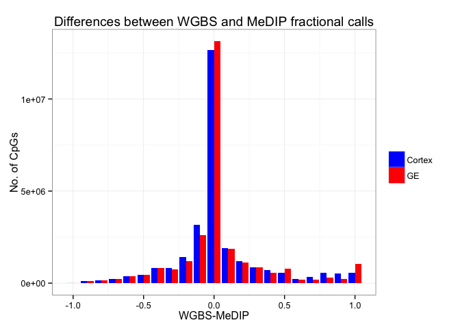
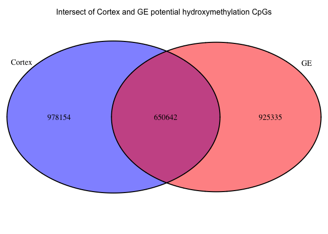
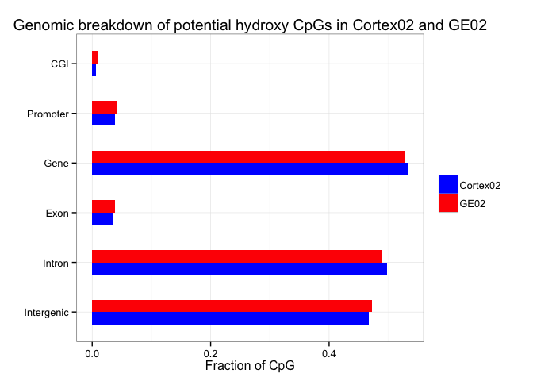
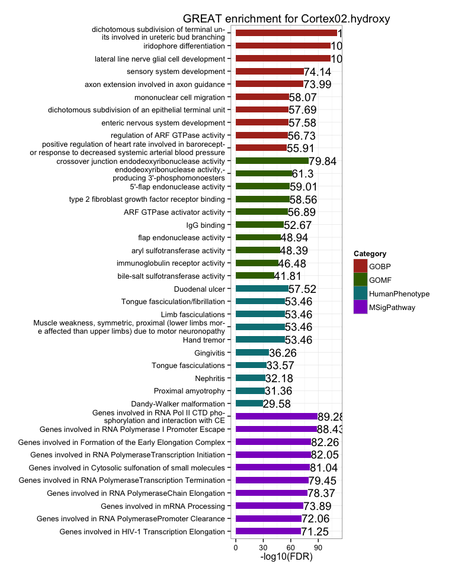
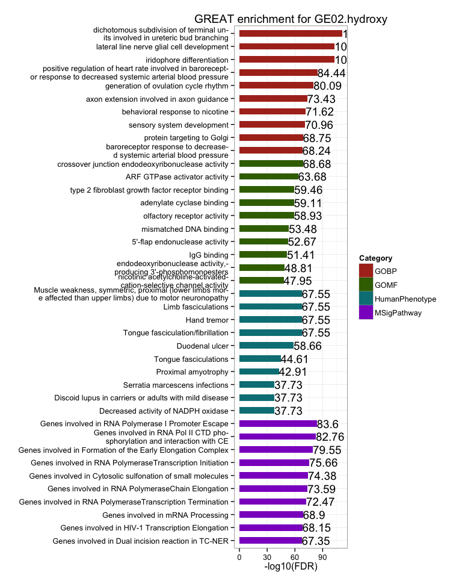

# FetalBrain - Hydroxymethylation
Gloria Li  
November 4, 2014  

Updated: Tue Nov  4 11:22:43 2014

## Rationale

  * WGBS: 5mc + 5hmC
  * MeDIP: 5mC
  * 5hmC: high WGBS fractional call & low MeDIP fractional call
  * Samples with both WGBS and MeDIP data: Cortex - HuFNSC02 and GE - HuFNSC02
  
## Distribution of WGBS - MeDIP

  * The differences between WGBS and MeDIP fractional calls are asymmetry, with more high WGBS low MeDIP CpGs. _Any technical bias that may contribute to this?_     
  * Potential hydroxymethylated CpGs: WGBS-MeDIP >= 0.8.    
  
 

## Potential ydroxymethylated CpGs 

  + On average, 5.68% CpGs are potentially hydroxymethylated, similar to [previous reports](http://www.ncbi.nlm.nih.gov/pmc/articles/PMC3009720/). 40.6% of them are shared by two cell types, highly significant (hypergeometric test p = 0).    
  + On average, around 5% WGBS UMRs have potential hydroxymethylated CpGs.   
  
<!-- html table generated in R 3.1.1 by xtable 1.7-4 package -->
<!-- Tue Nov  4 11:22:45 2014 -->
<table border=1>
<tr> <th>  </th> <th> CpG </th> <th> Region </th> <th> CpG.in.WGBS.UMRs </th> <th> WGBS.UMRs.with.CpG </th>  </tr>
  <tr> <td align="center"> Cortex02 </td> <td align="center"> 1628796.00 </td> <td align="center"> 32606.00 </td> <td align="center"> 34.00 </td> <td align="center"> 20.00 </td> </tr>
  <tr> <td align="center"> GE02 </td> <td align="center"> 1575977.00 </td> <td align="center"> 29611.00 </td> <td align="center"> 170.00 </td> <td align="center"> 89.00 </td> </tr>
   </table>
 

## Genomic breakdown 

  * Potential hydroxymethylated CpGs are mostly in introns and intergenetic regions (non-coding regions), __opposite__ from [previous reports](http://www.ncbi.nlm.nih.gov/pmc/articles/PMC3516134/). 
  
 

## GREAT analysis

  * GREAT functional enrichment on potential hydroxymethylated regions show similar terms between Cortex and GE, but not very specific to brain development.   
  
  
