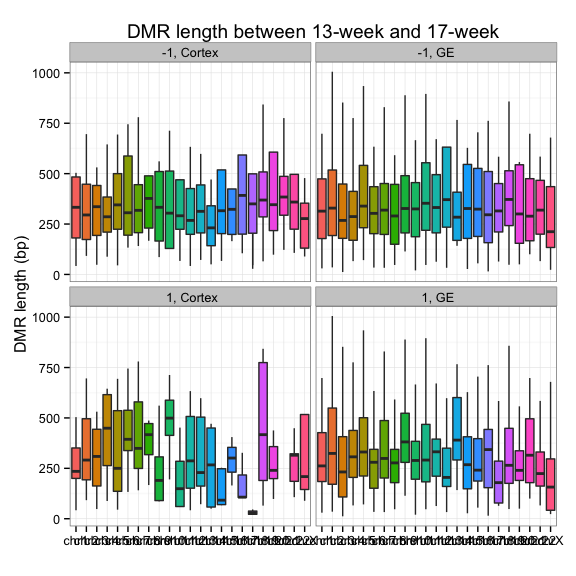
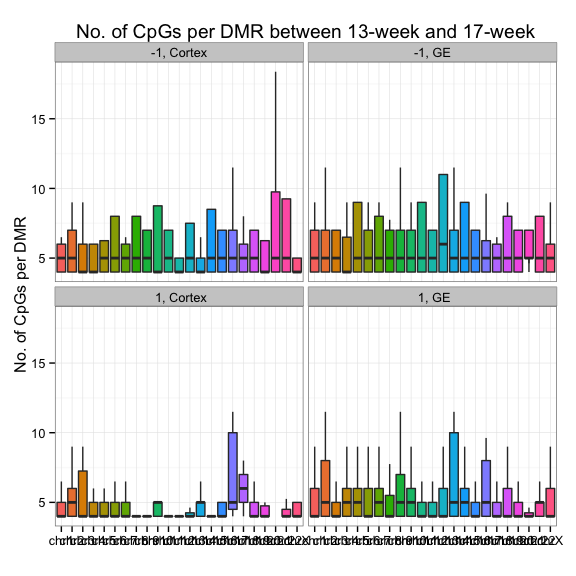
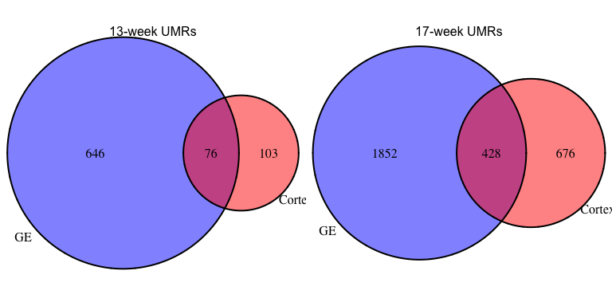
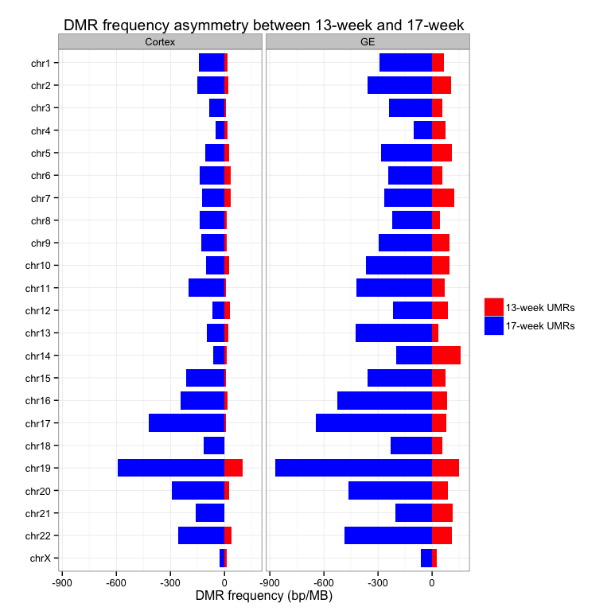
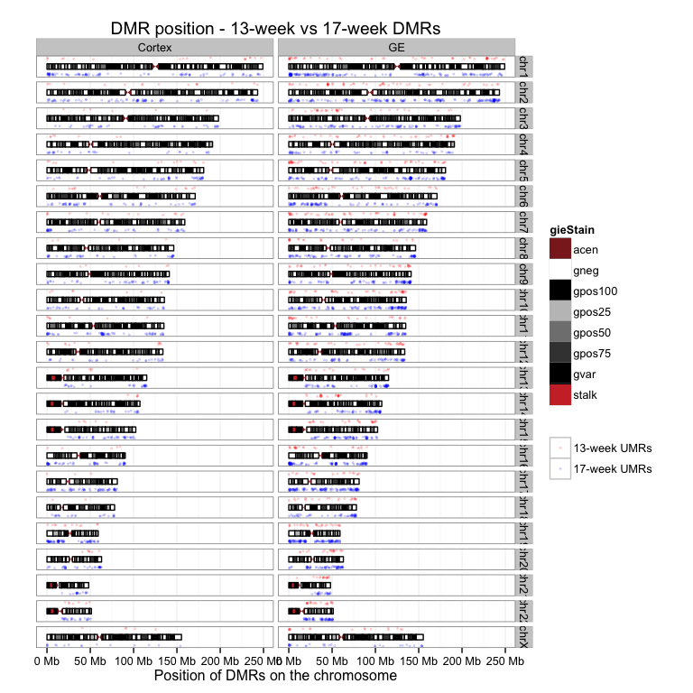
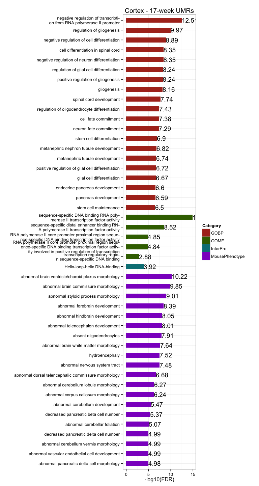
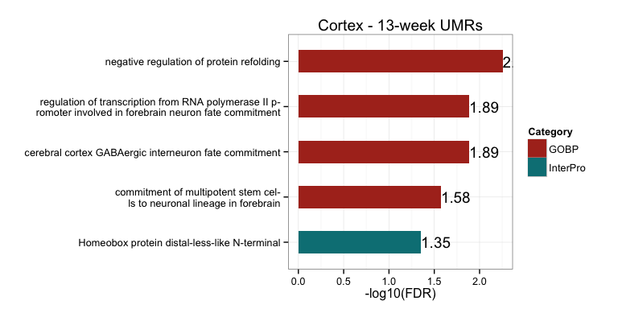
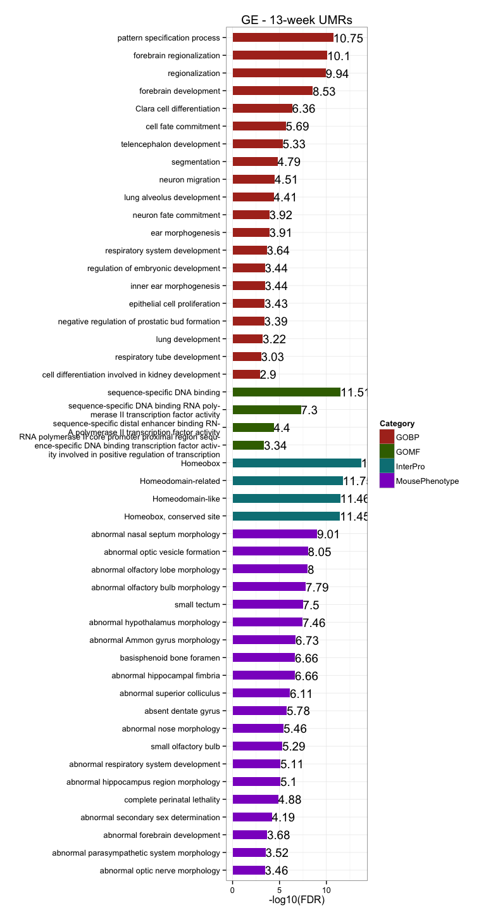
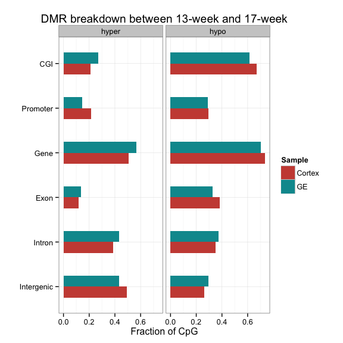

# FetalBrain - Gestational week associated UMRs
gloriali  
November 5, 2014  

Updated: Wed Nov  5 22:22:11 2014

## DMR identification with methyl_diff

  * Identify DM CpGs     
    + methyl_diff one-sided p-value $\le$ 0.005  
    + delta fractional methylation $\ge$ 0.5  
    + fractional methylation of one sample $\ge$ 0.75   
  * Collapse DM CpGs into DMRs     
    + adjacent DM CpGs have the same DM status;    
    + distance between adjacent CpGs (size) $\le$ 300bp;   
    + No. of CpGs within each DMR $\ge$ 3.   

## Summary and sanity check 

  * On average, there are __1692__ 17-week UMRs, __428__ intersect between Cortex and GE, and __450__ 13-week UMRs, __76__ intersect. The intersect is highly significant.       
  * Median DMR length is __321__, _comparable to breast_. It's similar in all chromosomes in 17-week UMRs, but fluctuate more in 13-week UMRs, probably due to  small No. of UMRs identified.   
  * Median No. of CpGs per DMR is __5__, also _similar to breast_.     

<!-- html table generated in R 3.1.2 by xtable 1.7-4 package -->
<!-- Wed Nov  5 22:22:23 2014 -->
<table border=1>
<tr> <th>  </th> <th> Sample </th> <th> Total.DMR </th> <th> Hyper.DMR </th> <th> Hypo.DMR </th>  </tr>
  <tr> <td align="right"> 1 </td> <td align="right"> Cortex-HuFNSC02_Cortex-HuFNSC04 </td> <td align="center"> 1283 </td> <td align="center"> 179 </td> <td align="center"> 1104 </td> </tr>
  <tr> <td align="right"> 2 </td> <td align="right"> GE-HuFNSC02_GE-HuFNSC04 </td> <td align="center"> 3002 </td> <td align="center"> 722 </td> <td align="center"> 2280 </td> </tr>
   </table>
  
 

## UMR asymmetry 

  * On average, there are , __4.8__-fold enrichment in total UMR frequency in 17-week compared to 13-week, __8.17__ in Cortex, and __3.97__ in GE.    

  

## GREAT enrichment for GW-associated UMRs 

  * GREAT terms are strongly associated with __neuron differentiation and brain development__.     
  * 17-week UMRs are highly enriched in __glial cell development__ in Cortex, and __neural tube development__ in GE.     
  * 13-week UMRs are enriched in __neuron fate commitment__ in Cortex, and __regionalization__ in GE.    
  
 
 
 
 

## Genomic breakdown

  + On average, __62.81%__ of CpGs in UMRs overlap with genebody, and __23.58%__ of CpGs in UMRs overlap with promoters, __1.78-fold__ enriched. __44.2%__ of CpGs in UMRs overlap with CGIs, __5.97-fold__ than expected by random.        

<!-- For the entire genome, 3727169 out of 28217448 CpGs overlap with TSS +/- 1500bp promoter regions -->
<!-- For the entire genome, 2089538 out of 28217448 CpGs overlap with CGIs -->

 

