Fetal Brain WGBS Analysis Summary - DMRs between Cortex and GE
========================================================

Gloria Li         
Tue Oct 21 14:31:49 2014 

## DMR identification with methyl_diff

  * Identify DM CpGs     
    + methyl_diff one-sided p-value $\le$ 0.005  
    + delta fractional methylation $\ge$ 0.5  
    + fractional methylation of one sample $\ge$ 0.75   
  * Collapse DM CpGs into DMRs     
    + adjacent DM CpGs have the same DM status;    
    + distance between adjacent CpGs (size) $\le$ 300bp;   
    + No. of CpGs within each DMR $\ge$ 3.   

## Summary and sanity check  

  * On average, there are __1156__ Cortex UMRs, 179 intersect between two individuals, and __255__ GE UMRs, 10 intersect. The intersect is significant. And there seems to be an asymmetry between Cortex UMRs and GE UMRs.    
  * Median DMR length is __267__, _comparable to breast_. It's similar in all chromosomes in Cortex UMRs, but fluctuate more in GE UMRs, probably due to  small No. of UMRs identified.   
  * Median No. of CpGs per DMR is __5__, _similar to breast_. chr11 and chr13 in GE UMRs have higher No. of CpGs per DMR.  

<!-- html table generated in R 3.1.1 by xtable 1.7-3 package -->
<!-- Tue Oct 21 14:31:51 2014 -->
<TABLE border=1>
<TR> <TH> Sample </TH> <TH> Total.DMR </TH> <TH> Hyper.DMR </TH> <TH> Hypo.DMR </TH>  </TR>
  <TR> <TD align="center"> Cortex-HuFNSC02_GE-HuFNSC02 </TD> <TD align="center"> 2178 </TD> <TD align="center"> 420 </TD> <TD align="center"> 1758 </TD> </TR>
  <TR> <TD align="center"> Cortex-HuFNSC04_GE-HuFNSC04 </TD> <TD align="center"> 646 </TD> <TD align="center">  91 </TD> <TD align="center"> 555 </TD> </TR>
   </TABLE>
 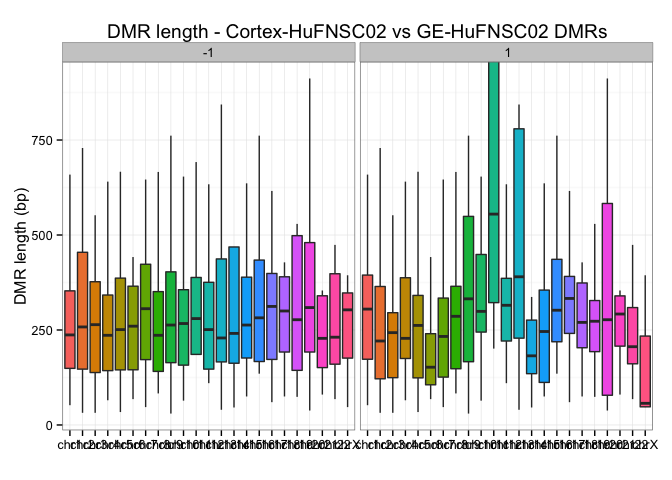 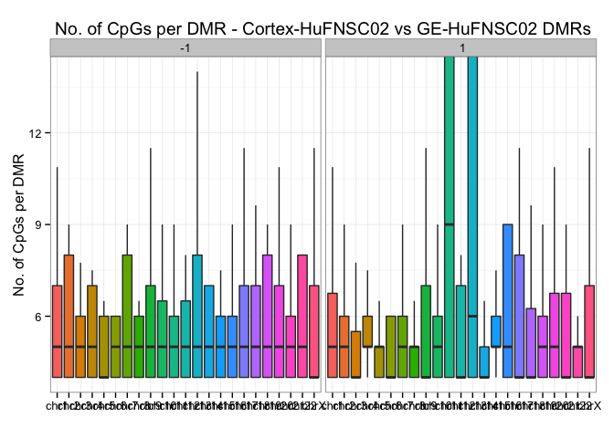  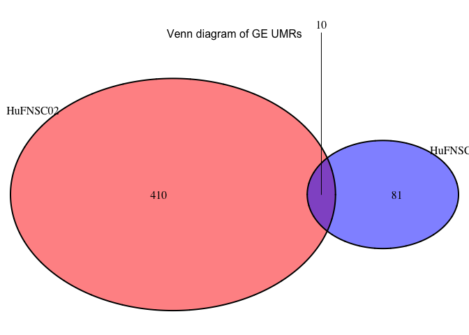 

## Asymmetry between Cortex UMRs and GE UMRs  

  * On average, there are , __4__-times more UMRs in Cortex than GE.  
  * The asymmetry appears to be global, in all chromosomes, and is reproduced in the two individuals.  
  * __Single CpG level__ differential methylation is __symmetric__, but the asymmetry on UMR level can be reproduced with __different cutoffs__. However, there are __no apparent differences in UMR length__ between Cortex and GE, suggesting that there are more __orphan GE UM CpGs__ that was not able to form UMRs than in Cortex. 

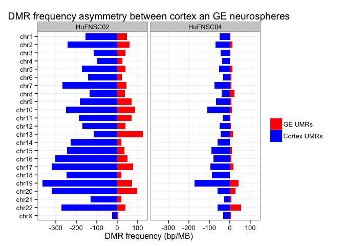 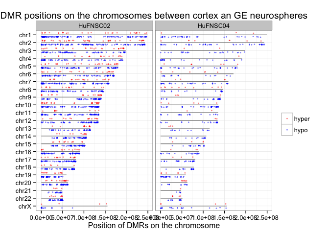 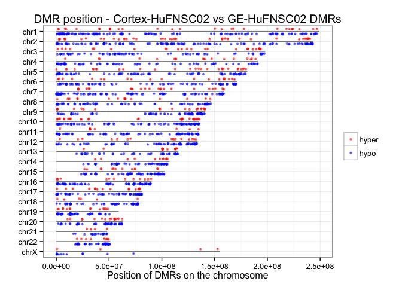 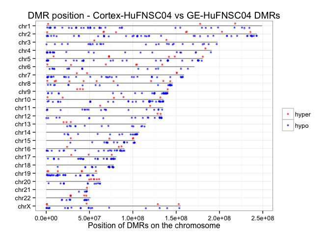 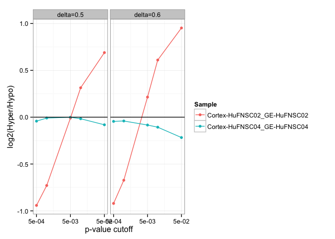 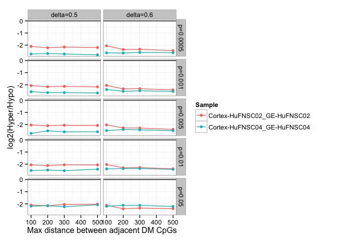 

## GREAT analysis on Cortex UMRs and GE UMRs  

  * UMRs in both Cortex and GE in both individuals show enrichment in  __transcriptional regulation__ activities.  
  * In HuFNSC02, both Cortex UMRs are enriched in __brain regions development__, and GE UMRs are enriched in __neuron development__.   
  * In HuFNSC04, Cortex UMRs show __abnormal brain development__ in Mouse Phenotype, but are also enriched in __kidney-related processes__.   

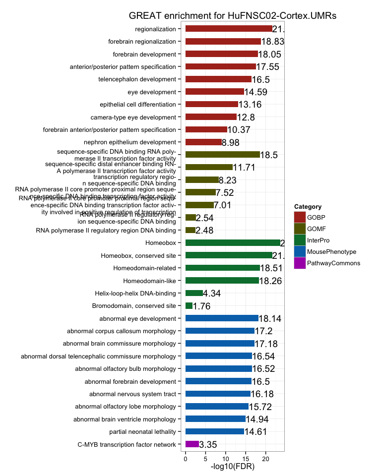 
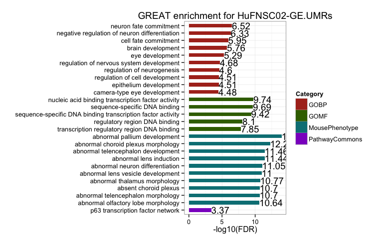 
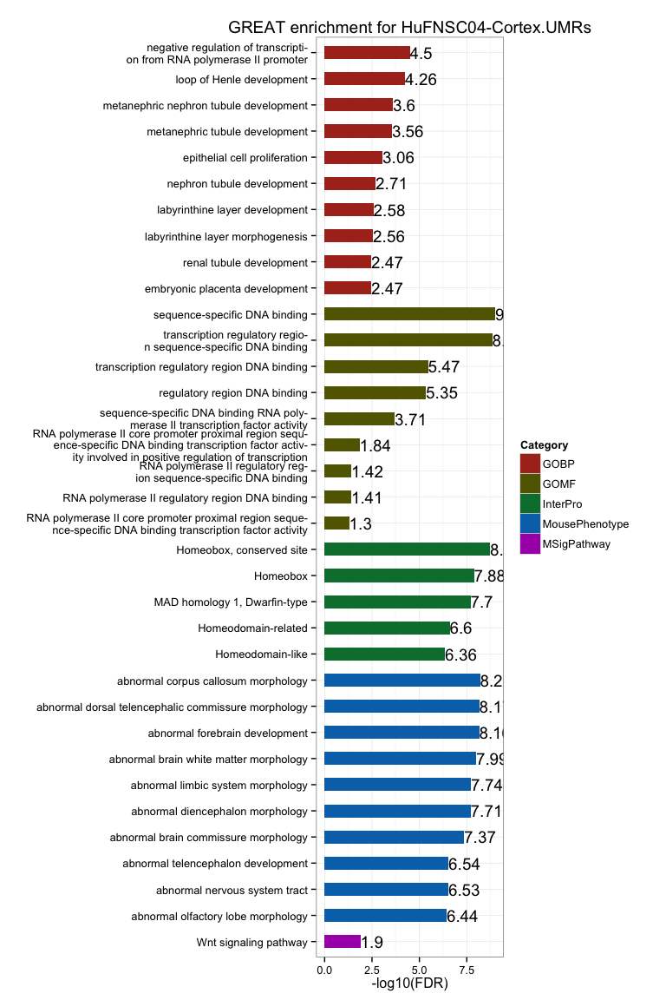 
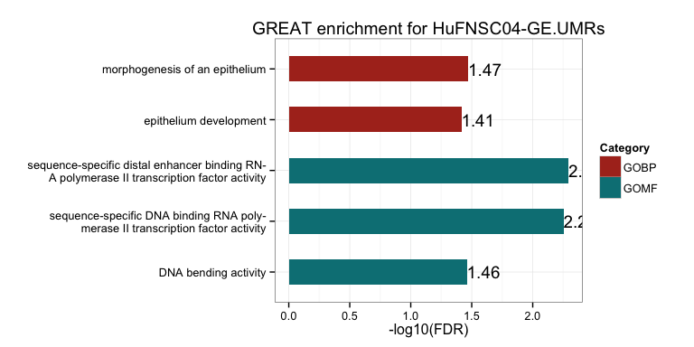 

## UMR genomic break down  

  + On average, __65.94%__ of CpGs in UMRs overlap with genebody, and __15.83%__ of CpGs in UMRs overlap with promoters, not a significant enrichment __(1.2-fold)__. __40.2%__ of CpGs in UMRs overlap with CGIs, __5.43-fold__ than expected by random.        

<!-- For the entire genome, 3727169 out of 28217448 CpGs overlap with TSS +/- 1500bp promoter regions -->
<!-- For the entire genome, 2089538 out of 28217448 CpGs overlap with CGIs -->

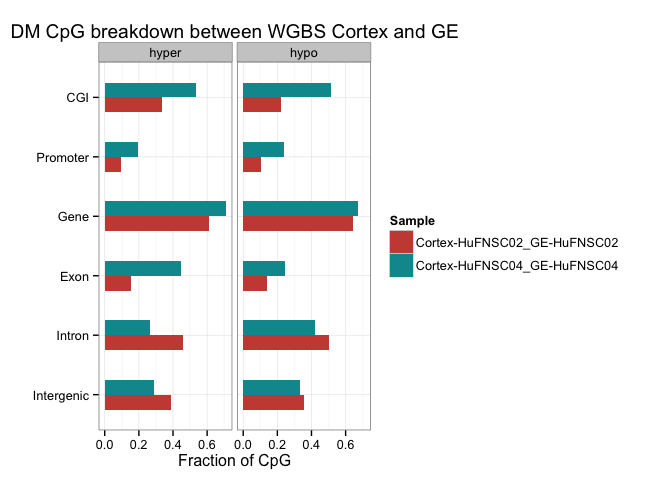 

## UMRs intersecting with protein-coding genes and DE genes

  + On average, there are __40__ DMRs associated with promoters of protein-coding genes, __2.85%__ of all DMRs.         
  + On average, there are __8__ promoter DMRs associated with DE genes, __19.88%__ of all promoter DMRs. Among them, there are __46.67%__ unique DE genes change in the same direction as the UMRs.         
  + The intersect between two individuals are __significant__ when there are common genes. There are no intersect in pc genes with promoter GE UMRs.  
  + There are __no significant__ DAVID enrichment terms due to the small number of genes.  

<!-- html table generated in R 3.1.1 by xtable 1.7-3 package -->
<!-- Tue Oct 21 14:31:57 2014 -->
<TABLE border=1>
<TR> <TH>  </TH> <TH> pc.Genes </TH> <TH> unique.Genes </TH> <TH> pc.Promoters </TH> <TH> unique.Promoters </TH> <TH> proximal.DE.Genes </TH> <TH> same.direction </TH> <TH> unique.DE.Genes </TH>  </TR>
  <TR> <TD align="center"> GE_UMRs-HuFNSC02 </TD> <TD align="center"> 222 </TD> <TD align="center"> 210 </TD> <TD align="center">  17 </TD> <TD align="center">  17 </TD> <TD align="center">   4 </TD> <TD align="center">   1 </TD> <TD align="center">   4 </TD> </TR>
  <TR> <TD align="center"> Cortex_UMRs-HuFNSC02 </TD> <TD align="center"> 903 </TD> <TD align="center"> 712 </TD> <TD align="center">  53 </TD> <TD align="center">  52 </TD> <TD align="center">  15 </TD> <TD align="center">   8 </TD> <TD align="center">  14 </TD> </TR>
  <TR> <TD align="center"> GE_UMRs-HuFNSC04 </TD> <TD align="center">  47 </TD> <TD align="center">  46 </TD> <TD align="center">   9 </TD> <TD align="center">  11 </TD> <TD align="center">   3 </TD> <TD align="center">   2 </TD> <TD align="center">   3 </TD> </TR>
  <TR> <TD align="center"> Cortex_UMRs-HuFNSC04 </TD> <TD align="center"> 286 </TD> <TD align="center"> 287 </TD> <TD align="center">  82 </TD> <TD align="center">  84 </TD> <TD align="center">  10 </TD> <TD align="center">   3 </TD> <TD align="center">   9 </TD> </TR>
   </TABLE>
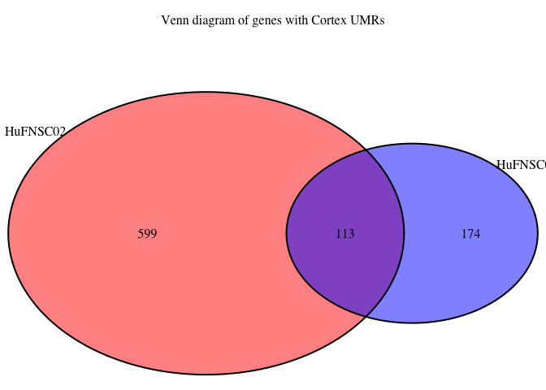 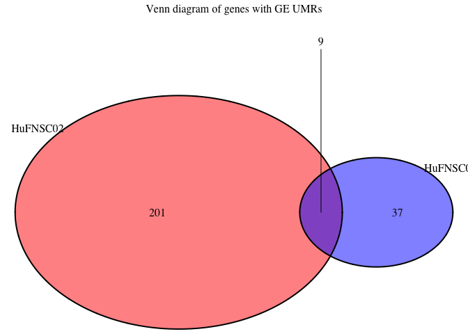 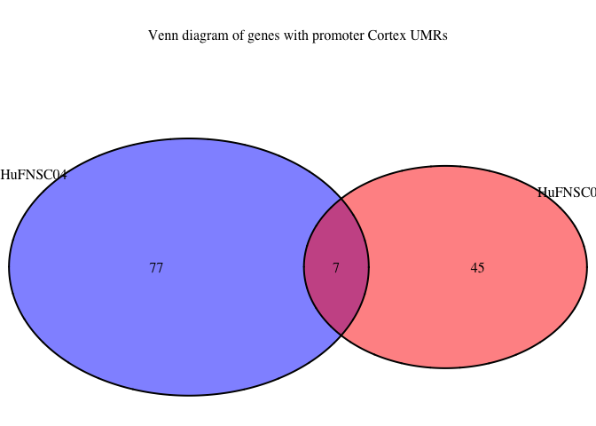 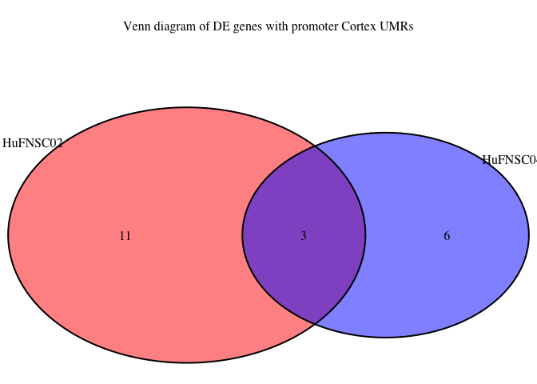 

### DE genes with promoter Cortex UMRs  
#### HuFNSC02  
<!-- html table generated in R 3.1.1 by xtable 1.7-3 package -->
<!-- Tue Oct 21 14:31:57 2014 -->
<TABLE border=1>
<TR> <TH> name </TH> <TH> description </TH> <TH> DE </TH>  </TR>
  <TR> <TD align="right"> CD58 </TD> <TD align="right"> CD58_molecule </TD> <TD align="center"> UP </TD> </TR>
  <TR> <TD align="right"> RGS10 </TD> <TD align="right"> regulator_of_G-protein_signaling_10 </TD> <TD align="center"> UP </TD> </TR>
  <TR> <TD align="right"> ADM </TD> <TD align="right"> adrenomedullin </TD> <TD align="center"> UP </TD> </TR>
  <TR> <TD align="right"> NKX2-1 </TD> <TD align="right"> NK2_homeobox_1 </TD> <TD align="center"> DN </TD> </TR>
  <TR> <TD align="right"> OTX2 </TD> <TD align="right"> orthodenticle_homeobox_2 </TD> <TD align="center"> DN </TD> </TR>
  <TR> <TD align="right"> USP43 </TD> <TD align="right"> ubiquitin_specific_peptidase_43 </TD> <TD align="center"> DN </TD> </TR>
  <TR> <TD align="right"> GFAP </TD> <TD align="right"> glial_fibrillary_acidic_protein </TD> <TD align="center"> UP </TD> </TR>
  <TR> <TD align="right"> NFIX </TD> <TD align="right"> nuclear_factor_I/X_(CCAAT-binding_transcription_factor) </TD> <TD align="center"> UP </TD> </TR>
  <TR> <TD align="right"> GAD1 </TD> <TD align="right"> glutamate_decarboxylase_1_(brain,_67kDa) </TD> <TD align="center"> DN </TD> </TR>
  <TR> <TD align="right"> FZD7 </TD> <TD align="right"> frizzled_family_receptor_7 </TD> <TD align="center"> UP </TD> </TR>
  <TR> <TD align="right"> FZD5 </TD> <TD align="right"> frizzled_family_receptor_5 </TD> <TD align="center"> DN </TD> </TR>
  <TR> <TD align="right"> CXCR7 </TD> <TD align="right"> chemokine_(C-X-C_motif)_receptor_7 </TD> <TD align="center"> DN </TD> </TR>
  <TR> <TD align="right"> ZAR1 </TD> <TD align="right"> zygote_arrest_1 </TD> <TD align="center"> UP </TD> </TR>
  <TR> <TD align="right"> FEZF1 </TD> <TD align="right"> FEZ_family_zinc_finger_1 </TD> <TD align="center"> DN </TD> </TR>
   </TABLE>

#### HuFNSC04  
<!-- html table generated in R 3.1.1 by xtable 1.7-3 package -->
<!-- Tue Oct 21 14:31:57 2014 -->
<TABLE border=1>
<TR> <TH> name </TH> <TH> description </TH> <TH> DE </TH>  </TR>
  <TR> <TD align="right"> FAM5C </TD> <TD align="right"> family_with_sequence_similarity_5,_member_C </TD> <TD align="center"> UP </TD> </TR>
  <TR> <TD align="right"> STXBP6 </TD> <TD align="right"> syntaxin_binding_protein_6_(amisyn) </TD> <TD align="center"> DN </TD> </TR>
  <TR> <TD align="right"> GFAP </TD> <TD align="right"> glial_fibrillary_acidic_protein </TD> <TD align="center"> UP </TD> </TR>
  <TR> <TD align="right"> NFIX </TD> <TD align="right"> nuclear_factor_I/X_(CCAAT-binding_transcription_factor) </TD> <TD align="center"> UP </TD> </TR>
  <TR> <TD align="right"> MEIS1 </TD> <TD align="right"> Meis_homeobox_1 </TD> <TD align="center"> DN </TD> </TR>
  <TR> <TD align="right"> FSIP2 </TD> <TD align="right"> fibrous_sheath_interacting_protein_2 </TD> <TD align="center"> DN </TD> </TR>
  <TR> <TD align="right"> INSM1 </TD> <TD align="right"> insulinoma-associated_1 </TD> <TD align="center"> DN </TD> </TR>
  <TR> <TD align="right"> FEZF1 </TD> <TD align="right"> FEZ_family_zinc_finger_1 </TD> <TD align="center"> DN </TD> </TR>
  <TR> <TD align="right"> C9orf172 </TD> <TD align="right"> chromosome_9_open_reading_frame_172 </TD> <TD align="center"> DN </TD> </TR>
   </TABLE>

### DE genes with promoter GE UMRs  
#### HuFNSC02  
<!-- html table generated in R 3.1.1 by xtable 1.7-3 package -->
<!-- Tue Oct 21 14:31:57 2014 -->
<TABLE border=1>
<TR> <TH> name </TH> <TH> description </TH> <TH> DE </TH>  </TR>
  <TR> <TD align="right"> PAX6 </TD> <TD align="right"> paired_box_6 </TD> <TD align="center"> UP </TD> </TR>
  <TR> <TD align="right"> TMEM132B </TD> <TD align="right"> transmembrane_protein_132B </TD> <TD align="center"> UP </TD> </TR>
  <TR> <TD align="right"> PID1 </TD> <TD align="right"> phosphotyrosine_interaction_domain_containing_1 </TD> <TD align="center"> DN </TD> </TR>
  <TR> <TD align="right"> ZIC3 </TD> <TD align="right"> Zic_family_member_3 </TD> <TD align="center"> UP </TD> </TR>
   </TABLE>

#### HuFNSC04  
<!-- html table generated in R 3.1.1 by xtable 1.7-3 package -->
<!-- Tue Oct 21 14:31:57 2014 -->
<TABLE border=1>
<TR> <TH> name </TH> <TH> description </TH> <TH> DE </TH>  </TR>
  <TR> <TD align="right">  </TD> <TD align="right">  </TD> <TD align="center"> DN </TD> </TR>
  <TR> <TD align="right"> MN1 </TD> <TD align="right"> meningioma_(disrupted_in_balanced_translocation)_1 </TD> <TD align="center"> DN </TD> </TR>
  <TR> <TD align="right"> PNCK </TD> <TD align="right"> pregnancy_up-regulated_non-ubiquitously_expressed_CaM_kinase </TD> <TD align="center"> UP </TD> </TR>
   </TABLE>

## Overlap UMRs with TFBSs 

* Overlap UMRs with transcription factor binding sites and count No. of overlapping TFBSs for each TF showed similar asymmetry between Cortex and GE in both individuals, with TFBSs enriched in Cortex UMRs for most TFs.   
* However, in general, the correlation of TFBS Cortex UMR vs GE UMR fold change between the two individual is quite low, 0.2.  
* There are 15 TFs that are at least 3-fold enriched in TFBSs overlapping Cortex UMRs compared to GE UMRs as shown below.   

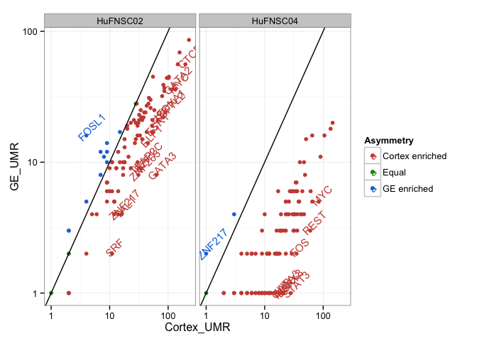 <!-- html table generated in R 3.1.1 by xtable 1.7-3 package -->
<!-- Tue Oct 21 14:31:58 2014 -->
<TABLE border=1>
<TR> <TH> TF </TH> <TH> Cortex02UMR </TH> <TH> GE02UMR </TH> <TH> Ratio02 </TH> <TH> Cortex04UMR </TH> <TH> GE04UMR </TH> <TH> Ratio04 </TH>  </TR>
  <TR> <TD align="center"> TAF7 </TD> <TD align="center">  12 </TD> <TD align="center">   4 </TD> <TD align="center"> 3.00 </TD> <TD align="center">  10 </TD> <TD align="center">   1 </TD> <TD align="center"> 10.00 </TD> </TR>
  <TR> <TD align="center"> TFAP2A </TD> <TD align="center">  30 </TD> <TD align="center">  10 </TD> <TD align="center"> 3.00 </TD> <TD align="center">  20 </TD> <TD align="center">   3 </TD> <TD align="center"> 6.67 </TD> </TR>
  <TR> <TD align="center"> USF1 </TD> <TD align="center">  67 </TD> <TD align="center">  21 </TD> <TD align="center"> 3.19 </TD> <TD align="center">  31 </TD> <TD align="center">   6 </TD> <TD align="center"> 5.17 </TD> </TR>
  <TR> <TD align="center"> ELF1 </TD> <TD align="center">  45 </TD> <TD align="center">  14 </TD> <TD align="center"> 3.21 </TD> <TD align="center">  39 </TD> <TD align="center">   5 </TD> <TD align="center"> 7.80 </TD> </TR>
  <TR> <TD align="center"> GATA2 </TD> <TD align="center"> 116 </TD> <TD align="center">  36 </TD> <TD align="center"> 3.22 </TD> <TD align="center">  43 </TD> <TD align="center">   4 </TD> <TD align="center"> 10.75 </TD> </TR>
  <TR> <TD align="center"> ESR1 </TD> <TD align="center">  55 </TD> <TD align="center">  17 </TD> <TD align="center"> 3.24 </TD> <TD align="center">   9 </TD> <TD align="center">   3 </TD> <TD align="center"> 3.00 </TD> </TR>
  <TR> <TD align="center"> CTCF </TD> <TD align="center"> 197 </TD> <TD align="center">  56 </TD> <TD align="center"> 3.52 </TD> <TD align="center"> 105 </TD> <TD align="center">  16 </TD> <TD align="center"> 6.56 </TD> </TR>
  <TR> <TD align="center"> TFAP2C </TD> <TD align="center">  32 </TD> <TD align="center">   9 </TD> <TD align="center"> 3.56 </TD> <TD align="center">  23 </TD> <TD align="center">   5 </TD> <TD align="center"> 4.60 </TD> </TR>
  <TR> <TD align="center"> MYC </TD> <TD align="center"> 133 </TD> <TD align="center">  36 </TD> <TD align="center"> 3.69 </TD> <TD align="center">  84 </TD> <TD align="center">   5 </TD> <TD align="center"> 16.80 </TD> </TR>
  <TR> <TD align="center"> FOXA1 </TD> <TD align="center">  89 </TD> <TD align="center">  24 </TD> <TD align="center"> 3.71 </TD> <TD align="center">  26 </TD> <TD align="center">   5 </TD> <TD align="center"> 5.20 </TD> </TR>
  <TR> <TD align="center"> TCF7L2 </TD> <TD align="center">  82 </TD> <TD align="center">  22 </TD> <TD align="center"> 3.73 </TD> <TD align="center">  47 </TD> <TD align="center">   4 </TD> <TD align="center"> 11.75 </TD> </TR>
  <TR> <TD align="center"> ZNF263 </TD> <TD align="center">  31 </TD> <TD align="center">   8 </TD> <TD align="center"> 3.88 </TD> <TD align="center">  23 </TD> <TD align="center">   5 </TD> <TD align="center"> 4.60 </TD> </TR>
  <TR> <TD align="center"> E2F1 </TD> <TD align="center">  35 </TD> <TD align="center">   9 </TD> <TD align="center"> 3.89 </TD> <TD align="center">  38 </TD> <TD align="center">   5 </TD> <TD align="center"> 7.60 </TD> </TR>
  <TR> <TD align="center"> TAL1 </TD> <TD align="center">  16 </TD> <TD align="center">   4 </TD> <TD align="center"> 4.00 </TD> <TD align="center">   5 </TD> <TD align="center">   1 </TD> <TD align="center"> 5.00 </TD> </TR>
  <TR> <TD align="center"> GATA3 </TD> <TD align="center">  63 </TD> <TD align="center">   8 </TD> <TD align="center"> 7.88 </TD> <TD align="center">  18 </TD> <TD align="center">   1 </TD> <TD align="center"> 18.00 </TD> </TR>
   </TABLE>

