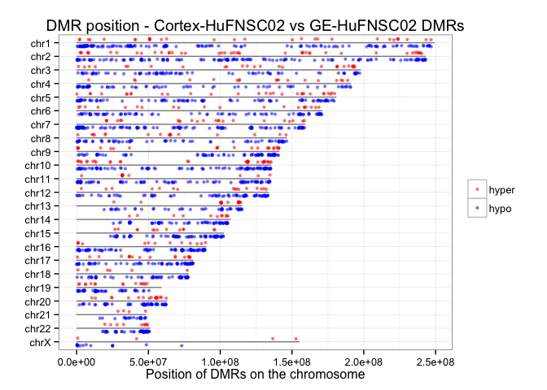
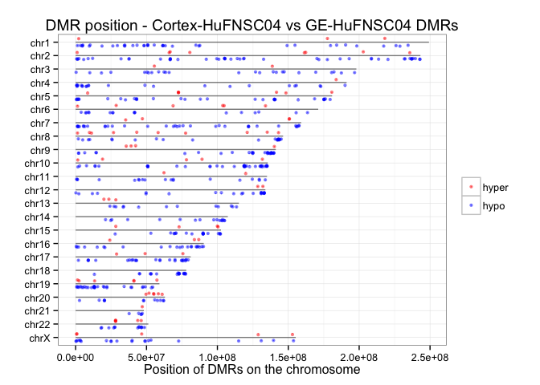

Fetal Brain WGBS Analysis Summary - DMRs between Cortex and GE
========================================================

Gloria Li         
Sat Sep 27 14:00:38 2014 

## DMR identification with methyl_diff

  * Identify DM CpGs     
    + methyl_diff one-sided p-value $\le$ 0.005  
    + delta fractional methylation $\ge$ 0.5  
    + fractional methylation of one sample $\ge$ 0.75   
  * Collapse DM CpGs into DMRs     
    + adjacent DM CpGs have the same DM status;    
    + distance between adjacent CpGs (size) $\le$ 300bp;   
    + No. of CpGs within each DMR $\ge$ 3.   

## Summary and sanity check  

  * On average, there are __1156__ Cortex UMRs, 179 intersect between two individuals, and __255__ GE UMRs, 10 intersect. The intersect is significant. And there seems to be an asymmetry between Cortex UMRs and GE UMRs.    
  * Median DMR length is __267__, _comparable to breast_. It's similar in all chromosomes in Cortex UMRs, but fluctuate more in GE UMRs, probably due to  small No. of UMRs identified.   
  * Median No. of CpGs per DMR is __5__, _similar to breast_. chr11 and chr13 in GE UMRs have higher No. of CpGs per DMR.  

<!-- html table generated in R 3.1.1 by xtable 1.7-3 package -->
<!-- Sat Sep 27 14:00:40 2014 -->
<TABLE border=1>
<TR> <TH> Sample </TH> <TH> Total.DMR </TH> <TH> Hyper.DMR </TH> <TH> Hypo.DMR </TH>  </TR>
  <TR> <TD align="center"> Cortex-HuFNSC02_GE-HuFNSC02 </TD> <TD align="center"> 2178 </TD> <TD align="center"> 420 </TD> <TD align="center"> 1758 </TD> </TR>
  <TR> <TD align="center"> Cortex-HuFNSC04_GE-HuFNSC04 </TD> <TD align="center"> 646 </TD> <TD align="center">  91 </TD> <TD align="center"> 555 </TD> </TR>
   </TABLE>
     

## Asymmetry between Cortex UMRs and GE UMRs  

  * On average, there are , __4__-times more UMRs in Cortex than GE.  
  * The asymmetry appears to be global, in all chromosomes, and is reproduced in the two individuals.  
  * __Single CpG level__ differential methylation is __symmetric__, but the asymmetry on UMR level can be reproduced with __different cutoffs__. However, there are __no apparent differences in UMR length__ between Cortex and GE, suggesting that there are more __orphan GE UM CpGs__ that was not able to form UMRs than in Cortex. 

      

## GREAT analysis on Cortex UMRs and GE UMRs  

  * UMRs in both Cortex and GE in both individuals show enrichment in  __transcriptional regulation__ activities.  
  * In HuFNSC02, both Cortex UMRs are enriched in __brain regions development__, and GE UMRs are enriched in __neuron development__.   
  * In HuFNSC04, Cortex UMRs show __abnormal brain development__ in Mouse Phenotype, but are also enriched in __kidney-related processes__.   

 
 
 
 

## UMR genomic break down  

  + On average, __65.94%__ of CpGs in UMRs overlap with genebody, and __15.83%__ of CpGs in UMRs overlap with promoters, not a significant enrichment __(1.2-fold)__. __40.2%__ of CpGs in UMRs overlap with CGIs, __5.43-fold__ than expected by random.        

<!-- For the entire genome, 3727169 out of 28217448 CpGs overlap with TSS +/- 1500bp promoter regions -->
<!-- For the entire genome, 2089538 out of 28217448 CpGs overlap with CGIs -->

 

## UMRs intersecting with protein-coding genes and DE genes

  + On average, there are __40__ DMRs associated with promoters of protein-coding genes, __2.85%__ of all DMRs.         
  + On average, there are __8__ promoter DMRs associated with DE genes, __19.88%__ of all promoter DMRs. Among them, there are __46.67%__ unique DE genes change in the same direction as the UMRs.         
  + The intersect between two individuals are __significant__ when there are common genes. There are no intersect in pc genes with promoter GE UMRs.  
  + There are __no significant__ DAVID enrichment terms due to the small number of genes.  

<!-- html table generated in R 3.1.1 by xtable 1.7-3 package -->
<!-- Sat Sep 27 14:00:46 2014 -->
<TABLE border=1>
<TR> <TH>  </TH> <TH> pc.Genes </TH> <TH> unique.Genes </TH> <TH> pc.Promoters </TH> <TH> unique.Promoters </TH> <TH> proximal.DE.Genes </TH> <TH> same.direction </TH> <TH> unique.DE.Genes </TH>  </TR>
  <TR> <TD align="center"> GE_UMRs-HuFNSC02 </TD> <TD align="center"> 222 </TD> <TD align="center"> 210 </TD> <TD align="center">  17 </TD> <TD align="center">  17 </TD> <TD align="center">   4 </TD> <TD align="center">   1 </TD> <TD align="center">   4 </TD> </TR>
  <TR> <TD align="center"> Cortex_UMRs-HuFNSC02 </TD> <TD align="center"> 903 </TD> <TD align="center"> 712 </TD> <TD align="center">  53 </TD> <TD align="center">  52 </TD> <TD align="center">  15 </TD> <TD align="center">   8 </TD> <TD align="center">  14 </TD> </TR>
  <TR> <TD align="center"> GE_UMRs-HuFNSC04 </TD> <TD align="center">  47 </TD> <TD align="center">  46 </TD> <TD align="center">   9 </TD> <TD align="center">  11 </TD> <TD align="center">   3 </TD> <TD align="center">   2 </TD> <TD align="center">   3 </TD> </TR>
  <TR> <TD align="center"> Cortex_UMRs-HuFNSC04 </TD> <TD align="center"> 286 </TD> <TD align="center"> 287 </TD> <TD align="center">  82 </TD> <TD align="center">  84 </TD> <TD align="center">  10 </TD> <TD align="center">   3 </TD> <TD align="center">   9 </TD> </TR>
   </TABLE>
    

### DE genes with promoter Cortex UMRs  
#### HuFNSC02  
<!-- html table generated in R 3.1.1 by xtable 1.7-3 package -->
<!-- Sat Sep 27 14:00:46 2014 -->
<TABLE border=1>
<TR> <TH> name </TH> <TH> description </TH>  </TR>
  <TR> <TD align="right"> CD58 </TD> <TD align="right"> CD58_molecule_[Source:HGNC_Symbol;Acc:1688] </TD> </TR>
  <TR> <TD align="right"> RGS10 </TD> <TD align="right"> regulator_of_G-protein_signaling_10_[Source:HGNC_Symbol;Acc:9992] </TD> </TR>
  <TR> <TD align="right"> ADM </TD> <TD align="right"> adrenomedullin_[Source:HGNC_Symbol;Acc:259] </TD> </TR>
  <TR> <TD align="right"> NKX2-1 </TD> <TD align="right"> NK2_homeobox_1_[Source:HGNC_Symbol;Acc:11825] </TD> </TR>
  <TR> <TD align="right"> OTX2 </TD> <TD align="right"> orthodenticle_homeobox_2_[Source:HGNC_Symbol;Acc:8522] </TD> </TR>
  <TR> <TD align="right"> USP43 </TD> <TD align="right"> ubiquitin_specific_peptidase_43_[Source:HGNC_Symbol;Acc:20072] </TD> </TR>
  <TR> <TD align="right"> GFAP </TD> <TD align="right"> glial_fibrillary_acidic_protein_[Source:HGNC_Symbol;Acc:4235] </TD> </TR>
  <TR> <TD align="right"> NFIX </TD> <TD align="right"> nuclear_factor_I/X_(CCAAT-binding_transcription_factor)_[Source:HGNC_Symbol;Acc:7788] </TD> </TR>
  <TR> <TD align="right"> GAD1 </TD> <TD align="right"> glutamate_decarboxylase_1_(brain,_67kDa)_[Source:HGNC_Symbol;Acc:4092] </TD> </TR>
  <TR> <TD align="right"> FZD7 </TD> <TD align="right"> frizzled_family_receptor_7_[Source:HGNC_Symbol;Acc:4045] </TD> </TR>
  <TR> <TD align="right"> FZD5 </TD> <TD align="right"> frizzled_family_receptor_5_[Source:HGNC_Symbol;Acc:4043] </TD> </TR>
  <TR> <TD align="right"> CXCR7 </TD> <TD align="right"> chemokine_(C-X-C_motif)_receptor_7_[Source:HGNC_Symbol;Acc:23692] </TD> </TR>
  <TR> <TD align="right"> ZAR1 </TD> <TD align="right"> zygote_arrest_1_[Source:HGNC_Symbol;Acc:20436] </TD> </TR>
  <TR> <TD align="right"> FEZF1 </TD> <TD align="right"> FEZ_family_zinc_finger_1_[Source:HGNC_Symbol;Acc:22788] </TD> </TR>
   </TABLE>

#### HuFNSC04  
<!-- html table generated in R 3.1.1 by xtable 1.7-3 package -->
<!-- Sat Sep 27 14:00:46 2014 -->
<TABLE border=1>
<TR> <TH> name </TH> <TH> description </TH>  </TR>
  <TR> <TD align="right"> FAM5C </TD> <TD align="right"> family_with_sequence_similarity_5,_member_C_[Source:HGNC_Symbol;Acc:22393] </TD> </TR>
  <TR> <TD align="right"> STXBP6 </TD> <TD align="right"> syntaxin_binding_protein_6_(amisyn)_[Source:HGNC_Symbol;Acc:19666] </TD> </TR>
  <TR> <TD align="right"> GFAP </TD> <TD align="right"> glial_fibrillary_acidic_protein_[Source:HGNC_Symbol;Acc:4235] </TD> </TR>
  <TR> <TD align="right"> NFIX </TD> <TD align="right"> nuclear_factor_I/X_(CCAAT-binding_transcription_factor)_[Source:HGNC_Symbol;Acc:7788] </TD> </TR>
  <TR> <TD align="right"> MEIS1 </TD> <TD align="right"> Meis_homeobox_1_[Source:HGNC_Symbol;Acc:7000] </TD> </TR>
  <TR> <TD align="right"> FSIP2 </TD> <TD align="right"> fibrous_sheath_interacting_protein_2_[Source:HGNC_Symbol;Acc:21675] </TD> </TR>
  <TR> <TD align="right"> INSM1 </TD> <TD align="right"> insulinoma-associated_1_[Source:HGNC_Symbol;Acc:6090] </TD> </TR>
  <TR> <TD align="right"> FEZF1 </TD> <TD align="right"> FEZ_family_zinc_finger_1_[Source:HGNC_Symbol;Acc:22788] </TD> </TR>
  <TR> <TD align="right"> C9orf172 </TD> <TD align="right"> chromosome_9_open_reading_frame_172_[Source:HGNC_Symbol;Acc:37284] </TD> </TR>
   </TABLE>

### DE genes with promoter GE UMRs  
#### HuFNSC02  
<!-- html table generated in R 3.1.1 by xtable 1.7-3 package -->
<!-- Sat Sep 27 14:00:46 2014 -->
<TABLE border=1>
<TR> <TH> name </TH> <TH> description </TH>  </TR>
  <TR> <TD align="right"> PAX6 </TD> <TD align="right"> paired_box_6_[Source:HGNC_Symbol;Acc:8620] </TD> </TR>
  <TR> <TD align="right"> TMEM132B </TD> <TD align="right"> transmembrane_protein_132B_[Source:HGNC_Symbol;Acc:29397] </TD> </TR>
  <TR> <TD align="right"> PID1 </TD> <TD align="right"> phosphotyrosine_interaction_domain_containing_1_[Source:HGNC_Symbol;Acc:26084] </TD> </TR>
  <TR> <TD align="right"> ZIC3 </TD> <TD align="right"> Zic_family_member_3_[Source:HGNC_Symbol;Acc:12874] </TD> </TR>
   </TABLE>

#### HuFNSC04  
<!-- html table generated in R 3.1.1 by xtable 1.7-3 package -->
<!-- Sat Sep 27 14:00:46 2014 -->
<TABLE border=1>
<TR> <TH> name </TH> <TH> description </TH>  </TR>
  <TR> <TD align="right">  </TD> <TD align="right">  </TD> </TR>
  <TR> <TD align="right"> MN1 </TD> <TD align="right"> meningioma_(disrupted_in_balanced_translocation)_1_[Source:HGNC_Symbol;Acc:7180] </TD> </TR>
  <TR> <TD align="right"> PNCK </TD> <TD align="right"> pregnancy_up-regulated_non-ubiquitously_expressed_CaM_kinase_[Source:HGNC_Symbol;Acc:13415] </TD> </TR>
   </TABLE>

