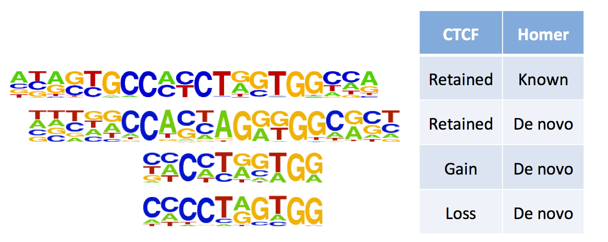

Updated: `r date()`

```{r setup, include = FALSE}
library(ggplot2)
library(plyr)
library(VennDiagram)
library(gridExtra)
library(gplots)
library(dendextend)
library(reshape)
library(wq)
library(dplyr)
library(RCircos)
library(knitr)
load("/projects/epigenomics2/users/lli/glioma/CTCF/CTCF.Rdata")
knitr::opts_chunk$set(message=FALSE, echo = FALSE, warning = FALSE, results = FALSE, fig.height = 5, fig.width = 5, bitmapType='cairo') 
knitr::opts_knit$set(root.dir = "/projects/epigenomics2/users/lli/glioma/CTCF/")
libs <- c("CEMT_19", "CEMT_21", "CEMT_22", "CEMT_23", "CEMT_47")
```

## CTCF ChIP-seq processing
* FindER v0.9.3b enriched regions (no input bam files).     
* For CTCF gain/loss sites: pairwaise between each IDHmut and each IDHwt samples and then take the intersect.    
* No. of CTCF enriched regions: 
	+ retained between IDHwt and IDHmut: `r system("less /projects/epigenomics2/users/lli/glioma/CTCF/FindER/CTCF_IDHmut_retained.bed | wc -l", intern = T)`   
	+ gain in IDHmut: `r system("less /projects/epigenomics2/users/lli/glioma/CTCF/FindER/CTCF_IDHmut_unique.bed | wc -l", intern = T)`   
	+ lost in IDHmut: `r system("less /projects/epigenomics2/users/lli/glioma/CTCF/FindER/CTCF_IDHwt_unique.bed | wc -l", intern = T)`   

## Sequence motif comparison
* CTCF binding site motifs are slightly different for gain/loss sites and retained sites.        

          

* Motifs around CTCF retained sites.         
         

* Motifs around CTCF loss sites.        
         

## DNA methylation changes at CTCF sites
* 5mC for CTCF binding sites +/- 20bp.         
* There is significant gain of 5mC at CTCF loss regions in IDHmut gliomas.   
* CTCF gain regions are methylated, slightly higher in IDHmut but not statistically significant.         
* Retained CTCF binding sites are unmethylated.             

```{r 5mC}
(CTCF_short_loss_5mC_figure)
(CTCF_short_retained_5mC_figure)
```

## H3K36me3 change at CTCF sites
* There is a slight gain of H3K36me3 at CTCF loss sites compared to retained/gain sites, coresponds to 5mC gain at these regions.      

```{r H3K36me3}
(CTCF_short_loss_K36_figure)
(CTCF_short_retained_K36_figure)
(CTCF_short_loss_5mC_K36_figure)
```

## RNAseq change at CTCF sites
* There is a slight gain of transcription at CTCF loss sites compared to retained/gain sites.      

```{r RNAseq}
(CTCF_short_loss_RNA_figure)
(CTCF_short_retained_RNA_figure)
```

## Transcription deregulation associated with CTCF sites
* Identify genes with transcription deregulation associated with CTCF sites: 
	+ TSS and enhancer are on opposite sides of CTCF sites.      
	+ Distance between TSS and enhacner <= 50 kb.      
	+ RNA-seq RPKM change >= 2-fold.     
* Genes higher expressed due to loss of CTCF sites unblocking enhancer.    
	+ SOX8: involved in determination of the cell fate and brain development and function.    
	+ GRID2IP: plays crucial roles in synaptogenesis and synaptic plasticity.     
	+ RAI1: involved in neuronal differentiation.    
	+ PROX1: plays a critical role in embryonic development and functions as a key regulatory protein in neurogenesis.   
	+ EFNB3: crucial for migration, repulsion and adhesion during neuronal, vascular and epithelial development.    
	+ CAMKK2: involved with learning and memory, neuronal differentiation and migration, neurite outgrowth, and synapse formation.      
	+ ZSCAN10: required to maintain ES cell pluripotency.     
	+ SMARCA4     
	+ LRP8: a key component of the Reelin pathway which governs neuronal layering of the forebrain during embryonic brain development.     

```{r H3K27ac_CTCFloss}
kable(H3K27ac_TSS_CTCF_loss, digits = 4, format = "html", align = "c", row.names = F)
```

* Genes lower expressed due to gain of CTCF sites blocking enhancer.    

```{r H3K27ac_CTCFgain}
kable(H3K27ac_TSS_CTCF_gain, digits = 4, format = "html", align = "c", row.names = F)
```

