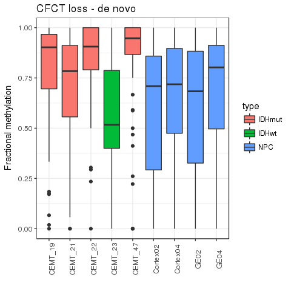
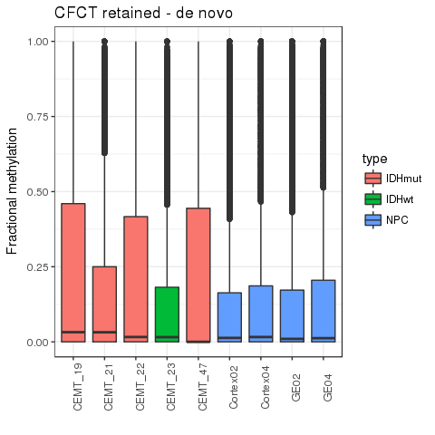
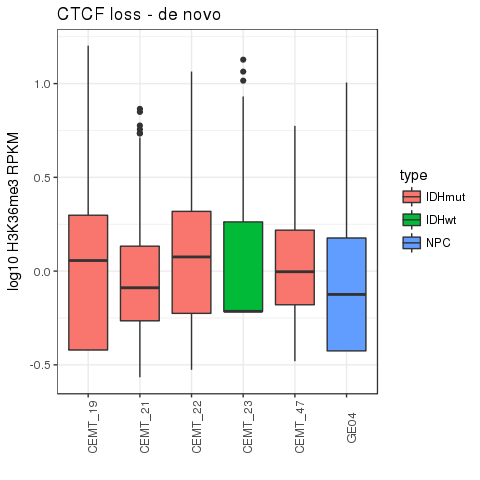
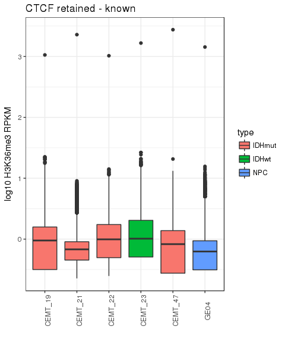

# Glioma - CTCF
Gloria Li  
Apr, 4, 2017  

Updated: Wed Apr 19 11:33:24 2017

## CTCF ChIP-seq processing
* FindER v0.9.3b enriched regions (no input bam files).     
* For CTCF gain/loss sites: pairwaise between each IDHmut and each IDHwt samples and then take the intersect.      

## DNA methylation changes at CTCF sites
* There is significant gain of 5mC at CTCF loss regions in IDHmut gliomas.   
* There is also slight gain of 5mC at CTCF gain regions, maybe because the CTCF sites were from an independent sample set, or is just a reflection of hypermethylation in IDHmut gliomas.      
* For CTCF loss regions:   
	+ responders: 5mC IDHmut-IDHwt >= 0.2     
	+ non-responders: 5mC IDHmut-IDHwt <= 0

<!-- --><!-- -->

## H3K36me3 change at responders
* There is a slight gain of H3K36me3 at responders, but also at non-respnders.    
* Evidence for increase transcription responding for 5mC gain is not strong.   

<!-- --><!-- --><!-- --><!-- -->

## Transcription deregulation associated with CTCF sites
* Identify genes with transcription deregulation associated with CTCF sites: 
	+ TSS and enhancer are on opposite sides of CTCF sites.      
	+ Distance between TSS and enhacner <= 50 kb.      
	+ RNA-seq RPKM change >= 2-fold.     
* Genes higher expressed due to loss of CTCF sites unblocking enhancer.    
	+ SOX8: involved in determination of the cell fate and brain development and function.    
	+ GRID2IP: plays crucial roles in synaptogenesis and synaptic plasticity.     
	+ RAI1: involved in neuronal differentiation.    
	+ PROX1: plays a critical role in embryonic development and functions as a key regulatory protein in neurogenesis.   
	+ EFNB3: crucial for migration, repulsion and adhesion during neuronal, vascular and epithelial development.    
	+ CAMKK2: involved with learning and memory, neuronal differentiation and migration, neurite outgrowth, and synapse formation.      
	+ ZSCAN10: required to maintain ES cell pluripotency.     
	+ SMARCA4     
	+ LRP8: a key component of the Reelin pathway which governs neuronal layering of the forebrain during embryonic brain development.     

<table>
 <thead>
  <tr>
   <th style="text-align:center;"> ENSG </th>
   <th style="text-align:center;"> Gene </th>
   <th style="text-align:center;"> CTCF </th>
   <th style="text-align:center;"> enhancer </th>
   <th style="text-align:center;"> d </th>
   <th style="text-align:center;"> IDHmut </th>
   <th style="text-align:center;"> CEMT_23 </th>
   <th style="text-align:center;"> logFC </th>
  </tr>
 </thead>
<tbody>
  <tr>
   <td style="text-align:center;"> ENSG00000162009 </td>
   <td style="text-align:center;"> SSTR5 </td>
   <td style="text-align:center;"> chr16:1080487-1080844 </td>
   <td style="text-align:center;"> chr16:1077787-1078246 </td>
   <td style="text-align:center;"> 44740.5 </td>
   <td style="text-align:center;"> 0.3040 </td>
   <td style="text-align:center;"> 0.0000 </td>
   <td style="text-align:center;"> 11.5702 </td>
  </tr>
  <tr>
   <td style="text-align:center;"> ENSG00000005513 </td>
   <td style="text-align:center;"> SOX8 </td>
   <td style="text-align:center;"> chr16:1080487-1080844 </td>
   <td style="text-align:center;"> chr16:1081613-1081916 </td>
   <td style="text-align:center;"> 49955.5 </td>
   <td style="text-align:center;"> 626.2690 </td>
   <td style="text-align:center;"> 4.1601 </td>
   <td style="text-align:center;"> 7.2340 </td>
  </tr>
  <tr>
   <td style="text-align:center;"> ENSG00000237847 </td>
   <td style="text-align:center;"> AL137798.1 </td>
   <td style="text-align:center;"> chr1:16979244-16979567 </td>
   <td style="text-align:center;"> chr1:16969622-16972250 </td>
   <td style="text-align:center;"> 28563.0 </td>
   <td style="text-align:center;"> 0.0102 </td>
   <td style="text-align:center;"> 0.0000 </td>
   <td style="text-align:center;"> 6.6833 </td>
  </tr>
  <tr>
   <td style="text-align:center;"> ENSG00000237847 </td>
   <td style="text-align:center;"> AL137798.1 </td>
   <td style="text-align:center;"> chr1:17022543-17022900 </td>
   <td style="text-align:center;"> chr1:17029992-17030354 </td>
   <td style="text-align:center;"> 30674.0 </td>
   <td style="text-align:center;"> 0.0102 </td>
   <td style="text-align:center;"> 0.0000 </td>
   <td style="text-align:center;"> 6.6833 </td>
  </tr>
  <tr>
   <td style="text-align:center;"> ENSG00000101489 </td>
   <td style="text-align:center;"> CELF4 </td>
   <td style="text-align:center;"> chr18:35133680-35133935 </td>
   <td style="text-align:center;"> chr18:35133925-35135164 </td>
   <td style="text-align:center;"> 11455.5 </td>
   <td style="text-align:center;"> 15.4591 </td>
   <td style="text-align:center;"> 0.3863 </td>
   <td style="text-align:center;"> 5.3221 </td>
  </tr>
  <tr>
   <td style="text-align:center;"> ENSG00000176383 </td>
   <td style="text-align:center;"> B3GNT4 </td>
   <td style="text-align:center;"> chr12:122667547-122667904 </td>
   <td style="text-align:center;"> chr12:122667534-122667933 </td>
   <td style="text-align:center;"> 20357.5 </td>
   <td style="text-align:center;"> 0.7139 </td>
   <td style="text-align:center;"> 0.0512 </td>
   <td style="text-align:center;"> 3.7978 </td>
  </tr>
  <tr>
   <td style="text-align:center;"> ENSG00000167363 </td>
   <td style="text-align:center;"> FN3K </td>
   <td style="text-align:center;"> chr17:80669693-80670033 </td>
   <td style="text-align:center;"> chr17:80656801-80657587 </td>
   <td style="text-align:center;"> 36258.0 </td>
   <td style="text-align:center;"> 30.3062 </td>
   <td style="text-align:center;"> 4.8238 </td>
   <td style="text-align:center;"> 2.6513 </td>
  </tr>
  <tr>
   <td style="text-align:center;"> ENSG00000215045 </td>
   <td style="text-align:center;"> GRID2IP </td>
   <td style="text-align:center;"> chr7:6565282-6565622 </td>
   <td style="text-align:center;"> chr7:6556058-6556753 </td>
   <td style="text-align:center;"> 34661.5 </td>
   <td style="text-align:center;"> 1.2839 </td>
   <td style="text-align:center;"> 0.2061 </td>
   <td style="text-align:center;"> 2.6388 </td>
  </tr>
  <tr>
   <td style="text-align:center;"> ENSG00000106976 </td>
   <td style="text-align:center;"> DNM1 </td>
   <td style="text-align:center;"> chr9:130978099-130978405 </td>
   <td style="text-align:center;"> chr9:130986891-130987217 </td>
   <td style="text-align:center;"> 21395.0 </td>
   <td style="text-align:center;"> 62.4635 </td>
   <td style="text-align:center;"> 11.3526 </td>
   <td style="text-align:center;"> 2.4600 </td>
  </tr>
  <tr>
   <td style="text-align:center;"> ENSG00000108557 </td>
   <td style="text-align:center;"> RAI1 </td>
   <td style="text-align:center;"> chr17:17604062-17604283 </td>
   <td style="text-align:center;"> chr17:17603765-17604091 </td>
   <td style="text-align:center;"> 19140.0 </td>
   <td style="text-align:center;"> 16.2355 </td>
   <td style="text-align:center;"> 3.2453 </td>
   <td style="text-align:center;"> 2.3227 </td>
  </tr>
  <tr>
   <td style="text-align:center;"> ENSG00000117707 </td>
   <td style="text-align:center;"> PROX1 </td>
   <td style="text-align:center;"> chr1:214176966-214177187 </td>
   <td style="text-align:center;"> chr1:214176589-214176981 </td>
   <td style="text-align:center;"> 20260.0 </td>
   <td style="text-align:center;"> 5.6837 </td>
   <td style="text-align:center;"> 1.2269 </td>
   <td style="text-align:center;"> 2.2117 </td>
  </tr>
  <tr>
   <td style="text-align:center;"> ENSG00000204387 </td>
   <td style="text-align:center;"> C6orf48 </td>
   <td style="text-align:center;"> chr6:31791718-31791922 </td>
   <td style="text-align:center;"> chr6:31791305-31791911 </td>
   <td style="text-align:center;"> 10778.0 </td>
   <td style="text-align:center;"> 283.8940 </td>
   <td style="text-align:center;"> 64.2056 </td>
   <td style="text-align:center;"> 2.1446 </td>
  </tr>
  <tr>
   <td style="text-align:center;"> ENSG00000141542 </td>
   <td style="text-align:center;"> RAB40B </td>
   <td style="text-align:center;"> chr17:80669693-80670033 </td>
   <td style="text-align:center;"> chr17:80673784-80675384 </td>
   <td style="text-align:center;"> 17980.0 </td>
   <td style="text-align:center;"> 9.7956 </td>
   <td style="text-align:center;"> 2.8048 </td>
   <td style="text-align:center;"> 1.8042 </td>
  </tr>
  <tr>
   <td style="text-align:center;"> ENSG00000127334 </td>
   <td style="text-align:center;"> DYRK2 </td>
   <td style="text-align:center;"> chr12:68076365-68076586 </td>
   <td style="text-align:center;"> chr12:68087561-68088105 </td>
   <td style="text-align:center;"> 45714.0 </td>
   <td style="text-align:center;"> 8.9901 </td>
   <td style="text-align:center;"> 2.7415 </td>
   <td style="text-align:center;"> 1.7133 </td>
  </tr>
  <tr>
   <td style="text-align:center;"> ENSG00000117533 </td>
   <td style="text-align:center;"> VAMP4 </td>
   <td style="text-align:center;"> chr1:171718429-171718837 </td>
   <td style="text-align:center;"> chr1:171723613-171723977 </td>
   <td style="text-align:center;"> 12408.0 </td>
   <td style="text-align:center;"> 30.4859 </td>
   <td style="text-align:center;"> 9.7683 </td>
   <td style="text-align:center;"> 1.6420 </td>
  </tr>
  <tr>
   <td style="text-align:center;"> ENSG00000204394 </td>
   <td style="text-align:center;"> VARS </td>
   <td style="text-align:center;"> chr6:31791718-31791922 </td>
   <td style="text-align:center;"> chr6:31793956-31795980 </td>
   <td style="text-align:center;"> 31238.0 </td>
   <td style="text-align:center;"> 43.1629 </td>
   <td style="text-align:center;"> 14.6962 </td>
   <td style="text-align:center;"> 1.5543 </td>
  </tr>
  <tr>
   <td style="text-align:center;"> ENSG00000125744 </td>
   <td style="text-align:center;"> RTN2 </td>
   <td style="text-align:center;"> chr19:45958940-45959280 </td>
   <td style="text-align:center;"> chr19:45954314-45954737 </td>
   <td style="text-align:center;"> 45793.5 </td>
   <td style="text-align:center;"> 6.7757 </td>
   <td style="text-align:center;"> 2.3829 </td>
   <td style="text-align:center;"> 1.5076 </td>
  </tr>
  <tr>
   <td style="text-align:center;"> ENSG00000108947 </td>
   <td style="text-align:center;"> EFNB3 </td>
   <td style="text-align:center;"> chr17:7633256-7633851 </td>
   <td style="text-align:center;"> chr17:7646731-7647063 </td>
   <td style="text-align:center;"> 38376.0 </td>
   <td style="text-align:center;"> 11.1475 </td>
   <td style="text-align:center;"> 4.0831 </td>
   <td style="text-align:center;"> 1.4490 </td>
  </tr>
  <tr>
   <td style="text-align:center;"> ENSG00000204396 </td>
   <td style="text-align:center;"> VWA7 </td>
   <td style="text-align:center;"> chr6:31791718-31791922 </td>
   <td style="text-align:center;"> chr6:31792649-31792975 </td>
   <td style="text-align:center;"> 47704.0 </td>
   <td style="text-align:center;"> 1.6515 </td>
   <td style="text-align:center;"> 0.6076 </td>
   <td style="text-align:center;"> 1.4425 </td>
  </tr>
  <tr>
   <td style="text-align:center;"> ENSG00000110931 </td>
   <td style="text-align:center;"> CAMKK2 </td>
   <td style="text-align:center;"> chr12:121714221-121714476 </td>
   <td style="text-align:center;"> chr12:121703256-121703582 </td>
   <td style="text-align:center;"> 32692.0 </td>
   <td style="text-align:center;"> 17.5805 </td>
   <td style="text-align:center;"> 6.5558 </td>
   <td style="text-align:center;"> 1.4231 </td>
  </tr>
  <tr>
   <td style="text-align:center;"> ENSG00000063587 </td>
   <td style="text-align:center;"> ZNF275 </td>
   <td style="text-align:center;"> chrX:152576361-152576684 </td>
   <td style="text-align:center;"> chrX:152576380-152576712 </td>
   <td style="text-align:center;"> 23068.0 </td>
   <td style="text-align:center;"> 30.0675 </td>
   <td style="text-align:center;"> 11.6917 </td>
   <td style="text-align:center;"> 1.3627 </td>
  </tr>
  <tr>
   <td style="text-align:center;"> ENSG00000136205 </td>
   <td style="text-align:center;"> TNS3 </td>
   <td style="text-align:center;"> chr7:47596023-47596227 </td>
   <td style="text-align:center;"> chr7:47575450-47575789 </td>
   <td style="text-align:center;"> 46536.5 </td>
   <td style="text-align:center;"> 23.8029 </td>
   <td style="text-align:center;"> 9.2865 </td>
   <td style="text-align:center;"> 1.3579 </td>
  </tr>
  <tr>
   <td style="text-align:center;"> ENSG00000130182 </td>
   <td style="text-align:center;"> ZSCAN10 </td>
   <td style="text-align:center;"> chr16:3155133-3155507 </td>
   <td style="text-align:center;"> chr16:3156037-3157045 </td>
   <td style="text-align:center;"> 7223.0 </td>
   <td style="text-align:center;"> 0.1525 </td>
   <td style="text-align:center;"> 0.0601 </td>
   <td style="text-align:center;"> 1.3415 </td>
  </tr>
  <tr>
   <td style="text-align:center;"> ENSG00000125386 </td>
   <td style="text-align:center;"> FAM193A </td>
   <td style="text-align:center;"> chr4:2594116-2594473 </td>
   <td style="text-align:center;"> chr4:2593065-2593391 </td>
   <td style="text-align:center;"> 33761.0 </td>
   <td style="text-align:center;"> 21.9528 </td>
   <td style="text-align:center;"> 8.8346 </td>
   <td style="text-align:center;"> 1.3132 </td>
  </tr>
  <tr>
   <td style="text-align:center;"> ENSG00000197965 </td>
   <td style="text-align:center;"> MPZL1 </td>
   <td style="text-align:center;"> chr1:167735754-167735992 </td>
   <td style="text-align:center;"> chr1:167737082-167737535 </td>
   <td style="text-align:center;"> 46878.5 </td>
   <td style="text-align:center;"> 77.3103 </td>
   <td style="text-align:center;"> 31.4231 </td>
   <td style="text-align:center;"> 1.2988 </td>
  </tr>
  <tr>
   <td style="text-align:center;"> ENSG00000127616 </td>
   <td style="text-align:center;"> SMARCA4 </td>
   <td style="text-align:center;"> chr19:11079428-11079649 </td>
   <td style="text-align:center;"> chr19:11086541-11087327 </td>
   <td style="text-align:center;"> 15335.0 </td>
   <td style="text-align:center;"> 30.0744 </td>
   <td style="text-align:center;"> 12.5121 </td>
   <td style="text-align:center;"> 1.2652 </td>
  </tr>
  <tr>
   <td style="text-align:center;"> ENSG00000132405 </td>
   <td style="text-align:center;"> TBC1D14 </td>
   <td style="text-align:center;"> chr4:6920650-6920922 </td>
   <td style="text-align:center;"> chr4:6926836-6927175 </td>
   <td style="text-align:center;"> 16035.5 </td>
   <td style="text-align:center;"> 44.9952 </td>
   <td style="text-align:center;"> 20.0278 </td>
   <td style="text-align:center;"> 1.1678 </td>
  </tr>
  <tr>
   <td style="text-align:center;"> ENSG00000169418 </td>
   <td style="text-align:center;"> NPR1 </td>
   <td style="text-align:center;"> chr1:153605694-153605966 </td>
   <td style="text-align:center;"> chr1:153605912-153607645 </td>
   <td style="text-align:center;"> 44335.5 </td>
   <td style="text-align:center;"> 2.6808 </td>
   <td style="text-align:center;"> 1.1999 </td>
   <td style="text-align:center;"> 1.1597 </td>
  </tr>
  <tr>
   <td style="text-align:center;"> ENSG00000148337 </td>
   <td style="text-align:center;"> CIZ1 </td>
   <td style="text-align:center;"> chr9:130978099-130978405 </td>
   <td style="text-align:center;"> chr9:130986891-130987217 </td>
   <td style="text-align:center;"> 20392.0 </td>
   <td style="text-align:center;"> 53.3708 </td>
   <td style="text-align:center;"> 24.2940 </td>
   <td style="text-align:center;"> 1.1354 </td>
  </tr>
  <tr>
   <td style="text-align:center;"> ENSG00000218328 </td>
   <td style="text-align:center;"> C1orf196 </td>
   <td style="text-align:center;"> chr1:14219090-14219362 </td>
   <td style="text-align:center;"> chr1:14219040-14219988 </td>
   <td style="text-align:center;"> 461.0 </td>
   <td style="text-align:center;"> 0.4550 </td>
   <td style="text-align:center;"> 0.2107 </td>
   <td style="text-align:center;"> 1.1105 </td>
  </tr>
  <tr>
   <td style="text-align:center;"> ENSG00000157193 </td>
   <td style="text-align:center;"> LRP8 </td>
   <td style="text-align:center;"> chr1:53817530-53817836 </td>
   <td style="text-align:center;"> chr1:53834400-53834702 </td>
   <td style="text-align:center;"> 40809.0 </td>
   <td style="text-align:center;"> 8.4128 </td>
   <td style="text-align:center;"> 3.9639 </td>
   <td style="text-align:center;"> 1.0856 </td>
  </tr>
  <tr>
   <td style="text-align:center;"> ENSG00000095370 </td>
   <td style="text-align:center;"> SH2D3C </td>
   <td style="text-align:center;"> chr9:130532155-130532393 </td>
   <td style="text-align:center;"> chr9:130515405-130518339 </td>
   <td style="text-align:center;"> 24148.0 </td>
   <td style="text-align:center;"> 7.9834 </td>
   <td style="text-align:center;"> 3.8926 </td>
   <td style="text-align:center;"> 1.0362 </td>
  </tr>
</tbody>
</table>

* Genes lower expressed due to gain of CTCF sites blocking enhancer.    

<table>
 <thead>
  <tr>
   <th style="text-align:center;"> ENSG </th>
   <th style="text-align:center;"> Gene </th>
   <th style="text-align:center;"> CTCF </th>
   <th style="text-align:center;"> enhancer </th>
   <th style="text-align:center;"> d </th>
   <th style="text-align:center;"> IDHmut </th>
   <th style="text-align:center;"> CEMT_23 </th>
   <th style="text-align:center;"> logFC </th>
  </tr>
 </thead>
<tbody>
  <tr>
   <td style="text-align:center;"> ENSG00000183798 </td>
   <td style="text-align:center;"> EMILIN3 </td>
   <td style="text-align:center;"> chr20:39955730-39956104 </td>
   <td style="text-align:center;"> chr20:39945143-39946955 </td>
   <td style="text-align:center;"> 49418 </td>
   <td style="text-align:center;"> 0.0896 </td>
   <td style="text-align:center;"> 3.7966 </td>
   <td style="text-align:center;"> -5.4032 </td>
  </tr>
  <tr>
   <td style="text-align:center;"> ENSG00000183921 </td>
   <td style="text-align:center;"> SDR42E2 </td>
   <td style="text-align:center;"> chr16:22198975-22199264 </td>
   <td style="text-align:center;"> chr16:22201417-22201793 </td>
   <td style="text-align:center;"> 23322 </td>
   <td style="text-align:center;"> 0.0376 </td>
   <td style="text-align:center;"> 1.3076 </td>
   <td style="text-align:center;"> -5.1171 </td>
  </tr>
  <tr>
   <td style="text-align:center;"> ENSG00000118640 </td>
   <td style="text-align:center;"> VAMP8 </td>
   <td style="text-align:center;"> chr2:85771002-85771478 </td>
   <td style="text-align:center;"> chr2:85764623-85767481 </td>
   <td style="text-align:center;"> 22634 </td>
   <td style="text-align:center;"> 5.4663 </td>
   <td style="text-align:center;"> 140.6910 </td>
   <td style="text-align:center;"> -4.6858 </td>
  </tr>
  <tr>
   <td style="text-align:center;"> ENSG00000168899 </td>
   <td style="text-align:center;"> VAMP5 </td>
   <td style="text-align:center;"> chr2:85771002-85771478 </td>
   <td style="text-align:center;"> chr2:85764623-85767481 </td>
   <td style="text-align:center;"> 45480 </td>
   <td style="text-align:center;"> 13.7914 </td>
   <td style="text-align:center;"> 147.7100 </td>
   <td style="text-align:center;"> -3.4209 </td>
  </tr>
  <tr>
   <td style="text-align:center;"> ENSG00000171223 </td>
   <td style="text-align:center;"> JUNB </td>
   <td style="text-align:center;"> chr19:12891101-12891339 </td>
   <td style="text-align:center;"> chr19:12888025-12890499 </td>
   <td style="text-align:center;"> 13049 </td>
   <td style="text-align:center;"> 24.1761 </td>
   <td style="text-align:center;"> 136.3720 </td>
   <td style="text-align:center;"> -2.4959 </td>
  </tr>
  <tr>
   <td style="text-align:center;"> ENSG00000204174 </td>
   <td style="text-align:center;"> PPYR1 </td>
   <td style="text-align:center;"> chr10:47113359-47113614 </td>
   <td style="text-align:center;"> chr10:47116553-47116967 </td>
   <td style="text-align:center;"> 33225 </td>
   <td style="text-align:center;"> 0.0136 </td>
   <td style="text-align:center;"> 0.0743 </td>
   <td style="text-align:center;"> -2.4425 </td>
  </tr>
  <tr>
   <td style="text-align:center;"> ENSG00000166582 </td>
   <td style="text-align:center;"> CENPV </td>
   <td style="text-align:center;"> chr17:16261691-16262082 </td>
   <td style="text-align:center;"> chr17:16282177-16282553 </td>
   <td style="text-align:center;"> 25395 </td>
   <td style="text-align:center;"> 1.0349 </td>
   <td style="text-align:center;"> 5.5636 </td>
   <td style="text-align:center;"> -2.4264 </td>
  </tr>
  <tr>
   <td style="text-align:center;"> ENSG00000039987 </td>
   <td style="text-align:center;"> BEST2 </td>
   <td style="text-align:center;"> chr19:12891101-12891339 </td>
   <td style="text-align:center;"> chr19:12892627-12895297 </td>
   <td style="text-align:center;"> 31445 </td>
   <td style="text-align:center;"> 0.0175 </td>
   <td style="text-align:center;"> 0.0692 </td>
   <td style="text-align:center;"> -1.9734 </td>
  </tr>
  <tr>
   <td style="text-align:center;"> ENSG00000132793 </td>
   <td style="text-align:center;"> LPIN3 </td>
   <td style="text-align:center;"> chr20:39955730-39956104 </td>
   <td style="text-align:center;"> chr20:39945143-39946955 </td>
   <td style="text-align:center;"> 23512 </td>
   <td style="text-align:center;"> 0.1731 </td>
   <td style="text-align:center;"> 0.6631 </td>
   <td style="text-align:center;"> -1.9372 </td>
  </tr>
  <tr>
   <td style="text-align:center;"> ENSG00000104889 </td>
   <td style="text-align:center;"> RNASEH2A </td>
   <td style="text-align:center;"> chr19:12891101-12891339 </td>
   <td style="text-align:center;"> chr19:12888025-12890499 </td>
   <td style="text-align:center;"> 28133 </td>
   <td style="text-align:center;"> 11.5299 </td>
   <td style="text-align:center;"> 29.2786 </td>
   <td style="text-align:center;"> -1.3445 </td>
  </tr>
</tbody>
</table>

