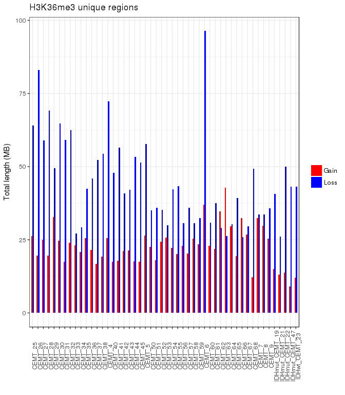
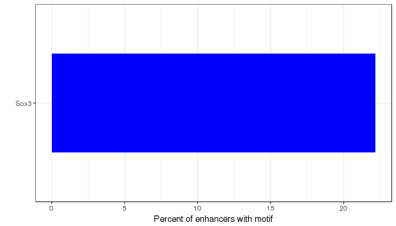
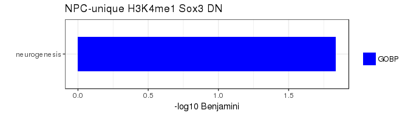
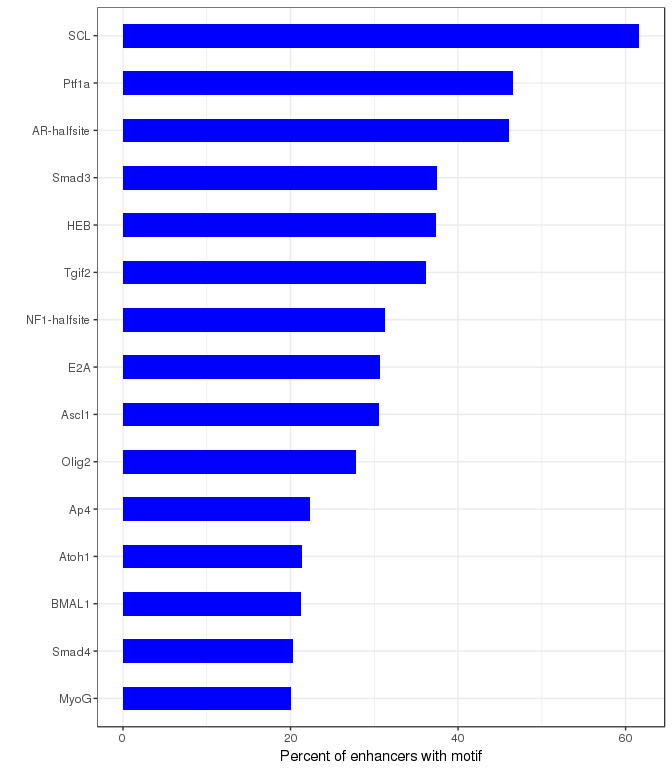

# Glioma - Histone modifications ChIP-seq
Gloria Li  
Jun, 19, 2016  

Updated: Tue Jan 10 17:03:51 2017

## FindER enriched regions 
* FindER v 1.0.0b      

<!-- -->

## Unique enriched regions 
* Pairwise comparisons between glioma samples (S1) and NPC GE04 (S2).   
* Challenge: S1 and S2 often have quite different sequencing depth, thus direct comparisons between ER are likely biased.     
* Input: ER in S1, wig in S1, ER in S2, wig in S2.   
* Method: 
	+ Calculate S1 ER signal in S2 wig.    
	+ Randomly generate a set of background regions (not overlapping with S2 ER) with same length as S1 ER.   
	+ Calculate signal for these background regions in S2 wig, use 90% quantile as cutoff. 
	+ S1 unique ER: S1 ER with signal < background cutoff in S2.   
	
<!-- -->

### Loss of H3K36me3      
* Global loss of H3K36me3 in both IDH mutant and wt gliomas.   
* H3K36me3 loss regions are enriched in genebody but not intergenic regions, while H3K36me3 gain regions are also enriched in intergenic regions.      

<!-- -->

### Histone modification associated DE genes
* As expected, active marks, i.e. H3K27ac and H3K4me3 were significantly associated with transcriptional activation, while H3K27me3 was associated with down regulation.    

<!-- -->

### Unique enhancers and transcription factor activities
* Homer transcription factor binding enrichment analysis for unique enhancers.   
	+ q-value < 0.01
	+ Fraction of enhancers with motif > 20%

#### H3K27ac
* Four transcription factors enriched in NPC-specific H3K27ac, only Sox3 was expressed in NPCs.     
	+ Sox3: function as a switch in neuronal development. Keeps neural cells undifferentiated by counteracting the activity of proneural proteins and suppresses neuronal differentiation.      

<!-- --><!-- --><table>
 <thead>
  <tr>
   <th style="text-align:left;"> ENSG </th>
   <th style="text-align:left;"> Name </th>
  </tr>
 </thead>
<tbody>
  <tr>
   <td style="text-align:left;"> ENSG00000049323 </td>
   <td style="text-align:left;"> LTBP1 </td>
  </tr>
  <tr>
   <td style="text-align:left;"> ENSG00000075213 </td>
   <td style="text-align:left;"> SEMA3A </td>
  </tr>
  <tr>
   <td style="text-align:left;"> ENSG00000079931 </td>
   <td style="text-align:left;"> MOXD1 </td>
  </tr>
  <tr>
   <td style="text-align:left;"> ENSG00000112319 </td>
   <td style="text-align:left;"> EYA4 </td>
  </tr>
  <tr>
   <td style="text-align:left;"> ENSG00000115457 </td>
   <td style="text-align:left;"> IGFBP2 </td>
  </tr>
  <tr>
   <td style="text-align:left;"> ENSG00000116194 </td>
   <td style="text-align:left;"> ANGPTL1 </td>
  </tr>
  <tr>
   <td style="text-align:left;"> ENSG00000120738 </td>
   <td style="text-align:left;"> EGR1 </td>
  </tr>
  <tr>
   <td style="text-align:left;"> ENSG00000135862 </td>
   <td style="text-align:left;"> LAMC1 </td>
  </tr>
  <tr>
   <td style="text-align:left;"> ENSG00000137872 </td>
   <td style="text-align:left;"> SEMA6D </td>
  </tr>
  <tr>
   <td style="text-align:left;"> ENSG00000138193 </td>
   <td style="text-align:left;"> PLCE1 </td>
  </tr>
  <tr>
   <td style="text-align:left;"> ENSG00000138771 </td>
   <td style="text-align:left;"> SHROOM3 </td>
  </tr>
  <tr>
   <td style="text-align:left;"> ENSG00000147145 </td>
   <td style="text-align:left;"> LPAR4 </td>
  </tr>
  <tr>
   <td style="text-align:left;"> ENSG00000156140 </td>
   <td style="text-align:left;"> ADAMTS3 </td>
  </tr>
  <tr>
   <td style="text-align:left;"> ENSG00000158966 </td>
   <td style="text-align:left;"> CACHD1 </td>
  </tr>
  <tr>
   <td style="text-align:left;"> ENSG00000165891 </td>
   <td style="text-align:left;"> E2F7 </td>
  </tr>
  <tr>
   <td style="text-align:left;"> ENSG00000169436 </td>
   <td style="text-align:left;"> COL22A1 </td>
  </tr>
  <tr>
   <td style="text-align:left;"> ENSG00000171004 </td>
   <td style="text-align:left;"> HS6ST2 </td>
  </tr>
  <tr>
   <td style="text-align:left;"> ENSG00000177283 </td>
   <td style="text-align:left;"> FZD8 </td>
  </tr>
  <tr>
   <td style="text-align:left;"> ENSG00000185008 </td>
   <td style="text-align:left;"> ROBO2 </td>
  </tr>
  <tr>
   <td style="text-align:left;"> ENSG00000188467 </td>
   <td style="text-align:left;"> SLC24A5 </td>
  </tr>
  <tr>
   <td style="text-align:left;"> ENSG00000196353 </td>
   <td style="text-align:left;"> CPNE4 </td>
  </tr>
</tbody>
</table>
<!-- --><!-- -->

* No significantly enriched transcription factor in glioma-specific H3K27ac.   

#### H3K4me1
* Three transcription factors were enirched and expressed in NPC-specific H3K4me1: Sox3, Sox6, Lhx2.     
	+ Sox3: function as a switch in neuronal development. Keeps neural cells undifferentiated by counteracting the activity of proneural proteins and suppresses neuronal differentiation.      
	+ Sox6: plays a key role in several developmental processes, including neurogenesis and skeleton formation.      
	+ Lhx2: acts as a transcriptional activator. Transcriptional regulatory protein involved in the control of cell differentiation in developing lymphoid and neural cell types.        
	
<!-- --><!-- -->
<!-- --><!-- --><!-- -->

* Three transcription factors were enriched and expressed in glioma-specific H3K4me1: HEB (TCF12), Ascl1, Olig2.      
	+ HEB: involved in the initiation of neuronal differentiation.     
	+ Ascl1: plays a role in the neuronal commitment and differentiation and in the generation of olfactory and autonomic neurons.      
	+ Olig2: is an essential regulator of ventral neuroectodermal progenitor cell fate. Required for oligodendrocyte and motor neuron specification in the spinal cord, as well as for the development of somatic motor neurons in the hindbrain.      
<!-- --><!-- --><!-- --><!-- --><!-- -->

## Chromatin states
* ChromHMM for 6 core histone marks in glioma and GE04.    

<!-- -->

