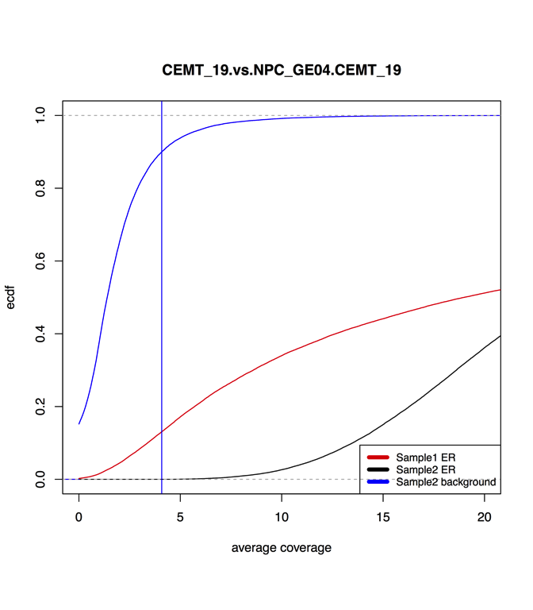

# Glioma - Histone modifications ChIP-seq
Gloria Li  
Jun, 19, 2016  

Updated: Tue Jun 21 17:45:11 2016

## FindER enriched regions 
* Some libraries were much more deeply sequenced than others, i.e. CEMT_47, might lead to increased enriched regions due to increased sequencing depth.     
* Subsample bam files of deeply sequenced libraries to the average coverage of other libraries of the same mark (ran 50 times), and re-run FindER:   
	+ CEMT_21 H3K4me1: 0.4
	+ CEMT_47 H3K4me1: 0.4
	+ CEMT_47 H3K9me3: 0.5
	+ CEMT_47 H3K27me3: 0.4
	+ CEMT_47 H3K27ac: 0.3
* Subsampled libraries (panel 2 and 4) had less enriched regions, but were able to retain the majority of enriched regions.    
* FindER v 1.0.0b      

\

\\\\\

## Chromatin states       
* ChromHMM for 6 core histone marks in glioma and GE04.     

\
\

## Unique enriched regions 
* Pairwise comparisons between glioma samples (S1) and NPC GE04 (S2).   
* Challenge: S1 and S2 often have quite different sequencing depth, thus direct comparisons between ER are likely biased.     
* Input: ER in S1, wig in S1, ER in S2, wig in S2.   
* Method: 
	+ Calculate S1 ER signal in S2 wig.    
	+ Randomly generate a set of background regions (not overlapping with S2 ER) with same length as S1 ER.   
	+ Calculate signal for these background regions in S2 wig, use 90% quantile as cutoff. 
	+ S1 unique ER: S1 ER with signal < background cutoff in S2.     

\
\

