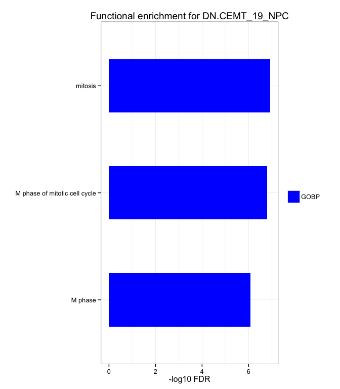

# Glioma - RNA-seq
Gloria Li  
July, 10, 2016  

Updated: Mon Jul 11 00:51:44 2016


## DE glioma vs NPCs
* DEfine of glioma vs four NPC samples (cortex02, GE02, cortex04, GE04), FDR = 0.01.      
* Intersect of DE genes from all four NPC samples.  

### Summary  
* More UP genes than DN genes in all samples, but eps. in IDH-wt (CEMT_23).       

 

### DAVID functional enrichment 

* IDH-mut samples        

       

```
## [1] "No enrichment for DN.CEMT_47_NPC"
```
 
 


