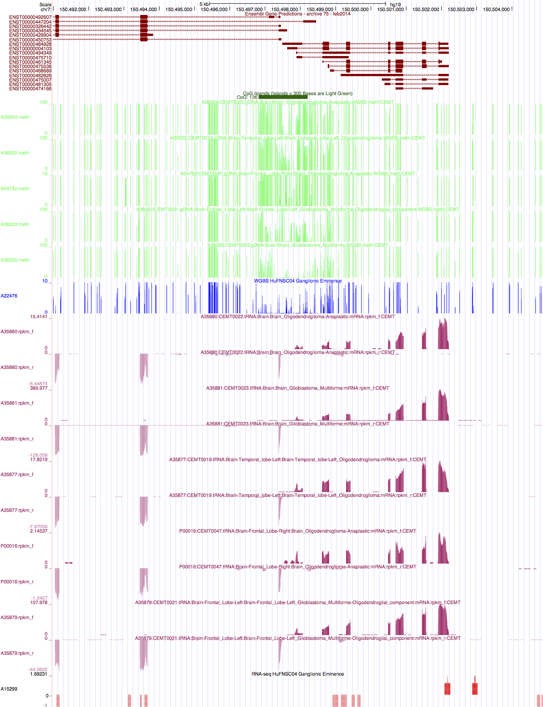

Updated: `r date()`

```{r setup, include = FALSE}
library(ggplot2)
library(plyr)
library(VennDiagram)
library(gridExtra)
library(gplots)
library(dendextend)
library(reshape)
library(wq)
library(dplyr)
library(RCircos)
library(knitr)
load("/projects/epigenomics2/users/lli/glioma/WGBS/WGBS.Rdata")
knitr::opts_chunk$set(message=FALSE, echo = FALSE, warning = FALSE, results = FALSE, fig.height = 6, fig.width = 7) 
knitr::opts_knit$set(root.dir = "/projects/epigenomics2/users/lli/glioma/WGBS/DMR/")
libs <- c("CEMT_19", "CEMT_21", "CEMT_22", "CEMT_23", "CEMT_47")
```

## Global hypermethylation in IDH mut glioma
* Genome-wide and CGI hypermethylation in IDH mutant glioma samples: CEMT19, CEMT22, and CEMT_47.      
* CEMT_21 (10% IDH mutation frequency) showed methylation levels closer to IDH wildtype samples.    
* Whiskers of the box plot represent 10% and 90% quantile.     

```{r global_5mC}
(quantile_5mC_figure)
```

## DNA methylation changes around CGI edges
* CGIs are hypermethylated in IDH mutant gliomas.     
* DNA methylation changes around CGI occur at the edge of CGIs.     

```{r 5mC_CGI, fig.height = 10}
(CGI_edge_delta_figure)
```

## DNA methylation at CTCF loss regions

```{r 5mC_CTCF}
(CTCF_loss_5mC_figure)
```

## DMRs between gliomas and NPCs  
### DMR identification 
  * Identify DM CpGs     
  	+ CpG coverage in both samples $\ge$ 3;        
    + methyl_diff one-sided p-value $\le$ 0.0005;  
    + delta fractional methylation $\ge$ 0.6;  
    + fractional methylation of one sample $\ge$ 0.75.   
  * Collapse DM CpGs into DMRs     
    + adjacent DM CpGs have the same DM status;    
    + distance between adjacent CpGs (size) $\le$ 500bp;   
    + No. of CpGs within each DMR $\ge$ 3.   
    
### Total DMR length
* Hypermethylation in IDH mut samples.    
* Hypomethylation in IDH wt glioma: CEMT_23 (GBM).     
* CEMT_21 had the least amount of DMRs and no bias towards hyper or hypo.      
* Results against different NPCs were reasonably similar (intersect statistically significant).      

```{r DMR_summary}
(DMR_summary_figure)
```

### Percentage of hyper CpGs in hyper CGIs

```{r hyperCG_hyperDMR}
(CGI_DMR_hyper_DM_figure)
```

### Methylated CGIs associated with transcription   

```{r CGI_K36}
kable(CGI_hyper_summary, format = "html", align = "c", row.names = F)
```

### Hypermethylated CGIs associated with transcription   
* There are on average 15% of hypermethylated CGIs overlapping with H3K36me3 enriched regions, 8% of them are not in genebody in IDH mut gliomas, suggesting possible enhancer RNA expression.    

```{r DMR_CGI_K36}
kable(CGI_DMR_hyper_summary, format = "html", align = "c", row.names = F)
```

        

### DMR enrichment in genomic regions 
* Enriched in CGIs and CGI shores, esp. hypermethylation in CGIs.    
* Promoter: TSS +/- 2kb; CGI_shore: CGI +/- 2kb.      

```{r DMR_genomicBreak}
(genomic_breakdown_figure)
```

### DMR associated with DE genes
* Hypermethylated DMRs in the promoter regions are significantly associated with both UP and DN regulated genes.         

```{r DMR_DE}
(DMR_DE_figure)
```

        

### DMR enrichment in chromatin states
* Hypermethylated regions were enriched in H3K27me3 marked chromatin states.       
* Hypomethylated regions were enriched in enhancer regions.    

```{r DMR_ChromHMM}
(DMR_ChromHMM_summary_figure)
```

### DMR intersect with differentially marked histone modifications  

```{r DMR_DHM}
(DMR_DHM_enrich_figure)
```

### DMR GREAT analysis
* DMR - gene association
	+ Proximal: 5kb upstream, 1kb downstream.     
	+ Distal: up to 20kb.         

#### Hypermethylated DMRs
* IDH mut and wt samples showed different terms, and CEMT_21 showed similar terms as wt.      
	+ Disease Ontology: mut showed CNS/brain disease.     
	+ GOBP: mut showed neurogenesis/brain development, wt showed regulation of biosynthetic process.   
	+ GOCC: wt showed transcription factor complex, mut also showed membranes and neurons.         

```{r DMR_GREAT_hyper, fig.height=9}
(GREAT_DMR_CEMT_19_hyper)
(GREAT_DMR_CEMT_22_hyper)
(GREAT_DMR_CEMT_47_hyper)
(GREAT_DMR_CEMT_21_hyper)
(GREAT_DMR_CEMT_23_hyper)
```

#### Hypomethylated DMRs
* IDH mut had few significant term (CEMT22 had none), wt had cancer related terms, and CEMT21 showed similar terms to mut.   

```{r DMR_GREAT_hypo1, fig.height=4}
(GREAT_DMR_CEMT_19_hypo)
(GREAT_DMR_CEMT_21_hypo)
(GREAT_DMR_CEMT_47_hypo)
```
```{r DMR_GREAT_hypo2, fig.height=8}
(GREAT_DMR_CEMT_23_hypo)
```


