# Glioma - DNA methylation
Gloria Li  
May 24, 2016  

Updated: Tue Jun 13 13:28:59 2017

## RPKM of DNA methylation regulators

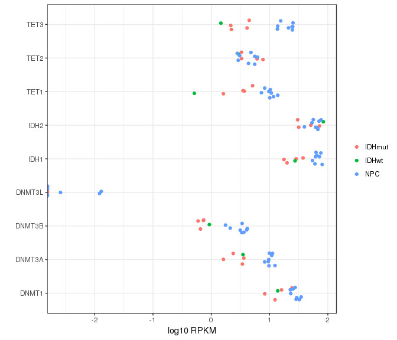<!-- -->

## CpG coverage profile
* TCGA data have particularly lower coverage.       

<!-- -->

## Global hypermethylation in IDH mut glioma
* Genome-wide and CGI hypermethylation in IDH mutant glioma samples: CEMT19, CEMT22, and CEMT_47.      
* CEMT_21 (10% IDH mutation frequency) showed methylation levels closer to IDH wildtype samples.    
* TCGA data seem to have lower fractional methylation geonme-wide, possibly due to different processing pipeline.         
* Whiskers of the box plot represent 10% and 90% quantile.     

<!-- -->

## Clustering
* CGI clustering showed clusters based on IDH mut and wt.      

<!-- -->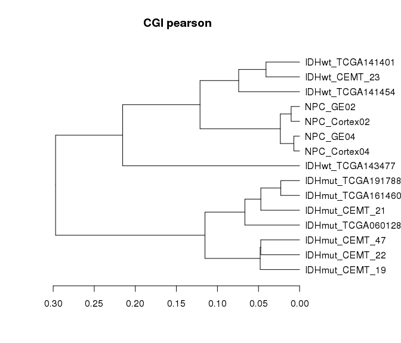<!-- -->

## Enhancer and 5mC
* Hypermethylated enhancers also present at promoters - more so in IDH mutant glioma    
* Expression levels of the closest genes are not significantly affected by 5mC at these bivalent enhancers     
* Genes associated with each profile group are significantly overlapped across the three IDH mutant gliomas        

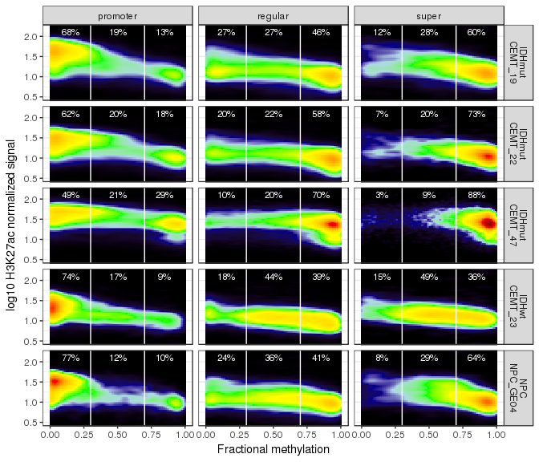<!-- --><!-- --><!-- -->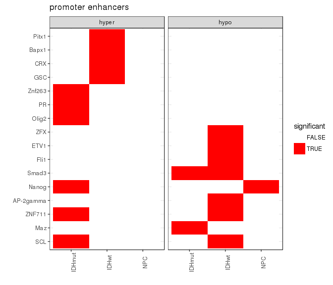<!-- --><!-- -->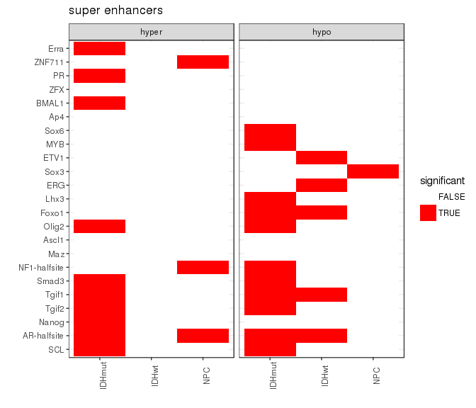<!-- --><!-- --><!-- --><!-- -->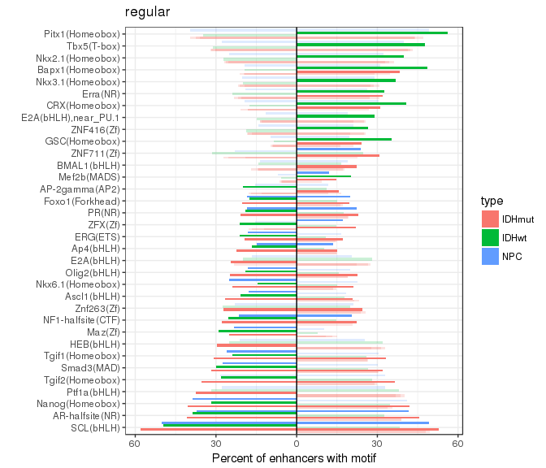<!-- -->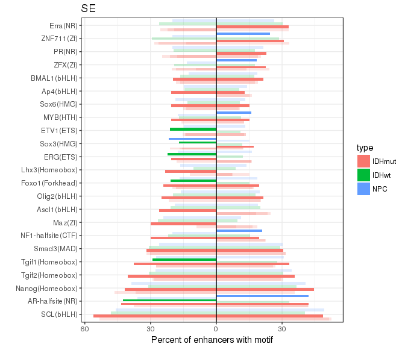<!-- -->

## DNA methylation changes around CGI edges
* CGIs are hypermethylated in IDH mutant gliomas.     
* DNA methylation changes around CGI occur at the edge of CGIs.     

<!-- -->

## DMRs between gliomas and NPCs  
### DMR identification 
  * Identify DM CpGs     
  	+ CpG coverage in both samples $\ge$ 3;        
    + methyl_diff one-sided p-value $\le$ 0.0005;  
    + delta fractional methylation $\ge$ 0.6;  
    + fractional methylation of one sample $\ge$ 0.75.   
  * Collapse DM CpGs into DMRs     
    + adjacent DM CpGs have the same DM status;    
    + distance between adjacent CpGs (size) $\le$ 500bp;   
    + No. of CpGs within each DMR $\ge$ 3.   
    
### Total DMR length
* Hypermethylation in IDH mut samples.    
* Hypomethylation in IDH wt glioma: CEMT_23 (GBM).     
* CEMT_21 had the least amount of DMRs and no bias towards hyper or hypo.      
* Results against different NPCs were reasonably similar (intersect statistically significant).      

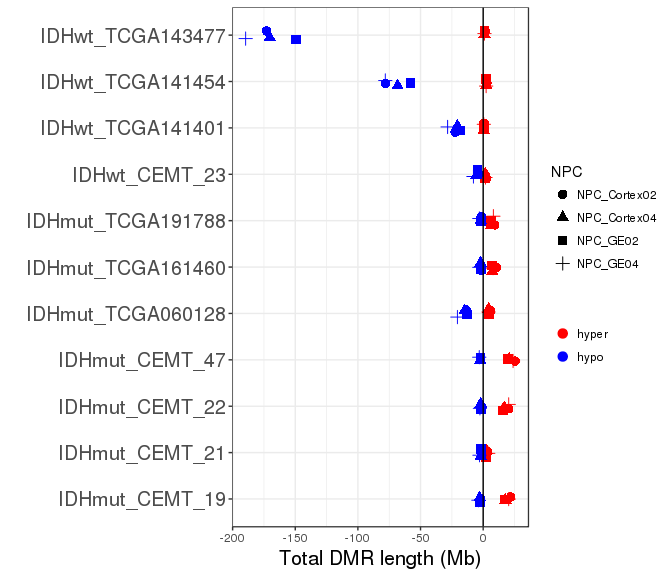<!-- -->

### DMR GREAT analysis
* DMR - gene association
	+ Proximal: 5kb upstream, 1kb downstream.     
	+ Distal: up to 20kb.         

#### Hypermethylated DMRs
* IDH mut and wt samples showed different terms, and CEMT_21 showed similar terms as wt.      
	+ Disease Ontology: mut showed CNS/brain disease.     
	+ GOBP: mut showed neurogenesis/brain development, wt showed regulation of biosynthetic process.   
	+ GOCC: wt showed transcription factor complex, mut also showed membranes and neurons.         

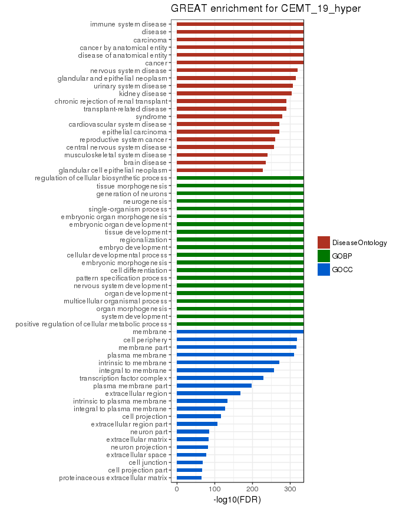<!-- --><!-- --><!-- --><!-- --><!-- -->

#### Hypomethylated DMRs
* IDH mut had few significant term (CEMT22 had none), wt had cancer related terms, and CEMT21 showed similar terms to mut.   

<!-- --><!-- --><!-- -->
<!-- -->

### Percentage of hyper CpGs in hyper CGIs

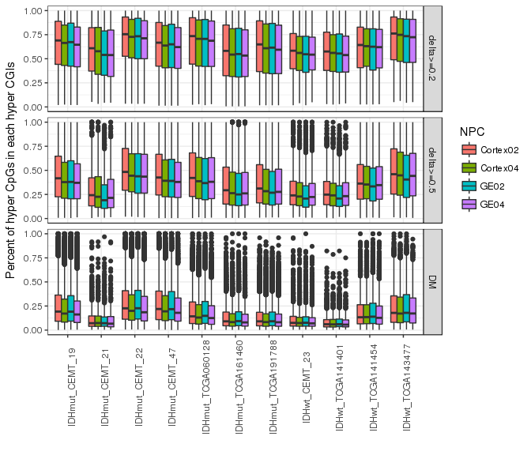<!-- -->

### Methylated CGIs associated with transcription   

<table>
 <thead>
  <tr>
   <th style="text-align:center;"> Sample </th>
   <th style="text-align:center;"> CGI </th>
   <th style="text-align:center;"> CGI_hyper </th>
   <th style="text-align:center;"> CGI_K36 </th>
   <th style="text-align:center;"> CGI_hyper_K36 </th>
   <th style="text-align:center;"> p </th>
  </tr>
 </thead>
<tbody>
  <tr>
   <td style="text-align:center;"> IDHmut_CEMT_19 </td>
   <td style="text-align:center;"> 5066 </td>
   <td style="text-align:center;"> 1685 </td>
   <td style="text-align:center;"> 0 </td>
   <td style="text-align:center;"> 0 </td>
   <td style="text-align:center;"> 0 </td>
  </tr>
  <tr>
   <td style="text-align:center;"> IDHmut_CEMT_21 </td>
   <td style="text-align:center;"> 5066 </td>
   <td style="text-align:center;"> 1085 </td>
   <td style="text-align:center;"> 0 </td>
   <td style="text-align:center;"> 0 </td>
   <td style="text-align:center;"> 0 </td>
  </tr>
  <tr>
   <td style="text-align:center;"> IDHmut_CEMT_22 </td>
   <td style="text-align:center;"> 5066 </td>
   <td style="text-align:center;"> 1739 </td>
   <td style="text-align:center;"> 0 </td>
   <td style="text-align:center;"> 0 </td>
   <td style="text-align:center;"> 0 </td>
  </tr>
</tbody>
</table>

### Hypermethylated CGIs associated with transcription   
* There are on average 15% of hypermethylated CGIs overlapping with H3K36me3 enriched regions, 8% of them are not in genebody in IDH mut gliomas, suggesting possible enhancer RNA expression.    

<table>
 <thead>
  <tr>
   <th style="text-align:center;"> Sample </th>
   <th style="text-align:center;"> hyper </th>
   <th style="text-align:center;"> CGI </th>
   <th style="text-align:center;"> Non.gene_CGI </th>
   <th style="text-align:center;"> H3K36me3 </th>
   <th style="text-align:center;"> Non.gene </th>
   <th style="text-align:center;"> p_Fisher </th>
  </tr>
 </thead>
<tbody>
  <tr>
   <td style="text-align:center;"> CEMT_19 </td>
   <td style="text-align:center;"> 19105 </td>
   <td style="text-align:center;"> 6042 </td>
   <td style="text-align:center;"> 1197 </td>
   <td style="text-align:center;"> 946 </td>
   <td style="text-align:center;"> 72 </td>
   <td style="text-align:center;"> 1.0000000 </td>
  </tr>
  <tr>
   <td style="text-align:center;"> CEMT_21 </td>
   <td style="text-align:center;"> 1793 </td>
   <td style="text-align:center;"> 313 </td>
   <td style="text-align:center;"> 50 </td>
   <td style="text-align:center;"> 61 </td>
   <td style="text-align:center;"> 5 </td>
   <td style="text-align:center;"> 0.9568727 </td>
  </tr>
  <tr>
   <td style="text-align:center;"> CEMT_22 </td>
   <td style="text-align:center;"> 17291 </td>
   <td style="text-align:center;"> 4733 </td>
   <td style="text-align:center;"> 919 </td>
   <td style="text-align:center;"> 843 </td>
   <td style="text-align:center;"> 64 </td>
   <td style="text-align:center;"> 1.0000000 </td>
  </tr>
  <tr>
   <td style="text-align:center;"> CEMT_47 </td>
   <td style="text-align:center;"> 22146 </td>
   <td style="text-align:center;"> 6034 </td>
   <td style="text-align:center;"> 1222 </td>
   <td style="text-align:center;"> 629 </td>
   <td style="text-align:center;"> 36 </td>
   <td style="text-align:center;"> 1.0000000 </td>
  </tr>
  <tr>
   <td style="text-align:center;"> CEMT_23 </td>
   <td style="text-align:center;"> 1718 </td>
   <td style="text-align:center;"> 703 </td>
   <td style="text-align:center;"> 107 </td>
   <td style="text-align:center;"> 162 </td>
   <td style="text-align:center;"> 5 </td>
   <td style="text-align:center;"> 1.0000000 </td>
  </tr>
</tbody>
</table>

        

### DMR enrichment in genomic regions 
* Enriched in CGIs and CGI shores, esp. hypermethylation in CGIs.    
* Promoter: TSS +/- 2kb; CGI_shore: CGI +/- 2kb.      

<!-- -->

### DMR enrichment in chromatin states
* Hypermethylated regions were enriched in H3K27me3 marked chromatin states.       
* Hypomethylated regions were enriched in enhancer regions.    

<!-- -->

### DMR intersect with differentially marked histone modifications  

<!-- -->

### DMR associated with DE genes
* Hypermethylated DMRs in the promoter regions are significantly associated with both UP and DN regulated genes.         

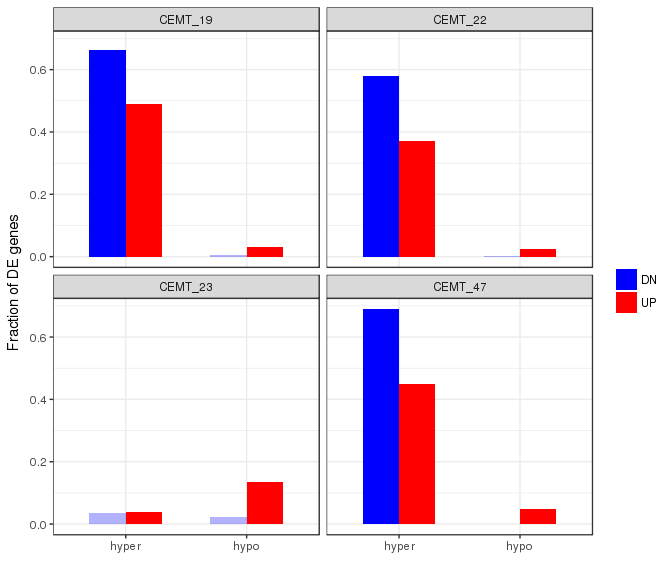<!-- --><table>
 <thead>
  <tr>
   <th style="text-align:center;"> Sample </th>
   <th style="text-align:center;"> hyper_promoter </th>
   <th style="text-align:center;"> UP_2FC </th>
   <th style="text-align:center;"> H3K27ac </th>
  </tr>
 </thead>
<tbody>
  <tr>
   <td style="text-align:center;"> CEMT_19 </td>
   <td style="text-align:center;"> 7840 </td>
   <td style="text-align:center;"> 1940 </td>
   <td style="text-align:center;"> 1332 </td>
  </tr>
  <tr>
   <td style="text-align:center;"> CEMT_21 </td>
   <td style="text-align:center;"> 406 </td>
   <td style="text-align:center;"> 82 </td>
   <td style="text-align:center;"> 52 </td>
  </tr>
  <tr>
   <td style="text-align:center;"> CEMT_22 </td>
   <td style="text-align:center;"> 6633 </td>
   <td style="text-align:center;"> 1622 </td>
   <td style="text-align:center;"> 1005 </td>
  </tr>
  <tr>
   <td style="text-align:center;"> CEMT_23 </td>
   <td style="text-align:center;"> 612 </td>
   <td style="text-align:center;"> 205 </td>
   <td style="text-align:center;"> 62 </td>
  </tr>
  <tr>
   <td style="text-align:center;"> CEMT_47 </td>
   <td style="text-align:center;"> 8149 </td>
   <td style="text-align:center;"> 1959 </td>
   <td style="text-align:center;"> 1340 </td>
  </tr>
</tbody>
</table>

        

