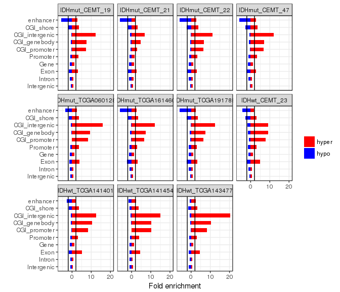
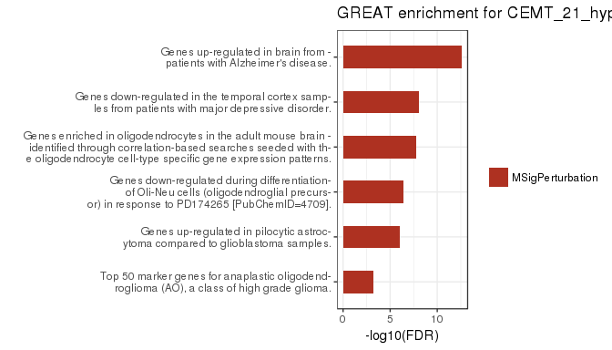

# Glioma - DNA methylation
Gloria Li  
May 24, 2016  

Updated: Tue May 24 22:04:55 2016

## Global hypermethylation in IDH mut glioma
* Genome-wide and CGI hypermethylation in IDH mutant glioma samples: CEMT19, CEMT22, and CEMT_47.      
* CEMT_21 (10% IDH mutation frequency) showed methylation levels closer to IDH wildtype samples.    
* Whiskers of the box plot represent 10% and 90% quantile.     

## DMRs between gliomas and NPCs  
### Total DMR length
* Hypermethylation in IDH mut samples.    
* Hypomethylation in IDH wt glioma: CEMT_23 (GBM).     
* CEMT_21 had the least amount of DMRs and no bias towards hyper or hypo.      
* Results against different NPCs were reasonably similar (intersect statistically significant).      

### DMR length distribution (QC) 
* Mostly evenly distributed with median ~ 300bp.      

### DMR frequency distribution 
* Mostly evenly distributed across different chromosomes.   
* chrX has least amount of DMRs, almost none hypo ones in IDH mutant samples: _smaller number of hypo DMRs?_

### DMR enrichment in genomic regions 
* Enriched in CGIs and CGI shores, esp. hypermethylation in CGIs.    
* Promoter: TSS +/- 2kb; CGI_shore: CGI +/- 2kb.      

### DMR distance to CGIs
* Distance between mid-point of DMRs and mid-point of closest CGI, normalized against length of the CGI (0: CGI mid-point; +/-1: CGI boundaries).      
* Hypomethylated regions were enriched at CGI shores.    
* IDH wt (CEMT23) hypermethylated regions were enriched at CGI centres.      
* IDH mut samples hypermethylated regions were enriched towards the edge of CGI, except CEMT19 and CEMT47 were also enriched at CGI centres.        

### DMR GREAT analysis
* DMR - gene association
	+ Proximal: 5kb upstream, 1kb downstream.     
	+ Distal: up to 20kb.         

#### Hypermethylated DMRs
* IDH mut and wt samples showed different terms, and CEMT_21 showed similar terms as wt.      
	+ Disease Ontology: mut showed CNS/brain disease.     
	+ GOBP: mut showed neurogenesis/brain development, wt showed regulation of biosynthetic process.   
	+ GOCC: wt showed transcription factor complex, mut also showed membranes and neurons.         

#### Hypomethylated DMRs
* IDH mut had few significant term (CEMT22 had none), wt had cancer related terms, and CEMT21 showed similar terms to mut.   

