# Glioma - DNA methylation
Gloria Li  
May 24, 2016  

Updated: Mon Jul 11 09:57:08 2016

## Global hypermethylation in IDH mut glioma
* Genome-wide and CGI hypermethylation in IDH mutant glioma samples: CEMT19, CEMT22, and CEMT_47.      
* CEMT_21 (10% IDH mutation frequency) showed methylation levels closer to IDH wildtype samples.    
* Whiskers of the box plot represent 10% and 90% quantile.     

\

## DNA methylation changes around CGI edges
* DNA methylation changes around CGI occurred across the entire region.     

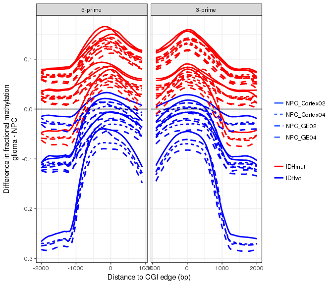\

## DMRs between gliomas and NPCs  
### Total DMR length
* Hypermethylation in IDH mut samples.    
* Hypomethylation in IDH wt glioma: CEMT_23 (GBM).     
* CEMT_21 had the least amount of DMRs and no bias towards hyper or hypo.      
* Results against different NPCs were reasonably similar (intersect statistically significant).      

\

### DMR length distribution (QC) 
* Mostly evenly distributed with median ~ 300bp.      

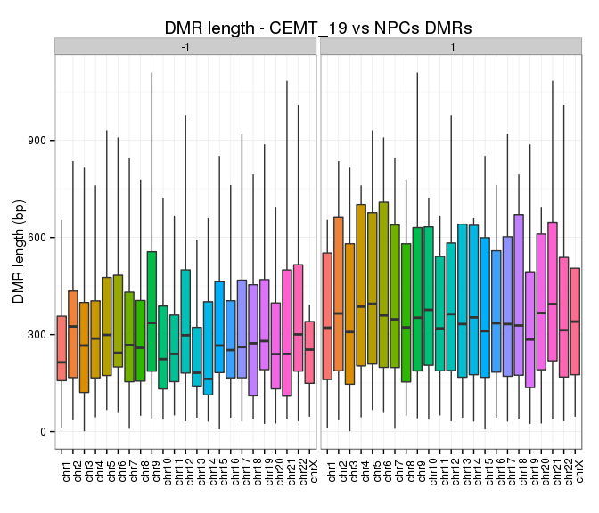\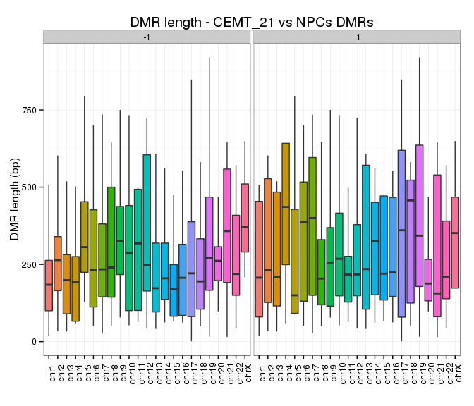\\\\

### DMR frequency distribution 
* Mostly evenly distributed across different chromosomes.  
* Frequencies in CEMT21 and CEMT23 vs NPCs were comparable to observed between NPCs.        
* chrX has least amount of DMRs, almost none hypo ones in IDH mutant samples: _smaller number of hypo DMRs?_

\\\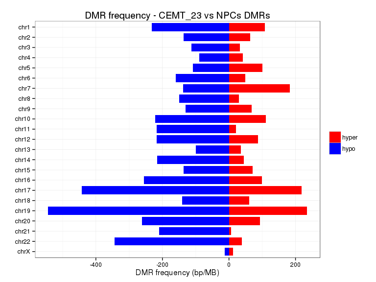\\

### DMR enrichment in genomic regions 
* Enriched in CGIs and CGI shores, esp. hypermethylation in CGIs.    
* Promoter: TSS +/- 2kb; CGI_shore: CGI +/- 2kb.      

\

### DMR enrichment in chromatin states
* Hypermethylated regions were enriched in H3K27me3 marked chromatin states.       
* Hypomethylated regions were enriched in enhancer regions.    

\

### DMR distance to CGIs
* Distance between mid-point of DMRs and mid-point of closest CGI, normalized against length of the CGI (0: CGI mid-point; +/-1: CGI boundaries).      
* Hypomethylated regions were enriched at CGI shores.    
* IDH wt (CEMT23) hypermethylated regions were enriched at CGI centres.      
* IDH mut samples hypermethylated regions were enriched towards the edge of CGI, except CEMT19 and CEMT47 were also enriched at CGI centres.        

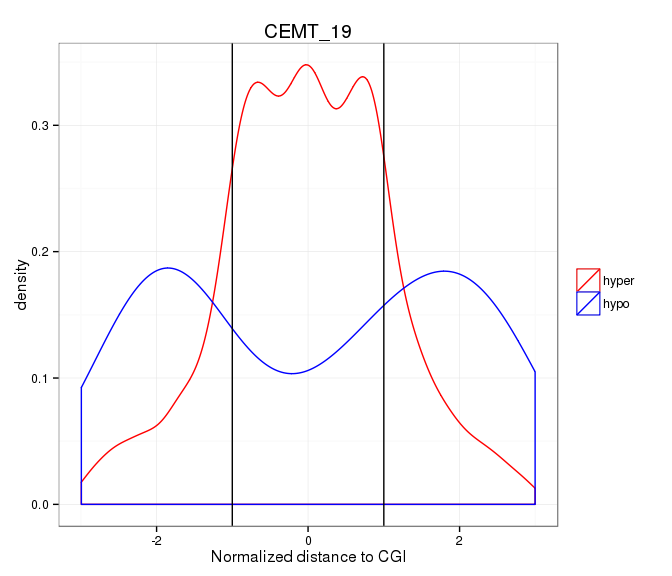\\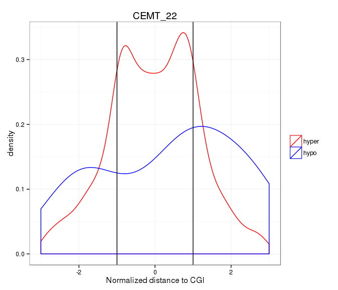\\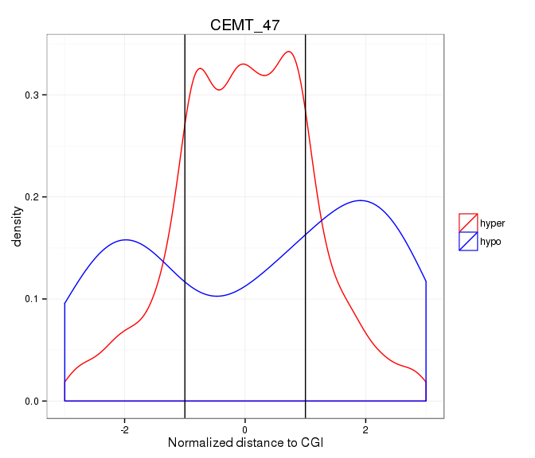\

### DMR GREAT analysis
* DMR - gene association
	+ Proximal: 5kb upstream, 1kb downstream.     
	+ Distal: up to 20kb.         

#### Hypermethylated DMRs
* IDH mut and wt samples showed different terms, and CEMT_21 showed similar terms as wt.      
	+ Disease Ontology: mut showed CNS/brain disease.     
	+ GOBP: mut showed neurogenesis/brain development, wt showed regulation of biosynthetic process.   
	+ GOCC: wt showed transcription factor complex, mut also showed membranes and neurons.         

\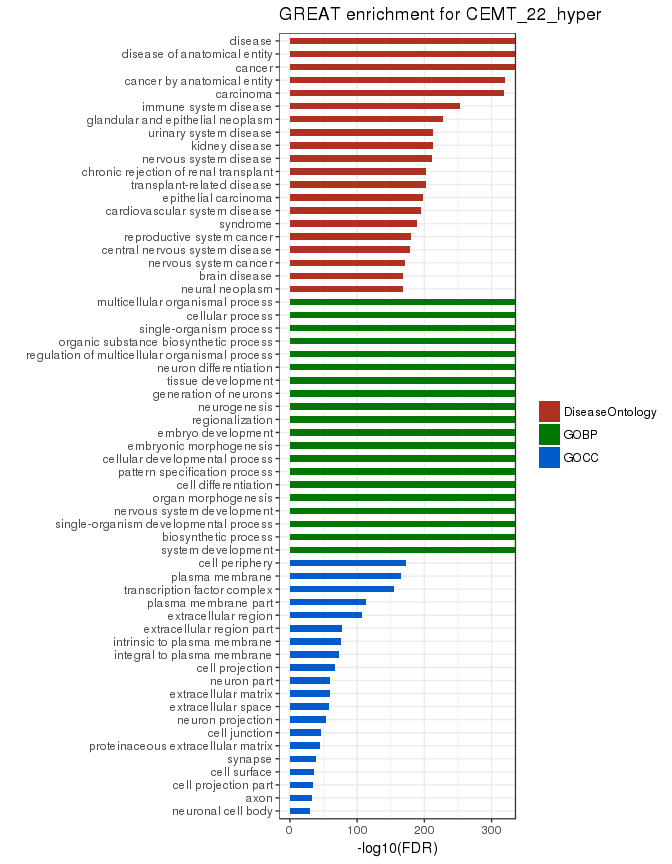\\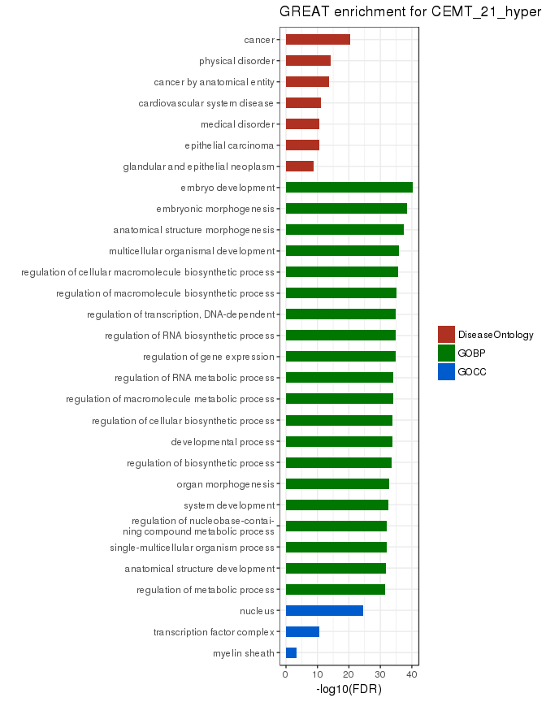\\

#### Hypomethylated DMRs
* IDH mut had few significant term (CEMT22 had none), wt had cancer related terms, and CEMT21 showed similar terms to mut.   

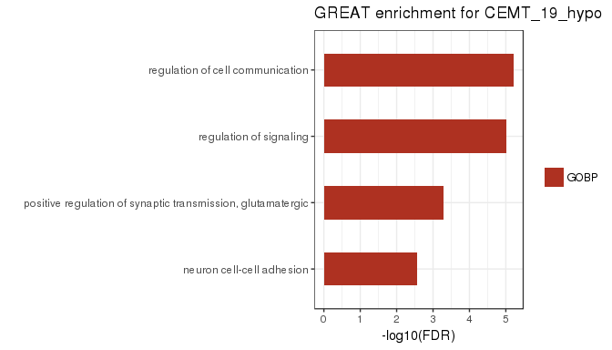\\\
\

### DMR intersect 
* Jaccard similarity: intersect (bp) / union (bp).      
* DMRs between IDH mut vs NPCs were more similar.      
* CEMT21 and CEMT_23 (wt) were not similar to IDH mut samples, nor were they similar to each other.       

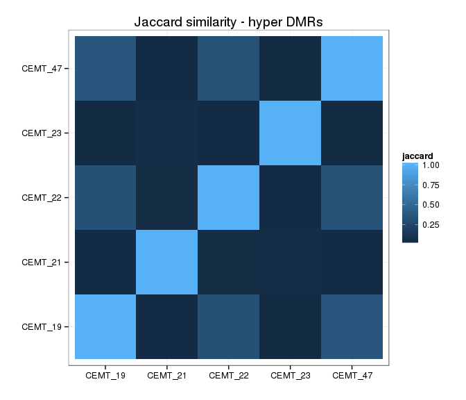\\<table>
 <thead>
  <tr>
   <th style="text-align:center;"> sample1 </th>
   <th style="text-align:center;"> sample2 </th>
   <th style="text-align:center;"> hyper_percent1 </th>
   <th style="text-align:center;"> hyper_percent2 </th>
   <th style="text-align:center;"> hypo_percent1 </th>
   <th style="text-align:center;"> hypo_percent2 </th>
  </tr>
 </thead>
<tbody>
  <tr>
   <td style="text-align:center;"> CEMT_19 </td>
   <td style="text-align:center;"> CEMT_21 </td>
   <td style="text-align:center;"> 0.0312 </td>
   <td style="text-align:center;"> 0.7425 </td>
   <td style="text-align:center;"> 0.1275 </td>
   <td style="text-align:center;"> 0.3044 </td>
  </tr>
  <tr>
   <td style="text-align:center;"> CEMT_19 </td>
   <td style="text-align:center;"> CEMT_22 </td>
   <td style="text-align:center;"> 0.3944 </td>
   <td style="text-align:center;"> 0.6419 </td>
   <td style="text-align:center;"> 0.2418 </td>
   <td style="text-align:center;"> 0.5833 </td>
  </tr>
  <tr>
   <td style="text-align:center;"> CEMT_19 </td>
   <td style="text-align:center;"> CEMT_23 </td>
   <td style="text-align:center;"> 0.0293 </td>
   <td style="text-align:center;"> 0.5505 </td>
   <td style="text-align:center;"> 0.0576 </td>
   <td style="text-align:center;"> 0.0320 </td>
  </tr>
  <tr>
   <td style="text-align:center;"> CEMT_19 </td>
   <td style="text-align:center;"> CEMT_47 </td>
   <td style="text-align:center;"> 0.5303 </td>
   <td style="text-align:center;"> 0.5470 </td>
   <td style="text-align:center;"> 0.3322 </td>
   <td style="text-align:center;"> 0.4198 </td>
  </tr>
  <tr>
   <td style="text-align:center;"> CEMT_21 </td>
   <td style="text-align:center;"> CEMT_22 </td>
   <td style="text-align:center;"> 0.6218 </td>
   <td style="text-align:center;"> 0.0425 </td>
   <td style="text-align:center;"> 0.1687 </td>
   <td style="text-align:center;"> 0.1705 </td>
  </tr>
  <tr>
   <td style="text-align:center;"> CEMT_21 </td>
   <td style="text-align:center;"> CEMT_23 </td>
   <td style="text-align:center;"> 0.1180 </td>
   <td style="text-align:center;"> 0.0933 </td>
   <td style="text-align:center;"> 0.1227 </td>
   <td style="text-align:center;"> 0.0285 </td>
  </tr>
  <tr>
   <td style="text-align:center;"> CEMT_21 </td>
   <td style="text-align:center;"> CEMT_47 </td>
   <td style="text-align:center;"> 0.7221 </td>
   <td style="text-align:center;"> 0.0313 </td>
   <td style="text-align:center;"> 0.2219 </td>
   <td style="text-align:center;"> 0.1174 </td>
  </tr>
  <tr>
   <td style="text-align:center;"> CEMT_22 </td>
   <td style="text-align:center;"> CEMT_23 </td>
   <td style="text-align:center;"> 0.0322 </td>
   <td style="text-align:center;"> 0.3725 </td>
   <td style="text-align:center;"> 0.0679 </td>
   <td style="text-align:center;"> 0.0156 </td>
  </tr>
  <tr>
   <td style="text-align:center;"> CEMT_22 </td>
   <td style="text-align:center;"> CEMT_47 </td>
   <td style="text-align:center;"> 0.6457 </td>
   <td style="text-align:center;"> 0.4092 </td>
   <td style="text-align:center;"> 0.5373 </td>
   <td style="text-align:center;"> 0.2815 </td>
  </tr>
  <tr>
   <td style="text-align:center;"> CEMT_23 </td>
   <td style="text-align:center;"> CEMT_47 </td>
   <td style="text-align:center;"> 0.5172 </td>
   <td style="text-align:center;"> 0.0284 </td>
   <td style="text-align:center;"> 0.0255 </td>
   <td style="text-align:center;"> 0.0581 </td>
  </tr>
</tbody>
</table>

### DMR intersect with differentially marked histone modifications  

\

